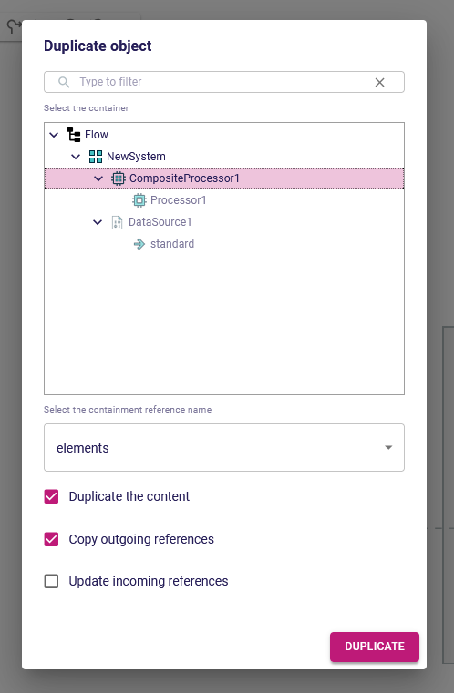
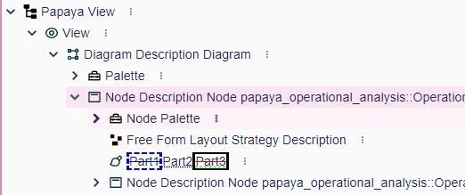
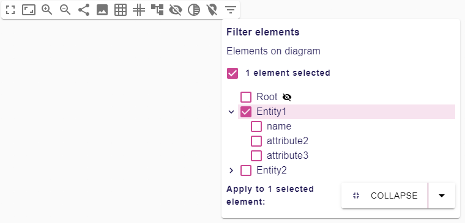
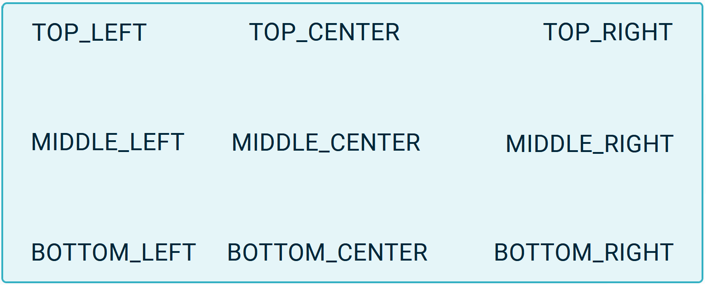
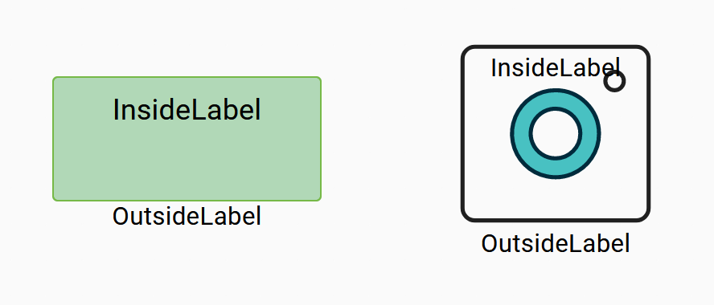

= Changelog

== 2026.1.0 (work in progress)

=== Shapes

- Allow configuration of workbench panels


=== Architectural decision records

- [ADR-218] Ensure Elasticsearch query results contain enough information
- [ADR-219] Add a way to customize the tree displayed to select the candidates in a Reference Widget


=== Deprecation warning


=== Breaking changes

- https://github.com/eclipse-sirius/sirius-web/issues/5684[#5684] `IToolService`, `org.eclipse.sirius.components.diagrams.tools` and `ToolConverter` have been removed.
Tools are no longer converted with the diagram.
You can use `IViewToolFinder` to find a node or edge tool in a view dsl.
`IToolDiagramExecutor` has been rename to `ISingleClickOnOneDiagramElementHandler` and `ISingleClickOnTwoDiagramElementHandler` has been added, these interface are used to execute a tool from the `InvokeSingleClickOnDiagramElementToolEventHandler` and `InvokeSingleClickOnTwoDiagramElementsToolEventHandler`
- https://github.com/eclipse-sirius/sirius-web/issues/3486[#3486] Nodes and edges have a new `deletable` attribute in the GraphQL Schema that custom nodes must consider in their converter.
On the backend, the node and edge's `deleteHandler` can now be `null` if no semantic deletion tool is defined for this element.
`IViewNodeDeleteHandler`, which only existed to provide a non-null handler able to tell if there was a semantic deletion tool, has been removed.
https://github.com/eclipse-sirius/sirius-web/issues/5782[#5782] [diagram] The input `GetPaletteInput` will now require a list of diagram element ids instead of a single one to retrieve a palette for multiple elements selected at once.
In a similar manner, `InvokeSingleClickOnDiagramElementToolInput` will now ask for a list of diagram element ids to execute a tool on multiple elements are once
- https://github.com/eclipse-sirius/sirius-web/issues/5942[#5942] The signature of the method `canHandle` of the various event handlers has changed: it now takes the `IEditingContext` as a parameter in addition to the `input`
- https://github.com/eclipse-sirius/sirius-web/issues/5272[#5272] The parameter `representationId` has been removed from the API `ITreeFilterProvider#get`.
The `ExplorerRepresentationMetadataProvider` has been updated to provide only the metadata for the default Sirius-Web explorer.
Each custom explorer definition will now be in control of its metadata.
For that, custom explorers must provide their own implementation of `IRepresentationMetadataProvider`.
- https://github.com/eclipse-sirius/sirius-web/issues/5507[#5507] [form] All form based GraphQL subscription using the type `FormRefreshedEventPayload` may need to also add `FormCapabilitiesRefreshedEventPayload` to their union.
React components `FormRepresentation`, `DiagramFilterForm`, `DetailsView`, `RelatedElementsView`, and `RepresentationsView` stopped relying on `readOnly` props in favor of the `FormCapabilities#canEdit` capabilities.
All tests based on form subscriptions will now receive both `FormRefreshedEventPayload` and `FormCapabilitiesRefreshedEventPayload`.
Those tests will have to be updated to take this new payload into account.
- https://github.com/eclipse-sirius/sirius-web/issues/5174[#5174] The `createProjectFromTemplate` mutation and all associated types (e.g. `CreateProjectFromTemplateInput` and `CreateProjectFromTemplateSuccessPayload`) and test helpers (`CreateProjectFromTemplateMutationRunner`) have been removed.
The ability to specify a project template when creating a project is now integrated directly into the main `createProject` mutation, through the new `templateId` field in `CreateProjectInput`.
As part of this change, creating a project from a template can no longer automatically open an initial representation, but this feature will be reintroduced through a different mechanism.
The ability to specify the natures of the project to be created has been removed from the GraphQL schema along with the natures of a project template and the related DTOs since this concern is now handled internally thanks to the project template.
The lifecycle of the initialization of the projects has been simplified compared to the previous version which was taking some shortcut with the proper lifecycle of the application.
As a consequence, the interface `IProjectTemplateInitializer` has been renamed to `ISemanticDataInitializer` and it will only be in charge of the creation of the semantic data of a project.
It previously was used to manipulate both the semantic data and the representation bounded contexts.
Now each `ISemanticDataInitializer` will be in charge of calling the `IEditingContextPersistenceService` to save the semantic data updated thanks to the project template.
This responsibility has been transfered to the semantic data initializer in order to offer the possibility to provide a custom cause for the persistence of the semantic data.
Since the lifecycle now matches our best practices, the creation of some initial representation by a template will have to be performed in another service listening for the relevant event.
By having the ability to specify a custom event, one can provide some custom data between the service creating the semantic data and the one creating the representations.
An example is visible in `StudioSemanticDataInitializer` and `StudioRepresentationInitializer`.
On top of that a new interface, `IRestDefaultProjectTemplateProvider`, is available for those who want to specify the default template to use when a project is created thanks to the rest API.
This API will probably slightly evolve in the futur but it provides today the ability to change the project created from the default "Blank Project".
On the frontend, the `ProjectTemplateCard` component has been removed; the `NewProjectCard` component handles all cases now, with a new `template` prop.


=== Dependency update

- [releng] Switch to https://github.com/spring-projects/spring-boot/releases/tag/v3.5.8[Spring Boot 3.5.8]
- [releng] Switch to https://eclipse.dev/elk/downloads/releasenotes/release-0.11.0.html[elkjs 0.11.0]


=== Bug fixes

- https://github.com/eclipse-sirius/sirius-web/issues/5855[#5855] [diagram] Prevent hidden edges from being considered for CrossFade Tunnel detection
- https://github.com/eclipse-sirius/sirius-web/issues/5832[#5832] [sirius-web] Fix an error when duplicating a project while a representation is opened in the original project.
- https://github.com/eclipse-sirius/sirius-web/issues/5720[#5720] [explorer] Fixed an issue where the initial search for an element with the Omnibox would not reveal the selected element in the _Explorer_
- https://github.com/eclipse-sirius/sirius-web/issues/5896[#5896] Add missing translations for edge appearance menu
- https://github.com/eclipse-sirius/sirius-web/issues/5912[#5912] [diagram] Fix an issue where edge handles could be rendered in the wrong position
- https://github.com/eclipse-sirius/sirius-web/issues/5924[#5924] [diagram] Prevent a simple move on its parent from triggering a diagram drop
- https://github.com/eclipse-sirius/sirius-web/issues/5840[#5840] Ensure impact analysis handlers always return an `InvokeImpactAnalysisSuccessPayload`.
Errors happening during the execution of the impact analysis are now displayed as additional messages in the impact analysis dialog.
Note that the impact analysis dialog may contain error messages _and_ partial impacts on the model, if the underlying operation failed after having performed some changes on the model.
- https://github.com/eclipse-sirius/sirius-web/issues/5918[#5918] [tree] Fix tree representations flickering when expanding/collapsing an item
- https://github.com/eclipse-sirius/sirius-web/issues/5834[#5834] [diagram] Fix hidden edge handles when selected from the global selection


=== New Features

- https://github.com/eclipse-sirius/sirius-web/issues/5806[#5806] [sirius-web] Add a command in the projects omnibox to perform cross-project queries.
The command relies on Elasticsearch's _query string_, which provides syntactical constructs to query fields, use wildcards, regular expressions, and fuzziness.
You can check the https://www.elastic.co/docs/reference/query-languages/query-dsl/query-dsl-query-string-query#query-string-syntax[documentation] for more information, including a list of reserved characters and how to escape them.
The command is only visible if Elasticsearch is up and running.
https://github.com/eclipse-sirius/sirius-web/issues/5782[#5782] [diagram] Add the ability to execute tools on a selection of multiple elements
https://github.com/eclipse-sirius/sirius-web/issues/5782[#5782] [view] Add the concept of GroupPalette in the diagram view dsl to provide tools to execute while multiple elements are selected
- https://github.com/eclipse-sirius/sirius-web/issues/5714[#5714] [sirius-web] Unify the project creation to use the same UI and GraphQL APIs when creating with or without a project template

=== Improvements

- https://github.com/eclipse-sirius/sirius-web/issues/5684[#5684] `ISingleClickOnOneDiagramElementHandler` and `ISingleClickOnTwoDiagramElementHandler` has been added, these interface are used to execute a tool from the `InvokeSingleClickOnDiagramElementToolEventHandler` and `InvokeSingleClickOnTwoDiagramElementsToolEventHandler`
- https://github.com/eclipse-sirius/sirius-web/issues/5887[#5887] Perform additional checks on pull requests and their linked issues.
This contribution will leverage the Github GraphQL API to retrieve additional metadata to check such as the linked issue labels, and milestone.
- https://github.com/eclipse-sirius/sirius-web/issues/5851[#5851] Add `rect-packing` algorithm option in arrange all possibility
- https://github.com/eclipse-sirius/sirius-web/issues/5808[#5808] [sirius-web] Refactor index lifecycle to support multiple editing contexts.
Downstream applications can now implement the following interfaces:
* `IIndexCreationServiceDelegate` to customize how indexes are created
* `IIndexDeletionServiceDelegate` to customize how indexes are deleted
* `IIndexUpdateServiceDelegate` to customize how the content of the indices is updated
Sirius Web provides a default implementation for all these services, which creates an index per editing context, and indexes all the features of the elements in the editing context (this can be customized by implementing `IIndexEntryProviderDelegate`).
- https://github.com/eclipse-sirius/sirius-web/issues/3486[#3486] [diagram] Do not open delete confirmation dialog when a node/edge is not deletable
- https://github.com/eclipse-sirius/sirius-web/issues/5768[#5768] [diagram] Group tools are now using the same palette as others tools
- https://github.com/eclipse-sirius/sirius-web/issues/5942[#5942] [sirius-web] The method `canHandle` of the various representation event handlers can now leverage the `IEditingContext` to compute a result
- https://github.com/eclipse-sirius/sirius-web/issues/5923[#5923] [sirius-web] Reduce header, tab, and separator size to increase UI density
- https://github.com/eclipse-sirius/sirius-web/issues/5272[#5272] Allow to contribute tree filters based on the tree description.
- https://github.com/eclipse-sirius/sirius-web/issues/5507[#5507] [form] Add the support for form `canEdit` capabilities.
The `canEdit` capabilities delegates to `ProjectCapabilities#canEdit` by default.
Downstream projects can provide their own `IFormCapabilitiesService` primary service to override the default behavior.


== 2025.12.0

=== Shapes

- Add command palette on projects page
- Add support for indexing models
- Add initial support for in-project search
- Add support for tree presentation of impact analysis reports
- Add support for workbench configuration with the backend
- Improve the creation of new project
- Add support for representations edit capability

=== Architectural decision records

- [ADR-209] Decouple the command palette from the editing context
- [ADR-210] Add the support for backend workbench configuration
- [ADR-211] Unified project creation
- [ADR-212] Add support for grouping search results
- [ADR-213] Add edit capabilities on representation
- [ADR-214] Add the support for i18n
- [ADR-215] Add support for displaying data trees
- [ADR-216] Lower the coupling between Palette and DiagramDescription
- [ADR-217] Add support for drag'n'drop of multiple elements at once on diagrams


=== Deprecation warning


=== Breaking changes

- https://github.com/eclipse-sirius/sirius-web/issues/4134[#4134] [core] Our custom `EditingContextCrossReferenceAdapter` has been removed and replaced by EMF's default `ECrossReferenceAdapter`.
Use `org.eclipse.emf.ecore.util.ECrossReferenceAdapter.getCrossReferenceAdapter(Notifier)` to obtain it instead of looking for an `EditingContextCrossReferenceAdapter`.
- https://github.com/eclipse-sirius/sirius-web/issues/5015[#5015] [sirius-web] Add the ability to duplicate projects.
The project duplication feature has been implemented as an export of the project and then a import of the project.
The code responsible for the import has been refactor with:
* `IProjectImportService` has been renamed in `IProjectImportApplicationService`.
* `ProjectImporter` no longer exist. Its code has been split among `IProjectContentImportParticipant`.
- https://github.com/eclipse-sirius/sirius-web/issues/5599[#5599] [sirius-web] `IProjectExportService` and `IProjectExportParticipant` now takes the id of the _EditingContext_ to export as a parameter.
- https://github.com/eclipse-sirius/sirius-web/issues/5565[#5565] [sirius-web] Add support for removing a dependency to an imported library.
* `ISingleClickTreeItemContextMenuEntryExecutor#execute` (and its implementations) now requires an additional `ITreeInput` parameter which is used to differentiate regular entry execution from impact analysis ones
* `InvokeDiagramImpactAnalysisToolEventHandler` has been moved to `org.eclipse.sirius.web.application.impactanalysis.services` to match Sirius Web's architecture
* `InvokeTreeImpactAnalysisToolEventHandler` has been moved to `org.eclipse.sirius.web.application.impactanalysis.services` to match Sirius Web's architecture
- https://github.com/eclipse-sirius/sirius-web/issues/5640[#5640] [diagram] A new flag `movedByUser` has been added to the node data.
This flag must be set in custom node converter, an example can be found in `EllipseNodeConverter.ts`.
- https://github.com/eclipse-sirius/sirius-web/issues/5748[#5748] [sirius-web] Add the list of libraries to import to the hook that create a project.
* https://github.com/eclipse-sirius/sirius-web/issues/5735[#5735] [sirius-web] Prepare merging `CreateProjectInput` and `CreateProjectFromTemplateInput`.
For now it consists only in adding missing attributes from `CreateProjectInput` in `CreateProjectFromTemplateInput`, using the project template label as the `CreateProjectFromTemplateInput#name` and project template natures as the `CreateProjectFromTemplateInput#natures`.
As described in ADR-211, the final purpose is to only have one way to create a project, and thus, only one input to create a project will remain.
Updates the GraphQL schema and frontend hooks accordingly.
- https://github.com/eclipse-sirius/sirius-web/issues/5368[#5368] [table] The extension point for adding global actions to a table has been renamed from `settingButtonMenuEntryExtensionPoint` to `toolsButtonMenuEntryExtensionPoint`
- https://github.com/eclipse-sirius/sirius-web/issues/5745[#5745] [sirius-web] Change the input to create a project and update the GraphQL schema accordingly.
- [core] Update the signature of `IconOverlay` by renaming the props `iconURL` to `iconURLs` to highlight the fact that a collection of URLs is expected.
- https://github.com/eclipse-sirius/sirius-web/issues/5722[#5722] [core] Decouple the omnibox from the workbench
The `omnibox.graphqls` schema has been changed to make explicit the fact that the current APIs are aimed at the integration of the omnibox in the workbench:

[source, graphqls]
----
extend type Viewer {
  workbenchOmniboxSearch(editingContextId: ID!, selectedObjectIds: [ID!]!, query: String!): ViewerOmniboxCommandsConnection!
  workbenchOmniboxCommands(editingContextId: ID!, selectedObjectIds: [ID!]!, query: String!): ViewerOmniboxCommandsConnection!
}
----

Most of the backend/frontend code that manipulate omnibox commands have been renamed to reflect this change.

The signature of the `Omnibox` component has been changed to make it configurable:
[source, typescript]
----
export interface OmniboxProps {
  open: boolean;
  loading: boolean;
  commands: GQLOmniboxCommand[] | null;
  onQuery: (query: string, mode: OmniboxMode) => void;
  onCommandClick: (command: GQLOmniboxCommand, mode: OmniboxMode) => void;
  onClose: () => void;
}
----
- https://github.com/eclipse-sirius/sirius-web/issues/5603[#5603] Add a tree visualization of the impacts in the impact analysis dialog.
The following files have been moved from the frontend module `sirius-components-core` to `sirius-components-impactanalysis` to avoid circular dependencies:
* `ImpactAnalysisDialog.tsx`
* `ImpactAnalysisDialog.types.ts`
* `useImpactAnalysisDialog.tsx`
* `useImpactAnalysisDialog.types.ts`

The `ImpactAnalysisReport` GraphQL type has been updated to contain `impactTree: DataTree!`, the corresponding query hooks and backend code has been updated to consume and provide this new value.
- https://github.com/eclipse-sirius/sirius-web/issues/5766[#5766] [diagram] `DiagramElementPalette` is no longer exported, when using custom nodes, the palette will still be opened when right clicking an element.
- https://github.com/eclipse-sirius/sirius-web/issues/5563[#5563] [diagram] `RectangularNodeAppearanceSection`, `ImageNodeAppearanceSection` and `EdgeAppearanceSection` are no longer hard-coded in the frontend, but contribute via the  `paletteAppearanceSectionExtensionPoint`.
If you are not contributing custom appearance sections, no action is required.
Otherwise, you may need to add a merge strategy to merge the two contributions.
The extension point signature has also changed to take edges into account: `canHandle: (node: Node<NodeData> | undefined, edge: Edge<EdgeData> | undefined) => boolean;`.
And the props of `PaletteAppearanceSectionContributionComponentProps` has been renamed from `elementId` to `diagramElementId`.
- https://github.com/eclipse-sirius/sirius-web/issues/5673[#5673] [emf] Both `IRepresentationDescriptionConverter` and `IViewConverter` convert methodz now return `ViewConverterResult` and a `list of ViewConverterResult`.
`ViewConverterResult` contains the converted `IRepresentationDescription`.
The convert method signature of IViewConverter has been modified to `List<ViewConverterResult> convert(IEMFEditingContext editingContext, List<View> views)`;
- https://github.com/eclipse-sirius/sirius-web/issues/5002[#5002] [sirius-web] Tree based representations have always enjoyed some hardcoded entries in the context menu.
Those menu entries are not hardcoded in the frontend anymore and, just like in diagrams, will be retrieved from the backend.
As a result, specifiers who want to reuse some of those menu entries of the Sirius Web explorer will have to provide `SingleClickTreeItemContextMenuEntry` with specific values for `id`.
The values in questions are accessible thanks to public constants in `ExplorerTreeItemContextMenuEntryProvider` with `expand-all`, `new-root-object`, `download-document`, `new-object`, `new-representation`, `duplicate-object`, `duplicate-representation`, `update-library`, `remove-library`.
This mechanisms was previously used to provide the menu entry to update/remove a library with the identifier `updateLibrary` / `removeLibrary` and which have been updated to be aligned with the other identifiers with `update-library`, `remove-library`.
- https://github.com/eclipse-sirius/sirius-web/issues/5802[#5802] [tree] `ISingleClickTreeItemContextMenuEntryExecutor#canExecute` now requires a new `ITreeInput` parameter to let executors check the input they can react to.
- https://github.com/eclipse-sirius/sirius-web/issues/5628[#5628] [diagram] During layout of custom nodes, all the newly created nodes are now used and not only the first one.
The `INodeLayoutHandler` interface changes from `newlyAddedNode: Node<NodeData, DiagramNodeType> | undefined` to `newlyAddedNode: Node<NodeData, DiagramNodeType>[]`.
An example of usage is available in `EllipseNodeLayoutHandler.ts`.
- https://github.com/eclipse-sirius/sirius-web/issues/5823[#5823] Any locales contributed by downstream projects should take account the renamed keys
- https://github.com/eclipse-sirius/sirius-web/issues/5763[#5763] [diagram] `LabelLayoutData` record now has a Size parameter `record LabelLayoutData(String id, Position position, Size size)`, a migration participant has been added to migrate existing diagrams.
- https://github.com/eclipse-sirius/sirius-web/issues/5071[#5071] [diagram] Custom node layout handlers must now set `minComputedWidth` and  `minComputedHeight` values to limit the resizer to a minimum size.
An example can be found with `EllipseNodeLayoutHandler.ts` and `EllipseNodeConverter.ts`.
If you want to use this limit on your custom nodes, you must either use the `SiriusWeb` `Resizer` component or add `minWidth={data.minComputedWidth ?? undefined}` and ` minHeight={data.minComputedHeight ?? undefined}` to the `ReactFlow` `NodeResize`
- https://github.com/eclipse-sirius/sirius-web/issues/2884[#2884] [diagram] Tools for drag'n'dropping nodes on diagrams now support dropping multiple nodes.
As such, the variables `droppedNode` and `droppedElement` which are exposed in the body of such tools and which only supported a single node should stop being used and replaced with `droppedNodes` and `droppedElements` representing all the nodes (and corresponding semantic elements) dropped at once.
_Drop Node Tool_ definitions need to be adapted to handle these new variables.
- https://github.com/eclipse-sirius/sirius-web/issues/5795[#5795] [diagram] `DraggableOutsideLabel` has been renamed to `DraggableResizableOutsideLabel` and its props changed.
`highlighted` has been decomposed into `selected` and  `hovered`.


=== Dependency update

- [releng] Switch to https://github.com/spring-projects/spring-boot/releases/tag/v3.5.7[Spring Boot 3.5.7]
- [releng] Remove the dependency to xstate
- [releng] Switch to AQL 8.1.0 from https://download.eclipse.org/acceleo/updates/releases/4.2/R202510230846/[Acceleo 4.2.0].
This also includes an update from ANTLR 4.10.1 to 4.13.2.
- https://github.com/eclipse-sirius/sirius-web/issues/5653[#5653] Add a dependency to `spring-boot-starter-data-elasticsearch` in `sirius-web-infrastructure`
- [releng] Switch to react-window 2.2.2.
- https://github.com/eclipse-sirius/sirius-web/issues/5795[#5795] [diagram] Add a dependency to `react-resizable` `3.0.5`


=== Bug fixes

- https://github.com/eclipse-sirius/sirius-web/issues/5491[#5491] [test] Add missing module in tsconfig for the playwright package
- https://github.com/eclipse-sirius/sirius-web/issues/5627[#5627] [sirius-web] Fix the duplication of an element with incoming non changeable references
- https://github.com/eclipse-sirius/sirius-web/issues/5617[#5617] [sirius-web] Fix duplication of an element to a mono valued containment feature while updating incoming reference.
- https://github.com/eclipse-sirius/sirius-web/issues/4134[#4134] [core] Our custom `EditingContextCrossReferenceAdapter` has been removed and replaced by EMF's default `ECrossReferenceAdapter`.
Use `org.eclipse.emf.ecore.util.ECrossReferenceAdapter.getCrossReferenceAdapter(Notifier)` to obtain it instead of looking for an `EditingContextCrossReferenceAdapter`.
- https://github.com/eclipse-sirius/sirius-web/issues/5599[#5599] Ensure that the project download uses the proper editing context
- https://github.com/eclipse-sirius/sirius-web/issues/5366[#5366] [core] Fix version comparison for migration participants
- https://github.com/eclipse-sirius/sirius-web/issues/5689[#5689] [sirius-web] Applying a selection (e.g. from the Omnibox) to the workbench now correctly applies it the opened representation (if any)
- https://github.com/eclipse-sirius/sirius-web/issues/5658[#5658] [diagram] Make labels non-draggable in read-only mode
- https://github.com/eclipse-sirius/sirius-web/issues/5661[#5661] [diagram] Fix missing edge markers in SVG export
- https://github.com/eclipse-sirius/sirius-web/issues/5755[#5755] [diagram] Fix an issue where EdgeCreationHandle was not rendered after an edge creation
- https://github.com/eclipse-sirius/sirius-web/issues/5679[#5679] [sirius-web] Fix import of diagram representations with child node descriptions
- https://github.com/eclipse-sirius/sirius-web/issues/5697[#5697] [diagram] Prevent `arrangeAll` from failing on diagrams with specific edge-node configurations
- https://github.com/eclipse-sirius/sirius-web/issues/5671[#5671] [diagram] Prevent "Make Same Size" action from breaking list layout
- https://github.com/eclipse-sirius/sirius-web/issues/5695[#5695] [diagram] Correctly update the selection when opening or closing the palette
- https://github.com/eclipse-sirius/sirius-web/issues/5694[#5694] [trees] Ensure that expand all is available in read only workbenches
- https://github.com/eclipse-sirius/sirius-web/issues/5245[#5245] [sirius-web] Ensure that representations cannot be forked in read only workbenches
- https://github.com/eclipse-sirius/sirius-web/issues/5737[#5737] [sirius-web] Fix a regression where sharing a workbench URL did not include all the opened representations
- https://github.com/eclipse-sirius/sirius-web/issues/5787[#5787] [diagram] Fix an issue where the reset button on the appearance section was not working correctly
- https://github.com/eclipse-sirius/sirius-web/issues/5598[#5598] [diagram] Fix a performance issue with how label where rendered when dragging the viewport
- https://github.com/eclipse-sirius/sirius-web/issues/5797[#5797] [sirius-web] Make the _New Project_ command use a Sirius Web icon instead of a Papaya icon
The command has also been renamed _Blank project_ to reflect what it currently does (template and blank project creation haven't been unified yet).
- https://github.com/eclipse-sirius/sirius-web/issues/5699[#5699] [table] Preserve column order and visibility during CSV export
- https://github.com/eclipse-sirius/sirius-web/issues/5386[#5661] [diagram] Fix an issue with manually placed handle position
- https://github.com/eclipse-sirius/sirius-web/issues/5791[#5791] [diagram] Fix a bug where opening a diagram could steal the selection performed in the workbench
- https://github.com/eclipse-sirius/sirius-web/issues/5799[#5799] [forms] Fix a warning on the frontend when rendering a Rich Text widget
- https://github.com/eclipse-sirius/sirius-web/issues/5836[#5836] [core] Ensure that the behavior of the omnibox search is consistent with the rest of the application
- https://github.com/eclipse-sirius/sirius-web/issues/5828[#5828] [diagram] Fix the new node position when creating a grandchild
- https://github.com/eclipse-sirius/sirius-web/issues/5762[#5762] [diagram] Fix an issue where the selection requested by a diagram tool was no longer applied globaly to the workbench
- https://github.com/eclipse-sirius/sirius-web/issues/5756[#5756] [diagram] Fix handle not always visible when the edge is selected
- https://github.com/eclipse-sirius/sirius-web/issues/5866[#5866] [diagram] Fix an issue where the direct edit was not enabled when  special character (such as = or $) was hit.
- [sirius-web] Fix an issue preventing the creation of a representation with some specific characters
- https://github.com/eclipse-sirius/sirius-web/issues/5842[#5842] [diagram] Prevent edge handles from being lost after revealing an edge
- https://github.com/eclipse-sirius/sirius-web/issues/5900[#5900] [sirius-web] Wait for all i18n namespaces to be loaded before displaying the front
- https://github.com/eclipse-sirius/sirius-web/issues/5902[#5902] [diagram] Prevent loss of drop position on the node


=== New Features

- https://github.com/eclipse-sirius/sirius-web/issues/5667[#5667] [sirius-web] Add a new left-side panel to perform basic search of semantic elements
- https://github.com/eclipse-sirius/sirius-web/issues/5015[#5015] [sirius-web] Provide the full support to duplicate projects
- https://github.com/eclipse-sirius/sirius-web/issues/5595[#5595] [sirius-web] Provide an API to compute the containment references to consider to duplicate objects instead of relying only on the metamodel.
- https://github.com/eclipse-sirius/sirius-web/issues/5565[#5565] [sirius-web] Add support for removing a dependency to an imported library.
A new context menu entry is available on resources from _direct dependencies_ (not transitive ones) to remove the dependency to their containing library.
- https://github.com/eclipse-sirius/sirius-web/issues/5748[#5748] [sirius-web] Add support for choosing libraries to import when creating a project
- https://github.com/eclipse-sirius/sirius-web/issues/5745[#5745] [sirius-web] Add support for importing libraries when creating a project.
This will use a transactional event listener to add the dependency to the libraries in the project created.
- https://github.com/eclipse-sirius/sirius-web/issues/5653[#5653] Add support for indexing models in Elasticsearch.
Models are asynchronously indexed in Elasticsearch, which will allow advanced and cross-project search in the future.
This feature is opt-in: Sirius Web won't try to index models if it is not configured to do so.
You can check `doc/how-to/debug-elasticsearch-related-issues.adoc` to configure Sirius Web with Elasticsearch
- https://github.com/eclipse-sirius/sirius-web/issues/5743[#5743] [datatree] Add support for data trees.
A new module `sirius-components-datatree` has been created to:
* Define data trees in the backend
* Display data trees in the frontend (component `DataTree`)
- https://github.com/eclipse-sirius/sirius-web/issues/5731[#5731] [sirius-web] Add the omnibox on the projects browser
- https://github.com/eclipse-sirius/sirius-web/issues/1028[#1028] [core] Add i18n support for frontend
The application language can be changed using the the `spring.mvc.locale` environment variable.
Sirius Web will maintain `en_EN` and `fr_FR` for the following namespaces: siriusComponentsCore, siriusComponentsDiagrams, siriusComponentsFormDescriptionEditors, siriusComponentsForms, siriusComponentsTrees, siriusComponentsValidation, siriusComponentsWidgetReference, and siriusWebApplication.
Downstream projects can provide new languages and new namespaces in `src/main/resources/i18n/{language}/{namespace}.json`.
Some part of each namespace may not be supported yet.
Do not hesitate to read the ADR-214 for further understanding.
- https://github.com/eclipse-sirius/sirius-web/issues/5673[#5673] [sirius-web] The EditingContext expose a new method `Map<String, IViewConversionData> getViewConversionData()`
This can be used to retrieve a `ViewDiagramConversionData` that contains the mapping between view `IDiagramElementDescription` and programmatic `IDiagramElementDescription`.
- https://github.com/eclipse-sirius/sirius-web/issues/2809[#2809] [browser] Add support for overriding the tree description to use for a specific model browser.
In particular, this can be used to customize the tree used for the model browser of a particular reference widget by discriminating on the `descriptionId` parameter of the `modelBrowser://` id.
- https://github.com/eclipse-sirius/sirius-web/issues/5200[#5200] [sirius-web] Add support for uploading projects with models referencing each other
Note that when some of the documents in the uploaded archive contain invalid references, only the subset of self-contained documents without invalid external references is imported.
- https://github.com/eclipse-sirius/sirius-web/issues/2884[#2884] [diagram] Tools for drag'n'dropping nodes on diagrams now support dropping multiple nodes at once.
- https://github.com/eclipse-sirius/sirius-web/issues/5795[#5795] [diagram] Make edge and outside labels resizable


=== Improvements

- https://github.com/eclipse-sirius/sirius-web/issues/5608[#5608] [diagram] Hide empty sections on the palette
- https://github.com/eclipse-sirius/sirius-web/issues/5416[#5416] [palette] Move the component `PaletteToolList` from `sirius-components-diagrams` to `sirius-components-palette`
- https://github.com/eclipse-sirius/sirius-web/issues/5662[#5662] [diagram] Add a bottom padding for child nodes
- https://github.com/eclipse-sirius/sirius-web/issues/5733[#5733] [sirius-web] Extract frontend project creation into a hook
- https://github.com/eclipse-sirius/sirius-web/issues/5368[#5368] [table] Rename Settings menu and export action
- https://github.com/eclipse-sirius/sirius-web/issues/5640[#5640] [diagram] Add a new `movedByUser` flag to the node layout data.
- https://github.com/eclipse-sirius/sirius-web/issues/5621[#5621] [diagram] Make it easier to remove all bend points by aligning the edges
- https://github.com/eclipse-sirius/sirius-web/issues/5722[#5722] [core] Decouple the command palette from the workbench
The command palette can now be configured with the commands to display, and functions to trigger when the user enters a query or selects a command.
This will allow to integrate the command palette in other contexts than the workbench.
- https://github.com/eclipse-sirius/sirius-web/issues/5603[#5603] [sirius-web] Add a tree visualization of the impacts in the impact analysis dialog.
- https://github.com/eclipse-sirius/sirius-web/issues/5766[#5766] [diagram] Merge all frontend palette into one common component
- https://github.com/eclipse-sirius/sirius-web/issues/5563[#5563] [diagram] Contribute rectangular, image and edge appearance sections with the corresponding contribution point
- https://github.com/eclipse-sirius/sirius-web/issues/5050[#5050] [sirius-web] Keep the dependencies of a project during the download / upload.
- https://github.com/eclipse-sirius/sirius-web/issues/5002[#5002] [sirius-web] In order to provide a more dynamic context menu for the tree based representation just like the palette in diagrams does it, the following tree context menu entries are not hardcoded in the frontend anymore and are now retrieved when relevant from the backend:
* Create a new root object
* Download a document
* Create a new object
* Create a new representation
* Duplicate an object
* Duplicate a representation
As a result, some of those menu items are not contributed anymore on invalid use cases such as being able to create a new object in a read only library.
- https://github.com/eclipse-sirius/sirius-web/issues/5702[#5702] [table] Improve the rendering of components used in table cells
- https://github.com/eclipse-sirius/sirius-web/issues/5788[#5788] [sirius-web] Add resource changes in the impact analysis tree.
- https://github.com/eclipse-sirius/sirius-web/issues/5802[#5802] [tree] Add `ITreeInput` parameter to `ISingleClickTreeItemContextMenuEntryExecutor#canExecute`.
The executor typically needs to check the `menuEntryId` of the input to ensure it is reacting to the correct input.
- https://github.com/eclipse-sirius/sirius-web/issues/5784[#5784] [diagram] Export `Action` components and related types to enable reuse in custom nodes
- https://github.com/eclipse-sirius/sirius-web/issues/5628[#5628] [diagram] Apply reference position to all newly created nodes
- https://github.com/eclipse-sirius/sirius-web/issues/5558[#5558] [diagram] Prevent the node from overlapping its edge bend points
- https://github.com/eclipse-sirius/sirius-web/issues/5635[#5635] [diagram] Improve the position of border nodes when they are used as edge handles
- https://github.com/eclipse-sirius/sirius-web/issues/5821[#5821] [sirius-web] Provide a way to customize the tree displayed in the object duplication modal.
- https://github.com/eclipse-sirius/sirius-web/issues/5726[#5726] [sirius-web] Virtualize the display of search results to improve performance on large result sets
- https://github.com/eclipse-sirius/sirius-web/issues/5823[#5823] Rename the key of i18n keys to reflect the frontend modularity better
- https://github.com/eclipse-sirius/sirius-web/issues/5704[#5704] [table] Display row resizer only on hover
- https://github.com/eclipse-sirius/sirius-web/issues/5763[#5763] [diagram] Improve center label positioning on edges
- https://github.com/eclipse-sirius/sirius-web/issues/5831[#5831] Add French translation into the backend to align with the frontend.
- https://github.com/eclipse-sirius/sirius-web/issues/5811[#5811] [diagram] Introduce CrossFade Tunnels to automatically create blank underpasses when edges cross and defer crossing detection while nodes are being dragged to keep interactions smooth.
- https://github.com/eclipse-sirius/sirius-web/issues/5071[#5071] [diagram] Limit node resizing with minimum node size constraints
- https://github.com/eclipse-sirius/sirius-web/issues/5846[#5846] [sirius-web] Provide the ownerId field in the "duplicate-target-browser" tree id.
- https://github.com/eclipse-sirius/sirius-web/issues/5812[#5812] Replace most of the hardcoded String by internationalized keys.


== 2025.10.0

=== Shapes

- Add support for exporting query result
- Add support for search history
- Rework the management of the selection in the workbench and in various representations

=== Architectural decision records

- [ADR-204] Make object duplication behavior customizable
- [ADR-205] Add support for exporting query result
- [ADR-206] Add support for importing documents with read-only permissions
- [ADR-207] Make React contexts extensible
- [ADR-208] Support edge type in edge style


=== Deprecation warning


=== Breaking changes

- https://github.com/eclipse-sirius/sirius-web/issues/5334[#5334] [sirius-web] Fix the capability name to list librairies to `Library:list`.
The capability name `view` should be used when one element is requested.
- https://github.com/eclipse-sirius/sirius-web/issues/5344[#5344] [diagram] The data structure `DiagramContext` is now immutable.
As a result, the methods `IDiagramContext#reset()` and `IDiagramContext#update(...)` have been removed.
The interface `IDiagramContext` is now deprecated and it will be removed soon.
All usage of `IDiagramContext` within Sirius Web have been replaced by `DiagramContext` for example in `IDiagramEventHandler#handle`.
The record `DiagramContext` is still implementing `IDiagramContext` for the moment and it still provides methods like `getDiagram()` or `getDiagramEvents()` but consumers of Sirius Web should switch to the new methods like `diagram()` or `diagramEvents()` as soon as possible.
- https://github.com/eclipse-sirius/sirius-web/issues/5277[#5277] [sirius-web] Update the `ProjectSearchRepositoryDelegate` to include natures along with the returned projects for `#findAll(Before|After)`.
- https://github.com/eclipse-sirius/sirius-web/issues/5359[#5359] [sirius-web] The capability for the project settings images tab has change from `images` to `ProjectSettings#images`.
The GraphQL API still only require the ID of the contribution to the `projectSettingsTabExtensionPoint` extension point, but the data fetcher will add `ProjectSettings#` has prefix for the capability type.
Thus, any tab contributed by a downstream project will have as capability type `ProjectSettings#${tabId}`.
- https://github.com/eclipse-sirius/sirius-web/issues/4681[#4681] [view] The main Sirius Web JAR no longer includes EMF CodeGen dependencies,
including:
* `ecj-3.42.0.jar`
* `org.eclipse.core.commands-3.12.300.jar`
* `org.eclipse.core.variables-3.6.500.jar`
* `org.eclipse.debug.core-3.23.0.jar`
* `org.eclipse.emf.codegen-2.24.0.jar`
* `org.eclipse.emf.codegen.ecore-2.39.0.jar`
* `org.eclipse.jdt.core-3.42.0.jar`
* `org.eclipse.jdt.debug-3.23.0.jar`
* `org.eclipse.jdt.launching-3.23.300.jar`
* `org.eclipse.jdt.launching.macosx-3.6.300.jar`
* `org.eclipse.text-3.14.300.jar`
+
Downstream applications which had implicit dependencies to some of these may need to add new explicit dependencies.
- https://github.com/eclipse-sirius/sirius-web/issues/4681[#4681] [diagram] The class `SelectionDialogTreeDescriptionBuilder;` was available in two different locations with exactly the same code, the version located in `org.eclipse.sirius.components.view.builder.generated.SelectionDialogTreeDescriptionBuilder` has been removed and only `org.eclipse.sirius.components.view.builder.generated.diagram.SelectionDialogTreeDescriptionBuilder` should be used.
- https://github.com/eclipse-sirius/sirius-web/issues/5376[#5376] [sirius-web] An implementation of `IEditingContextDispatcher` and `IEventProcessorSubscriptionProvider` are now provided by default.
Downstream projects should stop provide their own implementations.
- https://github.com/eclipse-sirius/sirius-web/issues/5376[#5376] [sirius-web] The _data-testid_ value for the project and library navigation bars have been renamed to `navbar-title`.
- https://github.com/eclipse-sirius/sirius-web/issues/5387[#5387] [sirius-web] Add support for read-only documents.
* `ResourceLoader#toResource` now requires an additional parameter `isReadOnly` specifying whether the loaded resource should be read-only
* `ResourceMetadataAdapter` has a new constructor `ResourceMetadataAdapter(String name, boolean isReadOnly)`, the constructor with only the `name` parameter still exists, and will set the `isReadOnly` attribute to `false`.
- https://github.com/eclipse-sirius/sirius-web/issues/5384[#5384] [sirius-web] Add support for uploading documents with read-only permission.
`UploadDocumentInput` now requires a mandatory `readOnly` boolean parameter.
- https://github.com/eclipse-sirius/sirius-web/issues/5427[#5427] [diagram] An implementation of `ICustomNodeStyleDeserializer` is required to correctly upload a diagram  with custom nodes.
- https://github.com/eclipse-sirius/sirius-web/issues/5433[#5433] [core] Replace the use of the attribute `kind` to compute the child creation descriptions by the container ID.
Instead of creating an EObject instance of the EClass in the EPackage previously provided by the attribute `kind` to compute child descriptors, use the `ObjectSearchService` with the container ID to retrieve that EObject.
- https://github.com/eclipse-sirius/sirius-web/issues/5471[#5471] [diagram] `org.eclipse.sirius.components.diagrams.Label` is now a record
- https://github.com/eclipse-sirius/sirius-web/issues/5467[#5467] [diagram] To avoid edge blinking when refreshing the diagram, you need to set the property measured.height and measured.width with the value of the node layout data when converting a custom node accordingly to the xyflow https://reactflow.dev/learn/advanced-use/ssr-ssg-configuration#node-dimensions[documentation].
- https://github.com/eclipse-sirius/sirius-web/issues/5070[#5070] [diagram] The _boolean_ `isDraggedNode` has been added to `NodeData`.
This value must be initialized to _false_ in custom node converters like in `EllipseNodeConverter.ts`.
- https://github.com/eclipse-sirius/sirius-web/issues/5404[#5404] [diagram] The prop `isDisabled` of the `appearance widgets` has been renamed to `disabled` to match the name of the prop used by the underlying input.
* `element` of `PaletteAppearanceSectionContributionComponentProps` has been `removed`, you can use the hook https://reactflow.dev/api-reference/hooks/use-store-api[`useStoreApi`] or https://reactflow.dev/api-reference/hooks/use-react-flow[`useReactFlow`] from `XYFlow` in order to get the element.
- https://github.com/eclipse-sirius/sirius-web/issues/5570[#5570] [tree] Tree items context menu entries now take an additional `selectTreeItems: (selectedTreeItemIds: string[]) => void` prop which must be used if the action's effect should modify the selection inside the tree (instead of or in staddition to the workbench selection).
- https://github.com/eclipse-sirius/sirius-web/issues/5148[#5148] [core] Remove the parameters `EditingContextEventProcessor#REPRESENTATION_ID` and `EditingContextEventProcessor#REPRESENTATION_LABEL` which were supposed to be used as the key for some change description parameters in favor of a dedicated class holding those keys `ChangeDescriptionParameters`.
- https://github.com/eclipse-sirius/sirius-web/issues/5148[#5148] [core] Remove the change kind `ChangeKind#FOCUS_CHANGE` since it has not been used in months.
- https://github.com/eclipse-sirius/sirius-web/issues/5632[#5632] [diagram] In order to handle undo on node appearance events you need to implement a `INodeAppearanceChangeUndoRecorder` the method `List<IAppearanceChange> computeUndoNodeAppearanceChanges(Node previousNode, Optional<INodeAppearanceChange> change)` is used to determine the list of `IAppearanceChange` that will be applied after an undo operation in order to get the previous style after a style change or if the node was deleted.


=== Dependency update

- [releng] Switch to https://github.com/spring-projects/spring-boot/releases/tag/v3.5.5[Spring Boot 3.5.5]
- [releng] Switch to vite 7.1.1 and @vitejs/plugin-react 5.0.0
- [releng] Switch to vitest 3.2.4 and @vitest/coverage-v8 3.2.4
- [releng] Switch to @types/node 22.16.0 to match the version of node that we are using
- [releng] Remove the dependency to Google Guava, which was only used in a single location in `sirius-components-interpreter`.
The code in question now use `com.github.ben-manes.caffeine` instead, the alternative https://guava.dev/releases/snapshot-jre/api/docs/com/google/common/cache/CacheBuilder.html[recommended by Guava themselves].
- [releng] Remove the dependency to @rollup/plugin-image


=== Bug fixes

- https://github.com/eclipse-sirius/sirius-web/issues/5335[#5335] [sirius-web] Fix the missing libraries menu in the navigation bar menu
- https://github.com/eclipse-sirius/sirius-web/issues/5312[#5312] [diagram] Fix an issue where a relation-based edge could be displayed twice in the diagram.
- https://github.com/eclipse-sirius/sirius-web/issues/4921[#4921] [releng] Fix the license and URL of our maven modules in the SBOM
- https://github.com/eclipse-sirius/sirius-web/issues/4924[#4924] [tree] Fix graphical glitch in Chrome with tree items background not being properly reset during drag'n'drop.
- https://github.com/eclipse-sirius/sirius-web/issues/5277[#5277] [sirius-web] Fix an issue where the project natures were not returned with its owning project using `IProjectSearchService#findAll(Before|After)`.
- https://github.com/eclipse-sirius/sirius-web/issues/5356[#5356] [diagram] Fix React error on non-unique keys for palette
- https://github.com/eclipse-sirius/sirius-web/issues/5240[#5240] [sirius-web] Ensure that the editing context does not contain proxies after a library update
- https://github.com/eclipse-sirius/sirius-web/issues/5352[#5352] [diagram] Fix tooltips for disabled buttons
- https://github.com/eclipse-sirius/sirius-web/issues/5351[#5351] [diagram] Fix an issue where the border color of a list node was not set correctly
- https://github.com/eclipse-sirius/sirius-web/issues/5392[#5392] [releng] Fix an issue caused by two maven modules using the same artifactId
- https://github.com/eclipse-sirius/sirius-web/issues/5402[#5402] [sirius-web] Add missing line breaks on library impact analysis report
- https://github.com/eclipse-sirius/sirius-web/issues/5310[#5310] [diagram] Prevent edge center label to blink during node moves
- https://github.com/eclipse-sirius/sirius-web/issues/4994[#4994] [table] Fix rendering issue when a row menu entry has missing or invalid icon URL
- https://github.com/eclipse-sirius/sirius-web/issues/5160[#5160] [diagram] Fix a lifecycle issue on diagram with nodes change event
- https://github.com/eclipse-sirius/sirius-web/issues/5429[#5429] [diagram] Fix edge deletion by keyboard
- https://github.com/eclipse-sirius/sirius-web/issues/5449[#5449] [core] Fix an issue preventing a representation from being re-opened once closed
- https://github.com/eclipse-sirius/sirius-web/issues/5424[#5424] [diagram] Fix an issue where quickAccessToolBar was displayed with a wrong size
- https://github.com/eclipse-sirius/sirius-web/issues/5467[#5467] [diagram] Fix an issue with the initialization of nodes that could cause edges or the edge palette to blink when refreshing the diagram
- https://github.com/eclipse-sirius/sirius-web/issues/3971[#3971] [diagram] Enforce minimum width for diagram label direct edit input
- https://github.com/eclipse-sirius/sirius-web/issues/5070[#5070] [diagram] Prevent node to be dropped on the diagram during a move inside its parent
- https://github.com/eclipse-sirius/sirius-web/issues/5404[#5404] [diagram] Fix an issue where resetting an appearance was not updating the corresponding input
- https://github.com/eclipse-sirius/sirius-web/issues/5160[#5160] [diagram] Revert the fix 5160 related to the lifecycle of the diagram because of instability issues
- https://github.com/eclipse-sirius/sirius-web/issues/3029[#3029] [diagram] Fix drop position to match node feedback instead of cursor position
- https://github.com/eclipse-sirius/sirius-web/issues/5516[#5516] [diagram] Fix an issue where a node style was not updated after canceling a connection
- https://github.com/eclipse-sirius/sirius-web/issues/5457[#5457] [explorer, diagram] Fix a rendering issue where some menus could be partially obscured.
This occured for the tree filter menu in the Explorer when a table was opened, and with the diagram filters menu which could be obscured by the right-side panel.
- https://github.com/eclipse-sirius/sirius-web/issues/5519[#5519] [diagram] Fix an issue where ending a connection on a creation handle could make it impossible to start a new connection
- https://github.com/eclipse-sirius/sirius-web/issues/5540[#5540] [diagram] Preserve label positions when importing a diagram
- https://github.com/eclipse-sirius/sirius-web/issues/5547[#5547] [diagram] Fix an issue where the internal handle of a node could be out of sync with the displayed handle after moving an edge segment.
- https://github.com/eclipse-sirius/sirius-web/issues/5535[#5535] [diagram] Prevent node style to be faded after drag and drop
- https://github.com/eclipse-sirius/sirius-web/issues/5222[#5222] [sirius-web] Fix the 'Share Project' and 'Share Representation' actions to always provide the right URL
- https://github.com/eclipse-sirius/sirius-web/issues/5568[#5568] [diagram] Prevent empty labels to be highlighted
- https://github.com/eclipse-sirius/sirius-web/issues/5570[#5580] [explorer] Make sure newly created elements are automatically selected in the _Explorer_
- https://github.com/eclipse-sirius/sirius-web/issues/5588[#5588] [diagram] Fix an issue where the collapsed state of the diagram filter modal was lost when refreshing the modal
- https://github.com/eclipse-sirius/sirius-web/issues/5591[#5591] [sirius-web] Do not block project upload if some of the representations to import can not be created
- https://github.com/eclipse-sirius/sirius-web/issues/5581[#5581] [diagram] Prevent node header to overlap its children
- https://github.com/eclipse-sirius/sirius-web/issues/5590[#5590] [diagram] Fix filter modal menu not rendering correctly
- https://github.com/eclipse-sirius/sirius-web/issues/5593[#5593] [diagram] Restore position dependant rotation for `imageNodeStyle`
- https://github.com/eclipse-sirius/sirius-web/issues/4171[#4171] [sirius-web] Fix the display of tabs for representations with very long names, which could hide the "close tab" button (and the icon)
- https://github.com/eclipse-sirius/sirius-web/issues/5614[#5614] [sirius-web] Add support for "pin/unpin" to all right side panels


=== New Features

- https://github.com/eclipse-sirius/sirius-web/issues/5334[#5334] [sirius-web] Add support for library capability check in controllers
- https://github.com/eclipse-sirius/sirius-web/issues/5338[#5338] [sirius-web] Add support for capability check prior to retrieve project templates.
To retrieve project templates, you will need the `Project:create` capability.
- https://github.com/eclipse-sirius/sirius-web/issues/5341[#5341] [sirius-web] Add support for `Project:list` and `Project:view` project capabilities.
- https://github.com/eclipse-sirius/sirius-web/issues/5325[#5325] [sirius-web] Add support for capability check on GraphQL and controllers.
- https://github.com/eclipse-sirius/sirius-web/issues/5376[#5376] [sirius-web] Add support for capability check for the editing context whether it is a project or a library.
Queries and subscriptions rely on `Project:view` or `Library:view` whether the editing context is a project or a library.
Mutations rely on `Project:edit` since we forbid to change the content of a library.
- https://github.com/eclipse-sirius/sirius-web/issues/5008[#5008] [sirius-web] Add support for exporting query results as CSV
A new button is displayed to export the results when a query returns one or multiple objects.
- https://github.com/eclipse-sirius/sirius-web/issues/5406[#5406] [core] Add the ability to view multiple workbench views at once
- https://github.com/eclipse-sirius/sirius-web/issues/5140[#5140] [diagram] Add support for the management of the appearance of custom nodes with the extension point, `PaletteAppearanceSectionContribution`, an exemple is available on ellipse node.
* `DiagramImporterEllipseNodeStyleAppearanceChangeHandler implements IDiagramImporterNodeStyleAppearanceChangeHandler` allows the importation of diagram with nodes that have custom appearance
* `EditEllipseNodeAppearanceEventHandler implements IDiagramEventHandler` adds the needed `appearanceChanges` to the `diagramContext` after receiving the mutation
* `EllipseNodeAppearanceHandler implements INodeAppearanceHandler` handles how the node is updated from the `appearanceChanges`
* A GraphQL mutation is also added `editEllipseNodeAppearance`.
- https://github.com/eclipse-sirius/sirius-web/issues/5057[#5057] [sirius-web] It is now possible to customize the behavior of the _Duplicate object_ operation on the backend using the new `org.eclipse.sirius.web.application.views.explorer.services.api.IObjectDuplicatorDelegate` API.
- https://github.com/eclipse-sirius/sirius-web/issues/5420[#5420] [sirius-web] The scheduler for `IEventProcessorSubscriptionProvider` can now be customized.
Downstream projects can provide their own scheduler providing an implementation of `IEventProcessorSubscriptionSchedulerProvider`.
- https://github.com/eclipse-sirius/sirius-web/issues/5440[#5440] [sirius-web] Add support for a navigation bar menu header.
Add the extension point `navigationBarMenuHeaderExtensionPoint` to make possible contribution of a header of the navigation bar menu.
- https://github.com/eclipse-sirius/sirius-web/issues/5015[#5015] [sirius-web] Provide the frontend to duplicate projects.
- https://github.com/eclipse-sirius/sirius-web/issues/5427[#5427] [diagram] Add ICustomNodeStyleDeserializer API to correctly deserialize custom node style
- https://github.com/eclipse-sirius/sirius-web/issues/5283[#5283] [diagram] Add support for the management of the appearance of outside labels
- https://github.com/eclipse-sirius/sirius-web/issues/5045[#5045] [diagram] Add support for the management of the appearance of all properties for image nodes
- https://github.com/eclipse-sirius/sirius-web/issues/5047[#5047] [diagram] Add support for the management of the appearance of all properties for edges
- https://github.com/eclipse-sirius/sirius-web/issues/4065[#4065] [diagram] Make outside and edge labels draggable in diagrams
- https://github.com/eclipse-sirius/sirius-web/issues/5471[#5471] [diagram] Add support for the management of the appearance of edge labels
- https://github.com/eclipse-sirius/sirius-web/issues/5447[#5447] [diagram] Removed some unncessary animations on the diagram, which no longer zooms/pans on newly created or selected node if they are already fully visible.
- https://github.com/eclipse-sirius/sirius-web/issues/4374[#4374] [diagram] Add support for border node initial position
- https://github.com/eclipse-sirius/sirius-web/issues/4214[#4214] [sirius-web] The Explorer's local selection is not updated automatically on workbench selection change anymore.
In the _Explorer_ view, replace "Synchronize with representation" mode with an explicit "Reveal selection" action button.
We will display the labels of the elements about to be selected in the tooltip of the button.
- https://github.com/eclipse-sirius/sirius-web/issues/5512[#5512] [diagram] The nodes/edges selected inside a diagram no longer automatically follow the global workbench selection.
Instead, a new button available in the diagram's toolbar can be used to trigger a "one-shot" update the diagram's selection according to the current global selection.
- https://github.com/eclipse-sirius/sirius-web/issues/5458[#5458] [diagram] Add support for oblique edge type in view DSL.
- https://github.com/eclipse-sirius/sirius-web/issues/5499[#5499] [diagram] Add support for edge type in the appearance palette
- https://github.com/eclipse-sirius/sirius-web/issues/5463[#5463] [diagram] Add visibility field in the style of a label to be able to hide a label from the appearance palette.
- https://github.com/eclipse-sirius/sirius-web/issues/5526[#5526] [core] Add support for "Show in ..." actions to "push" the local selection from a representation or view into another one (provided it supports it).
- https://github.com/eclipse-sirius/sirius-web/issues/5580[#5580] [diagram] Fix an issue that could cause label to be layout with a smaller width
- https://github.com/eclipse-sirius/sirius-web/issues/5527[#5527] [sirius-web] The _Details_ view can now be pinned to keep showing the details of the same element even if others are selected in other parts of the UI.
While it is pinned, other panels and representation can use the new "Show in Details" action to force it to update its local selection.
- https://github.com/eclipse-sirius/sirius-web/issues/5624[#5624] [diagram] Add undo redo for the remaining diagram events
- https://github.com/eclipse-sirius/sirius-web/issues/5632[#5632] [diagram] Add undo redo for remaining node appearance changes


=== Improvements

- https://github.com/eclipse-sirius/sirius-web/issues/5220[#5220] [diagram] The palette now has a maximum size but not a minimum one.
Improve how the palette is closed and how it is placed on the viewport after resizing the window.
- https://github.com/eclipse-sirius/sirius-web/issues/5230[#5230] [core] Improve the initial fix.
Stop the propagation on the dialog instead of the input.
- https://github.com/eclipse-sirius/sirius-web/issues/4865[#4865] [releng] Remove the use of Google Guava.
- https://github.com/eclipse-sirius/sirius-web/issues/5321[#5321] [view] Add `IEditingContext.EDITING_CONTEXT` and `IDiagramContext.DIAGRAM_CONTEXT` variables to `ViewPaletteProvider`.
- https://github.com/eclipse-sirius/sirius-web/issues/5007[#5007] [query] Add support for alternative interpreters in the query view.
- https://github.com/eclipse-sirius/sirius-web/issues/5343[#5343] [core] `IRepresentationApplicationService.findRepresentationMetadataById()` can now resolve metadata for transient representations.
- https://github.com/eclipse-sirius/sirius-web/issues/5359[#5359] [sirius-web] Add context to the images project settings tab capability.
- https://github.com/eclipse-sirius/sirius-web/issues/5354[#5354] [diagram][tree] Add unicode support for direct edit input
- https://github.com/eclipse-sirius/sirius-web/issues/5147[#5147] [sirius-web] Add impact analysis before performing a library update.
The impact analysis report displays the following information:
* References that will be broken by the update (new proxies that won't be resolved and will be deleted after the update)
- https://github.com/eclipse-sirius/sirius-web/issues/4681[#4681] [view] Split the View builder generator and its dependencies in a separate module.
This means the main Sirius Web JAR no longer includes EMF CodeGen dependencies (including the Eclipse Java compiler).
The resulting JAR is smaller and has a reduced attack surface.
- https://github.com/eclipse-sirius/sirius-web/issues/5398[#5398] [core] Add the ability to retrieve data from the workbench
- https://github.com/eclipse-sirius/sirius-web/issues/5387[#5387] [sirius-web] Add support for read-only documents.
* The document table contains a new `is_read_only` column storing whether a document is read-only.
* Existing documents will be migrated as follow: `is_read_only = TRUE` for library documents, `is_read_only = FALSE` for all the other documents.
* This information can be retrieved via `ResourceMetadataAdapter#isReadOnly()`.
* Read-only resources are only persisted the first time we see them, they are not persisted later on to ensure they are actually read-only, and potential modifications on them aren't stored.
- https://github.com/eclipse-sirius/sirius-web/issues/5400[#5400] [sirius-web] Ensure that updating a library doesn't look for proxies in non-persisted resources.
This includes any resource that is not persisted, not only the libraries.
- https://github.com/eclipse-sirius/sirius-web/issues/5093[#5093] [sirius-web] Remove state machine from TextfieldPropertySection in favor of useState
- https://github.com/eclipse-sirius/sirius-web/issues/5384[#5384] [sirius-web] Add support for uploading documents with read-only permission.
* The _Upload new model_ dialog now contains a split button to let user import with read-write or read-only permissions.
- https://github.com/eclipse-sirius/sirius-web/issues/5270[#5270] [diagram] Export these stateful components `AppearanceColorPicker`, `AppearanceNumberTextfield ` and `AppearanceSelect` to use in custom node appearance section
- https://github.com/eclipse-sirius/sirius-web/issues/5063[#5063] [diagram] Modify the custom edge algorithm to create new bending points only when the source or target handle would change position (top, left, ...).
- https://github.com/eclipse-sirius/sirius-web/issues/4886[#4886] [test] Add Cypress tests for the 'Share' action of a project, and for the resolution of a URL with search parameter `workbenchConfiguration`.
- https://github.com/eclipse-sirius/sirius-web/issues/5091[#5091] [sirius-web] Remove state machine from used to manage project images
- https://github.com/eclipse-sirius/sirius-web/issues/4886[#4886] [core] Remove the `workbenchConfiguration` query parameter from the URL after loading the workbench.
- https://github.com/eclipse-sirius/sirius-web/issues/4886[#4886] [core] Add in the shared URL for a project which representations are opened.
- https://github.com/eclipse-sirius/sirius-web/issues/5431[#5431] [core] Support EObject-typed containments
- https://github.com/eclipse-sirius/sirius-web/issues/5433[#5433] [core] Calculate child creation descriptions based on container object
- https://github.com/eclipse-sirius/sirius-web/issues/5450[#5450] [sirius-web] Default implementation of `IRewriteProxiesResourceFilter` now relies on `IReadOnlyObjectPredicate` instead of always returning `true`.
- https://github.com/eclipse-sirius/sirius-web/issues/5414[#5414] [diagram] Create a dedicated package for the palette component
- https://github.com/eclipse-sirius/sirius-web/issues/5394[#5394] [diagram] Position new bend points in the middle rather than on a node side
- https://github.com/eclipse-sirius/sirius-web/issues/4886[#4886] [core] Update the API used by workbench views to contribute additional information
- https://github.com/eclipse-sirius/sirius-web/issues/5487[#5487] [diagram] Use the mouse position instead of the dragged node one to compute the drop position.
- https://github.com/eclipse-sirius/sirius-web/issues/5504[#5504] [diagram] Reduce the size of the creation handles when creating an edge from another edge
- https://github.com/eclipse-sirius/sirius-web/issues/5439[#5439] [diagram] Support edge type by its style
- https://github.com/eclipse-sirius/sirius-web/issues/5524[#5524] [sirius-web] Export `OnBoardArea` children components
- https://github.com/eclipse-sirius/sirius-web/issues/5550[#5550] [sirius-web] Add the ability to abstain from a capability vote using `CapabilityVote.ABSTAIN`
- https://github.com/eclipse-sirius/sirius-web/issues/5582[#5582] [diagram] Perform a fit to screen after arrangeAll
- https://github.com/eclipse-sirius/sirius-web/issues/5556[#5556] [sirius-web] In the onboard area, update `NewRepresentationArea`'s entries labels from displaying only the `defaultName` to displaying both the `defaultName` and the `diagramDescriptionName` to make it more clear which representation description will be used when creating a new representation.
- https://github.com/eclipse-sirius/sirius-web/issues/5021[#5021] [diagram] When a tool asks for the selection of a given semantic element, at most one corresponding node/edge will be selected, even if the semantic element has multiple graphical elements associated to it.
The priority order to identify the graphical element to select in this case is: nodes before edges, parent (container) nodes before their children (sub-nodes and border nodes), and finally the order in which the node descriptions are defined in the diagram description.
When the user _explictly_ asks to synchronize the diagram's selection with the workbench (through the new diagram panel button) or from a another view (e.g. _Show in_ action from the Explorer), if a semantic element to select appears multiple times on a diagram, they are all selected unless their ancestors (direct or indirect parent/ancestor node) represents the same semantic element.
In other words, all top-level nodes corresponding to a semantic element to select are selected, but not their sub-nodes which target the same semantic element.
- https://github.com/eclipse-sirius/sirius-web/issues/5545[#5545] [diagram] Reduce the size and opacity of the Minimap
- https://github.com/eclipse-sirius/sirius-web/issues/5148[#5148] [core] Add a new interface named `IChangeDescriptionListener` used to react to change descriptions sent within the `EditingContextEventProcessor`.
There should be only one instance of said interface in order to provide some orchestration for the various consumers of change descriptions.
We cannot rely on Spring ApplicationEventPublisher here so we need to manually provide some lifecycle steps for consumers.
As a result, another interface named `IChangeDescriptionConsumer` has been added for those who want to add some behavior once a change description is received by the editing context event processor.
Those consumers can trigger some behavior during one of three steps `preAccept`, `accept` or `postAccept`.
Default behaviors of Sirius Components and Sirius Web will be attached to those various steps.
For example, the disposal or deletion of outdated objects such as the representation event processors of deleted representations will be done in the `preAccept` step.
The refresh of all the representation event processors will be done in the `accept` phase.
The persistence of the editing context will be done in the `postAccept` phase.
This new low level API is quite new and may be changed heavily in the near future but it should provide a new way for downstream consumers of Sirius Web to hook their code in our lifecycle.
- https://github.com/eclipse-sirius/sirius-web/issues/5285[#5285] [core] Extract additional concerns from the `EditingContextEventProcessor` thanks to the introduction of new services.
We have added the `IRepresentationEventProcessorProvider` in order to either retrieve an `IRepresentationEventProcessor` from the `IRepresentationEventProcessorRegistry` or create an initialize a new instance thanks to the `IRepresentationEventProcessorComposedFactory`.
We have also added the `IInputDispatcher` which is in charge of dispatching an input to its proper handler.


== v2025.8.0

=== Shapes

- Add support for diagram customization
- Add the ability to share the workbench state
- Add selected project setting tab to the URL
- Add impact analysis before tool execution in trees
- Provide a backend-only API to retrieve a diagram as PNG or SVG file
- Add support for project duplication
- Add support for multiple query languages

=== Architectural decision records

- [ADR-197] Add support for backend-driven diagram customization
- [ADR-198] Add the ability to share a URL containing the views of the workbench
- [ADR-199] Add the ability to control the capabilities of the frontend from the backend
- [ADR-200] Add configurable render variables to TreeDescription
- [ADR-201] Add impact analysis for contextual menu actions of trees
- [ADR-202] Add support for project duplication
- [ADR-203] Add support for multiple query interpreters

=== Deprecation warning

- https://github.com/eclipse-sirius/sirius-web/issues/5027[#5027] [core] In Sirius Web v2024.3.0, we introduced smaller core services and indicated that `IObjectService` may be deprecated in the future.
You can now consider that it is deprecated and will be removed soon.
- https://github.com/eclipse-sirius/sirius-web/issues/5114[#5114] [sirius-web] The properties `targetObjectKind` and `targetObjectLabel` will soon be removed from the various representations were they have been used.
Those are some remnants of some previous technical debt from the management of the selection on the frontend.
We have improved the management of the selection to remove this issue so now we can clean those remaining parts.
- https://github.com/eclipse-sirius/sirius-web/issues/5141[#5141] [core] `getRepresentationEventProcessors` from `IEditingContextEventProcessor` will be removed.
Add IRepresentationEventProcessorRegistry, it can be use to retrieve any `RepresentationEventProcessor`


=== Breaking changes

- https://github.com/eclipse-sirius/sirius-web/issues/5027[#5027] [core] Specific concerns from the Sirius Web explorer have been removed from core services, as such the following methods have been removed:
* `ILabelService#getFullLabel`
* `ILabelService#getLabelField`
* `ILabelService#isLabelEditable`
* `ILabelServiceDelegate#getFullLabel`
* `ILabelServiceDelegate#getLabelField`
* `ILabelServiceDelegate#isLabelEditable`
* `IDefaultLabelService#getFullLabel`
* `IDefaultLabelService#getLabelField`
* `IDefaultLabelService#isLabelEditable`
* `IEditService#editLabel`
* `IEditServiceDelegate#editLabel`
* `IDefaultEditService#editLabel`
* `IObjectService#getFullLabel`
* `IObjectService#getLabelField`
* `IObjectService#isLabelEditable`
* `IEditService#editLabel`
* `IEditServiceDelegate#editLabel`
* `IDefaultEditService#editLabel`
The method `ILabelService#getImagePath` has also been renamed `ILabelService#getImagePaths` given that it returns a list of image paths.
It has also been removed from `IObjectService`.
The multiple methods available to compute a label (`ILabelService#getFullLabel`, `ILabelService#getLabel` and `ILabelService#getStyledLabel`) have thus been replaced with only `ILabelService#getStyledLabel` remaining.
It will encourage the adoption of `StyledString` in various parts of the application and will provide one and only one entry point for specifiers who need to change the label of an object.
For those who want to build a representation tightly coupled with the behavior of the Sirius Web explorer with regard to labels, new services have been introduced:
* `o.e.s.w.application.views.explorer.services.api.IExplorerLabelService`
* `o.e.s.w.application.views.explorer.services.api.IDefaultExplorerLabelService`
* `o.e.s.w.application.views.explorer.services.api.IExplorerLabelServiceDelegate`
Those services will replace the management of label which was tightly coupled with other concerns of the explorer in `IExplorerServices`.
The following methods have also been removed:
* `IExplorerServices#isEditable` which is replaced with `IExplorerLabelService#isEditable`
* `IExplorerServices#getLabel` which is replaced with `ILabelService#getStyledLabel`
The edition of the label of the explorer, which was previously done thanks to `IEditService#editLabel` is now performed thanks to `IExplorerLabelService#editLabel`.
Specifiers who are relying on EMF based objects can customize the behavior of this specific part by implementing an instance of `IEMFLabelServiceDelegate`.
This new API reduce the amount of code that needs to be written to change the label of EMF based objects in the explorer and other views (query, related elements, details, etc).
Using the `IStyledStringConverter`, one can add support for EMF `IItemStyledLabelProvider` fairly easily.
This support is not active by default for all metamodels because EMF uses both the name of the EClass and the value of the label feature by default.
The name of the EClass being a bit redundant it was decided a long time ago in Sirius Web not to display it (this is the behavior of `DefaultEMFLabelService`).
If your EMF based objects do not have a feature that can be used as a label, consider providing an `IEMFLabelServiceDelegate` to compute a proper label.
This type of customization was not possible previously.
Additional concerns will be removed in the future from `IObjectService` until we can remove this class entirely.
- The backend modules `sirius-components-graphiql` and `sirius-components-graphql-voyager` and the frontend module `sirius-components-specification-layout` have been removed.
They were unused and out of date.
- [table] Remove the useless parameters `ITableIdProvider` and `IObjectService` in `ICustomCellConverter#convert` since both can be retrieved by the Spring dependency injection for implementations of this interface which need them
- [core] Move read only related services located in `sirius-web-application` to `sirius-components-core`.
As a result, `org.eclipse.sirius.components.core.api.IReadOnlyObjectPredicate` can now be used by Sirius Components modules and `org.eclipse.sirius.components.core.api.IReadOnlyObjectPredicateDelegate` can be implemented by downstream consumers of Sirius Components.
- [core] Move default implementation of core services in `sirius-web-application`.
Previously those implementation were located in various modules such as `sirius-components-emf`.
Now all the default assumptions on the way Sirius Web works are consolidated in `org.eclipse.sirius.web.application.object.services`.
In this package, you can now find the following default implementations:
* `DefaultContentService`
* `DefaultEditService`
* `DefaultIdentityService`
* `DefaultLabelService`
* `DefaultObjectSearchService`
* `DefaultReadOnlyObjectPredicate`
- https://github.com/eclipse-sirius/sirius-web/issues/422[#422] [diagram] The `idProvider` has been removed from `InsideLabelDescription`, `OutsideLabelDescription` and `LabelDescription`.
`LabelIdProvider` is now used to calculate a label's id.
Note that the `OWNER_ID` variable has also been removed.
- [test] Subscription runners used in the tests are now returning a flux of payloads instead of the flux of data fetcher results.
As a result, the difference in behavior between the tests subscribing to existing representations and those which started by the creation of a new representation has been removed.
As a result, most instances of `flux.filter(DataFetcherResult.class::isInstance).map(DataFetcherResult.class::cast).map(DataFetcherResult::getData)` can be removed.
Utility classes to help create assertions on those flux have been introduced to write tests more easily such as `DiagramEventPayloadConsumer`, `FormEventPayloadConsumer` or `TreeEventPayloadConsumer` among others.
- https://github.com/eclipse-sirius/sirius-web/issues/5152[#5152] [emf] Update the following methods in `IMigrationParticipant`, by adding a new `JsonResource` parameter:
* `void postObjectLoading(JsonResource resource, EObject eObject, JsonObject jsonObject)`
* `Object getValue(JsonResource resource, EObject eObject, EStructuralFeature feature, Object value)`
* `String getEObjectUri(JsonResource resource, EObject eObject, EReference eReference, String uri)`
Those changes reflect the update of `IJsonResourceProcessor` in EMF-JSON 2.5.3.
See https://github.com/eclipse-sirius/sirius-emf-json/blob/master/CHANGELOG.adoc#v253[the Sirius EMF JSON changelog] for details.
- [sirius-web] Update the signature of the representation migration participants to provide the editing context.
* Add new `IEditingContext` parameter in the method `IRepresentationMigrationParticipant#replaceJsonNode`
* Add new `IEditingContext` parameter in the method `IRepresentationContentMigrationService#getMigratedContent`
* Add new `IEditingContext` parameter in the constructor `RepresentationMigrationService`
- https://github.com/eclipse-sirius/sirius-web/issues/5039[#5039] [diagram] The impact analysis dialog is not in charge of retrieving the impact analysis report anymore, and has been moved to `sirius-components-core`.
- https://github.com/eclipse-sirius/sirius-web/issues/5118[#5118] [tree] `SingleClickTreeItemContextMenuEntry` has a new field `withImpactAnalysis` that needs to be filled by the backend.
- https://github.com/eclipse-sirius/sirius-web/issues/5126[#5126] [core] The decision to display the frontend card to create a blank project, upload a project, and browse all template is now made by the backend.
These cards are not contributed to the `createProjectAreaCardExtensionPoint` extension point anymore.
They will be displayed if a project template with one of the following specific ID is returned: `create-project`, `upload-project`, or `browse-all-project-templates`.
Thus, downstream projects that would want to hide these cards, will not be able to do it by not contributing them to the `createProjectAreaCardExtensionPoint` extension point, but by providing a `ICapabilityVoter`.
Another consequence is that the `projectTemplates` graphql query now requires the `context` parameter.
A new "demo" profile is now available to start Sirius Web as a demo instance.
- https://github.com/eclipse-sirius/sirius-web/issues/5185[#5185] [sirius-web] The two project download buttons have been removed from their extension point contribution `projectContextMenuEntryExtensionPoint` and `ProjectDownloadMenuItemExtension` to become a standard button.
They were contributed by extension points in order to let downstream projects disable them using a custom `ExtensionRegistryMergeStrategy`.
Downstream projects are now able to disable the project download frontend support by contributing a `ICapabilityVoter` that disables the `download` capability on project.
- https://github.com/eclipse-sirius/sirius-web/issues/5126[#5126] [core] Remove `readonly` props from `EditProjectNavbar` since this props was only used to enable or disable the project rename button.
This purpose can be achieved with the `rename` capabilities.
- https://github.com/eclipse-sirius/sirius-web/issues/5126[#5126] [sirius-web] Remove the `editProjectViewReadOnlyPredicateExtensionPoint` that was use to define whether the edit project view should be read-only or not.
This purpose can be achieve with the `edit` project capabilities by contributing a `ICapabilityVoter`:
[source,java]
----
@Service
public class CanEditProjectCapabilityVoter implements ICapabilityVoter {

  public CapabilityVote vote(String type, String identifier, String capability) {
    if ("Project".equals(type) && "edit".equals(capability) && identifier != null) {
      if (projectCanBeEdited(identifier)) {
        return CapabilityVote.GRANTED;
      }
    }

    return CapabilityVote.DENIED;
  }

}
----
- https://github.com/eclipse-sirius/sirius-web/issues/5181[#5181] [sirius-web] Remove the contribution that contribute the link to libraries to the `navigationBarMenuEntryExtensionPoint` extension point.
The link to libraries has become a standard menu item which can be hidden providing a `ICapabilityVoter` with the type `Library` and the capability `view`.
- https://github.com/eclipse-sirius/sirius-web/issues/5212[#5212] [diagram] Custom nodes should use `useConnectionLineNodeStyle` in order to get the correct style feedback when creating a connection near the border of a node, this can be use like `connectionFeedbackStyle or dropFeedbackStyle`.
- https://github.com/eclipse-sirius/sirius-web/issues/4886[#4886] [core] In the frontend, `WorkbenchViewContribution` now need to have an ID. This ID is used to share the workbench state through shareable URLs.

=== Dependency update

- [releng] Switch to https://github.com/spring-projects/spring-boot/releases/tag/v3.5.0[Spring Boot 3.5.0].
- [releng] Switch to Sirius EMF Json 2.5.3
- [releng] Update to https://github.com/nodejs/node/releases/tag/v22.16.0[node.js 22.16.0] and https://docs.npmjs.com/cli/v10/using-npm/changelog#1092-2024-12-04[npm 10.9.2]
- [releng] Update to https://github.com/KevinVandy/material-react-table/releases/tag/v3.2.1[Material React Table 3.2.1]


=== Bug fixes

- https://github.com/eclipse-sirius/sirius-web/issues/5107[#5107] [explorer] Provide the new `existingRepresentations` variable to the _Domain explorer by DSL_ explorer description.
- https://github.com/eclipse-sirius/sirius-web/issues/5080[#5080] [diagram] Prevent border nodes from being resized during their parent resizing
- https://github.com/eclipse-sirius/sirius-web/issues/5065[#5065] [diagram] Prevent adding bendpoints on a simple click
- https://github.com/eclipse-sirius/sirius-web/issues/5116[#5116] [diagram] Prevent custom appearances from being lost after exporting/importing a project
- https://github.com/eclipse-sirius/sirius-web/issues/4966[#4966] [diagram] Fix an issue where an edge connection could fail if hovering an outside node label
- https://github.com/eclipse-sirius/sirius-web/issues/2024[#2024] [explorer] Ensure the _Explorer_'s toolbar is always visible even when scrolling
- https://github.com/eclipse-sirius/sirius-web/issues/5084[#5084] [diagram] Prevent growable nodes from being ignored on node creation
- https://github.com/eclipse-sirius/sirius-web/issues/5165[#5165] [sirius-web] Fix an issue that prevent import of projects exported before version 2025.6.0
- https://github.com/eclipse-sirius/sirius-web/issues/5070[#5070] [diagram] Prevent nodes from dropping onto the diagram background instead of its target node
- https://github.com/eclipse-sirius/sirius-web/issues/5164[#5164] [diagram] Remove unwanted space between list node header and its first child
- https://github.com/eclipse-sirius/sirius-web/issues/5207[#5207] [diagram] Fix an issue that prevented palette tools to open dialogs
- https://github.com/eclipse-sirius/sirius-web/issues/5156[#5156] [diagram] Fix an issue where the edges were not correctly centered on the handle
- https://github.com/eclipse-sirius/sirius-web/issues/5225[#5225] [diagram] Fix an issue where `synchronizeLayoutData` was called twice when moving the handle of a manually layouted edge
- https://github.com/eclipse-sirius/sirius-web/issues/5197[#5197] [diagram] Include edges connected to border nodes in ELK input for improved automatic layout
- https://github.com/eclipse-sirius/sirius-web/issues/5230[#5230] [sirius-web] Prevent the rename project modal to lose focus while typing.
It occurred when we were trying to type the first letter of any menu item of the project browser action menu.
- https://github.com/eclipse-sirius/sirius-web/issues/5228[#5228] [sirius-web] Hide the modal to browser project templates when no template are provided
- https://github.com/eclipse-sirius/sirius-web/issues/5249[#5249] [sirius-web] Fix an issue where the papaya table description was missing some unique ids
- https://github.com/eclipse-sirius/sirius-web/issues/5251[#5251] [diagram] Support for resizing border nodes is not available at this time.
Removing resizing anchors for border nodes.
- https://github.com/eclipse-sirius/sirius-web/issues/5241[#5241] [diagram] Fix an issue where expand/collapse action causes the application to crash
- https://github.com/eclipse-sirius/sirius-web/issues/4217[#4217] [sirius-web] Fix the project rename with invalid project name.
Prevent the mutation to be send if the name is invalid.
Fix how error messages are handled.
- https://github.com/eclipse-sirius/sirius-web/issues/5248[#5248] [diagram] Fix an issue where the diagram was in an incorrect state after moving a node that was inside a list node
- https://github.com/eclipse-sirius/sirius-web/issues/5267[#5267] [diagram] Fix an issue where the handle style is not updated correctly during reconnect
- https://github.com/eclipse-sirius/sirius-web/issues/5275[#5275] [portal] Fix an issue where the portal representation was not working if a representation was removed from the editing context while present in the portal representation.

=== New Features

- https://github.com/eclipse-sirius/sirius-web/issues/5126[#5126] [core] Add support for capabilities.
+ Providing one or many ICapabilityVoter, downstream projects will be able to remove some frontend components to prevent their users to use them.
+ Mutations disablement to completely deactivate a feature will be done later.
- https://github.com/eclipse-sirius/sirius-web/issues/5181[#5181] [sirius-web] Add support for libraries capabilities.
- https://github.com/eclipse-sirius/sirius-web/issues/5156[#5156] [diagram] Align the UI and behavior of the reconnect handles with the one of the bending points
- https://github.com/eclipse-sirius/sirius-web/issues/5183[#5183] [sirius-web] Add support for project settings capabilities.
- [releng] The default Sirius Web application is now available as a Docker image https://hub.docker.com/orgs/eclipsesirius/:[on Docker Hub] as `eclipsesirius/sirius-web`.
- https://github.com/eclipse-sirius/sirius-web/issues/5178[#5178] [sirius-web] Add experimental server to fetch and return SVG or PNG images from existing diagrams
- https://github.com/eclipse-sirius/sirius-web/issues/5212[#5212] [diagram] If the connection line is hovering the border of a node, then the handle is placed manually on the current position.
If the connection line is hovering the middle of a node, then the handle is placed automatically using the layout algorithm.
- https://github.com/eclipse-sirius/sirius-web/issues/5202[#5202] [sirius-web] Add support for project settings tab capabilities.
Make the project image settings view contribution rely on the project tab capabilities.
The extension point contribution ID is used as the _type_ for the `ICapabilityVoter#vote`

[source,java]
----
public class ImageProjectSettingsTabCapabilityVoter implements ICapabilityVoter {

    public CapabilityVote vote(String type, String identifier, String capability) {
        // We are testing the type with "images" because it is the ID of the frontend contribution to the `projectSettingsTabExtensionPoint` extension point.
        if (type.equals("images") && ...) {

        }
        return CapabilityVote.GRANTED;
    }
}
----

- https://github.com/eclipse-sirius/sirius-web/issues/5227[#5227] [sirius-web] Add support for capability check on create and delete project mutations.
- https://github.com/eclipse-sirius/sirius-web/issues/4886[#4886] [core] Add an action, when editing a project, in the project contextual menu, to create a shareable URL.
+ This URL includes the current workbench selection and the current workbench state.
+ For now the only workbench state that is shareable is: the active views on the left and right panels.
+ Reversely, upon resolving a URL specifying a workbench state, that state is used to set up the initial state of the workbench components.
- https://github.com/eclipse-sirius/sirius-web/issues/5295[#5295] [core] Add an API to contribute undo redo handlers for graphical events


=== Improvements

- https://github.com/eclipse-sirius/sirius-web/issues/5027[#5027] [core] Extract the management of labels in the explorer from core services and improve its extensibility.
- https://github.com/eclipse-sirius/sirius-web/issues/5067[#5067] [diagram] Improve the organization of the code of the appearance support
- https://github.com/eclipse-sirius/sirius-web/issues/5069[#5069] [diagram] Improve the appearance section of the palette
- https://github.com/eclipse-sirius/sirius-web/issues/5073[#5073] [sirius-web] Ensure that read only objects cannot be edited in the details view
- https://github.com/eclipse-sirius/sirius-web/issues/5073[#5073] [view] Ensure that forms based on the view DSL do not allow the edition of read only objects
- https://github.com/eclipse-sirius/sirius-web/issues/5099[#5099] [formdescriptioneditor] Remove state machine from formdescriptioneditor
- https://github.com/eclipse-sirius/sirius-web/issues/5103[#5103] [sirius-web] Make `ExpandAllTreeItemContextMenuContribution` reusable by downstream applications
- https://github.com/eclipse-sirius/sirius-web/issues/5089[#5089] [diagram] Add new `ancestors` variable to Nodes
- https://github.com/eclipse-sirius/sirius-web/issues/5097[#5097] [sirius-web] Remove state machine from widget reference
- https://github.com/eclipse-sirius/sirius-web/issues/422[#422] [diagram] Remove `idProvider` from label descriptions
- https://github.com/eclipse-sirius/sirius-web/issues/5011[#5011] [diagram] Improve feedback for nodes with list layout strategy when resizing and moving in the same action
- [sirius-web] Payloads sent by subscriptions are now published to a dedicated thread before being sent to the frontend.
As a result, it is now possible to re-enter the thread of the editing context event processor to ask for additional information in the body of a GraphQL subscription.
While very small, this change is being made in a very important part of the code.
In case of issue with this change, it may have a performance impact and also be the cause of some regressions.
- https://github.com/eclipse-sirius/sirius-web/issues/4513[#4513] [core] Add `descriptionId` in frontend `RepresentationMetadata`
- https://github.com/eclipse-sirius/sirius-web/issues/5064[#5064] [diagram] Increase the interaction radius of bendpoints, they are now easier to move
- https://github.com/eclipse-sirius/sirius-web/issues/4899[#4899] [sirius-web] Synchronize the active project setting tab with the URL.
The route entry of the setting page has been updated to "/projects/:projectId/settings/:tabId?".
In `ProjectSettingsView`, we will now rely on the `tabId` from the URL to identify the setting tab that should be opened, and update the URL whenever the selected tab changes.
The page will now redirect to a 404 if the `tabId` in the URL is not a known tab.
- https://github.com/eclipse-sirius/sirius-web/issues/5161[#5161] [core] Keep the same order for the payloads of the subscriptions
- https://github.com/eclipse-sirius/sirius-web/issues/5141[#5141] [core] Lower coupling in the EditingContextEventProcessor thanks to a dedicated service to manage representations
- https://github.com/eclipse-sirius/sirius-web/issues/5095[#5095] [sirius-web] Remove state machine from modals used by the explorer
- https://github.com/eclipse-sirius/sirius-web/issues/5101[#5101] [core] Remove state machine from Workbench and EditProjectView
- https://github.com/eclipse-sirius/sirius-web/issues/5060[#5060] [diagram] Decouple diagram tool invocation from the palette.
Tools are now invoked in the `DiagramToolExecutor` context, which ensures that tools aren't invoked on an unmounted component.
- https://github.com/eclipse-sirius/sirius-web/issues/5046[#5046] [diagram] Add missing properties for inside labels custom appearance
- https://github.com/eclipse-sirius/sirius-web/issues/5039[#5039] [diagram] Decouple the impact analysis dialog from diagrams.
The dialog can now display an impact analysis report, but isn't in charge of retrieving it.
- https://github.com/eclipse-sirius/sirius-web/issues/5044[#5044] [diagram] Add missing properties for rectangular nodes custom appearance
- https://github.com/eclipse-sirius/sirius-web/issues/5118[#5118] [tree] Add support for impact analysis in tree item contextual menu actions.
- https://github.com/eclipse-sirius/sirius-web/issues/5123[#5123] [tree] Add support for tree item context menu action impact analysis in the view DSL.
- https://github.com/eclipse-sirius/sirius-web/issues/5185[#5185] [sirius-web] Hide the download button instead of disabling it when the download capability is disabled.
- https://github.com/eclipse-sirius/sirius-web/issues/5171[#5171] [core] Rename representations in one event instead of two in `EditingContextEventProcessor` by directly renaming the representation in the concerned handlers.
- https://github.com/eclipse-sirius/sirius-web/issues/5174[#5174] [core] Delete representations in one event instead of two in `EditingContextEventProcessor` by directly deleting the representation in the concerned handlers.
- https://github.com/eclipse-sirius/sirius-web/issues/5013[#5013] [diagram] Improve edge path for source and target segments
- https://github.com/eclipse-sirius/sirius-web/issues/4886[#4886] [core] The shareable URL now includes the open/closed state of the left and right panels.


== v2025.6.0

=== Shapes

- Control the views available in a workbench


=== Architectural decision records

- [ADR-192] Improve table representation lifecycle
- [ADR-193] Leverage React router for nested routes
- [ADR-194] Add the ability to contribute new actions to manage the visibility
- [ADR-195] Control the views available in a workbench
- [ADR-196] Add the ability to contribute custom actions on graphical deletion


=== Deprecation warning


=== Breaking changes

- https://github.com/eclipse-sirius/sirius-web/issues/4858[#4858] [view] The API used to provide custom form widgets for the view DLS has been updated to use a service based approach instead of an EMF based switch.
Implementations of the interface `org.eclipse.sirius.components.view.emf.form.IWidgetConverterProvider` should now switch to `org.eclipse.sirius.components.view.emf.form.converters.widgets.api.IWidgetDescriptionConverter`.
During this refactoring some concepts have been moved and their package have been updated such as `IFormIdProvider`.
- https://github.com/eclipse-sirius/sirius-web/issues/4893[#4893] [compatibility] The support for odesign files from Sirius Desktop has been removed now that the support for the View DSL provides all the features that were supported in the odesign part.
- https://github.com/eclipse-sirius/sirius-web/issues/4909[#4909] [sirius-web] The class `CreateForkedStudioMutationRuner` as been moved in `sirius-web-tests` and renamed to `CreateForkedStudioMutationRunner` to let downstream applications use it.
- Sirius Web now uses Sirius EMF JSON 2.5.0, which includes breaking changes (and much improved performance).
Of particular note: projects which create View-based, in-memory, representation description programatically and rely on `EcoreUtil.getURI()` to derive a stable object id should either:
* Make sure they invoke `EcoreUtil.getURI()` *before* their objects are moved inside a `JsonResourceImpl` (see https://github.com/eclipse-sirius/sirius-web/blob/master/packages/sirius-web/backend/sirius-web-papaya/src/main/java/org/eclipse/sirius/web/papaya/services/PapayaViewProvider.java[`PapayaViewProvider`] for an example).
* Create the JSON resource they use for their View models with the new option `JsonResource.OPTION_FORCE_DEFAULT_REFERENCE_SERIALIZATION` set:
+
[source,java]
----
Map<String, Object> customOptions = Map.of(JsonResource.OPTION_FORCE_DEFAULT_REFERENCE_SERIALIZATION, Boolean.TRUE);
JsonResource resource = jsonResourceFactory.createResource(uri, this.customOptions);
----
+
See https://github.com/eclipse-sirius/sirius-emf-json/blob/master/CHANGELOG.adoc#v250[the Sirius EMF JSON changelog] for details.
- https://github.com/eclipse-sirius/sirius-web/issues/4931[#4931] [sirius-web] Add a new `updateTargetObjectId` method to `IRepresentationMetadataUpdateService`.
Every implementation of `IRepresentationMetadataUpdateService` should add its own implementation of `updateTargetObjectId`.
- https://github.com/eclipse-sirius/sirius-web/issues/4933[#4933] [emf] Add the ability to know all the migration participants executed on a given resource through `ResourceMetadataAdapter`
* `MigrationData getMigrationData()` method has been renamed to `MigrationData getLastMigrationData()`.
* `void setMigrationData()` method has been renamed/changed to `boolean addMigrationData()`.
* A new method `List<MigrationData> getAllMigrationData()` method has been added.
* https://github.com/eclipse-sirius/sirius-web/issues/4102[#4102] [sirius-web] The `hasChildren()` and `getDefaultChildren()` of the [`IExplorerServices`](https://github.com/eclipse-sirius/sirius-web/blob/master/packages/sirius-web/backend/sirius-web-application/src/main/java/org/eclipse/sirius/web/application/views/explorer/services/api/IExplorerServices.java) interface now expect an additional `List<RepresentationMetadata> existingRepresentations` argument with the list of all the representations to consider when rendering explorer items.
In the default implementation (in `ExplorerChildrenProvider`) its value comes from the new variable `existingRepresentations` injected by `ExplorerRenderVariablesCustomizer`.
- https://github.com/eclipse-sirius/sirius-web/issues/4968[#4968] [diagram] The `Delete from diagram` tool is no longer automatically added to the palette from a node with an unsynchronized
layout.
It is up to the specifier whether to create a tool to perform this action.
Note that a migration participant adds this tool for existing diagram descriptions.
- https://github.com/eclipse-sirius/sirius-web/issues/4874[#4874] [diagram] `childrenLayoutStrategy` feature has been moved from `NodeDescription` to `NodeStyleDescription`.
All custom node style descriptions must be regenerated to add the new `childrenLayoutStrategy` feature from `NodeStyleDescription`.
- All the `ParametricSVG` related code has been removed.
- https://github.com/eclipse-sirius/sirius-web/issues/4373[#4373] [trees] `onExpand` and `onExpandAll` is removed from `Tree` and all the tree components props.
It is now possible to expand a tree item by using `onExpandedElementChange`.
The "expand all" contextual menu entry (and its implementation) has been moved to Sirius Web as a contribution.


=== Dependency update

- https://github.com/eclipse-sirius/sirius-web/issues/4820[#4820] [releng] Switch to EMFJson 2.4.1.
The following dependencies have been updated:
* `org.eclipse.emf.ecore.xmi` from `2.16.0` to `2.38.0`
* `org.eclipse.emf.common` from `2.21.0` to `2.31.0`
* `org.eclipse.emf.ecore` from `2.23.0` to `2.37.0`
* `org.eclipse.emf.edit` from `2.16.0` to `2.22.0`
* `org.eclipse.emf.ecore.edit` from `2.13.0` to `2.15.0`
* `org.eclipse.emf.codegen` from `2.23.0` to `2.24.0`
* `org.eclipse.emf.codegen.ecore` from `2.25.0` to `2.39.0`
* `guava` from `32.0.0-jre` to `33.4.8-jre`
- [releng] Switch to https://github.com/spring-projects/spring-boot/releases/tag/v3.4.5[Spring Boot 3.4.5].
- https://github.com/eclipse-sirius/sirius-web/issues/4895[4895] [releng] Remove the dependency to Sirius Desktop
- [releng] Switch to https://www.jacoco.org/jacoco/trunk/doc/changes.html[JaCoCo 0.8.13].
- [releng] Switch `@mui/material` to `7.0.2`
- [releng] Switch `@mui/icons-material` to `7.0.2`
- [releng] Switch `tss-react` to `4.9.16`
- [releng] Switch to Sirius EMF JSON 2.5.1
- [releng] Switch to `@mui/x-tree-view` to `7.29.1`
- [releng] Switch to xyflow 12.6.0
- https://github.com/eclipse-sirius/sirius-web/issues/4183[4183] [workbench] Add a dependency to `react-resizable-panels 3.0.2`


=== Bug fixes

- https://github.com/eclipse-sirius/sirius-web/issues/4823[#4823] [sirius-web] Fix a potential ConcurrentModificationException when saving project's contents
- https://github.com/eclipse-sirius/sirius-web/issues/4787[#4787] [sirius-web] Prevent flow action to be available without the flow nature
- https://github.com/eclipse-sirius/sirius-web/issues/4878[#4878] [diagram] Fix an issue where edge paths could lose their rectilinearity
- https://github.com/eclipse-sirius/sirius-web/issues/4772[#4772] [core] Dispose representation event processor even if there is no subscription
- https://github.com/eclipse-sirius/sirius-web/issues/4944[#4944] [sirius-web] Fix a bug in inter-object references when uploading models introduced with the switch to Sirius EMF JSON 2.5.0 (in 2025.4.2)
- https://github.com/eclipse-sirius/sirius-web/issues/4731[#4731] [sirius-web] Ensure that the project context menu is closed when an action is triggered
- https://github.com/eclipse-sirius/sirius-web/issues/4958[#4958] [tree] Fix state access in `useEffect` modifying the state
These `useEffect` now read the state value from `prevState` instead of `state`, which may not be reflecting the modifications performed by other `useEffect`.
- https://github.com/eclipse-sirius/sirius-web/issues/4967[#4967] [sirius-web] Fix representation creation when uploading whole projects
- https://github.com/eclipse-sirius/sirius-web/issues/4979[#4977] [sirius-web] Fix a bug introduced with #4183 where collapsed views were still rendered (and updated by the backend)
- https://github.com/eclipse-sirius/sirius-web/issues/3917[#3917] [diagram] Disable edge path customization when diagram is in read-only mode
- https://github.com/eclipse-sirius/sirius-web/issues/3917[#3917] [diagram] Disable node actions when diagram is in read-only mode
- https://github.com/eclipse-sirius/sirius-web/issues/3917[#3917] [diagram] Disable edge reconnections when diagram is in read-only mode
- https://github.com/eclipse-sirius/sirius-web/issues/4723[#4723] [core] Restore the proper behavior of the share representation dialog
- https://github.com/eclipse-sirius/sirius-web/issues/5018[#5018] [sirius-web] Fix a bug that remove node layout strategy after fork a representation
- https://github.com/eclipse-sirius/sirius-web/issues/5003[#5003] [diagram] Fix an issue with the position of smart edges when having an edge on another edge
- https://github.com/eclipse-sirius/sirius-web/issues/5000[#5000] [sirius-web] Fix a crash when importing an unsynchronized diagram if the targetObject of a node was from a library.
- https://github.com/eclipse-sirius/sirius-web/issues/5023[#5000] [sirius-web] Keep the view state modifier (hidden, faded, normal) of the nodes when importing an unsynchronized diagram.
- https://github.com/eclipse-sirius/sirius-web/issues/5204[#5204] [explorer] Fix regression in the Explorer layout when the filter bar is visible
- https://github.com/eclipse-sirius/sirius-web/issues/5203[#5203] [diagram] When exporting a diagram as an image, hidden nodes are now ignored when computing the area to export.
This avoid possibly large blank areas in the resulting images where invisible nodes are.

=== New Features

- [releng] The integration tests from the main `sirius-web` module are now exported in a https://maven.apache.org/plugins/maven-jar-plugin/examples/create-test-jar.html[test JAR].
Downstream projects can get access to them in their own test code by adding the following dependency:
[source,xml]
----
<dependency>
  <groupId>org.eclipse.sirius</groupId>
  <artifactId>sirius-web</artifactId>
  <classifier>tests</classifier>
  <type>test-jar</type>
  <version>${sirius-web.version}</version>
  <scope>test</scope>
</dependency>
----
- https://github.com/eclipse-sirius/sirius-web/issues/4887[#4887] [diagram] Allow to override the default behavior of node actions.
The `diagramNodeActionOverrideContributionExtensionPoint` extension point can be used to contribute components to use when a node action is available
- https://github.com/eclipse-sirius/sirius-web/issues/4940[#4940] [diagram] Add the ability to open the image viewer for a diagram using the SVG support instead of the PNG one.
For that, one should simply use the parameter `mode=svg-viewer`
- https://github.com/eclipse-sirius/sirius-web/issues/4941[#4941] [diagram] Add the ability to perform an arrange all before displaying the diagram in the image viewer.
For that, one should use the parameter `arrangeAll=true`
- https://github.com/eclipse-sirius/sirius-web/issues/4918[#4918] [diagram] Add a node action to manage visibility of children
- https://github.com/eclipse-sirius/sirius-web/issues/4102[#4102] [sirius-web] A new interface, `IRepresentationRenderVariableCustomizer`, can now be used to customize the set of variables available when rendering a Tree.
In particular it can be used to add new variables which are costly to compute so that they can be set *once* per tree render, and then used from any expression in the tree definition.
This mechanism is currently provisional and only available for `TreeDescription` but will probably be generalized (maybe in an updated form) for other representations in the future.
- https://github.com/eclipse-sirius/sirius-web/issues/4927[#4927] [diagram] Add `IManageVisibilityMenuActionsHandler` and `IManageVisibilityMenuActionsProvider` to add menu items to the manage visibility modal
- https://github.com/eclipse-sirius/sirius-web/issues/4968[#4968] [diagram] Remove auto-generated tool `Delete from diagram` for unsynchronized nodes to let specifiers provide one with their desired behavior
- https://github.com/eclipse-sirius/sirius-web/issues/4756[#4756] [diagram] Add first implementation of customized appearance on rectangular nodes


=== Improvements

- https://github.com/eclipse-sirius/sirius-web/issues/4308[#4308] [diagram] Handles now take bending points into account
- https://github.com/eclipse-sirius/sirius-web/issues/4826[#4826] [diagram] Allow source and target handle position changes during edge customization
- https://github.com/eclipse-sirius/sirius-web/issues/4830[#4830] [view] Add `Edge Width` property in `edgeStyle` details view
- [sirius-web] Avoid a database access if not necessary.
Refactor the test to leverage boolean expression shortcut and avoid an unnecessary call to this.semanticDataSearchService.findById() if we already know we are inside a studio or a papaya project.
- https://github.com/eclipse-sirius/sirius-web/issues/4827[#4827] [diagram] Add default quick access tool for deletable and editable edges
- https://github.com/eclipse-sirius/sirius-web/issues/4098[#4098] [interpreter] Cache the AQL services for a given `EPackage`.
This improves the time needed to open a project and other scenarios where we create new AQL interpreters.
The improvement on project opening will be proportional to the size/complexity of the metamodels and the number of View-based representations available in the project.
- https://github.com/eclipse-sirius/sirius-web/issues/4858[#4858] [view] Switch to a service based approach to convert forms
- https://github.com/eclipse-sirius/sirius-web/issues/4835[#4835] [view] Order Node/Edge palette's tools/tools sections the same way.
- https://github.com/eclipse-sirius/sirius-web/issues/4861[#4861] [diagram] Keep the specified target position of the handle when creating an edge
- https://github.com/eclipse-sirius/sirius-web/issues/4877[#4877] [diagram] Change handle position after dragging first/last segment on node borders
- https://github.com/eclipse-sirius/sirius-web/issues/4879[#4879] [diagram] Prevents an edge segment from being parallel to node borders
- https://github.com/eclipse-sirius/sirius-web/issues/4867[#4867] [diagram] When creating a new connection, use the parent as candidate if possible
- https://github.com/eclipse-sirius/sirius-web/issues/4840[#4850] [sirius-web] Reduce the amount of data fetched from the DB on project opening.
`StudioCapableEditingContextPredicate` (called several times on projet open) now avoids fetching the documents content, which it does not need.
On large projects this can significantly reduce the amount of data fetched from the DB and not actually used.
- [sirius-web] The switch to Sirius EMF JSON 2.5.0 should greatly improve the performance of loading and saving semantic data.
This is mostly visible when cold-opening projects with large documents (load performance), and when saving semantic data after edition operations.
Note that the improvements will only be visible for projects created or modified after the update; existing semantic data which has not been modified will continue to be "slow" to load/read until it is modified at least once and saved in the new, improved format.
- [releng] Switch to Sirius EMF JSON 2.5.1 and thus add the ability for a migration participant to change the URI used by a proxy during a migration.
- https://github.com/eclipse-sirius/sirius-web/issues/4866[#4866] [diagram] Disable the last executed tool when opening the palette, if it is not available in the current state, it is still displayed for information.
- https://github.com/eclipse-sirius/sirius-web/issues/4099[#4099] [sirius-web] Create the bytes array for the original contents only once
- https://github.com/eclipse-sirius/sirius-web/issues/4099[#4099] [sirius-web] Move proxy validation into `DocumentSanitizedJsonContentProvider`.
We need the actual Resource to perform the validation, so do this inside `DocumentSanitizedJsonContentProvider` so that we can cleanup after ourself and remove the resource used to obtain the initial JSON content from the resource set.
This is a first step to ensure that we do not have unintended side-effects on the ResourceSet used, so that later on we can perform all the upload-related operations inside the already existing EditingContext's ResourceSet and avoid creating a new only (at great cost).
- https://github.com/eclipse-sirius/sirius-web/issues/4099[#4099] [sirius-web] Cleanup temporary resources in `DocumentSanitizedJsonContentProvider`.
This has a non-trivial cost for medium to large models as removing the resources triggers `oes.components.emf.services.EditingContextCrossReferenceAdapter.clearReferencesTo(EObject)`, which can be quite costly. But it is required to avoid unintended side-effects if we want to be able to perform the whole upload operation directly inside the already active EditingContext's ResourceSet.
- https://github.com/eclipse-sirius/sirius-web/issues/4099[#4099] [sirius-web] Consider only non-derived refrences when testing for proxies.
In the case of UML for example, which includes *many* derived references, this can have a significant impact.
It is safe to only look for proxies in "plain" (non-derived) references: if none is found there, there is no (sane) way for a derived reference to produce one.
In all strictness, it *is* possible for the Java code inside a derived reference to produce a proxy object, but that is highly non-standard behavior, and given the performance benefit of ignoring these references it seems a good default.
If we really want to support "pathological" metamodels maybe we could introduce some flags and/or other mechanism as a possible but non-default behavior.
- https://github.com/eclipse-sirius/sirius-web/issues/4099[#4099] [sirius-web] Use low-level code for performance-critical ProxyValidator
- https://github.com/eclipse-sirius/sirius-web/issues/4099[#4099] [sirius-web] Upload new models directly into the existing ResourceSet.
This can be disabled with a system property for easy testing/comparison and if some applications decide that it is too risky in their context and accept the additional cost of re-creating a whole temporary editing context for the upload operation.
- https://github.com/eclipse-sirius/sirius-web/issues/4875[#4875] [table] Improve table representation lifecycle
- https://github.com/eclipse-sirius/sirius-web/issues/4825[#4825] [table] Add support for tooltip on table cells
- https://github.com/eclipse-sirius/sirius-web/issues/4332[#4332] [table] Remove table dependency in `sirius-components-form`
- https://github.com/eclipse-sirius/sirius-web/issues/4931[#4931] [sirius-web] Add the ability to change programmatically the object to which a representation is attached.
For that the service `IRepresentationMetadataUpdateService` has a new method named `updateTargetObjectId`.
By itself, it will not be enough, one would also have to update the content of the representation too but `IRepresentationContentUpdateService` already support that.
- https://github.com/eclipse-sirius/sirius-web/issues/4933[#4933] [emf] Add the ability to know all the migration participants executed on a given resource through `ResourceMetadataAdapter`
- https://github.com/eclipse-sirius/sirius-web/issues/4932[#4932] [core] Add a pre/post processor mechanism to `EditingContextEventProcessorRegistry`.
Thanks to this mechanism one can trigger some behavior after the entire loading of the editing context and before the creation of the `IEditingContextEventProcessor` or just after the creation of the `IEditingContextEventProcessor`.
- https://github.com/eclipse-sirius/sirius-web/issues/4935[#4935] [sirius-web] Add loading indicator when uploading a project or document.
- https://github.com/eclipse-sirius/sirius-web/issues/4946[#4946] [sirius-web] Add loading indicator in dialogs used to publish, import or update a library.
- https://github.com/eclipse-sirius/sirius-web/issues/4841[#4841] [diagram] Allow moving the handle of an edge targeting another edge
- https://github.com/eclipse-sirius/sirius-web/issues/4850[#4850] [diagram] Improve handles placement on edges during connection or when the EdgeAnchorNode is rerendered
- https://github.com/eclipse-sirius/sirius-web/issues/4822[#4822] [core] Allow the retrieval of all the representations.
The onboard area can now display all the representations created in the project and it is not limited to the first 20 representations.
- https://github.com/eclipse-sirius/sirius-web/issues/4963[#4963] [core] Avoid change recording overhead for some well-known read-only operations.
- https://github.com/eclipse-sirius/sirius-web/issues/4102[#4102] [sirius-web] Rendering the contents of the _Explorer_ now uses much less accesses to the database, for faster results.
The number of database queries used is now independent on the number of items to render.
This is done thanks to the addition of a fast-path in `ExplorerServices#getTreeItemObject`.
This avoids one DB query per tree item in most cases where the `IDefaultObjectSearchService` knows how to find the element.
This changes the behavior if there are delegates which *override* the default response from `IDefaultObjectSearchService` instead of simply adding support for elements not handled at all by `IDefaultObjectSearchService`.
- https://github.com/eclipse-sirius/sirius-web/issues/4183[#4183] [workbench] Use `react-resizable-panels package` to layout the workbench
- https://github.com/eclipse-sirius/sirius-web/issues/4667[#4667] [table] Add cell edit handler for table as form widget
- https://github.com/eclipse-sirius/sirius-web/issues/4874[#4874] [diagram] Move View DSL node layout strategy from node description to node style.
This modification will enable a conditional style with a different layout strategy.
- https://github.com/eclipse-sirius/sirius-web/issues/667[#667] [sirius-web] Restore layout and unsynchronized nodes when importing a project with a diagram
- https://github.com/eclipse-sirius/sirius-web/issues/4094[#4094] [sirius-web] Improve the reactivity of the explorer rendering when hovering on a tree with many items are expanded/visible
Handle the recursive part of the tree rendering in `Tree` instead of `TreeItem`, so that re-rendering a particular `TreeItem` has a fixed cost, independent of how many of its descendants are expanded/visible.
- https://github.com/eclipse-sirius/sirius-web/issues/4373[#4373] [trees] Allow backend definition of ExpandAll tool in the explorer
Specifiers can now create `CustomTreeItemContextMenuEntry` instances in the view DSL to indicate to use a frontend component as contextual menu entry.
The _ExpandAll_ tool is now a Sirius Web contribution that can be enabled via this mechanism.
- https://github.com/eclipse-sirius/sirius-web/issues/5017[#5017] [sirius-web] Improve the consistency and documentation of the extension points of the frontend
- https://github.com/eclipse-sirius/sirius-web/issues/3180[#3180] [diagram] Preserve the position of border nodes when resizing the parent
- https://github.com/eclipse-sirius/sirius-web/issues/5137[#5137] [diagram] Improve feedback on growable nodes when resizing the parent


== v2025.4.0

=== Shapes

- Add support for edges connected to edges
- Preserve custom edges rectilinearity
- Make it easier to invoke the same tool multiple times in a row
- Add support to move edge handle
- Add visibility tool on diagram nodes
- Add support to manage the appearance of nodes in the palette


=== Architectural decision records

- [ADR-185] Add support for custom ordering of the representation descriptions in the creation modal
- [ADR-186] Add support of row level filters in tables
- [ADR-187] Add support of row sorting in tables
- [ADR-188] Add Support for edges on edges
- [ADR-189] Add actions on diagram nodes
- [ADR-190] Update the template used to convert elements of the DSL
- [ADR-191] Add the capability of customizing the appearance of diagram elements


=== Deprecation warning

- https://github.com/eclipse-sirius/sirius-web/issues/4613[#4613] [sirius-web] The service `IExplorerServices` which has been used as a collection of everything needed by the Sirius Web explorer has too many responsibilities and some additional responsibilities would need to be accumulated in this concept in the near future.
As a result, those responsibilities will be entangled and separated in smaller dedicated services.


=== Breaking changes

- https://github.com/eclipse-sirius/sirius-web/issues/4609[#4609] [sirius-web] The field `RepresentationMetadata#project: AggregateReference<Project, String>` has been removed and replaced by `RepresentationMetadata#semanticData: AggregateReference<SemanticData, UUID>`
- [releng] Sirius Web now requires on PostgreSQL v15 or later.
Version 12 which was documented/recommended in our README and used for the frontend e2e tests on the CI is EOL since last November (see https://www.postgresql.org/support/versioning/).
Our backend integration tests actual use the `postgres:latest` image (see `AbstractIntegrationTests`), v15 is somewhat arbitrary middle ground of a still maintained version to test against for the e2e tests while not being the "bleeding edge".
- https://github.com/eclipse-sirius/sirius-web/issues/4641[#4641] [table] Table widget is now a custom widget contribute to form.
You have to add `tableWidgetDocumentTransform` to your extensionRegistry to use it.
- https://github.com/eclipse-sirius/sirius-web/issues/4635[#4635] [sirius-web] Since the switch from using the `Project#id` as the `editingContextId` to the use of the `SemanticData#id` instead, `IProjectEditingContextApplicationService` could have been used as a service to switch from the `Project#id` to the `editingContextId`.
Given that it is an application service, it comes with some constraints with regard to transactions, for that a new reusable service named `IProjectEditingContextService` has now been added to manipulate the `projectId` and `editingContextId` instead.
`IProjectEditingContextApplicationService` has thus been modified to be more focused on its original goal as the behavior of the `Project#currentEditingContext` datafetcher.
- https://github.com/eclipse-sirius/sirius-web/issues/4443[#4443] [table] `ICell` has a new method `getDescriptionId` that all implementors should provide.
- https://github.com/eclipse-sirius/sirius-web/issues/4577[#4577] [diagram] Remove `payload` and `refreshEventPayloadId` from `DiagramContext` since they are not used anymore
- https://github.com/eclipse-sirius/sirius-web/issues/4518[#4518] [sirius-web] Allow createCommit REST API to amend commit.
`IProjectDataVersioningRestService#createCommit` has a new `List<RestDataVersion> changes` parameter.
`IDefaultProjectDataVersioningRestService#createCommit` has a new `List<RestDataVersion> changes` parameter.
`IProjectDataVersioningRestServiceDelegate#createCommit` has a new `List<RestDataVersion> changes` parameter.
`RestDataVersionPayloadSerializer` has been deleted.
There is no more need for a specific serializer for this `RestDataVersion#payload` attribute, because `RestDataVersion#payload` is now typed with a `Map<String, Object>` instead of `Object`.
The `Map<String, Object>` is handled by the default serializer/deserializer.
`RestDataVersionRequest#payload` is now typed by a `Map<String, Object>` instead of `IRestDataRequest`.
The `Map<String, Object>` is handled by the default serializer/deserializer.
- [releng] We now use Sirius EMF JSON 2.4.0 (from 2.3.2 before), which changed its Maven `groupId` from `org.eclipse.sirius.emfjson` to `org.eclipse.sirius` to match all other Maven artifacts produced in Eclipse Sirius.
The new GAV is `org.eclipse.sirius:org.eclipse.sirius.emfjson:2.4.0-SNAPSHOT`.
- https://github.com/eclipse-sirius/sirius-web/issues/4679[#4679] [tree] `TreeView` no longer handles selection.
The parent component is now responsible for this.
With this change, the type of the data transfer provided when a tree item is dragged and dropped has changed from `{id: string, kind: string}[]` to `string[]`.
It now only contains the identifier of the tree item.
- https://github.com/eclipse-sirius/sirius-web/issues/4464[#4464] [core] After months of work since the removal of `SelectionEntry#label`, we have now successfully removed `SelectionEntry#kind`.
Both properties were added to `SelectionEntry` years ago due to a leak in an abstraction used by the explorer.
In the near future, we will start cleaning up the rest of the code by removing properties like `targetObjectKind` and `targetObjectLabel` which are now unnecessary.
We will also remove `GQLTreeItem#kind` later.
- https://github.com/eclipse-sirius/sirius-web/issues/4700[#4700] [view] The following attributes of `EdgeDescription` have been renamed : `sourceNodesDescriptions to sourceDescriptions`, `targetNodeDescriptions to targetDescriptions`, `sourceNodeExpression to sourceExpression` and `targetNodesExpression to targetExpression`.
- https://github.com/eclipse-sirius/sirius-web/issues/4714[#4174] [sirius-web] Default routes are contributed thanks to the router extension point.
Downstream projects contributing their own route will have to use a `ExtensionRegistryMergeStrategy` to either merge their contribution to the sirius-web one, or to add sirius-web routes to their own contribution.
- https://github.com/eclipse-sirius/sirius-web/issues/4706[#4706] [diagram] The following attributes of `org.eclipse.sirius.components.diagrams.description.EdgeDescription` have been renamed : `sourceNodeDescriptions to sourceDescriptions`, `targetNodeDescriptions to targetDescriptions`, `sourceNodesProvider to sourceProvider` and `targetNodesProvider to targetProvider`.
- https://github.com/eclipse-sirius/sirius-web/issues/4727[#4727] [domain] [sirius-web] a new parameter has been added to `Viewer#getProjects` in the graphql API, and thus, the `IProjectApplicationService` and the `IProjectSearchService` API have been updated accordingly.
+ Queries of `ProjectSearchRepositoryDelegate` has been updated so any downstream project providing their own `IProjectSearchRepositoryDelegate` may have to change on their queries if they want the filter on project to work.
- [tree] The type `TreeItemContextMenuEntry` which was exported by `sirius-components-trees` has been replaced with the raw GraphQL type `GQLTreeItemContextMenuEntry`
- https://github.com/eclipse-sirius/sirius-web/issues/4750[#4750] [view] Classes used to evaluate model operations based on the EMF Switch pattern such as `OperationInterpreter`, `OperationInterpreterViewSwitch`, `DiagramOperationInterpreter` and `DiagramOperationInterpreterViewSwitch` have been removed in favor of a service based approach used in most of our code.
The use of these classes can be replaced by the new Spring service `IOperationExecutor`.
This new approach offer a better API with an explicit status as a result (instead of an `Optional<VariableManager>`).
It also offers some additional customization capabilities for those who may want to change the behavior of the evaluation of the model operations.
On top of that, the API of `IWidgetConverterProvider` has been simplified and useless dependencies have been removed.
Given that implementations of this interface should be Spring services, they can retrieve their relevant dependencies by themselves.
- https://github.com/eclipse-sirius/sirius-web/issues/4707[#4707] [diagram] The function `convertHandles = (gqlNode: GQLNode<GQLNodeStyle>, gqlEdges: GQLEdge[], handleLayoutData: GQLHandleLayoutData[]): ConnectionHandle[] ` is now `convertHandles = (elementId: string, gqlEdges: GQLEdge[], handleLayoutData: GQLHandleLayoutData[] ): ConnectionHandle[]`
- https://github.com/eclipse-sirius/sirius-web/issues/4744[#4744] [diagram] `SingleClickOnTwoDiagramElementsCandidate` `sources and targets` variables are now of type `IDiagramElementDescription`
- [view] The variable `nodeDescription` available in edge tools has been renamed to `diagramElementDescription` and will be soon removed.
- https://github.com/eclipse-sirius/sirius-web/issues/4745[#4745] [table] Add table cell extension point.
To illustrate this new extension point, it has been decided that the checkbox cell widget would become such an extension.
This means that all checkbox cell classes have been moved into sirius-web-application module:
* CheckboxCell
* CheckboxCellComponent
* CheckboxCellComponentProps
* CheckboxCellDescription
* CheckboxCellElementProps
* EditCheckboxCellInput
They are now in `org.eclipse.sirius.web.application.views.table.customcells` package.


=== Dependency update

- https://github.com/eclipse-sirius/sirius-web/issues/4620[#4620] [releng] Switch to https://github.com/spring-projects/spring-boot/releases/tag/v3.4.3[Spring Boot 3.4.3].
- [releng] Switch to https://github.com/spring-projects/spring-boot/releases/tag/v3.4.4[Spring Boot 3.4.4].
- [releng] Switch to xyflow 12.4.4
- [releng] Switch to Turbo 2.4.4
- [releng] Switch to Sirius EMF JSON 2.4.0.


=== Bug fixes

- https://github.com/eclipse-sirius/sirius-web/issues/4540[#4540] [diagram] Do not invoke mutation `layoutDiagram` when in read-only mode
- https://github.com/eclipse-sirius/sirius-web/issues/4629[#4629] [diagram] Fix a cypress test on the direct edit diagram that was unstable
- https://github.com/eclipse-sirius/sirius-web/issues/4631[#4631] [table] Add support for textarea cell type in widget tables
- https://github.com/eclipse-sirius/sirius-web/issues/4636[#4636] [sirius-web] Remove an useless div in the `EditProjectView`
- https://github.com/eclipse-sirius/sirius-web/issues/4618[#4618] [diagram] Restore diagram layout propagation
- https://github.com/eclipse-sirius/sirius-web/issues/4257[#4257] [diagram] Prevent the width of list parent nodes from increasing on each layout.
- https://github.com/eclipse-sirius/sirius-web/issues/4534[#4534] [table] Fix an issue that prevent row action to be trigger on row in the next paginated data
- https://github.com/eclipse-sirius/sirius-web/issues/4535[#4535] [table] Prevent page size from being reset after global search has been cleared
- https://github.com/eclipse-sirius/sirius-web/issues/4443[#4443] [table] Add missing edit handler for table cells in view
- https://github.com/eclipse-sirius/sirius-web/issues/4661[#4661] [table] Prevent table pagination to be reset on the first page
- https://github.com/eclipse-sirius/sirius-web/issues/4684[#4684] [diagram] Prevent diagram crash when switch to read-only
- https://github.com/eclipse-sirius/sirius-web/issues/4693[#4693] [diagram] Fix an issue with nodes not correctly hidden on diagram representation
- https://github.com/eclipse-sirius/sirius-web/issues/4691[#4691] [diagram] Fixed a bug where diagrams could appear empty when opened in a read-only context
- https://github.com/eclipse-sirius/sirius-web/issues/4725[#4725] [view] Do not report a validation error when a relation-based edge does not specify a domain type
- https://github.com/eclipse-sirius/sirius-web/issues/4708[#4708] [table] Fix Export All in Page action to export row header column
- https://github.com/eclipse-sirius/sirius-web/issues/4736[#4736] [diagram] Restore correct border node positioning
- https://github.com/eclipse-sirius/sirius-web/issues/4753[#4753] [table] Double click inside a table cells creates a fake text field
- https://github.com/eclipse-sirius/sirius-web/issues/4709[#4709] [table] Unable to trigger selection change when clicking an empty cell
- https://github.com/eclipse-sirius/sirius-web/issues/4771[#4771] [table] Fix an issue that prevent table representation to be forked
- [diagram] Fix an issue where an edge was not reconnectable after a refresh
- https://github.com/eclipse-sirius/sirius-web/issues/4528[#4528] [sirius-web] Fix an issue where FlowProjectTemplatesInitializer could use the wrong view description
- https://github.com/eclipse-sirius/sirius-web/issues/4791[#4791] [sirius-web] Fix an issue where loading representation indicator could be broken with an empty selection
- https://github.com/eclipse-sirius/sirius-web/issues/4795[#4795] [table] Prevent table representation to be disposed after few seconds
- https://github.com/eclipse-sirius/sirius-web/issues/4802[#4802] [sirius-web] Make sure all hooks are always rendered in EditProjectView
- https://github.com/eclipse-sirius/sirius-web/issues/4786[#4786] [sirius-web] Fix an issue that prevent to navigate between library pages during import libraries action
- https://github.com/eclipse-sirius/sirius-web/issues/4793[#4793] [diagram] Handle 'transparent' background color in SVG Export
- https://github.com/eclipse-sirius/sirius-web/issues/4783[#4783] [diagram] Fix an issue where the labels of graphical nodes were not wrapped or had ellipsis anymore.
- https://github.com/eclipse-sirius/sirius-web/issues/4660[#4660] [sirius-web] Fix the use of project image as a shape of image node style
- https://github.com/eclipse-sirius/sirius-web/issues/4807[#4807] [table] Table CSV export does not export the content of a LabelCell
- https://github.com/eclipse-sirius/sirius-web/issues/4831[#4831] [sirius-web] Fix the computation of the previous / next page and the ordering of the projects in the project browser


=== New Features

- https://github.com/eclipse-sirius/sirius-web/issues/4588[#4588] [core] Added support for custom ordering in representation creation modal.
See the new interface `org.eclipse.sirius.components.emf.services.api.IRepresentationDescriptionMetadataSorter`.
- https://github.com/eclipse-sirius/sirius-web/issues/4616[#4616] [sirius-web] Allow end users to see the content of a library in a workbench, the path of the new page is `/libraries/:namespace/:name/:version`
- https://github.com/eclipse-sirius/sirius-web/issues/4597[#4597] [sirius-web] Add a command to publish libraries from studios
The command creates a library for each _RepresentationDescription_ and _Domain_ in the studio, and creates the dependencies between them.
A _shared components_ library can be created in the process to store elements that are needed by other libraries but are not stored in libraries themselves.
- https://github.com/eclipse-sirius/sirius-web/issues/4664[#4664] [diagram] Make ConnectionLine snap to the border of a node
- https://github.com/eclipse-sirius/sirius-web/issues/4652[#4652] [sirius-web] Add support for loading semantic data with their dependencies
Semantic data can have dependencies between them, which are transitively loaded when an editing context is loaded.
- https://github.com/eclipse-sirius/sirius-web/issues/4668[#4668] [sirius-web] Ensure that the resources loaded from libraries are identified as read only.
For that a new predicate `IReadOnlyObjectPredicate` has been added to figure out if objects are read only.
A default implementation has been provided to return `true` if the object belongs to the semantic data of a library.
This predicate is used in Sirius Web's explorer to prevent users from deleting or renaming elements from libraries.
This API is provisional for the moment and it may be moved or changed while improving the support for libraries.
- https://github.com/eclipse-sirius/sirius-web/issues/4509[#4509] [sirius-web] Add a command to import libraries into a studio
The command is only present in studio projects, but the corresponding mutation can work on any project.
Downstream applications can provide their own command to import libraries into their projects, and rely on Sirius Web's import mechanism to load libraries.
The publication of a studio that references elements from imported libraries now produces libraries with the appropriate dependencies.
- https://github.com/eclipse-sirius/sirius-web/issues/3740[#3740] [sirius-web] Add support for object duplication from explorer
+

- https://github.com/eclipse-sirius/sirius-web/issues/4383[#4383] [sirius-web] Add support for representation duplication from explorer
- https://github.com/eclipse-sirius/sirius-web/issues/4700[#4700] [view] It is now possible to set an edge as the source or target of an edge in the view dsl, following work will allow the actual rendering on the back-end and front-end.
- https://github.com/eclipse-sirius/sirius-web/issues/4493[#4493] [sirius-web] Add an user indicator when a representation is loading
- https://github.com/eclipse-sirius/sirius-web/issues/2807[#2807] [diagram] Add another experimental version of the SVG export.
+ Made in two steps, first it does the svg export of `html-to-image`, then use the result to create our own version.
+ We made this choice to rapidly solve the different css transform that `html-to-image` does for us.
+ It requires that downstream projects contributing custom nodes add the `data-svg="${rect|image|svg|text|defs}"` attribute on each dom element that will represent a part of the node in svg.
+ If any of the default value match the need, it is possible to contribute a `IElementSVGExportHandler` thanks to the `svgExportIElementSVGExportHandlerExtensionPoint` extension point.
+ The value of `data-svg` attribute should match the value from the contributed `IElementSVGExportHandler#canHandle`
- https://github.com/eclipse-sirius/sirius-web/issues/4694[#4694] [sirius-web] Add a contextual menu action to update imported libraries
The action is visible on libraries that are first-level dependencies of the project (it is not visible on transitive dependencies).
Update operations producing dependencies to different versions of the same library are handled by the `EditingContextDependencyLoader`, which loads one of the versions and do not load the other ones.
The existing update implementation assumes that the identifiers of documents contained in libraries are stable across versions of the library.
The implementation of the library update mechanism is generic and works on any project containing EMF resources.
- https://github.com/eclipse-sirius/sirius-web/issues/4375[#4375] [diagram] Add support for a first version of impact analysis before tool execution.
- https://github.com/eclipse-sirius/sirius-web/issues/4706[#4706] [diagram] The back-end now render edges that have for source or target another edge (only if this edge have for source or target a node), an edge won't be rendered if both his source and target are another edge.
- https://github.com/eclipse-sirius/sirius-web/issues/4483[#4483] Add row level filters in table
- https://github.com/eclipse-sirius/sirius-web/issues/4727[#4727] [sirius-web] Add the support for projects filter.
+ One can add a map of filter operation to the `useProjects` hook.
+ Add the `useProjectsProjectFilterExtensionPoint` to contribute filter that will always be given to the `getProjects` query.
- https://github.com/eclipse-sirius/sirius-web/issues/4669[#4669] [diagram] Allow manual positioning of edge's handles by reconnecting an edge on the same node
- https://github.com/eclipse-sirius/sirius-web/issues/4720[#4720] [diagrams] It is now possible to declare actions on diagram node descriptions in the View DSL.
An action is composed with a label, an icon, a precondition and a body.
The body contains the operations available in the View DSL as they already exists for the tools for example.
Actions are visible on nodes on diagrams, on the top right corner of the nodes, and represented by their icon set in the Action declaration in the View DSL.
- https://github.com/eclipse-sirius/sirius-web/issues/4707[#4707] [diagram] Enable frontend rendering of edges that have another edge as source or target.
- https://github.com/eclipse-sirius/sirius-web/issues/4710[#4710] [table] Add support for sorting tables
- https://github.com/eclipse-sirius/sirius-web/issues/4744[#4744] [diagram] Allow execution of SingleClickOnTwoDiagramElements with edge as target
- https://github.com/eclipse-sirius/sirius-web/issues/4748[#4748] [diagram] Allow execution of SingleClickOnTwoDiagramElements with edge as source
- https://github.com/eclipse-sirius/sirius-web/issues/4761[#4761] [table] Add support for custom page size options
- https://github.com/eclipse-sirius/sirius-web/issues/4626[#4626] [diagram] Conserve rectilinearity of custom edges
- https://github.com/eclipse-sirius/sirius-web/issues/4770[#4770] [diagram] Allow reconnecting an edge on another edge
- https://github.com/eclipse-sirius/sirius-web/issues/4745[#4745] Add table cell extension point

=== Improvements

- https://github.com/eclipse-sirius/sirius-web/issues/4495[#4495] [form] Add an user indicator when executing form actions
- https://github.com/eclipse-sirius/sirius-web/issues/4614[#4614] [view] Reduce the coupling of the `ViewFormDescriptionConverter`
- https://github.com/eclipse-sirius/sirius-web/issues/4609[#4609] [sirius-web] Separate the representation metadata from the project bounded context.
- https://github.com/eclipse-sirius/sirius-web/issues/4618[#4618] [diagram] Ensure layout-related mutations use a unique event id.
Except for the specific case where `cause === 'refresh'` in `DiagramRenderer` (which corresponds to a layout update *after* an existing operation which caused the refresh, in which case we must reuse the original event id), other diagram-related mutations should behave like all the others and get a unique event id to clearly identify them.
- https://github.com/eclipse-sirius/sirius-web/issues/4581[#4581] [sirius-web] Make (almost) all data fetchers use `IEditingContextDispatcher` instead of using `IEditingContextEventProcessorRegistry` directly.
- https://github.com/eclipse-sirius/sirius-web/issues/4606[#4606] [sirius-web] Allow the loading of an editing context containing a papaya library
- https://github.com/eclipse-sirius/sirius-web/issues/4628[#4628] [sirius-web] Allow the loading of an editing context containing a studio library
- https://github.com/eclipse-sirius/sirius-web/issues/4263[#4263] [table] Add a button to reset table row heights to their initial value
- https://github.com/eclipse-sirius/sirius-web/issues/4641[#4641] [form] Remove front dependency between form and table
- https://github.com/eclipse-sirius/sirius-web/issues/4635[#4635] [sirius-web] Derive the project semantic data from the project id
- https://github.com/eclipse-sirius/sirius-web/issues/4469[#4469] [table] Remove useless mutations send at the table opening
- https://github.com/eclipse-sirius/sirius-web/issues/4583[#4583] [sirius-web] Improve the performance to retrieve if a representation is view based
- https://github.com/eclipse-sirius/sirius-web/issues/4451[#4451] [diagram] Keep using the same node after a refresh if possible in order to avoid rerendering all the nodes after converting the diagram
- https://github.com/eclipse-sirius/sirius-web/issues/4575[#4575] [diagram] Memoize the style of a label to avoid rerendering them all when refreshing the diagram
- https://github.com/eclipse-sirius/sirius-web/issues/4577[#4577] [diagram] Improve the performance of the diagram by removing useless data from `DiagramContext`
- https://github.com/eclipse-sirius/sirius-web/issues/4556[#4556] [table] Add the support of row hierarchy in tables
- https://github.com/eclipse-sirius/sirius-web/issues/4518[#4518] [sirius-web] Allow the createCommit REST API to amend commit
- https://github.com/eclipse-sirius/sirius-web/issues/4678[#4678] [table] Add support of virtual rows in tables
- https://github.com/eclipse-sirius/sirius-web/issues/4679[#4679] [tree] Remove coupling between TreeView and useSelection
- https://github.com/eclipse-sirius/sirius-web/issues/4657[#4657] [diagram] Resize a parent node using a list layout when one of its children has disappeared even when the node has been manually resized
- https://github.com/eclipse-sirius/sirius-web/issues/4464[#4464] [diagram] [portal] Reduce usage of the selection kind
- https://github.com/eclipse-sirius/sirius-web/issues/4204[#4204] [core] Prevent the changeDescriptionSink from crashing because of the related representation refresh
- https://github.com/eclipse-sirius/sirius-web/issues/4206[#4206] [diagram] Improve performance of diagram when moving or zooming the viewport
- https://github.com/eclipse-sirius/sirius-web/issues/4208[#4208] [form] Improve performance of details view rendering on selection change
- https://github.com/eclipse-sirius/sirius-web/issues/4704[#4704] [diagram] Stop zooming in when selecting an element
- [table] Remove the old "Fork Table View Model" from the settings of the table since this menu existed even on non view based tables and a more generic menu is now available in the explorer
- https://github.com/eclipse-sirius/sirius-web/issues/4376[#4376] [sirius-web] Keep URL search params while using the project workbench
- https://github.com/eclipse-sirius/sirius-web/issues/4376[#4376] [sirius-web] Synchronize the selection with the URL
- https://github.com/eclipse-sirius/sirius-web/issues/3993[#3993] [sirius-web] Leverage material-react-table for the project browser
- [tree] Improve the organization of the code of the tree item context menu
- https://github.com/eclipse-sirius/sirius-web/issues/4750[#4750] [view] Use a service based approach to evaluate model operations.
The code used to evaluate model operations has been entirely rewritten in order to lower the coupling between various concepts and remove irrelevant dependencies like `IEditService`.
See the ADR 190 for additional details on the goal of this refactoring.
- https://github.com/eclipse-sirius/sirius-web/issues/4733[#4733] [view] The variable `__NEW_INSTANCES_COLLECTOR__` has been removed in favor of a proper API in the result of the evaluation of an expression
- https://github.com/eclipse-sirius/sirius-web/issues/4762[#4762] [diagram] Enhance papaya lifecycle diagram with new concepts
- https://github.com/eclipse-sirius/sirius-web/issues/4687[#4687] [table] Make table line header resizable
- https://github.com/eclipse-sirius/sirius-web/issues/4804[#4804] [table] Avoid to reset the header column width when another column is resized


== v2025.2.0

=== Shapes

- Add support for a query view
- Lower the coupling between project and editing context
- Add support of non synchronized tables
- Add support to dynamically update representation description
- Add loading indicators for long actions
- Add impact analysis before tool execution
- Add support for the publication of libraries
- Add support for the import of libraries
- Improve image export
- Add the current selection to the URL of the project workbench
- Improve the customization of the navigation bar
- Add support for border node initial positioning
- Display diagram palette on right-click


=== Architectural decision records

- [ADR-178] Add support of actions in table row menu
- [ADR-179] Add support for regular commands in the command palette
- [ADR-180] Add support for widget diagnostics provider in View-based Forms
- [ADR-181] Improve the customization of the navigation bar
- [ADR-182] Add additional capabilities to synchronize some code with the deletion of a project
- [ADR-183] Add support of row hierarchy in tables
- [ADR-184] Add support for project dependencies

=== Deprecation warning


=== Breaking changes

- https://github.com/eclipse-sirius/sirius-web/issues/4416[#4416] [sirius-web] Tests written for Sirius Web should now leverage the brand new annotation `@GivenSiriusWebServer` which will set up all the test data of the server.
It will allow us to create more complex test data shared by all integration tests to detect additional problems.
- https://github.com/eclipse-sirius/sirius-web/issues/4416[#4416] [sirius-web] The `IEditingContextMigrationParticipantPredicate` will now use the id of the editing context instead of the whole editing context in order to find out if the migration participant should be activated.
- https://github.com/eclipse-sirius/sirius-web/issues/4418[#4418] [sirius-web] Change type of project_id from UUID to String
- https://github.com/eclipse-sirius/sirius-web/issues/4404[#4404] [sirius-web] The extension point `navigationBarIconExtensionPoint` has been updated to accept an arbitrary React Component.
Downstream applications which were using it to change the image of the home button will now be in charge of rendering the whole button.
- https://github.com/eclipse-sirius/sirius-web/issues/4362[#4362] [sirius-web] The `editProjectNavbarSubtitleExtensionPoint` has been removed.
Use the new frontend extension point `navigationBarCenterContributionExtensionPoint`, which is strictly more powerful, instead.
See `PapayaExtensionRegistry.tsx` for an example of how rendering a project subtitle can be achieved with the new extension point.
- https://github.com/eclipse-sirius/sirius-web/issues/4408[#4408] [diagram] Display diagram contextual menu (a.k.a the Palette) with right click instead of left click.
It is not an API breaking change but a breaking change from the end-user point of view.
- https://github.com/eclipse-sirius/sirius-web/issues/4500[#4500] [sirius-web] Remove the tight coupling between `SemanticData` and `Project` by removing `SemanticData#project` along with the column `project_id` from the `semantic_data` table
- https://github.com/eclipse-sirius/sirius-web/issues/4501[#4501] [browser] `IReferenceWidgetRootCandidateSearchProvider` API has been renamed to `IModelBrowserRootCandidateSearchProvider` and moved to the `sirius-components-collaborative-browser` module.
- https://github.com/eclipse-sirius/sirius-web/issues/4377[#4377] [sirius-web] The `sirius-web-table` project has been renamed to `sirius-web-view-fork`
- https://github.com/eclipse-sirius/sirius-web/issues/4372[#4372] [sirius-web] The identifier used for `editingContextId` is now `SemanticData#id` instead of `Project#id`.
In order to find the `editingContextId` from the `projectId` one should leverage `IProjectSemanticDataSearchService#findByProjectId` and use the `ìd` of the semantic data found.
To find instead the `projectId` from the `editingContextId`, `IProjectSemanticDataSearchService#findBySemanticDataId` should be used along with the `id` of the project.
The method `IEditingContextLoader#load` has also been updated to not use `projectId` as parameter anymore but instead the `SemanticData` directly.

=== Dependency update

- [releng] Upgrade `turbo` to version 2.3.3 (from 1.13.3 before).
The `start` task used in our turbo configuration is now marked as `persistent` and as a result we have separated the `start` script from `sirius-web` used to run the frontend in dev from from the `start` script from other packages used to build them in development mode by renaming the later to `build-dev`.
- [releng] Switch to https://github.com/spring-projects/spring-boot/releases/tag/v3.4.1[Spring Boot 3.4.1].
As part of this switch, the way we redirect the HTTP requests of frontend views to the `index.html` file on the backend has been updated.
The previous strategy relied on an odd configuration of the `WebMvcConfigurer#addResourceHandlers` in order to redirect those requests to the `index.html` file.
Now that the behavior of this method https://github.com/spring-projects/spring-framework/issues/33712[has been changed in Spring Framework] to only support folders as valid locations, we must update to https://docs.spring.io/spring-framework/reference/web/webmvc-functional.html#webmvc-fn-resource[the recommended way] to perform the routing of single page applications.
This may have some consequences for downstream applications which are embedding static resources.
- [releng] Upgrade `springdoc-openapi-starter-webmvc-ui` from 2.5.0 to version 2.8.3.
- [releng] Upgrade `swagger-annotations-jakarta` from 2.2.21 to 2.2.27
- [releng] Upgrade Sirius Desktop dependency to version 7.4.6

=== Bug fixes

- https://github.com/eclipse-sirius/sirius-web/issues/4282[#4282] [diagram] Fixed a warning on the frontend about non-unique GraphQL fragment name
- https://github.com/eclipse-sirius/sirius-web/issues/4398[#4398] [sirius-web] Fix an issue where the swagger page listing all REST APIs (YOUR_SERVER/swagger-ui/index.html) and the OpenAPI file (YOUR_SERVER/v3/api-docs/rest-apis) were not accessible anymore.
- https://github.com/eclipse-sirius/sirius-web/issues/4400[#4400] [sirius-web] Fix an issue where the swagger page listing all REST APIs (YOUR_SERVER/swagger-ui/index.html) was not listing all response codes for each endpoint.
- https://github.com/eclipse-sirius/sirius-web/issues/4366[#4366] [form] Fix a warning in the reference widget
- https://github.com/eclipse-sirius/sirius-web/issues/4343[#4343] [table] Fix an issue where filters were reset on table opening
- https://github.com/eclipse-sirius/sirius-web/issues/4311[#4311] [table] Fix typos in table variables
- https://github.com/eclipse-sirius/sirius-web/issues/3578[#3578] [diagram] Fix tooltip and menu visibility in a full screen mode.
See https://github.com/mui/material-ui/issues/15618[this link] for additional details.
- https://github.com/eclipse-sirius/sirius-web/issues/4360[#4360] [table] Prevent application crash when opening tables from a form
- https://github.com/eclipse-sirius/sirius-web/issues/4359[#4359] [table] Fix an issue where two pagination forms where display in tables
- https://github.com/eclipse-sirius/sirius-web/issues/4416[#4416] [sirius-web] Fix the way migration participant were executed.
Before this contribution, migration participants were executed if the project being opened was a studio.
Now they are executed for some data if the data was coming from a studio too.
- https://github.com/eclipse-sirius/sirius-web/issues/4422[#4422] [diagram] Prevent application crash when an edge path is malformed during node moves
- https://github.com/eclipse-sirius/sirius-web/issues/4437[#4437] [diagram] Fix selection dialog not opening
- https://github.com/eclipse-sirius/sirius-web/issues/4414[#4414] [sirius-web] Provide a default behavior to return valid JSON on `/api/rest/projects/{projectId}/commits/{commitId}/changes` REST APIs.
- https://github.com/eclipse-sirius/sirius-web/issues/4489[#4489] [table] Fix an issue where the next page is disabled although there are still following elements
- https://github.com/eclipse-sirius/sirius-web/issues/4310[#4310] [diagram] Fix the list node border visibility using _dash_ style
- https://github.com/eclipse-sirius/sirius-web/issues/4390[#4390] [form] Fix an issue displaying irrelevant help text and diagnostics
- [diagram] Replace `requestIdleCallback` with `setTimeout` for browser compatibility given the fact that `requestIdleCallback` is still a working draft
- [sirius-web] Fix a recently introduced bug in which the semantic data of a project could remain after the deletion of the project
- https://github.com/eclipse-sirius/sirius-web/issues/4536[#4536] [sirius-web] Fix a recently introduced bug which broke semantic Undo/Redo support
- https://github.com/eclipse-sirius/sirius-web/issues/4498[#4498] [diagram] Fix an issue where the arrow heads were lost during SVG/PNG export.
- https://github.com/eclipse-sirius/sirius-web/issues/4545[#4545] [view] Ensure that widgets used to edit numbers are not created twice in view based forms
- https://github.com/eclipse-sirius/sirius-web/issues/4530[#4530] [formdescriptioneditor] Ensure that the frontend will not crash while trying to display some nested structure
- https://github.com/eclipse-sirius/sirius-web/issues/4544[#4544] [diagram] Fix an issue where quicktools could be misaligned by ensuring now that all quick tools provided by Sirius Web are 24px in width and 24px in height
- https://github.com/eclipse-sirius/sirius-web/issues/4523[#4523] [diagram] Fix an issue that caused the palette to be unopenable during a fit view
- https://github.com/eclipse-sirius/sirius-web/issues/4557[#4557] [sirius-web] Fix an issue where targetObjectURI was not set in manifest.json during the download of a project
- https://github.com/eclipse-sirius/sirius-web/issues/4547[#4547] [vs-code] Adapt the VSCode extension to the use of SemanticData#id as editingContextId
- https://github.com/eclipse-sirius/sirius-web/issues/4561[#4561] [sirius-web] Display boolean values properly in the query view
- https://github.com/eclipse-sirius/sirius-web/issues/4522[#4522] [diagram] Fix an issue where custom tools were no longer contributed to the diagram palette
- https://github.com/eclipse-sirius/sirius-web/issues/4549[#4549] [diagram] Fix an issue where edge tools could be shown in a palette tool section
- https://github.com/eclipse-sirius/sirius-web/issues/4559[#4559] [diagram] Prevent list children positions to be set to (0,0) in certain random situations.
- https://github.com/eclipse-sirius/sirius-web/issues/4257[#4257] [diagram] Prevent the width of list nodes from increasing on each layout
- https://github.com/eclipse-sirius/sirius-web/issues/4554[#4554] [diagram] Stop synchronizing selection from the explorer if the corresponding node is hidden
- https://github.com/eclipse-sirius/sirius-web/issues/4285[#4285] [diagram] Fix direct edit after closing the palette


=== New Features

- https://github.com/eclipse-sirius/sirius-web/issues/4356[#4356] [diagram] Add a minimap to diagram.
+ Added by default to all sirius-web diagrams
- https://github.com/eclipse-sirius/sirius-web/issues/4346[#4346] [query] Add support for a query view.
Specifiers can contribute dedicated AQL services for this feature using implementations of `IInterpreterJavaServiceProvider`
- https://github.com/eclipse-sirius/sirius-web/issues/4346[#4346] [core] The field `Object#iconURLs` has been added to the GraphQL schema in order to retrieve the icon of an object
- https://github.com/eclipse-sirius/sirius-web/issues/4346[#4346] [query] Add some feedback for long running evaluations
- https://github.com/eclipse-sirius/sirius-web/issues/4338[#4338] [core] A Spring log group dedicated to performance issues has been created.
As a result, one can use `logging.level.sirius.web.performance=DEBUG` in order to display key performance metrics in a Sirius Web instance.
Some log messages have been updated in order to provide more information and make them easier to read to identify key performance issues.
The configuration property `sirius.web.graphql.tracing` has also been added to active the tracing mode of the GraphQL API.
It can be activated using `sirius.web.graphql.tracing=true` since it is not enabled by default to not have any impact on the performance of the application.
Some additional log has also been contributed on the frontend in order to view more easily the order and time of the GraphQL requests and responses.
- https://github.com/eclipse-sirius/sirius-web/issues/4430[#4430] [diagram] Add the PNG export of a diagram.
- https://github.com/eclipse-sirius/sirius-web/issues/4346[#4346] [query] The current selection is now available using both the variables `selection: Sequence{Object}` for the full selection and `self: Object` for the first selected object.
- https://github.com/eclipse-sirius/sirius-web/issues/4446[#4446] [sirius-web] Added a new interface `org.eclipse.sirius.web.infrastructure.configuration.mvc.IBackendPathPredicate` which can be used to declare additional paths that should be handled by the backend itself instead of left to the frontend router.
This can be used to add support for new kinds of static resources (e.g. PDF files) or new Spring controllers.
- https://github.com/eclipse-sirius/sirius-web/issues/4346[#4346] [query] Deactivate the spell checker on the query view
- https://github.com/eclipse-sirius/sirius-web/issues/4404[#4404] [sirius-web] The extension point `navigationBarIconExtensionPoint` can now let specifiers customize fully the appearance and behavior of the top left icon
- https://github.com/eclipse-sirius/sirius-web/issues/4193[#4193] [core] Implement Project Data Versioning REST APIs.
The new endpoints are:
** getBranches (`GET /api/rest/projects/{projectId}/branches`): Get all branches in the given project. There is only one branch per project in Sirius Web for now, and its Id is the same as the project Id. It represents the current state of the project, without taking care of data created/updated/deleted since the creation of the project.
** createBranch (`POST /api/rest/projects/{projectId}/branches`): Create a branch in the given project. There is only one branch per project in Sirius Web for now, so the default implementation of this method does nothing.
** getBranchById (`GET /api/rest/projects/{projectId}/branches/{branchId}`): Get the branch represented by its Id for the given project. There is only one branch per project in Sirius Web for now, and its Id is the same as the project Id. It represents the current state of the project, without taking care of data created/updated/deleted since the creation of the project.
** deleteBranch (`DELETE /api/rest/projects/{projectId}/branches/{branchId}`): Delete the branch with the given Id in the given project. There is only one branch per project in Sirius Web for now, so the default implementation of this method does nothing.
- https://github.com/eclipse-sirius/sirius-web/issues/4440[#4440] [sirius-web] Add the representation description name in details view
- https://github.com/eclipse-sirius/sirius-web/issues/4425[#4425] [table] Add new table cell widget description for textarea
- https://github.com/eclipse-sirius/sirius-web/issues/4390[#4390] [form] Add support for diagnostics on View-based widgets
Add view-based widgets now support an optional _Diagnostics Expression_.
The expression can return a string (with a prefix of the form `INFO:`, `WARNING:` or `ERROR:` to indicate the severity), an EMF `org.eclipse.emf.common.util.Diagnostic`, or a list of either of these.
- https://github.com/eclipse-sirius/sirius-web/issues/4465[#4465] [diagram] Allow end users to view the PNG of a diagram directly by adding the suffix `?mode=png-viewer` to the URL of a diagram
- https://github.com/eclipse-sirius/sirius-web/issues/4362[#4362] [sirius-web] Added a new frontend extension point `navigationBarCenterContributionExtensionPoint` to control the UI displayed at the center of the navigation bar (normally the project's name and context menu when in `EditProjectView`).
It can be used to add new elements before/after the default UI or to completely replace the UI with another one if needed.
Because this new extension point offers complete control of this part of the UI, the `editProjectNavbarSubtitleExtensionPoint` has been removed.
See `PapayaExtensionRegistry.tsx` for how the same result as before can be achieved with the new extension point.
- https://github.com/eclipse-sirius/sirius-web/issues/4403[#4403] [table] Add support of actions in table rows context menu
- https://github.com/eclipse-sirius/sirius-web/issues/4326[#4326] [diagram] Add quickAccessTools to diagram's palette in view dsl
- https://github.com/eclipse-sirius/sirius-web/issues/4458[#4458] [sirius-web] Export direct edit functionalities.
- https://github.com/eclipse-sirius/sirius-web/issues/4481[#4481] [table] Add support for cell custom target object in View DSL
- https://github.com/eclipse-sirius/sirius-web/issues/4377[#4377] [sirius-web] Add the ability to update dynamically the description of any representation
- https://github.com/eclipse-sirius/sirius-web/issues/4462[#4462] [sirius-web] Add support for visualization of the libraries available on a server.
For that, a new page `/libraries` showing all the libraries has been contributed.
- https://github.com/eclipse-sirius/sirius-web/issues/4564[#4564] [sirius-web] Add an arrow to close the palette on its header
- https://github.com/eclipse-sirius/sirius-web/issues/4428[#4428] [core] Allow to contribute custom commands in the command palette.
A new search command as been contributed to the palette in Sirius Web, which can be selected to set the palette in a 'search' mode that searches elements in the project.
- https://github.com/eclipse-sirius/sirius-web/issues/4584[#4584] [core] Allow the command palette to execute custom commands.
- https://github.com/eclipse-sirius/sirius-web/issues/4329[#4329] [form] Add support for tables as widget in the form view DSL
- https://github.com/eclipse-sirius/sirius-web/issues/4586[#4586] [core] Allow to override the default behavior of commands in the command palette.
The `omniboxCommandOverrideContributionExtensionPoint` extension point can be used to contribute components to use when a command is selected.


=== Improvements

- https://github.com/eclipse-sirius/sirius-web/issues/4368[#4368] [sirius-web] Add GraphQL subscription exception handler
- [charts] Make the npm package `sirius-components-charts` use the strict version of our TypeScript configuration
- [trees] Make the npm package `sirius-components-trees` use the strict version of our TypeScript configuration
- https://github.com/eclipse-sirius/sirius-web/issues/1047[#1047] [sirius-web] In the _Domain_ diagram, when using direct-edit on a relation edge, the initial text now only includes the name of the relation (without the cardinality)
- https://github.com/eclipse-sirius/sirius-web/issues/4095[#4095] [tree] Add conditional tree item label element description
- https://github.com/eclipse-sirius/sirius-web/issues/4101[#4101] [tree] Add loop tree item label element description
- https://github.com/eclipse-sirius/sirius-web/issues/4233[#4233] [core] Add cursor-based pagination for Project related GET REST APIs.
New optional attributes are available on all Project related GET REST APIs returning a list of objects, allowing to paginate the data returned by those APIs.
The following APIs are concerned:
** getProjects (`GET /api/rest/projects`)
The new optional attributes are:
** `page[size]` specifies the maximum number of records that will be returned per page in the response
** `page[before]` specifies the URL of the page succeeding the page being requested
** `page[after]` specifies the URL of a page preceding the page being requested
If neither `page[before]` nor `page[after]` is specified, the first page is returned with the same number of records as specified in the `page[size]` query parameter.
If the `page[size]` parameter is not specified, then the default page size is used, which is 20.
Example:
 ** `http://my-sirius-web-server:8080/api/rest/projects?
page[after]=MTYxODg2MTQ5NjYzMnwyMDEwOWY0MC00ODI1LTQxNmEtODZmNi03NTA4YWM0MmEwMjE&
page[size]=3` will ask for the 3 projects following the one identified by the URL of the page succeeding the page being requested `MTYxODg2MTQ5NjYzMnwyMDEwOWY0MC00ODI1LTQxNmEtODZmNi03NTA4YWM0MmEwMjE`.
Note that you can retrieve the URL of a page in the response header of `GET /api/rest/projects`.
Note that you may need to encode special characters like `[`(by `%5B`) and `]` (by `%5D`) in your requests.
- https://github.com/eclipse-sirius/sirius-web/issues/4381[#4381] [trees] Set activeFilterIds variable in DefaultExpandAllTreePathHandler.
- https://github.com/eclipse-sirius/sirius-web/issues/3533[#3553] [diagram] Add a dedicated component to handle diagram subscription
- https://github.com/eclipse-sirius/sirius-web/issues/4346[#4346] [query] Improve the performance of the Query view with large sets of data.
- https://github.com/eclipse-sirius/sirius-web/issues/4426[#4426] [deck] Remove last usages of mui `styled` pattern.
- https://github.com/eclipse-sirius/sirius-web/issues/4346[#4346] [query] Leverage the session storage to keep expressions entered in the query view even if the view is unmounted.
- https://github.com/eclipse-sirius/sirius-web/issues/4345[#4345] [table] Make table cells independently selectable
- https://github.com/eclipse-sirius/sirius-web/issues/4352[#4352] [table] Add support to range column filters in table
- https://github.com/eclipse-sirius/sirius-web/issues/4474[#4474] [query] Add EMF Services (eSet, eUnset) for the Query View.
- https://github.com/eclipse-sirius/sirius-web/issues/4354[#4354] [table] Add support for cursor based pagination in table view DSL
- https://github.com/eclipse-sirius/sirius-web/issues/4478[#4478] [sirius-web] Provide an API to search custom resource on download document action
- https://github.com/eclipse-sirius/sirius-web/issues/4500[#4500] [sirius-web] Reduce the coupling between semantic data and project to be able to leverage the semantic data concept in other use cases.
To achieve that a new concept, `ProjectSemanticData` has been added along with a dedicated table to keep the information previously contained in `SemanticData`
- https://github.com/eclipse-sirius/sirius-web/issues/4501[#4501] [browser] Extract the model browser into reusable modules
- https://github.com/eclipse-sirius/sirius-web/issues/4514[#4514] [sirius-web] Added support for Ctrl+Shift+Z (Linux/macOS) to trigger redo in addition to Ctrl+Y (Windows)
- https://github.com/eclipse-sirius/sirius-web/issues/4372[#4372] [sirius-web] Lower the coupling between project and editing context
- https://github.com/eclipse-sirius/sirius-web/issues/4600[#4600] [core] Fetch the commands of the omnibox automatically when it is opened
- https://github.com/eclipse-sirius/sirius-web/issues/4601[#4601] [core] Make the omnibox selection aware
- https://github.com/eclipse-sirius/sirius-web/issues/4411[#4411] [sirius-web] Display a message in the query view if the expression does not return anything or if the result type is unknown
- https://github.com/eclipse-sirius/sirius-web/issues/4411[#4411] [sirius-web] Add support for expressions returning a collection of strings in the query view

== v2025.1.0

=== Shapes


=== Architectural decision records

- [ADR-172] Add support for Project Data Versioning REST APIs
- [ADR-173] Add support for forking table description from representation
- [ADR-174] Adapt support for table description in view DSL
- [ADR-175] Add support for Pagination in REST APIs
- [ADR-176] Add support for undo redo on Portal representation
- [ADR-177] Add support for undo redo on Diagram representation


=== Deprecation warning

- [form] The project `sirius-components-collaborative-forms` has always decided that any change performed by a widget must be a `ChangeKind.SEMANTIC_CHANGE`.
This decision has created some limit on what can really be edited by a form.
We will soon change this default behavior to use the change kind and parameters returned by the specifier in the `Success` result from the event handler.
As a result, if we consider a textfield widget, in order to keep the existing behavior, specifier will have to create a result with the proper change kind like `new Success(ChangeKind.SEMANTIC_CHANGE, Map.of())` instead of `new Success()`.
If the status returned by the event handler is still something like `new Success()` then, Sirius Components will ignore the change performed by the event handler.
While it can be useful to indicate that nothing has changed in some cases, if it's not done on purpose some representations will not be updated, semantic data may not be saved, etc.
This change will also be propagated over time to other kind of representations.


=== Breaking changes

- https://github.com/eclipse-sirius/sirius-web/issues/4110[#4110] [view] CheckboxDescriptionStyle.labelPlacement is replaced by Grid layout properties
- https://github.com/eclipse-sirius/sirius-web/issues/4193[#4193] [core] Implement Project Data Versioning REST APIs.
The following classes/interfaces have been removed, they are not used anymore:
* RestQuery
* IRestRecord
* IRestCommitReference
The following records parameters have been modified:
* RestBranch:
** from RestBranch(UUID id, String resourceIdentifier, List<String> alias, String humanIdentifier, String description, OffsetDateTime created)
** to RestBranch(UUID id, String type, OffsetDateTime created, Identified head, Identified owningProject, Identified referencedCommit)
* RestProject
** from RestProject(UUID id, String resourceIdentifier, List<String> alias, String humanIdentifier, String description, List<RestQuery> queries)
** to RestProject(UUID id, String type, OffsetDateTime created, Identified defaultBranch, String description, String name)
- https://github.com/eclipse-sirius/sirius-web/issues/4190[#4190] [core] The graphQL type `RepresentationMetadata` has now a property to hold icons for the representation.
This can be retrieve using either `EditingContext#representations` or `EditingContext#representation`
- https://github.com/eclipse-sirius/sirius-web/issues/4192[#4192] [core] `IRepresentationDescription` has a new provide `getIconURLsProvider`.
This provider is in charge of getting the icon list of the representation.
- https://github.com/eclipse-sirius/sirius-web/issues/4192[#4192] [tree] The expression `TreeDescription#iconURLExpression` has now been replaced by `TreeDescription#itemIconExpression`, in a similar fashion the provider `TreeDescription#iconURLProvider` has been replaced by `TreeDescription#treeItemIconURLsProvider` not to be confused with the newly introduced `TreeDescription#iconURLsProvider`.
- https://github.com/eclipse-sirius/sirius-web/issues/4286[#4286] [sirius-web] Make default explorer drag and drop work only for the default explorer
The method `IDropTreeHandler.canHandle(Tree)` is replaced by `IDropTreeHandler.canHandle(IEditingContext, Tree)`.

=== Dependency update


=== Bug fixes

- https://github.com/eclipse-sirius/sirius-web/issues/4195[#4195] [sirius-web] Prevent objects disappearing when dropped on themselves (or a descendant) in the _Explorer_.
- https://github.com/eclipse-sirius/sirius-web/issues/1062[#1062] [explorer] It is now possible to expand or collapse items in the explorer without selecting them by clicking directly on the expand/collapse arrow icon.
This was first fixed in 2022.3.0 but broken in 2024.3.0; it is now fixed again.
- https://github.com/eclipse-sirius/sirius-web/issues/4280[#4280] [diagram] Fix direct edit with F2 when the palette is opened
- https://github.com/eclipse-sirius/sirius-web/issues/4302[#4302] [diagram] Fix edges label flashing
- https://github.com/eclipse-sirius/sirius-web/issues/4312[#4312] [sirius-web] The _Details_ view dit not react to its input is deselected, showing potentially stale information
- https://github.com/eclipse-sirius/sirius-web/issues/4301[#4301] [vs-code] Fix VSCode extension regressions.
+ Fix Explorer
+ Contribute the Ellipse node
+ Contribute the Selection Dialog
- https://github.com/eclipse-sirius/sirius-web/issues/4305[#4305] [table] Allow the deactivation of table features that are not used in some contexts

=== New Features

- https://github.com/eclipse-sirius/sirius-web/issues/4190[#4190] [core] Display the icon of the representation in the workbench tab
- https://github.com/eclipse-sirius/sirius-web/issues/4110[#4110] [form] Add layout capabilities for form widgets
- https://github.com/eclipse-sirius/sirius-web/issues/4192[#4192] [core] Compute the icon of a representation
- https://github.com/eclipse-sirius/sirius-web/issues/4177[#4177] [table] Add table representation support
- https://github.com/eclipse-sirius/sirius-web/issues/3990[#3990] [diagram] The palette can now be dragged
- https://github.com/eclipse-sirius/sirius-web/issues/3981[#3981] [diagram] The palette sections are showed as list
- https://github.com/eclipse-sirius/sirius-web/issues/4240[#4240] [diagram] Add a Search tool field in the Palette
- https://github.com/eclipse-sirius/sirius-web/issues/4241[#4241] [diagram] Add the last used tool entry in the palette
- https://github.com/eclipse-sirius/sirius-web/issues/4193[#4193] [core] Implement Project Data Versioning REST APIs.
The new endpoints are:
** getCommits (`GET /api/rest/projects/{projectId}/commits`): Get all commits in the given project. There is only one commit per project in Sirius Web for now, and its Id is the same as the project Id. It represents the current state of the project, without taking care of data created/updated/deleted since the creation of the project.
** createCommit (`POST /api/rest/projects/{projectId}/commits`): Create a commit in the given project. There is only one commit per project in Sirius Web for now, so the default implementation of this method does nothing.
** getCommitById (`GET /api/rest/projects/{projectId}/commits/{commitId}`): Get the commit represented by its Id for the given project. There is only one commit per project in Sirius Web for now, and its Id is the same as the project Id. It represents the current state of the project, without taking care of data created/updated/deleted since the creation of the project.
** getCommitChange (`GET /api/rest/projects/{projectId}/commits/{commitId}/changes`): Get all changes of the commit represented by its Id for the given project. There is only one commit per project in Sirius Web for now, and its Id is the same as the project Id. The default implementation retrieves all elements containing in the project, without taking care of data created/updated/deleted since the creation of the project.
** getCommitChangeById (`GET /api/rest/projects/{projectId}/commits/{commitId}/changes/{changeId}`): Get the changes associated to the given change Id for the commit represented by its Id for the given project. There is only one commit per project in Sirius Web for now, and its Id is the same as the project Id. The default implementation retrieves all changes containing in the project, without taking care of data created/updated/deleted since the creation of the project. The change Id parameter should be randomly generated but constant for an unlimited period. We decided to generate this Id from it's commit Id and element Id, to be able to compute it.
A new `IProjectDataVersioningRestServiceDelegate` interface is available, allowing to customize the default implementation of services related to Project Data Versioning related REST APIs.
Specifiers can implement this new interface with a spring `Service`.
A new `IRestDataVersionPayloadSerializerService` interface is available, allowing to customize the default implementation of the JSON serialization of the payload object of `RestDataVersion`.
Specifiers are also encouraged to implement their own `IRestDataVersionPayloadSerializerService` for their domains, as the default one may not return expected results.
- https://github.com/eclipse-sirius/sirius-web/issues/4250[#4250] [table] Add icons to table column headers
- https://github.com/eclipse-sirius/sirius-web/issues/4242[#4242] [table] Add support for the customization of the header of each row
- https://github.com/eclipse-sirius/sirius-web/issues/4235[#4235] [table] Add support for the customization of the header of each column
- https://github.com/eclipse-sirius/sirius-web/issues/4244[#4244] [table] Add support to stripe rows in table
- https://github.com/eclipse-sirius/sirius-web/issues/4252[#4252] [table] Add IconLabel cell to tables
- https://github.com/eclipse-sirius/sirius-web/issues/4178[#4178] [table] Add `settingButtonMenuEntryExtensionPoint` to contribute menu item to table's setting button
- https://github.com/eclipse-sirius/sirius-web/issues/4231[#4231] [table] Make table's column resizable
- https://github.com/eclipse-sirius/sirius-web/issues/4238[#4238] [table] Make table's column hideable
- https://github.com/eclipse-sirius/sirius-web/issues/4221[#4221] [table] Add server-side pagination in table representation
- https://github.com/eclipse-sirius/sirius-web/issues/4200[#4200] [table] Add table representation in the view DSL
- https://github.com/eclipse-sirius/sirius-web/issues/4203[#4203] [core] Add support for representations in the Details View
- https://github.com/eclipse-sirius/sirius-web/issues/4259[#4259] [table] Add support to global search in table
- https://github.com/eclipse-sirius/sirius-web/issues/4210[#4210] [table] Add the ability to fork the studio used by a table representation
- https://github.com/eclipse-sirius/sirius-web/issues/4273[#4273] [table] Add support to column filtering in table
- https://github.com/eclipse-sirius/sirius-web/issues/3980[#3980] Add the ability to select newly created nodes.
The backend part (the ability to define an _Elements to Select Expression_ on diagram tools) was added in Sirius Web 2024.11.0 but the frontend did not apply the requested selection.
This is now fixed
- https://github.com/eclipse-sirius/sirius-web/issues/4297[#4297] Improve the size of the Docker image by optimizing the use of caching
- https://github.com/eclipse-sirius/sirius-web/issues/4291[#4291] [core] Implement REST API documentation with openAPI v3 and swagger
* Documentation is availlable in the url : /v3/api-docs
* Swagger UI is availlable in the url : /swagger-ui/index.html#/
- https://github.com/eclipse-sirius/sirius-web/issues/4335[#4335] [table] Add support of column reordering in table representation

=== Improvements

- https://github.com/eclipse-sirius/sirius-web/issues/4219[#4219] [table] Improve front-end performance
- https://github.com/eclipse-sirius/sirius-web/issues/3823[#3823] [table] Remove cell type to use `ICellDescription`
- https://github.com/eclipse-sirius/sirius-web/issues/4231[#4231] [table] Make table's column resizable
- https://github.com/eclipse-sirius/sirius-web/issues/4234[#4234] [table] Make table's row resizable
- https://github.com/eclipse-sirius/sirius-web/issues/4254[#4254] [sirius-web] Make explorer services reusable
- https://github.com/eclipse-sirius/sirius-web/issues/4264[#4264] [table] Reset all custom rows height
- https://github.com/eclipse-sirius/sirius-web/issues/4261[#4261] [core] Enable image cache
- https://github.com/eclipse-sirius/sirius-web/issues/4225[#4225] [emf] Add support for localized enumeration literals in EMF property forms
- https://github.com/eclipse-sirius/sirius-web/issues/4227[#4227] [emf] Add support for custom numeric and boolean types in property forms
- https://github.com/eclipse-sirius/sirius-web/issues/4319[#4319] [view] Rename "Hide/Show Tool Section" tool section to "Show/Hide".
- https://github.com/eclipse-sirius/sirius-web/issues/4317[#4317] [sirius-web] Export `NewObjectModal`, `NewRootObjectModal`, and `NewRepresentationModal` frontend components
These components could be reused by downstream applications in custom creation tool.
- https://github.com/eclipse-sirius/sirius-web/issues/4330[#4330] [diagram] Improve responsiveness when executing a tool from the palette
- https://github.com/eclipse-sirius/sirius-web/issues/4333[#4333] [diagram] Improve the style of the palette by switching the positions of the search field and the quick access tools and by adding a small touch of grey in the header bar and search field
- https://github.com/eclipse-sirius/sirius-web/issues/4286[#4286] [sirius-web] Make default explorer drag and drop work only for the default explorer.
Downstream applications with a custom explorer that relies on `ExplorerDropTreeItemHandler` now need to provide their own `IDropTreeItemHandler` to support drag and drop in their explorer.
- https://github.com/eclipse-sirius/sirius-web/issues/4455[#4455] [forms] Even when in read-only mode, the values displayed in a _Reference_ widgets are now clickable so that the user can navigate to the reference's values.

== v2024.11.0

=== Shapes

- Add support for a table widget in form representations
- Automatically select newly created nodes on diagrams
- Add undo/redo support
- Add support for drag and drop in the explorer
- Add custom bending points to edges
- Add support for draggable labels
- Improve form property section layout
- Update table description from representation


=== Architectural decision records

- [ADR-158] Support delegating representation event handling
- [ADR-159] Create event processor only using the representation id
- [ADR-160] Persist label position in diagram
- [ADR-161] Add support for undo redo on semantic changes
- [ADR-162] Add support for styled labels in view model for trees
- [ADR-163] Adapt the Diagram Palette API to the new palette design
- [ADR-164] Add the ability to select newly created diagram elements
- [ADR-165] Add support for actions in tree item menu
- [ADR-166] Support Server-Side Pagination for Table Representation
- [ADR-167] Support REST APIs
- [ADR-168] Display the icon of the representation in the workbench tab
- [ADR-169] Compute the icon of a representation
- [ADR-170] Add support for representations in the Details View
- [ADR-171] Add support for Sorting and Filtering in Tables


=== Deprecation warning


=== Breaking changes

- https://github.com/eclipse-sirius/sirius-web/issues/3846[#3846] [core] Migrate frontend to React 18, you now need React 18 to import sirius web modules.
- https://github.com/eclipse-sirius/sirius-web/issues/3875[#3875] [sirius-web] The `ExplorerView` component has been moved from `sirius-components-trees` to `sirius-web-application` module
- https://github.com/eclipse-sirius/sirius-web/issues/3155[#3155] [core] All the paths in the code involving the modification of some data (project, semantic data, representation data, etc.) will now require a new parameter `ICause cause` which is the cause of this change.
Both `IInput` and `IDomainEvent` implement `ICause` and will thus be used to indicate which action has triggered the change.
- https://github.com/eclipse-sirius/sirius-web/issues/3763[#3763] [core] updates some services behavior:
** The `org.eclipse.sirius.components.emf.services.DefaultIdentityService#getId(Object object)` Can now provides the Id if the Object is of type `org.eclipse.emf.ecore.resource.Resource`. Before this change, it would have returned null.
** The `org.eclipse.sirius.components.emf.services.DefaultLabelService` Can now provides the label if the Object is of type `org.eclipse.emf.ecore.resource.Resource`. Before this change, it would have returned an empty string.
** The `org.eclipse.sirius.components.emf.services.DefaultContentService#getContents(Object)` Can now provides the content if the Object is of type `org.eclipse.emf.ecore.resource.Resource`. Before this change, it would have returned an empty list.
- https://github.com/eclipse-sirius/sirius-web/issues/3972[#3972] [diagram] The `InsideLabelStyle#displayHeaderSeparator` has been renamed to `headerSeparatorDisplayMode` and is no longer a boolean but an enum with three possible values: NEVER, ALWAYS, and IF-CHILDREN.
Previously, the value false was equivalent to NEVER, and true to IF-CHILDREN.
The new option ALWAYS allows the separator to be displayed in every case.
- https://github.com/eclipse-sirius/sirius-web/issues/3678[#3678] [core] Remove `IRepresentationMetadataSearchService#findByRepresentation`, use `IRepresentationMetadataSearchService#findByRepresentationId` instead.
- https://github.com/eclipse-sirius/sirius-web/issues/4050[#4050] [sirius-web] `IUploadFileLoader` must now return an `IResult`.
This allows an error to be displayed when there is a problem during uploading
- https://github.com/eclipse-sirius/sirius-web/issues/4037[#4037] [tree] The tree item id passed to `ITreeQueryService.findTreeItem` is no longer a UUID but is now a String.
- https://github.com/eclipse-sirius/sirius-web/issues/4077[#4077] [charts] Remove `interface RepresentationMetadata` from `BarChart.types.ts`.
- https://github.com/eclipse-sirius/sirius-web/issues/3840[#3840] [diagram] Migrate to ReactFlow 12, if you have components that uses the library then you'll need to update them.
- https://github.com/eclipse-sirius/sirius-web/issues/2399[#2399] [core] When executing successive model operations inside a tool, the execution context (variables, in particular `self`) of all sibling operations now stays the same.
This is much more natural and closer to the behavior of usual languages, but change the behavior.
- https://github.com/eclipse-sirius/sirius-web/issues/3679[#3679] [core] Split representation metadata from content
+ Remove `org.eclipse.sirius.components.core.api.IRepresentationMetadataSearchService` and its implementation.
+ Use `org.eclipse.sirius.web.domain.boundedcontexts.representationdata.services.api.IRepresentationMetadataSearchService#findAllMetadataByTargetObjectId` instead of `org.eclipse.sirius.components.core.api.IRepresentationMetadataSearchService#findAllByTargetObjectId`.
- https://github.com/eclipse-sirius/sirius-web/issues/3679[#3679] [sirius-web] The service `hasChildren` requires the editing context like the aql service `getChildren`.
- https://github.com/eclipse-sirius/sirius-web/issues/3983[#3983] [tree] The `TreeDescription` must now implement a `dropTreeItemHandler`.
- https://github.com/eclipse-sirius/sirius-web/issues/3680[#3680] [core] The label has been removed from the content of all representations.
+ The label of a representation is available through its metadata that can be retrieve thanks to the service `IRepresentationMetadataSearchService` from sirius-web-domain or, `IRepresentationMetadataProvider` from sirius-components-collaborative.
- https://github.com/eclipse-sirius/sirius-web/issues/4114[#4114] [sirius-web] The `projectActionButtonMenuItemExtensionPoint` extension point has been removed.
Use the new `projectContextMenuEntryExtensionPoint` instead which allows the contribution of actual `MenuItem` components instead of just props.
See `ProjectDownloadMenuItemExtension` for an example.
_Warning:_ while more powerful, the new extension point should be used with care: make sure all contributions return an actual MUI `MenuItem` component.
- https://github.com/eclipse-sirius/sirius-web/issues/3681[#3681] [sirius-web] Replace all representation specific rename event handlers by `RenameRepresentationEventHandler`.
+ It means that an application that only use sirius-components should provide its own means to rename a representation.
- https://github.com/eclipse-sirius/sirius-web/issues/3980[#3980] [core] Removed the _label_ attribute from `WorkbenchSelectionEntry` (backend, GraphQL Schema and frontend).

=== Dependency update

- [releng] Switch to Spring Boot 3.3.3
- https://github.com/eclipse-sirius/sirius-web/issues/3846[#3846] [core] Migrate the frontend to `react 18.3.1`, `react-dom 18.3.1`, `react-router-dom 6.26.0`, `@xstate/react: 3.0.0` and `@ObeoNetwork/gantt-task-react 0.6.0`
- https://github.com/eclipse-sirius/sirius-web/issues/3840[#3840] [diagram] Migrate to ReactFlow 12
- [releng] Switch to the final release version of AQL 8.0.2
- https://github.com/eclipse-sirius/sirius-web/issues/3836[#3836] [gantt] Switch to @ObeoNetwork/gantt-task-react 0.6.1 to benefit for enhancements
- https://github.com/eclipse-sirius/sirius-web/issues/3823[#3823] [table] Add a dependency to `material-react-table "2.13.3"` and `export-to-csv "1.3.0"`
- https://github.com/eclipse-sirius/sirius-web/issues/3868[#3868] [diagram] Add dependency to `react-draggable 4.4.6`
- https://github.com/eclipse-sirius/sirius-web/issues/3868[#3868] [diagram] Add dependency to `svg-path-parser 1.1.0`


=== Bug fixes

- https://github.com/eclipse-sirius/sirius-web/issues/3954[#3954] [diagram] Ensure separator bar is displayed immediately after dynamically adding list child
- https://github.com/eclipse-sirius/sirius-web/issues/4001[#4001] [diagram] Fix an issue with label text overlapped by icon
- https://github.com/eclipse-sirius/sirius-web/issues/3965[#3965] [diagram] Fix an issue where the label height was not evaluated to define the node size on the first layout
- https://github.com/eclipse-sirius/sirius-web/issues/4005[#4005] [diagram] Fix a problem synchronizing explorer with current selection
- https://github.com/eclipse-sirius/sirius-web/issues/4008[#4008] [diagram] Prevent `detailsEvent` to be triggered twice when selecting a multi-represented element in the diagram
- https://github.com/eclipse-sirius/sirius-web/issues/4032[#4032] [diagram] Fix an issue where separator list compartment is missing
- https://github.com/eclipse-sirius/sirius-web/issues/4028[#4028] [tree] Fixed an issue where special characters (e.g. #) could not be used in the treeId due to URL parsing limitations.
- https://github.com/eclipse-sirius/sirius-web/issues/3958[#3958] [tree] Partial fix of a StackOverflow when expanding an item contained in rendering loop cycle
- https://github.com/eclipse-sirius/sirius-web/issues/4050[#4050] [sirius-web] Display error message on failed upload document action
- https://github.com/eclipse-sirius/sirius-web/issues/4051[#4051] Error when deleting Resource that use EReference.isContainer feature
- https://github.com/eclipse-sirius/sirius-web/issues/3958[#3958] [tree] Prevent expand all action to loop indefinitely.
- https://github.com/eclipse-sirius/sirius-web/issues/4073[#4073] [tree] Add missing variables `ancestorIds` and `index` to variable manager used in the default expand all handler.
- https://github.com/eclipse-sirius/sirius-web/issues/4077[#4077] [charts] Remove metadata from Charts widgets.
Charts' metadata is only relevant when Charts are used as Representations.
- https://github.com/eclipse-sirius/sirius-web/issues/3904[#3904] [form] Fix an issue where textfield did not update to reflect backend-set value when it matched the initial value.
- https://github.com/eclipse-sirius/sirius-web/issues/3836[#3836] [gantt] Prevent task.description from resetting after gantt task change.
- https://github.com/eclipse-sirius/sirius-web/issues/2399[#2399] [core] When executing successive sibling model operations inside a tool, their execution context (in particular the value of `self`) now stays the same
- https://github.com/eclipse-sirius/sirius-web/issues/4117[#4117] [core] Fix URLParser for single-character parameter entries (e.g. identifiers).
- https://github.com/eclipse-sirius/sirius-web/issues/3681[#3681] [core] Fix the representation rename
- https://github.com/eclipse-sirius/sirius-web/issues/4149[#4149] [diagram] Fix the synchronization on group tool layout
- https://github.com/eclipse-sirius/sirius-web/issues/4148[#4148] [diagram] Fix an issue when moving child node in free form container.
- https://github.com/eclipse-sirius/sirius-web/issues/4154[#4154] [diagram] Restore feedback while resizing a list container
- https://github.com/eclipse-sirius/sirius-web/issues/4141[#4141] [sirius-web] Fix a bug where opening a representation from its URL or from the onboarding area no longer revealed it in the Explorer view.


=== New Features

- https://github.com/eclipse-sirius/sirius-web/issues/3763[#3763] [diagram] Make it possible to display semantic candidates in the selection dialog using a tree
- https://github.com/eclipse-sirius/sirius-web/issues/3979[#3979] [core] Add Project related REST APIs.
The new endpoints are:
** getProjects (`GET /api/rest/projects`): Get all projects.
** getProjectById (`GET /api/rest/projects/{projectId}`): Get project with the given id (projectId).
** createProject (`POST /projects`): Create a new project with the given name and
description (optional).
** deleteProject (`POST /api/rest/projects/{projectId}`): Delete the project with the given id (projectId).
** updateProject (`PUT /projects/{projectId}`): Update the project with the given id (projectId).
Add Object related REST APIs.
The new endpoints are:
** getElements (`GET /api/rest/projects/{projectId}/commits/{commitId}/elements`): Get all the elements in a given project at the given commit. There are no commits in Sirius Web so you can use the same Id as the projectId for the commitId.
** getElementById (`GET /api/rest/projects/{projectId}/commits/{commitId}/elements/{elementId}`): Get element with the given id (elementId) in the given project at the given commit. There are no commits in Sirius Web so you can use the same Id as the projectId for the commitId.
** getRelationshipsByRelatedElement (`GET /api/rest/projects/{projectId}/commits/{commitId}/elements/{elementId}/relationships`): Get relationships that are incoming, outgoing, or both relative to the given related element. There are no commits in Sirius Web so you can use the same Id as the projectId for the commitId.
** getRootElements (`GET /api/rest/projects/{projectId}/commits/{commitId}/roots`): Get all the root elements in the given project at the given commit. There are no commits in Sirius Web so you can use the same Id as the projectId for the commitId.
A new `IObjectRestServiceDelegate` interface is available, allowing to customize the default implementation of services related to Object related REST APIs.
Specifiers can implement this new interface with a spring `Service`.
Specifiers are also encouraged to implement their own JSON serializers for their domains, as the default one may not return expected results.

- https://github.com/eclipse-sirius/sirius-web/issues/3873[#3873] [diagram] Make the Selection Dialog available for the EdgeTool
- https://github.com/eclipse-sirius/sirius-web/issues/3950[#3950] [diagram] Have the multiple selection on the Selection Dialog
- https://github.com/eclipse-sirius/sirius-web/issues/3982[#3982] [core] Add support for the command palette.
- https://github.com/eclipse-sirius/sirius-web/issues/3983[#3983] [tree] Add drag and drop support for explorer
- https://github.com/eclipse-sirius/sirius-web/issues/3823[#3823] [form][table] Add table widget in form.
- https://github.com/eclipse-sirius/sirius-web/issues/4113[#4113] [sirius-web] Two new extension points have been added to customize the context menu displayed for a project in the edit project view:
** `editProjectNavbarMenuEntryExtensionPoint` can be used to add new entries to the menu.
See `DownloadProjectMenuEntryContribution` for an example.
_Warning:_ make sure all contributions return an actual MUI `MenuItem` component.
** `editProjectNavbarMenuContainerExtensionPoint`: can be used to wrap the menu inside a custom container, for example to add more context for the items or to completely replace the context menu.
- https://github.com/eclipse-sirius/sirius-web/issues/4114[#4114] [sirius-web] Two new extension points have been added to customize the context menu displayed for a project in the project browser:
** `projectContextMenuEntryExtensionPoint` can be used to add new entries to the menu.
They will be added at the end after the default hard-coded actions.
See `ProjectDownloadMenuItemExtension` for an example.
_Warning:_ make sure all contributions return an actual MUI `MenuItem` component.
** `projectContextMenuContainerExtensionPoint`: can be used to wrap the menu inside a custom container, for example to add more context for the items or to completely replace the context menu.
- https://github.com/eclipse-sirius/sirius-web/issues/3980[#3980] [diagram] Add _Elements to Select Expression_ on _NodeTool_ and _EdgeTool_ to control which semantic elements should be selected after the tool's successful execution
- https://github.com/eclipse-sirius/sirius-web/issues/4048[#4048] [core] Add the ability to undo/redo only semantic changes after a mutation with crtl+z or ctrl+y on the edit project view (this does not include deleting a resource)
- https://github.com/eclipse-sirius/sirius-web/issues/3868[#3868] [diagram] Make the path of edges editable

=== Improvements

- https://github.com/eclipse-sirius/sirius-web/issues/2604[#2604] [diagram] Expand a tool section when the mouse is over it
- https://github.com/eclipse-sirius/sirius-web/issues/3887[#3887] [diagram] Memoize diagram representation (improve performance when selecting an element on large diagram)
- https://github.com/eclipse-sirius/sirius-web/issues/3987[#3987] [sirius-web] Transform `widgetFields` fragment to retrieve custom widget fields
- https://github.com/eclipse-sirius/sirius-web/issues/3875[#3875] [sirius-web] Move explorer related code from `sirius-components-trees` to `sirius-web-application`
- https://github.com/eclipse-sirius/sirius-web/issues/3806[#3806] [sirius-web] Add an API to condition the application of migration participants
- https://github.com/eclipse-sirius/sirius-web/issues/3155[#3155] [core] Propagate the cause of the events in Sirius Web.
The interfaces `IInput` and `IDomainEvent` are now both extending `ICause` which let us capture the causes of a domain event recursively.
An event may have been caused by another event or caused by an input received from the frontend for example.
- https://github.com/eclipse-sirius/sirius-web/issues/4014[#4014] [forms] Improve the performance of the reference widget and let end users view all they can need to create new references
- https://github.com/eclipse-sirius/sirius-web/issues/3972[#3972] [diagram] Added option to force display of separator bar header.
It is now possible to choose between three options:
never, always and if_children (to display the separator only if children exist).
- https://github.com/eclipse-sirius/sirius-web/issues/4021[#4021] [sirius-web] Disable the _Rename_ and _Delete_ project menu actions when project is read-only
- https://github.com/eclipse-sirius/sirius-web/issues/3677[#3677] [diagram] Remove backend layouting code from the time the backend was computing the layout.
- https://github.com/eclipse-sirius/sirius-web/issues/3678[#3678] [core] Rely on representation id to retrieve representation metadata
- https://github.com/eclipse-sirius/sirius-web/issues/3754[#3754] [sirius-web] Activate cypress tests again.
+ Make possible to register view models in the loading editing context when the "test" profile is active.
+ To activate the test profile add the value _test_ to the `SPRING_PROFILES_ACTIVE` environment variable.
- https://github.com/eclipse-sirius/sirius-web/issues/3882[#3882] [sirius-web] Add a new tree event to handle tree description which are not explorer-related
- https://github.com/eclipse-sirius/sirius-web/issues/3961[#3961] [sirius-web] Extend the explorer to support multiple presentations
- https://github.com/eclipse-sirius/sirius-web/issues/3856[#3856] [tree] Add tree representation in the view DSL
- https://github.com/eclipse-sirius/sirius-web/issues/4000[#4000] [tree] Add support for styled labels in view model for trees
- https://github.com/eclipse-sirius/sirius-web/issues/4037[#4037] [tree] Add mechanism to define actions in tree item context menu
- https://github.com/eclipse-sirius/sirius-web/issues/4064[#4064] [sirius-web] Ensure that project template images fill the whole content part of the card.
Project template images will now have a predictable size of 150px by 110px.
This will allow specifier to create images that fir perfectly in the project template card.
- https://github.com/eclipse-sirius/sirius-web/issues/3833[#3833] [gantt] Enhance Gantt to support Date and DateTime
- https://github.com/eclipse-sirius/sirius-web/issues/4029[#4029] [sirius-web] Add Project Custom Images element to the exported APIs
- https://github.com/eclipse-sirius/sirius-web/issues/4027[#4027] [forms] List widgets in read-only mode now still allow the selection of their items, but still prevent the invocation of the corresponding single or double-click handlers (which can perform mutations).
- https://github.com/eclipse-sirius/sirius-web/issues/3816[#3816] [form] Make EMF default form support Integer null value
- https://github.com/eclipse-sirius/sirius-web/issues/3826[#3826] [form] Make EMF default form support attributes with a date
- https://github.com/eclipse-sirius/sirius-web/issues/2163[#2163] [form] Make EMF default form support non changeable features
- https://github.com/eclipse-sirius/sirius-web/issues/4086[#4086] [form] Wrap widget returned by property section in a div with a specific classname
- https://github.com/eclipse-sirius/sirius-web/issues/4088[#4088] [trees] Change tree item context menu entries internal management
- https://github.com/eclipse-sirius/sirius-web/issues/4130[#4130] [sirius-web] The `sirius-web-application` package now exports `useExplorerSubscription` and `useRelatedElementsViewSubscription`.


== v2024.9.0

=== Shapes

- Add tree representation in the view DSL
- Add support for object duplication from Explorer
- Add support for diagram tool shortcuts
- Extend the explorer to support multiple presentations

=== Architectural decision records

- [ADR-152] Add support for any kind of object as semantic element in the tree representation
- [ADR-153] Restore the Selection Dialog support in diagrams
- [ADR-154] Add support for finding parent in tree representation
- [ADR-155] Add max-width expression for diagram labels
- [ADR-156] Make it possible to display the semantic elements as a tree in the Selection Dialog
- [ADR-157] Have the multiple selection on the Selection Dialog

=== Deprecation warning


=== Breaking changes

- https://github.com/eclipse-sirius/sirius-web/issues/3702[#3702] [sirius-web] The extension point `navigationBarMenuExtensionPoint` has been removed.
 For those who want to entirely replace the appearance of the navigation bar menu icon, it has been replaced by `navigationBarMenuIconExtensionPoint`.
 On the other hand, those who want to only change the URL of the help can now use the new extension point `navigationBarMenuHelpURLExtensionPoint`.
 Finally, those who want to add new menu entries to the menu can do so using the extension point `navigationBarMenuEntryExtensionPoint`.
- https://github.com/eclipse-sirius/sirius-web/issues/3675[#3675] [core] Since the label is removed from the selection, the label of a representation cannot be retrieved from the selection
- https://github.com/eclipse-sirius/sirius-web/issues/3742[#3742] [sirius-web] Remove the code of the legacy Sirius Web architecture.
As a result, the following maven modules have been deleted: `sirius-web-sample-application`, `sirius-web-spring`, `sirius-web-graphql`, `sirius-web-services-api`, `sirius-web-services`, `sirius-web-persistence`.
- https://github.com/eclipse-sirius/sirius-web/issues/3676[#3676] [representation] Remove the label from representation subscriptions and from graphql types.
+ Also remove the label from representation metadata (and sometimes the whole metadata) when the label or metadata were not needed.
- https://github.com/eclipse-sirius/sirius-web/issues/1470[#1470] [view] Since the computation of converted description ID has changed, the identifier of existing representations is not valid anymore, and these representations cannot be opened.
- https://github.com/eclipse-sirius/sirius-web/issues/2759[#2759] [diagram] Update some API relative to the diagram:

 * The `NodeTool#selectionDescription` attribute of type `SelectionDescription` has been renamed into `dialogDescription` and is now of type `DialogDescription`.
 * The `SelectionDescription` type has been renamed into `SelectionDialogDescription` and inherit from `DialogDescription`.
 * The `InvokeSingleClickOnDiagramElementToolInput#selectedObjectId` has been replaced by a `variables: [ToolVariable!]!` to make it possible to provide any kind of variable to the backend context.

```
 input InvokeSingleClickOnDiagramElementToolInput {
  id: ID!
  editingContextId: ID!
  representationId: ID!
  variables: [ToolVariable!]!
  diagramElementId: ID!
  startingPositionX: Float!
  startingPositionY: Float!
  toolId: ID!
}
```

* The `String` attribute `org.eclipse.sirius.components.collaborative.diagrams.dto.InvokeSingleClickOnDiagramElementToolInput#selectedObjectId` has been replaced by the attribute `variables` of type `List<ToolVariable>`
- https://github.com/eclipse-sirius/sirius-web/issues/3437[#3437] [core] Migrate frontend to MUI 5, if you contributed React componenent that use MUI, you should upgrade them to use MUI 5.
- https://github.com/eclipse-sirius/sirius-web/issues/2204[#2204] [core] Added `getStyledLabel` in `IDefaultLabelService` and `IObjectService`, you must implement this method if you have custom implementation of these interface.
- https://github.com/eclipse-sirius/sirius-web/issues/3815[#3815] [core] Make child creation descriptions locale independent
- https://github.com/eclipse-sirius/sirius-web/issues/3976[#3976] [core] Remove the configuration object used to create representation event processors.

The ids used to create a subscription is also changed, refer to [ADR-159] for more details on how to migrate existing API.

=== Dependency update

- [releng] Switch to `maven-checkstyle-plugin` 3.4.0
- [releng] Switch to Spring Boot 3.3.1
- [releng] Add a dependency to CycloneDX to compute the software bill of materials during the build
- https://github.com/eclipse-sirius/sirius-web/issues/3437[#3437] [core] Migrate frontend to MUI 5
- https://github.com/eclipse-sirius/sirius-web/issues/3392[#3392] [diagram] Add a dependency to `pathfinding`

=== Bug fixes

- https://github.com/eclipse-sirius/sirius-web/issues/3767[#3767] [diagram] Improves the robustness of the arrange all
- https://github.com/eclipse-sirius/sirius-web/issues/3784[#3784] [sirius-web] Fix the click on a representation which is already selected in the explorer.
- https://github.com/eclipse-sirius/sirius-web/issues/2759[#2759] [diagram] Reactivate the Selection Dialog
- https://github.com/eclipse-sirius/sirius-web/issues/3766[#3766] [sirius-web] Fix a potential NPE in RewriteProxiesEventHandler#rewriteProxyURIs
- https://github.com/eclipse-sirius/sirius-web/issues/3808[#3808] [tree] Fix interactions with `TreeItemContextMenu` modal
- https://github.com/eclipse-sirius/sirius-web/issues/3811[#3811] [forms] Fix issue with Reference widget not working when placed in a flexbox container
- https://github.com/eclipse-sirius/sirius-web/issues/3776[#3776] [tree] Restore expand all functionality for ref widget trees
- https://github.com/eclipse-sirius/sirius-web/issues/3824[#3824] [core] Fix representation migration participant execution which was failing when there were many representation migration participant to apply.
- https://github.com/eclipse-sirius/sirius-web/issues/3851[#3851] [tree] Fix an issue where the tree filters menu items were not displayed anymore after a click on the filters menu.
- https://github.com/eclipse-sirius/sirius-web/issues/3849[#3849] [form] Fix the tree representation in form support the display of the same referenced element many times in the tree.
- https://github.com/eclipse-sirius/sirius-web/issues/3878[#3878] [diagram] Unmount ReactFlowProvider after layout
- https://github.com/eclipse-sirius/sirius-web/issues/3869[#3869] [form] Close form-based views when the underlying element no longer exists.
- https://github.com/eclipse-sirius/sirius-web/issues/3899[#3899] [diagram] Fix an issue when using alt-tab shortcut and trying to drag a node afterwards
- https://github.com/eclipse-sirius/sirius-web/issues/3911[#3911] [diagram] Fix overflow issue with labels, ensuring proper wrapping and ellipsis.
- https://github.com/eclipse-sirius/sirius-web/issues/3933[#3933] [vs-code] Fix explorer in vscode extension
- https://github.com/eclipse-sirius/sirius-web/issues/3920[#3920] [form] Fix DateTime widget default style not set
- https://github.com/eclipse-sirius/sirius-web/issues/3934[#3934] [diagram] Remove helper lines when moving pinned elements
- https://github.com/eclipse-sirius/sirius-web/issues/3907[#3907] [diagram] Fix bad state update in handleNodesChange
- https://github.com/eclipse-sirius/sirius-web/issues/4079[#4079] [sirius-web] Fix a warning in the console when closing the project's context menu

=== New Features

- https://github.com/eclipse-sirius/sirius-web/issues/3748[#3748] [diagram] Store current diagram payload in `DiagramContext`
- https://github.com/eclipse-sirius/sirius-web/issues/3758[#3578] [form] Store property and form payload in a context
- https://github.com/eclipse-sirius/sirius-web/issues/3821[#3821] [sirius-web] Allow to filter resources in `RewriteProxiesEventHandler`.
Introduce new `IRewriteProxiesResourceFilter` interface, to register resource filter for `RewriteProxiesEventHandler`.
- https://github.com/eclipse-sirius/sirius-web/issues/3570[#3570] [diagram] Add max width expression in the View DSL for labels
- https://github.com/eclipse-sirius/sirius-web/issues/2204[#2204] [core] Added `getStyledLabel` in `IDefaultLabelService` and `IObjectService` that can be used to display styled string in the explorer for example.
+

- https://github.com/eclipse-sirius/sirius-web/issues/3963[#3963] [core] Add support for optional GraphQLCodeRegistry post-processing/transformation.


=== Improvements

- https://github.com/eclipse-sirius/sirius-web/issues/3744[#3744] [diagram] Add support for helper lines during multi selection move
- https://github.com/eclipse-sirius/sirius-web/issues/3770[#3770] [diagram] Enable helper lines by default
- https://github.com/eclipse-sirius/sirius-web/issues/3756[#3756] [sirius-web] Add an extension point to contribute custom footer
- https://github.com/eclipse-sirius/sirius-web/issues/3702[#3702] [sirius-web] Improve the extensibility of the navigation bar menu by giving consumers of Sirius Web the ability to add new menu entries
- https://github.com/eclipse-sirius/sirius-web/issues/3675[#3675] [core] Remove the label from the selection entry.
+ It also introduces a new hook to retrieve representation metadata
- https://github.com/eclipse-sirius/sirius-web/issues/1470[#1470] [view] Add EKeys to containment references in view metamodels.
The ID of description was previously computed using the URI of the view description, which included its index in its containment reference, meaning that the ID wasn't stable if the view was updated.
The new implementation still uses URIs, but URIs now have the following pattern: `//@descriptions[name='Form']`, which doesn't rely on the index anymore.
- https://github.com/eclipse-sirius/sirius-web/issues/3778[#3778] [diagram] Export `EdgeData` in `sirius-components-diagrams/src/index.ts`
- https://github.com/eclipse-sirius/sirius-web/issues/3755[#3755] [sirius-web] Move code related to Sirius Web form based views out of Sirius Components.
Thanks to this change, the various form based representations (details, related elements, representations, etc) can now have dedicated features such as specific inputs or additional payloads for their subscriptions.
- https://github.com/eclipse-sirius/sirius-web/issues/3794[#3794] [view] In diagram view DSL, _NodeLabelStyle#showIcon_ has been change to _NodeLabelStyle#showIconExpression_, allowing to dynamically change this style option depending on a condition evaluated at runtime.
A migration participant has been added to automatically keep compatible all diagram descriptions created before 2024.9.0.
- https://github.com/eclipse-sirius/sirius-web/issues/3774[#3774] [sirius-web] Add an extension point to contribute custom tools to the diagram palette
- https://github.com/eclipse-sirius/sirius-web/issues/3785[#3785] [sirius-web] Add an extension point to contribute custom tree item menu entry
- https://github.com/eclipse-sirius/sirius-web/issues/3782[#3782] [sirius-web] Add an extension point to contribute custom widgets
- https://github.com/eclipse-sirius/sirius-web/issues/3801[#3801] Add an equivalent of IViewDiagramDescriptionSearchService for Form descriptions
- https://github.com/eclipse-sirius/sirius-web/issues/3557[#3550] [sirius-web] Add an extension point to contribute setting pages
- https://github.com/eclipse-sirius/sirius-web/issues/3776[#3776] [tree] Remove unwanted dependency from the reference widget in the explorer
- https://github.com/eclipse-sirius/sirius-web/issues/3777[#3777] [sirius-web] Add support for any kind of object as semantic element in the tree representation
- https://github.com/eclipse-sirius/sirius-web/issues/3392[#3392] [diagram] Prevent edge from passing through another node
- https://github.com/eclipse-sirius/sirius-web/issues/3763[#3763] [diagram] Split the SelectionDialogDescription to prepare the Tree support
- https://github.com/eclipse-sirius/sirius-web/issues/3793[#3793] [sirius-web] Add mechanism to retrieve the parent object of an element in the tree representation
- https://github.com/eclipse-sirius/sirius-web/issues/3880[#3880] [sirius-web] Make some tests methods more generic
- https://github.com/eclipse-sirius/sirius-web/issues/3834[#3834] [deck] Add more variables for DeckDescription
- https://github.com/eclipse-sirius/sirius-web/issues/3897[#3897] [sirius-web] Improve the search for projects
- https://github.com/eclipse-sirius/sirius-web/issues/3902[#3902] [core] Move the Help menu entry at the last position (after any contributed entries)
- https://github.com/eclipse-sirius/sirius-web/issues/3927[#3927] [sirius-web] Make the viewer object configurable
- https://github.com/eclipse-sirius/sirius-web/issues/3928[#3928] [sirius-web] Derive the read-only state from the project GraphQL query
- https://github.com/eclipse-sirius/sirius-web/issues/3932[#3932] [forms] Do not display the 'Delete' button (even disabled) for non-deletable lists
- https://github.com/eclipse-sirius/sirius-web/issues/3951[#3951] [sirius-web] Provide an error page to redirect users in case of error
- https://github.com/eclipse-sirius/sirius-web/issues/3974[#3974] [diagram] Add support for `<` and `>` to trigger direct edit


== v2024.7.0

=== Shapes

- Add support for text alignment on labels
- Add support for gantt representation

=== Architectural decision records

- [ADR-151] Improve Diagram Subscription Lifecycle

=== Deprecation warning

- https://github.com/eclipse-sirius/sirius-web/issues/3634[#3634] All the existing parts of the API used to contribute custom nodes with `nodeLayoutHandlers`, `nodeConverters` and `nodeTypeContributions` will be migrated soon to leverage the extension registry.
The signature of the types to implement should not change but the way they are contributed will.

=== Breaking changes

- https://github.com/eclipse-sirius/sirius-web/issues/3562[#3562] [sirius-web] Update displayed default model creation action.
+ Projects that have a nature and need the action to create an empty model will need to register the empty model action like it is done in `StudioEditingContextActionProvider`.
- https://github.com/eclipse-sirius/sirius-web/issues/3553[#3553] [core] Remove the concepts `RepresentationContext`, `RepresentationContextProvider` and their types which were used to contribute representations for the Sirius Components workbench in favor of an API based on the extension registry.
This is one of the first existing API used to extend Sirius Web deprecated in favor of the new extension registry.
More existing APIs will be migrated to this new common pattern.
- https://github.com/eclipse-sirius/sirius-web/issues/3597[#3597] [core] `IRepresentationEventProcessorFactory`, `IRepresentationEventProcessor` and `IEditingContextEventProcessor` change to the signature of the methods in order to create RepresentationEventProcessor without the need of `Class<T> representationEventProcessorClass` to :
 * `boolean canHandle(IRepresentationConfiguration configuration)`;
 * `Optional<IRepresentationEventProcessor> createRepresentationEventProcessor(IRepresentationConfiguration configuration, IEditingContext editingContext)`;
 * `public Optional<IRepresentationEventProcessor> acquireRepresentationEventProcessor(IRepresentationConfiguration configuration, IInput input)`;
 * `Flux<IPayload> getSubscription(String editingContextId, IRepresentationConfiguration representationConfiguration, IInput input);`
 - https://github.com/eclipse-sirius/sirius-web/issues/3623[#3623] [form] Remove `IWidgetSubscriptionManagerFactory`
 - https://github.com/eclipse-sirius/sirius-web/issues/3634[#3634] [sirius-web] Remove `GraphQLNodeStyleFragment` from `NodeTypeRegistry`, you can specify additional fields to be retrieved by the subscription using the `DocumentTransform` GraphQL API and the `apolloClientOptionsConfigurersExtensionPoint` extension point
 - https://github.com/eclipse-sirius/sirius-web/issues/3641[#3641] [core] `IRepresentationMetadataProvider` now defined a single method `Optional<RepresentationMetadata> getMetadata(String representationId)` instead of separate `canHandle` and `handle` methods.
 - https://github.com/eclipse-sirius/sirius-web/issues/3684[#3684] [form, tree] Remove the existing mechanisms used to contribute instances of `FormConverter` and `TreeConverter`
 - https://github.com/eclipse-sirius/sirius-web/issues/3859[#3859] [view] View builders has been grouped in dedicated packages

=== Dependency update

- https://github.com/eclipse-sirius/sirius-web/issues/3510[#3510] [releng] Switch to Spring Boot 3.2.5
- [releng] Switch to `@apollo/client` 3.10.4
- [releng] Switch to `graphql` 16.8.1
- [releng] Switch to `vite` 5.2.11, `vitest` 1.6.0, `@vitest/coverage-v8` 1.6.0 and `@vitejs/plugin-react` 4.3.0
- [releng] Switch to `@types/node` 20.12.12
- [releng] Switch to `typescript` 5.4.5
- [releng] Switch to `turbo` 1.13.3
- [releng] Switch to `jacoco` 0.8.12
- [releng] Switch to `maven-checkstyle-plugin` 3.3.1
- [releng] Remove the dependency to `reflect-metadata`
- [releng] Switch to `subscriptions-transport-ws` 0.11.0
- [releng] Switch to EMF Json 2.3.12
- https://github.com/eclipse-sirius/sirius-web/issues/3523[#3523] [gantt] Move to @ObeoNetwork/gantt-task-react 0.4.19 to benefit for enhancements

=== Bug fixes

- https://github.com/eclipse-sirius/sirius-web/issues/3515[#3515] [form] Form pages appear in the addition order
- https://github.com/eclipse-sirius/sirius-web/issues/2981[#2981] [diagram] Fix a warning when an edge was hidden
- https://github.com/eclipse-sirius/sirius-web/issues/3517[#3517] [diagram] Prevent edge path for rotatable border node to be inconsistent
- https://github.com/eclipse-sirius/sirius-web/issues/2908[#2908] [diagram] Homogenize delete icon
- https://github.com/eclipse-sirius/sirius-web/issues/3485[#3485] [diagram] Add a validation error message when background value is missing
- https://github.com/eclipse-sirius/sirius-web/issues/3480[#3480] [diagram] Fix an error that prevents border color to be properly applied
- https://github.com/eclipse-sirius/sirius-web/issues/3538[#3538] [form] Register the Details view description in the editing context
- https://github.com/eclipse-sirius/sirius-web/issues/3575[#3575] [core] Restore support for studio palette colors
- https://github.com/eclipse-sirius/sirius-web/issues/3582[#3582] [tree] Restore the initial direct edit tree item label for the explorer
- https://github.com/eclipse-sirius/sirius-web/issues/3611[#3611] [diagram] Fix missing creation tool image in the contextual palette
- https://github.com/eclipse-sirius/sirius-web/issues/3628[#3628] [sirius-web] Restore support for expand all and reveal in the explorer
- https://github.com/eclipse-sirius/sirius-web/issues/3616[#3616] [diagram] Fix potential exceptions due to duplicate keys in diagram event processing
- https://github.com/eclipse-sirius/sirius-web/issues/3624[#3624] [diagram] Fix an issue where the header separator does not fill the entire width of the node
- https://github.com/eclipse-sirius/sirius-web/issues/3531[#3531] [diagram] Fix unnecessary edges label re render
- https://github.com/eclipse-sirius/sirius-web/issues/3650[#3650] [diagram] Fix potential NPE in DiagramNavigator and Node toString method
- https://github.com/eclipse-sirius/sirius-web/issues/3649[#3649] [sirius-web] Restore support for Related elements view icons
- https://github.com/eclipse-sirius/sirius-web/issues/3630[#3630] [sirius-web] Restore support for the deletion of dangling representations
- https://github.com/eclipse-sirius/sirius-web/issues/3666[#3666] [core] Enable EMF's intrinsicIDToEObjectMap for JSON resources to support languages which use modeled identifiers (e.g. SysMLv2).
- https://github.com/eclipse-sirius/sirius-web/issues/3664[#3664] [core] The Default.svg image is no longer displayed with the new architecture.
- https://github.com/eclipse-sirius/sirius-web/issues/3693[#3693] [view] Fix the computation of the candidates for the ReferenceWidget.
- https://github.com/eclipse-sirius/sirius-web/issues/3716[#3716] [forms] Fix an issue causing some icons of the reference widget to be missing
- https://github.com/eclipse-sirius/sirius-web/issues/3672[#3672] [forms] Fix an issue preventing the deletion of a list item
- https://github.com/eclipse-sirius/sirius-web/issues/3589[#3589] [diagram] Add missing migration participant for diagram representation
- https://github.com/eclipse-sirius/sirius-web/issues/3668[#3668] [diagram] Fix an issue that would cause wrapped label to overflow its container
- https://github.com/eclipse-sirius/sirius-web/issues/3709[#3709] [domain] Add a conditional edge style for containment references
- https://github.com/eclipse-sirius/sirius-web/issues/3722[#3722] [sirius-web] Fix reference widget registration
- https://github.com/eclipse-sirius/sirius-web/issues/3711[#3711] [diagram] Fix an issue that prevent filter elements button to be in read-only mode
- https://github.com/eclipse-sirius/sirius-web/issues/3710[#3710] [portal] Fix an error raised by switching mode on portal
- https://github.com/eclipse-sirius/sirius-web/issues/3700[#3700] [diagram] Prevent edge selection from being lost after a diagram refresh
- https://github.com/eclipse-sirius/sirius-web/issues/3690[#3690] [diagram] Prevent node overlap check from being triggered on border nodes during arrange-all
- https://github.com/eclipse-sirius/sirius-web/issues/3691[#3691] [diagram] Prevent border nodes from overlapping after the first layout

=== New Features

- https://github.com/eclipse-sirius/sirius-web/issues/3466[#3466] [gantt] Persist the gantt table columns
- https://github.com/eclipse-sirius/sirius-web/issues/3447[#3447] [view] Add support for For construct in the operations DSL
- https://github.com/eclipse-sirius/sirius-web/issues/3526[#3526] [diagram] Add support for text alignment on node labels
- https://github.com/eclipse-sirius/sirius-web/issues/3550[#3550] [core] Add ExtensionRegistry merge strategy
- https://github.com/eclipse-sirius/sirius-web/issues/3563[#3563] [sirius-web] Improve NavigationBar extensibility to allow the contribution of components on the left and right of the navigation bar.
- https://github.com/eclipse-sirius/sirius-web/issues/3344[#3344] [core] Add support for reloading representations from the database
- https://github.com/eclipse-sirius/sirius-web/issues/3553[#3553] [core] Add RepresentationFactory extension point
- https://github.com/eclipse-sirius/sirius-web/issues/3587[#3587] [sirius-web] Add an extension point to contribute new project cards
- https://github.com/eclipse-sirius/sirius-web/issues/3614[#3614] [core] Add the ability to contribute additional payloads to representation subscriptions
- https://github.com/eclipse-sirius/sirius-web/issues/3429[#3429] [diagram] Add a diagram filter dialog in the diagram panel.
This dialog presents diagram elements in a tree and allows to select them and update their visibility and status (e.g. hide, show, collapse).
+

- https://github.com/eclipse-sirius/sirius-web/issues/3523[#3523] [gantt] Support rounding dates when changing dates from gantt
- https://github.com/eclipse-sirius/sirius-web/issues/3655[#3655] [gantt] Support "Delete Task Dependency" tool in gantt
- https://github.com/eclipse-sirius/sirius-web/issues/3591[#3591] [sirius-web] Add EditProject subtitle extension point
- https://github.com/eclipse-sirius/sirius-web/issues/3662[#3662] [sirius-web] Add an extension point to contribute props to ReactFlow diagram renderer, contributed props must be memoized
- https://github.com/eclipse-sirius/sirius-web/issues/3695[#3695] [form] Add an extension point to contribute widget labels decorators


=== Improvements

- https://github.com/eclipse-sirius/sirius-web/issues/3511[#3511] [diagram] Improve edge handle position for border nodes
- https://github.com/eclipse-sirius/sirius-web/issues/2837[#2837] [gantt] Enhance gantt scroll bar management
- https://github.com/eclipse-sirius/sirius-web/issues/3441[#3441] [gantt] Use a DateTime widget for AbstractTask entity
- https://github.com/eclipse-sirius/sirius-web/issues/3539[#3539] [diagram] Add editing context variable in diagram delete tool
- https://github.com/eclipse-sirius/sirius-web/issues/3529[#3529] [diagram] Improve edge path when a layout direction is defined
- https://github.com/eclipse-sirius/sirius-web/issues/3489[#3489] [diagram] Apply a fit to screen after an arrange all
- https://github.com/eclipse-sirius/sirius-web/issues/3548[#3548] [core] Avoid costly recomputations in MigrationService
- https://github.com/eclipse-sirius/sirius-web/issues/3566[#3566] [diagram] Remove `draggedNodeIdSelector` on nodes to improve performance on large diagrams
- https://github.com/eclipse-sirius/sirius-web/issues/3552[#3552] [core] Rewrite EObjectIdManager using lower-level code for performance
- https://github.com/eclipse-sirius/sirius-web/issues/3555[#3555] [core] Avoid costly recomputations in RepresentationMigrationService
- https://github.com/eclipse-sirius/sirius-web/issues/3558[#3558] [core] Avoid all representation migration overhead when not needed
- https://github.com/eclipse-sirius/sirius-web/issues/3595[#3595] [core] Avoid re-rendering the workbench when the selection does not really change
- https://github.com/eclipse-sirius/sirius-web/issues/3601[#3601] [sirius-web] Extract test helper classes to sirius-web-tests
- https://github.com/eclipse-sirius/sirius-web/issues/3597[#3597] [core] Improve the creation of `RepresentationEventProcessor`
- https://github.com/eclipse-sirius/sirius-web/issues/3544[#3544] [diagram] Add missing positions for inside label

- https://github.com/eclipse-sirius/sirius-web/issues/3574[#3574] [diagram] Add a loading indicator during execution of an arrange-all
- https://github.com/eclipse-sirius/sirius-web/issues/3586[#3586] [diagram] Fix an issue with keypress listener attached to the palette
- https://github.com/eclipse-sirius/sirius-web/issues/3623[#3623] [form] Remove unused form payload
- https://github.com/eclipse-sirius/sirius-web/issues/3627[#3627] [form] Remove unused mutation in form
- https://github.com/eclipse-sirius/sirius-web/issues/3606[#3606] [test] Improve error handling in ExecuteEditingContextFunctionRunner and ExecuteEditingContextFunctionEventHandler
- https://github.com/eclipse-sirius/sirius-web/issues/3561[#3561] [diagram] Add support for background and border on diagram labels
- https://github.com/eclipse-sirius/sirius-web/issues/3604[#3604] [diagram] Make node overlap resolution faster during "Arrange All"
- https://github.com/eclipse-sirius/sirius-web/issues/3653[#3653] [gantt] Add documentation for gantt representation
- https://github.com/eclipse-sirius/sirius-web/issues/3634[#3634] [sirius-web] Simplifying the contribution to the GraphQL subscription of the diagram for custom nodes
- https://github.com/eclipse-sirius/sirius-web/issues/3656[#3656] [core] Add the ability to customize the GraphQL type resolver
- https://github.com/eclipse-sirius/sirius-web/issues/3645[#3645] [core] Revert earlier change made in #3595 which caused regressions
- https://github.com/eclipse-sirius/sirius-web/issues/3651[#3651] [diagram] Improve performances when interacting with the diagram, especially when dragging a node
- https://github.com/eclipse-sirius/sirius-web/issues/3641[#3641] [core] Do not fetch representation content when we only need the metadata
- https://github.com/eclipse-sirius/sirius-web/issues/3589[#3589] [diagram] Add the ability to limit the direction of resize for a node
- https://github.com/eclipse-sirius/sirius-web/issues/3706[#3706] [sirius-web] Add some documentation explaining how to change the maximum size allowed for uploaded files.
The error messages displayed in case of an error while uploading a file have been uploaded to mention that the file may be too large since it can be a common error.
We cannot rely on the error message recaived from the backend since Cross Origin Resource Sharing may prevent us from seeing both the message and the 413 status code.
- https://github.com/eclipse-sirius/sirius-web/issues/3697[#3697] [diagram] Improve arrange-all performance by reducing overlap management complexity
- https://github.com/eclipse-sirius/sirius-web/issues/3669[#3669] [diagram] Add migration participant to hide label borders by default
- https://github.com/eclipse-sirius/sirius-web/issues/3684[#3684] [form, tree] Replace form & tree converters configurations with dedicated extension points
- https://github.com/eclipse-sirius/sirius-web/issues/3701[#3701] [domain] Add edge and node tools to domain diagram including creation tools as well as delete and direct edit tools.
- https://github.com/eclipse-sirius/sirius-web/issues/3859[#3859] [view] Allow name duplication in ecore by grouping builders in dedicated packages

== v2024.5.0

=== Shapes

- Configurable collapse
- Add support for EMF models migration
- Add support for representations migration
- Add Assertions and Navigators to improve Diagram testability
- Improve document upload
- Configurable visibility
- Create a representation using the content of another representation as input
- Add support for DateTime widget

=== Architectural decision records

- [ADR-139] Add Is Collapsed By Default Expression in NodeDescription entity in the view DSL
- [ADR-140] Add collapse and expand services
- [ADR-141] Factorize GraphQL queries in tests
- [ADR-142] Add report on document upload
- [ADR-143] Handle documents upload with other formats than JSON and XMI
- [ADR-144] Add the support for EMF models migration
- [ADR-145] Add a hook to update nodes in ReactFlow
- [ADR-146] Add support for contributing representation metadata for transient representations
- [ADR-147] Add support for overlapping nodes
- [ADR-148] Improve edge layout
- [ADR-149] Add Default Visibility Fields in View DSL
- [ADR-150] Add hide/reveal/fade/unfade services

=== Deprecation warning

- https://github.com/eclipse-sirius/sirius-web/issues/3279[#3279] Starting with Sirius Web 2024.5.0, every maven modules used by `sirius-web-sample-application` in the `sirius-web` package will be deprecated including `sirius-web-sample-application`.
This includes maven modules such as `sirius-web-persistence`, `sirius-web-services`, `sirius-web-graphql` among others.
They will be replaced by the maven modules of the new architecture used by `sirius-web`.
The removal of those deprecated modules will occur during the iteration 2024.9.0.


=== Breaking changes

- https://github.com/eclipse-sirius/sirius-web/issues/3271[#3271] [test] Move `IGraphQLRequestor` to `org.eclipse.sirius.components.graphql.tests.api`.
- https://github.com/eclipse-sirius/sirius-web/issues/3088[#3088] [diagram] Some changes have been made in the View DSL for diagram:
* attribute `labelExpression` has been renamed to `centerLabelExpression` for edges
* attribute `labelExpression` has been removed from `NodeDescription` in favor of `InsideLabelDescription`
+
For further information, please refer to ADR _130_add_support_for_outside_inside_node_labels.adoc_
- https://github.com/eclipse-sirius/sirius-web/issues/3237[#3237] [diagram] Update the name of the `diagramEvent` variable to `diagramEvents` to reflect that events are now stored in a list.
- https://github.com/eclipse-sirius/sirius-web/issues/2567[#2567] [form] The `Slider` widget is now a standard widget
- https://github.com/eclipse-sirius/sirius-web/issues/2567[#2567] [form] The TypeScript API used to contribute custom widgets has changed a little to fix some types which could not work in a strict TypeScript environment.
The use of generics has thus been greatly reduced since they could not create a set of coherent TypeScript type signatures.
- https://github.com/eclipse-sirius/sirius-web/issues/3279[#3279] [core] Remove `IRepresentationRefreshPolicyRegistry#add` since it can easily be replaced with a plain old Spring service dependency injection
- https://github.com/eclipse-sirius/sirius-web/issues/3279[#3279] [core] Remove the field `EditingContext#stereotypeDescriptions` from `core.graphqls` since it is not provided by Sirius Components and only used by Sirius Web
- https://github.com/eclipse-sirius/sirius-web/issues/3279[#3279] [core] Remove all references to the Stereotype API from `sirius-components-core` since it has always been a Sirius Web API.
This will make the dependency to the old Sirius Web architecture more explicit.
- https://github.com/eclipse-sirius/sirius-web/issues/3279[#3279] [sirius-web] Simplify the lifecycle and API of the documentation creation in order to provide a simpler yet more powerful API for the new architecture
- https://github.com/eclipse-sirius/sirius-web/issues/3279[#3279] [sirius-web] The custom nodes project and its edit project have been renamed from `sirius-web-customnodes{-edit}` to `sirius-components-view-diagram-customnodes{-edit}` and moved to match other view based projects.
They are also now used by the view builder code generator.
- https://github.com/eclipse-sirius/sirius-web/issues/3382[#3382] [diagram] Remove the hardcoded show/hide tools in the frontend and move it to the backend.
Specifiers now need to manually add the hide tools they want in their node/edge palette.
New default implementations are available in `DefaultToolsFactory` to ease the migration.
- https://github.com/eclipse-sirius/sirius-web/issues/3304[#3304] [core] The `ISemanticRepresentation` interface has been removed.
Its single method, `getTargetObjectId`, has been moved up into the main `IRepresentation` interface.
For representations which were *not* `ISemanticRepresentation` before, their target object is the `IEditingContext` itself if nothing more relevant is available.
Accordingly, `IObjectSearchService` and `IIdentityService` now handle actual `IEditingContext` instances as objects.
- https://github.com/eclipse-sirius/sirius-web/issues/3425[#3425] [diagram] In our GraphQL schema, `DiagramDescription` must now declare an `ArrangeLayoutDirection`.
- https://github.com/eclipse-sirius/sirius-web/issues/2655[#2655] [diagram] Add optional `calculateCustomNodeEdgeHandlePosition` method to `INodeLayoutHandler`.
- https://github.com/eclipse-sirius/sirius-web/issues/3456[#3456] [diagram] `ConnectionTargetHandle` now expects `isHovered` props for custom nodes
- https://github.com/eclipse-sirius/sirius-web/issues/3391[#3391] [diagram] Some changes have been made in the View DSL for diagram:
* super types `style` has been removed from `NodeStyleDescription`
* attribute `background` has been added to `RectangularNodeStyleDescription` and `IconLabelNodeStyleDescription`

=== Dependency update

- Move to docker compose v2 for our GitHub Actions workflow.
- [test] Switch to ArchUnit 1.3.0 to restore architectural tests which were failing recently

=== Bug fixes

- https://github.com/eclipse-sirius/sirius-web/issues/3183[#3183] [diagram] Fix an issue in which an edge between a child and its parent passed entirely through the child.
- https://github.com/eclipse-sirius/sirius-web/issues/3287[#3287] [form] The label sent with the form refreshed event payload is the representation name, not the always the `FormRepresentationDescription#titleExpression`
- https://github.com/eclipse-sirius/sirius-web/issues/3290[#3290] [diagram] Fix an issue that prevent the group palette to be displayed if only list children are selected.
- https://github.com/eclipse-sirius/sirius-web/issues/3018[#3018] [gantt] Fix reference widgets for AbstractTask Details
- https://github.com/eclipse-sirius/sirius-web/issues/3298[#3298] [diagram] Fix an issue in which the diagram had unnecessary rendering
- https://github.com/eclipse-sirius/sirius-web/issues/3317[#3317] [diagram] Fix an issue that caused a crash when selection changes were made too quickly
- https://github.com/eclipse-sirius/sirius-web/issues/3269[#3269] [diagram] Disable node drag and drop during multi selection
- https://github.com/eclipse-sirius/sirius-web/issues/3352[#3352] [diagram] Fix an issue that prevents pinned elements from being unpinned unintentionally
- https://github.com/eclipse-sirius/sirius-web/issues/3301[#3301] [diagram] Fix an issue that caused direct edit to fail if a node didn't have an inside label.
- https://github.com/eclipse-sirius/sirius-web/issues/3373[#3373] [diagram] Fix potential IllegalArgumentException with non uuid shape.
- https://github.com/eclipse-sirius/sirius-web/issues/3383[#3383] [diagram] Fix an issue where the first resizing after node creation was not persisted.
- https://github.com/eclipse-sirius/sirius-web/issues/3411[#3411] [diagram] Fix an issue that prevents border node to be  move if `AreChildNodesDraggableExpression` is false
- https://github.com/eclipse-sirius/sirius-web/issues/3416[#3416] [explorer] Add a tooltip for Filter menu in Explorer view.
- https://github.com/eclipse-sirius/sirius-web/issues/3420[#3420] [diagram] Fix an issue that prevents position reset after a rejected drag&drop.
- https://github.com/eclipse-sirius/sirius-web/issues/3422[#3422] [diagram] Fix an issue that prevents element not present on diagram to be selected on first click.
- https://github.com/eclipse-sirius/sirius-web/issues/3407[#3407] [diagram] Fix performance issue during node drag.
- https://github.com/eclipse-sirius/sirius-web/issues/3424[#3424] [emf] Fix wrong document migration data when creating a document.
- https://github.com/eclipse-sirius/sirius-web/issues/3443[#3443] [diagram] Prevent outside label to be truncated.
- https://github.com/eclipse-sirius/sirius-web/issues/3440[#3440] [diagram] Prevent a border node losing its position after being moved to another border
- https://github.com/eclipse-sirius/sirius-web/issues/3214[#3214] [vscode] Apply theme colors in the VS Code extension.
- https://github.com/eclipse-sirius/sirius-web/issues/3472[#3472] [diagram] Prevent arrange-all action to mark nodes as `resizedByUser`.
- https://github.com/eclipse-sirius/sirius-web/issues/3474[#3474] [diagram] Prevent the border of the last compartment of a list node from being visible when the node is hidden
- https://github.com/eclipse-sirius/sirius-web/issues/3477[#3477] [diagram] Prevent dropNode mutation to be send when dropping from the diagram to the diagram
- https://github.com/eclipse-sirius/sirius-web/issues/3493[#3493] [diagram] Prevent child node to be outside its parent after an arrange all

=== New Features

- https://github.com/eclipse-sirius/sirius-web/issues/3271[#3271] [test] Factorize GraphQL queries used in tests.
4 new projects have been created to store GraphQL queries, mutations, and subscription runners: `sirius-components-graphql-tests`, `sirius-components-trees-tests`, `sirius-components-portals-tests`, `sirius-web-tests`.
`sirius-components-forms-tests` and `sirius-components-diagrams-tests` now both contain GraphQL queries related to forms and diagrams.
- https://github.com/eclipse-sirius/sirius-web/issues/3236[#3236] [view] Add a new expression in `NodeDescription` to specify whether a node is collapsed by default.
- https://github.com/eclipse-sirius/sirius-web/issues/3236[#3236] [diagram] Add a new predicate in `NodeDescription` to specify whether a node is collapsed by default.
- https://github.com/eclipse-sirius/sirius-web/issues/3163[#3163] [gantt] Add support for task drag&drop in task table.
- https://github.com/eclipse-sirius/sirius-web/issues/3088[#3088] [diagram] Add the support for inside/outside labels.
In this first version, the only available positions _top_center_ for inside label en _bottom_center_ for outside label.
+

- https://github.com/eclipse-sirius/sirius-web/issues/3237[#3237] [diagram] Add a `DiagramServices` class containing services to expand and collapse nodes from AQL expressions (via the new `diagramServices` variable) and Java services.
- https://github.com/eclipse-sirius/sirius-web/issues/3282[#3282] [diagram] Add diagram assertions and navigators to ease the definition of diagram tests.
- https://github.com/eclipse-sirius/sirius-web/issues/3277[#3277] [gantt] Add support for dependency creation
- https://github.com/eclipse-sirius/sirius-web/issues/3371[#3371] [view] Add new expressions in `NodeDescription` to specify whether a node is hidden/faded/normal by default.
- https://github.com/eclipse-sirius/sirius-web/issues/3371[#3371] [diagram] Add new predicates in `NodeDescription` to specify whether a node is hidden/faded/normal by default.
- https://github.com/eclipse-sirius/sirius-web/issues/3372[#3372] [diagram] Add services in `DiagramServices` to hide, reveal, fade, and unfade nodes from AQL expressions and Java services.
- https://github.com/eclipse-sirius/sirius-web/issues/2839[#2839] [gantt] Add support for persisting task expand/collapse state
- https://github.com/eclipse-sirius/sirius-web/issues/3333[#3333] [emf] Add support for the migration of semantic data
- https://github.com/eclipse-sirius/sirius-web/issues/3382[#3382] [diagram] Add a tool section in Node and Edge palettes with tools to hide/show/reset elements and their children.
- https://github.com/eclipse-sirius/sirius-web/issues/3135[#3135] [diagram] Add new overflow strategies for node label : _wrap_ and _ellipsis_
- https://github.com/eclipse-sirius/sirius-web/issues/3425[#3425] [diagram] Make the direction applied during _arrangeAll_ configurable.
- https://github.com/eclipse-sirius/sirius-web/issues/3354[#3354] [diagram] Add support for overlapping nodes in arrangeAll and distribute elements
- https://github.com/eclipse-sirius/sirius-web/issues/3389[#3389] [form] Add support for DateTime widget
- https://github.com/eclipse-sirius/sirius-web/issues/3307[#3307] [representation] Add support for the migration of representation
- https://github.com/eclipse-sirius/sirius-web/issues/3503[#3503] [tree] Add tree item renaming support to the new architecture


=== Improvements

- https://github.com/eclipse-sirius/sirius-web/issues/3279[#3279] [sirius-web] Improve the new architecture to reach feature partity with the old one
- https://github.com/eclipse-sirius/sirius-web/issues/2567[#2567] [form] Fix the inconsistency in the typing of the custom widget API
- https://github.com/eclipse-sirius/sirius-web/issues/3279[#3279] [validation] Multiple instances of `IValidationService` are now supported in the new architecture
- https://github.com/eclipse-sirius/sirius-web/issues/3279[#3279] [gantt] The expressions `TaskDescription#startTimeExpression` and `TaskDescription#endTimeExpression` can now both accept `String` values as a result if those values can be parsed by `java.timeInstant#parse`.
They still support returning an `java.time.Instant` object directly.
- https://github.com/eclipse-sirius/sirius-web/issues/3309[#3309] [diagram] Hide header border-bottom when the node is collapsed
- https://github.com/eclipse-sirius/sirius-web/issues/3285[#3285] [diagram] Make the icons in the diagram palette use the default color of Sirius Web theme
- https://github.com/eclipse-sirius/sirius-web/issues/3312[#3312] [form] Make the details view more compact
- https://github.com/eclipse-sirius/sirius-web/issues/3349[#3349] [diagram] Add a default label when creating a NodeDescription
- https://github.com/eclipse-sirius/sirius-web/issues/3342[#3342] [deck] Update deck and gantt view metamodel and deck view examples
- https://github.com/eclipse-sirius/sirius-web/issues/3346[#3346] [workbench] Make the _Explorer_ panel wider by default.
- https://github.com/eclipse-sirius/sirius-web/issues/3313[#3313] [core] Avoid sending events for no-op updates of domain objects
- https://github.com/eclipse-sirius/sirius-web/issues/3362[#3362] [diagram] Ignore edge during multi-selection to apply distribution tools on nodes
- https://github.com/eclipse-sirius/sirius-web/issues/3360[#3360] [sirius-web] Handle documents upload with other formats than JSON and XMI.
- https://github.com/eclipse-sirius/sirius-web/issues/3376[#3376] [diagram] Prevent `getToolSection` to be called during multi-selection
- https://github.com/eclipse-sirius/sirius-web/issues/3377[#3377] [diagram] Only synchronize selection with explorer at the end of the process
- https://github.com/eclipse-sirius/sirius-web/issues/3359[#3359] [sirius-web] Add report on document upload
- https://github.com/eclipse-sirius/sirius-web/issues/3405[#3405] [diagram] Display layout tools vertically in group palette
- https://github.com/eclipse-sirius/sirius-web/issues/3333[#3333] [emf] Store the last migration performed in a document
- https://github.com/eclipse-sirius/sirius-web/issues/3409[#3409] [diagram] Make border node movement smoother
- https://github.com/eclipse-sirius/sirius-web/issues/3279[#3279] [sirius-web] Restore support for project images
- https://github.com/eclipse-sirius/sirius-web/issues/3279[#3279] [core] Image URLs are now sanitized in a similar manner in all datafetchers, as a result absolute URLs to external images are better supported and a leading slash is now required anymore.
- https://github.com/eclipse-sirius/sirius-web/issues/3296[#3296] [diagram] Add a hook `useStore` to retrieve local `setNodes`, `setEdges`, `onEdgesChange` and `onNodesChange`, this hook is used to align how nodes and edges are manipulated during processing of ReactFlow events.
- https://github.com/eclipse-sirius/sirius-web/issues/3397[#3397] [diagram] Add helper lines when resizing nodes
- https://github.com/eclipse-sirius/sirius-web/issues/2655[#2655] [diagram] Add `calculateCustomNodeEdgeHandlePosition` method to position edge handles according to the real layout of the custom node
- https://github.com/eclipse-sirius/sirius-web/issues/3456[#3456] [diagram] Fix an issue that were causing a large delay when opening a diagram, creating an edge or reconnecting an edge
- https://github.com/eclipse-sirius/sirius-web/issues/3391[#3391] [diagram] Accept gradient for node background
- https://github.com/eclipse-sirius/sirius-web/issues/3435[#3435] [diagram] Extract diagram style from useDropNode
- https://github.com/eclipse-sirius/sirius-web/issues/3453[#3453] [diagram] Memoizing edges and nodes style
- https://github.com/eclipse-sirius/sirius-web/issues/3450[#3450] [diagram] Add `calculateCustomNodeBorderNodePosition` method to position border nodes according to the real layout of the custom node
- https://github.com/eclipse-sirius/sirius-web/issues/3460[#3460] [diagram] Use _arrange layout direction_ properties during edge handle position computing
- https://github.com/eclipse-sirius/sirius-web/issues/3366[#3366] [gantt] Trigger the zoom on Ctrl+MouseWheel

== v2024.3.0

=== Shapes

- Transform Sirius Web into an extensible platform
- Facilitate the insertion of elements into a list node
- Add support to filter elements on a diagram
- Add filters on the explorer view
- Add support for overflow label strategies
- Improves resizing support for list nodes

=== Architectural decision records

- [ADR-126] Add the ability to reuse both the Sirius Web frontend and backend easily
- [ADR-127] Add the ability to extend the Sirius Web frontend
- [ADR-128] Add the ability to extend the Sirius Web backend
- [ADR-129] Add support for confirmation dialogs
- [ADR-130] Add support for outside and inside node labels
- [ADR-131] Add more filtering capabilities on diagram
- [ADR-132] Add support for filters in Explorer View
- [ADR-133] Add Tree Widget to the View DSL
- [ADR-134] Split IObjectService in multiples sub services
- [ADR-135] Add support for representations in object related services
- [ADR-136] Add variables to the view form dsl
- [ADR-137] Use a common identification strategy for transient representations
- [ADR-138] Allow consumers to reuse smaller parts of the Sirius Web backend


=== Deprecation warning

- The type `RenameProjectSuccessPayload` and `DeletedProjectSuccessPayload` will be replaced by `SuccessPayload`
- The type `DeleteRepresentationSuccessPayload` will be replaced by `SuccessPayload`
- The mutation `createRepresentation` and `deleteRepresentation` and their datafetcher will be entirely managed by Sirius Components
- The interface `IEditingContextEPackageService` should be deleted since we now have access to editing context preprocessors which can be used to contribute packages to editing context and even more.
- Remove the image for resources from `sirius-components-compatibility` and `org.eclipse.sirius.components.compatibility.services.ImageConstants`.

=== Breaking changes

- https://github.com/eclipse-sirius/sirius-web/issues/3010[#3010] [form] The reference widget has been updated.
On backend side, `clickHandler` has been removed from `ReferenceValue`.
`itemClickHandlerProvider` has been removed from `ReferenceWidgetDescription`.
EventHandler & DataFetcher on widget reference item click action have also been deleted.
The reference widget graphql schema and the frontend have been updated accordingly.
- https://github.com/eclipse-sirius/sirius-web/issues/2822[#2822] [diagram] The GraphQL type `Edge` must now implement `labelEditable` boolean field.
- https://github.com/eclipse-sirius/sirius-web/issues/2783[#2783] [diagram] Remove the package `sirius-components-diagrams` containing the Sprotty based implementation of our diagrams
- https://github.com/eclipse-sirius/sirius-web/issues/2783[#2783] [diagram] Rename the package `sirius-components-diagrams-reactflow` to `sirius-components-diagrams` since we only have one implementation now
- https://github.com/eclipse-sirius/sirius-web/issues/2783[#2783] [diagram] Remove the modules `sirius-components-diagrams-layout-api` and `sirius-components-diagrams-layout` in favor of the frontend based layout API.
As a result, all the APIs relying on this code have been deleted too such as the dead code used to export diagrams on the server or the API for parametric SVGs which was replaced in Reactflow based diagrams.
- https://github.com/eclipse-sirius/sirius-web/issues/3020[#3020] [sirius-web] Remove the component `Views` and its dependencies in favor of a more straightforward API.
- https://github.com/eclipse-sirius/sirius-web/issues/2823[#2823] [diagram] Some changes have been made for node layout, there may be an impact on the custom node.
* `getNodeOrMinWidth` and `getNodeOrMinHeight` have been renamed `getDefaultOrMinWidth` and `getDefaultOrMinHeight`.
* `computePreviousSize` no longer returns `{0,0}` when it's a new node but its default size.
- https://github.com/eclipse-sirius/sirius-web/issues/2606[#2606] [diagram] Add the attributes `topGap` and `bottomGap` to graphql `ListLayoutStrategy`.
- https://github.com/eclipse-sirius/sirius-web/issues/3042[#3042] [core] IObjectService have been divided in smaller API IContentService, IObjectSearchService, IIdentityService and ILabelService.
If you used the default implementation of `IObjectService` you can still use it to retrieve the default implementation of the new services.
Yet we are recommending using each individual services since this aggregated one may be deprecated in the future.
If you want to add your own custom behavior, please use the new services, see the related ADR for more details.
- https://github.com/eclipse-sirius/sirius-web/issues/3066[#3066] [core] `IObjectSearchService`, `IIdentityService`, `ILabelService` now can also find/resolve representations.
This changes a core assumption from before where an element known to those services (i.e. an element for which `IIdentityService.getId` returned a non-null value) was a "semantic element" and thus *could not be* a representation.
- https://github.com/eclipse-sirius/sirius-web/issues/3021[#3021] [sirius-web] Remove the interfaces `IRepresentationDescriptionRegistry` and `IRepresentationDescriptionRegistryConfigurer` to replace them with `IEditingContextRepresentationDescriptionProvider` which provides the same feature but also gives access to the editing context for conditional registration of representation descriptions.
This new interface will move in the near future from `sirius-components-core` to `sirius-web-application`.
It's current location is only there to simplify the transition to the new Sirius Web architecture.
- https://github.com/eclipse-sirius/sirius-web/issues/3021[#3021] [sirius-web] Make the `ISuggestedRootObjectTypesProvider` optional in `sirius-components-emf` in order to be able to reuse this maven module without the Sirius Desktop compatibility one.
- https://github.com/eclipse-sirius/sirius-web/issues/3019[#3019] [emf] Remove the dependency from `sirius-components-emf` to the validation representation.
Reusing the EMF compatibility layer will not add any dependency to specific representations.
The EMF validation support will now be provided by `sirius-web-services`.
- https://github.com/eclipse-sirius/sirius-web/issues/3156[#3156] [core] In our GraphQL schema, `Viewer` is now a type instead of an interface.
Having `Viewer` as a type did not bring any additional value and it created some overhead by having to create and keep updated an additional type without any benefit.
- [sirius-web] The field `ChangeKind.PROJECT_RENAMING` has been deleted since it does not make any sense in Sirius Components.
- https://github.com/eclipse-sirius/sirius-web/issues/2713[#2713] [diagram] Add the attribute `growableNodeIds` to graphql `ListLayoutStrategy`.
- https://github.com/eclipse-sirius/sirius-web/issues/3019[#3019] [core] Add `CoreImageConstants.DEFAULT_SVG` to retrieve the default svg image from `sirius-components-core` instead of the now deleted `ImageConstants.DEFAULT_SVG` from `sirius-components-compatibility`
- https://github.com/eclipse-sirius/sirius-web/issues/3019[#3019] [core] Move the `WidgetIdProvider` from `sirius-components-compatibility` to `sirius-components-forms` to remove unnecessary dependencies to the Sirius Desktop compatibility layer.
- https://github.com/eclipse-sirius/sirius-web/issues/3019[#3019] [core] Move the EMF based default description of the details view from `sirius-components-compatibility-emf` to `sirius-components-emf-forms` since there are no dependency between the default description of the details view and the Sirius Desktop compatibility layer.
- https://github.com/eclipse-sirius/sirius-web/issues/3096[#3096] [tree] `TreeConfiguration` has a new parameter `List<String> activeFilterIds`.
- https://github.com/eclipse-sirius/sirius-web/issues/3019[#3019] [form] Allow consumers of Sirius Components to reuse the reference widget without the form description editor or the view DSL.
- https://github.com/eclipse-sirius/sirius-web/issues/3246[#3246] [view] Remove representation specific code from `ViewRepresentationDescriptionSearchService`
- https://github.com/eclipse-sirius/sirius-web/issues/3250[#3250] [form] Change the base package of the reference widget from `org.eclipse.sirius.components.widgets.reference` to `org.eclipse.sirius.components.widgets.reference.view`
- https://github.com/eclipse-sirius/sirius-web/issues/3303[#3303] [core] The identifiers for all transient representations have changed.
They are now more uniform and more importantly clearly distinct from persisted representations (which all use plain UUIDs):
** Explorer: `explorer://?expandedIds=[...]&activeFilterIds=[...]`
** Details: `details://?objectIds=[...]`
** Validation: `validation://`
** RelatedElements: `relatedElements://?objectIds=[...]`
** Representations: `representations://?objectIds=[...]`
** Selection: `selection://`

=== Dependency update

- https://github.com/eclipse-sirius/sirius-web/issues/2783[#2783] [diagram] Remove our dependency to Sprotty and Snabbdom
- https://github.com/eclipse-sirius/sirius-web/issues/3105[#3105] [deck] Move to @ObeoNetwork/react-trello 2.4.11 to avoid warnings because of react-redux depending on react 16.
- https://github.com/eclipse-sirius/sirius-web/issues/3277[#2785] [gantt] Move to @ObeoNetwork/gantt-task-react 0.4.5 to remove dependency to react-redux

=== Bug fixes

- https://github.com/eclipse-sirius/sirius-web/issues/2984[#2984] [deck] Handle successPayload messages in Deck representation.
- https://github.com/eclipse-sirius/sirius-web/issues/2666[#2666] [formdescriptioneditors] Change widget reference preview to match its new look.
- https://github.com/eclipse-sirius/sirius-web/issues/3004[#3004] [deck] Fix some of the console errors
- https://github.com/eclipse-sirius/sirius-web/issues/2799[#2799] [diagram] Remove the unwanted space between the header and first element in list node
- https://github.com/eclipse-sirius/sirius-web/issues/2822[#2822] [diagram] Prevent direct edit to be triggered on edge if there is no edit label tool corresponding
- https://github.com/eclipse-sirius/sirius-web/issues/3061[#3061] [form] Ensure Forms are always refreshed using the _current_ version of their target element
- https://github.com/eclipse-sirius/sirius-web/issues/3052[#3052] [diagram] Fix an issue that prevented user from reconnecting an edge.
- https://github.com/eclipse-sirius/sirius-web/issues/3030[#3030] [diagram] Fix the position of the palette when multiple diagrams are open at the same time (e.g. inside a portal)
- https://github.com/eclipse-sirius/sirius-web/issues/2823[#2823] [diagram] Fix an issue that prevents nodes from being resized smaller than their default size.
- https://github.com/eclipse-sirius/sirius-web/issues/3063[#3063] [selection] Ensure Selections are always refreshed using the _current_ version of their target element
- https://github.com/eclipse-sirius/sirius-web/issues/2721[#2721] [diagram] Prevent labels to exceed their container
- https://github.com/eclipse-sirius/sirius-web/issues/3100[#3100] [diagram] Add support for drop on `IconLabelNode`
- https://github.com/eclipse-sirius/sirius-web/issues/3124[#3124] [diagram] Fix an issue that prevents manual line break in node label
- https://github.com/eclipse-sirius/sirius-web/issues/3127[#3127] [diagram] Fix an issue with handles position
- https://github.com/eclipse-sirius/sirius-web/issues/3143[#3143] [diagram] Fix an issue where the default icon was consistently being used for EdgeTool
The implemented fix does not allow to evaluate an AQL expression, but only to retrieve a static value.
- https://github.com/eclipse-sirius/sirius-web/issues/3166[#3166] [diagram] Fix an issue where label edit tool did nothing on nodes with outside label.
- https://github.com/eclipse-sirius/sirius-web/issues/1707[#1707] [diagram] Fix an issue where changing cursor position through a click while editing a tree item label lead to the end of the edition.
- https://github.com/eclipse-sirius/sirius-web/issues/2825[#2825] [diagram] Fix an issue where a click on the text during direct edit opened the palette instead of change the caret position.
- https://github.com/eclipse-sirius/sirius-web/issues/3185[#3185] [diagram] Fix an issue where child nodes were used in helper lines computation of container.
- https://github.com/eclipse-sirius/sirius-web/issues/3149[#3149] [diagram] Fix an issue where newly created border nodes could overlap existing one
- https://github.com/eclipse-sirius/sirius-web/issues/3217[#3217] [diagram] Prevent helper lines to be displayed on moving a pinned node
- https://github.com/eclipse-sirius/sirius-web/issues/3215[#3215] [vscode] Fix an issue where it was impossible to delete elements on a diagram from the VSCode extension.
- https://github.com/eclipse-sirius/sirius-web/issues/3208[#3208] [form] Fix an issue with splitbutton default style in form editor
- https://github.com/eclipse-sirius/sirius-web/issues/3235[#3235] [diagram] Fix an issue where group palette and element palette could be both displayed on edges.
- https://github.com/eclipse-sirius/sirius-web/issues/3035[#3035] [diagram] Fix an issue where diagram palette and element palette could be both displayed.
- https://github.com/eclipse-sirius/sirius-web/issues/3044[#3044] [diagram] Fix an issue that caused the selection between the diagram and the explorer to be desynchronized
- https://github.com/eclipse-sirius/sirius-web/issues/2956[#2956] [diagram] Fix an issue where diagram performance were degraded over time when moving elements.
- https://github.com/eclipse-sirius/sirius-web/issues/3228[#3228] [diagram] Fix an issue where list child could be moved outside its container
- https://github.com/eclipse-sirius/sirius-web/issues/3206[#3206] [diagram] Fix an issue where precondition on tool was not respected during palette creation
- https://github.com/eclipse-sirius/sirius-web/issues/3257[#3257] [diagram] Fix an issue that caused an infinite loop when selecting elements with shift.
- https://github.com/eclipse-sirius/sirius-web/issues/3239[#3239] [form] Add missing reference widget view builder
- https://github.com/eclipse-sirius/sirius-web/issues/3265[#3265] [diagram] Fix an error on console when moving a node with an opened palette
- https://github.com/eclipse-sirius/sirius-web/issues/3499[#3499] [portal] Fix label positioning in portal representation

=== New Features

- https://github.com/eclipse-sirius/sirius-web/issues/3010[#3010] [form] Reference widget has been updated.
Its body operations are now bind on set/add instead of click.
- https://github.com/eclipse-sirius/sirius-web/issues/2942[#2942] [deck] Add the Card Drag and Drop capability in the Deck representation.
- https://github.com/eclipse-sirius/sirius-web/issues/3024[#3024] [sirius-web] Add a new Papaya example diagram `Deployment Diagram` that will allow us to test border nodes
+
.Deployment Diagram
image:doc/screenshots/deploymenDiagram.png[Deployment Diagram,70%]
- https://github.com/eclipse-sirius/sirius-web/issues/3015[#3015] [deck] Add the Lane Selection and Direct edit capability.
- https://github.com/eclipse-sirius/sirius-web/issues/3033[#3033] [deck] Add the Lane Drag and Drop capability.
- https://github.com/eclipse-sirius/sirius-web/issues/2606[#2606] [diagram] Add the possibility to insert free space before or after elements in list layouted node
- https://github.com/eclipse-sirius/sirius-web/issues/3045[#3045] [deck] Make it possible to collapse lanes in the Deck representation.
- https://github.com/eclipse-sirius/sirius-web/issues/2841[#2841] [diagram] Add the support for read-only diagram.
In read-only mode, the palette can not be displayed, some of the panel action are disabled, a node cannot be moved or be resized.
- https://github.com/eclipse-sirius/sirius-web/issues/3042[#3042] [core] IObjectService have been divided in smaller services IContentService, IObjectSearchService, IIdentityService and ILabelService, see the related ADR for more details.
- https://github.com/eclipse-sirius/sirius-web/issues/3089[#3089] [sirius-web] Add confirmation dialog on delete.
+
image:doc/screenshots/showDeletionConfirmation.png[Deletion Confirmation Dialog,70%]
- https://github.com/eclipse-sirius/sirius-web/issues/3087[#3087] [deck] Add the Zoom, Full Screen and Fit to screen actions.
- https://github.com/eclipse-sirius/sirius-web/issues/3101[#3101] [deck] Add a Lane context menu to hide/reveal cards in Deck
- https://github.com/eclipse-sirius/sirius-web/issues/3081[#3081] [forms] TreeWidget has been added in forms model.
- https://github.com/eclipse-sirius/sirius-web/issues/3083[#3083] [forms] Add support for icons at the end of a tree item label.
- https://github.com/eclipse-sirius/sirius-web/issues/3082[#3082] [forms] Add checkbox support for tree widget.
- https://github.com/eclipse-sirius/sirius-web/issues/3133[#3133] [deck] Add OKR and Kanban samples in the Task template and Deck view stereotype.
- https://github.com/eclipse-sirius/sirius-web/issues/3145[#3145] [diagram] Add support for helper lines to facilitate the alignment of nodes with each other.
- https://github.com/eclipse-sirius/sirius-web/issues/3084[#3084] [form] Add SplitButton Widget.
- https://github.com/eclipse-sirius/sirius-web/issues/3193[#3193] [form] Allow the use of custom variables in the `VariableManager` initialized by the FormDescription.
- https://github.com/eclipse-sirius/sirius-web/issues/3193[#3193] [core] Added the methods `hasVariable(String name)` and `getParent()` in VariableManager to, respectively, detect if a variable manager defines a variable (it returns `false`, if the variable is defined by a parent `VariableManager`) and to navigate to a parent `VariableManager`.
Thanks to this capability, a specifier can easily retrieve a variable overriden by a child `VariableManager`.
- https://github.com/eclipse-sirius/sirius-web/issues/3096[#3096] [tree] Tree representations can now support filters
- https://github.com/eclipse-sirius/sirius-web/issues/3158[#3158] [diagram] Add a new tool to apply adjust-size on diagram node.
- https://github.com/eclipse-sirius/sirius-web/issues/3201[#3201] [diagram] Add support for tools on multiple diagram elements selection (hide, fade and pin).
- https://github.com/eclipse-sirius/sirius-web/issues/3197[#3197] [form] Add the `FormVariable` concept to the view form DSL.
Form variables declared in a form description will thus be added in the FormDescription `VariableManager`.
- https://github.com/eclipse-sirius/sirius-web/issues/3198[#3198] [form] Add a new variable, `variableManager`, in most interpreted expressions of the form DSL.
- https://github.com/eclipse-sirius/sirius-web/issues/3243[#3243] [diagram] Add tools to help manual layout on multiple elements
- https://github.com/eclipse-sirius/sirius-web/issues/2999[#2999] [formdescriptioneditor] Add the support for read-only _Form Description Editors_.
- https://github.com/eclipse-sirius/sirius-web/issues/3253[#3253] [diagram] Add a new tool to apply same size on multiple nodes

=== Improvements

- https://github.com/eclipse-sirius/sirius-web/issues/2775[#2775] [gantt] Handle TypeScript strict mode for Gantt module
- https://github.com/eclipse-sirius/sirius-web/issues/2975[#2975] [diagram] Fix issues with ReactFlow pane events that were slowing down the application.
- https://github.com/eclipse-sirius/sirius-web/issues/2988[#2988] [diagram] Fix an issue with ReactFlow OnNodesChange event that were slowing down the application.
- https://github.com/eclipse-sirius/sirius-web/issues/2978[#2978] [diagram] Fix issues with ReactFlow edge and drag events that were slowing down the application.
- https://github.com/eclipse-sirius/sirius-web/issues/3000[#3000] [portal] Portals which already contain representation now open in "direct" mode.
- https://github.com/eclipse-sirius/sirius-web/issues/2875[#2875] [forms] Make the Representations view a plain FormBasedView
- https://github.com/eclipse-sirius/sirius-web/issues/2732[#2732] [diagram] Add missing support for feedback messages on tool action.
- https://github.com/eclipse-sirius/sirius-web/issues/3020[#3020] [sirius-web] Simplify the code used to update the navigation bar menu and icon.
- https://github.com/eclipse-sirius/sirius-web/issues/3024[#3024] [diagram] Added two new variables `semanticEdgeSource` and `graphicalEdgeSource` to compute the target nodes of an edge.
- https://github.com/eclipse-sirius/sirius-web/issues/3050[#3050] [sirius-web] Contributes a first version of the new Sirius Web architecture
- https://github.com/eclipse-sirius/sirius-web/issues/1844[#1844] [emf] Unload resources by default when the EMF based editing context is disposed
- https://github.com/eclipse-sirius/sirius-web/issues/3020[#3020] [sirius-web] Improve the creation of the Apollo GraphQL client.
- https://github.com/eclipse-sirius/sirius-web/issues/3056[#3056] [tree] Expand the clickable/draggable zone for tree items
- [forms] Avoid creating a new subscription when re-selecting the same element
- [tree] Avoid sending treePath query if the selection does not actually change
- [core] Ignore empty changes of kind ChangeKind.NOTHING
- https://github.com/eclipse-sirius/sirius-web/issues/3020[#3020] [sirius-web] Improve the project browser to make the code more robust
- https://github.com/eclipse-sirius/sirius-web/issues/3021[#3021] [sirius-web] Leverage the new Spring Boot APIs to create the sirius-web-starter autoconfiguration
- https://github.com/eclipse-sirius/sirius-web/issues/3020[#3020] [sirius-web] Simplify the contribution of views in the workbench
- https://github.com/eclipse-sirius/sirius-web/issues/3066[#3066] [core] The core object-related services now can also find/resolve representations.
- [portal] Use MUI tooltips for Portal toolbar elements
- https://github.com/eclipse-sirius/sirius-web/issues/2480[#2480] [diagram] Merge the rectangle node and the image node into FreeFormNode.
- https://github.com/eclipse-sirius/sirius-web/issues/3079[#3079] [deck] Add a name attribute on CardDescription and LaneDescription
- https://github.com/eclipse-sirius/sirius-web/issues/3019[#3019] [sirius-web] Improve the new architecture to let product builders reuse Sirius Web
- https://github.com/eclipse-sirius/sirius-web/issues/3141[#3141] [portal] Make the header of embedded representations sticky so that it (and its icon) are always visible.
- https://github.com/eclipse-sirius/sirius-web/issues/2713[#2713] [diagram] Enhances resize support for list nodes
- https://github.com/eclipse-sirius/sirius-web/issues/3120[#3120] [deck] Provide styles customization in the Deck representation
- https://github.com/eclipse-sirius/sirius-web/issues/3187[#3187] [diagram] BorderNode creation now considers the click position to define the border.
+
image:doc/screenshots/borderNodeCreationArea.png[BorderNode creation area,50%]
+
In other scenarios, the default creation position border remains the eastern one.
- https://github.com/eclipse-sirius/sirius-web/issues/2785[#2785] [gantt] Add cypress tests
- https://github.com/eclipse-sirius/sirius-web/issues/3225[#3225] [sirius-web] The confirmation dialog on delete does not propose anymore the option allowing to "Disable this confirmation dialog" when the local storage is not available.
- https://github.com/eclipse-sirius/sirius-web/issues/3246[#3246] [view] Make the `ViewRepresentationDescriptionSearchService` independent from specific representations
- https://github.com/eclipse-sirius/sirius-web/issues/3220[#3220] [deck] Add documentation
- https://github.com/eclipse-sirius/sirius-web/issues/3178[#3178] [portal] Add documentation for portals
- https://github.com/eclipse-sirius/sirius-web/issues/2890[#2890] [portal] Display the contents of a Portal in the Representations view

== v2024.1.0

=== Shapes

- Add support for Portal representation
- Add support for Gantt representation
- Add support for Deck representation
- Add support to pin unpin nodes


=== Architectural decision records

- [ADR-122] Use the page object model in integration tests
- [ADR-123] Improve frontend selection support
- [ADR-124] Add support for libraries
- [ADR-125] Provide a common ShareRepresentationModal

=== Breaking changes

- https://github.com/eclipse-sirius/sirius-web/issues/2675[#2675] [view] `IViewDiagramElementFinder` has been updated with new methods.
All implementations of this interface must implement these new methods:
* `List<NodeDescription> getNodeDescriptions();` to retrieve all `NodeDescriptions` created by providers.
* `List<EdgeDescription> getEdgeDescriptions();` to retrieve all `EdgeDescriptions` created by providers.
- https://github.com/eclipse-sirius/sirius-web/issues/2658[#2658] [sirius-web] Add dedicated colors for navigation bar in the Sirius Web theme.
The theme provided by the user must now provide navigation bar colors:
```ts
...
navigationBar: {
  border: 'yellow',
  background: 'blue',
},
...
```
- https://github.com/eclipse-sirius/sirius-web/issues/2669[#2669] [sirius-web] Add dedicated colors for selected elements in the Sirius Web theme.
The theme provided by the user must now provide selected elements colors:
```ts
...
selected: 'gray',
...
```
- https://github.com/eclipse-sirius/sirius-web/issues/2672[#2672] [sirius-web] Add dedicated colors for toast messages in Sirius Web theme.
The theme provided by the user must now provide toast messages colors:
```ts
...
success: {
  main: '#43A047',
  dark: '#327836',
  light: '#4EBA54',
},
warning: {
  main: '#FF9800',
  dark: '#D98200',
  light: '#FFB800',
},
info: {
  main: '#2196F3',
  dark: '#1D7DCC',
  light: '#24A7FF',
},
...
```
- https://github.com/eclipse-sirius/sirius-web/issues/2804[#2804] [sirius-web] Add the ability to declare custom nodes while using the `sirius-web-application` frontend package.
A new optional component named `DiagramRepresentationConfiguration` has been introduced.
If you want to add some custom nodes, this new component must be declared under `SiriusWebApplication`:
```ts
const nodeTypeRegistry: NodeTypeRegistry = {
  ...
};
<SiriusWebApplication httpOrigin={httpOrigin} wsOrigin={wsOrigin}>
  <DiagramRepresentationConfiguration nodeTypeRegistry={nodeTypeRegistry} />
</SiriusWebApplication>
```
- https://github.com/eclipse-sirius/sirius-web/issues/2790[#2790] [diagram] All handles used to resize a node have been updated to be wider, you can update your custom nodes in the same way it's done in the EllipseNode example.
- https://github.com/eclipse-sirius/sirius-web/issues/2932[#2932] The line used to resize a node have been updated to be wider, you can update your custom nodes in the same way it's done in the EllipseNode example.
- https://github.com/eclipse-sirius/sirius-web/issues/2872[#2872] [diagram] The GraphQL type `DiagramDescription` has a new field `childNodeDescriptionIds`, returning a list of Ids.
The GraphQL type `NodeDescription` has a new field `childNodeDescriptionIds`, returning a list of Ids and replacing the field `childNodeDescriptions` which has been deleted.
The GraphQL type `NodeDescription` has a new field `borderNodeDescriptionIds`, returning a list of Ids and replacing the field `borderNodeDescriptions` which has been deleted.
- https://github.com/eclipse-sirius/sirius-web/issues/2872[#2872] [diagram] Change the signature of the node converters in order to leverage the diagram description to resolve the reuse descriptions.
Additional changes to this interface will probably occur in the near future in order to support more complex use cases.
- https://github.com/eclipse-sirius/sirius-web/issues/2889[#2889] [emf] Remove the default implementation of the editing context from the `sirius-components-emf` module.
The default implementation of the editing context for Sirius Web, which had Sirius Web specific code already, will be owned by `sirius-web-services`.
This default implementation will now also contain all the view models properly loaded which should be considered during the lifecycle of the editing context.
- https://github.com/eclipse-sirius/sirius-web/issues/2796[#2796] [sirius-web] All Flow related configurations have been moved to `sirius-components-flow-starter` module.
- https://github.com/eclipse-sirius/sirius-web/issues/2883[#2883] [diagram] Add the attribute `resizedByUser` to reactflow nodes and graphql nodes.
- https://github.com/eclipse-sirius/sirius-web/issues/2926[#2926] [sirius-web] A new `IEditingContextProcessor` has been introduced.
It allows to execute operations before/after the load of an `IEditingContext` in `EditingContextSearchService`.
- https://github.com/eclipse-sirius/sirius-web/issues/2901[#2901] [diagram] Added `nodeDescription` prop to `ConnectionTargetHandle` component.

=== Dependency update

- [releng] The frontend now depends on @ObeoNetwork/gantt-task-react v0.3.13
- [releng] The frontend now depends on react-trello 2.2.11
- https://github.com/eclipse-sirius/sirius-web/issues/2842[#2842] Move to @ObeoNetwork/react-trello
- [releng] Switch to EMFJson 2.3.6-SNAPSHOT
- [releng] The frontend now depends on elkjs 0.8.2


=== Bug fixes

- https://github.com/eclipse-sirius/sirius-web/issues/2812[#2812] [tree] Fix an issue that prevents icon to be displayed in treeNodes.
- https://github.com/eclipse-sirius/sirius-web/issues/2580[#2580] [diagram] Cancel direct edit on 'Esc'.
- https://github.com/eclipse-sirius/sirius-web/issues/2778[#2778] [diagram] Authorize empty string for direct edit.
- https://github.com/eclipse-sirius/sirius-web/issues/2579[#2579] [diagram] Fix the invalid text cursor position when editing a label by typing text directly.
- https://github.com/eclipse-sirius/sirius-web/issues/2826[#2826] [diagram] Fix invalid reference position used for nodes with a depth superior to 2.
- https://github.com/eclipse-sirius/sirius-web/issues/2857[#2857] [form] Fix default reference widget bugs.
Now, for a multi-valued feature, the values are properly displayed and the delete is properly handled.
- https://github.com/eclipse-sirius/sirius-web/issues/2888[#2888] [view] Ensure that the retrieval of the view models returns properly loaded models
- https://github.com/eclipse-sirius/sirius-web/issues/2797[#2797] [diagram] Preserve diagram selection after change in the details view.
- https://github.com/eclipse-sirius/sirius-web/issues/2755[#2755] [diagram] Ensure that the unfolded tool section is always visible above the rest of the palette
- https://github.com/eclipse-sirius/sirius-web/issues/2786[#2786] [diagram] Fix an issue where resizing was clunky.
- https://github.com/eclipse-sirius/sirius-web/issues/2912[#2912] [diagram] Send all requested node descriptions to the frontend when requested.
- https://github.com/eclipse-sirius/sirius-web/issues/2678[#2678] [diagram] Fix an issue where tools from the diagram palette where not executed.
- https://github.com/eclipse-sirius/sirius-web/issues/2943[#2943] [view] Fix an issue where the default colors were not applied to sub-nodes and border nodes.
- https://github.com/eclipse-sirius/sirius-web/issues/2957[#2957] [diagram] Fix an issue where children of custom node lose their position.
- https://github.com/eclipse-sirius/sirius-web/issues/2934[#2934] [portal] Fix the initial position of representations added into portals
- https://github.com/eclipse-sirius/sirius-web/issues/2907[#2907] [diagram] Fix an issue on some browsers where a tool could not be executed if the tooltip was visible
- https://github.com/eclipse-sirius/sirius-web/issues/2901[#2901] [diagram] Fix an issue where the connectionLine could be stuck on invalid nodes.
- https://github.com/eclipse-sirius/sirius-web/issues/2940[#2940] [diagram] Fix an issue where the diagram palette would render with no tools.
- https://github.com/eclipse-sirius/sirius-web/issues/2986[#2986] [portal] Prevent a portal from containing itself

=== New Features

- https://github.com/eclipse-sirius/sirius-web/issues/2413[#2413] Add a debug mode for React Flow diagrams

- https://github.com/eclipse-sirius/sirius-web/issues/2735[#2735] [gantt] Contribute the first version of the Gantt representation.
- https://github.com/eclipse-sirius/sirius-web/issues/2403[#2403] [view] Add support for If and Let constructs in the operations DSL.
- https://github.com/eclipse-sirius/sirius-web/issues/1545[#1545] [core] The current selection can now be read and set from anywhere using the new `useSelection()` hook.
- https://github.com/eclipse-sirius/sirius-web/issues/2736[#2736] [gantt] Add a starter project for beans related to task meta-model.
- https://github.com/eclipse-sirius/sirius-web/issues/2819[#2819] [deck] Contribute the first version of the Deck representation.
- https://github.com/eclipse-sirius/sirius-web/issues/2765[#2765] [portal] Contribute the first version of the Portal representation.
- https://github.com/eclipse-sirius/sirius-web/issues/2737[#2737] [gantt] Support create, edit and delete task in gantt.
- https://github.com/eclipse-sirius/sirius-web/issues/2793[#2793] [diagram] Add the possibility to pin / unpin nodes.
- https://github.com/eclipse-sirius/sirius-web/issues/2883[#2883] [diagram] The size of manually resized node does not change anymore, unless it needs to.
+
The size of nodes that do not have been resized manually tries to fit the node default size.
- https://github.com/eclipse-sirius/sirius-web/issues/2792[#2792] [diagram] Add a first version for arrange all support.
- https://github.com/eclipse-sirius/sirius-web/issues/2926[#2926] [sirius-web] Add a first version of the support for {pre|post}processing of the editing context.
- https://github.com/eclipse-sirius/sirius-web/issues/2848[#2848] [core] The new `ShareRepresentationModal` can be used to share the URL of any kind of representation.

=== Improvements

- https://github.com/eclipse-sirius/sirius-web/issues/2675[#2675] [view] Improve `IViewDiagramElementFinder` by adding new methods:
* `List<NodeDescription> getNodeDescriptions();` to retrieve all `NodeDescriptions` created by providers.
* `List<EdgeDescription> getEdgeDescriptions();` to retrieve all `EdgeDescriptions` created by providers.
- https://github.com/eclipse-sirius/sirius-web/issues/2733[#2733] Leverage the page object model to improve out integration tests
- https://github.com/eclipse-sirius/sirius-web/issues/2658[#2658] [sirius-web] Add dedicated colors for navigation bar in the Sirius Web theme
- https://github.com/eclipse-sirius/sirius-web/issues/2669[#2669] [sirius-web] Add dedicated colors for selected elements in the Sirius Web theme
- https://github.com/eclipse-sirius/sirius-web/issues/2672[#2672] [sirius-web] Add dedicated colors for toast messages in the Sirius Web theme
- https://github.com/eclipse-sirius/sirius-web/issues/2720[#2720] [releng] Improve our build process to be faster in development mode
- https://github.com/eclipse-sirius/sirius-web/issues/2780[#2780] [releng] Upgrade github/aws actions versions in workflows
- https://github.com/eclipse-sirius/sirius-web/issues/2644[#2644] [diagram] Highlight nodes on hover in React Flow diagrams
- https://github.com/eclipse-sirius/sirius-web/issues/2766[#2766] [tree] Tree representations (including the explorer) now support dragging any kind of element (not just semantic elements).
It is the responsibility of the drop targets (e.g. a diagram) to validate the dropped element(s) type and ignore the one it does not support.
- https://github.com/eclipse-sirius/sirius-web/issues/2772[#2772] [diagram] Improve the Palette performance.
- https://github.com/eclipse-sirius/sirius-web/issues/2679[#2679] [diagram] When editing a label, place input element closer to the label's location (centered).
- https://github.com/eclipse-sirius/sirius-web/issues/2804[#2804] [sirius-web] Add the ability to declare custom nodes while using the `sirius-web-application` frontend package.
- https://github.com/eclipse-sirius/sirius-web/issues/2718[#2718] Replacing useNodes and useEdges by useReactFlow to improve performances.
- https://github.com/eclipse-sirius/sirius-web/issues/2787[#2787] [view] Add the ability to customize the icons of the node tools and edge tools in the View DSL.
- https://github.com/eclipse-sirius/sirius-web/issues/2784[#2784] [performance] Expand monitoring capabilities.
- https://github.com/eclipse-sirius/sirius-web/issues/2760[#2760] Begin and end label placement of and edge takes into account handle position.
- https://github.com/eclipse-sirius/sirius-web/issues/2788[#2788] [diagram] Add the possibility to declare child nodes undraggable in _ListLayoutStrategy_.
- https://github.com/eclipse-sirius/sirius-web/issues/2790[#2790] [diagram] Increase the size of the handles used to resize a node.
+
.Old resize handles vs new ones
image:doc/screenshots/biggerResizeHandles.png[Compartment with header without separator,70%]
- https://github.com/eclipse-sirius/sirius-web/issues/2920[#2920] [Deck] Add Cypress integration tests
- https://github.com/eclipse-sirius/sirius-web/issues/2849[#2849] [diagram] Reduce the time taken to open a diagram
- https://github.com/eclipse-sirius/sirius-web/issues/2609[#2609] [diagram] Move handles after node move to reduce edges crossing.
- https://github.com/eclipse-sirius/sirius-web/issues/2484[#2484] [diagram] Split the label concept into three concepts: edge label, inside label and outside label.
This is a preliminary work to add some proper support for outside labels in the near future.
- https://github.com/eclipse-sirius/sirius-web/issues/2869[#2869] [diagram] Add `diagramContext` variable to accessible variables when computing semantic candidates expression.
- https://github.com/eclipse-sirius/sirius-web/issues/2774[#2774] [gantt] Rework the gantt representation front-end to follow best practises.
- https://github.com/eclipse-sirius/sirius-web/issues/2872[#2872] [diagram] Reduce the time needed to retrieve a diagram description, thus leading to reduce the duration of diagrams opening.
- https://github.com/eclipse-sirius/sirius-web/issues/2889[#2889] [emf] Add the `IEMFEditingContext` interface in order to let any editing context be an EMF aware one.
After this change, we will be able to delete the `EditingContext` class from `sirius-components-emf` and add new interfaces to describe the various capabilities of an editing context.
Among those capabilities, we should find the list of view models to consider during the lifecycle of the editing context.
- https://github.com/eclipse-sirius/sirius-web/issues/2889[#2889] [view] Load view models only once during the lifecycle of the editing context.
This change makes the editing context the single source of truth for the state of the view models.
- https://github.com/eclipse-sirius/sirius-web/issues/2904[#2904] [sirius-web] Order candidates in Representations sections in the Onboard Area.
- https://github.com/eclipse-sirius/sirius-web/issues/2903[#2903] [sirius-web] Order New Representation modal candidates.
- https://github.com/eclipse-sirius/sirius-web/issues/2796[#2796] [sirius-web] Flow diagram description has been converted to the view DSL.
- https://github.com/eclipse-sirius/sirius-web/issues/2910[#2910] [portal] Make the initial drop area larger and more visible on empty portals
- https://github.com/eclipse-sirius/sirius-web/issues/2932[#2932] The line and the handle used to resize a node is now bigger. The handle is now circular.
.Old resize handles vs new ones
image:doc/screenshots/biggerResizeHandles2.png[Compartment with header without separator,70%]
- https://github.com/eclipse-sirius/sirius-web/issues/2948[#2948] [portal] Use a "close" icon instead of "delete" icon for the button that removes a representation from a portal (but does not delete the representation).
- https://github.com/eclipse-sirius/sirius-web/issues/2792[#2792] [diagram] Add support to label and call layout after arrangeAll.
- https://github.com/eclipse-sirius/sirius-web/issues/2951[#2951] [diagram] Set ConnectionLine color to theme.palette.selected.
- https://github.com/eclipse-sirius/sirius-web/issues/2909[#2909] [portal] Add support for read-only mode on portals.
- https://github.com/eclipse-sirius/sirius-web/issues/2983[#2983] [deck] Use the strict mode of TypeScript for the Deck package.

== v2023.12.0

=== Shapes

- Add support for custom nodes in Diagram representations
- Add the possibility to specify a size ratio on node.
- Add support for rotatable border node
- Improve handles management in React Flow based diagrams

=== Architectural decision records

- [ADR-111] Add support for image overlay
- [ADR-112] Provide only valid view descriptions to the renderer
- [ADR-113] Add support for multiple IObjectService
- [ADR-114] Add support for multiple IEditService
- [ADR-115] Split the Sirius Web frontend
- [ADR-116] Add support for changing the content of the explorer
- [ADR-117] Add support for changing the content of the details view
- [ADR-118] Use dynamic handles to connect edges between nodes
- [ADR-119] Share layout data between subscribers
- [ADR-120] Improve the arrange all action with reactflow
- [ADR-121] Add process before and after input handling

=== Breaking changes

- https://github.com/eclipse-sirius/sirius-web/issues/2386[#2386] [form] Reference widget structure has changed, `referenceOptions` has been removed to be lazily loaded.
- https://github.com/eclipse-sirius/sirius-web/issues/2329[#2335] [form] The general mutation `editReference` has been removed from the reference widget. This mutation has been replaced by finer grain mutations:
** _clearReference_ mutation: to reset the content references (set the value to `null` for mono-valued references and to an empty list for multi-valued ones).
** _addReferenceValues_ mutation: to several reference values to a reference (only used with multi-valued references)
** _setReferenceValue_ mutation: to set the value of mono-valued references
** _removeReferenceValue_ mutation: to remove a given value from a reference (in case of mono-valued references, this mutation is equivalent to _clearReference_)
** _createElementInReference_ mutation: to create a new element (used in the context of a reference widget)
** _moveReferenceValue_ mutation: to reorder the list of values in multi-valued references

UI is unchanged except that we removed the transactional behavior of the _TransferModal_ component which is now performing operations live. This means that changes are no longer done when the modal is close (using the _Apply_ button) but as soon as the user interacts with elements (adding or removing values, changing order).

- https://github.com/eclipse-sirius/sirius-web/issues/2269[#2269] [core] The GraphQL field `EditingContext#domains` has been modified.
A new parameter `rootDomainsOnly: Boolean` has been added, allowing to remove domains not compatible with root objects.
For example, Diagram & Form domains are not root domains because `DiagramDescription` and `FormDescription` are not root objects valid candidates.
- https://github.com/eclipse-sirius/sirius-web/issues/1712[#1712] [diagram] The GraphQL type `Node` must now implement `isLabelEditable` boolean field.
- https://github.com/eclipse-sirius/sirius-web/issues/2456[#2456] [sirius-web] The GraphQL field `CreateChildSuccessPayload` now expects to have a list of messages.
- https://github.com/eclipse-sirius/sirius-web/issues/1982[#1982] [diagram] Change the diagram structure. The Node's 'label' attribute has been renamed into 'insideLabel' and its type changed from `Label` to `InsideLabel` (which is currently identical to `Label` except for the name).
- https://github.com/eclipse-sirius/sirius-web/issues/2388[#2388] [core] The `IObjectService.getImagePath` API changed and now must return a list containing all the image paths to compose/overlay.
Due to this data structure modification, all existing diagrams can no longer be opened.
- https://github.com/eclipse-sirius/sirius-web/issues/2460[#2460] [form] The reference widget no longer declares a `createElementHandlerProvider`, this feature is delegated to the new service `IReferenceWidgetCreateElementHandler`.
- https://github.com/eclipse-sirius/sirius-web/issues/2453[#2453] [diagram] The GraphQL fields `DeleteFromDiagramSuccessPayload`, `EditLabelSuccessPayload` and `DropOnDiagramSuccessPayload` now expects to have a list of messages.
- https://github.com/eclipse-sirius/sirius-web/issues/2514[#2514] [diagram] Move and rename the RectangleNodeStyle `withHeader` attribute to InsideLabel `isHeader`.
It requires to add a `isHeaderProvider` to the _LabelDescription_ of Node.
Replace only for the programmatic API the _LabelDescription_ type in _NodeDescription_ by _InsideLabelDescription_ and add the inside label location.
Update the graphql API accordingly.
- https://github.com/eclipse-sirius/sirius-web/issues/2444[#2444] [form] `ViewFormDescriptionConverterSwitch` now extends `FormSwitch<Optional<AbstractControlDescription>>`
- https://github.com/eclipse-sirius/sirius-web/issues/2516[#2516] [diagram] Add to the diagram core API the possibility to display the header separator when the inside label is a header.
It requires to add a `displayHeaderSeparatorProvider` to the _InsideLabelDescription_.
For the compatibility layer, the separator will always be displayed if the label is inside a node displaying its children has a list.
Add the attribute `displayHeaderSeparator` to the graphql API.
- https://github.com/eclipse-sirius/sirius-web/issues/2535[#2535] [view] Add the possibility for the header separator to be displayed or hidden in the View DSL.
+
.Compartment with header without separator
image:doc/screenshots/compartmentWithHeaderWithoutSeparator.png[Compartment with header without separator,30%]
- https://github.com/eclipse-sirius/sirius-web/issues/2255[#2255] [diagram] The properties `widthComputationExpression` and `heightComputationExpression` have been removed from `NodeStyleDescription`.
From now on, use the `defaultWidthExpression` and `defaultHeightExpression` properties from `NodeDescription`.
- https://github.com/eclipse-sirius/sirius-web/issues/2537[#2537] [sirius-web] `sirius-web` frontend package has been split in two: `sirius-web` and `sirius-web-application`.
The package `sirius-web` now depends on `sirius-web-application`.
A new component `SiriusWebApplication` has been added.
Developers who want to create a `sirius-web` frontend should use this component as their root component.
The API of this component will change over time in order to provide additional capabilities.
API breaks should be expected.
+
Another component, named `Views` has also been added.
This component will allow developers to customize some parts of the Sirius Web views.
It will currently provide the ability to customize the application icon and application menu.
The API of this component will also change over time so API breaks should be expected in the upcoming releases.
+
This new package and those new components are the first part of our work to make Sirius Web more reusable.
- https://github.com/eclipse-sirius/sirius-web/issues/2615[#2615] [diagram] `useDropNode().dropFeedbackStyleProvider` has been removed.
Use `useDropNodeStyle(node.id)` instead to get the feedback of the drop feedback.
- https://github.com/eclipse-sirius/sirius-web/issues/2671[#2671] [diagram] Switch to Reactflow by default.
To open a diagram with Sprotty, suffixes the diagram name with `__SPROTTY`


=== Dependency update

- Remove the dependency to elk.js
- Switch to EMFJson 2.3.5


=== Bug fixes

- https://github.com/eclipse-sirius/sirius-web/issues/2360[#2360] [form] Fix an issue that prevents creation of new object on some containment reference with the reference widget.
- https://github.com/eclipse-sirius/sirius-web/issues/2456[#2456] [form] Fix an issue that prevents creation of new object on mono valued and containment reference when a value is already set with the reference widget.
- https://github.com/eclipse-sirius/sirius-web/issues/2269[#2269] [view] Fix an issue where it was possible to create a DiagramDescription or a FormDescription as a root object of a resource.
- https://github.com/eclipse-sirius/sirius-web/issues/2470[#2470] [form] Fix an issue that prevents the removal of a contained reference from the reference widget.
- https://github.com/eclipse-sirius/sirius-web/issues/2469[#2469] [form] Fix an issue that occurs when navigating from a reference widget to a filtered item in the explorer.
- https://github.com/eclipse-sirius/sirius-web/issues/2466[#2466] [form] Fix an issue that prevents the selection of an ancestor in the reference widget.
- https://github.com/eclipse-sirius/sirius-web/issues/2456[#2456] [form] Add a more meaningful message when trying to add a new value to a mono reference not empty.
- https://github.com/eclipse-sirius/sirius-web/issues/2487[#2487] [form] Fix an issue that prevents an error when using values not in the option list in a reference widget modal transfert.
- https://github.com/eclipse-sirius/sirius-web/issues/1712[#1712] [diagram] Fix an issue that triggers direct label edition even if there is no corresponding tool.
Note that double-clicking no longer triggers a direct edit.
- https://github.com/eclipse-sirius/sirius-web/issues/2498[#2498] [diagram] Fix an issue that prevents tool name to be displayed on multi lines in react flow diagram palette.
- https://github.com/eclipse-sirius/sirius-web/issues/2491[#2491] [diagram] Fix an issue where multiple tool section could be opened.
- https://github.com/eclipse-sirius/sirius-web/issues/2509[#2509] [diagram] Fix an issue that prevents using graphical DnD in deep node in some cases.
- https://github.com/eclipse-sirius/sirius-web/issues/2453[#2453] [diagram] Add support for feedback messages on following actions: DropOnDiagram, DeleteFromDiagram, ReconnectEdge and EditLabel
- https://github.com/eclipse-sirius/sirius-web/issues/2513[#2513] [diagram] Fix the double node border displayed when node list was containing compartments.
- https://github.com/eclipse-sirius/sirius-web/issues/2532[#2532] [diagram] Fix the limitation on borders that prevent movement on all sides of their node parent.
- https://github.com/eclipse-sirius/sirius-web/issues/2543[#2543] [diagram] Prevent list items being moved to inconsistent positions
- https://github.com/eclipse-sirius/sirius-web/issues/2500[#2500] [diagram] Selecting an element in the explorer now correctly selects and focuses on the corresponding edge on the current diagram if there is one.
- https://github.com/eclipse-sirius/sirius-web/issues/2547[#2547] [diagram] Fix a bug where edge labels could be hidden/covered by other nodes
- https://github.com/eclipse-sirius/sirius-web/issues/2539[#2539] [diagram] Ignore hidden nodes when determining potential drop targets.
- https://github.com/eclipse-sirius/sirius-web/issues/2550[#2550] [diagram] Palette is now hidden on viewport or zoom change.
- https://github.com/eclipse-sirius/sirius-web/issues/2562[#2562] [diagram] Prevent a node to be created on the TOP header of its parent.
The node will be created below the header.
- https://github.com/eclipse-sirius/sirius-web/issues/2571[#2562] [diagram] Fix a bug where edges would stop at the new creation handles instead of the border of their target node
- https://github.com/eclipse-sirius/sirius-web/issues/2549[#2549] [diagram] Prevent the arrange-all to break the layout of node list.
It uses our algorithm instead of elk.js to perform the arrange-all.
- https://github.com/eclipse-sirius/sirius-web/issues/2591[#2591] [diagram] Give the right node descriptions to node convert handlers.
- https://github.com/eclipse-sirius/sirius-web/issues/2601[#2601] [emf] Fix an issue in `EditingContextCrossReferenceAdapter` where references to moved objects were lost.
- https://github.com/eclipse-sirius/sirius-web/issues/2582[#2582] [diagram] Fix a delay in renderer of palette tools between the one from _getPalette_ backend call and the one declared in frontend.
- https://github.com/eclipse-sirius/sirius-web/issues/2615[#2615] [diagram] Fix the `useDropNode` lifecycle.
- https://github.com/eclipse-sirius/sirius-web/issues/2614[#2614] [diagram] Tool sections now correctly remember the last of their tool invoked and default to that.
- https://github.com/eclipse-sirius/sirius-web/issues/2593[#2593] [diagram] Fix an issue where and edge could be reconnected if not selected after a semantic change.
- https://github.com/eclipse-sirius/sirius-web/issues/2624[#2624] [diagram] Fix an issue where edge arrows in react flow diagrams were wrongly drawn.
- https://github.com/eclipse-sirius/sirius-web/issues/2625[#2625] [diagram] Fix the line style computation on edge and border node.
- https://github.com/eclipse-sirius/sirius-web/issues/2633[#2633] [diagram] Make sure the grid is visible when enabled, even when moving a non-droppable node
- https://github.com/eclipse-sirius/sirius-web/issues/2635[#2635] [diagram] Fix an error when switching between react flow representations.
- https://github.com/eclipse-sirius/sirius-web/issues/2581[#2581] [diagram] Fix an issue where nodes created by custom tool are always on the default position.
- https://github.com/eclipse-sirius/sirius-web/issues/2642[#2642] [diagram] Fix an issue where moving the viewport was slow.
- https://github.com/eclipse-sirius/sirius-web/issues/2640[#2640] [diagram] Compute the handle position on diagram conversion, which happens every time a diagram refresh payload is received.
- https://github.com/eclipse-sirius/sirius-web/issues/2647[#2647] [diagram] Split border shorthand CSS properties into non-shorthand properties for list nodes.
Make some border node transparent when the node is in a list node in the convert engine.
- https://github.com/eclipse-sirius/sirius-web/issues/2646[#2646] [diagram] Fix an issue where the palette was re-rendering too much.
- https://github.com/eclipse-sirius/sirius-web/issues/2685[#2685] [diagram] Fix direct edit of edge labels with F2.
- https://github.com/eclipse-sirius/sirius-web/issues/2464[#2464] [diagram] Apply the fit-to-screen after the first layout
- https://github.com/eclipse-sirius/sirius-web/issues/2703[#2703] [diagram] Remove the explorer menu used to export diagrams as SVG image.
This menu was using Sprotty export, which has been replaced by ReactFlow by default (see https://github.com/eclipse-sirius/sirius-web/issues/2671[#2671]).
The only way to export diagram as SVG image is to use the ReactFlow toolbar located at the top left of each diagram.
- https://github.com/eclipse-sirius/sirius-web/issues/2706[#2706] [diagram] Fix an issue where node children were not correctly positioned.
- https://github.com/eclipse-sirius/sirius-web/issues/2687[#2687] [diagram] Fix an issue where ConnectionHandles where rerendering too much
- https://github.com/eclipse-sirius/sirius-web/issues/2698[#2698] [diagram] Fix an issue that prevents _imageNode_ to be resizable.
- https://github.com/eclipse-sirius/sirius-web/issues/2684[#2684] [diagram] Fix an issue where the edges' arrows where not exported during the SVG export.
- https://github.com/eclipse-sirius/sirius-web/issues/2726[#2726] [diagram] Fix an issue that prevents last tool used in a tool section to be added to another palette.
- https://github.com/eclipse-sirius/sirius-web/issues/2728[#2728] [diagram] Prevents unnecessary rerenders in DiagramPanel
- https://github.com/eclipse-sirius/sirius-web/issues/2683[#2683] [diagram] Hide diagram element palette when the element itself is moved.
- https://github.com/eclipse-sirius/sirius-web/issues/2689[#2689] [diagram] Fix the borderNode moves that is no longer anchored to its parent.
- https://github.com/eclipse-sirius/sirius-web/issues/2682[#2682] [diagram] Fix an error in diagram selection that can lead to a node remaining selected in the diagram but not in the explorer.
- https://github.com/eclipse-sirius/sirius-web/issues/2605[#2605] [diagram] Fix an issue that prevents last node or edge to remain selected if the new selection is not displayed on the diagram.
- https://github.com/eclipse-sirius/sirius-web/issues/2919[#2919] [diagram] Reset node position if drag and drop fails.
- https://github.com/eclipse-sirius/sirius-web/issues/3001[#3001] [diagram] Fix an issue that inverse list order after arrangeAll
- https://github.com/eclipse-sirius/sirius-web/issues/2982[#2982] [diagram] Fix an issue where the drop position on container was invalid.

=== New Features

- https://github.com/eclipse-sirius/sirius-web/issues/2214[#2214] [diagram] Add support for borders nodes with React Flow.
- https://github.com/eclipse-sirius/sirius-web/issues/2264[#2264] [diagram] Add feedback for edge reconnection with React Flow.
- https://github.com/eclipse-sirius/sirius-web/issues/288[#288] [diagram] Add support for drag and drop of nodes inside diagrams.
The behavior is controlled by the new _Drop Node_ tools defined on the target element, which can be either a node or the diagram itself (when dropping on the diagram's background).
- https://github.com/eclipse-sirius/sirius-web/issues/1982[#1982] [diagram] Make the node label non required
- https://github.com/eclipse-sirius/sirius-web/issues/2482[#2482] [diagram] Add the support for TOP_CENTER inside label location. Other inside label locations will be supported later.
- https://github.com/eclipse-sirius/sirius-web/issues/2256[#2256] [diagram] Add the possibility to contribute custom shape.
See the `EllipseNode` example and link:doc/how-to/contribute-custom-node.adoc[the documentation] for more details.
Note that the custom shape replaces the parametric SVG, which is deprecated and will be removed in a future version.
- https://github.com/eclipse-sirius/sirius-web/issues/2512[#2512] [diagram] Add the support for multi-line label in reactflow.
That includes the support during the direct edit.
The user can use 'shift+enter' to insert a line break.
- https://github.com/eclipse-sirius/sirius-web/issues/2522[#2522] [diagram] Add the support for rotatable border node.
- https://github.com/eclipse-sirius/sirius-web/issues/2255[#2255] [diagram] Add the possibility to specify a ratio on node to guarantee its appearance.
- https://github.com/eclipse-sirius/sirius-web/issues/2568[#2568] [tree] Allow developers to modify the content of the explorer view
- https://github.com/eclipse-sirius/sirius-web/issues/2570[#2570] [form] Allow developers to modify the content of the details view
- https://github.com/eclipse-sirius/sirius-web/issues/2618[#2618] [core] Add an API to provide pre-process and post-process around input handling.

=== Improvements

- https://github.com/eclipse-sirius/sirius-web/issues/2386[#2386] [form] Reference widget candidates are now lazily loaded when necessary.
- https://github.com/eclipse-sirius/sirius-web/issues/2424[#2424] [view] Align the format of description id used in Form generated from View with the one used in diagram.
As a result, the identifier of a form description created from a view model will not be an UUID anymore but instead an URL based identifier
- https://github.com/eclipse-sirius/sirius-web/issues/2335[#2335] [form] Change the capabilities of the reference widget to open it to more customization.
In order to provide a first version of those capabilities, some additional coupling has been created between the reference widget and its use in Sirius Web which may prevent its use in other applications.
This coupling will be removed in the near future as a consequence, the dependencies of this code will change and some APIs of the reference widget will be broken in the near future.
- https://github.com/eclipse-sirius/sirius-web/issues/2380[#2380] [diagram] Add typing to reactflow hooks
- https://github.com/eclipse-sirius/sirius-web/issues/2430[#2430] [diagram] Improve fit to screen feature to zoom on selected nodes
- https://github.com/eclipse-sirius/sirius-web/issues/2288[#2288] [diagram] Make IconLabel a react flow node
- https://github.com/eclipse-sirius/sirius-web/issues/2289[#2289] [diagram] Use the layout strategy to layout icon label nodes
- https://github.com/eclipse-sirius/sirius-web/issues/2410[#2410] [diagram] Do a fit to screen on a diagram opening
- https://github.com/eclipse-sirius/sirius-web/issues/2268[#2268] [diagram] Create child nodes where the user has clicked.
- https://github.com/eclipse-sirius/sirius-web/issues/2475[#2475] [diagram] Prevent nodes to move each diagram refresh event. Only the size is still updated.
- https://github.com/eclipse-sirius/sirius-web/issues/2485[#2485] [view] Change the default size of View Node Description from 1x1 to 150x70.
- https://github.com/eclipse-sirius/sirius-web/issues/2493[#2493] [diagram] Disable double click to zoom in with React Flow.
- https://github.com/eclipse-sirius/sirius-web/issues/2388[#2388] [core] Added support for image overlay in icons.
All icons can now be composed of multiple images, which will be overlayed on top of each other.
An example of use has been added on the domain entity items.
- https://github.com/eclipse-sirius/sirius-web/issues/2483[#2483] [diagram] Take the header into account in the React Flow layout.
- https://github.com/eclipse-sirius/sirius-web/issues/2504[#2504] [diagram] Create nodes at the cursor position when using create instance or drop tools.
- https://github.com/eclipse-sirius/sirius-web/issues/2444[#2444] [form] It is now possible to ignore widgets with invalid descriptions
- https://github.com/eclipse-sirius/sirius-web/issues/2528[#2528] [core] Add support for multiple `IObjectService`.
It is now possible to contribute specific services to interact with domain objects, through `IObjectServiceDelegate`.
The new implementation of `IObjectService`, named `ComposedObjectService`, tries first to delegate to the appropriate `IObjectServiceDelegate` and then fallback to a default behavior from `IDefaultObjectService` if needed.
- https://github.com/eclipse-sirius/sirius-web/issues/2530[#2530] [core] Add support for multiple `IEditService`.
It is now possible to contribute specific services to edit domain objects, through `IEditServiceDelegate`.
The new implementation of `IEditService`, named `ComposedEditService`, tries first to delegate to the appropriate `IEditServiceDelegate` and then fallback to a default behavior from `IDefaultEditService` if needed.
- https://github.com/eclipse-sirius/sirius-web/issues/2555[#2555] [diagram] Add distinct edge creation handles (only visible when a node is selected)
- https://github.com/eclipse-sirius/sirius-web/issues/2559[#2559] [diagram] Allow to target the whole node when creating or reconnecting an edge
- https://github.com/eclipse-sirius/sirius-web/issues/2235[#2235] [diagram] Reduce the amount of code in DiagramRenderer
- https://github.com/eclipse-sirius/sirius-web/issues/2572[#2572] [diagram] Each edges now have a dedicated handle
- https://github.com/eclipse-sirius/sirius-web/issues/2584[#2584] [diagram] Add feedback during edge creation
- https://github.com/eclipse-sirius/sirius-web/issues/2608[#2608] [diagram] Improve the placement of handles on the left and right side of nodes so that they are properly centered
- https://github.com/eclipse-sirius/sirius-web/issues/2262[#2262] [diagram] Share diagram layout data between the subscribers of the representation
- https://github.com/eclipse-sirius/sirius-web/issues/2621[#2621] [diagram] Set the same ConnectionLine path as the one used to render edges
- https://github.com/eclipse-sirius/sirius-web/issues/2595[#2595] [diagram] Call the layout on node move and resize.
Node will not be outside of their container, nor on a node header because of a move or resize.
- https://github.com/eclipse-sirius/sirius-web/issues/2552[#2552] [diagram] Hide the diagram palette on 'Esc'
- https://github.com/eclipse-sirius/sirius-web/issues/2600[#2600] [form] Add a small margin at the top of a page
- https://github.com/eclipse-sirius/sirius-web/issues/2693[#2693] [diagram] Ensure that the reference position is properly shared between subscribers
- https://github.com/eclipse-sirius/sirius-web/issues/2715[#2715] [diagram] Prevents the layout to be executed when selecting an element.

== v2023.10.0

=== Shapes

- Add tool sections in the View DSL
- Add support for Precondition Expressions in Tools
- Color management in View
- Add support for image overlay
- Add the possibility to contribute custom palette tools

=== Architectural decision records

- [ADR-107] Add support for dynamic and conditional widgets in Forms
- [ADR-108] Improve the widget id computation
- [ADR-109] Add support for transient data in forms
- [ADR-110] Color Management in View

=== Breaking changes

- https://github.com/eclipse-sirius/sirius-components/issues/2250[#2250] [core] Remove all references to notistack from `sirius-components-core`.
As a result, the link between notistack and Sirius Components needs to be updated in applications using Sirius Components.
See the Sirius Web `ToastProvider` and `ToastContextInitializer` to see how to give Sirius Components the relevant function(s) from notistack.
Without the dependency to notistack in `sirius-components-core`, it will be easier to leverage native VS Code popup to display our errors.
- https://github.com/eclipse-sirius/sirius-web/issues/2259[#2259] [tree] [sirius-web] Move the `NewDocumentModal` and the `UploadDocumentModal` from `sirius-components-tree` to `sirius-web`.
We introduced the `TreeToolBarContribution` components to contribute actions to the `TreeToolBar` such as the `NewDocumentModal` and the `UploadDocumentModal`.
As a result, the `NewDocumentModal` and the `UploadDocumentModal` will not be available in applications.
- https://github.com/eclipse-sirius/sirius-web/issues/2270[#2270] [core] [sirius-web] Move `DeleteProjectModal`, `NewObjectModal`, `NewRepresentationModal`, `NewRootObjectModal` and `RenameProjectModal` from `sirius-components` to `sirius-web``.
As a result, they will not be available in the Sirius Components packages anymore, and thus, applications that need such modals will need to implement them.
- https://github.com/eclipse-sirius/sirius-web/issues/2274[#2274] [core] Remove the `Form` and `FormContainer` components.
They will not be provided by the `sirius-components` package anymore.
- https://github.com/eclipse-sirius/sirius-web/issues/2276[#2276] [core] [sirius-web] Move the `ErrorBoundary` HOC into sirius-web.
It is not available for applications anymore, and thus, applications that need a global error handling strategy will need to implement it by themselves.
- https://github.com/eclipse-sirius/sirius-web/issues/2279[#2279] [core] Remove the package `sirius-components`.
All of its remaining content was only relevant inside of Sirius Web and it has thus been migrated to this location
- [releng] Stop minifying the code of Sirius Components packages.
As a result the development of applications consuming Sirius Components packages will be easier and it will be the responsibility of the application to minify everything (which they should already be doing).
- https://github.com/eclipse-sirius/sirius-web/issues/2296[#2296] [diagram] `sirius-components-diagrams-reactflow` now depends on `html-to-image` node package.
- https://github.com/eclipse-sirius/sirius-web/issues/2236[#2236] [form] The introduction of _ForDescription_ and _IfDescription_ elements to the Forms DSL introduced breaking changes in the metamodel.
Existing FormDescription documents will need to be modified to load correctly, and any custom widget's metamodel will need to be regenerated using the new `form.ecore` version as reference.
See [ADR-107] _Add support for dynamic and conditional widgets in Forms_ for the details of the changes.
Also, all widget descriptions now have a `Function<VariableManager, String> targetObjectIdProvider`, needed to compute the widget instance's id.
The new `targetObjectIdProvider` is required to be non-null, so any code which programmatically builds core Form Descriptions (not View-based ones), needs to pass a non-null provider.
A suitable implementation is to get the id of the `self` object using `IObjectService.getId()`.
- https://github.com/eclipse-sirius/sirius-web/issues/2118[#2118] [form] The introduction of the new modal for create objects with the reference widget, apply changes for two queries `rootObjectCreationDescriptions` and `childCreationDescriptions`.
It's now possible to provide _referenceKind_ to only get the `ChildCreationDescription` matching this _reference_.
- https://github.com/eclipse-sirius/sirius-web/issues/2253[#2253] [diagram] The introduction of ToolSection in palette, change the _DiagramDescription_ structure by adding a new level _Palette_ instead of _[ToolSection]_.
Note that _palette_ will be removed in short-term from the _DiagramDescription_.
- https://github.com/eclipse-sirius/sirius-web/issues/2329[#2329] [form] Split of `sirius-components-widget-reference` to extract EMF-related code into a new module `sirius-components-collaborative-widget-reference`.
- https://github.com/eclipse-sirius/sirius-web/issues/2252[#2252] [diagram] The support for React Flow based diagrams now require a `DiagramPaletteToolContext` in order to contribute custom palette tool.
- https://github.com/eclipse-sirius/sirius-web/issues/2343[#2343] [sirius-web] Add iconURL field on `ChildCreationDescription` type.
- https://github.com/eclipse-sirius/sirius-web/issues/2371[#2371] [view] Colors are now required everywhere.
We will not hardcoded decisions in our application, instead all the references to a color should be configured.
In the near future, the GraphQL schema and the frontend of `sirius-components-forms` will thus be updated to reflect this new change.
- https://github.com/eclipse-sirius/sirius-web/issues/2371[#2371] [sirius-web] Default colors are now loaded from a default model located in `sirius-components-view/src/main/resources/studioColorPalettes.json`.
They are loaded in every studio project but hidden in the explorer.
They are also made readonly in the details view.
Applications derived from Sirius Web may have to ensure that references to default colors are properly resolved when loading a view model.
- https://github.com/eclipse-sirius/sirius-web/issues/2191[#2191] [view] The Color property on ImageNodeStyle has been removed.
- https://github.com/eclipse-sirius/sirius-web/issues/2388[#2388] [tree] `treeItem` is no longer composed of a single string for the imageURL, but of a list of strings to take into account composite images.
The `IObjectService.getImagePath` API changed and now must return a list containing all the image paths.
- https://github.com/eclipse-sirius/sirius-web/issues/2789[#2789] [diagram] Added the file ReactFlow.css to sirius-web package.

=== Dependency update

- [releng] Switch to `typescript` 5.1.6
- [releng] Switch to `vite` 4.4.9
- [releng] Switch to `vitest` 0.34.2
- [releng] Switch to `@vitejs/plugin-react` 4.0.4
- [releng] Switch from `c8` to `@vitest/coverage-v8` 0.34.2 as now recommended
- [releng] Switch to `graphql` 16.8.0
- [releng] Switch to `@apollo/client` 3.8.1
- [releng] Switch to `reactflow` 11.8.1
- [releng] Switch to Spring Boot 3.1.2
- [releng] Switch to Sirius Desktop 7.2.0
- [releng] The frontend now depends on `html-to-image` to support the "export to SVG" action in the diagram panel of the react-flow prototype (see https://github.com/eclipse-sirius/sirius-web/issues/2296[#2296])
- [releng] Switch to `org.apache.xmlgraphics:batik-bridge` 1.17

=== Bug fixes

- https://github.com/eclipse-sirius/sirius-components/issues/2222[#2222] [tree] Fix an issue where all the tree items where editable, even for elements that have no label.
- https://github.com/eclipse-sirius/sirius-web/issues/2245[#2245] [sirius-web] Fix an issue when triggering expandAll on models with multiple root objects.
- https://github.com/eclipse-sirius/sirius-web/issues/2333[#2333] [diagram] Fix a warning console when opening a palette on a diagram.
- https://github.com/eclipse-sirius/sirius-web/issues/2345[#2345] [diagram] Fix a issue on React Flow diagram when opening a palette with toolSection without nodeTool.
- https://github.com/eclipse-sirius/sirius-web/issues/2192[#2192] [view] Fix an issue where the _Shape_ property of an ImageNodeStyle was not mandatory.
An error message is now displayed if the _Shape_ is not set.
- https://github.com/eclipse-sirius/sirius-web/issues/2309[#2309] [diagram] Fix an issue where the edge labels where not always centered on react-flow diagrams
- https://github.com/eclipse-sirius/sirius-web/issues/2195[#2195] [view] Fix an issue where a border color set to _None_ would set the color to a default color, not none.
- https://github.com/eclipse-sirius/sirius-web/issues/2360[#2360] [form] Fix an issue that prevent creation of new object on some containment reference with the reference widget.
- https://github.com/eclipse-sirius/sirius-web/issues/2357[#2357] [view] Fix an issue where the color property was displayed in the Details view for an `ImageNodeStyle` though it has no impact for this type of style.
- https://github.com/eclipse-sirius/sirius-web/issues/2266[#2266] [diagram] Keep edges visible when nodes are selected
- https://github.com/eclipse-sirius/sirius-web/issues/2162[#2162] [diagram] Fix an issue when performing two chained direct-edit on nodes.
- https://github.com/eclipse-sirius/sirius-web/issues/2348[#2348] [form] Fix a layout issue with the widget reference that can lead to the partial disappearance of action buttons.
- https://github.com/eclipse-sirius/sirius-web/issues/2381[#2381] [diagram] Fix an issue where the handleId of an edge was undefined.
- https://github.com/eclipse-sirius/sirius-web/issues/2191[#2191] [view] The Color property on ImageNodeStyle has been removed.
- https://github.com/eclipse-sirius/sirius-web/issues/2395[#2395] [vs-code] Fix an issue that appeared while rendering diagram with vs-code extension.
- https://github.com/eclipse-sirius/sirius-web/issues/2426[#2426] [sirius-web] Fix an issue where the Representations view was always empty.
- https://github.com/eclipse-sirius/sirius-web/issues/2429[#2429] [sirius-web] Ensure that view models can be successfully uploaded by loading the default color palettes
- https://github.com/eclipse-sirius/sirius-web/issues/2433[#2433] [form] Fix an issue where the readonly property of FlexboxContainerPropertySection was not correctly dispatched to children.
- https://github.com/eclipse-sirius/sirius-web/issues/3943[#3943] [vs-code] Fix an issue with widget reference
- https://github.com/eclipse-sirius/sirius-web/issues/3936[#3936] [vs-code] Add FormDescriptionEditor support in vs-code extension

=== New Features

- https://github.com/eclipse-sirius/sirius-web/issues/2185[#2185] [diagram] Add support for drop tool from the explorer with React Flow.
- https://github.com/eclipse-sirius/sirius-web/issues/2117[#2117] [form] Add a modal to select new values for multi-valued references
- https://github.com/eclipse-sirius/sirius-web/issues/2118[#2118] [form] Add a modal to create new objects on a widget reference
- https://github.com/eclipse-sirius/sirius-web/issues/2253[#2253] [diagram] Add the possibility of organizing palette tools into sections
- https://github.com/eclipse-sirius/sirius-web/issues/2236[#2236] [form] It is now possible to use `For` and `If` constructs inside the definition of Form (currently only inside _Groups_ and _Flexbox containers_).
Both constructs are commonly combined together, with e.g. _For_ iterating on the different features of the current semantic element and several _If_ inside the loop to decide which concrete widget(s) to instantiate depending on the feature's type.
They can however also be used independently (e.g. a single _If_ outside of a _For_ to make the presence of a widget conditional) and combined in arbitrary ways (e.g. nested loops or conditionals).
Note that this first version has a known limitation: _FormDescriptions_ which use _For_ or _If_ elements can not be reliably edited using the _Form Description Editor_.
This will be fixed in the next version.
- https://github.com/eclipse-sirius/sirius-web/issues/2254[#2254] [diagram] Add the possibility to specify precondition on diagram tools
- https://github.com/eclipse-sirius/sirius-web/issues/2252[#2252] [diagram] It's now possible to contribute custom frontend-defined tools in a React Flow diagram palette.
To illustrate this new feature, we contribute a new tool on the _Papaya Diagram_, it's available only on _OperationalActivity_ and it simply opens a dialog with the node label content.
- https://github.com/eclipse-sirius/sirius-web/issues/2044[#2044] [view] Add custom icons to edges and nodes label in view dsl.
- https://github.com/eclipse-sirius/sirius-web/issues/2396[#2396] [vs-code] Add VS Code Integration for React Flow diagrams.
- https://github.com/eclipse-sirius/sirius-web/issues/2616[#2616] [diagram] Keep a connection line visible when creating a new edge.

=== Improvements

- [releng] Add some automatic checks to simplify code reviews
- [releng] Make some cypress tests more robust
- https://github.com/eclipse-sirius/sirius-web/issues/2296[#2296] [diagram] Add "export to SVG" action in the diagram panel of the react-flow prototype
- https://github.com/eclipse-sirius/sirius-web/issues/2298[#2298] [diagram] Support keyboard shortcut for "Delete from model" action on react-flow diagrams
- https://github.com/eclipse-sirius/sirius-web/issues/2231[#2231] [diagram] Extract the support for full screen in a dedicated hook
- https://github.com/eclipse-sirius/sirius-web/issues/2295[#2295] [diagram] Support direct edit on edges labels (center, start, end) on react-flow diagrams
- https://github.com/eclipse-sirius/sirius-web/issues/2233[#2233] [diagram] Move the behavior of the arrange all in the diagram panel component
- https://github.com/eclipse-sirius/sirius-web/issues/2311[#2311] [diagram] Ensure that the layout uses the same context as the rendering
- https://github.com/eclipse-sirius/sirius-web/issues/2208[#2208] [diagram] Add Cypress tests for React Flow.
- https://github.com/eclipse-sirius/sirius-web/issues/2198[#2198] [sirius-web] Add a default Color Palette on View creation
- https://github.com/eclipse-sirius/sirius-web/issues/2228[#2228] [sirius-web] Creating a domain from the onboard area action now initialize its name.
- https://github.com/eclipse-sirius/sirius-web/issues/2329[#2329] [form] Change the default representation in the details view for non containment reference from a select widget to a reference widget.
- https://github.com/eclipse-sirius/sirius-web/issues/2314[#2314] [diagram] Add feedback on edge selection on react-flow diagrams
- https://github.com/eclipse-sirius/sirius-web/issues/2313[#2313] [diagram] Support edge palette on react-flow diagrams
- https://github.com/eclipse-sirius/sirius-web/issues/2350[#2350] [form] Change the default tab width in form to fit the page label length.
- https://github.com/eclipse-sirius/sirius-web/issues/2208[#2208] [diagram] Add Cypress tests for React Flow
- https://github.com/eclipse-sirius/sirius-web/issues/2258[#2258] [diagram] Add support for image node labels
- https://github.com/eclipse-sirius/sirius-web/issues/2355[#2355] [core] Remove some warnings from Apollo client since `onSubscriptionData` and `onSubscriptionComplete` are now deprecated.
- https://github.com/eclipse-sirius/sirius-web/issues/2261[#2261] [diagram] Change the handle used by edges depending on the position of the source and target
- https://github.com/eclipse-sirius/sirius-web/issues/2265[#2265] [diagram] Update the viewport to show the current state of the selection
- https://github.com/eclipse-sirius/sirius-web/issues/2368[#2368] [form] Remove useless reference to the GraphQL version of Google Guava
- https://github.com/eclipse-sirius/sirius-web/issues/2343[#2343] [emf] Add icon for type selection in new object modal.
- https://github.com/eclipse-sirius/sirius-web/issues/2365[#2365] [diagram] Support key down and F2 to enable direct edit on edges on react-flow diagrams.
- https://github.com/eclipse-sirius/sirius-web/issues/2358[#2358] [form] Adds diagnostic messages to the reference widget.
- https://github.com/eclipse-sirius/sirius-web/issues/2260[#2260] [diagram] Keep the layout stable over time
- https://github.com/eclipse-sirius/sirius-web/issues/2371[#2371] [view] Add new default color palettes along with the creation of a view (theme colors, mui colors...).
These color palettes are accessible in studio projects but are not visible in the Explorer view.
- https://github.com/eclipse-sirius/sirius-web/issues/2371[#2371] [view] Add new validation rules about colors for View diagrams & forms.
- https://github.com/eclipse-sirius/sirius-web/issues/2789[#2789] [diagram] Increase the size of the edgeupdater to make reconnecting an edge easier.

== v2023.8.0

=== Shapes

- Add disable / enable concept for widgets
- Add new custom widget to edit single and multi-valued references
- Add support for Help Expressions in Form widgets
- Add border style for containers
- Add an API for filtering and ordering form pages

=== Architectural decision records

- [ADR-103] Improves the existing feedback messages capability
- [ADR-104] Add support for Help Expressions in Form widgets
- [ADR-105] Add custom widget to edit EMF references
- [ADR-106] Add the support for the palette with react flow

=== Breaking changes

- https://github.com/eclipse-sirius/sirius-components/issues/2080[#2080] [tree] EditingContextRepresentationDataFetcher will filter on IRepresentation instead of ISemanticRepresentation to be able to support TreeDescription.
+
As such targetObjectId is removed from RepresentationMetadata.
- https://github.com/eclipse-sirius/sirius-components/issues/2124[#2124] [sirius-web,emf] The `org.eclipse.sirius.web.services.documents.DocumentMetadataAdapter` has been renamed `ResourceMetadataAdapter` and moved to the `org.eclipse.sirius.components.emf` package (in `sirius-components-emf`).
This allows for code which does not depend on Sirius Web and the Document notion to properly display the top-level elements of a project in the UI.
- https://github.com/eclipse-sirius/sirius-components/issues/2126[#2126] [tree] The `IExplorerDescriptionProvider` interface has been removed.
The `TreeDescription` used by the _Explorer_ view is now registered using the general `IRepresentationDescriptionRegistryConfigurer` (see `ExplorerDescriptionProvider`).

=== Dependency update

- [releng] Switch to Jacoco 0.8.10
- [releng] Switch to Guava 32.0.0-jre

=== Bug fixes

- https://github.com/eclipse-sirius/sirius-components/issues/2058[#2058] [view] Fix an issue where the default icon for List widget candidates was missing when the candidates were not EObjects.
- https://github.com/eclipse-sirius/sirius-components/issues/2060[#2060] [form] Fix an issue where the list widget was displayed on a single line inside a flexbox container, no matter the length of the labels of its items.
- https://github.com/eclipse-sirius/sirius-components/issues/2076[#2076] [sirius-web] Fix `EditingDomainFactoryService` declaration to use an interface.
- https://github.com/eclipse-sirius/sirius-components/issues/2032[#2032] [form] Add domainType on PageDescription in the view DSL and takes into account the impacts for the FormDescriptionAggregator.
Change for `IPropertiesDescriptionRegistry` which now handles `PageDescription` directly instead of `FormDescription`.
Add of the `selection` variable available in some context.
- https://github.com/eclipse-sirius/sirius-components/issues/2072[#2072] [view] Fix an NPE when trying to instantiate List/Select/MultiSelect widgets with no candidates expression specified (which is the initial state on creation).
An absent/empty candidates expression now simply means the widget is empty.
- https://github.com/eclipse-sirius/sirius-components/issues/2067[#2064] [view] Enable completion support and other text field customizations for custom widgets
- https://github.com/eclipse-sirius/sirius-components/issues/2092[#2092] [form] Fix support for help expressions on the _FlexboxContainer_ widget
- https://github.com/eclipse-sirius/sirius-components/issues/2088[#2088] [tree] Fix initial value of the tree filter bar
- https://github.com/eclipse-sirius/sirius-components/issues/2133[#2133] [workbench] Fix NPE in Related Elements view
- https://github.com/eclipse-sirius/sirius-components/issues/2112[#2112] [form] Fix the pages filtering in form editor.
- https://github.com/eclipse-sirius/sirius-components/issues/2152[#2152] [tree] Fix an issue where some characters typed in the filter bar raised exception
- https://github.com/eclipse-sirius/sirius-components/issues/2155[#2155] [explorer] Fix an issue where representations leaf tree items were not expanded by Expand All action
- https://github.com/eclipse-sirius/sirius-components/issues/2144[#2144] [form] Fix the default properties values for widgets with no style.
- https://github.com/eclipse-sirius/sirius-components/issues/2140[#2140] [tree] Fix Drag'n'drop when a representation is selected.
- https://github.com/eclipse-sirius/sirius-components/issues/2179[#2179] [tree] Fix an issue where labels of tree items matching exactly pattern typed in the filter bar were not detected.
- https://github.com/eclipse-sirius/sirius-components/issues/2178[#2178] [view] Fix an error when selecting an EdgeStyle.
- https://github.com/eclipse-sirius/sirius-components/issues/2019[#2019] [project] Fix exporting and re-importing studio projects
- https://github.com/eclipse-sirius/sirius-components/issues/2190[#2190] [view] Fix an issue where diagram nodes with image style didn't use the width and height defined in view node descriptions.
- https://github.com/eclipse-sirius/sirius-components/issues/2211[#2211] [diagram] Fix an issue where the icons of an edge label where broken with ReactFlow.
- https://github.com/eclipse-sirius/sirius-components/issues/2197[#2197] [project] Fix an issue where the renaming of a project from the project page needed a refresh to be visible.
- https://github.com/eclipse-sirius/sirius-components/issues/2194[#2194] [view] Fix an issue where it was impossible to set the None value to a color property in a View Node/Edge Description from the Details view.
- https://github.com/eclipse-sirius/sirius-components/issues/2225[#2225] [form] Fix an issue where tabs displaying page name could be hidden.
- https://github.com/eclipse-sirius/sirius-components/issues/2220[#2220] [vs-code] Fix an issue where some React contexts where missing, the treeID variable was missing in graphQLSubscription for the explorer and the Forms were not parts of the list of representations available.
- https://github.com/eclipse-sirius/sirius-components/issues/2217[#2217] [diagram] Fix the svg export when the file extension was not available.
It falls back to the image content type to determine the image type.

=== New Features

- https://github.com/eclipse-sirius/sirius-components/issues/2039[#2039] [project] A new "Blank Studio" project template is available to create a project with the "studio" nature but no initial content
- https://github.com/eclipse-sirius/sirius-components/issues/2004[#2004] [form] Add the possibility to show select options' icons.
+
image:doc/screenshots/ShowIconOptionSelectWidget.jpg[Icons on select widget option,70%,30%]
- https://github.com/eclipse-sirius/sirius-components/issues/2055[#2055] [form] Added initial version of a custom widget to view & edit EMF references (both single and multi-valued).
- https://github.com/eclipse-sirius/sirius-components/issues/2056[#2056] [form] Add the possibility to control read-only mode for widgets with an expression.
- https://github.com/eclipse-sirius/sirius-components/issues/2077[#2077] [form] Add the ability to define a border style for groups and flexbox containers.
- https://github.com/eclipse-sirius/sirius-components/issues/2080[#2080] [tree] Add an initial label value when editing tree items label.
- https://github.com/eclipse-sirius/sirius-components/issues/2090[#2090] [diagram] Add the support for the arrange all on react flow diagram.
The arrange all is made with elkjs.
- https://github.com/eclipse-sirius/sirius-components/issues/2094[#2094] [diagram] Add the support for the palette on the diagram background
- https://github.com/eclipse-sirius/sirius-components/issues/2125[#2125] [form] Add the API `IFormPostProcessor` to programmatically modify all forms just before they are published on the subscription.
Note that IFormPostProcessor is a singleton, if several rules must be applied to several forms, a mechanism has to be added to the implementation.
- https://github.com/eclipse-sirius/sirius-components/issues/2116[#2116] [form] Add a modal to select a new value for single-valued references
- https://github.com/eclipse-sirius/sirius-components/issues/2083[#2083] [diagram] Add support for edge markers with React Flow.

=== Improvements

- https://github.com/eclipse-sirius/sirius-components/issues/2034[#2034] [diagram] Integrate the workbench selection in the react-flow prototype
- https://github.com/eclipse-sirius/sirius-components/issues/2047[#2047] [view] Activate architectural tests on `sirius-components-view-builder`
- https://github.com/eclipse-sirius/sirius-components/issues/2036[#2036] [form] Add the concept of pageAction in form.
- https://github.com/eclipse-sirius/sirius-components/issues/2015[#2015] [form] Add to the payload the possibility to return a list of messages, these messages will be displayed on the UI.
+
image:doc/screenshots/feedbackMessages.png[Feedback messages,30%,30%]
+
There is an example of the `IFeedbackMessageService` interface usage in `DomainAttributeServices`.
Note that in the end, the message list will be the only way to return info in payload, the single message will be removed.
- https://github.com/eclipse-sirius/sirius-components/issues/2010[#2010] [diagram] Add a palette on node with the alternate diagram rendering.
- https://github.com/eclipse-sirius/sirius-components/issues/1988[#1988] All Form widgets can now define (if relevant) a dynamically computed "help text".
Widgets which define such a help text have a new "?" icon next to their labels; the actual help text is accessible as a tooltip on this icon.
For View-based widgets, this materializes as an AQL `helpExpression`.
The help text can include multiple lines (separated by `\n`), but no text formatting.
+
image:doc/images/Widget_Help_Tooltip.png[Example of a help tooltip on a widget]
+
- https://github.com/eclipse-sirius/sirius-components/issues/2048[#2048] [diagram] Add a basic support for the resize.
It is possible to reduce the size of a node less than the space needed to display all children.
- https://github.com/eclipse-sirius/sirius-components/issues/2064[#2064] [form] Make the `IWidgetDescriptor` API more flexible.
- https://github.com/eclipse-sirius/sirius-components/issues/1618[#1618] [view] Split the view metamodel into dedicated subpackages.
- https://github.com/eclipse-sirius/sirius-components/issues/2083[#2083] [diagram] Add support for edge markers
- https://github.com/eclipse-sirius/sirius-components/issues/2086[#2086] [diagram] Add a panel with the default diagram actions
- https://github.com/eclipse-sirius/sirius-components/issues/2087[#2087] [diagram] Add support for snap to grid
- https://github.com/eclipse-sirius/sirius-components/issues/2115[#2115] [form] Add the possibility to choose the label position on checkbox widget.
Note that the default position changes from top to end. +
before : image:doc/screenshots/checkboxLabelPlacementBefore.png[checkboxLabelPlacementTop] after : image:doc/screenshots/checkboxLabelPlacementAfter.png[checkboxLabelPlacementEnd]
- https://github.com/eclipse-sirius/sirius-components/issues/2121[#2121] [diagram] Add new closed arrow with vertical bar to diagram arrow styles
+
image:doc/images/Diagram_closed_arrow_with_vertical_bar.png[closed arrow with vertical bar]
+
- https://github.com/eclipse-sirius/sirius-components/issues/2132[#2132] [diagram] Add new closed arrow with dots to diagram arrow styles
+
image:doc/images/Diagram_closed_arrow_with_dots.png[closed arrow with dots]
+

- https://github.com/eclipse-sirius/sirius-components/issues/2098[#2098] [form] Enable vertical scrolling on the Reference widget's when showing more than a few values.
- https://github.com/eclipse-sirius/sirius-components/issues/2135[#2135] [tree] Allow `TreeItemContextMenuContribution`s to only apply to specific trees (based on the tree id).
The existing context menu contributions now only apply to the _Explorer_ view.
- https://github.com/eclipse-sirius/sirius-components/issues/2128[#2128] [releng] Update generated classes copyright to apply the same format as other classes.
- https://github.com/eclipse-sirius/sirius-components/issues/2091[#2091] [diagram] Add support for the direct edit in the diagram with nodes.
- https://github.com/eclipse-sirius/sirius-components/issues/2142[#2142] [diagram] Add support for Edge labels (begin, center, end) in sirius-components-diagrams-reactflow.
- https://github.com/eclipse-sirius/sirius-components/issues/2097[#2097] [form] Add click handler support on the reference value of a reference widget.
- https://github.com/eclipse-sirius/sirius-components/issues/2123[#2123] [tree] Add support for non-selectable tree items
- https://github.com/eclipse-sirius/sirius-components/issues/2126[#2126] [tree] Add support for multiple Explorer-like tree definitions.
These should be registered globally like other representations using a `IRepresentationDescriptionRegistryConfigurer`.
Their `TreeDescription.getCanCreatePredicate()` will be invoked with a `treeId` variable (a string) to test if it handles a given tree subscription requested by the front.
For example the main _Explorer_ frontend component subscribes to the `treeEvent` subscription with a `treeId` of `'explorer://'`, and the backend `ExplorerDescriptionProvider`'s tests for `treeId.startsWith("explorer://")` to indicate it is the one to use to handle this subscription.
- https://github.com/eclipse-sirius/sirius-components/issues/2096[#2096] [form] Add style for the reference widget.
Use the same style properties as the list widget.
- https://github.com/eclipse-sirius/sirius-components/issues/2175[#2175] [tree] Change tree behavior to reveal the current value(s) in the model browser.
- https://github.com/eclipse-sirius/sirius-components/issues/2171[#2171] [tree] Remove from model browser subtrees with no compatible values.
- https://github.com/eclipse-sirius/sirius-components/issues/2168[#2168] [tree] Add option on tree to disable multiple selection.
- https://github.com/eclipse-sirius/sirius-components/issues/2183[#2183] [form] Add some data-testid to help cypress tests redaction.
- https://github.com/eclipse-sirius/sirius-components/issues/2103[#2103] [diagram] Add support for edge reconnection with React Flow.
- https://github.com/eclipse-sirius/sirius-components/issues/2086[#2086] [diagram] Add the support for the hide and fade of a node
+
The diagram panel with unhide all and unfade all:
+
image:doc/images/DiagramPanelUnhideUnfade.png[Unhide all and Unfade all]
+
The node palette with hide and fade:
+
image:doc/images/NodePaletteWithHideFade.png[Hide and Fade on node palette]
- https://github.com/eclipse-sirius/sirius-components/issues/2095[#2095] [diagram] Add support for the creation of new edges in the alternate diagram rendering solution
- https://github.com/eclipse-sirius/sirius-components/issues/2104[#2104] [diagram] Improve the frontend rendering.
Labels and node list are rendered with css.

== v2023.6.0

=== Shapes

- Filter tree based representations
- Add pages to form in the view DSL
- Simplify the programmatic creation of view models
- Add the ability to convert an odesign to a view model
- Provide a view-based version of Flow
- Add support for the features of the compatibility layer not supported in the view DSL
- Add an example showing how to contribute to the details view with the View DSL
- Improve the layout of simple nodes
- Support custom widgets in Form representations
- Send message to the frontend

=== Architectural decision records

- [ADR-098] Use the editing context to compute the metamodels
- [ADR-099] Filter tree based representations
- [ADR-100] Add support for custom widgets
- [ADR-101] Feedback messages on actions
- [ADR-102] Expand all menu item contribution in Explorer View

=== Breaking changes

- https://github.com/eclipse-sirius/sirius-components/issues/1897[#1897] [diagram] ToolSection are now using records
- https://github.com/eclipse-sirius/sirius-components/issues/1616[#1616] [core] Use Java records for all our payloads
- https://github.com/eclipse-sirius/sirius-components/issues/1848[#1848] [project] Remove the frontend dependency to `uuid` in favor of `crypto.randomUUID`
- https://github.com/eclipse-sirius/sirius-components/issues/1907[#1907] [view] The management of colors is changing, it is not possible anymore to use color directly represented by a string in the _styleDescription_.
All the colors are now defined in a new palette object _ColorPalette_ with the properties _name_ and _value_.
A view can define as many _ColorPalette_ as desired.
In the _styleDescription_, the definition of a color are now a select list of all the colors contained in the _ColorPalette_ of the view
- https://github.com/eclipse-sirius/sirius-components/issues/1970[#1970] [diagram] Simplify the lifecycle of the diagram creation and refresh.
For that, the `DiagramCreationService` will have less responsibilities.
Starting now, it will stop persisting the diagram after its creation.
It will start by improving a bit performances since diagrams were persisted twice in some use cases.
- https://github.com/eclipse-sirius/sirius-components/issues/1915[#1915] [view] Add the page support in the view DSL.

=== Dependency update

- https://github.com/eclipse-sirius/sirius-components/issues/1936[#1936] [releng] Switch to Cypress 12.11.0
- https://github.com/eclipse-sirius/sirius-components/issues/1377[#1377] [core] Switch to Spring Boot 3.0.6
- https://github.com/eclipse-sirius/sirius-components/issues/265[#265] [core] Switch to the latest release of AQL

=== Bug fixes

- https://github.com/eclipse-sirius/sirius-components/issues/1304[#1304] [tree] Fix an issue where dropping an element from the tree to a diagram used the current selection instead of the dragged tree item.
- https://github.com/eclipse-sirius/sirius-components/issues/1839[#1839] [view] Remove default AQL expression on Create Edge and Create Node since they did not work anymore.
- https://github.com/eclipse-sirius/sirius-components/issues/1940[#1940] [sirius-web] Remove duplicated spring-boot-starter-test dependency in sirius-web-sample-application
- https://github.com/eclipse-sirius/sirius-components/issues/1952[#1952] [view] Fix a regression introduced in 2023.4.0 where View-based Forms could no longer be instantiated
- https://github.com/eclipse-sirius/sirius-components/issues/1968[#1968] [sirius-web] Fix a regression introduced with the feature 1907, where for the papaya studio, colors are only searched in the first _ColorPalette_.
- https://github.com/eclipse-sirius/sirius-components/issues/1991[#1991] [form] Fix an issue where widgets from different groups share the same ID.
- https://github.com/eclipse-sirius/sirius-components/issues/1305[#1305] [diagram] Fix an issue where the default tools of the palette's tool sections where not updated.
- https://github.com/eclipse-sirius/sirius-components/issues/2008[#2008] [view] Make edge tool more robust for applications which use a custom IViewRepresentationDescriptionSearchService
- https://github.com/eclipse-sirius/sirius-components/issues/2027[#2027] [diagram] Support both versions of the ITool interface in the imageURL data fetchers
- https://github.com/eclipse-sirius/sirius-components/issues/2026[#2026] [view] Display the layout strategy description of a node description in the explorer view again
- https://github.com/eclipse-sirius/sirius-components/issues/2018[#2018] [formdescriptioneditors] Fixed form editor selection to display the page containing the first element selected.

=== New Features

- https://github.com/eclipse-sirius/sirius-components/issues/1883[#1883] [sirius-web] Add the possibility to programmatically set some metadata such as specifics natures to a project.
These natures can be used later to enable or not some capabilities on a project.
This work will start by adding the ability to filter the project's domains.
A large set of features will have to be updated in order to stop considering the list of metamodels available in an editing context as a certainty.
- https://github.com/eclipse-sirius/sirius-components/issues/1946[#1946] Enabled child extenders in the View DSL implementation.
This allows downstream projects and applications to provide their own sub-types of the DSL types (e.g. new WidgetDescriptions).
In addition to registering the extension metamodel itself, users must provide a `ChildExtenderProvider` bean for their extensions to be properly integrated.
- https://github.com/eclipse-sirius/sirius-components/issues/1918[#1918] [tree] Its is now possible to filter tree items in trees.
After selected a tree item, hit Ctrl+f (or Cmd+f on macOS) to enable the filter bar.
+
image:doc/screenshots/filterBar.png[Filter Bar,30%,30%]
+
All visible tree items containing the value typed in the filter bar will be highlighted.
The filter button inside the filter bar allows to filter (hide) all visible tree items not containing the value typed in the filter bar.
+
image:doc/screenshots/filterBarFilterButton.png[Filter Bar Filter Button,30%,30%]
- https://github.com/eclipse-sirius/sirius-components/issues/1914[#1914] [form] It is now possible for applications to provide their own custom widgets without forking Sirius Components.
See link:doc/how-to/contribute-custom-widget.adoc[the documentation] for more details.

- https://github.com/eclipse-sirius/sirius-components/issues/1830[#1830] [layout] This feature is experimental and can be activated on a diagram by adding "__EXPERIMENTAL" to its name.
The new algorithm does the minimum possible to place node without overlap.
- https://github.com/eclipse-sirius/sirius-components/issues/1985[|#1985] [sirius-web] It is now possible to use in-memory View-based representations by registering them in the new `InMemoryViewRegistry`.
These representations can be created programmatically or loaded from `.view` EMF models on startup, and do not need to be stored as documents inside a project in the database.
- https://github.com/eclipse-sirius/sirius-components/issues/1921[#1921] [view] Added a project sirius-components-view-builder.
+
Introducing providers interfaces to help creating view programmatically.
+
Introducing a generator of builders aimed to help creating view programmatically, the generation makes use of emf-merge and modifications to these builders can be annotated to live during future regeneration.

- https://github.com/eclipse-sirius/sirius-components/issues/1912[#1912] [core] Add the possibility to send feedback messages to the frontend after an action.
- https://github.com/eclipse-sirius/sirius-components/issues/1989[#1989] [diagram] Contribute a new way to render diagrams to evaluate an alternate layouting strategy
- https://github.com/eclipse-sirius/sirius-components/issues/1996[#1996] [explorer] Add an Expand All menu item contribution to the Explorer View.
- https://github.com/eclipse-sirius/sirius-components/issues/1966[#1966] [view] Add Selection Description in the View DSL

=== Improvements

- https://github.com/eclipse-sirius/sirius-components/issues/1869[#1869] [tree] Navigate to the first child with the right arrow if a node is expanded.
Navigate to the parent with the left arrow if a node is collapsed
- https://github.com/eclipse-sirius/sirius-components/issues/1621[#1621] [project] Migrate the onboard area to Material-UI
- https://github.com/eclipse-sirius/sirius-components/issues/1852[#1852] [layout] Single position event takes the diagram element id and the double position event takes the source id and target id
- https://github.com/eclipse-sirius/sirius-components/issues/1971[#1971] [layout] Add the first new layout engine integration test
- https://github.com/eclipse-sirius/sirius-components/issues/1831[#1831] [layout] Improve the data structure of the layout algorithm
- https://github.com/eclipse-sirius/sirius-components/issues/1975[#1975] [emf] The getContents method from the ObjectService will use the eObject's IEditingDomainItemProvider if it exists.
- https://github.com/eclipse-sirius/sirius-components/issues/1916[#1916] [sirius-web] We supply an example of how to provide your own _Details_ view definition for specific elements using a View-based FormDescription.
See `org.eclipse.sirius.web.sample.configuration.DomainPropertiesConfigurer` and `org.eclipse.sirius.web.sample.services.DomainAttributeServices` for a working example that can be easily adapted.
- https://github.com/eclipse-sirius/sirius-components/issues/2003[#2003] [view] Make reconnection tool more robust for applications which use a custom IViewRepresentationDescriptionSearchService.

== v2023.4.0

=== Architectural decision records

- [ADR-094] Provide better control on contextual palette's content
- [ADR-095] Use richer data types in the View DSL definition
- [ADR-096] Distinguish the containment kind of view creation requests
- [ADR-097] Separate the layout data structures from the diagram data structures

=== Breaking changes

- https://github.com/eclipse-sirius/sirius-components/issues/1643[1643] [core] Removed our dependencies to Spring Security
- https://github.com/eclipse-sirius/sirius-components/issues/1592[#1592] [view] In View-based diagram definition, all tools applicable on a given element are now configured inside the new _Palette_ element directly inside the element (diagram, node or edge) description.
- https://github.com/eclipse-sirius/sirius-components/issues/1761[#1761] [core] Remove `sirius-web-graphql-schema` since it was not really used anymore
- https://github.com/eclipse-sirius/sirius-components/issues/1825[#1825] [diagram] Distinguish the containment kind of view creation requests
- https://github.com/eclipse-sirius/sirius-components/issues/1840[#1840] [diagram] The GraphQL field Diagram#autoLayout has been removed.
We only use DiagramDescription#autoLayout to retrieve the autolayout state of a diagram.
- https://github.com/eclipse-sirius/sirius-components/issues/1638[#1638] [view] The lifecycle of the representation descriptions from the view DSL is now aligned with the lifecycle of the metamodels computed from the Domain DSL.
+
As such, the representation descriptions available for an `EditingContext` are now computed and transformed when the `EditingContext` is loaded.
It will thus improve the performances of the lookup for representation descriptions since they will be referenced directly by the `EditingContext`.
This does not come with any changes to the interface `IEditingContext`.
Alternate implementations of `IEditingContext` do not have to keep the representation descriptions in their implementation of `IEditingContext`.
+
By loading representation descriptions from the View DSL when the editing context is being loaded, we are making the editing context the sole source of truth of the representation descriptions available.
+
As a result, any datafetcher requiring a representation description will now have to use the editing context event processor registry to find the requested representation description.
We previously had some datafetcher which were using the `IRepresentationDescriptionSearchService`` with `null` as a value for the editing context.
Such calls will not work anymore since `null` will not be an acceptable value anymore by our implementation of this interface.
- [diagram] Changed the type of `Node#descriptionId` and `Edge#descriptionId` from `UUID` to `String`
- [view] Changed the values of {Diagram|Node|Edge}descriptionId computed by the view converter:
** `siriusComponents://diagramDescription?sourceKind=view&sourceId=UUID_OF_DOCUMENT&sourceElementId=UUID_OF_SOURCE_ELEMENT`
** `siriusComponents://nodeDescription?sourceKind=view&sourceId=UUID_OF_DOCUMENT&sourceElementId=UUID_OF_SOURCE_ELEMENT`
** `siriusComponents://edgeDescription?sourceKind=view&sourceId=UUID_OF_DOCUMENT&sourceElementId=UUID_OF_SOURCE_ELEMENT`
- https://github.com/eclipse-sirius/sirius-components/issues/1890[#1890]  [view] Tools are now retrieved from their corresponding View Description
+
Removing dependencies from sirius-components-compatibility-emf in the canHandle methods of sirius-components-view-emf services

=== Dependency update

- [form] Switch to lexical 0.8.1

=== Bug fixes

- https://github.com/eclipse-sirius/sirius-components/issues/1674[#1674] [diagram] The fade and hide tools were available on the background of the diagram
- https://github.com/eclipse-sirius/sirius-components/issues/1710[#1710] [diagram] Ensure that the edit box of an empty edge label is not located at the wrong position
- https://github.com/eclipse-sirius/sirius-components/issues/1716[#1716] [workbench] Fixed the "Related Elements" view when activated on dynamic instances
- https://github.com/eclipse-sirius/sirius-components/issues/1591[#1591] [emf] Creating root elements in a model will now use the EPackages loaded in the package registry of the editing domain
- https://github.com/eclipse-sirius/sirius-components/issues/1746[#1746] [form] Rich-text editor toolbar on forms representations are not grayed when read-only
- https://github.com/eclipse-sirius/sirius-components/issues/1744[#1744] [form] Checkboxes on forms representations are not grayed when read-only
- https://github.com/eclipse-sirius/sirius-components/issues/1639[#1639] [core] Support schemaLocation and extendedMetaData for JSON resource
- https://github.com/eclipse-sirius/sirius-components/issues/1760[#1760] [project] Remove an invalid attribute from our pom.xml
- https://github.com/eclipse-sirius/sirius-components/issues/1675[#1675] [explorer] Align tree items without children with their siblings
- https://github.com/eclipse-sirius/sirius-components/issues/619[#619] [explorer] Fix order of the models in the explorer
- https://github.com/eclipse-sirius/sirius-components/issues/1604[#1604] [diagram] Fix fade does not work on border nodes
- https://github.com/eclipse-sirius/sirius-components/issues/1773[#1773] [workbench] Fix editors area tab title may hide close button
- https://github.com/eclipse-sirius/sirius-components/issues/1541[#1541] [workbench] Editors area can overflow on Details view
- https://github.com/eclipse-sirius/sirius-components/issues/1708[#1708] [form] Fix the impossibility to move a toolbar action from a group to another with no toolbar actions in FormDescriptionEditors.
- https://github.com/eclipse-sirius/sirius-components/issues/1748[#1748] [chart] Underline and strike-through style options are not taken into account for BarCharts.
- https://github.com/eclipse-sirius/sirius-components/issues/1688[#1688] [form] The title of the Details view will not be wrapped on multiple lines anymore
- https://github.com/eclipse-sirius/sirius-components/issues/1602[#1602] [diagram] The connector tool does not work with descriptions from the View DSL
- https://github.com/eclipse-sirius/sirius-components/issues/1833[#1833] [explorer] Fix Explorer toolbar and selected item background color width
- https://github.com/eclipse-sirius/sirius-components/issues/840[#840] [view] Add the ability to create multiple nested views for unsynchronized node descriptions.
For that, specifiers will be able to use properly the variable name property of the create view model operation.
The result returned and captured in this variable name will not be the real node since it will be rendered later but it is a placeholder which contains some properties of the real node such as its id which can be used to create the nested views.
- https://github.com/eclipse-sirius/sirius-components/issues/1838[#1838] [diagram] Collapsing and expanding a node with unsynchronized child nodes will now properly restore the child nodes
- https://github.com/eclipse-sirius/sirius-components/issues/1775[#1775] [core] Handle representation/document/project label length in UI (by adding ellipsis) and in sirius-web SQL schema (up to 1024 characters)
- https://github.com/eclipse-sirius/sirius-components/issues/1829[#1829] [diagram] Node descriptions from the view DSL can now reference concepts outside of their containing diagram description
- https://github.com/eclipse-sirius/sirius-components/issues/1851[#1851] Fix an issue where the explorer could be expanded while not synchronized
- https://github.com/eclipse-sirius/sirius-components/issues/1785[#1785] [form] Fix name collision on labelFields GraphQL fragment
- https://github.com/eclipse-sirius/sirius-components/issues/1908[#1908] [workbench] Fix an issue where the Explorer and Details Views titles could be overflowed
- https://github.com/eclipse-sirius/sirius-components/issues/1929[#1929] [view] Fix an issue where direct edit on View based diagram elements could lead to infinite loop
- https://github.com/eclipse-sirius/sirius-components/issues/1891[#1891] [projects] The 'Show all templates' dialog was not functional from an empty state (with no existing project)
- https://github.com/eclipse-sirius/sirius-components/issues/1934[#1934] [formdescriptioneditor] Fix the renaming of a form Description Editor

=== New Features

- https://github.com/eclipse-sirius/sirius-components/issues/1695[#1695] [view] Add a precondition expression to the node description
- https://github.com/eclipse-sirius/sirius-components/issues/1527[#1527] [diagram] Add the new layout data structure which will be used by the new version of our layout algorithm.
This new data structure will be used by the frontend if the name of a diagram ends with `__EXPERIMENTAL`.
This will allow us to easily compare the current layout algorithm and the new one.
- https://github.com/eclipse-sirius/sirius-components/issues/1846[#1846] [diagram] A debug mode has been added for diagrams.
This debug mode can be activated by setting the configuration property `sirius.components.diagram.debug` to `true`.
Once activated, this debug mode will display additional information on diagram elements to help debug what has been computed by the backend.
image:doc/images/Debug_info.png[]
- https://github.com/eclipse-sirius/sirius-components/issues/1902[#1902] [sirius-web] Add new data fetchers to sirius-web allowing to execute AQL requests

=== Improvements

- https://github.com/eclipse-sirius/sirius-components/issues/593[#593] [domain] Add support for referencing and extending other custom domains
- https://github.com/eclipse-sirius/sirius-components/issues/1518[#1518] [project] Remove the "format all code" save action in order to let us write code without having to specify "@formatter:off" everywhere. It will also make it easier for us to use IDEs other than Eclipse to contribute to Sirius Web
- https://github.com/eclipse-sirius/sirius-components/issues/1632[#1632] [core] Start documenting the variables available for each operation in our various representations
- https://github.com/eclipse-sirius/sirius-components/issues/1565[1565] [view] The definition of the View DSL now uses richer data types for most attributes.
This has no visible effect at the moment, but will allow better documentation, validation and configuration later.
- [studio] Add a project template for the Papaya domains and view
- https://github.com/eclipse-sirius/sirius-components/issues/1667[#1667] [diagram] Make the contextual palette self contained 
- https://github.com/eclipse-sirius/sirius-components/issues/1858[#1858] [project] Improve project template cards layout
- https://github.com/eclipse-sirius/sirius-components/issues/1879[#1879] [core] Add an annotation `@Builder` to identify builders and simplify some use cases involving the builder pattern.
It is now possible to use builders in records and it is a first step toward the deprecation of the `@Immutable` annotation in favor of more records.
- [diagram] Added a common interface `IDiagramElement` that is implemented by `Node` and `Edge`
- https://github.com/eclipse-sirius/sirius-components/issues/1904[#1904] [project] Add templates to track our work on shapes and scopes in `doc/iterations/YYYY-MM/{scopes/scope.adoc|shapes/shape.adoc}`.
At the end of every iteration, we will work on the shape of the new iterations and validate them by merging a first version.
+
During the iteration, while developers will progress on their work, they will update the scope.
We will not create a new commit for each minor change in the scope, instead the scope will evolve while a pull request is updated.
The progress on a task could thus be shared with a draft pull request with the rest of the team.


== v2023.3.0

=== Architectural decision records

- [ADR-085] Add support for project templates
- [ADR-086] Add support of edges as targets of single click tools
- [ADR-087] Provide the variables available to each operation
- [ADR-088] Align the lifecycle of views on the lifecycle of domains
- [ADR-089] Add a URL based kind to representation description
- [ADR-090] Improve support for compartments
- [ADR-091] Add support of the compartment expand/collapse
- [ADR-092] Add support for diagram nodes labels' auto-wrap
- [ADR-093] Improve node size control

=== Breaking changes

- [core] Records are now used as the implementations of `IInput`
- https://github.com/eclipse-sirius/sirius-components/issues/1574[#1574] [diagram] In `diagram.graphqls`, `SingleClickOnDiagramElementTool` member's `targetDescriptions` is now of new type `DiagramElementDescription` instead of `NodeDescription`.
- https://github.com/eclipse-sirius/sirius-components/issues/1614[#1614] [graphql] Add a SuccessPayload to replace most basic payloads
- https://github.com/eclipse-sirius/sirius-components/issues/1615[#1615] [diagram] `DiagramDescription.getTools()` has been removed.
It was not actually used, as tools have long been found in `DiagramDescription.getToolSections()` instead.
- https://github.com/eclipse-sirius/sirius-components/issues/1588[#1588] [project] Moved the action "New Model" and "Upload model" in a new tree toolbar
- https://github.com/eclipse-sirius/sirius-components/issues/1614[#1614] [graphql] Add a SuccessPayload to replace most basic payloads, add GQLWidgetOperationPayload to replace most basic Operation

=== Dependency update

- https://github.com/eclipse-sirius/sirius-components/issues/1377[#1377] [core] Switch to Java 17
- [backend] Switch to EMFJson 2.3.4
- https://github.com/eclipse-sirius/sirius-components/issues/1496[#1496] [layout] Switch to ELK 0.8.1

=== Bug fixes

- https://github.com/eclipse-sirius/sirius-components/issues/1374[#1374] [layout] The border node position is now updated when its parents bounds has changed (e.g. when a node increases its size because of a child creation).
- https://github.com/eclipse-sirius/sirius-components/issues/1580[#1580] [diagram] Border nodes do not return to their previous position after they have been moved manually.
- https://github.com/eclipse-sirius/sirius-components/issues/1522[#1522] [diagram] Rectangle nodes with a header can now be resized.
- https://github.com/eclipse-sirius/sirius-components/issues/1529[#1529] [diagram] Improve the layout of newly created edges with a begin or end label
- https://github.com/eclipse-sirius/sirius-components/issues/1607[#1607] [tree] Make sure that a recently closed representation can be opened again
- https://github.com/eclipse-sirius/sirius-components/issues/1686[#1686] [diagram] Fix SVG export of the wrapped labels
- https://github.com/eclipse-sirius/sirius-components/issues/1692[#1692] [core] JPEG images where previously ignored if using a `.jpg` extension instead of `.jpeg`.
They are now correctly supported
- https://github.com/eclipse-sirius/sirius-components/issues/1741[#1741] [diagram] Border node placement specified with ELK configuration not taken into account anymore
- https://github.com/eclipse-sirius/sirius-components/issues/1720[#1720] [diagram] Fix the position where newly created views appear on a diagram after a drop

=== New Features

- https://github.com/eclipse-sirius/sirius-components/issues/1567[#1567] [project] Add support for project templates.
Project templates are defined in the backend using the `IProjectTemplateProvider` (template metadata) and `IProjectTemplateInitializer` (project contents) interfaces.
- https://github.com/eclipse-sirius/sirius-components/issues/1456[#1456] [diagram] Add the ability to filter the edge created using some graphical variables
- https://github.com/eclipse-sirius/sirius-components/issues/1456[#1456] [view] Add a precondition expression to the edge description
- https://github.com/eclipse-sirius/sirius-components/issues/1463[#1463] [diagram] Add support for the direct edit of the start and end labels of an edge. Two new tools can be defined on an edge in order to specify how the begin and end labels can be edited.
+
image:doc/images/View_edit_begin_and_end_labels.png[width=491,height=285]
+
For each of those tools, `Edit Begin Label` and `Edit End Label` in the previous screenshot, the specifier can also enter an `Initial Direct Edit Label Expression` which will be used to compute the initial value of the label when the edition will be triggered.
This is mostly used to support the edition of computed labels.
The variables `semanticEdgeSource` and `semanticEdgeTarget` are now available both in the `Initial Direct Edit Label Expression` and while evaluating the behavior of the tools themselves.
+
image:doc/images/View_edit_begin_label_initial_expression.png[width=522,height=224]
+
In order to edit a begin or end label of an edge, it is necessary to double click on said label.
Using `F2`` will trigger the edition of the center label of the edge.
+
image:doc/images/View_edit_begin_label_in_action.png[width=550,height=234]
- https://github.com/eclipse-sirius/sirius-components/issues/1496[#1496] [layout] Add the support for free form compartment.
+
image:doc/images/Free_form_layout_in_a_list_layout.png[A node with three free form compartment]

- https://github.com/eclipse-sirius/sirius-components/issues/1624[#1624] [diagram] Add support for expand/collapse of nodes.
A node can be collapsed or expanded if its view description is collapsible or if its sirius desktop description is a region (Horizontal or Vertical stack).
- https://github.com/eclipse-sirius/sirius-components/issues/1624[#1624] [diagram] The `collapsingState` of a node is now available as a variable to compute its style.
As a result, it is possible to create a conditional style which will use the collapsing state quite easily.
Using the view DSL, one can use the expression `aql:collapsingState.toString() = 'COLLAPSED'` as a condition to create a style which will be used when the node is collapsed.
- https://github.com/eclipse-sirius/sirius-components/issues/1584[#1584] [diagram] Studio makers can indicate whether or not a node type can be resized by the end-user or not.
Nodes which can not be resized (or have not been resized yet) have their actual size computed from the NodeDescription's sizeProvider in a uniform way for all node types.
Nodes which can and *have* been resized keep their user-chosen size across both incremental and full layout (as long as the requested size is compatible with other constraints).

- https://github.com/eclipse-sirius/sirius-components/issues/1583[#1583] [diagram] Add support for diagram nodes labels' auto-wrap
+
image:doc/images/Diagram_node_labels_auto_wrap.png[width=517,height=424]
- https://github.com/eclipse-sirius/sirius-components/issues/1588[#1588] [tree] Add support for enabling/disabling the synchronization between the explorer and the current selection.
When it is enabled, if the current selection is not visible in the explorer, it will be revealed by expanding the relevant tree items.
On the other hand, when it is disabled, the selection will be visible in the explorer but no tree items will be automatically expanded.


=== Improvements

- https://github.com/eclipse-sirius/sirius-components/issues/1559[#1559] [view] It is now possible to specify the (computed) width and height separately for a _Node Style_ (instead of a single size before, which always resulted in square shapes).
- https://github.com/eclipse-sirius/sirius-components/issues/1560[#1560] Remove unused `EditingContextCompletionProposalsDataFetcher`
- https://github.com/eclipse-sirius/sirius-components/issues/1426[#1426] [view] Add missing data type on initialDirectEditLabelExpression
- https://github.com/eclipse-sirius/sirius-components/issues/1456[#1456] [diagram] Add new methods to the diagram rendering cache to compute the parent, ancestors, children and descendants of a given node identifier
- https://github.com/eclipse-sirius/sirius-components/issues/1574[#1574] [diagram] Single click tools can now be executed on Edges in addition to Nodes
- https://github.com/eclipse-sirius/sirius-components/issues/1569[#1569] [view] Only delegate semantic deletion to the element's _Delete Tool_
- https://github.com/eclipse-sirius/sirius-components/issues/1562[#1562] [view] The default/canonical behaviors for diagram elements can now be invoked explicitly from AQL expressions. See `org.eclipse.sirius.components.view.emf.CanonicalServices`. This feature will be used only for internal for now. There will be breaking changes on this topic soon.
- https://github.com/eclipse-sirius/sirius-components/issues/1596[#1596] [diagram] Sirius Web now includes two example parametric SVG images named "Package" and "Class".
They can be used as any custom image (e.g. in a View-based diagram), but their precise shape is partially computed on the backend, in this case to adjust the size of the label compartment to the actual label's width.
- https://github.com/eclipse-sirius/sirius-components/issues/1563[#1563] [view] If a diagram description does not explicitly configure a delete/direct edit/element creation tool, the corresponding behavior is simply disabled.
By default, new nodes, edges and tools are explicitly configured to invoke the default canonical behavior; it is just made explicit in the model and can now serve as a based or removed to disable the behavior.
- https://github.com/eclipse-sirius/sirius-components/issues/1558[#1558] [diagram] When a diagram is read-only, the following actions are now disabled: _Arrange All_, _Reveal hidden_ and _Reveal faded_ elements, and triggering direct edit or delete from the keyboard.

== v2023.1.0

=== Architectural decision records

- [ADR-075] Add support for a basic image widget
- [ADR-076] Allow users to upload their own custom images
- [ADR-077] Improve support for direct edit in diagram
- [ADR-078] Add support for toolbar actions in Form/FormDescriptionEditor
- [ADR-079] Add support for a rich text edition widget
- [ADR-080] Add support for styles preview in FormDescriptionEditor
- [ADR-081] Add support for multi-groups in Form/FormDescriptionEditor
- [ADR-082] Add support for optional text completion on textfield widgets
- [ADR-083] Add the possibility to hide or fade a diagram element
- [ADR-084] Improve support for View elements' tools icons

=== Breaking changes

- https://github.com/eclipse-sirius/sirius-components/issues/1437[#1437] [backend] `sirius-components-formdescriptioneditors` now depends on `sirius-components-forms`. `IFormDescriptionEditorWidget.java` have been deleted, `FormDescriptionEditor.java` now relies on `AbstractWidget.java` from `sirius-components-forms`.
- https://github.com/eclipse-sirius/sirius-components/issues/1437[#1437] [graphql] `formdescriptioneditor.graphqls` now depends on widgets from `forms.graphqls`

=== Dependency update

- [backenđ] Upgrade to Apache Batik 1.16.0 (from 1.14.0)
- [backend] Switch to https://github.com/spring-projects/spring-boot/releases/tag/v2.7.5[Spring Boot 2.7.5]
- [backend] Switch to EMFJson 2.3.3

=== Bug fixes

- https://github.com/eclipse-sirius/sirius-components/issues/1431[#1431] [form] The default implementation of the Property View should not try to handle a multi valuated EStructuralFeature of type String
- https://github.com/eclipse-sirius/sirius-components/issues/1448[#1448] [formdescriptioneditors] Create a default style for new TextArea widgets like for the others
- https://github.com/eclipse-sirius/sirius-components/issues/1397[#1397] [view] Fix an issue where canonical tools of reused node descriptions were not available
- https://github.com/eclipse-sirius/sirius-components/issues/666[#666] [diagram] Make the contextual palette display the tools of the current selection
- https://github.com/eclipse-sirius/sirius-components/issues/1442[#1442] [diagram] Selecting an element in a diagram can hide others
- https://github.com/eclipse-sirius/sirius-components/issues/1462[#1462] [diagram] Restore the missing hover / selected feedback on parametric SVG style
- [diagram] When clicking on a node in a diagram, the creation tools list is now always in the same order
- https://github.com/eclipse-sirius/sirius-components/issues/1485[#1485] [diagram] Select the relevant edge reconnection tools
- https://github.com/eclipse-sirius/sirius-components/issues/1401[#1401] [tree] The setSelection is called even if the selection did not changed

=== Improvements

- https://github.com/eclipse-sirius/sirius-components/issues/1482[#1482] [core] Allow CustomImageLoader to get images from packaged projects. To import images from local files on startup, set `-Dorg.eclipse.sirius.web.customImages.pattern="file:///local/path/to/folder/with/files/**"`. To import images from a folder inside a packaged JAR, use `-Dorg.eclipse.sirius.web.customImages.pattern="classpath:path/in/jar/**"`. The syntax supports Ant-style path patterns.
- https://github.com/eclipse-sirius/sirius-components/issues/1517[#1517] [core] Remove the error for strings which are not marked as non-externalized

=== New Features

- https://github.com/eclipse-sirius/sirius-components/issues/1453[#1453] [diagram] Add new arrow styles Circle, FillCircle and CrossedCircle
- https://github.com/eclipse-sirius/sirius-components/issues/1364[#1364] [form] Add support for a basic image widget
- https://github.com/eclipse-sirius/sirius-components/issues/1386[#1386] [project] Users can now upload their own images from a project's new settings page (available in the project menu). These images can be displayed in forms using the new image widget, or in View-based diagrams using and ImageNodeStyleDescription and selecting the image in the list of available shapes.
- https://github.com/eclipse-sirius/sirius-components/issues/1457[#1457] [diagram] Make possible to provide an expression on the label edit tool in View DSL to initialize the direct edit label text field. We kept the current behavior for the compatibility layer but, _in fine_ it will be possible to leverage the direct edit tool _Input Label Expression_ to initialize the direct edit label text field.
- https://github.com/eclipse-sirius/sirius-components/issues/1346[#1346] [form] Add support for a Rich Text edition widget. The widget behaves in a similar way to the existing Textfield and Textarea widgets, except that the text value should be valid Markdown, and can be edited in a WYSIWYG way by the end user.
- https://github.com/eclipse-sirius/sirius-components/issues/1428[#1428] [layout] Add support for List layout compartment. We rely on the layout strategy engine handler switch and the layout engine handler switch to dispatch to the correct behavior depending on how children should be laid out and the type of the node. This kind of architecture has already been implemented for model operation for the View DSL. Nothing has changed if nodes have to be laid out freely.
- https://github.com/eclipse-sirius/sirius-components/issues/1439[#1439] [form] Add support for toolbar actions in Form/FormDescriptionEditor
- https://github.com/eclipse-sirius/sirius-components/issues/1437[#1437] [form] Add support for styles preview in FormDescriptionEditor
`- https://github.com/eclipse-sirius/sirius-components/issues/1494[#1494] [form] Add width and height attributes to BarChart
- https://github.com/eclipse-sirius/sirius-components/issues/1510[#1510] [form] Add support for multi-groups in Form/FormDescriptionEditor
- https://github.com/eclipse-sirius/sirius-components/issues/1504[#1504] [releng] Add Cypress-based integration tests
- https://github.com/eclipse-sirius/sirius-components/issues/1446[#1446] [diagram] Add support for hidden and faded edges
- https://github.com/eclipse-sirius/sirius-components/issues/1426[#1426] [form] Add support for optional text completion on textfield widgets. This is enabled in the View DSL properties for domain types and AQL expressions
- https://github.com/eclipse-sirius/sirius-components/issues/1507[#1507] [diagram] Missing variables during execution of a source reconnection tool from the View description (otherEnd,semanticOtherEnd,edgeView and editingContext)
- https://github.com/eclipse-sirius/sirius-components/issues/1521[#1521] [view] Canonical creation tools from contextual toolbar have no icons
- https://github.com/eclipse-sirius/sirius-components/issues/1467[#1467] [layout] Elk is now able to compute a list layout. It is an internal change, and thus, nothing should change for the end user

== v2022.11.0

=== Architectural decision records

- [ADR-069] Add support for children layout strategy
- [ADR-070] How to contribute a new diagram node style
- [ADR-071] Add parametric SVG node style
- [ADR-072] Add support for the edition of routing points
- [ADR-073] Add support for intermodel references (inside the same project)
- [ADR-074] Add support for edge reconnection

=== Breaking changes

- https://github.com/eclipse-sirius/sirius-components/issues/1300[#1300] [core] Rename SiriusWebJSONResourceFactoryImpl to JSONResourceFactoryImpl
- https://github.com/eclipse-sirius/sirius-components/issues/1301[#1301] [core] Add support for having intermodel references. Now, the URI of resources added in a ResourceSet must have a `scheme`. Otherwise, you will  encounter exceptions.
- https://github.com/eclipse-sirius/sirius-components/issues/1064[#1064] [core] Remove the URL utility file and ask for the `httpOrigin` instead. Consumers of Sirius Components which rely on the behavior of the URL utility file should instead maintain their own utility file since it is dependent on our build technology and development process.

=== Dependency update

- [backend] Switch to EMFJson 2.3.2-SNAPSHOT. It contains better management of proxy resolution in case of intermodel references

=== Bug fixes

- https://github.com/eclipse-sirius/sirius-components/issues/1368[#1368] [diagram] Do not render rectangle view children twice
- https://github.com/eclipse-sirius/sirius-components/issues/931[#931] [layout] When the delete tool of an edge is used, the position of other edges are not affected.
- https://github.com/eclipse-sirius/sirius-components/issues/1392[#1392] [core] Fix EditingContextCrossReferenceAdapter for derived references
- https://github.com/eclipse-sirius/sirius-components/issues/1411[#1411] [vscode-extension] Fix a 404 error on the VSCode extension page when loading the image
- https://github.com/eclipse-sirius/sirius-components/issues/1454[#1454] [vscode-extension] Fix a misprint in VSCode Extension README

=== Improvements

- https://github.com/eclipse-sirius/sirius-components/issues/1339[#1339] [layout] Add concept of layout strategy. The purpose of layout strategy is to split the style of a node from the way a node lays out its children.
- https://github.com/eclipse-sirius/sirius-components/issues/1385[#1385] [releng] Migrate the backend and frontend code of Sirius Web to Sirius Component. The purpose of this migration is to facilitate the maintenance of these two projects (one pull request instead of two different).
- https://github.com/eclipse-sirius/sirius-components/issues/997[#997] [diagram] Edge routing points are not reset when one of the edge end is moving
- https://github.com/eclipse-sirius/sirius-components/issues/1387[#1387] [releng] Migrate VSCode Extension to Sirius Components.
- https://github.com/eclipse-sirius/sirius-components/issues/1423[#1423] [form] In-browser spell-checking is now disabled on textfields.

=== New Features

- https://github.com/eclipse-sirius/sirius-components/issues/1316[#1316] [diagram] Support parametric svg node style
- https://github.com/eclipse-sirius/sirius-components/issues/997[#997] [diagram] Add support for edition of routing points in diagrams
- https://github.com/eclipse-sirius/sirius-components/issues/1397[#1397] [diagram] Add support for reused node descriptions
- https://github.com/eclipse-sirius/sirius-components/issues/780[#780] [diagram] Add support for edge reconnection. Edge reconnection descriptions can be defined either inside a classical Sirius desktop VSM or, using the View DSL. While using the Sirius desktop VSM you can define a tool to do both target and source reconnection, you will need to define a tool to reconnect the source and another one to reconnect the target using the View DSL

== v2022.9.0

=== Architectural decision records

- [ADR-067] Add support for injecting platform services/beans into Java service classes used by studios
- [ADR-068] Improve support for precondition expression from representation description

=== Breaking changes

- https://github.com/eclipse-sirius/sirius-components/issues/1311[#1311] [releng] Allow reusing `sirius-components-emf` without dependencies to the domain or view DSL. As a result, two new projects `sirius-components-domain-emf` and `sirius-components-view-emf` have been introduced in order to connect the EMF compatibility layer with the domain and view DSL. Consumers of `sirius-components-emf` may have to update their import. The behavior of the code has not been modified
- https://github.com/eclipse-sirius/sirius-components/issues/1311[#1311] [releng] Allow reusing `sirius-component-emf` without dependencies to Sirius Desktop. As a result, a new project `sirius-components-compatibility-emf` has been added in order to provide EMF support for the Sirius desktop compatibility layer. Consumers of `sirius-components-emf` may have to update their import. The behavior of the code has not been modified
- https://github.com/eclipse-sirius/sirius-components/issues/1237[#1237] [releng] Remove the two hardcoded dependencies to Spring MVC from Sirius Components. As such, reusing most components from Sirius Components without Spring MVC will be easier. The only projects with a dependency to Spring MVC are located in the `web` package
- https://github.com/eclipse-sirius/sirius-components/issues/1312[#1312] [graphql] Provide the datafetchers used by the representations. Starting with the validation representation, we will provide datafetchers directly in Sirius Components to simplify the integration of Sirius Components in various applications. The project `sirius-components-graphql-utils` has been merged into `sirius-components-graphql-api` since they had similar dependencies.
- https://github.com/eclipse-sirius/sirius-components/issues/1231[#1231] [charts] The components related to charts have been extracted to `@eclipse-sirius/sirius-components-charts`
- https://github.com/eclipse-sirius/sirius-components/issues/1231[#1231] [form] The components related to forms have been extracted to `@eclipse-sirius/sirius-components-forms`. The views and representations have adopted the suffix `View` and `Representation` respectively. As an example, the component `FormWebSocketContainer` is now named `FormRepresentation`
- https://github.com/eclipse-sirius/sirius-components/issues/1231[#1231] [formdescriptioneditors] The components related to formdescriptioneditors have been extracted to `@eclipse-sirius/sirius-components-formdescriptioneditors`. The representation has been renamed `FormDescriptionEditorRepresentation`.
- https://github.com/eclipse-sirius/sirius-components/issues/1231[#1231] [core] Since the core parts of Sirius Components cannot possibly known the components of the representations installed in a project, the context `RepresentationContext` will not provide a default value anymore. In a similar fashion, the `ServerContext` from `@eclipse-sirius/sirius-components-core` will now be required in order to let Sirius Components retrieve the URL of the backend.
- https://github.com/eclipse-sirius/sirius-components/issues/1231[#1231] [tree] The trees related components and the explorer have been extracted to `@eclipse-sirius/sirius-components-trees`. The `ExplorerWebSocketContainer` has also been renamed `ExplorerView` to match the naming convention of the other views. The components migrated have also been fully converted to XState and MaterialUI
- https://github.com/eclipse-sirius/sirius-components/issues/1231[#1231] [workbench] The workbench was depending on some tree components in order to compute the list of `TreeItemContextMenuContribution` to use in the explorer. This dependency has been removed and as a result, users of the workbench component will have to rely on the `TreeItemContextMenuContext` to provide the contributions
- https://github.com/eclipse-sirius/sirius-components/issues/1231[#1231] [workbench] Move the workbench related code to `@eclipse-sirius/sirius-components-core`. This move includes components such as `Workbench`, `RepresentationContext`, `WorkbenchViewContribution` for example
- https://github.com/eclipse-sirius/sirius-components/issues/1231[#1231] [diagram] Move the code of the diagram and the selection wizard in the packages `@eclipse-sirius/sirius-components-diagrams` and `@eclipse-sirius/sirius-components-selection`
- https://github.com/eclipse-sirius/sirius-components/issues/1231[#1231] [core] Some code remain in the soon to be deprecated Sirius Component package `@eclipse-sirius/sirius-components`. Most of this code will either be moved to Sirius Web or be removed entirely (such as the old non MaterialUI widgets)
- https://github.com/eclipse-sirius/sirius-components/issues/1288[#1288] [core] The `EditingContext#representationDescriptions` field now takes an `objectId: ID` as argument instead of just the object's `kind: ID`.
This allows representation precondition expressions to be more precise as they know the actual candidate instance, not just its type.
- https://github.com/eclipse-sirius/sirius-components/issues/1281[#1281] [form] The `LinkDescription` now requires a `displayProvider` and a `styleProvider`. The `displayProvider` is used to display the text of the hyperLink.
The GraphQL API has also been changed with two additional fields on the type `Link`: `display` and `style` (optional). The front-end use the `display` value instead of the `label` value to display the hyperlink text.
The `label` value is displayed before the widget to be consistent with other properties sections.
- https://github.com/eclipse-sirius/sirius-components/issues/1320[#1320] [diagram] The `selectedNode` variable is now always _defined_ in the context of drop handlers and single-click tools. Previously, if the target of the drop or single-click tool was the diagram itself (instead of a node), the variable was not defined at all. Now it is defined but `null` in these cases.
- https://github.com/eclipse-sirius/sirius-components/issues/1289[#1289] [core] The `representationDescriptions` GraphQL query now returns a new attribute named `defaultName` in addition to the `label` and `id`. For view-based representations and , the `defaultName` is computed from the `RepresentationDescription`'s `titleExpression`.

=== Dependency update

- [frontend] Update the format of the `package-lock.json` by moving to node 18.7.0 and npm 8.15.0. This will allow us to use the latest version of npm which comes with improvements for its workspace support. This will also help us move beyond the change in behavior of https://github.com/npm/cli/issues/4998[node 16.15.1 and npm 8.6]
- [frontend] Update the version of `jest-transform-css` used in order to fix the long standing issues of its incompatibility with the version of `postcss`` that we use. We will thus use `postcss 8.4.14` and `jest-transform-css 4.0.1` now
- [frontend] Remove our dependency to `ts-transform-graphql-tag` since it is not maintained and its dependencies are outdated and since it is used to lower the dependency with `graphql-tag` which we will stop using soon
- [frontend] Remove the peer dependency to `graphql-tag`. It will not be required for projects consuming Sirius Components now
- [frontend] Remove the peer dependency to `subscriptions-transport-ws`. It is not required by Sirius Components and consumers of Sirius Components will be free to switch to `graphql-ws` instead of even to not rely on web socket at all to communicate with the backend. Sirius Components itself does not need to specify how the communication with the backend will be done
- [frontend] Switch to `@apollo/client 3.6.9`, `@material-ui/core 4.12.4`, `@material-ui/icons 4.11.3`, `graphql 16.5.0`, `prop-types 15.8.1`, `sprotty 0.12.2` and `xstate 4.32.1`. Various development dependencies have also been updated such as typescript, rollup, prettier etc
- [backend] Switch to https://github.com/spring-projects/spring-boot/releases/tag/v2.7.2[Spring Boot 2.7.2]
- [backend] Switch to the managed version of GraphQL Java, as of Spring Boot 2.7.2, we will thus use GraphQL Java 18.2

=== Bug fixes

- https://github.com/eclipse-sirius/sirius-components/issues/1287[#1287] [form] Fix wrong VariableManager scope usage in ViewFormDescriptionConverterSwitch.
- https://github.com/eclipse-sirius/sirius-components/issues/1250[#1250] [diagram] Fix invoke tool effect hooks dependencies (to avoid evaluating the same tool result multiple times)
- https://github.com/eclipse-sirius/sirius-components/issues/1347[#1347] [form] Fix Conditional Style menu items (two menu items available instead of one)
- https://github.com/eclipse-sirius/sirius-components/issues/1349[#1349] [form] Fix Form Representation scrolling on Y axis
- https://github.com/eclipse-sirius/sirius-components/issues/1351[#1351] [form] Fix Style/ConditionalStyle not applied to List Widget
- https://github.com/eclipse-sirius/sirius-components/issues/457[#457] [form] Fix rename Form representation from the project explorer
- https://github.com/eclipse-sirius/sirius-components/issues/1354[#1354] [form] Fix rename FormDescriptionEditor representation from the project explorer
- https://github.com/eclipse-sirius/sirius-components/issues/1356[#1356] [view] Semantic Candidates Expression are bypassed on Unsynchronized children nodes

=== Improvements

- https://github.com/eclipse-sirius/sirius-components/issues/1231[#1231] [releng] Organize backend projects into scope-specific packages
- https://github.com/eclipse-sirius/sirius-components/issues/1231[#1231] [releng] Switch to node 18.7 for the continuous integration
- https://github.com/eclipse-sirius/sirius-components/issues/1231[#1231] [releng] Store code coverage results for the frontend packages just like backend packages
- https://github.com/eclipse-sirius/sirius-components/issues/1231[#1231] [releng] Fix every unit tests provided in the various frontend packages
- https://github.com/eclipse-sirius/sirius-components/issues/1318[#1318] [studio] Java service classes used by studios (via `IJavaServiceProvider`) can now ask to be injected with any Spring bean available in the application context (for example `IObjectService` or other Sirius Components services they need for their implementation).
- https://github.com/eclipse-sirius/sirius-components/issues/1288[#1288] [core] Improve support for precondition expression from representation description
- https://github.com/eclipse-sirius/sirius-components/issues/1269[#1269] [diagram] Prevent dropping elements in a read only diagram
- https://github.com/eclipse-sirius/sirius-components/issues/1284[#1284] [form] Remove tab when Form representation contains only one page
- https://github.com/eclipse-sirius/sirius-components/issues/1329[#1329] [studio] The `convertedNodes` variable which was exposed to node create tools for View-based diagrams is now available for all tools of these diagrams
- https://github.com/eclipse-sirius/sirius-components/issues/1289[#1289] [core] Improve support for title expression from representation description.
- https://github.com/eclipse-sirius/sirius-components/issues/1341[#1341] [diagram] Expose source and target node variables during EdgeTool execution
- [core] The input and payloads manipulated by the `EditingContextEventProcessor` can now be logged using `
logging.level.org.eclipse.sirius.components.collaborative.editingcontext.EditingContextEventProcessor=trace`
- https://github.com/eclipse-sirius/sirius-web/issues/4278[#4278] Always use onData callback with useSubscription

=== New features

- https://github.com/eclipse-sirius/sirius-components/issues/1265[#1265] [form] Add support for flexbox containers on FormDescriptionEditors
- https://github.com/eclipse-sirius/sirius-components/issues/1272[#1272] [form] Add support for button widget on FormDescriptions
- https://github.com/eclipse-sirius/sirius-components/issues/1273[#1273] [form] Add support for button widget on FormDescriptionEditors
- https://github.com/eclipse-sirius/sirius-components/issues/1266[#1266] [form] Add styling support on bar-chart and pie-chart Widgets in View DSL
- https://github.com/eclipse-sirius/sirius-components/issues/1275[#1275] [form] Add support for Label widget in Form representation
- https://github.com/eclipse-sirius/sirius-components/issues/1281[#1281] [form] Add support for Link widget in Form representation
- https://github.com/eclipse-sirius/sirius-components/issues/1292[#1292] [form] Add support for List widget in Form representation

== v2022.7.0

=== Architectural decision records

- [ADR-60] Add support for d3 bars data-structure and bar-chart representation
- [ADR-61] Add support for flexbox containers on form description
- [ADR-62] Switch to a monorepo layout
- [ADR-63] Simplify the Sprotty integration
- [ADR-64] Add support for a ToggableAreaContainer in forms
- [ADR-65] Add support for a tree widget in forms
- [ADR-66] Add a new "Related Elements" view

=== Breaking changes

- https://github.com/eclipse-sirius/sirius-components/issues/1141[#1141] [frontend] The `PropertiesWebSocketContainer` which was hard-coded to display the `propertiesEvent` subscription has been made more generic and renamed `FormBasedView`.
It now takes an additional prop named `subscriptionName` so that it can be bound to other subscriptions (which must follow the same API/protocol and send Form payloads).
To integrate the "Details" view inside a workbench, one must now use the new `DetailsView` component (which simply configures `FormBasedView` to listen to `propertiesEvent` as before).

=== Dependency update

- The frontend now depends on `@material-ui/lab` to support the new https://github.com/eclipse-sirius/sirius-components/issues/1139[tree widget] (see ADR-065).

=== Bug fixes

- https://github.com/eclipse-sirius/sirius-components/issues/1245[#1245] [form] Fix Dropping widget from FormDescriptionEditor opens new tab on Firefox
- https://github.com/eclipse-sirius/sirius-components/issues/1253[#1253] [studio] Fix the computation of unsynchronized semantic elements in studios (which broke the use of the Create View operation)
- https://github.com/eclipse-sirius/sirius-components/issues/1193[#1193] [layout] Fix edge layout on diagrams with node lists.
- https://github.com/eclipse-sirius/sirius-components/issues/1260[#1260] [workbench] Fix download project fails when model contains a Form Description Editor
- https://github.com/eclipse-sirius/sirius-components/issues/1268[#1268] [form] Use literal instead of name for Enum label & newValue
- https://github.com/eclipse-sirius/sirius-components/issues/1308[#1308] [workbench] Fix the vertical overflow issue on the view header
- https://github.com/eclipse-sirius/sirius-components/issues/1306[#1306] [form] Fix unable to set None value from a Select widget from View Form

=== Improvements

- https://github.com/eclipse-sirius/sirius-components/issues/1242[#1242] [view] Provide icons for View DSL Widgets and FormDescription
- https://github.com/eclipse-sirius/sirius-components/issues/1214[#1214] [form] The mandatory label attribute which was available in all concrete widget types is now explicitly part of the common supertype.
- https://github.com/eclipse-sirius/sirius-components/issues/1215[#1215] [form] Widgets can now optionally specify an `iconURL`. It is not used in the default UI for the details view or forms representations for now, but icons (if present) are visible in the toggle buttons bar for groups using the new `displayMode = TOGGLEABLE_AREAS`.
- https://github.com/eclipse-sirius/sirius-components/issues/1141[#1141] [workbench] It is now possible to add a "Related View" contribution to the workbench.
It behaves like the "Details" view in that it reacts to the selection by displaying a Form, but is designed to display contextual information about the selected element (i.e. which elements it points to and which elements point to it for example).
The actual definition of the application (e.g. Sirius Web), which must provide a single bean implementing the new `IRelatedElementsDescriptionProvider` interface.

=== New features

- https://github.com/eclipse-sirius/sirius-components/issues/1212[#1212] [form] Add styling support on Textfield Widget in View DSL
- https://github.com/eclipse-sirius/sirius-components/issues/1233[#1233] [form] Handle styling of the View DSL widgets
- https://github.com/eclipse-sirius/sirius-components/issues/1236[#1236] [form] Handle conditional styling of the View DSL widgets 
- https://github.com/eclipse-sirius/sirius-components/issues/1203[#1203] [charts] Add support for d3 bars data-structure and bar-chart representation
- https://github.com/eclipse-sirius/sirius-components/issues/1228[#1228] [charts] Add support for bar-chart in view DSL
- https://github.com/eclipse-sirius/sirius-components/issues/1248[#1248] [charts] Add support for pie-chart in Form representation
- https://github.com/eclipse-sirius/sirius-components/issues/1255[#1255] [form] Add support for charts in form descriptions editor

== v2022.5.0

=== Architectural decision records

- [ADR-50] Add support for multiple selection entries in the details view
- [ADR-51] Add support for form descriptions in the View DSL
- [ADR-52] Add support for EditingContext actions
- [ADR-53] Add support for form descriptions in the view converter
- [ADR-54] Add the support of custom anchors on the frontend side
- [ADR-55] Stop considering the source and target anchors as routing points anymore
- [ADR-56] Add support for a form descriptions editor
- [ADR-57] Add the ability to minimize the content of a site
- [ADR-58] Compute dynamically the connector tools
- [ADR-59] Add support for styling of the widgets and charts in the API, DSL, converter and compatibility layer

=== Deprecation warning

=== Breaking changes

- https://github.com/eclipse-sirius/sirius-components/issues/1088[#1088] [core] Change the type of `IRepresentationDescription#id` from UUID to String.
This will allow us, when we will receive an operation to perform with a given representation description identifier, to determine if this operation should be handled by the Sirius Desktop compatibility layer, the View support or by a programmatic API
- https://github.com/eclipse-sirius/sirius-components/issues/1138[#1138] [workbench] The APIs for the `Panels` and `Site` components have been modified to support closing/opening the panels.
In particular, `Panels` now handles all three parts of the layout (the left and right sites and the main area) directly instead of using recursive two-sided panels.
See ADR-54 for the details.
- https://github.com/eclipse-sirius/sirius-components/issues/1155[#1155] [workbench] `WorkbenchViewContribution` now require an `icon` prop
- https://github.com/eclipse-sirius/sirius-components/issues/1155[#1155] [core] The palette used by Sirius Components now require two additional colors for the navigation area. The type of the new palette is described in `frontend/src/materialui.ts`. Users of the fallback theme can upgrade without having to add those new colors since they are provided by default.
- https://github.com/eclipse-sirius/sirius-components/issues/966[#966] [core] The source and target edge anchor are not considered as routing points anymore. Edges of old diagrams may have unexpected behavior since new edges will have two less routing points than existing edges in old diagrams. For further explanation see ADR-054.
- https://github.com/eclipse-sirius/sirius-components/issues/1180[#1180] [diagram] An implementation of `IConnectorToolsProvider` has to be made for the connector tool to work.

=== Dependency update

- https://github.com/eclipse-sirius/sirius-components/issues/1118[#1118] [core] Switch to Spring Boot 2.6.6
- https://github.com/eclipse-sirius/sirius-components/issues/1118[#1118] [core] Switch to GraphQL Java 18.0
- https://github.com/eclipse-sirius/sirius-components/issues/1118[#1118] [core] Switch to Sirius Desktop 7.0.0
- https://github.com/eclipse-sirius/sirius-components/issues/1140[#1140] [form] The frontend now depends on `@material-ui/lab` version 4.0.0-alpha.61

=== Bug fixes

- https://github.com/eclipse-sirius/sirius-components/issues/1154[#1154] [diagram] Display the palette where the click has been made, not where the cursor is. With the edge animation it was possible for the palette to be displayed at a wrong position which was making possible to create a floating edge.
- https://github.com/eclipse-sirius/sirius-components/issues/1148[#1148] [diagram] Fix a lot of cases where removing an edge will change the layout of some other edges. This behavior will still happen when it will exist two edges between the two same elements and one of the edge is removed, the other edge will probably take the layout of the removed edge.
- https://github.com/eclipse-sirius/sirius-components/issues/1176[#1176] [diagram] Fix potential ConcurrentModificationException in ViewDiagramDescriptionConverter when manipulating diagrams. This bug was introduced by the https://github.com/eclipse-sirius/sirius-components/issues/1152[#1152].
- https://github.com/eclipse-sirius/sirius-components/issues/1171[#1171] [workbench] Fix the overflow behavior of the side panels when they are resized horizontally
- https://github.com/eclipse-sirius/sirius-components/issues/1115[#1115] [workbench] Stop using the deprecated props `rowsMax`
- https://github.com/eclipse-sirius/sirius-components/issues/1219[#1219] [diagram] Fixed diagram svg export diamond arrow path
- https://github.com/eclipse-sirius/sirius-components/issues/1195[#1195] [diagram] Fix edge svg export
- https://github.com/eclipse-sirius/sirius-components/issues/1194[#1194] [diagram] Fix empty diagram svg export

=== Improvements

- https://github.com/eclipse-sirius/sirius-components/issues/1165[#1165] [doc] Improve the pull request template
- https://github.com/eclipse-sirius/sirius-components/issues/1155[#1155] [workbench] The left and right panels now use a vertical bar of icons (instead of accordions) to select which view to display
- https://github.com/eclipse-sirius/sirius-components/issues/966[#966] [diagram] Add the support source and target edge position ratio on the frontend side. For further explanation see ADR-055.
- https://github.com/eclipse-sirius/sirius-components/issues/1179[#1179] [core] Move `WorkbenchSelection` and `WorkbenchSelectionEntry` to `sirius-components-representations` in order to let any representation use those classes. We may rename the `Selection` representation in the future in order to rename them to `Selection` and `SelectionEntry` to align the frontend and backend API
- [releng] Detect the presence of classes without a public visibility or with a package or protected constructor in order to speed up the code reviews.
- https://github.com/eclipse-sirius/sirius-components/issues/1138[#1138] [workbench] The left and right panels can be closed by clicking on the current view's icon or by resizing them to the minimum width (showing only the icons).
When closed, clicking on any of the views' icon will re-open the panel to make the selected view visible.
- https://github.com/eclipse-sirius/sirius-components/issues/689[#689] [diagram] Add a variable containing objects ids to render for unsynchronized nodes rendering

=== New features

- https://github.com/eclipse-sirius/sirius-components/issues/1149[#1149] [form] Add support for form descriptions in the View DSL
- https://github.com/eclipse-sirius/sirius-components/issues/1112[#1112] [explorer] Add support for Ctrl+click or ⌘+click to select multiple elements in the explorer
- https://github.com/eclipse-sirius/sirius-components/issues/1116[#1116] [form] Add support for multiple selection entries in the details view
- https://github.com/eclipse-sirius/sirius-components/issues/1117[#1117] [diagram] Add support for multiple selections in a diagram. This work only display the various selection entries in the diagram. It does not support Ctrl+click or ⌘+click in a diagram. Support for this feature would require additional work with major improvements in the lifecycle of the `DiagramServer``
- https://github.com/eclipse-sirius/sirius-components/issues/1146[#1146] [core] Add support for EditingContext actions
- https://github.com/eclipse-sirius/sirius-components/issues/1152[#1152] [form] Add support for form descriptions in the view converter
- https://github.com/eclipse-sirius/sirius-components/issues/1169[#1169] [form] Add support for a form description editor
- https://github.com/eclipse-sirius/sirius-components/issues/1181[#1181] [form] Add backend for a form description editor
- https://github.com/eclipse-sirius/sirius-components/issues/1201[#1201] [charts] Prepare support for charts in Sirius Components
- https://github.com/eclipse-sirius/sirius-components/issues/1180[#1180] [diagram] Add support for the dynamic computation of the connector tools to control the tools displayed in the contextual menu.
- https://github.com/eclipse-sirius/sirius-components/issues/1212[#1212] [form] Add support for styling of the View DSL widgets

== v2022.3.0

=== Architectural decision records

- [ADR-039] Provide a variable to detect the environment
- [ADR-040] Add support for a post selection
- [ADR-041] Add the ability to contribute additional services to the EMFQueryService
- [ADR-042] Use wildcard collections instead of List<Object> in Providers
- [ADR-043] Consider multiple objects as the input of a form
- [ADR-044] Use border node "snap to parent container" algorithm
- [ADR-045] Allow the explorer to reveal the current selection
- [ADR-046] Make the workbench panels' content configurable
- [ADR-047] Add support for tools preconditions
- [ADR-048] Rename concepts related to tools
- [ADR-049] Improve the incremental layout for dropper elements

=== Deprecation warning
- [core] The various DTOs related to the creation and renaming of both documents and representations will be removed from the project at some point. The only reason why we will keep them for the moment is that some of them are used to trigger some specific behavior in the `EditingContextEventProcessor`. The split of the representation metadata should help us remove those special use cases
- [core] The method `IRepresentationMetadataSearchService#findByRepresentation` will be deleted in the future, it only exists as a transition from requesting the whole content of a representation every time to requesting only its metadata when it's necessary
- https://github.com/eclipse-sirius/sirius-components/issues/779[#779] [diagram] The properties `DiagramDescription#toolSections` should be removed in the near future since it has no real reason to exist now that the tools are computed on the fly. On top of that, `ITool.handler` will also be deleted at the same time since we no longer need to create the handlers of all the tools while the server is starting
- [diagram] The GraphQL mutations `deleteFromDiagram` will stop being used soon by the delete from model and delete from diagram tools. They will instead be considered as regular tools and thus leverage the "invoke tool" GraphQL API

=== Breaking changes

- https://github.com/eclipse-sirius/sirius-components/issues/808[#808] [core] Update the namespace of the projects from `sirius-web-xxx` to `sirius-components-xxx`. The projects `sirius-web-api` and `sirius-web-core-api` have been merged into `sirius-components-core` since there was no difference in scope between both projects and neither of them was strictly limited to an api. Since we have validated that most of our projects can be reused outside of a Spring environment (i.e. an environment where Spring Frameworks is in charge of the ApplicationContext), we have also removed the `-spring-` from most of our project names. We already had Spring dependencies outside of those `-spring-` projects anyway.
- [core] Switch to the `org.eclipse.sirius` groupId in order to prepare for a future publication of our backend on maven central
- https://github.com/eclipse-sirius/sirius-components/issues/808[#808] [core] Update the namespace of the packages from `org.eclipse.sirius.web.xxx` to `org.eclipse.sirius.components.xxx`.
- https://github.com/eclipse-sirius/sirius-components/issues/998[#998] [core] Remove the various annotations used to support a code-first approach to build the GraphQL schema
- https://github.com/eclipse-sirius/sirius-components/issues/975[#975] [core] Remove useless parts of the GraphQL API which were both unused by the Sirius Components frontend and not handled by the Sirius Components backend
- https://github.com/eclipse-sirius/sirius-components/issues/959[#959] [diagram] Remove the concept of `DeleteTool`. This concept was not useful since any tool can perform a deletion
- https://github.com/eclipse-sirius/sirius-components/issues/1018[#1018] [core] Remove the default implementation of `IRepresentationMetadataSearchService` since products integrating Sirius Components needs the ability to customize its behavior
- https://github.com/eclipse-sirius/sirius-components/issues/1019[#1019] [core] Services now have access to the context of the request triggering their execution. Consumer of Sirius Components will have to provide the `RequestAttributes`` in the `RequestContextHolder`` to make the `EditingContextEventProcessor`` work. It should be very easy for those in a Spring environment, but it is not automatic for those outside of a Spring environment
- https://github.com/eclipse-sirius/sirius-components/issues/699[#699] [core] The `IRepresentationImageProvider` will now use the `kind` of the representation instead of the instance to compute the image. It will allow users to ask for the image of a representation with either its instance or its metadata
- https://github.com/eclipse-sirius/sirius-components/issues/699[#699] [core] Add the `targetObjectId` to the `RepresentationMetadata`
- https://github.com/eclipse-sirius/sirius-components/issues/1045[#1045] [core] Providers will now return List<?> instead of List<Object>. This makes it possible for applications to reuse existing services to implement providers without making useless copies of lists
- https://github.com/eclipse-sirius/sirius-components/issues/1068[#1068] [form] The form representation is now supporting multiple elements as an input
- https://github.com/eclipse-sirius/sirius-components/issues/1068[#1068] [workbench] The integration of the details view in the workbench is not limited to semantic objects with a kind starting with `siriusComponents://semantic`. Any object can be used as the input of the details view and we will now provide the identifier of all the objects in the selection. This may include graphical elements such as nodes, edges, representations or anything selected in the explorer for example
- https://github.com/eclipse-sirius/sirius-components/issues/693[#693] [workbench] The workbench non longer hard-codes the views which are visible in the left and right side-panels. Instead, each application must explicitly configure its workbench using the new `WorkbenchViewContribution` element. See ADR-046 for more details. As part of this change, the `ExplorerWebSocketContainerProps`, `PropertiesWebSocketContainerProps`, `RepresentationsWebSocketContainerProps` and `ValidationWebSocketContainer` types have been removed and replaced with the single `WorkbenchViewComponentProps` type which is structurally equivalent.
- https://github.com/eclipse-sirius/sirius-components/issues/779[#779] [diagram] Change the signature of the GraphQL API used to retrieve the tools of the diagram's contextual palette in order to include the identifier of the diagram element
- https://github.com/eclipse-sirius/sirius-components/issues/1022[#1022] [diagram] The `NodeCreationEvent` and the `EdgeCreationEvent` have been renamed to `SinglePositionEvent` and `DoublePositionEvent` to distinguish from any imagined behavior. Additional tests of the incremental layout should be added in the future to test its behavior in use cases that we did not consider in the past. The `CreateNodeTool` and `CreateEdgeTool` have also been renamed in order to describe how the user interact with them instead of the behavior that we imagine they have. Their associated mutations have also been renamed. See the ADR for additional details

=== Dependency update

- [core] Switch to Spring Boot 2.6.4
- [frontend] Switch to sprotty 0.11.1

=== Bug fixes

- https://github.com/eclipse-sirius/sirius-components/issues/992[#992] [view] Let the `ViewValidator` consider statically contributed `EPackages` when validating domain types
- https://github.com/eclipse-sirius/sirius-components/issues/991[#991] [diagram] Restore edge creation tools feedback
- https://github.com/eclipse-sirius/sirius-components/issues/1056[#1056] [core] Fix an invalid usage of `forwardRef` in  `DiagramTreeItemContextMenuContribution`
- https://github.com/eclipse-sirius/sirius-components/issues/962[#962] [layout] Fix an issue preventing nodes from being properly resized when a child node is created
- https://github.com/eclipse-sirius/sirius-components/issues/1051[#1051] [layout] Fix an issue resizing nodes when a child node was created even if it was not necessary
- https://github.com/eclipse-sirius/sirius-components/issues/1073[#1073] [core] Add missing ErrorCallback on the canBeDisposed subscriber of the EditingContextEventProcessor
- [diagram] Fix an issue preventing the resizing of a node if the cursor had not moved after a previous resizing
- https://github.com/eclipse-sirius/sirius-components/issues/1075[#1075] [compatibility] Use the proper icon feature for OperationAction
- https://github.com/eclipse-sirius/sirius-components/issues/1104[#1104] [diagram] Fix the image base path during the SVG export
- https://github.com/eclipse-sirius/sirius-components/issues/1102[#1102] [diagram] Fix the node label positioning (rectangle, list and list item)

=== Improvements

- https://github.com/eclipse-sirius/sirius-components/issues/985[#985] [core] Provide a variable to detect which environment is used. The value of the variable will change to something specific for the integrating application (for example siriusWeb). This is only available for the diagram for now
- https://github.com/eclipse-sirius/sirius-components/issues/1025[#1025] [diagram] Add a new API to perform tests of our layout algorithm
- https://github.com/eclipse-sirius/sirius-components/issues/699[#699] [core] Provide the `IEditingContext` to find all the `RepresentationMetadata` for a specific object
- https://github.com/eclipse-sirius/sirius-components/issues/1054[#1054] [diagram] Add missing variables to compute the label of an edge
- https://github.com/eclipse-sirius/sirius-components/issues/1063[#1063] [explorer] It is now possible to expand or collapse items in the explorer without selecting them by clicking directly on the expand/collapse arrow icon
- https://github.com/eclipse-sirius/sirius-components/issues/1068[#1068] [form] Add support for displaying details on arbitrary element kinds
- https://github.com/eclipse-sirius/sirius-components/issues/956[#956] [diagram] Add the border node concept on front-end and implement the border node snap. The user can move the border node only on the side of its parent node. The border node enters its parent node with 8px. The ELK automatic layout is adapted to have the same behavior.
- https://github.com/eclipse-sirius/sirius-components/issues/1081[#1081] [workbench] It is now possible to specify the component to display in the main area when no representation is open instead of the `OnboardArea` (which is still the default when there is no override)
- https://github.com/eclipse-sirius/sirius-components/issues/1070[#1070] [explorer] When selecting an element or opening a representation (for example from its URL or from the onboard area), it is automatically made visible and selected in the explorer.
- https://github.com/eclipse-sirius/sirius-components/issues/919[#919] [diagram] Support the parent container resize for the border nodes on back-end
- https://github.com/eclipse-sirius/sirius-components/issues/1071[#1071] [diagram] Add a label for the border nodes
- https://github.com/eclipse-sirius/sirius-components/issues/1071[#1071] [diagram] Improve the resizing of the border nodes
- https://github.com/eclipse-sirius/sirius-components/issues/783[#783] [diagram] Nodes which use images can now also have a border with all the relevant properties: color, size, radius, and line style. This applies to modelers using the compatibility layer and the web-based diagram definitions
- https://github.com/eclipse-sirius/sirius-components/issues/1033[#1033] [view] It is now possible to configure all properties of node's border in web-based diagrams, including the border line style
- https://github.com/eclipse-sirius/sirius-components/issues/837[#837] [layout] Improve the position of the dropped elements
- https://github.com/eclipse-sirius/sirius-components/issues/1067[#1067] [workbench] Hide hamburger menu on tree items with no operations
- https://github.com/eclipse-sirius/sirius-components/issues/1128[#1128] [workbench] Select representation opened from a tab

=== New features

- https://github.com/eclipse-sirius/sirius-components/issues/988[#988] [core] Add support for a post selection
- https://github.com/eclipse-sirius/sirius-components/issues/1018[#1018] [compatibility] Add support for the `Navigation` model operation from Sirius RCP
- https://github.com/eclipse-sirius/sirius-components/issues/1026[#1026] [compatibility] Add support for `OperationAction`. The action are converted to regular tools available in the palette of the frontend
- https://github.com/eclipse-sirius/sirius-components/issues/937[#937] [diagram] Add the ability to export diagram as SVG images
- https://github.com/eclipse-sirius/sirius-components/issues/779[#779] [diagram] Add support for tools preconditions
- https://github.com/eclipse-sirius/sirius-components/issues/781[#781] [diagram] Add support for multiline labels
- https://github.com/eclipse-sirius/sirius-components/issues/695[#695] [form] Add support for links in the form representation


== v2022.01.0

=== Architectural decision records

- [ADR-37] Add support for connector tool
- [ADR-38] Improve the layout of multiple edges between the same nodes

=== Deprecation warning
- https://github.com/eclipse-sirius/sirius-components/issues/858[#858] [core] Our dependency to Spring Security will be reduced or eliminated soon. Sirius Components will now longer have any opinion on matters of authentication, authorization, principal management, etc. All those concerns will be out of the scope of the project. It will also be way easier to integrate Sirius Components in a Spring based application since it won't come with this additional requirement

=== Breaking changes
- https://github.com/eclipse-sirius/sirius-components/issues/858[#858] [core] Remove most of the methods of `ISubscriptionManager` since they were not really useful
- https://github.com/eclipse-sirius/sirius-components/issues/871[#871] [core] Change the constructor of the `EditingContextEventProcessor` in order to let consumers provide an `IEditingContextEventProcessorExecutorServiceProvider`
- https://github.com/eclipse-sirius/sirius-components/issues/134[#134] [workbench] Switch from a single-selection API to a multi-selection API with some changes to the `Selection` object of the workbench
- https://github.com/eclipse-sirius/sirius-components/issues/878[#878] [core] As specified in the ADR-36, the kind of an object (representation, semantic elements, selection entry of the workbench) is now an URI. All previous kind values have been modified
- https://github.com/eclipse-sirius/sirius-components/issues/878[#878] [graphql] The GraphQL argument `classId` which appeared on some fields has been replaced by `kind` since it was always the `kind` of an object. Technically, it is always the kind of a semantic element but that may not be the case forever
- [core] `IEditService.findClass()` has been removed
- [core] `IRepresentationDescriptionSearchService` has a new `findAll` method to return all the representation descriptions available in a given editing context
- [core] The package containing the concepts related to the editing context has been renamed to remove references to the project
- https://github.com/eclipse-sirius/sirius-components/issues/932[#932] [graphql] Introduce the RepresentationMetadata concept in order to prepare the separation of the metadata from the representation
- [core] Sirius Components does not depend on Spring Security anymore
- [diagram] Remove the ToolSeparator components.

=== Dependency update

- [core] Switch to Spring Boot 2.6.1
- [core] Switch to GraphQL Java 17.3
- [compatibility] Switch to Sirius Desktop 6.6.0
- [frontend] Switch to @xstate/react 1.6.3
- [frontend] Switch to typescript 4.5.4
- [frontend] Switch to @typescript-eslint/parser 5.7.0
- [frontend] Switch to xstate 4.26.1
- [frontend] Update various development dependencies such as Rollup, ESLint, Prettier and Jest

=== New features

- https://github.com/eclipse-sirius/sirius-components/issues/726[#726] [view] Nodes can now have a dynamically computed size (using `sizeComputationExpression`) which depends on the current state of the semantic model.
If the expression is present and produces a positive integer, it will be used as both the width and height of the node, in pixels.
Currently it is not possible to compute different values for width and height.
- https://github.com/eclipse-sirius/sirius-components/issues/133[#133] [diagram] Add a connector tool to help create edges in diagrams
- https://github.com/eclipse-sirius/sirius-components/issues/596[#596] [view] It is now possible to define border nodes in dynamic diagram definitions
- https://github.com/eclipse-sirius/sirius-components/issues/132[#132] [diagram] Add support for drag and drop from the explorer to a diagram
- https://github.com/eclipse-sirius/sirius-components/issues/924[#924] [view] Add support for all text styles on labels
- https://github.com/eclipse-sirius/sirius-components/issues/929[#929] [core] Add support for providing a listener on GraphQLWebSocketHandler operations

- https://github.com/eclipse-sirius/sirius-components/issues/884[#884] [view] Add support for defining unsynchronized nodes and edges
- https://github.com/eclipse-sirius/sirius-components/issues/822[#822] [diagram] Add support for graphical deletion. We can now offer a dedicated menu in the user interface to perform a graphical deletion instead of a semantic one. On the backend, the compatibility layer has been updated to perform a `DeletionViewRequest` if there is no default deletion tool and a new variable named `deletionPolicy` is available to determine if the deletion should be performed graphically or semantically
- https://github.com/eclipse-sirius/sirius-components/issues/943[#943] [view] Add support for optional begin & end labels on edges in views
- https://github.com/eclipse-sirius/sirius-components/issues/822[#822] [view] Handle 'Delete from Diagram' in view-based diagrams

=== Improvements

- https://github.com/eclipse-sirius/sirius-components/issues/871[#871] [core] An `IEditingContextEventProcessorExecutorServiceProvider` can be given to the `EditingContextEventProcessor` in order to customize the `ExecutorService` which will be used to handle the processing of the `IInput` received. This will allow consumers to change the thread management policy of Sirius Components
- https://github.com/eclipse-sirius/sirius-components/issues/134[#134] [workbench] The internal API of the workbench is now ready to accept features leveraging a multi-selection
- [form] Add a tooltip to always make the full label available
- [core] Customize the Spring `ObjectMapper` instead of creating a brand new one from scratch in our `ObjectMapperConfiguration`
- https://github.com/eclipse-sirius/sirius-components/issues/896[#896] [diagram] Allow to make specific changes before and after the layout
- https://github.com/eclipse-sirius/sirius-components/issues/897[#897] [compatibility] The Bordered Node Dot Style is now handled in the compatibility layer
- https://github.com/eclipse-sirius/sirius-components/issues/565[#565] [diagram] Improve the layout of multiple edges between the same nodes
- https://github.com/eclipse-sirius/sirius-components/issues/914[#914] [diagram] Add the graphical selection to the semantic ones while clicking on diagram elements
- https://github.com/eclipse-sirius/sirius-components/issues/925[#925] [diagram] Perform a fit to screen after the first render of a diagram
- https://github.com/eclipse-sirius/sirius-components/issues/944[#944] [core] Add the ability to dispose the editing context
- https://github.com/eclipse-sirius/sirius-components/issues/936[#936] [view] Add support for `preconditionExpression` in dynamic representations
- https://github.com/eclipse-sirius/sirius-components/issues/878[#878] [explorer] Update the tooltips of the tree items by parsing the kind of the tree item
- [view] Use simple type names for the canonical creation tools
- https://github.com/eclipse-sirius/sirius-components/issues/952[#952] [diagram] The contextual palette can be displayed with many lines. The contextual palette cannot have more than 15 elements per line.

=== Bug fixes

- [compatibility] Fix a potential NPE in logging code of the `WidgetDescriptionConverter`
- [form] Handle invalid format more gracefully when editing numeric properties
- [view] Fix the canonical domain-based edge creation tool
- https://github.com/eclipse-sirius/sirius-components/issues/377[#377] [workbench] Restore the real time feedback on representation renaming
- https://github.com/eclipse-sirius/sirius-components/issues/868[#868] [diagram] Fix a layout issue with the label of the newly created edges
- https://github.com/eclipse-sirius/sirius-components/issues/746[#746] [core] Keep representations in memory for 5 more seconds when they should be disposed in order to have the time to receive some input before their disposal
- https://github.com/eclipse-sirius/sirius-components/issues/425[#425] [diagram] Fix a layout issue with self-loop edge
- https://github.com/eclipse-sirius/sirius-components/issues/949[#949] [diagram] Fix the position of the begin/end labels on edges

=== Thanks

In addition to members of the Sirius core team, this release includes contributions from the following authors.
Many thanks to them!

* https://github.com/RaphaelPageObeo[@RaphaelPageObeo]
* https://github.com/AxelRICHARD[@AxelRICHARD]
* https://github.com/Camork[@Camork]
* https://github.com/ylussaud[@ylussaud]

== v2021.12.0

=== Architectural decision records

- [ADR-032] Relax our ID policy for editing context and representation (update)
- [ADR-034] Switch from semver to calver
- [ADR-035] Use a common pattern for configuration properties
- [ADR-036] Adopt a more structured selection

=== Deprecation warning

- https://github.com/eclipse-sirius/sirius-components/issues/818[#818] [workbench] The concept of `Selection` will be restructured, as described in the ADR-036. Every part of the code involved in the manipulation of the selection of the workbench will be impacted. This includes concepts as remote as the representation descriptions which are used to computed fields like `kind`. For example, the behavior of the `TreeDescription#getKindProvider` and `NodeDescription#getTargetObjectKindProvider` will have to be updated for all the providers. Failure to update to the new behavior will make the selection fail in the workbench
- [core] The Success parameterless constructor will be removed soon.

=== Breaking changes

- https://github.com/eclipse-sirius/sirius-components/issues/804[#804] [core] Update the name of our configuration properties. The configuration property `sirius.web.graphql.websocket.allowed.origins` will now be `sirius.components.cors.allowedOriginPatterns` and it will support complex patterns on top of regular origins. The default value will be restored to nothing since it has temporarily been set to `*`. In a development environment, the recommended value would be both patterns `https://localhost:[*]` and `http://localhost:[*]` in order to accept requests from any application hosted on the same machine. The configuration property `org.eclipse.sirius.web.editingContextEventProcessorRegistry.disposeDelay` will now be `sirius.components.editingContext.disposeDelay`. Its default value will be 1s since it is the only realistic option with domain and view support.
- https://github.com/eclipse-sirius/sirius-components/issues/692[#692] [explorer] The explorer view is now more generic and extensible. It can represent arbitrary kinds of tree items, but the tree items supported must be configured for each application.
- https://github.com/eclipse-sirius/sirius-components/issues/700[#700] [core] editingContextId and representationId are no longer UUID but String. Products that rely on sirius-components will be able to have their own ID policy for the editingContextId and representationId.

=== Dependency update

- [core] Switch to Spring Boot 2.5.6

=== New features

- https://github.com/eclipse-sirius/sirius-components/issues/773[#773] [compatibility] Add support for both `createView` and `deleteView` model operations which can be used to support unsynchronized diagrams from Sirius Desktop.
- https://github.com/eclipse-sirius/sirius-components/issues/694[#694] [core] Add `IRepresentationRefreshPolicyRegistry` to contribute `IRepresentationRefreshPolicyProvider`s in order to customize on which kind of change description, representations will be refreshed.
- https://github.com/eclipse-sirius/sirius-components/issues/613[#613] [compatibility] Add support for external java action with the new API `IExternalJavaActionProvider` which allows others to provide instances of `IExternalJavaAction` in order to perform some custom behavior during the execution of a tool for example.
- https://github.com/eclipse-sirius/sirius-components/issues/154[#154] [diagram] Add support for the edition of the label of an edge

=== Improvements

- https://github.com/eclipse-sirius/sirius-components/issues/799[#799] [diagram] The buttons in the diagram's toolbar now have proper tooltips
- [core] Add a task to display TypeScript errors in the VS Code problems view
- https://github.com/eclipse-sirius/sirius-components/issues/773[#773] [compatibility] The synchronization policy of the node descriptions is now properly computed from the `AbstractNodeMapping`
- https://github.com/eclipse-sirius/sirius-components/issues/694[#694] [core] Data can be provided to Success in order to notify changement made by operation made on the editing context.
- [explorer] The context menus on explorer items has been migrated to Material UI
- https://github.com/eclipse-sirius/sirius-components/issues/692[#692] [tree] The tree representation will now act as a proper representation. Its event handlers will now be implementations of  `ITreeEventHandler` and its input will be implementations of `ITreeInput`
- [diagram] The variable `selectedNode` is now available even if there are no `selectedObject` from a selection representation
- https://github.com/eclipse-sirius/sirius-components/issues/817[#817] [core] Improve the TypeScript typing of the frontend
- [form] Add support for property groups defined in a different category

=== Bug fixes

- [diagram] The variable `selectedNode` was only available in the variable manager used when executing node tools if a selection dialog was also available. Now the `selectedNode` variable will always be available unless the tool has been invoked on the background of the diagram

=== Thanks

In addition to members of the Sirius core team, this release includes contributions from the following authors. Many thanks to them!

* https://github.com/AresEkb[@AresEkb]
* https://github.com/AxelRICHARD[@AxelRICHARD]
* https://github.com/Camork[@Camork]


== v0.5.0

=== Architectural decision records

- [ADR-024] Add support for view deletion requests
- [ADR-025] Switch to a schema first approach for our GraphQL schema
- [ADR-026] Improve the performance of unsynchronized nodes
- [ADR-027] Make the explorer independent from modeling concepts
- [ADR-028] Move representations out of the explorer
- [ADR-029] Introduce some object services
- [ADR-030] Add a link representation
- [ADR-031] Separate metadata representations
- [ADR-032] Relax our constraints on some of our identifiers
- [ADR-033] Add support for unsynchronized tools

=== Deprecation warning

- [core] The field `ChangeKind#NOTHING` will be removed soon since we have the option to just not send anything at all
- [explorer] Representations will be removed from the explorer soon
- [core] The metadata of the representations will be removed from the content of the representation soon. As a result, fields like `IRepresentation#id`, `IRepresentation#descriptionId` or event `IRepresentation#label` will be removed. It will allow us to massively improve the performance of some use cases and simplify the manipulation of the representations in other use cases
- [workbench] The workbench will become independent of internal concepts from Sirius Components. As a result, the explorer will not have any hardcoded actions such as "create a new document" or "create a new representation". The concept of document will be removed from the frontend entirely
- [graphql] The interface `ITypeProvider` will soon be removed
- [graphql] All the GraphQL annotations used to build the schema programmatically will be removed soon such as `@GraphQLObjectType`, `@GraphQLField`, `@GraphQLNonNull`, `@GraphQLID`. Annotations used to execute GraphQL queries like `@QueryDataFetcher` or `@MutationDataFetcher` will still be supported

=== Breaking changes

- https://github.com/eclipse-sirius/sirius-components/issues/673[#673] [graphql] Rename namespace to domain in the GraphQL API
- [core] Remove the need to give a logger to the `BaseRender`
- [properties] Remove useless fields from the properties payloads
- [graphql] Use pagination for the fields used by the onboarding such as `EditingContext#stereotypeDescriptions` or `EditingContext#representations`
- https://github.com/eclipse-sirius/sirius-components/issues/563[#563] [core] Update the support for custom images by referencing images by their identifiers instead of their file name
- https://github.com/eclipse-sirius/sirius-components/issues/683[#683] [core] Move projects such as `sirius-web-services-api`, `sirius-web-services`, `sirius-web-graphql-schema` and `sirius-web-graphql` out of Sirius Components
- [core] Remove all the `sirius-web-collaborative-XXX-api` projects. Those projects became a random collection of all the interfaces (external APIs and internal ones) used by the collaborative projects. Those interfaces now exist within the various collaborative projects
- [graphql] Remove the field `ErrorPayload#additionalMessages` since it was useless
- [graphql] Remove the principal from the GraphQL `Context` since Spring Security allows us to access it much more easily
- https://github.com/eclipse-sirius/sirius-components/issues/744[#744] [core] Use Reactor to communicate event handler results. As a result of this change, the concept of `EventHandlerResponse` has been removed and replaced with two different sinks. The `payloadSink` should be used to communicate a response to the process which has sent the input to handler. The `changeDescriptionSink` can be used in order to indicate to the other event processors a change that has occur. Such change may trigger a refresh or other behavior in the other event processors
- https://github.com/eclipse-sirius/sirius-components/issues/727[#727] [core] Make `IRepresentationDescriptionSearchService` editing context aware
- https://github.com/eclipse-sirius/sirius-components/issues/750[#750] [core] Add the ability to provide a status error message. The enumeration `Status` has been replaced by an interface named `IStatus` with two classes implementing it, `Failure` and `Success`. Thanks to `Failure`, it is now possible to provide a custom error message for an event handler but as of today this error message is not used in the `ErrorPayload` created from the `Failure`. This will change in the future
- https://github.com/eclipse-sirius/sirius-components/issues/740[#740] [domain] Remove the explicit `nsURI` from domain definitions. Now only a name will be required and other properties will be computed from said name (`nsURI` and `nsPrefix`).

=== New features

- https://github.com/eclipse-sirius/sirius-components/issues/190[#190] [emf] Add support for inverse references navigation thanks to an `ECrossReferenceAdapter` installed directly on the `EditingContext`
- https://github.com/eclipse-sirius/sirius-components/issues/588[#588] [domain] Add support for multiple inheritance
- https://github.com/eclipse-sirius/sirius-components/issues/598[#598] [view] Add support for node border size, edge width, label font format and node label color in the view language
- https://github.com/eclipse-sirius/sirius-components/issues/514[#514] [diagram] Disable move, resize and arrange all on auto-layout diagram
- https://github.com/eclipse-sirius/sirius-components/issues/688[#688] [core] Add support for cross site request forgery token while uploading files. Projects integrating Sirius Components will have to decide whether or not they want to add such support and if they want to activate it. It will not be supported for now in Sirius Web
- https://github.com/eclipse-sirius/sirius-components/issues/671[#671] [graphql] Add the GraphQL schemas of Sirius Components. Starting with this commit, projects integrating Sirius Components will be able to easily embrace a schema first approach to build their GraphQL schema. It will also be way easier to track changes to our GraphQL schema over time
- https://github.com/eclipse-sirius/sirius-components/issues/697[#697] [graphql] Add the ability to perform AQL based queries on the content of an editing context using the `queryBasedXxx` fields
- https://github.com/eclipse-sirius/sirius-components/issues/672[#672] [diagram] Add support for the `ViewDeletionRequest` in a similar fashion as the previously added `ViewCreationRequest` in order to support unsynchronized diagram description created programmatically

=== Improvements

- [domain] Add multiple validation rules to help create proper domains
- [view] Add validation rules to help create proper views
- https://github.com/eclipse-sirius/sirius-components/issues/646[#646] [view] Improve the default color used for new edges in the view language
- [core] Replace most `NoOpXxx` classes by internal `NoOp` classes on each interface
- https://github.com/eclipse-sirius/sirius-components/issues/674[#674] [core] Use the Spring Security executor service to propagate the current principal in the thread of the `EditingContextEventProcessor` instead of relying on our custom solution
- https://github.com/eclipse-sirius/sirius-components/issues/680[#680] [validation] Ensure that the validation view is open by default
- https://github.com/eclipse-sirius/sirius-components/issues/690[#690] [diagram] Add the `selectedNode` variable to the delete from diagram and invoke node tool handlers
- https://github.com/eclipse-sirius/sirius-components/issues/638[#638] [diagram] Leverage the automatic layout configuration while computing the incremental layout in order to fix differences in behavior between the incremental layout and the automatic layout
- https://github.com/eclipse-sirius/sirius-components/issues/719[#719] [compatibility] Add support for the `container` and `element` variables for the node/container creation tools
- https://github.com/eclipse-sirius/sirius-components/issues/729[#729] [emf] Make sure that the resource set of our `EditingContext` is an `IEditingDomainProvider`
- https://github.com/eclipse-sirius/sirius-components/issues/731[#731] [view] Allow an `EdgeDescription` to have multiple sources and targets
- https://github.com/eclipse-sirius/sirius-components/issues/743[#743] [view] Add support for edge labels in views
- https://github.com/eclipse-sirius/sirius-components/issues/739[#739] [view] Add a name to node and edge descriptions
- https://github.com/eclipse-sirius/sirius-components/issues/761[#761] [domain] Validate the names of domains, entities and their features
- https://github.com/eclipse-sirius/sirius-components/issues/767[#767] [core] Use `ServerContext` to retrieve the `httpOrigin` in `Tool.tsx`. Thanks to this improvement, it is possible to embed diagrams with the proper tool image in a complex architecture
- [workbench] Improve the overflow management of the onboarding area
- https://github.com/eclipse-sirius/sirius-components/issues/795[#795] [domain] Custom-defined domains now appear first in the new root object modal

=== Bug fixes

- https://github.com/eclipse-sirius/sirius-components/issues/654[#654] [domain] Set `Feature#optional` default value to `true` since `false` created serialization issues. We cannot provide `false` as a default value since EMF cannot handle such use case
- [diagram] Make the `DiagramRenderingCache` maps predictable in order to improve performances
- https://github.com/eclipse-sirius/sirius-components/issues/735[#735] [view] Ensure that the generic edge tool is not used when a custom one is provided
- https://github.com/eclipse-sirius/sirius-components/issues/747[#747] [diagram] Fix bounding box computation for images with wide labels
- https://github.com/eclipse-sirius/sirius-components/issues/738[#738] [view] Fix the validation rules of the views when using qualified domain type names
- [view] Consider conditional styles when computing a node type. This bug could lead to the creation of diagrams where node declared a specific type that did not match the type of their style. As a result, we could create diagrams that we could not deserialize with our Jackson parser
- [core] Add a fallback strategy to the payload sink. With the use of reactor to the event handler, it has become possible to handle an input without ever providing a payload as a response. Now after 5s without a response, an `ErrorPayload` will be send back. This will not stop the current processing of the input nor will it rollback any change made, it will only send a response to ensure that the frontend is not waiting forever for an answer
- https://github.com/eclipse-sirius/sirius-components/issues/776[#776] [view] Avoid id collision between diagram descriptions with the same name by leveraging the URI of the diagram description to create a more unique identifier


== v0.4.0 (2021-07-30)

This new release improves support for meta modeling.
It also prepares the removal of a lot of code from this repository.
Sirius Components will soon be independent from any persistence layer, from the GraphQL layer and even from a specific business layer.

=== Architectural decision records

- [ADR-020] Add support for validation in the workbench
- [ADR-021] Add validation support to forms
- [ADR-022] Add support for selection dialog
- [ADR-023] Move business code from Sirius Components to Sirius Web

=== Deprecation warning

- [core] All the GraphQL and business related projects will be move to the Sirius Web project. As a result, projects such as `sirius-web-services-api`, `sirius-web-services`, `sirius-web-graphql-schema` and `sirius-web-graphql` will no longer exist in this repository

=== Breaking changes

- https://github.com/eclipse-sirius/sirius-components/issues/569[#569] [emf] Move document-related code out of `sirius-web-emf`
- https://github.com/eclipse-sirius/sirius-components/issues/569[#569] [core] Remove the last dependency to `sirius-web-services` from `sirius-web-emf`. As a result, the `ObjectService` does not need to know about representations anymore
- https://github.com/eclipse-sirius/sirius-components/issues/562[#562] [graphql] Remove references to `projectId` from the subscriptions and use `editingContextId` instead
- https://github.com/eclipse-sirius/sirius-components/issues/562[#562] [graphql] Move the `representation` and `representations` fields from `Project` to `EditingContext`
- https://github.com/eclipse-sirius/sirius-components/issues/562[#562] [core] Remove multiple references to `projectId` from the collaborative parts. This will impact various concepts such as the input used to edit forms
- https://github.com/eclipse-sirius/sirius-components/issues/584[#584] [graphql] Remove all the GraphQL projects from `sirius-web-spring-starter`. As such, projects consuming Sirius Components will now have to explicitly depend to those projects. They will soon be removed entirely from Sirius Components to go Sirius Web
- https://github.com/eclipse-sirius/sirius-components/issues/584[#584] [core] Remove the need to perform some access control and remove the `IDataFetcherEnvironmentService` in favor of `ObjectMapper`
- https://github.com/eclipse-sirius/sirius-components/issues/589[#589] [core] Remove `sirius-web-services` from `sirius-web-spring-starter`. Our business layer will soon be moved out of Sirius Components to Sirius Web
- [core] Remove the unused `ProjectCreatedEvent`
- [core] Remove the support for modelers since it has never been used
- [core] Refactor the collaborative layer in order to make it easier to reuse in other applications. This change includes a large set of small API breaks to concepts such as `IRepresentationService` or `IRepresentationSearchService`
- [core] Provide the editing context while searching and saving representations instead of its identifier. As a result, interfaces such as `IRepresentationPersistenceService` and `IRepresentationSearchService` have been modified

=== New features

- https://github.com/eclipse-sirius/sirius-components/issues/554[#554] [core] Add support for the validation view
- https://github.com/eclipse-sirius/sirius-components/issues/428[#428] [properties] Add support for the edition of multi-valued references in the properties view
- https://github.com/eclipse-sirius/sirius-components/issues/559[#559] [diagram] Add support for selection dialogs. This also include the support for `SelectModelElementVariable` in the Sirius RCP compatibility layer along with an example of such tool in the Flow-Designer
- https://github.com/eclipse-sirius/sirius-components/issues/655[#655] [properties] Add support for the validation in the properties view

=== Improvements

- [core] Improve the `ShareDiagramModel`, `DeleteDocumentModal` and `UploadModelModal` by migrating them to MaterialUI and XState
- https://github.com/eclipse-sirius/sirius-components/issues/550[#550] [diagram] Improve the incremental layout support by taking into account the padding defined in the ELK configuration. On top of that some improvements have been made to the algorithm of the incremental layout in order to maintain it more easily
- https://github.com/eclipse-sirius/sirius-components/issues/640[#640] [core] Use accordions to layout the left and right sites of the workbench

=== Bug fixes

- https://github.com/eclipse-sirius/sirius-components/issues/604[#604] [core] Use the MaterialUI `ClickAwayListener` to close the context menu. This help fix an issue where the context menu of the explorer could be closed automatically after being opened
- https://github.com/eclipse-sirius/sirius-components/issues/557[#557] [domain] Fix multiple issues with the first release of domains such as `NullPointerException` during the transformation and better default values
- https://github.com/eclipse-sirius/sirius-components/issues/557[#557] [view] Fix multiple issues with the first release of views
- https://github.com/eclipse-sirius/sirius-components/issues/451[#451] [diagram] Fix the issue which caused one character to be swallowed during the direct edit of a label in a diagram

== v0.3.0 (2021-05-18)

In this third major release, we have introduced support for the meta modeling in the web browser with the new domain and view languages.

In order to make Sirius Components even more reusable, we have removed all of the views of the frontend.
Sirius Components will no longer have an opinion on the architecture of the whole frontend application which will include the workbench.
It will only provide as frontend components, representations, the workbench and some utility components but not the core structure of a full web application.

On the backend side, things are moving in the same direction with some massive refactoring for the future removal of the persistence layer and the business layer from Sirius Components.
All the related projects will soon move to Sirius Web in order to integrate more easily Sirius Components in applications which do not share the same architectural constraints as Sirius Web.

Some improvements have also been made to the incremental layout in order to support a basic workflow.


=== Architectural decision records

- [ADR-011] Decouple the event handlers from the refresh
- [ADR-012] Incremental layout: Make it possible to move or create a diagram element at a specific position
- [ADR-013] Refactor incremental layout
- [ADR-014] Add a correlation identifier to inputs and payloads
- [ADR-015] Add support for resizing diagram elements
- [ADR-016] Remove SubscriptionDescription
- [ADR-017] Improve the source and target edge anchors
- [ADR-018] Adopt a subset of Ecore to define data schemas for modelers
- [ADR-019] Support Simple Diagram Definitions by Reusing Sirius Desktop VSMs

=== Deprecation warning

- [core] All the business code will be removed from Sirius Components in the months to come (project, document, persistence-related code, etc). This will include projects such as `sirius-web-persistence`, `sirius-web-services-api` and more
- [core] The support for custom images has been integrated as a prototype. Massive changes to its API will occur in the future in order to cleanup its lifecycle
- [core] The concept `IDataFetchingEnvironmentService` which can be used to setup an access control policy will soon be removed since it will be up to each application to define its own policy

=== Breaking changes

- https://github.com/eclipse-sirius/sirius-components/issues/152[#152] [releng] Remove usage of `airbnb-props-types` and `universal-cookies` since we don't need them
- [core] Make views handle the lifecycle of their navbar instead of relying on a common navbar design and lifecycle. This will lower the complexity of the lifecycle of the views and give way more flexibility to the views
- https://github.com/eclipse-sirius/sirius-components/issues/342[#342] [core] Introduce the `ChangeKind` concept to decouple event handlers from representation. Prior to this change, an event handler had to know the behavior of all the representations in order to find out which representations were impacted by its change. Now, it can describe the change made and each representation can find out if this change is relevant to them or not
- https://github.com/eclipse-sirius/sirius-components/issues/348[#348] [core] Add a correlation identifier on `IInput` and `IPayload`. From now on all payloads created must have, as an identifier, the identifier of the input which has trigger their creation. This will give us the ability to provide advanced features in the future and improve our debugging capabilities now
- https://github.com/eclipse-sirius/sirius-components/issues/351[#351] [core] Transform `ChangeKind` into `ChangeDescription` in order to encapsulate the source of the change too. This will allow a representation to distinguish between a `SEMANTIC_CHANGE` coming from another representation and one coming from itself
- https://github.com/eclipse-sirius/sirius-components/issues/347[#347] [diagram] Replace `Size` and `Position` builders by `Size#of` and `Position#at`
- https://github.com/eclipse-sirius/sirius-components/issues/378[#378] [core] Make the stereotype description editing context aware. As a result, the `IStereotypeService` and some related classes are now manipulating an extra parameter in some methods, the `editingContextId`
- https://github.com/eclipse-sirius/sirius-components/issues/368[#368] [core] Remove the now useless `PreDestroyPayload`
- [properties] Remove the `PropertiesEventProcessor` which has never been used. Both the properties and the form representation are using the `FormEventProcessor`
- https://github.com/eclipse-sirius/sirius-components/issues/357[#357] [core] Remove the `SubscriptionDescription` and use instead the Spring `SecurityContextHolder` to retrieve the user subscribing to a reactive flux. As a result, this change will give us the ability to use much more easily other GraphQL integration in Spring such as Netflix DGS
- https://github.com/eclipse-sirius/sirius-components/issues/268[#268] [core] Dispose instances of `IEditingContextEventProcessor` when they are not used anymore. This change introduce some minor evolutions to the API of `IDisposablePublisher` and `IEditingContextEventProcessorRegistry` which can impact any custom `IRepresentationEventProcessor`
- https://github.com/eclipse-sirius/sirius-components/issues/377[#377] [graphql] Rename the `projectEvent` subscription to `editingContextEvent`
- https://github.com/eclipse-sirius/sirius-components/issues/382[#382] [diagram] Switch the type of the label identifier from `String` to `UUID`
- https://github.com/eclipse-sirius/sirius-components/issues/384[#384] [explorer] Make the child creation descriptions editing context aware in order to leverage the domain to compute the children
- [core] Remove the now useless `Subscriber` component
- [compatibility] Remove the now useless `CanCreateMappingTester` and `ToolDescriptionQuery`
- https://github.com/eclipse-sirius/sirius-components/issues/386[#386] [graphql] Make the representation creation editing context aware. This will move the field `representationDescriptions` on the editing context in the GraphQL schema
- https://github.com/eclipse-sirius/sirius-components/issues/333[#333] [core] Make `IEditService#findClass` editing context aware
- https://github.com/eclipse-sirius/sirius-components/issues/402[#402] [core] Remove all views from Sirius Components. Sirius Components will stop trying to provide a complete product but it will instead be used as a framework which can be used to build collaborative graphical applications. As a result, the views have been removed and most of them been transferred to Sirius Web.
- https://github.com/eclipse-sirius/sirius-components/issues/473[#473] [explorer] Improve the support for the read only workbench. This change introduce some API changes in several key workbench components such as `PropertiesWebSocketContainer`
- https://github.com/eclipse-sirius/sirius-components/issues/449[#449] [core] Move the navigation bar to MaterialUI. This change also removes the `LoggedInNavbar` and introduces the `NavigationBar`
- [core] Remove the now useless components such as `Navbar`, `ErrorView`, `View`, `Go`, `UserStatus` and `Footer`
- [core] Remove the now useless hooks such as `useCapabilities`, `useBranding`, `useAuth`
- [core] Remove `VariableManager#children` since it was not used
- https://github.com/eclipse-sirius/sirius-components/issues/325[#325] [compatibility] Move `ViewExtensionDescriptionConverter` to `sirius-web-compatibility`
- https://github.com/eclipse-sirius/sirius-components/issues/402[#402] [graphql] Remove the dependency to GraphQL from the collaborative diagram, form and tree related projects
- https://github.com/eclipse-sirius/sirius-components/issues/402[#402] [core] Remove the dependency to the persistence layer from the collaborative diagram and form projects
- https://github.com/eclipse-sirius/sirius-components/issues/402[#402] [core] Remove the projects `sirius-web-diagrams-services-api` and `sirius-web-diagrams-services`
- https://github.com/eclipse-sirius/sirius-components/issues/185[#185] [graphql] Move the `toolSections` field from `Viewer` to `Diagram`
- https://github.com/eclipse-sirius/sirius-components/issues/402[#402] [core] Remove most dependencies to `sirius-web-services` and `sirius-web-services-api` in preparation of their removal from this repository
- [core] Remove the unused concept `IFrontendContribution`
- https://github.com/eclipse-sirius/sirius-components/issues/402[#402] [core] Move the import / export support out of `sirius-web-emf`

=== New features

- https://github.com/eclipse-sirius/sirius-components/issues/276[#276] [emf] Add support for String-based EDataTypes in the properties view
- https://github.com/eclipse-sirius/sirius-components/issues/314[#314] [compatibility] Add support for the icon specified in odesign files
- https://github.com/eclipse-sirius/sirius-components/issues/238[#238] [diagram] Add the ability for end users to move elements in diagram
- https://github.com/eclipse-sirius/sirius-components/issues/221[#221] [domain] Add the first version of the domain language
- https://github.com/eclipse-sirius/sirius-components/issues/221[#221] [view] Add the first version of the view language
- https://github.com/eclipse-sirius/sirius-components/issues/385[#385] [domain] Load the domain documents as EPackages in the editing context
- https://github.com/eclipse-sirius/sirius-components/issues/407[#407] [compatibility] Add support for edges' `sizeComputationExpression`
- https://github.com/eclipse-sirius/sirius-components/issues/289[#289] [diagram] Add support for resizing elements
- https://github.com/eclipse-sirius/sirius-components/issues/418[#418] [diagram] Add support for NodeList and NodeListItem
- https://github.com/eclipse-sirius/sirius-components/issues/503[#503] [diagram] Add the ability to indicate the layout policy (auto layout or not) or a diagram on its description
- https://github.com/eclipse-sirius/sirius-components/issues/239[#239] [diagram] Add support for the arrange all action
- https://github.com/eclipse-sirius/sirius-components/issues/510[#510] [diagram] Add support for rounded corners

=== Improvements

- https://github.com/eclipse-sirius/sirius-components/issues/173[#173] [business] Migrate the projects view to MaterialUI and XState
- [core] Remove usage of the deprecated Reactor `DirectProcessor` in favor of the new API based on `Sinks`
- https://github.com/eclipse-sirius/sirius-components/issues/341[#341] [diagram] Add the variables `semanticEdgeSource` and `semanticEdgeTarget` to most edge related expressions
- https://github.com/eclipse-sirius/sirius-components/issues/341[#341] [compatibility] Provide the variables `source` and `target` for edge related operations by leveraging the newly introduced variables `semanticEdgeSource` and `semanticEdgeTarget`
- https://github.com/eclipse-sirius/sirius-components/issues/367[#367] [core] Improve the logging of the reactive flux manipulation
- https://github.com/eclipse-sirius/sirius-components/issues/287[#287] [diagram] Refactor the incremental layout
- https://github.com/eclipse-sirius/sirius-components/issues/286[#286] [diagram] Use figure bounds intersection as edge anchor
- https://github.com/eclipse-sirius/sirius-components/issues/387[#387] [core] Push the history state instead of replacing it where necessary. This will improve the user experience by making the navigation between views more understandable
- https://github.com/eclipse-sirius/sirius-components/issues/390[#390] [core] Improve the reusability of the workbench by exporting its types
- https://github.com/eclipse-sirius/sirius-components/issues/333[#333] [emf] Put EMF resources in the resource set before loading them
- https://github.com/eclipse-sirius/sirius-components/issues/392[#392] [domain] Add containment references to the domain language
- https://github.com/eclipse-sirius/sirius-components/issues/408[#408] [diagram] Add missing `element` variable for delete tools
- https://github.com/eclipse-sirius/sirius-components/issues/426[#426] [diagram] Hide the contextual palette when zooming or scrolling/panning
- https://github.com/eclipse-sirius/sirius-components/issues/411[#411] [view] Add canonical behaviors to dynamic view definitions
- https://github.com/eclipse-sirius/sirius-components/issues/437[#437] [compatibility] Add `self` variable to VSM-based edge creation tools
- https://github.com/eclipse-sirius/sirius-components/issues/285[#285] [compatibility] Compute the initial size of an element by using the VSM information
- https://github.com/eclipse-sirius/sirius-components/issues/429[#429] [domain] Add support for cardinalities in the domain language
- [diagram] Improve the performance of diagrams by removing an useless layout request
- [core] Make the editing context dispose delay configurable in order to prevent errors with the current lack of lifecycle management of the domains
- https://github.com/eclipse-sirius/sirius-components/issues/493[#493] [diagram] Prevent move, resize, delete and direct edit operations on a read-only diagram
- https://github.com/eclipse-sirius/sirius-components/issues/441[#441] [diagram] Add first support for custom images in diagrams. This support will not cover any management of the lifecycle of the images
- https://github.com/eclipse-sirius/sirius-components/issues/480[#480] [domain] Add support for single inheritance and abstract entities
- https://github.com/eclipse-sirius/sirius-components/issues/452[#452] [core] Delete dangling representations automatically
- [core] Ensure that we only use Gava 30
- https://github.com/eclipse-sirius/sirius-components/issues/532[#532] [explorer] Make the `CreateChildEventHandler` return an `ErrorPayload` when the child that has been created has no owner and handle `ErrorPayload` in the `NewObjectModal`
- [core] Add the ability to indicate that a selection is a representation thanks to the `isRepresentation` function on the `RepresentationContext` registry


=== Bug fixes

- https://github.com/eclipse-sirius/sirius-components/issues/315[#315] [compatibility] Use the label of the conditional style used instead of the fallback style
- https://github.com/eclipse-sirius/sirius-components/issues/342[#342] [explorer] Fix a regression caused by a refactoring which caused the explorer to not be refreshed when a representation had been deleted
- [core] Prevent multiple `NullPointerException` with `ObjectService`, `NodeMapping#getStyle`, `Edge#toString`
- https://github.com/eclipse-sirius/sirius-components/issues/335[#335] [form] Restore icons in list property sections and use the icons of the list item element's types instead of the selected element's type
- https://github.com/eclipse-sirius/sirius-components/issues/360[#360] [diagram] Restore the use of auto layout on diagram creation
- https://github.com/eclipse-sirius/sirius-components/issues/346[#346] [compatibility] Make the behavior of the `Unset` model operation match the one in Sirius RCP. The previous implementation did not actually match the behavior of Sirius Desktop on several points. The `featureName` was taken as a fixed string, but Sirius Desktop evaluates it as a dynamic expression and  the previous implementation could never actually remove individual elements from a multi-valued feature, only reset/clear it
- https://github.com/eclipse-sirius/sirius-components/issues/378[#378] [business] Fix a regression which prevented the creation of new document from the onboarding area
- https://github.com/eclipse-sirius/sirius-components/issues/420[#420] [diagram] Fix a regression on the direct edit in diagrams
- [diagram] Leverage the identifier of the edge description while computing the identifier of the edge in order to ensure that we do not have duplicate edge identifiers in a diagram


== v0.2.0 (2021-02-12)

Second major release of Sirius Components after the move to an open source project.

Sirius Components was the core part of the proprietary product Obeo Cloud Platform up until a couple months ago.
We have transferred in the Eclipse Foundation most of the code of Obeo Cloud Platform to become both Sirius Web and its core part Sirius Components which should be reusable in multiple applications.

In this release, we have made some major refactoring in order to separate some remaining business concern which are specific to Sirius Web from the core goals of Sirius Web.
These improvements are not complete and some of them will need to be improved down the road but the structure of the project is starting to be more visible.

=== Architectural decision records

- [ADR-007] Adopt stable identifiers for diagrams
- [ADR-008] Add support for incremental layout
- [ADR-009] Adopt a proper versioning strategy
- [ADR-010] Reduce the coupling of our collaborative support

=== Deprecation warning

- [core] The hook `useProject` will soon be removed. It's original goal was to provide the ability to subscribe to a project related subscription but this subscription has never really been used. It was way too much used to simply fetch a project while this could be done with way less dependencies
- [core] Any usage of `projectId` in the collaborative parts or in the representation related code will be removed in the upcoming months
- [core] All frontend code using our custom React widgets such as `Button`, `Text`, `Spacing`, `Checkbox` etc will be modified to use MaterialUI instead
- [core] All frontend code using custom made state machines instead of XState based ones will be migrated to XState

=== Breaking changes

- https://github.com/eclipse-sirius/sirius-components/issues/241[#241] [core] Introduce the `sirius-web-core-api` project and move some core concepts from the services API into the new core API project such as `IEditingContext`, `IPayload` and `IInput`
- https://github.com/eclipse-sirius/sirius-components/issues/241[#241] [core] Introduce the `sirius-web-services` project and move some business related concepts like `Document`, `Project` and `ProjectService` out of the collaborative projects
- https://github.com/eclipse-sirius/sirius-components/issues/241[#241] [core] Remove the dependency to the persistence from the collaborative API
- https://github.com/eclipse-sirius/sirius-components/issues/241[#241] [core] Remove the `Context` concept which was used to propagate the authenticated principal to the business code. It was given to more than 70 classes while used by only a couple of them. On top of that, Spring's `SecurityContextHolder` can perform the same job with a much lower coupling. This will help reduce the coupling between the collaborative parts and the services API
- https://github.com/eclipse-sirius/sirius-components/issues/241[#241] [core] Remove the useless `IProjectInput` and replace its usage with `IInput`
- https://github.com/eclipse-sirius/sirius-components/issues/241[#241] [core] Remove all dependencies to `sirius-web-services-api` from `sirius-web-collaborative-api`
- https://github.com/eclipse-sirius/sirius-components/issues/241[#241] [core] Remove the `ProjectRenamedEventPayload` to allow us to prepare the future deletion of the `useProject` hook and the complete removal of business concerns from the collaborative layer
- https://github.com/eclipse-sirius/sirius-components/issues/241[#241] [core] Rename the `ProjectEventProcessor` to `EditingContextEventProcessor`. This concept and its registry have been made independent of `Project`. Those concepts will stop relying on a `projectId` but an `editingContextId` instead even if in practice this variable will still contain the value of `projectId` for now.
- https://github.com/eclipse-sirius/sirius-components/issues/241[#241] [core] Remove the method `IEditingContext#getDomain`. This method will now only be available on the EMF specific version of the `IEditingContext`. This contraint was not useful for alternate implementations
- https://github.com/eclipse-sirius/sirius-components/issues/241[#241] [core] Move the `RenameRepresentationInput` to the `sirius-web-collaborative-api and `IObjectService` to the `sirius-web-core-api`
- https://github.com/eclipse-sirius/sirius-components/issues/241[#241] [explorer] Use `editingContextId` instead of `projectId` in the explorer
- https://github.com/eclipse-sirius/sirius-components/issues/241[#241] [properties] Move properties related services to form related projects
- https://github.com/eclipse-sirius/sirius-components/issues/241[#241] [diagram] Remove the dependency to `sirius-web-services-api` in `sirius-web-spring-collaborative-diagrams` thanks to the introduction of two new projects `sirius-web-diagrams-services-api` and `sirius-web-diagrams-services`. These two new projects are used to allow someone else to use a different persistence strategy for the diagrams. It will need to be refined but this solution allows us to isolate our dependency to the IRepresentationRepository
- https://github.com/eclipse-sirius/sirius-components/issues/292[#292] [workbench] Restructure the components used by the workbench to make it reusable by consumers of Sirius Components. Components such as `DiagramWebSocketContainer` and `PropertiesWebSocketContainer` have thus been modified. In order to make it easier to reuse a Sirius Components workbench a component named `Workbench` has been created and new types such as `Selection`, `Representation` and `WorkbenchProps` have been introduced
- https://github.com/eclipse-sirius/sirius-components/issues/303[#303] [business] Remove the link to modelers from the project context menu. Since we will not have time to fix the modelers before the release, we will not show this feature to end users and instead remove links to the modeler related pages

=== New features

- https://github.com/eclipse-sirius/sirius-components/issues/256[#256] [emf] Add support for composed images for `IObjectService#getImage`
- https://github.com/eclipse-sirius/sirius-components/issues/220[#220] [core] Add a basic support for the creation and edition of modelers
- https://github.com/eclipse-sirius/sirius-components/issues/131[#131] [diagram] Add feedback to diagrams to indicate that tools cannot be applied
- https://github.com/eclipse-sirius/sirius-components/issues/232[#232] [diagram] Add first support for incremental layout
- https://github.com/eclipse-sirius/sirius-components/issues/153[#153] [workbench] Add the ability to close representations by adding a MaterialUI tabbar to display representations
- https://github.com/eclipse-sirius/sirius-components/issues/293[#293] [workbench] Lower the coupling between the workbench and representations by introducing the `RepresentationContext` and the type `RepresentationComponentProps` for all representation components which replaces types such as `DiagramWebSocketContainerProps`. The `RepresentationContext` can be used to contribute additional representations to the Sirius Components workbench.
- https://github.com/eclipse-sirius/sirius-components/issues/296[#296] [core] Introduce the `ServerContext` in order to customize the URL of the server used by the frontend components. This will allow consumers of Sirius Components to specify a different `httpOrigin` to organize their frontend and backend in a very different manner

=== Improvements

- https://github.com/eclipse-sirius/sirius-components/issues/252[#252] [diagram] Improve the TypeScript typing of the `DiagramWebSocketContainer` with the introduction of `Selection` and a dedicated `DiagramWebSocketContainerProps`
- [releng] Trigger the build on any pull requests regardless of their origin
- https://github.com/eclipse-sirius/sirius-components/issues/283[#283] [graphql] Add the `EditingContext` to the GraphQL API
- https://github.com/eclipse-sirius/sirius-components/issues/261[#261] [emf] Improve the perform of the `DocumentService` by removing some useless loading and serializing steps of EMF resources
- https://github.com/eclipse-sirius/sirius-components/issues/238[#238] [diagram] Migrate the `DiagramWebSocketContainer` to XState and MaterialUI

=== Bug fixes

- https://github.com/eclipse-sirius/sirius-components/issues/278[#278] [diagram] Ensure that we are always sending the latest diagram state and not the initial state when new users subscribe to an already opened diagram
- https://github.com/eclipse-sirius/sirius-components/issues/295[#295] [diagram] Fix a bug which could lead to the creation of a diagram containing labels with the same identifier
