= Changelog

== v2024.3.0 (work in progress)

=== Shapes

- Transform Sirius Web into an extensible platform
- Facilitate the insertion of elements into a list node
- Add support to filter elements on a diagram
- Add filters on the explorer view

=== Architectural decision records

- [ADR-126] Add the ability to reuse both the Sirius Web frontend and backend easily
- [ADR-127] Add the ability to extend the Sirius Web frontend
- [ADR-128] Add the ability to extend the Sirius Web backend
- [ADR-129] Add support for confirmation dialogs
- [ADR-130] Add support for outside and inside node labels
- [ADR-131] Add more filtering capabilities on diagram
- [ADR-132] Add support for filters in Explorer View
- [ADR-133] Add Tree Widget to the View DSL
- [ADR-134] Split IObjectService in multiples sub services
- [ADR-135] Add support for representations in object related services
- [ADR-136] Add variables to the view form dsl
- [ADR-137] Use a common identification strategy for transient representations
- [ADR-138] Allow consumers to reuse smaller parts of the Sirius Web backend

=== Deprecation warning

- The type `RenameProjectSuccessPayload` and `DeletedProjectSuccessPayload` will be replaced by `SuccessPayload`
- The type `DeleteRepresentationSuccessPayload` will be replaced by `SuccessPayload`
- The mutation `createRepresentation` and `deleteRepresentation` and their datafetcher will be entirely managed by Sirius Components
- The interface `IEditingContextEPackageService` should be deleted since we now have access to editing context preprocessors which can be used to contribute packages to editing context and even more.
- Remove the image for resources from `sirius-components-compatibility` and `org.eclipse.sirius.components.compatibility.services.ImageConstants`.

=== Breaking changes

- https://github.com/eclipse-sirius/sirius-web/issues/3010[#3010] [forms] Reference widget has been updated.
On backend side, `clickHandler` has been removed from `ReferenceValue`.
`itemClickHandlerProvider` has been removed from `ReferenceWidgetDescription`.
EventHandler & DataFetcher on widget reference item click action have also been deleted.
The reference widget graphql schema and the frontend have been updated accordingly.
- https://github.com/eclipse-sirius/sirius-web/issues/2822[#2822] [diagram] The GraphQL type `Edge` must now implement `labelEditable` boolean field.
- https://github.com/eclipse-sirius/sirius-web/issues/2783[#2783] [diagram] Remove the package `sirius-components-diagrams` containing the Sprotty based implementation of our diagrams
- https://github.com/eclipse-sirius/sirius-web/issues/2783[#2783] [diagram] Rename the package `sirius-components-diagrams-reactflow` to `sirius-components-diagrams` since we only have one implementation now
- https://github.com/eclipse-sirius/sirius-web/issues/2783[#2783] [diagram] Remove the modules `sirius-components-diagrams-layout-api` and `sirius-components-diagrams-layout` in favor of the frontend based layout API.
As a result, all the APIs relying on this code have been deleted too such as the dead code used to export diagrams on the server or the API for parametric SVGs which was replaced in Reactflow based diagrams.
- https://github.com/eclipse-sirius/sirius-web/issues/3020[#3020] [sirius-web] Remove the component `Views` and its dependencies in favor of a more straightforward API.
- https://github.com/eclipse-sirius/sirius-web/issues/2823[#2823] [diagram] Some changes have been made for node layout, there may be an impact on the custom node.
* `getNodeOrMinWidth` and `getNodeOrMinHeight` have been renamed `getDefaultOrMinWidth` and `getDefaultOrMinHeight`.
* `computePreviousSize` no longer returns `{0,0}` when it's a new node but its default size.
- https://github.com/eclipse-sirius/sirius-web/issues/2606[#2606] [diagram] Add the attributes `topGap` and `bottomGap` to graphql `ListLayoutStrategy`.
- https://github.com/eclipse-sirius/sirius-web/issues/3042[#3042] [core] IObjectService have been divided in smaller API IContentService, IObjectSearchService, IIdentityService and ILabelService.
If you used the default implementation of `IObjectService` you can still use it to retrieve the default implementation of the new services.
Yet we are recommending using each individual services since this aggregated one may be deprecated in the future.
If you want to add your own custom behavior, please use the new services, see the related ADR for more details.
- https://github.com/eclipse-sirius/sirius-web/issues/3066[#3066] [core] `IObjectSearchService`, `IIdentityService`, `ILabelService` now can also find/resolve representations.
This changes a core assumption from before where an element known to those services (i.e. an element for which `IIdentityService.getId` returned a non-null value) was a "semantic element" and thus *could not be* a representation.
- https://github.com/eclipse-sirius/sirius-web/issues/3021[#3021] [sirius-web] Remove the interfaces `IRepresentationDescriptionRegistry` and `IRepresentationDescriptionRegistryConfigurer` to replace them with `IEditingContextRepresentationDescriptionProvider` which provides the same feature but also gives access to the editing context for conditional registration of representation descriptions.
This new interface will move in the near future from `sirius-components-core` to `sirius-web-application`.
It's current location is only there to simplify the transition to the new Sirius Web architecture.
- https://github.com/eclipse-sirius/sirius-web/issues/3021[#3021] [sirius-web] Make the `ISuggestedRootObjectTypesProvider` optional in `sirius-components-emf` in order to be able to reuse this maven module without the Sirius Desktop compatibility one.
- https://github.com/eclipse-sirius/sirius-web/issues/3019[#3019] [emf] Remove the dependency from `sirius-components-emf` to the validation representation.
Reusing the EMF compatibility layer will not add any dependency to specific representations.
The EMF validation support will now be provided by `sirius-web-services`.
- https://github.com/eclipse-sirius/sirius-web/issues/3156[#3156] [core] In our GraphQL schema, `Viewer` is now a type instead of an interface.
Having `Viewer` as a type did not bring any additional value and it created some overhead by having to create and keep updated an additional type without any benefit.
- [sirius-web] The field `ChangeKind.PROJECT_RENAMING` has been deleted since it does not make any sense in Sirius Components.
- https://github.com/eclipse-sirius/sirius-web/issues/2713[#2713] [diagram] Add the attribute `growableNodeIds` to graphql `ListLayoutStrategy`.
- https://github.com/eclipse-sirius/sirius-web/issues/3019[#3019] [core] Add `CoreImageConstants.DEFAULT_SVG` to retrieve the default svg image from `sirius-components-core` instead of the now deleted `ImageConstants.DEFAULT_SVG` from `sirius-components-compatibility`
- https://github.com/eclipse-sirius/sirius-web/issues/3019[#3019] [core] Move the `WidgetIdProvider` from `sirius-components-compatibility` to `sirius-components-forms` to remove unnecessary dependencies to the Sirius Desktop compatibility layer.
- https://github.com/eclipse-sirius/sirius-web/issues/3019[#3019] [core] Move the EMF based default description of the details view from `sirius-components-compatibility-emf` to `sirius-components-emf-forms` since there are no dependency between the default description of the details view and the Sirius Desktop compatibility layer.
- https://github.com/eclipse-sirius/sirius-web/issues/3096[#3096] [tree] `TreeConfiguration` has a new parameter `List<String> activeFilterIds`.
- https://github.com/eclipse-sirius/sirius-web/issues/3019[#3019] [form] Allow consumers of Sirius Components to reuse the reference widget without the form description editor or the view DSL.
- https://github.com/eclipse-sirius/sirius-web/issues/3246[#3246] [view] Remove representation specific code from `ViewRepresentationDescriptionSearchService`
- https://github.com/eclipse-sirius/sirius-web/issues/3250[#3250] [form] Change the base package of the reference widget from `org.eclipse.sirius.components.widgets.reference` to `org.eclipse.sirius.components.widgets.reference.view`


=== Dependency update

- https://github.com/eclipse-sirius/sirius-web/issues/2783[#2783] [diagram] Remove our dependency to Sprotty and Snabbdom
- https://github.com/eclipse-sirius/sirius-web/issues/3105[#3105] [deck] Move to @ObeoNetwork/react-trello 2.4.11 to avoid warnings because of react-redux depending on react 16.

=== Bug fixes

- https://github.com/eclipse-sirius/sirius-web/issues/2984[#2984] [deck] Handle successPayload messages in Deck representation.
- https://github.com/eclipse-sirius/sirius-web/issues/2666[#2666] [formdescriptioneditors] Change widget reference preview to match its new look.
- https://github.com/eclipse-sirius/sirius-web/issues/3004[#3004] [deck] Fix some of the console errors
- https://github.com/eclipse-sirius/sirius-web/issues/2799[#2799] [diagram] Remove the unwanted space between the header and first element in list node
- https://github.com/eclipse-sirius/sirius-web/issues/2822[#2822] [diagram] Prevent direct edit to be triggered on edge if there is no edit label tool corresponding
- https://github.com/eclipse-sirius/sirius-web/issues/3061[#3061] [form] Ensure Forms are always refreshed using the _current_ version of their target element
- https://github.com/eclipse-sirius/sirius-web/issues/3052[#3052] [diagram] Fix an issue that prevented user from reconnecting an edge.
- https://github.com/eclipse-sirius/sirius-web/issues/3030[#3030] [diagram] Fix the position of the palette when multiple diagrams are open at the same time (e.g. inside a portal)
- https://github.com/eclipse-sirius/sirius-web/issues/2823[#2823] [diagram] Fix an issue that prevents nodes from being resized smaller than their default size.
- https://github.com/eclipse-sirius/sirius-web/issues/3063[#3063] [selection] Ensure Selections are always refreshed using the _current_ version of their target element
- https://github.com/eclipse-sirius/sirius-web/issues/2721[#2721] [diagram] Prevent labels to exceed their container
- https://github.com/eclipse-sirius/sirius-web/issues/3100[#3100] [diagram] Add support for drop on `IconLabelNode`
- https://github.com/eclipse-sirius/sirius-web/issues/3124[#3124] [diagram] Fix an issue that prevents manual line break in node label
- https://github.com/eclipse-sirius/sirius-web/issues/3127[#3127] [diagram] Fix an issue with handles position
- https://github.com/eclipse-sirius/sirius-web/issues/3143[#3143] [diagram] Fix an issue where the default icon was consistently being used for EdgeTool
The implemented fix does not allow to evaluate an AQL expression, but only to retrieve a static value.
- https://github.com/eclipse-sirius/sirius-web/issues/3166[#3166] [diagram] Fix an issue where label edit tool did nothing on nodes with outside label.
- https://github.com/eclipse-sirius/sirius-web/issues/1707[#1707] [diagram] Fix an issue where changing cursor position through a click while editing a tree item label lead to the end of the edition.
- https://github.com/eclipse-sirius/sirius-web/issues/2825[#2825] [diagram] Fix an issue where a click on the text during direct edit opened the palette instead of change the caret position.
- https://github.com/eclipse-sirius/sirius-web/issues/3185[#3185] [diagram] Fix an issue where child nodes were used in helper lines computation of container.
- https://github.com/eclipse-sirius/sirius-web/issues/3149[#3149] [diagram] Fix an issue where newly created border nodes could overlap existing one
- https://github.com/eclipse-sirius/sirius-web/issues/3217[#3217] [diagram] Prevent helper lines to be displayed on moving a pinned node
- https://github.com/eclipse-sirius/sirius-web/issues/3215[#3215] [vscode] Fix an issue where it was impossible to delete elements on a diagram from the VSCode extension.
- https://github.com/eclipse-sirius/sirius-web/issues/3208[#3208] [form] Fix an issue with splitbutton default style in form editor
- https://github.com/eclipse-sirius/sirius-web/issues/3235[#3235] [diagram] Fix an issue where group palette and element palette could be both displayed on edges.
- https://github.com/eclipse-sirius/sirius-web/issues/3035[#3035] [diagram] Fix an issue where diagram palette and element palette could be both displayed.
- https://github.com/eclipse-sirius/sirius-web/issues/3044[#3044] [diagram] Fix an issue that caused the selection between the diagram and the explorer to be desynchronized
- https://github.com/eclipse-sirius/sirius-web/issues/2956[#2956] [diagram] Fix an issue where diagram performance were degraded over time when moving elements.
- https://github.com/eclipse-sirius/sirius-web/issues/3228[#3228] [diagram] Fix an issue where list child could be moved outside its container
- https://github.com/eclipse-sirius/sirius-web/issues/3206[#3206] [diagram] Fix an issue where precondition on tool was not respected during palette creation
- https://github.com/eclipse-sirius/sirius-web/issues/3257[#3257] [diagram] Fix an issue that caused an infinite loop when selecting elements with shift.
- https://github.com/eclipse-sirius/sirius-web/issues/3239[#3239] [form] Add missing reference widget view builder

=== New Features

- https://github.com/eclipse-sirius/sirius-web/issues/3010[#3010] [forms] Reference widget has been updated.
Its body operations are now bind on set/add instead of click.
- https://github.com/eclipse-sirius/sirius-web/issues/2942[#2942] [deck] Add the Card Drag and Drop capability in the Deck representation.
- https://github.com/eclipse-sirius/sirius-web/issues/3024[#3024] [sirius-web] Add a new Papaya example diagram `Deployment Diagram` that will allow us to test border nodes
+
.Deployment Diagram
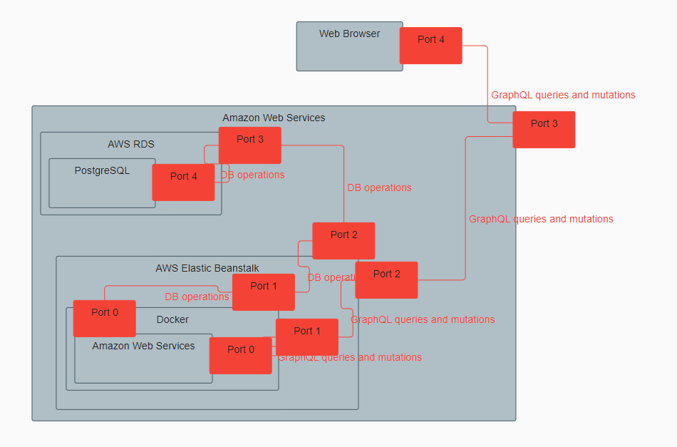
- https://github.com/eclipse-sirius/sirius-web/issues/3015[#3015] [deck] Add the Lane Selection and Direct edit capability.
- https://github.com/eclipse-sirius/sirius-web/issues/3033[#3033] [deck] Add the Lane Drag and Drop capability.
- https://github.com/eclipse-sirius/sirius-web/issues/2606[#2606] [diagram] Add the possibility to insert free space before or after elements in list layouted node
- https://github.com/eclipse-sirius/sirius-web/issues/3045[#3045] [deck] Make it possible to collapse lanes in the Deck representation.
- https://github.com/eclipse-sirius/sirius-web/issues/2841[#2841] [diagram] Add the support for read-only diagram.
In read-only mode, the palette can not be displayed, some of the panel action are disabled, a node cannot be moved or be resized.
- https://github.com/eclipse-sirius/sirius-web/issues/3042[#3042] [core] IObjectService have been divided in smaller services IContentService, IObjectSearchService, IIdentityService and ILabelService, see the related ADR for more details.
- https://github.com/eclipse-sirius/sirius-web/issues/3089[#3089] [sirius-web] Add confirmation dialog on delete.
+
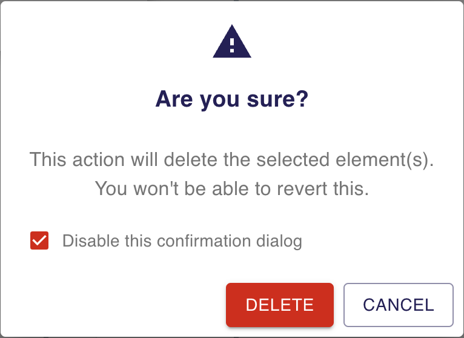
- https://github.com/eclipse-sirius/sirius-web/issues/3087[#3087] [deck] Add the Zoom, Full Screen and Fit to screen actions.
- https://github.com/eclipse-sirius/sirius-web/issues/3101[#3101] [deck] Add a Lane context menu to hide/reveal cards in Deck
- https://github.com/eclipse-sirius/sirius-web/issues/3081[#3081] [forms] TreeWidget has been added in forms model.
- https://github.com/eclipse-sirius/sirius-web/issues/3083[#3083] [forms] Add support for icons at the end of a tree item label.
- https://github.com/eclipse-sirius/sirius-web/issues/3082[#3082] [forms] Add checkbox support for tree widget.
- https://github.com/eclipse-sirius/sirius-web/issues/3133[#3133] [deck] Add OKR and Kanban samples in the Task template and Deck view stereotype.
- https://github.com/eclipse-sirius/sirius-web/issues/3145[#3145] [diagram] Add support for helper lines to facilitate the alignment of nodes with each other.
- https://github.com/eclipse-sirius/sirius-web/issues/3084[#3084] [form] Add SplitButton Widget.
- https://github.com/eclipse-sirius/sirius-web/issues/3193[#3193] [form] Allow the use of custom variables in the `VariableManager` initialized by the FormDescription.
- https://github.com/eclipse-sirius/sirius-web/issues/3193[#3193] [core] Added the methods `hasVariable(String name)` and `getParent()` in VariableManager to, respectively, detect if a variable manager defines a variable (it returns `false`, if the variable is defined by a parent `VariableManager`) and to navigate to a parent `VariableManager`.
Thanks to this capability, a specifier can easily retrieve a variable overriden by a child `VariableManager`.
- https://github.com/eclipse-sirius/sirius-web/issues/3096[#3096] [tree] Tree representations can now support filters
- https://github.com/eclipse-sirius/sirius-web/issues/3158[#3158] [diagram] Add a new tool to apply adjust-size on diagram node.
- https://github.com/eclipse-sirius/sirius-web/issues/3201[#3201] [diagram] Add support for tools on multiple diagram elements selection (hide, fade and pin).
- https://github.com/eclipse-sirius/sirius-web/issues/3197[#3197] [form] Add the `FormVariable` concept to the view form DSL.
Form variables declared in a form description will thus be added in the FormDescription `VariableManager`.
- https://github.com/eclipse-sirius/sirius-web/issues/3198[#3198] [form] Add a new variable, `variableManager`, in most interpreted expressions of the form DSL.
- https://github.com/eclipse-sirius/sirius-web/issues/3243[#3243] [diagram] Add tools to help manual layout on multiple elements
- https://github.com/eclipse-sirius/sirius-web/issues/2999[#2999] [formdescriptioneditor] Add the support for read-only _Form Description Editors_.
- https://github.com/eclipse-sirius/sirius-web/issues/3253[#3253] [diagram] Add a new tool to apply same size on multiple nodes

=== Improvements

- https://github.com/eclipse-sirius/sirius-web/issues/2775[#2775] [gantt] Handle TypeScript strict mode for Gantt module
- https://github.com/eclipse-sirius/sirius-web/issues/2975[#2975] [diagram] Fix issues with ReactFlow pane events that were slowing down the application.
- https://github.com/eclipse-sirius/sirius-web/issues/2988[#2988] [diagram] Fix an issue with ReactFlow OnNodesChange event that were slowing down the application.
- https://github.com/eclipse-sirius/sirius-web/issues/2978[#2978] [diagram] Fix issues with ReactFlow edge and drag events that were slowing down the application.
- https://github.com/eclipse-sirius/sirius-web/issues/3000[#3000] [portal] Portals which already contain representation now open in "direct" mode.
- https://github.com/eclipse-sirius/sirius-web/issues/2875[#2875] [forms] Make the Representations view a plain FormBasedView
- https://github.com/eclipse-sirius/sirius-web/issues/2732[#2732] [diagram] Add missing support for feedback messages on tool action.
- https://github.com/eclipse-sirius/sirius-web/issues/3020[#3020] [sirius-web] Simplify the code used to update the navigation bar menu and icon.
- https://github.com/eclipse-sirius/sirius-web/issues/3024[#3024] [diagram] Added two new variables `semanticEdgeSource` and `graphicalEdgeSource` to compute the target nodes of an edge.
- https://github.com/eclipse-sirius/sirius-web/issues/3050[#3050] [sirius-web] Contributes a first version of the new Sirius Web architecture
- https://github.com/eclipse-sirius/sirius-web/issues/1844[#1844] [emf] Unload resources by default when the EMF based editing context is disposed
- https://github.com/eclipse-sirius/sirius-web/issues/3020[#3020] [sirius-web] Improve the creation of the Apollo GraphQL client.
- https://github.com/eclipse-sirius/sirius-web/issues/3056[#3056] [trees] Expand the clickable/draggable zone for tree items
- [forms] Avoid creating a new subscription when re-selecting the same element
- [tree] Avoid sending treePath query if the selection does not actually change
- [core] Ignore empty changes of kind ChangeKind.NOTHING
- https://github.com/eclipse-sirius/sirius-web/issues/3020[#3020] [sirius-web] Improve the project browser to make the code more robust
- https://github.com/eclipse-sirius/sirius-web/issues/3021[#3021] [sirius-web] Leverage the new Spring Boot APIs to create the sirius-web-starter autoconfiguration
- https://github.com/eclipse-sirius/sirius-web/issues/3020[#3020] [sirius-web] Simplify the contribution of views in the workbench
- https://github.com/eclipse-sirius/sirius-web/issues/3066[#3066] [core] The core object-related services now can also find/resolve representations.
- [portal] Use MUI tooltips for Portal toolbar elements
- https://github.com/eclipse-sirius/sirius-web/issues/2480[#2480] [diagram] Merge the rectangle node and the image node into FreeFormNode.
- https://github.com/eclipse-sirius/sirius-web/issues/3079[#3079] [deck] Add a name attribute on CardDescription and LaneDescription
- https://github.com/eclipse-sirius/sirius-web/issues/3019[#3019] [sirius-web] Improve the new architecture to let product builders reuse Sirius Web
- https://github.com/eclipse-sirius/sirius-web/issues/3141[#3141] [portal] Make the header of embedded representations sticky so that it (and its icon) are always visible.
- https://github.com/eclipse-sirius/sirius-web/issues/2713[#2713] [diagram] Enhances resize support for list nodes
- https://github.com/eclipse-sirius/sirius-web/issues/3120[#3120] [deck] Provide styles customization in the Deck representation
- https://github.com/eclipse-sirius/sirius-web/issues/3187[#3187] [diagram] BorderNode creation now considers the click position to define the border.
+
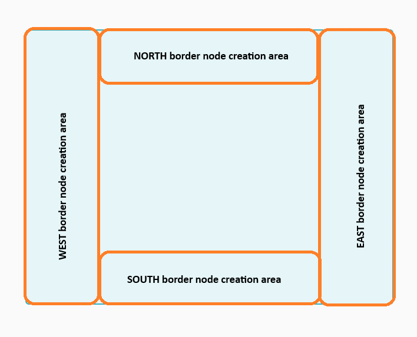
+
In other scenarios, the default creation position border remains the eastern one.
- https://github.com/eclipse-sirius/sirius-web/issues/2785[#2785] [gantt] Add cypress tests
- https://github.com/eclipse-sirius/sirius-web/issues/3225[#3225] [sirius-web] The confirmation dialog on delete does not propose anymore the option allowing to "Disable this confirmation dialog" when the local storage is not available.
- https://github.com/eclipse-sirius/sirius-web/issues/3246[#3246] [view] Make the `ViewRepresentationDescriptionSearchService` independent from specific representations
- https://github.com/eclipse-sirius/sirius-web/issues/3220[#3220] [deck] Add documentation
- https://github.com/eclipse-sirius/sirius-web/issues/3178[#3178] [portal] Add documentation for portals
- https://github.com/eclipse-sirius/sirius-web/issues/2890[#2890] [portal] Display the contents of a Portal in the Representations view

== v2024.1.0

=== Shapes

- Add support for Portal representation
- Add support for Gantt representation
- Add support for Deck representation
- Add support to pin unpin nodes


=== Architectural decision records

- [ADR-122] Use the page object model in integration tests
- [ADR-123] Improve frontend selection support
- [ADR-124] Add support for libraries
- [ADR-125] Provide a common ShareRepresentationModal

=== Breaking changes

- https://github.com/eclipse-sirius/sirius-web/issues/2675[#2675] [view] `IViewDiagramElementFinder` has been updated with new methods.
All implementations of this interface must implement these new methods:
* `List<NodeDescription> getNodeDescriptions();` to retrieve all `NodeDescriptions` created by providers.
* `List<EdgeDescription> getEdgeDescriptions();` to retrieve all `EdgeDescriptions` created by providers.
- https://github.com/eclipse-sirius/sirius-web/issues/2658[#2658] [sirius-web] Add dedicated colors for navigation bar in the Sirius Web theme.
The theme provided by the user must now provide navigation bar colors:
```ts
...
navigationBar: {
  border: 'yellow',
  background: 'blue',
},
...
```
- https://github.com/eclipse-sirius/sirius-web/issues/2669[#2669] [sirius-web] Add dedicated colors for selected elements in the Sirius Web theme.
The theme provided by the user must now provide selected elements colors:
```ts
...
selected: 'gray',
...
```
- https://github.com/eclipse-sirius/sirius-web/issues/2672[#2672] [sirius-web] Add dedicated colors for toast messages in Sirius Web theme.
The theme provided by the user must now provide toast messages colors:
```ts
...
success: {
  main: '#43A047',
  dark: '#327836',
  light: '#4EBA54',
},
warning: {
  main: '#FF9800',
  dark: '#D98200',
  light: '#FFB800',
},
info: {
  main: '#2196F3',
  dark: '#1D7DCC',
  light: '#24A7FF',
},
...
```
- https://github.com/eclipse-sirius/sirius-web/issues/2804[#2804] [sirius-web] Add the ability to declare custom nodes while using the `sirius-web-application` frontend package.
A new optional component named `DiagramRepresentationConfiguration` has been introduced.
If you want to add some custom nodes, this new component must be declared under `SiriusWebApplication`:
```ts
const nodeTypeRegistry: NodeTypeRegistry = {
  ...
};
<SiriusWebApplication httpOrigin={httpOrigin} wsOrigin={wsOrigin}>
  <DiagramRepresentationConfiguration nodeTypeRegistry={nodeTypeRegistry} />
</SiriusWebApplication>
```
- https://github.com/eclipse-sirius/sirius-web/issues/2790[#2790] [diagram] All handles used to resize a node have been updated to be wider, you can update your custom nodes in the same way it's done in the EllipseNode example.
- https://github.com/eclipse-sirius/sirius-web/issues/2932[#2932] The line used to resize a node have been updated to be wider, you can update your custom nodes in the same way it's done in the EllipseNode example.
- https://github.com/eclipse-sirius/sirius-web/issues/2872[#2872] [diagram] The GraphQL type `DiagramDescription` has a new field `childNodeDescriptionIds`, returning a list of Ids.
The GraphQL type `NodeDescription` has a new field `childNodeDescriptionIds`, returning a list of Ids and replacing the field `childNodeDescriptions` which has been deleted.
The GraphQL type `NodeDescription` has a new field `borderNodeDescriptionIds`, returning a list of Ids and replacing the field `borderNodeDescriptions` which has been deleted.
- https://github.com/eclipse-sirius/sirius-web/issues/2872[#2872] [diagram] Change the signature of the node converters in order to leverage the diagram description to resolve the reuse descriptions.
Additional changes to this interface will probably occur in the near future in order to support more complex use cases.
- https://github.com/eclipse-sirius/sirius-web/issues/2889[#2889] [emf] Remove the default implementation of the editing context from the `sirius-components-emf` module.
The default implementation of the editing context for Sirius Web, which had Sirius Web specific code already, will be owned by `sirius-web-services`.
This default implementation will now also contain all the view models properly loaded which should be considered during the lifecycle of the editing context.
- https://github.com/eclipse-sirius/sirius-web/issues/2796[#2796] [sirius-web] All Flow related configurations have been moved to `sirius-components-flow-starter` module.
- https://github.com/eclipse-sirius/sirius-web/issues/2883[#2883] [diagram] Add the attribute `resizedByUser` to reactflow nodes and graphql nodes.
- https://github.com/eclipse-sirius/sirius-web/issues/2926[#2926] [sirius-web] A new `IEditingContextProcessor` has been introduced.
It allows to execute operations before/after the load of an `IEditingContext` in `EditingContextSearchService`.
- https://github.com/eclipse-sirius/sirius-web/issues/2901[#2901] [diagram] Added `nodeDescription` prop to `ConnectionTargetHandle` component.

=== Dependency update

- [releng] The frontend now depends on @ObeoNetwork/gantt-task-react v0.3.13
- [releng] The frontend now depends on react-trello 2.2.11
- https://github.com/eclipse-sirius/sirius-web/issues/2842[#2842] Move to @ObeoNetwork/react-trello
- [releng] Switch to EMFJson 2.3.6-SNAPSHOT
- [releng] The frontend now depends on elkjs 0.8.2


=== Bug fixes

- https://github.com/eclipse-sirius/sirius-web/issues/2812[#2812] [trees] Fix an issue that prevents icon to be displayed in treeNodes.
- https://github.com/eclipse-sirius/sirius-web/issues/2580[#2580] [diagram] Cancel direct edit on 'Esc'.
- https://github.com/eclipse-sirius/sirius-web/issues/2778[#2778] [diagram] Authorize empty string for direct edit.
- https://github.com/eclipse-sirius/sirius-web/issues/2579[#2579] [diagram] Fix the invalid text cursor position when editing a label by typing text directly.
- https://github.com/eclipse-sirius/sirius-web/issues/2826[#2826] [diagram] Fix invalid reference position used for nodes with a depth superior to 2.
- https://github.com/eclipse-sirius/sirius-web/issues/2857[#2857] [form] Fix default reference widget bugs.
Now, for a multi-valued feature, the values are properly displayed and the delete is properly handled.
- https://github.com/eclipse-sirius/sirius-web/issues/2888[#2888] [view] Ensure that the retrieval of the view models returns properly loaded models
- https://github.com/eclipse-sirius/sirius-web/issues/2797[#2797] [diagram] Preserve diagram selection after change in the details view.
- https://github.com/eclipse-sirius/sirius-web/issues/2755[#2755] [diagram] Ensure that the unfolded tool section is always visible above the rest of the palette
- https://github.com/eclipse-sirius/sirius-web/issues/2786[#2786] [diagram] Fix an issue where resizing was clunky.
- https://github.com/eclipse-sirius/sirius-web/issues/2912[#2912] [diagram] Send all requested node descriptions to the frontend when requested.
- https://github.com/eclipse-sirius/sirius-web/issues/2678[#2678] [diagram] Fix an issue where tools from the diagram palette where not executed.
- https://github.com/eclipse-sirius/sirius-web/issues/2943[#2943] [view] Fix an issue where the default colors were not applied to sub-nodes and border nodes.
- https://github.com/eclipse-sirius/sirius-web/issues/2957[#2957] [diagram] Fix an issue where children of custom node lose their position.
- https://github.com/eclipse-sirius/sirius-web/issues/2934[#2934] [portal] Fix the initial position of representations added into portals
- https://github.com/eclipse-sirius/sirius-web/issues/2907[#2907] [diagram] Fix an issue on some browsers where a tool could not be executed if the tooltip was visible
- https://github.com/eclipse-sirius/sirius-web/issues/2901[#2901] [diagram] Fix an issue where the connectionLine could be stuck on invalid nodes.
- https://github.com/eclipse-sirius/sirius-web/issues/2940[#2940] [diagram] Fix an issue where the diagram palette would render with no tools.
- https://github.com/eclipse-sirius/sirius-web/issues/2986[#2986] [portal] Prevent a portal from containing itself

=== New Features

- https://github.com/eclipse-sirius/sirius-web/issues/2413[#2413] Add a debug mode for React Flow diagrams

- https://github.com/eclipse-sirius/sirius-web/issues/2735[#2735] [gantt] Contribute the first version of the Gantt representation.
- https://github.com/eclipse-sirius/sirius-web/issues/2403[#2403] [view] Add support for If and Let constructs in the operations DSL.
- https://github.com/eclipse-sirius/sirius-web/issues/1545[#1545] [core] The current selection can now be read and set from anywhere using the new `useSelection()` hook.
- https://github.com/eclipse-sirius/sirius-web/issues/2736[#2736] [gantt] Add a starter project for beans related to task meta-model.
- https://github.com/eclipse-sirius/sirius-web/issues/2819[#2819] [deck] Contribute the first version of the Deck representation.
- https://github.com/eclipse-sirius/sirius-web/issues/2765[#2765] [portal] Contribute the first version of the Portal representation.
- https://github.com/eclipse-sirius/sirius-web/issues/2737[#2737] [gantt] Support create, edit and delete task in gantt.
- https://github.com/eclipse-sirius/sirius-web/issues/2793[#2793] [diagram] Add the possibility to pin / unpin nodes.
- https://github.com/eclipse-sirius/sirius-web/issues/2883[#2883] [diagram] The size of manually resized node does not change anymore, unless it needs to.
+
The size of nodes that do not have been resized manually tries to fit the node default size.
- https://github.com/eclipse-sirius/sirius-web/issues/2792[#2792] [diagram] Add a first version for arrange all support.
- https://github.com/eclipse-sirius/sirius-web/issues/2926[#2926] [sirius-web] Add a first version of the support for {pre|post}processing of the editing context.
- https://github.com/eclipse-sirius/sirius-web/issues/2848[#2848] [core] The new `ShareRepresentationModal` can be used to share the URL of any kind of representation.

=== Improvements

- https://github.com/eclipse-sirius/sirius-web/issues/2675[#2675] [view] Improve `IViewDiagramElementFinder` by adding new methods:
* `List<NodeDescription> getNodeDescriptions();` to retrieve all `NodeDescriptions` created by providers.
* `List<EdgeDescription> getEdgeDescriptions();` to retrieve all `EdgeDescriptions` created by providers.
- https://github.com/eclipse-sirius/sirius-web/issues/2733[#2733] Leverage the page object model to improve out integration tests
- https://github.com/eclipse-sirius/sirius-web/issues/2658[#2658] [sirius-web] Add dedicated colors for navigation bar in the Sirius Web theme
- https://github.com/eclipse-sirius/sirius-web/issues/2669[#2669] [sirius-web] Add dedicated colors for selected elements in the Sirius Web theme
- https://github.com/eclipse-sirius/sirius-web/issues/2672[#2672] [sirius-web] Add dedicated colors for toast messages in the Sirius Web theme
- https://github.com/eclipse-sirius/sirius-web/issues/2720[#2720] [releng] Improve our build process to be faster in development mode
- https://github.com/eclipse-sirius/sirius-web/issues/2780[#2780] [releng] Upgrade github/aws actions versions in workflows
- https://github.com/eclipse-sirius/sirius-web/issues/2644[#2644] [diagram] Highlight nodes on hover in React Flow diagrams
- https://github.com/eclipse-sirius/sirius-web/issues/2766[#2766] [tree] Tree representations (including the explorer) now support dragging any kind of element (not just semantic elements).
It is the responsibility of the drop targets (e.g. a diagram) to validate the dropped element(s) type and ignore the one it does not support.
- https://github.com/eclipse-sirius/sirius-web/issues/2772[#2772] [diagram] Improve the Palette performance.
- https://github.com/eclipse-sirius/sirius-web/issues/2679[#2679] [diagram] When editing a label, place input element closer to the label's location (centered).
- https://github.com/eclipse-sirius/sirius-web/issues/2804[#2804] [sirius-web] Add the ability to declare custom nodes while using the `sirius-web-application` frontend package.
- https://github.com/eclipse-sirius/sirius-web/issues/2718[#2718] Replacing useNodes and useEdges by useReactFlow to improve performances.
- https://github.com/eclipse-sirius/sirius-web/issues/2787[#2787] [view] Add the ability to customize the icons of the node tools and edge tools in the View DSL.
- https://github.com/eclipse-sirius/sirius-web/issues/2784[#2784] [performance] Expand monitoring capabilities.
- https://github.com/eclipse-sirius/sirius-web/issues/2760[#2760] Begin and end label placement of and edge takes into account handle position.
- https://github.com/eclipse-sirius/sirius-web/issues/2788[#2788] [diagram] Add the possibility to declare child nodes undraggable in _ListLayoutStrategy_.
- https://github.com/eclipse-sirius/sirius-web/issues/2790[#2790] [diagram] Increase the size of the handles used to resize a node.
+
.Old resize handles vs new ones
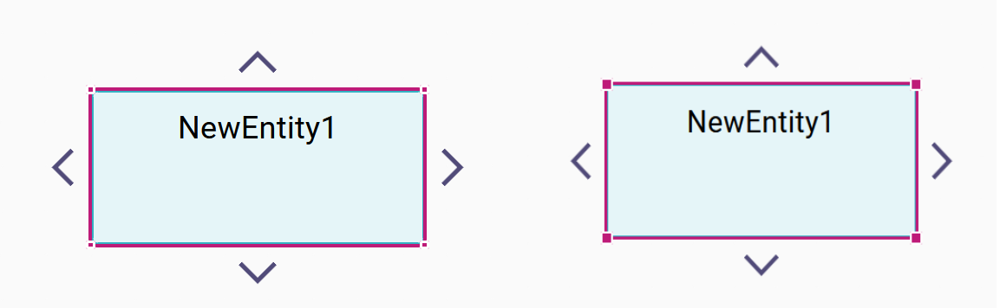
- https://github.com/eclipse-sirius/sirius-web/issues/2920[#2920] [Deck] Add Cypress integration tests
- https://github.com/eclipse-sirius/sirius-web/issues/2849[#2849] [diagram] Reduce the time taken to open a diagram
- https://github.com/eclipse-sirius/sirius-web/issues/2609[#2609] [diagram] Move handles after node move to reduce edges crossing.
- https://github.com/eclipse-sirius/sirius-web/issues/2484[#2484] [diagram] Split the label concept into three concepts: edge label, inside label and outside label.
This is a preliminary work to add some proper support for outside labels in the near future.
- https://github.com/eclipse-sirius/sirius-web/issues/2869[#2869] [diagram] Add `diagramContext` variable to accessible variables when computing semantic candidates expression.
- https://github.com/eclipse-sirius/sirius-web/issues/2774[#2774] [gantt] Rework the gantt representation front-end to follow best practises.
- https://github.com/eclipse-sirius/sirius-web/issues/2872[#2872] [diagram] Reduce the time needed to retrieve a diagram description, thus leading to reduce the duration of diagrams opening.
- https://github.com/eclipse-sirius/sirius-web/issues/2889[#2889] [emf] Add the `IEMFEditingContext` interface in order to let any editing context be an EMF aware one.
After this change, we will be able to delete the `EditingContext` class from `sirius-components-emf` and add new interfaces to describe the various capabilities of an editing context.
Among those capabilities, we should find the list of view models to consider during the lifecycle of the editing context.
- https://github.com/eclipse-sirius/sirius-web/issues/2889[#2889] [view] Load view models only once during the lifecycle of the editing context.
This change makes the editing context the single source of truth for the state of the view models.
- https://github.com/eclipse-sirius/sirius-web/issues/2904[#2904] [sirius-web] Order candidates in Representations sections in the Onboard Area.
- https://github.com/eclipse-sirius/sirius-web/issues/2903[#2903] [sirius-web] Order New Representation modal candidates.
- https://github.com/eclipse-sirius/sirius-web/issues/2796[#2796] [sirius-web] Flow diagram description has been converted to the view DSL.
- https://github.com/eclipse-sirius/sirius-web/issues/2910[#2910] [portal] Make the initial drop area larger and more visible on empty portals
- https://github.com/eclipse-sirius/sirius-web/issues/2932[#2932] The line and the handle used to resize a node is now bigger. The handle is now circular.
.Old resize handles vs new ones
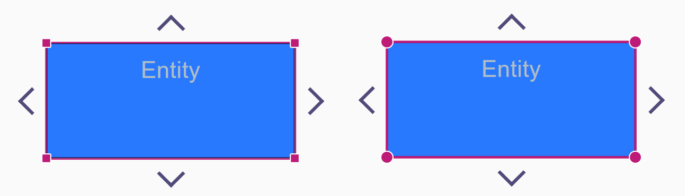
- https://github.com/eclipse-sirius/sirius-web/issues/2948[#2948] [portal] Use a "close" icon instead of "delete" icon for the button that removes a representation from a portal (but does not delete the representation).
- https://github.com/eclipse-sirius/sirius-web/issues/2792[#2792] [diagram] Add support to label and call layout after arrangeAll.
- https://github.com/eclipse-sirius/sirius-web/issues/2951[#2951] [diagram] Set ConnectionLine color to theme.palette.selected.
- https://github.com/eclipse-sirius/sirius-web/issues/2909[#2909] [portal] Add support for read-only mode on portals.
- https://github.com/eclipse-sirius/sirius-web/issues/2983[#2983] [deck] Use the strict mode of TypeScript for the Deck package.

== v2023.12.0

=== Shapes

- Add support for custom nodes in Diagram representations
- Add the possibility to specify a size ratio on node.
- Add support for rotatable border node
- Improve handles management in React Flow based diagrams

=== Architectural decision records

- [ADR-111] Add support for image overlay
- [ADR-112] Provide only valid view descriptions to the renderer
- [ADR-113] Add support for multiple IObjectService
- [ADR-114] Add support for multiple IEditService
- [ADR-115] Split the Sirius Web frontend
- [ADR-116] Add support for changing the content of the explorer
- [ADR-117] Add support for changing the content of the details view
- [ADR-118] Use dynamic handles to connect edges between nodes
- [ADR-119] Share layout data between subscribers
- [ADR-120] Improve the arrange all action with reactflow
- [ADR-121] Add process before and after input handling

=== Breaking changes

- https://github.com/eclipse-sirius/sirius-web/issues/2386[#2386] [form] Reference widget structure has changed, `referenceOptions` has been removed to be lazily loaded.
- https://github.com/eclipse-sirius/sirius-web/issues/2329[#2335] [form] The general mutation `editReference` has been removed from the reference widget. This mutation has been replaced by finer grain mutations:
** _clearReference_ mutation: to reset the content references (set the value to `null` for mono-valued references and to an empty list for multi-valued ones).
** _addReferenceValues_ mutation: to several reference values to a reference (only used with multi-valued references)
** _setReferenceValue_ mutation: to set the value of mono-valued references
** _removeReferenceValue_ mutation: to remove a given value from a reference (in case of mono-valued references, this mutation is equivalent to _clearReference_)
** _createElementInReference_ mutation: to create a new element (used in the context of a reference widget)
** _moveReferenceValue_ mutation: to reorder the list of values in multi-valued references

UI is unchanged except that we removed the transactional behavior of the _TransferModal_ component which is now performing operations live. This means that changes are no longer done when the modal is close (using the _Apply_ button) but as soon as the user interacts with elements (adding or removing values, changing order).

- https://github.com/eclipse-sirius/sirius-web/issues/2269[#2269] [core] The GraphQL field `EditingContext#domains` has been modified.
A new parameter `rootDomainsOnly: Boolean` has been added, allowing to remove domains not compatible with root objects.
For example, Diagram & Form domains are not root domains because `DiagramDescription` and `FormDescription` are not root objects valid candidates.
- https://github.com/eclipse-sirius/sirius-web/issues/1712[#1712] [diagram] The GraphQL type `Node` must now implement `isLabelEditable` boolean field.
- https://github.com/eclipse-sirius/sirius-web/issues/2456[#2456] [sirius-web] The GraphQL field `CreateChildSuccessPayload` now expects to have a list of messages.
- https://github.com/eclipse-sirius/sirius-web/issues/1982[#1982] [diagram] Change the diagram structure. The Node's 'label' attribute has been renamed into 'insideLabel' and its type changed from `Label` to `InsideLabel` (which is currently identical to `Label` except for the name).
- https://github.com/eclipse-sirius/sirius-web/issues/2388[#2388] [core] The `IObjectService.getImagePath` API changed and now must return a list containing all the image paths to compose/overlay.
Due to this data structure modification, all existing diagrams can no longer be opened.
- https://github.com/eclipse-sirius/sirius-web/issues/2460[#2460] [form] The reference widget no longer declares a `createElementHandlerProvider`, this feature is delegated to the new service `IReferenceWidgetCreateElementHandler`.
- https://github.com/eclipse-sirius/sirius-web/issues/2453[#2453] [diagram] The GraphQL fields `DeleteFromDiagramSuccessPayload`, `EditLabelSuccessPayload` and `DropOnDiagramSuccessPayload` now expects to have a list of messages.
- https://github.com/eclipse-sirius/sirius-web/issues/2514[#2514] [diagram] Move and rename the RectangleNodeStyle `withHeader` attribute to InsideLabel `isHeader`.
It requires to add a `isHeaderProvider` to the _LabelDescription_ of Node.
Replace only for the programmatic API the _LabelDescription_ type in _NodeDescription_ by _InsideLabelDescription_ and add the inside label location.
Update the graphql API accordingly.
- https://github.com/eclipse-sirius/sirius-web/issues/2444[#2444] [form] `ViewFormDescriptionConverterSwitch` now extends `FormSwitch<Optional<AbstractControlDescription>>`
- https://github.com/eclipse-sirius/sirius-web/issues/2516[#2516] [diagram] Add to the diagram core API the possibility to display the header separator when the inside label is a header.
It requires to add a `displayHeaderSeparatorProvider` to the _InsideLabelDescription_.
For the compatibility layer, the separator will always be displayed if the label is inside a node displaying its children has a list.
Add the attribute `displayHeaderSeparator` to the graphql API.
- https://github.com/eclipse-sirius/sirius-web/issues/2535[#2535] [view] Add the possibility for the header separator to be displayed or hidden in the View DSL.
+
.Compartment with header without separator
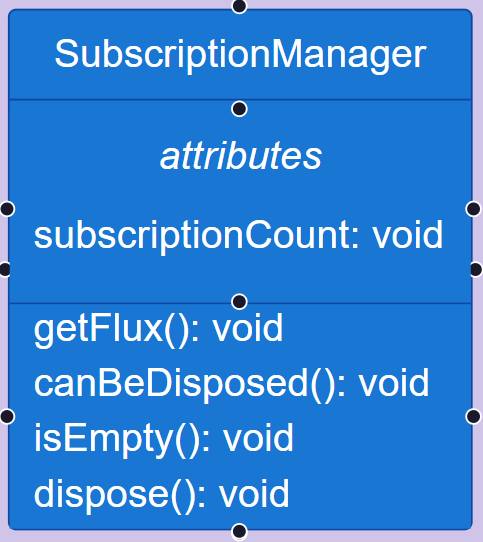
- https://github.com/eclipse-sirius/sirius-web/issues/2255[#2255] [diagram] The properties `widthComputationExpression` and `heightComputationExpression` have been removed from `NodeStyleDescription`.
From now on, use the `defaultWidthExpression` and `defaultHeightExpression` properties from `NodeDescription`.
- https://github.com/eclipse-sirius/sirius-web/issues/2537[#2537] [sirius-web] `sirius-web` frontend package has been split in two: `sirius-web` and `sirius-web-application`.
The package `sirius-web` now depends on `sirius-web-application`.
A new component `SiriusWebApplication` has been added.
Developers who want to create a `sirius-web` frontend should use this component as their root component.
The API of this component will change over time in order to provide additional capabilities.
API breaks should be expected.
+
Another component, named `Views` has also been added.
This component will allow developers to customize some parts of the Sirius Web views.
It will currently provide the ability to customize the application icon and application menu.
The API of this component will also change over time so API breaks should be expected in the upcoming releases.
+
This new package and those new components are the first part of our work to make Sirius Web more reusable.
- https://github.com/eclipse-sirius/sirius-web/issues/2615[#2615] [diagram] `useDropNode().dropFeedbackStyleProvider` has been removed.
Use `useDropNodeStyle(node.id)` instead to get the feedback of the drop feedback.
- https://github.com/eclipse-sirius/sirius-web/issues/2671[#2671] [diagram] Switch to Reactflow by default.
To open a diagram with Sprotty, suffixes the diagram name with `__SPROTTY`


=== Dependency update

- Remove the dependency to elk.js
- Switch to EMFJson 2.3.5


=== Bug fixes

- https://github.com/eclipse-sirius/sirius-web/issues/2360[#2360] [form] Fix an issue that prevents creation of new object on some containment reference with the reference widget.
- https://github.com/eclipse-sirius/sirius-web/issues/2456[#2456] [form] Fix an issue that prevents creation of new object on mono valued and containment reference when a value is already set with the reference widget.
- https://github.com/eclipse-sirius/sirius-web/issues/2269[#2269] [view] Fix an issue where it was possible to create a DiagramDescription or a FormDescription as a root object of a resource.
- https://github.com/eclipse-sirius/sirius-web/issues/2470[#2470] [form] Fix an issue that prevents the removal of a contained reference from the reference widget.
- https://github.com/eclipse-sirius/sirius-web/issues/2469[#2469] [form] Fix an issue that occurs when navigating from a reference widget to a filtered item in the explorer.
- https://github.com/eclipse-sirius/sirius-web/issues/2466[#2466] [form] Fix an issue that prevents the selection of an ancestor in the reference widget.
- https://github.com/eclipse-sirius/sirius-web/issues/2456[#2456] [form] Add a more meaningful message when trying to add a new value to a mono reference not empty.
- https://github.com/eclipse-sirius/sirius-web/issues/2487[#2487] [form] Fix an issue that prevents an error when using values not in the option list in a reference widget modal transfert.
- https://github.com/eclipse-sirius/sirius-web/issues/1712[#1712] [diagram] Fix an issue that triggers direct label edition even if there is no corresponding tool.
Note that double-clicking no longer triggers a direct edit.
- https://github.com/eclipse-sirius/sirius-web/issues/2498[#2498] [diagram] Fix an issue that prevents tool name to be displayed on multi lines in react flow diagram palette.
- https://github.com/eclipse-sirius/sirius-web/issues/2491[#2491] [diagram] Fix an issue where multiple tool section could be opened.
- https://github.com/eclipse-sirius/sirius-web/issues/2509[#2509] [diagram] Fix an issue that prevents using graphical DnD in deep node in some cases.
- https://github.com/eclipse-sirius/sirius-web/issues/2453[#2453] [diagram] Add support for feedback messages on following actions: DropOnDiagram, DeleteFromDiagram, ReconnectEdge and EditLabel
- https://github.com/eclipse-sirius/sirius-web/issues/2513[#2513] [diagram] Fix the double node border displayed when node list was containing compartments.
- https://github.com/eclipse-sirius/sirius-web/issues/2532[#2532] [diagram] Fix the limitation on borders that prevent movement on all sides of their node parent.
- https://github.com/eclipse-sirius/sirius-web/issues/2543[#2543] [diagram] Prevent list items being moved to inconsistent positions
- https://github.com/eclipse-sirius/sirius-web/issues/2500[#2500] [diagram] Selecting an element in the explorer now correctly selects and focuses on the corresponding edge on the current diagram if there is one.
- https://github.com/eclipse-sirius/sirius-web/issues/2547[#2547] [diagram] Fix a bug where edge labels could be hidden/covered by other nodes
- https://github.com/eclipse-sirius/sirius-web/issues/2539[#2539] [diagram] Ignore hidden nodes when determining potential drop targets.
- https://github.com/eclipse-sirius/sirius-web/issues/2550[#2550] [diagram] Palette is now hidden on viewport or zoom change.
- https://github.com/eclipse-sirius/sirius-web/issues/2562[#2562] [diagram] Prevent a node to be created on the TOP header of its parent.
The node will be created below the header.
- https://github.com/eclipse-sirius/sirius-web/issues/2571[#2562] [diagram] Fix a bug where edges would stop at the new creation handles instead of the border of their target node
- https://github.com/eclipse-sirius/sirius-web/issues/2549[#2549] [diagram] Prevent the arrange-all to break the layout of node list.
It uses our algorithm instead of elk.js to perform the arrange-all.
- https://github.com/eclipse-sirius/sirius-web/issues/2591[#2591] [diagram] Give the right node descriptions to node convert handlers.
- https://github.com/eclipse-sirius/sirius-web/issues/2601[#2601] [emf] Fix an issue in `EditingContextCrossReferenceAdapter` where references to moved objects were lost.
- https://github.com/eclipse-sirius/sirius-web/issues/2582[#2582] [diagram] Fix a delay in renderer of palette tools between the one from _getPalette_ backend call and the one declared in frontend.
- https://github.com/eclipse-sirius/sirius-web/issues/2615[#2615] [diagram] Fix the `useDropNode` lifecycle.
- https://github.com/eclipse-sirius/sirius-web/issues/2614[#2614] [diagram] Tool sections now correctly remember the last of their tool invoked and default to that.
- https://github.com/eclipse-sirius/sirius-web/issues/2593[#2593] [diagram] Fix an issue where and edge could be reconnected if not selected after a semantic change.
- https://github.com/eclipse-sirius/sirius-web/issues/2624[#2624] [diagram] Fix an issue where edge arrows in react flow diagrams were wrongly drawn.
- https://github.com/eclipse-sirius/sirius-web/issues/2625[#2625] [diagram] Fix the line style computation on edge and border node.
- https://github.com/eclipse-sirius/sirius-web/issues/2633[#2633] [diagram] Make sure the grid is visible when enabled, even when moving a non-droppable node
- https://github.com/eclipse-sirius/sirius-web/issues/2635[#2635] [diagram] Fix an error when switching between react flow representations.
- https://github.com/eclipse-sirius/sirius-web/issues/2581[#2581] [diagram] Fix an issue where nodes created by custom tool are always on the default position.
- https://github.com/eclipse-sirius/sirius-web/issues/2642[#2642] [diagram] Fix an issue where moving the viewport was slow.
- https://github.com/eclipse-sirius/sirius-web/issues/2640[#2640] [diagram] Compute the handle position on diagram conversion, which happens every time a diagram refresh payload is received.
- https://github.com/eclipse-sirius/sirius-web/issues/2647[#2647] [diagram] Split border shorthand CSS properties into non-shorthand properties for list nodes.
Make some border node transparent when the node is in a list node in the convert engine.
- https://github.com/eclipse-sirius/sirius-web/issues/2646[#2646] [diagram] Fix an issue where the palette was re-rendering too much.
- https://github.com/eclipse-sirius/sirius-web/issues/2685[#2685] [diagram] Fix direct edit of edge labels with F2.
- https://github.com/eclipse-sirius/sirius-web/issues/2464[#2464] [diagram] Apply the fit-to-screen after the first layout
- https://github.com/eclipse-sirius/sirius-web/issues/2703[#2703] [diagram] Remove the explorer menu used to export diagrams as SVG image.
This menu was using Sprotty export, which has been replaced by ReactFlow by default (see https://github.com/eclipse-sirius/sirius-web/issues/2671[#2671]).
The only way to export diagram as SVG image is to use the ReactFlow toolbar located at the top left of each diagram.
- https://github.com/eclipse-sirius/sirius-web/issues/2706[#2706] [diagram] Fix an issue where node children were not correctly positioned.
- https://github.com/eclipse-sirius/sirius-web/issues/2687[#2687] [diagram] Fix an issue where ConnectionHandles where rerendering too much
- https://github.com/eclipse-sirius/sirius-web/issues/2698[#2698] [diagram] Fix an issue that prevents _imageNode_ to be resizable.
- https://github.com/eclipse-sirius/sirius-web/issues/2684[#2684] [diagram] Fix an issue where the edges' arrows where not exported during the SVG export.
- https://github.com/eclipse-sirius/sirius-web/issues/2726[#2726] [diagram] Fix an issue that prevents last tool used in a tool section to be added to another palette.
- https://github.com/eclipse-sirius/sirius-web/issues/2728[#2728] [diagram] Prevents unnecessary rerenders in DiagramPanel
- https://github.com/eclipse-sirius/sirius-web/issues/2683[#2683] [diagram] Hide diagram element palette when the element itself is moved.
- https://github.com/eclipse-sirius/sirius-web/issues/2689[#2689] [diagram] Fix the borderNode moves that is no longer anchored to its parent.
- https://github.com/eclipse-sirius/sirius-web/issues/2682[#2682] [diagram] Fix an error in diagram selection that can lead to a node remaining selected in the diagram but not in the explorer.
- https://github.com/eclipse-sirius/sirius-web/issues/2605[#2605] [diagram] Fix an issue that prevents last node or edge to remain selected if the new selection is not displayed on the diagram.
- https://github.com/eclipse-sirius/sirius-web/issues/2919[#2919] [diagram] Reset node position if drag and drop fails.
- https://github.com/eclipse-sirius/sirius-web/issues/3001[#3001] [diagram] Fix an issue that inverse list order after arrangeAll
- https://github.com/eclipse-sirius/sirius-web/issues/2982[#2982] [diagram] Fix an issue where the drop position on container was invalid.

=== New Features

- https://github.com/eclipse-sirius/sirius-web/issues/2214[#2214] [diagram] Add support for borders nodes with React Flow.
- https://github.com/eclipse-sirius/sirius-web/issues/2264[#2264] [diagram] Add feedback for edge reconnection with React Flow.
- https://github.com/eclipse-sirius/sirius-web/issues/288[#288] [diagram] Add support for drag and drop of nodes inside diagrams.
The behavior is controlled by the new _Drop Node_ tools defined on the target element, which can be either a node or the diagram itself (when dropping on the diagram's background).
- https://github.com/eclipse-sirius/sirius-web/issues/1982[#1982] [diagram] Make the node label non required
- https://github.com/eclipse-sirius/sirius-web/issues/2482[#2482] [diagram] Add the support for TOP_CENTER inside label location. Other inside label locations will be supported later.
- https://github.com/eclipse-sirius/sirius-web/issues/2256[#2256] [diagram] Add the possibility to contribute custom shape.
See the `EllipseNode` example and link:doc/how-to/contribute-custom-node.adoc[the documentation] for more details.
Note that the custom shape replaces the parametric SVG, which is deprecated and will be removed in a future version.
- https://github.com/eclipse-sirius/sirius-web/issues/2512[#2512] [diagram] Add the support for multi-line label in reactflow.
That includes the support during the direct edit.
The user can use 'shift+enter' to insert a line break.
- https://github.com/eclipse-sirius/sirius-web/issues/2522[#2522] [diagram] Add the support for rotatable border node.
- https://github.com/eclipse-sirius/sirius-web/issues/2255[#2255] [diagram] Add the possibility to specify a ratio on node to guarantee its appearance.
- https://github.com/eclipse-sirius/sirius-web/issues/2568[#2568] [trees] Allow developers to modify the content of the explorer view
- https://github.com/eclipse-sirius/sirius-web/issues/2570[#2570] [forms] Allow developers to modify the content of the details view
- https://github.com/eclipse-sirius/sirius-web/issues/2618[#2618] [core] Add an API to provide pre-process and post-process around input handling.

=== Improvements

- https://github.com/eclipse-sirius/sirius-web/issues/2386[#2386] [form] Reference widget candidates are now lazily loaded when necessary.
- https://github.com/eclipse-sirius/sirius-web/issues/2424[#2424] [view] Align the format of description id used in Form generated from View with the one used in diagram.
As a result, the identifier of a form description created from a view model will not be an UUID anymore but instead an URL based identifier
- https://github.com/eclipse-sirius/sirius-web/issues/2335[#2335] [form] Change the capabilities of the reference widget to open it to more customization.
In order to provide a first version of those capabilities, some additional coupling has been created between the reference widget and its use in Sirius Web which may prevent its use in other applications.
This coupling will be removed in the near future as a consequence, the dependencies of this code will change and some APIs of the reference widget will be broken in the near future.
- https://github.com/eclipse-sirius/sirius-web/issues/2380[#2380] [diagram] Add typing to reactflow hooks
- https://github.com/eclipse-sirius/sirius-web/issues/2430[#2430] [diagram] Improve fit to screen feature to zoom on selected nodes
- https://github.com/eclipse-sirius/sirius-web/issues/2288[#2288] [diagram] Make IconLabel a react flow node
- https://github.com/eclipse-sirius/sirius-web/issues/2289[#2289] [diagram] Use the layout strategy to layout icon label nodes
- https://github.com/eclipse-sirius/sirius-web/issues/2410[#2410] [diagram] Do a fit to screen on a diagram opening
- https://github.com/eclipse-sirius/sirius-web/issues/2268[#2268] [diagram] Create child nodes where the user has clicked.
- https://github.com/eclipse-sirius/sirius-web/issues/2475[#2475] [diagram] Prevent nodes to move each diagram refresh event. Only the size is still updated.
- https://github.com/eclipse-sirius/sirius-web/issues/2485[#2485] [view] Change the default size of View Node Description from 1x1 to 150x70.
- https://github.com/eclipse-sirius/sirius-web/issues/2493[#2493] [diagram] Disable double click to zoom in with React Flow.
- https://github.com/eclipse-sirius/sirius-web/issues/2388[#2388] [core] Added support for image overlay in icons.
All icons can now be composed of multiple images, which will be overlayed on top of each other.
An example of use has been added on the domain entity items.
- https://github.com/eclipse-sirius/sirius-web/issues/2483[#2483] [diagram] Take the header into account in the React Flow layout.
- https://github.com/eclipse-sirius/sirius-web/issues/2504[#2504] [diagram] Create nodes at the cursor position when using create instance or drop tools.
- https://github.com/eclipse-sirius/sirius-web/issues/2444[#2444] [form] It is now possible to ignore widgets with invalid descriptions
- https://github.com/eclipse-sirius/sirius-web/issues/2528[#2528] [core] Add support for multiple `IObjectService`.
It is now possible to contribute specific services to interact with domain objects, through `IObjectServiceDelegate`.
The new implementation of `IObjectService`, named `ComposedObjectService`, tries first to delegate to the appropriate `IObjectServiceDelegate` and then fallback to a default behavior from `IDefaultObjectService` if needed.
- https://github.com/eclipse-sirius/sirius-web/issues/2530[#2530] [core] Add support for multiple `IEditService`.
It is now possible to contribute specific services to edit domain objects, through `IEditServiceDelegate`.
The new implementation of `IEditService`, named `ComposedEditService`, tries first to delegate to the appropriate `IEditServiceDelegate` and then fallback to a default behavior from `IDefaultEditService` if needed.
- https://github.com/eclipse-sirius/sirius-web/issues/2555[#2555] [diagram] Add distinct edge creation handles (only visible when a node is selected)
- https://github.com/eclipse-sirius/sirius-web/issues/2559[#2559] [diagram] Allow to target the whole node when creating or reconnecting an edge
- https://github.com/eclipse-sirius/sirius-web/issues/2235[#2235] [diagram] Reduce the amount of code in DiagramRenderer
- https://github.com/eclipse-sirius/sirius-web/issues/2572[#2572] [diagram] Each edges now have a dedicated handle
- https://github.com/eclipse-sirius/sirius-web/issues/2584[#2584] [diagram] Add feedback during edge creation
- https://github.com/eclipse-sirius/sirius-web/issues/2608[#2608] [diagram] Improve the placement of handles on the left and right side of nodes so that they are properly centered
- https://github.com/eclipse-sirius/sirius-web/issues/2262[#2262] [diagram] Share diagram layout data between the subscribers of the representation
- https://github.com/eclipse-sirius/sirius-web/issues/2621[#2621] [diagram] Set the same ConnectionLine path as the one used to render edges
- https://github.com/eclipse-sirius/sirius-web/issues/2595[#2595] [diagram] Call the layout on node move and resize.
Node will not be outside of their container, nor on a node header because of a move or resize.
- https://github.com/eclipse-sirius/sirius-web/issues/2552[#2552] [diagram] Hide the diagram palette on 'Esc'
- https://github.com/eclipse-sirius/sirius-web/issues/2600[#2600] [form] Add a small margin at the top of a page
- https://github.com/eclipse-sirius/sirius-web/issues/2693[#2693] [diagram] Ensure that the reference position is properly shared between subscribers
- https://github.com/eclipse-sirius/sirius-web/issues/2715[#2715] [diagram] Prevents the layout to be executed when selecting an element.

== v2023.10.0

=== Shapes

- Add tool sections in the View DSL
- Add support for Precondition Expressions in Tools
- Color management in View
- Add support for image overlay
- Add the possibility to contribute custom palette tools

=== Architectural decision records

- [ADR-107] Add support for dynamic and conditional widgets in Forms
- [ADR-108] Improve the widget id computation
- [ADR-109] Add support for transient data in forms
- [ADR-110] Color Management in View

=== Breaking changes

- https://github.com/eclipse-sirius/sirius-components/issues/2250[#2250] [core] Remove all references to notistack from `sirius-components-core`.
As a result, the link between notistack and Sirius Components needs to be updated in applications using Sirius Components.
See the Sirius Web `ToastProvider` and `ToastContextInitializer` to see how to give Sirius Components the relevant function(s) from notistack.
Without the dependency to notistack in `sirius-components-core`, it will be easier to leverage native VS Code popup to display our errors.
- https://github.com/eclipse-sirius/sirius-web/issues/2259[#2259] [tree] [sirius-web] Move the `NewDocumentModal` and the `UploadDocumentModal` from `sirius-components-tree` to `sirius-web`.
We introduced the `TreeToolBarContribution` components to contribute actions to the `TreeToolBar` such as the `NewDocumentModal` and the `UploadDocumentModal`.
As a result, the `NewDocumentModal` and the `UploadDocumentModal` will not be available in applications.
- https://github.com/eclipse-sirius/sirius-web/issues/2270[#2270] [core] [sirius-web] Move `DeleteProjectModal`, `NewObjectModal`, `NewRepresentationModal`, `NewRootObjectModal` and `RenameProjectModal` from `sirius-components` to `sirius-web``.
As a result, they will not be available in the Sirius Components packages anymore, and thus, applications that need such modals will need to implement them.
- https://github.com/eclipse-sirius/sirius-web/issues/2274[#2274] [core] Remove the `Form` and `FormContainer` components.
They will not be provided by the `sirius-components` package anymore.
- https://github.com/eclipse-sirius/sirius-web/issues/2276[#2276] [core] [sirius-web] Move the `ErrorBoundary` HOC into sirius-web.
It is not available for applications anymore, and thus, applications that need a global error handling strategy will need to implement it by themselves.
- https://github.com/eclipse-sirius/sirius-web/issues/2279[#2279] [core] Remove the package `sirius-components`.
All of its remaining content was only relevant inside of Sirius Web and it has thus been migrated to this location
- [releng] Stop minifying the code of Sirius Components packages.
As a result the development of applications consuming Sirius Components packages will be easier and it will be the responsibility of the application to minify everything (which they should already be doing).
- https://github.com/eclipse-sirius/sirius-web/issues/2296[#2296] [diagram] `sirius-components-diagrams-reactflow` now depends on `html-to-image` node package.
- https://github.com/eclipse-sirius/sirius-web/issues/2236[#2236] [forms] The introduction of _ForDescription_ and _IfDescription_ elements to the Forms DSL introduced breaking changes in the metamodel.
Existing FormDescription documents will need to be modified to load correctly, and any custom widget's metamodel will need to be regenerated using the new `form.ecore` version as reference.
See [ADR-107] _Add support for dynamic and conditional widgets in Forms_ for the details of the changes.
Also, all widget descriptions now have a `Function<VariableManager, String> targetObjectIdProvider`, needed to compute the widget instance's id.
The new `targetObjectIdProvider` is required to be non-null, so any code which programmatically builds core Form Descriptions (not View-based ones), needs to pass a non-null provider.
A suitable implementation is to get the id of the `self` object using `IObjectService.getId()`.
- https://github.com/eclipse-sirius/sirius-web/issues/2118[#2118] [form] The introduction of the new modal for create objects with the reference widget, apply changes for two queries `rootObjectCreationDescriptions` and `childCreationDescriptions`.
It's now possible to provide _referenceKind_ to only get the `ChildCreationDescription` matching this _reference_.
- https://github.com/eclipse-sirius/sirius-web/issues/2253[#2253] [diagram] The introduction of ToolSection in palette, change the _DiagramDescription_ structure by adding a new level _Palette_ instead of _[ToolSection]_.
Note that _palette_ will be removed in short-term from the _DiagramDescription_.
- https://github.com/eclipse-sirius/sirius-web/issues/2329[#2329] [form] Split of `sirius-components-widget-reference` to extract EMF-related code into a new module `sirius-components-collaborative-widget-reference`.
- https://github.com/eclipse-sirius/sirius-web/issues/2252[#2252] [diagram] The support for React Flow based diagrams now require a `DiagramPaletteToolContext` in order to contribute custom palette tool.
- https://github.com/eclipse-sirius/sirius-web/issues/2343[#2343] [sirius-web] Add iconURL field on `ChildCreationDescription` type.
- https://github.com/eclipse-sirius/sirius-web/issues/2371[#2371] [view] Colors are now required everywhere.
We will not hardcoded decisions in our application, instead all the references to a color should be configured.
In the near future, the GraphQL schema and the frontend of `sirius-components-forms` will thus be updated to reflect this new change.
- https://github.com/eclipse-sirius/sirius-web/issues/2371[#2371] [sirius-web] Default colors are now loaded from a default model located in `sirius-components-view/src/main/resources/studioColorPalettes.json`.
They are loaded in every studio project but hidden in the explorer.
They are also made readonly in the details view.
Applications derived from Sirius Web may have to ensure that references to default colors are properly resolved when loading a view model.
- https://github.com/eclipse-sirius/sirius-web/issues/2191[#2191] [view] The Color property on ImageNodeStyle has been removed.
- https://github.com/eclipse-sirius/sirius-web/issues/2388[#2388] [tree] `treeItem` is no longer composed of a single string for the imageURL, but of a list of strings to take into account composite images.
The `IObjectService.getImagePath` API changed and now must return a list containing all the image paths.
- https://github.com/eclipse-sirius/sirius-web/issues/2789[#2789] [diagram] Added the file ReactFlow.css to sirius-web package.

=== Dependency update

- [releng] Switch to `typescript` 5.1.6
- [releng] Switch to `vite` 4.4.9
- [releng] Switch to `vitest` 0.34.2
- [releng] Switch to `@vitejs/plugin-react` 4.0.4
- [releng] Switch from `c8` to `@vitest/coverage-v8` 0.34.2 as now recommended
- [releng] Switch to `graphql` 16.8.0
- [releng] Switch to `@apollo/client` 3.8.1
- [releng] Switch to `reactflow` 11.8.1
- [releng] Switch to Spring Boot 3.1.2
- [releng] Switch to Sirius Desktop 7.2.0
- [releng] The frontend now depends on `html-to-image` to support the "export to SVG" action in the diagram panel of the react-flow prototype (see https://github.com/eclipse-sirius/sirius-web/issues/2296[#2296])
- [releng] Switch to `org.apache.xmlgraphics:batik-bridge` 1.17

=== Bug fixes

- https://github.com/eclipse-sirius/sirius-components/issues/2222[#2222] [tree] Fix an issue where all the tree items where editable, even for elements that have no label.
- https://github.com/eclipse-sirius/sirius-web/issues/2245[#2245] [sirius-web] Fix an issue when triggering expandAll on models with multiple root objects.
- https://github.com/eclipse-sirius/sirius-web/issues/2333[#2333] [diagram] Fix a warning console when opening a palette on a diagram.
- https://github.com/eclipse-sirius/sirius-web/issues/2345[#2345] [diagram] Fix a issue on React Flow diagram when opening a palette with toolSection without nodeTool.
- https://github.com/eclipse-sirius/sirius-web/issues/2192[#2192] [view] Fix an issue where the _Shape_ property of an ImageNodeStyle was not mandatory.
An error message is now displayed if the _Shape_ is not set.
- https://github.com/eclipse-sirius/sirius-web/issues/2309[#2309] [diagram] Fix an issue where the edge labels where not always centered on react-flow diagrams
- https://github.com/eclipse-sirius/sirius-web/issues/2195[#2195] [view] Fix an issue where a border color set to _None_ would set the color to a default color, not none.
- https://github.com/eclipse-sirius/sirius-web/issues/2360[#2360] [form] Fix an issue that prevent creation of new object on some containment reference with the reference widget.
- https://github.com/eclipse-sirius/sirius-web/issues/2357[#2357] [view] Fix an issue where the color property was displayed in the Details view for an `ImageNodeStyle` though it has no impact for this type of style.
- https://github.com/eclipse-sirius/sirius-web/issues/2266[#2266] [diagram] Keep edges visible when nodes are selected
- https://github.com/eclipse-sirius/sirius-web/issues/2162[#2162] [diagram] Fix an issue when performing two chained direct-edit on nodes.
- https://github.com/eclipse-sirius/sirius-web/issues/2348[#2348] [form] Fix a layout issue with the widget reference that can lead to the partial disappearance of action buttons.
- https://github.com/eclipse-sirius/sirius-web/issues/2381[#2381] [diagram] Fix an issue where the handleId of an edge was undefined.
- https://github.com/eclipse-sirius/sirius-web/issues/2191[#2191] [view] The Color property on ImageNodeStyle has been removed.
- https://github.com/eclipse-sirius/sirius-web/issues/2395[#2395] [vs-code] Fix an issue that appeared while rendering diagram with vs-code extension.
- https://github.com/eclipse-sirius/sirius-web/issues/2426[#2426] [sirius-web] Fix an issue where the Representations view was always empty.
- https://github.com/eclipse-sirius/sirius-web/issues/2429[#2429] [sirius-web] Ensure that view models can be successfully uploaded by loading the default color palettes
- https://github.com/eclipse-sirius/sirius-web/issues/2433[#2433] [form] Fix an issue where the readonly property of FlexboxContainerPropertySection was not correctly dispatched to children.

=== New Features

- https://github.com/eclipse-sirius/sirius-web/issues/2185[#2185] [diagram] Add support for drop tool from the explorer with React Flow.
- https://github.com/eclipse-sirius/sirius-web/issues/2117[#2117] [form] Add a modal to select new values for multi-valued references
- https://github.com/eclipse-sirius/sirius-web/issues/2118[#2118] [form] Add a modal to create new objects on a widget reference
- https://github.com/eclipse-sirius/sirius-web/issues/2253[#2253] [diagram] Add the possibility of organizing palette tools into sections
- https://github.com/eclipse-sirius/sirius-web/issues/2236[#2236] [forms] It is now possible to use `For` and `If` constructs inside the definition of Form (currently only inside _Groups_ and _Flexbox containers_).
Both constructs are commonly combined together, with e.g. _For_ iterating on the different features of the current semantic element and several _If_ inside the loop to decide which concrete widget(s) to instantiate depending on the feature's type.
They can however also be used independently (e.g. a single _If_ outside of a _For_ to make the presence of a widget conditional) and combined in arbitrary ways (e.g. nested loops or conditionals).
Note that this first version has a known limitation: _FormDescriptions_ which use _For_ or _If_ elements can not be reliably edited using the _Form Description Editor_.
This will be fixed in the next version.
- https://github.com/eclipse-sirius/sirius-web/issues/2254[#2254] [diagram] Add the possibility to specify precondition on diagram tools
- https://github.com/eclipse-sirius/sirius-web/issues/2252[#2252] [diagram] It's now possible to contribute custom frontend-defined tools in a React Flow diagram palette.
To illustrate this new feature, we contribute a new tool on the _Papaya Diagram_, it's available only on _OperationalActivity_ and it simply opens a dialog with the node label content.
- https://github.com/eclipse-sirius/sirius-web/issues/2044[#2044] [view] Add custom icons to edges and nodes label in view dsl.
- https://github.com/eclipse-sirius/sirius-web/issues/2396[#2396] [vs-code] Add VS Code Integration for React Flow diagrams.
- https://github.com/eclipse-sirius/sirius-web/issues/2616[#2616] [diagram] Keep a connection line visible when creating a new edge.

=== Improvements

- [releng] Add some automatic checks to simplify code reviews
- [releng] Make some cypress tests more robust
- https://github.com/eclipse-sirius/sirius-web/issues/2296[#2296] [diagram] Add "export to SVG" action in the diagram panel of the react-flow prototype
- https://github.com/eclipse-sirius/sirius-web/issues/2298[#2298] [diagram] Support keyboard shortcut for "Delete from model" action on react-flow diagrams
- https://github.com/eclipse-sirius/sirius-web/issues/2231[#2231] [diagram] Extract the support for full screen in a dedicated hook
- https://github.com/eclipse-sirius/sirius-web/issues/2295[#2295] [diagram] Support direct edit on edges labels (center, start, end) on react-flow diagrams
- https://github.com/eclipse-sirius/sirius-web/issues/2233[#2233] [diagram] Move the behavior of the arrange all in the diagram panel component
- https://github.com/eclipse-sirius/sirius-web/issues/2311[#2311] [diagram] Ensure that the layout uses the same context as the rendering
- https://github.com/eclipse-sirius/sirius-web/issues/2208[#2208] [diagram] Add Cypress tests for React Flow.
- https://github.com/eclipse-sirius/sirius-web/issues/2198[#2198] [sirius-web] Add a default Color Palette on View creation
- https://github.com/eclipse-sirius/sirius-web/issues/2228[#2228] [sirius-web] Creating a domain from the onboard area action now initialize its name.
- https://github.com/eclipse-sirius/sirius-web/issues/2329[#2329] [form] Change the default representation in the details view for non containment reference from a select widget to a reference widget.
- https://github.com/eclipse-sirius/sirius-web/issues/2314[#2314] [diagram] Add feedback on edge selection on react-flow diagrams
- https://github.com/eclipse-sirius/sirius-web/issues/2313[#2313] [diagram] Support edge palette on react-flow diagrams
- https://github.com/eclipse-sirius/sirius-web/issues/2350[#2350] [form] Change the default tab width in form to fit the page label length.
- https://github.com/eclipse-sirius/sirius-web/issues/2208[#2208] [diagram] Add Cypress tests for React Flow
- https://github.com/eclipse-sirius/sirius-web/issues/2258[#2258] [diagram] Add support for image node labels
- https://github.com/eclipse-sirius/sirius-web/issues/2355[#2355] [core] Remove some warnings from Apollo client since `onSubscriptionData` and `onSubscriptionComplete` are now deprecated.
- https://github.com/eclipse-sirius/sirius-web/issues/2261[#2261] [diagram] Change the handle used by edges depending on the position of the source and target
- https://github.com/eclipse-sirius/sirius-web/issues/2265[#2265] [diagram] Update the viewport to show the current state of the selection
- https://github.com/eclipse-sirius/sirius-web/issues/2368[#2368] [form] Remove useless reference to the GraphQL version of Google Guava
- https://github.com/eclipse-sirius/sirius-web/issues/2343[#2343] [emf] Add icon for type selection in new object modal.
- https://github.com/eclipse-sirius/sirius-web/issues/2365[#2365] [diagram] Support key down and F2 to enable direct edit on edges on react-flow diagrams.
- https://github.com/eclipse-sirius/sirius-web/issues/2358[#2358] [form] Adds diagnostic messages to the reference widget.
- https://github.com/eclipse-sirius/sirius-web/issues/2260[#2260] [diagram] Keep the layout stable over time
- https://github.com/eclipse-sirius/sirius-web/issues/2371[#2371] [view] Add new default color palettes along with the creation of a view (theme colors, mui colors...).
These color palettes are accessible in studio projects but are not visible in the Explorer view.
- https://github.com/eclipse-sirius/sirius-web/issues/2371[#2371] [view] Add new validation rules about colors for View diagrams & forms.
- https://github.com/eclipse-sirius/sirius-web/issues/2789[#2789] [diagram] Increase the size of the edgeupdater to make reconnecting an edge easier.

== v2023.8.0

=== Shapes

- Add disable / enable concept for widgets
- Add new custom widget to edit single and multi-valued references
- Add support for Help Expressions in Form widgets
- Add border style for containers
- Add an API for filtering and ordering form pages

=== Architectural decision records

- [ADR-103] Improves the existing feedback messages capability
- [ADR-104] Add support for Help Expressions in Form widgets
- [ADR-105] Add custom widget to edit EMF references
- [ADR-106] Add the support for the palette with react flow

=== Breaking changes

- https://github.com/eclipse-sirius/sirius-components/issues/2080[#2080] [tree] EditingContextRepresentationDataFetcher will filter on IRepresentation instead of ISemanticRepresentation to be able to support TreeDescription.
+
As such targetObjectId is removed from RepresentationMetadata.
- https://github.com/eclipse-sirius/sirius-components/issues/2124[#2124] [sirius-web,emf] The `org.eclipse.sirius.web.services.documents.DocumentMetadataAdapter` has been renamed `ResourceMetadataAdapter` and moved to the `org.eclipse.sirius.components.emf` package (in `sirius-components-emf`).
This allows for code which does not depend on Sirius Web and the Document notion to properly display the top-level elements of a project in the UI.
- https://github.com/eclipse-sirius/sirius-components/issues/2126[#2126] [tree] The `IExplorerDescriptionProvider` interface has been removed.
The `TreeDescription` used by the _Explorer_ view is now registered using the general `IRepresentationDescriptionRegistryConfigurer` (see `ExplorerDescriptionProvider`).

=== Dependency update

- [releng] Switch to Jacoco 0.8.10
- [releng] Switch to Guava 32.0.0-jre

=== Bug fixes

- https://github.com/eclipse-sirius/sirius-components/issues/2058[#2058] [view] Fix an issue where the default icon for List widget candidates was missing when the candidates were not EObjects.
- https://github.com/eclipse-sirius/sirius-components/issues/2060[#2060] [form] Fix an issue where the list widget was displayed on a single line inside a flexbox container, no matter the length of the labels of its items.
- https://github.com/eclipse-sirius/sirius-components/issues/2076[#2076] [sirius-web] Fix `EditingDomainFactoryService` declaration to use an interface.
- https://github.com/eclipse-sirius/sirius-components/issues/2032[#2032] [form] Add domainType on PageDescription in the view DSL and takes into account the impacts for the FormDescriptionAggregator.
Change for `IPropertiesDescriptionRegistry` which now handles `PageDescription` directly instead of `FormDescription`.
Add of the `selection` variable available in some context.
- https://github.com/eclipse-sirius/sirius-components/issues/2072[#2072] [view] Fix an NPE when trying to instantiate List/Select/MultiSelect widgets with no candidates expression specified (which is the initial state on creation).
An absent/empty candidates expression now simply means the widget is empty.
- https://github.com/eclipse-sirius/sirius-components/issues/2067[#2064] [view] Enable completion support and other text field customizations for custom widgets
- https://github.com/eclipse-sirius/sirius-components/issues/2092[#2092] [form] Fix support for help expressions on the _FlexboxContainer_ widget
- https://github.com/eclipse-sirius/sirius-components/issues/2088[#2088] [tree] Fix initial value of the tree filter bar
- https://github.com/eclipse-sirius/sirius-components/issues/2133[#2133] [workbench] Fix NPE in Related Elements view
- https://github.com/eclipse-sirius/sirius-components/issues/2112[#2112] [form] Fix the pages filtering in form editor.
- https://github.com/eclipse-sirius/sirius-components/issues/2152[#2152] [tree] Fix an issue where some characters typed in the filter bar raised exception
- https://github.com/eclipse-sirius/sirius-components/issues/2155[#2155] [explorer] Fix an issue where representations leaf tree items were not expanded by Expand All action
- https://github.com/eclipse-sirius/sirius-components/issues/2144[#2144] [form] Fix the default properties values for widgets with no style.
- https://github.com/eclipse-sirius/sirius-components/issues/2140[#2140] [tree] Fix Drag'n'drop when a representation is selected.
- https://github.com/eclipse-sirius/sirius-components/issues/2179[#2179] [tree] Fix an issue where labels of tree items matching exactly pattern typed in the filter bar were not detected.
- https://github.com/eclipse-sirius/sirius-components/issues/2178[#2178] [view] Fix an error when selecting an EdgeStyle.
- https://github.com/eclipse-sirius/sirius-components/issues/2019[#2019] [project] Fix exporting and re-importing studio projects
- https://github.com/eclipse-sirius/sirius-components/issues/2190[#2190] [view] Fix an issue where diagram nodes with image style didn't use the width and height defined in view node descriptions.
- https://github.com/eclipse-sirius/sirius-components/issues/2211[#2211] [diagram] Fix an issue where the icons of an edge label where broken with ReactFlow.
- https://github.com/eclipse-sirius/sirius-components/issues/2197[#2197] [project] Fix an issue where the renaming of a project from the project page needed a refresh to be visible.
- https://github.com/eclipse-sirius/sirius-components/issues/2194[#2194] [view] Fix an issue where it was impossible to set the None value to a color property in a View Node/Edge Description from the Details view.
- https://github.com/eclipse-sirius/sirius-components/issues/2225[#2225] [form] Fix an issue where tabs displaying page name could be hidden.
- https://github.com/eclipse-sirius/sirius-components/issues/2220[#2220] [vs-code] Fix an issue where some React contexts where missing, the treeID variable was missing in graphQLSubscription for the explorer and the Forms were not parts of the list of representations available.
- https://github.com/eclipse-sirius/sirius-components/issues/2217[#2217] [diagram] Fix the svg export when the file extension was not available.
It falls back to the image content type to determine the image type.

=== New Features

- https://github.com/eclipse-sirius/sirius-components/issues/2039[#2039] [project] A new "Blank Studio" project template is available to create a project with the "studio" nature but no initial content
- https://github.com/eclipse-sirius/sirius-components/issues/2004[#2004] [form] Add the possibility to show select options' icons.
+
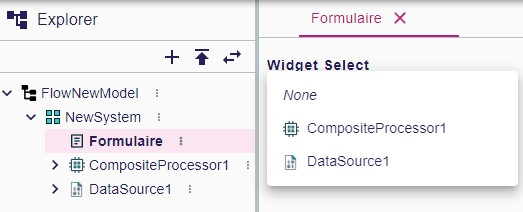
- https://github.com/eclipse-sirius/sirius-components/issues/2055[#2055] [form] Added initial version of a custom widget to view & edit EMF references (both single and multi-valued).
- https://github.com/eclipse-sirius/sirius-components/issues/2056[#2056] [form] Add the possibility to control read-only mode for widgets with an expression.
- https://github.com/eclipse-sirius/sirius-components/issues/2077[#2077] [form] Add the ability to define a border style for groups and flexbox containers.
- https://github.com/eclipse-sirius/sirius-components/issues/2080[#2080] [tree] Add an initial label value when editing tree items label.
- https://github.com/eclipse-sirius/sirius-components/issues/2090[#2090] [diagram] Add the support for the arrange all on react flow diagram.
The arrange all is made with elkjs.
- https://github.com/eclipse-sirius/sirius-components/issues/2094[#2094] [diagram] Add the support for the palette on the diagram background
- https://github.com/eclipse-sirius/sirius-components/issues/2125[#2125] [form] Add the API `IFormPostProcessor` to programmatically modify all forms just before they are published on the subscription.
Note that IFormPostProcessor is a singleton, if several rules must be applied to several forms, a mechanism has to be added to the implementation.
- https://github.com/eclipse-sirius/sirius-components/issues/2116[#2116] [form] Add a modal to select a new value for single-valued references
- https://github.com/eclipse-sirius/sirius-components/issues/2083[#2083] [diagram] Add support for edge markers with React Flow.

=== Improvements

- https://github.com/eclipse-sirius/sirius-components/issues/2034[#2034] [diagram] Integrate the workbench selection in the react-flow prototype
- https://github.com/eclipse-sirius/sirius-components/issues/2047[#2047] [view] Activate architectural tests on `sirius-components-view-builder`
- https://github.com/eclipse-sirius/sirius-components/issues/2036[#2036] [form] Add the concept of pageAction in form.
- https://github.com/eclipse-sirius/sirius-components/issues/2015[#2015] [form] Add to the payload the possibility to return a list of messages, these messages will be displayed on the UI.
+
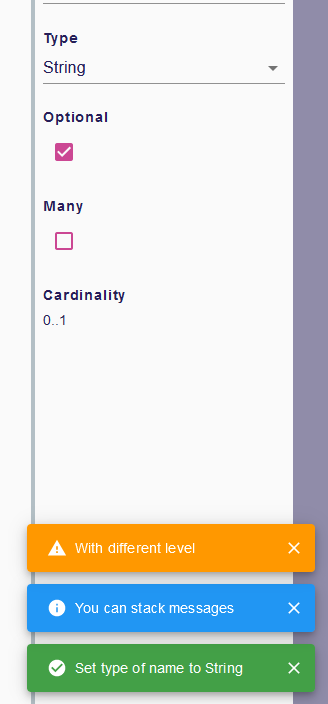
+
There is an example of the `IFeedbackMessageService` interface usage in `DomainAttributeServices`.
Note that in the end, the message list will be the only way to return info in payload, the single message will be removed.
- https://github.com/eclipse-sirius/sirius-components/issues/2010[#2010] [diagram] Add a palette on node with the alternate diagram rendering.
- https://github.com/eclipse-sirius/sirius-components/issues/1988[#1988] All Form widgets can now define (if relevant) a dynamically computed "help text".
Widgets which define such a help text have a new "?" icon next to their labels; the actual help text is accessible as a tooltip on this icon.
For View-based widgets, this materializes as an AQL `helpExpression`.
The help text can include multiple lines (separated by `\n`), but no text formatting.
+
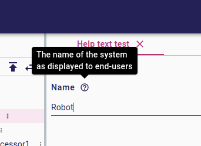
+
- https://github.com/eclipse-sirius/sirius-components/issues/2048[#2048] [diagram] Add a basic support for the resize.
It is possible to reduce the size of a node less than the space needed to display all children.
- https://github.com/eclipse-sirius/sirius-components/issues/2064[#2064] [forms] Make the `IWidgetDescriptor` API more flexible.
- https://github.com/eclipse-sirius/sirius-components/issues/1618[#1618] [view] Split the view metamodel into dedicated subpackages.
- https://github.com/eclipse-sirius/sirius-components/issues/2083[#2083] [diagram] Add support for edge markers
- https://github.com/eclipse-sirius/sirius-components/issues/2086[#2086] [diagram] Add a panel with the default diagram actions
- https://github.com/eclipse-sirius/sirius-components/issues/2087[#2087] [diagram] Add support for snap to grid
- https://github.com/eclipse-sirius/sirius-components/issues/2115[#2115] [form] Add the possibility to choose the label position on checkbox widget.
Note that the default position changes from top to end. +
before :  after : 
- https://github.com/eclipse-sirius/sirius-components/issues/2121[#2121] [diagram] Add new closed arrow with vertical bar to diagram arrow styles
+
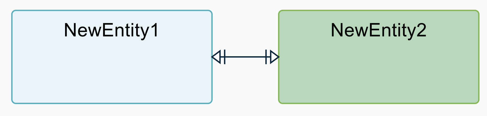
+
- https://github.com/eclipse-sirius/sirius-components/issues/2132[#2132] [diagram] Add new closed arrow with dots to diagram arrow styles
+
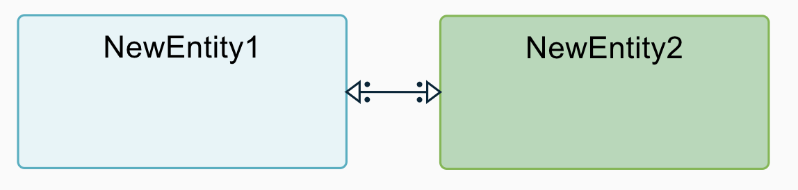
+

- https://github.com/eclipse-sirius/sirius-components/issues/2098[#2098] [forms] Enable vertical scrolling on the Reference widget's when showing more than a few values.
- https://github.com/eclipse-sirius/sirius-components/issues/2135[#2135] [tree] Allow `TreeItemContextMenuContribution`s to only apply to specific trees (based on the tree id).
The existing context menu contributions now only apply to the _Explorer_ view.
- https://github.com/eclipse-sirius/sirius-components/issues/2128[#2128] [releng] Update generated classes copyright to apply the same format as other classes.
- https://github.com/eclipse-sirius/sirius-components/issues/2091[#2091] [diagram] Add support for the direct edit in the diagram with nodes.
- https://github.com/eclipse-sirius/sirius-components/issues/2142[#2142] [diagram] Add support for Edge labels (begin, center, end) in sirius-components-diagrams-reactflow.
- https://github.com/eclipse-sirius/sirius-components/issues/2097[#2097] [forms] Add click handler support on the reference value of a reference widget.
- https://github.com/eclipse-sirius/sirius-components/issues/2123[#2123] [tree] Add support for non-selectable tree items
- https://github.com/eclipse-sirius/sirius-components/issues/2126[#2126] [tree] Add support for multiple Explorer-like tree definitions.
These should be registered globally like other representations using a `IRepresentationDescriptionRegistryConfigurer`.
Their `TreeDescription.getCanCreatePredicate()` will be invoked with a `treeId` variable (a string) to test if it handles a given tree subscription requested by the front.
For example the main _Explorer_ frontend component subscribes to the `treeEvent` subscription with a `treeId` of `'explorer://'`, and the backend `ExplorerDescriptionProvider`'s tests for `treeId.startsWith("explorer://")` to indicate it is the one to use to handle this subscription.
- https://github.com/eclipse-sirius/sirius-components/issues/2096[#2096] [form] Add style for the reference widget.
Use the same style properties as the list widget.
- https://github.com/eclipse-sirius/sirius-components/issues/2175[#2175] [tree] Change tree behavior to reveal the current value(s) in the model browser.
- https://github.com/eclipse-sirius/sirius-components/issues/2171[#2171] [tree] Remove from model browser subtrees with no compatible values.
- https://github.com/eclipse-sirius/sirius-components/issues/2168[#2168] [tree] Add option on tree to disable multiple selection.
- https://github.com/eclipse-sirius/sirius-components/issues/2183[#2183] [form] Add some data-testid to help cypress tests redaction.
- https://github.com/eclipse-sirius/sirius-components/issues/2103[#2103] [diagram] Add support for edge reconnection with React Flow.
- https://github.com/eclipse-sirius/sirius-components/issues/2086[#2086] [diagram] Add the support for the hide and fade of a node
+
The diagram panel with unhide all and unfade all:
+

+
The node palette with hide and fade:
+
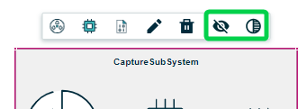
- https://github.com/eclipse-sirius/sirius-components/issues/2095[#2095] [diagram] Add support for the creation of new edges in the alternate diagram rendering solution
- https://github.com/eclipse-sirius/sirius-components/issues/2104[#2104] [diagram] Improve the frontend rendering.
Labels and node list are rendered with css.

== v2023.6.0

=== Shapes

- Filter tree based representations
- Add pages to form in the view DSL
- Simplify the programmatic creation of view models
- Add the ability to convert an odesign to a view model
- Provide a view-based version of Flow
- Add support for the features of the compatibility layer not supported in the view DSL
- Add an example showing how to contribute to the details view with the View DSL
- Improve the layout of simple nodes
- Support custom widgets in Form representations
- Send message to the frontend

=== Architectural decision records

- [ADR-098] Use the editing context to compute the metamodels
- [ADR-099] Filter tree based representations
- [ADR-100] Add support for custom widgets
- [ADR-101] Feedback messages on actions
- [ADR-102] Expand all menu item contribution in Explorer View

=== Breaking changes

- https://github.com/eclipse-sirius/sirius-components/issues/1897[#1897] [diagram] ToolSection are now using records
- https://github.com/eclipse-sirius/sirius-components/issues/1616[#1616] [core] Use Java records for all our payloads
- https://github.com/eclipse-sirius/sirius-components/issues/1848[#1848] [project] Remove the frontend dependency to `uuid` in favor of `crypto.randomUUID`
- https://github.com/eclipse-sirius/sirius-components/issues/1907[#1907] [view] The management of colors is changing, it is not possible anymore to use color directly represented by a string in the _styleDescription_.
All the colors are now defined in a new palette object _ColorPalette_ with the properties _name_ and _value_.
A view can define as many _ColorPalette_ as desired.
In the _styleDescription_, the definition of a color are now a select list of all the colors contained in the _ColorPalette_ of the view
- https://github.com/eclipse-sirius/sirius-components/issues/1970[#1970] [diagram] Simplify the lifecycle of the diagram creation and refresh.
For that, the `DiagramCreationService` will have less responsibilities.
Starting now, it will stop persisting the diagram after its creation.
It will start by improving a bit performances since diagrams were persisted twice in some use cases.
- https://github.com/eclipse-sirius/sirius-components/issues/1915[#1915] [view] Add the page support in the view DSL.

=== Dependency update

- https://github.com/eclipse-sirius/sirius-components/issues/1936[#1936] [releng] Switch to Cypress 12.11.0
- https://github.com/eclipse-sirius/sirius-components/issues/1377[#1377] [core] Switch to Spring Boot 3.0.6
- https://github.com/eclipse-sirius/sirius-components/issues/265[#265] [core] Switch to the latest release of AQL

=== Bug fixes

- https://github.com/eclipse-sirius/sirius-components/issues/1304[#1304] [tree] Fix an issue where dropping an element from the tree to a diagram used the current selection instead of the dragged tree item.
- https://github.com/eclipse-sirius/sirius-components/issues/1839[#1839] [view] Remove default AQL expression on Create Edge and Create Node since they did not work anymore.
- https://github.com/eclipse-sirius/sirius-components/issues/1940[#1940] [sirius-web] Remove duplicated spring-boot-starter-test dependency in sirius-web-sample-application
- https://github.com/eclipse-sirius/sirius-components/issues/1952[#1952] [view] Fix a regression introduced in 2023.4.0 where View-based Forms could no longer be instantiated
- https://github.com/eclipse-sirius/sirius-components/issues/1968[#1968] [sirius-web] Fix a regression introduced with the feature 1907, where for the papaya studio, colors are only searched in the first _ColorPalette_.
- https://github.com/eclipse-sirius/sirius-components/issues/1991[#1991] [form] Fix an issue where widgets from different groups share the same ID.
- https://github.com/eclipse-sirius/sirius-components/issues/1305[#1305] [diagram] Fix an issue where the default tools of the palette's tool sections where not updated.
- https://github.com/eclipse-sirius/sirius-components/issues/2008[#2008] [view] Make edge tool more robust for applications which use a custom IViewRepresentationDescriptionSearchService
- https://github.com/eclipse-sirius/sirius-components/issues/2027[#2027] [diagram] Support both versions of the ITool interface in the imageURL data fetchers
- https://github.com/eclipse-sirius/sirius-components/issues/2026[#2026] [view] Display the layout strategy description of a node description in the explorer view again
- https://github.com/eclipse-sirius/sirius-components/issues/2018[#2018] [formdescriptioneditors] Fixed form editor selection to display the page containing the first element selected.

=== New Features

- https://github.com/eclipse-sirius/sirius-components/issues/1883[#1883] [sirius-web] Add the possibility to programmatically set some metadata such as specifics natures to a project.
These natures can be used later to enable or not some capabilities on a project.
This work will start by adding the ability to filter the project's domains.
A large set of features will have to be updated in order to stop considering the list of metamodels available in an editing context as a certainty.
- https://github.com/eclipse-sirius/sirius-components/issues/1946[#1946] Enabled child extenders in the View DSL implementation.
This allows downstream projects and applications to provide their own sub-types of the DSL types (e.g. new WidgetDescriptions).
In addition to registering the extension metamodel itself, users must provide a `ChildExtenderProvider` bean for their extensions to be properly integrated.
- https://github.com/eclipse-sirius/sirius-components/issues/1918[#1918] [tree] Its is now possible to filter tree items in trees.
After selected a tree item, hit Ctrl+f (or Cmd+f on macOS) to enable the filter bar.
+
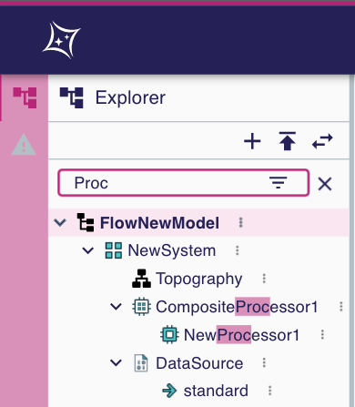
+
All visible tree items containing the value typed in the filter bar will be highlighted.
The filter button inside the filter bar allows to filter (hide) all visible tree items not containing the value typed in the filter bar.
+
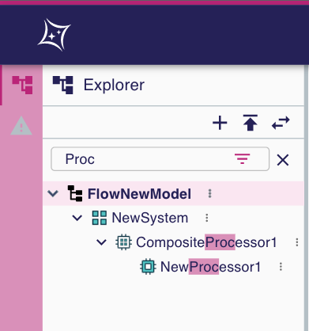
- https://github.com/eclipse-sirius/sirius-components/issues/1914[#1914] [form] It is now possible for applications to provide their own custom widgets without forking Sirius Components.
See link:doc/how-to/contribute-custom-widget.adoc[the documentation] for more details.

- https://github.com/eclipse-sirius/sirius-components/issues/1830[#1830] [layout] This feature is experimental and can be activated on a diagram by adding "__EXPERIMENTAL" to its name.
The new algorithm does the minimum possible to place node without overlap.
- https://github.com/eclipse-sirius/sirius-components/issues/1985[|#1985] [sirius-web] It is now possible to use in-memory View-based representations by registering them in the new `InMemoryViewRegistry`.
These representations can be created programmatically or loaded from `.view` EMF models on startup, and do not need to be stored as documents inside a project in the database.
- https://github.com/eclipse-sirius/sirius-components/issues/1921[#1921] [view] Added a project sirius-components-view-builder.
+
Introducing providers interfaces to help creating view programmatically.
+
Introducing a generator of builders aimed to help creating view programmatically, the generation makes use of emf-merge and modifications to these builders can be annotated to live during future regeneration.

- https://github.com/eclipse-sirius/sirius-components/issues/1912[#1912] [core] Add the possibility to send feedback messages to the frontend after an action.
- https://github.com/eclipse-sirius/sirius-components/issues/1989[#1989] [diagram] Contribute a new way to render diagrams to evaluate an alternate layouting strategy
- https://github.com/eclipse-sirius/sirius-components/issues/1996[#1996] [explorer] Add an Expand All menu item contribution to the Explorer View.
- https://github.com/eclipse-sirius/sirius-components/issues/1966[#1966] [view] Add Selection Description in the View DSL

=== Improvements

- https://github.com/eclipse-sirius/sirius-components/issues/1869[#1869] [tree] Navigate to the first child with the right arrow if a node is expanded.
Navigate to the parent with the left arrow if a node is collapsed
- https://github.com/eclipse-sirius/sirius-components/issues/1621[#1621] [project] Migrate the onboard area to Material-UI
- https://github.com/eclipse-sirius/sirius-components/issues/1852[#1852] [layout] Single position event takes the diagram element id and the double position event takes the source id and target id
- https://github.com/eclipse-sirius/sirius-components/issues/1971[#1971] [layout] Add the first new layout engine integration test
- https://github.com/eclipse-sirius/sirius-components/issues/1831[#1831] [layout] Improve the data structure of the layout algorithm
- https://github.com/eclipse-sirius/sirius-components/issues/1975[#1975] [emf] The getContents method from the ObjectService will use the eObject's IEditingDomainItemProvider if it exists.
- https://github.com/eclipse-sirius/sirius-components/issues/1916[#1916] [sirius-web] We supply an example of how to provide your own _Details_ view definition for specific elements using a View-based FormDescription.
See `org.eclipse.sirius.web.sample.configuration.DomainPropertiesConfigurer` and `org.eclipse.sirius.web.sample.services.DomainAttributeServices` for a working example that can be easily adapted.
- https://github.com/eclipse-sirius/sirius-components/issues/2003[#2003] [view] Make reconnection tool more robust for applications which use a custom IViewRepresentationDescriptionSearchService.

== v2023.4.0

=== Architectural decision records

- [ADR-094] Provide better control on contextual palette's content
- [ADR-095] Use richer data types in the View DSL definition
- [ADR-096] Distinguish the containment kind of view creation requests
- [ADR-097] Separate the layout data structures from the diagram data structures

=== Breaking changes

- https://github.com/eclipse-sirius/sirius-components/issues/1643[1643] [core] Removed our dependencies to Spring Security
- https://github.com/eclipse-sirius/sirius-components/issues/1592[#1592] [view] In View-based diagram definition, all tools applicable on a given element are now configured inside the new _Palette_ element directly inside the element (diagram, node or edge) description.
- https://github.com/eclipse-sirius/sirius-components/issues/1761[#1761] [core] Remove `sirius-web-graphql-schema` since it was not really used anymore
- https://github.com/eclipse-sirius/sirius-components/issues/1825[#1825] [diagram] Distinguish the containment kind of view creation requests
- https://github.com/eclipse-sirius/sirius-components/issues/1840[#1840] [diagram] The GraphQL field Diagram#autoLayout has been removed.
We only use DiagramDescription#autoLayout to retrieve the autolayout state of a diagram.
- https://github.com/eclipse-sirius/sirius-components/issues/1638[#1638] [view] The lifecycle of the representation descriptions from the view DSL is now aligned with the lifecycle of the metamodels computed from the Domain DSL.
+
As such, the representation descriptions available for an `EditingContext` are now computed and transformed when the `EditingContext` is loaded.
It will thus improve the performances of the lookup for representation descriptions since they will be referenced directly by the `EditingContext`.
This does not come with any changes to the interface `IEditingContext`.
Alternate implementations of `IEditingContext` do not have to keep the representation descriptions in their implementation of `IEditingContext`.
+
By loading representation descriptions from the View DSL when the editing context is being loaded, we are making the editing context the sole source of truth of the representation descriptions available.
+
As a result, any datafetcher requiring a representation description will now have to use the editing context event processor registry to find the requested representation description.
We previously had some datafetcher which were using the `IRepresentationDescriptionSearchService`` with `null` as a value for the editing context.
Such calls will not work anymore since `null` will not be an acceptable value anymore by our implementation of this interface.
- [diagram] Changed the type of `Node#descriptionId` and `Edge#descriptionId` from `UUID` to `String`
- [view] Changed the values of {Diagram|Node|Edge}descriptionId computed by the view converter:
** `siriusComponents://diagramDescription?sourceKind=view&sourceId=UUID_OF_DOCUMENT&sourceElementId=UUID_OF_SOURCE_ELEMENT`
** `siriusComponents://nodeDescription?sourceKind=view&sourceId=UUID_OF_DOCUMENT&sourceElementId=UUID_OF_SOURCE_ELEMENT`
** `siriusComponents://edgeDescription?sourceKind=view&sourceId=UUID_OF_DOCUMENT&sourceElementId=UUID_OF_SOURCE_ELEMENT`
- https://github.com/eclipse-sirius/sirius-components/issues/1890[#1890]  [view] Tools are now retrieved from their corresponding View Description
+
Removing dependencies from sirius-components-compatibility-emf in the canHandle methods of sirius-components-view-emf services

=== Dependency update

- [form] Switch to lexical 0.8.1

=== Bug fixes

- https://github.com/eclipse-sirius/sirius-components/issues/1674[#1674] [diagram] The fade and hide tools were available on the background of the diagram
- https://github.com/eclipse-sirius/sirius-components/issues/1710[#1710] [diagram] Ensure that the edit box of an empty edge label is not located at the wrong position
- https://github.com/eclipse-sirius/sirius-components/issues/1716[#1716] [workbench] Fixed the "Related Elements" view when activated on dynamic instances
- https://github.com/eclipse-sirius/sirius-components/issues/1591[#1591] [emf] Creating root elements in a model will now use the EPackages loaded in the package registry of the editing domain
- https://github.com/eclipse-sirius/sirius-components/issues/1746[#1746] [forms] Rich-text editor toolbar on forms representations are not grayed when read-only
- https://github.com/eclipse-sirius/sirius-components/issues/1744[#1744] [forms] Checkboxes on forms representations are not grayed when read-only
- https://github.com/eclipse-sirius/sirius-components/issues/1639[#1639] [core] Support schemaLocation and extendedMetaData for JSON resource
- https://github.com/eclipse-sirius/sirius-components/issues/1760[#1760] [project] Remove an invalid attribute from our pom.xml
- https://github.com/eclipse-sirius/sirius-components/issues/1675[#1675] [explorer] Align tree items without children with their siblings
- https://github.com/eclipse-sirius/sirius-components/issues/619[#619] [explorer] Fix order of the models in the explorer
- https://github.com/eclipse-sirius/sirius-components/issues/1604[#1604] [diagram] Fix fade does not work on border nodes
- https://github.com/eclipse-sirius/sirius-components/issues/1773[#1773] [workbench] Fix editors area tab title may hide close button
- https://github.com/eclipse-sirius/sirius-components/issues/1541[#1541] [workbench] Editors area can overflow on Details view
- https://github.com/eclipse-sirius/sirius-components/issues/1708[#1708] [forms] Fix the impossibility to move a toolbar action from a group to another with no toolbar actions in FormDescriptionEditors.
- https://github.com/eclipse-sirius/sirius-components/issues/1748[#1748] [chart] Underline and strike-through style options are not taken into account for BarCharts.
- https://github.com/eclipse-sirius/sirius-components/issues/1688[#1688] [form] The title of the Details view will not be wrapped on multiple lines anymore
- https://github.com/eclipse-sirius/sirius-components/issues/1602[#1602] [diagram] The connector tool does not work with descriptions from the View DSL
- https://github.com/eclipse-sirius/sirius-components/issues/1833[#1833] [explorer] Fix Explorer toolbar and selected item background color width
- https://github.com/eclipse-sirius/sirius-components/issues/840[#840] [view] Add the ability to create multiple nested views for unsynchronized node descriptions.
For that, specifiers will be able to use properly the variable name property of the create view model operation.
The result returned and captured in this variable name will not be the real node since it will be rendered later but it is a placeholder which contains some properties of the real node such as its id which can be used to create the nested views.
- https://github.com/eclipse-sirius/sirius-components/issues/1838[#1838] [diagram] Collapsing and expanding a node with unsynchronized child nodes will now properly restore the child nodes
- https://github.com/eclipse-sirius/sirius-components/issues/1775[#1775] [core] Handle representation/document/project label length in UI (by adding ellipsis) and in sirius-web SQL schema (up to 1024 characters)
- https://github.com/eclipse-sirius/sirius-components/issues/1829[#1829] [diagram] Node descriptions from the view DSL can now reference concepts outside of their containing diagram description
- https://github.com/eclipse-sirius/sirius-components/issues/1851[#1851] Fix an issue where the explorer could be expanded while not synchronized
- https://github.com/eclipse-sirius/sirius-components/issues/1785[#1785] [form] Fix name collision on labelFields GraphQL fragment
- https://github.com/eclipse-sirius/sirius-components/issues/1908[#1908] [workbench] Fix an issue where the Explorer and Details Views titles could be overflowed
- https://github.com/eclipse-sirius/sirius-components/issues/1929[#1929] [view] Fix an issue where direct edit on View based diagram elements could lead to infinite loop
- https://github.com/eclipse-sirius/sirius-components/issues/1891[#1891] [projects] The 'Show all templates' dialog was not functional from an empty state (with no existing project)
- https://github.com/eclipse-sirius/sirius-components/issues/1934[#1934] [formdescriptioneditor] Fix the renaming of a form Description Editor

=== New Features

- https://github.com/eclipse-sirius/sirius-components/issues/1695[#1695] [view] Add a precondition expression to the node description
- https://github.com/eclipse-sirius/sirius-components/issues/1527[#1527] [diagram] Add the new layout data structure which will be used by the new version of our layout algorithm.
This new data structure will be used by the frontend if the name of a diagram ends with `__EXPERIMENTAL`.
This will allow us to easily compare the current layout algorithm and the new one.
- https://github.com/eclipse-sirius/sirius-components/issues/1846[#1846] [diagram] A debug mode has been added for diagrams.
This debug mode can be activated by setting the configuration property `sirius.components.diagram.debug` to `true`.
Once activated, this debug mode will display additional information on diagram elements to help debug what has been computed by the backend.
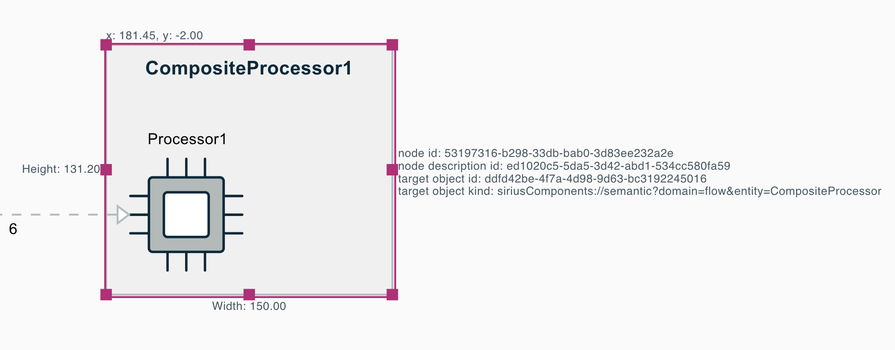
- https://github.com/eclipse-sirius/sirius-components/issues/1902[#1902] [sirius-web] Add new data fetchers to sirius-web allowing to execute AQL requests

=== Improvements

- https://github.com/eclipse-sirius/sirius-components/issues/593[#593] [domain] Add support for referencing and extending other custom domains
- https://github.com/eclipse-sirius/sirius-components/issues/1518[#1518] [project] Remove the "format all code" save action in order to let us write code without having to specify "@formatter:off" everywhere. It will also make it easier for us to use IDEs other than Eclipse to contribute to Sirius Web
- https://github.com/eclipse-sirius/sirius-components/issues/1632[#1632] [core] Start documenting the variables available for each operation in our various representations
- https://github.com/eclipse-sirius/sirius-components/issues/1565[1565] [view] The definition of the View DSL now uses richer data types for most attributes.
This has no visible effect at the moment, but will allow better documentation, validation and configuration later.
- [studio] Add a project template for the Papaya domains and view
- https://github.com/eclipse-sirius/sirius-components/issues/1667[#1667] [diagram] Make the contextual palette self contained 
- https://github.com/eclipse-sirius/sirius-components/issues/1858[#1858] [project] Improve project template cards layout
- https://github.com/eclipse-sirius/sirius-components/issues/1879[#1879] [core] Add an annotation `@Builder` to identify builders and simplify some use cases involving the builder pattern.
It is now possible to use builders in records and it is a first step toward the deprecation of the `@Immutable` annotation in favor of more records.
- [diagram] Added a common interface `IDiagramElement` that is implemented by `Node` and `Edge`
- https://github.com/eclipse-sirius/sirius-components/issues/1904[#1904] [project] Add templates to track our work on shapes and scopes in `doc/iterations/YYYY-MM/{scopes/scope.adoc|shapes/shape.adoc}`.
At the end of every iteration, we will work on the shape of the new iterations and validate them by merging a first version.
+
During the iteration, while developers will progress on their work, they will update the scope.
We will not create a new commit for each minor change in the scope, instead the scope will evolve while a pull request is updated.
The progress on a task could thus be shared with a draft pull request with the rest of the team.


== v2023.3.0

=== Architectural decision records

- [ADR-085] Add support for project templates
- [ADR-086] Add support of edges as targets of single click tools
- [ADR-087] Provide the variables available to each operation
- [ADR-088] Align the lifecycle of views on the lifecycle of domains
- [ADR-089] Add a URL based kind to representation description
- [ADR-090] Improve support for compartments
- [ADR-091] Add support of the compartment expand/collapse
- [ADR-092] Add support for diagram nodes labels' auto-wrap
- [ADR-093] Improve node size control

=== Breaking changes

- [core] Records are now used as the implementations of `IInput`
- https://github.com/eclipse-sirius/sirius-components/issues/1574[#1574] [diagram] In `diagram.graphqls`, `SingleClickOnDiagramElementTool` member's `targetDescriptions` is now of new type `DiagramElementDescription` instead of `NodeDescription`.
- https://github.com/eclipse-sirius/sirius-components/issues/1614[#1614] [graphql] Add a SuccessPayload to replace most basic payloads
- https://github.com/eclipse-sirius/sirius-components/issues/1615[#1615] [diagram] `DiagramDescription.getTools()` has been removed.
It was not actually used, as tools have long been found in `DiagramDescription.getToolSections()` instead.
- https://github.com/eclipse-sirius/sirius-components/issues/1588[#1588] [project] Moved the action "New Model" and "Upload model" in a new tree toolbar
- https://github.com/eclipse-sirius/sirius-components/issues/1614[#1614] [graphql] Add a SuccessPayload to replace most basic payloads, add GQLWidgetOperationPayload to replace most basic Operation

=== Dependency update

- https://github.com/eclipse-sirius/sirius-components/issues/1377[#1377] [core] Switch to Java 17
- [backend] Switch to EMFJson 2.3.4
- https://github.com/eclipse-sirius/sirius-components/issues/1496[#1496] [layout] Switch to ELK 0.8.1

=== Bug fixes

- https://github.com/eclipse-sirius/sirius-components/issues/1374[#1374] [layout] The border node position is now updated when its parents bounds has changed (e.g. when a node increases its size because of a child creation).
- https://github.com/eclipse-sirius/sirius-components/issues/1580[#1580] [diagram] Border nodes do not return to their previous position after they have been moved manually.
- https://github.com/eclipse-sirius/sirius-components/issues/1522[#1522] [diagram] Rectangle nodes with a header can now be resized.
- https://github.com/eclipse-sirius/sirius-components/issues/1529[#1529] [diagram] Improve the layout of newly created edges with a begin or end label
- https://github.com/eclipse-sirius/sirius-components/issues/1607[#1607] [tree] Make sure that a recently closed representation can be opened again
- https://github.com/eclipse-sirius/sirius-components/issues/1686[#1686] [diagram] Fix SVG export of the wrapped labels
- https://github.com/eclipse-sirius/sirius-components/issues/1692[#1692] [core] JPEG images where previously ignored if using a `.jpg` extension instead of `.jpeg`.
They are now correctly supported
- https://github.com/eclipse-sirius/sirius-components/issues/1741[#1741] [diagram] Border node placement specified with ELK configuration not taken into account anymore
- https://github.com/eclipse-sirius/sirius-components/issues/1720[#1720] [diagram] Fix the position where newly created views appear on a diagram after a drop

=== New Features

- https://github.com/eclipse-sirius/sirius-components/issues/1567[#1567] [project] Add support for project templates.
Project templates are defined in the backend using the `IProjectTemplateProvider` (template metadata) and `IProjectTemplateInitializer` (project contents) interfaces.
- https://github.com/eclipse-sirius/sirius-components/issues/1456[#1456] [diagram] Add the ability to filter the edge created using some graphical variables
- https://github.com/eclipse-sirius/sirius-components/issues/1456[#1456] [view] Add a precondition expression to the edge description
- https://github.com/eclipse-sirius/sirius-components/issues/1463[#1463] [diagram] Add support for the direct edit of the start and end labels of an edge. Two new tools can be defined on an edge in order to specify how the begin and end labels can be edited.
+
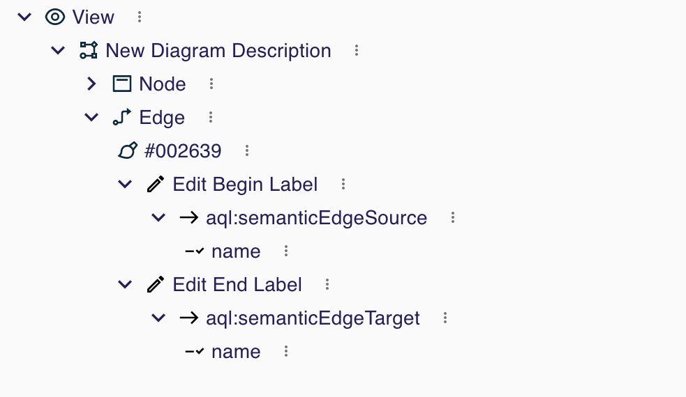
+
For each of those tools, `Edit Begin Label` and `Edit End Label` in the previous screenshot, the specifier can also enter an `Initial Direct Edit Label Expression` which will be used to compute the initial value of the label when the edition will be triggered.
This is mostly used to support the edition of computed labels.
The variables `semanticEdgeSource` and `semanticEdgeTarget` are now available both in the `Initial Direct Edit Label Expression` and while evaluating the behavior of the tools themselves.
+
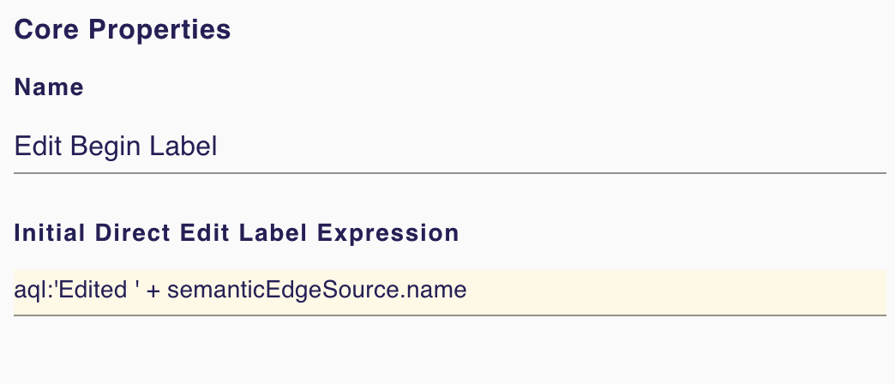
+
In order to edit a begin or end label of an edge, it is necessary to double click on said label.
Using `F2`` will trigger the edition of the center label of the edge.
+
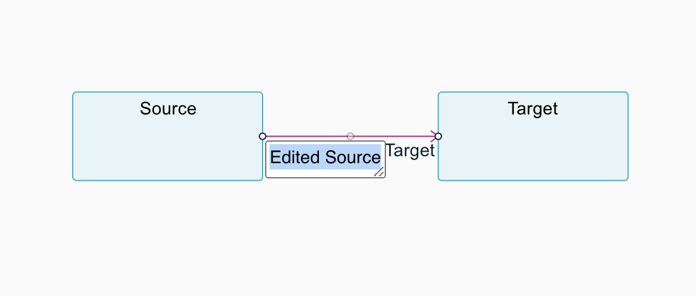
- https://github.com/eclipse-sirius/sirius-components/issues/1496[#1496] [layout] Add the support for free form compartment.
+
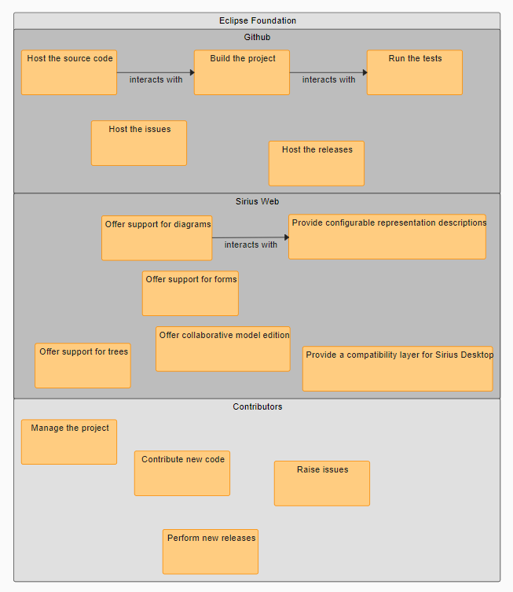

- https://github.com/eclipse-sirius/sirius-components/issues/1624[#1624] [diagram] Add support for expand/collapse of nodes.
A node can be collapsed or expanded if its view description is collapsible or if its sirius desktop description is a region (Horizontal or Vertical stack).
- https://github.com/eclipse-sirius/sirius-components/issues/1624[#1624] [diagram] The `collapsingState` of a node is now available as a variable to compute its style.
As a result, it is possible to create a conditional style which will use the collapsing state quite easily.
Using the view DSL, one can use the expression `aql:collapsingState.toString() = 'COLLAPSED'` as a condition to create a style which will be used when the node is collapsed.
- https://github.com/eclipse-sirius/sirius-components/issues/1584[#1584] [diagram] Studio makers can indicate whether or not a node type can be resized by the end-user or not.
Nodes which can not be resized (or have not been resized yet) have their actual size computed from the NodeDescription's sizeProvider in a uniform way for all node types.
Nodes which can and *have* been resized keep their user-chosen size across both incremental and full layout (as long as the requested size is compatible with other constraints).

- https://github.com/eclipse-sirius/sirius-components/issues/1583[#1583] [diagram] Add support for diagram nodes labels' auto-wrap
+
image:doc/images/Diagram_node_labels_auto_wrap.png[width=517,height=424]
- https://github.com/eclipse-sirius/sirius-components/issues/1588[#1588] [tree] Add support for enabling/disabling the synchronization between the explorer and the current selection.
When it is enabled, if the current selection is not visible in the explorer, it will be revealed by expanding the relevant tree items.
On the other hand, when it is disabled, the selection will be visible in the explorer but no tree items will be automatically expanded.


=== Improvements

- https://github.com/eclipse-sirius/sirius-components/issues/1559[#1559] [view] It is now possible to specify the (computed) width and height separately for a _Node Style_ (instead of a single size before, which always resulted in square shapes).
- https://github.com/eclipse-sirius/sirius-components/issues/1560[#1560] Remove unused `EditingContextCompletionProposalsDataFetcher`
- https://github.com/eclipse-sirius/sirius-components/issues/1426[#1426] [view] Add missing data type on initialDirectEditLabelExpression
- https://github.com/eclipse-sirius/sirius-components/issues/1456[#1456] [diagram] Add new methods to the diagram rendering cache to compute the parent, ancestors, children and descendants of a given node identifier
- https://github.com/eclipse-sirius/sirius-components/issues/1574[#1574] [diagram] Single click tools can now be executed on Edges in addition to Nodes
- https://github.com/eclipse-sirius/sirius-components/issues/1569[#1569] [view] Only delegate semantic deletion to the element's _Delete Tool_
- https://github.com/eclipse-sirius/sirius-components/issues/1562[#1562] [view] The default/canonical behaviors for diagram elements can now be invoked explicitly from AQL expressions. See `org.eclipse.sirius.components.view.emf.CanonicalServices`. This feature will be used only for internal for now. There will be breaking changes on this topic soon.
- https://github.com/eclipse-sirius/sirius-components/issues/1596[#1596] [diagram] Sirius Web now includes two example parametric SVG images named "Package" and "Class".
They can be used as any custom image (e.g. in a View-based diagram), but their precise shape is partially computed on the backend, in this case to adjust the size of the label compartment to the actual label's width.
- https://github.com/eclipse-sirius/sirius-components/issues/1563[#1563] [view] If a diagram description does not explicitly configure a delete/direct edit/element creation tool, the corresponding behavior is simply disabled.
By default, new nodes, edges and tools are explicitly configured to invoke the default canonical behavior; it is just made explicit in the model and can now serve as a based or removed to disable the behavior.
- https://github.com/eclipse-sirius/sirius-components/issues/1558[#1558] [diagram] When a diagram is read-only, the following actions are now disabled: _Arrange All_, _Reveal hidden_ and _Reveal faded_ elements, and triggering direct edit or delete from the keyboard.

== v2023.1.0

=== Architectural decision records

- [ADR-075] Add support for a basic image widget
- [ADR-076] Allow users to upload their own custom images
- [ADR-077] Improve support for direct edit in diagram
- [ADR-078] Add support for toolbar actions in Form/FormDescriptionEditor
- [ADR-079] Add support for a rich text edition widget
- [ADR-080] Add support for styles preview in FormDescriptionEditor
- [ADR-081] Add support for multi-groups in Form/FormDescriptionEditor
- [ADR-082] Add support for optional text completion on textfield widgets
- [ADR-083] Add the possibility to hide or fade a diagram element
- [ADR-084] Improve support for View elements' tools icons

=== Breaking changes

- https://github.com/eclipse-sirius/sirius-components/issues/1437[#1437] [backend] `sirius-components-formdescriptioneditors` now depends on `sirius-components-forms`. `IFormDescriptionEditorWidget.java` have been deleted, `FormDescriptionEditor.java` now relies on `AbstractWidget.java` from `sirius-components-forms`.
- https://github.com/eclipse-sirius/sirius-components/issues/1437[#1437] [graphql] `formdescriptioneditor.graphqls` now depends on widgets from `forms.graphqls`

=== Dependency update

- [backenđ] Upgrade to Apache Batik 1.16.0 (from 1.14.0)
- [backend] Switch to https://github.com/spring-projects/spring-boot/releases/tag/v2.7.5[Spring Boot 2.7.5]
- [backend] Switch to EMFJson 2.3.3

=== Bug fixes

- https://github.com/eclipse-sirius/sirius-components/issues/1431[#1431] [form] The default implementation of the Property View should not try to handle a multi valuated EStructuralFeature of type String
- https://github.com/eclipse-sirius/sirius-components/issues/1448[#1448] [formdescriptioneditors] Create a default style for new TextArea widgets like for the others
- https://github.com/eclipse-sirius/sirius-components/issues/1397[#1397] [view] Fix an issue where canonical tools of reused node descriptions were not available
- https://github.com/eclipse-sirius/sirius-components/issues/666[#666] [diagram] Make the contextual palette display the tools of the current selection
- https://github.com/eclipse-sirius/sirius-components/issues/1442[#1442] [diagram] Selecting an element in a diagram can hide others
- https://github.com/eclipse-sirius/sirius-components/issues/1462[#1462] [diagram] Restore the missing hover / selected feedback on parametric SVG style
- [diagram] When clicking on a node in a diagram, the creation tools list is now always in the same order
- https://github.com/eclipse-sirius/sirius-components/issues/1485[#1485] [diagram] Select the relevant edge reconnection tools
- https://github.com/eclipse-sirius/sirius-components/issues/1401[#1401] [tree] The setSelection is called even if the selection did not changed

=== Improvements

- https://github.com/eclipse-sirius/sirius-components/issues/1482[#1482] [core] Allow CustomImageLoader to get images from packaged projects. To import images from local files on startup, set `-Dorg.eclipse.sirius.web.customImages.pattern="file:///local/path/to/folder/with/files/**"`. To import images from a folder inside a packaged JAR, use `-Dorg.eclipse.sirius.web.customImages.pattern="classpath:path/in/jar/**"`. The syntax supports Ant-style path patterns.
- https://github.com/eclipse-sirius/sirius-components/issues/1517[#1517] [core] Remove the error for strings which are not marked as non-externalized

=== New Features

- https://github.com/eclipse-sirius/sirius-components/issues/1453[#1453] [diagram] Add new arrow styles Circle, FillCircle and CrossedCircle
- https://github.com/eclipse-sirius/sirius-components/issues/1364[#1364] [forms] Add support for a basic image widget
- https://github.com/eclipse-sirius/sirius-components/issues/1386[#1386] [project] Users can now upload their own images from a project's new settings page (available in the project menu). These images can be displayed in forms using the new image widget, or in View-based diagrams using and ImageNodeStyleDescription and selecting the image in the list of available shapes.
- https://github.com/eclipse-sirius/sirius-components/issues/1457[#1457] [diagram] Make possible to provide an expression on the label edit tool in View DSL to initialize the direct edit label text field. We kept the current behavior for the compatibility layer but, _in fine_ it will be possible to leverage the direct edit tool _Input Label Expression_ to initialize the direct edit label text field.
- https://github.com/eclipse-sirius/sirius-components/issues/1346[#1346] [forms] Add support for a Rich Text edition widget. The widget behaves in a similar way to the existing Textfield and Textarea widgets, except that the text value should be valid Markdown, and can be edited in a WYSIWYG way by the end user.
- https://github.com/eclipse-sirius/sirius-components/issues/1428[#1428] [layout] Add support for List layout compartment. We rely on the layout strategy engine handler switch and the layout engine handler switch to dispatch to the correct behavior depending on how children should be laid out and the type of the node. This kind of architecture has already been implemented for model operation for the View DSL. Nothing has changed if nodes have to be laid out freely.
- https://github.com/eclipse-sirius/sirius-components/issues/1439[#1439] [form] Add support for toolbar actions in Form/FormDescriptionEditor
- https://github.com/eclipse-sirius/sirius-components/issues/1437[#1437] [form] Add support for styles preview in FormDescriptionEditor
`- https://github.com/eclipse-sirius/sirius-components/issues/1494[#1494] [form] Add width and height attributes to BarChart
- https://github.com/eclipse-sirius/sirius-components/issues/1510[#1510] [form] Add support for multi-groups in Form/FormDescriptionEditor
- https://github.com/eclipse-sirius/sirius-components/issues/1504[#1504] [releng] Add Cypress-based integration tests
- https://github.com/eclipse-sirius/sirius-components/issues/1446[#1446] [diagram] Add support for hidden and faded edges
- https://github.com/eclipse-sirius/sirius-components/issues/1426[#1426] [forms] Add support for optional text completion on textfield widgets. This is enabled in the View DSL properties for domain types and AQL expressions
- https://github.com/eclipse-sirius/sirius-components/issues/1507[#1507] [diagram] Missing variables during execution of a source reconnection tool from the View description (otherEnd,semanticOtherEnd,edgeView and editingContext)
- https://github.com/eclipse-sirius/sirius-components/issues/1521[#1521] [view] Canonical creation tools from contextual toolbar have no icons
- https://github.com/eclipse-sirius/sirius-components/issues/1467[#1467] [layout] Elk is now able to compute a list layout. It is an internal change, and thus, nothing should change for the end user

== v2022.11.0

=== Architectural decision records

- [ADR-069] Add support for children layout strategy
- [ADR-070] How to contribute a new diagram node style
- [ADR-071] Add parametric SVG node style
- [ADR-072] Add support for the edition of routing points
- [ADR-073] Add support for intermodel references (inside the same project)
- [ADR-074] Add support for edge reconnection

=== Breaking changes

- https://github.com/eclipse-sirius/sirius-components/issues/1300[#1300] [core] Rename SiriusWebJSONResourceFactoryImpl to JSONResourceFactoryImpl
- https://github.com/eclipse-sirius/sirius-components/issues/1301[#1301] [core] Add support for having intermodel references. Now, the URI of resources added in a ResourceSet must have a `scheme`. Otherwise, you will  encounter exceptions.
- https://github.com/eclipse-sirius/sirius-components/issues/1064[#1064] [core] Remove the URL utility file and ask for the `httpOrigin` instead. Consumers of Sirius Components which rely on the behavior of the URL utility file should instead maintain their own utility file since it is dependent on our build technology and development process.

=== Dependency update

- [backend] Switch to EMFJson 2.3.2-SNAPSHOT. It contains better management of proxy resolution in case of intermodel references

=== Bug fixes

- https://github.com/eclipse-sirius/sirius-components/issues/1368[#1368] [diagram] Do not render rectangle view children twice
- https://github.com/eclipse-sirius/sirius-components/issues/931[#931] [layout] When the delete tool of an edge is used, the position of other edges are not affected.
- https://github.com/eclipse-sirius/sirius-components/issues/1392[#1392] [core] Fix EditingContextCrossReferenceAdapter for derived references
- https://github.com/eclipse-sirius/sirius-components/issues/1411[#1411] [vscode-extension] Fix a 404 error on the VSCode extension page when loading the image
- https://github.com/eclipse-sirius/sirius-components/issues/1454[#1454] [vscode-extension] Fix a misprint in VSCode Extension README

=== Improvements

- https://github.com/eclipse-sirius/sirius-components/issues/1339[#1339] [layout] Add concept of layout strategy. The purpose of layout strategy is to split the style of a node from the way a node lays out its children.
- https://github.com/eclipse-sirius/sirius-components/issues/1385[#1385] [releng] Migrate the backend and frontend code of Sirius Web to Sirius Component. The purpose of this migration is to facilitate the maintenance of these two projects (one pull request instead of two different).
- https://github.com/eclipse-sirius/sirius-components/issues/997[#997] [diagram] Edge routing points are not reset when one of the edge end is moving
- https://github.com/eclipse-sirius/sirius-components/issues/1387[#1387] [releng] Migrate VSCode Extension to Sirius Components.
- https://github.com/eclipse-sirius/sirius-components/issues/1423[#1423] [forms] In-browser spell-checking is now disabled on textfields.

=== New Features

- https://github.com/eclipse-sirius/sirius-components/issues/1316[#1316] [diagram] Support parametric svg node style
- https://github.com/eclipse-sirius/sirius-components/issues/997[#997] [diagram] Add support for edition of routing points in diagrams
- https://github.com/eclipse-sirius/sirius-components/issues/1397[#1397] [diagram] Add support for reused node descriptions
- https://github.com/eclipse-sirius/sirius-components/issues/780[#780] [diagram] Add support for edge reconnection. Edge reconnection descriptions can be defined either inside a classical Sirius desktop VSM or, using the View DSL. While using the Sirius desktop VSM you can define a tool to do both target and source reconnection, you will need to define a tool to reconnect the source and another one to reconnect the target using the View DSL

== v2022.9.0

=== Architectural decision records

- [ADR-067] Add support for injecting platform services/beans into Java service classes used by studios
- [ADR-068] Improve support for precondition expression from representation description

=== Breaking changes

- https://github.com/eclipse-sirius/sirius-components/issues/1311[#1311] [releng] Allow reusing `sirius-components-emf` without dependencies to the domain or view DSL. As a result, two new projects `sirius-components-domain-emf` and `sirius-components-view-emf` have been introduced in order to connect the EMF compatibility layer with the domain and view DSL. Consumers of `sirius-components-emf` may have to update their import. The behavior of the code has not been modified
- https://github.com/eclipse-sirius/sirius-components/issues/1311[#1311] [releng] Allow reusing `sirius-component-emf` without dependencies to Sirius Desktop. As a result, a new project `sirius-components-compatibility-emf` has been added in order to provide EMF support for the Sirius desktop compatibility layer. Consumers of `sirius-components-emf` may have to update their import. The behavior of the code has not been modified
- https://github.com/eclipse-sirius/sirius-components/issues/1237[#1237] [releng] Remove the two hardcoded dependencies to Spring MVC from Sirius Components. As such, reusing most components from Sirius Components without Spring MVC will be easier. The only projects with a dependency to Spring MVC are located in the `web` package
- https://github.com/eclipse-sirius/sirius-components/issues/1312[#1312] [graphql] Provide the datafetchers used by the representations. Starting with the validation representation, we will provide datafetchers directly in Sirius Components to simplify the integration of Sirius Components in various applications. The project `sirius-components-graphql-utils` has been merged into `sirius-components-graphql-api` since they had similar dependencies.
- https://github.com/eclipse-sirius/sirius-components/issues/1231[#1231] [charts] The components related to charts have been extracted to `@eclipse-sirius/sirius-components-charts`
- https://github.com/eclipse-sirius/sirius-components/issues/1231[#1231] [forms] The components related to forms have been extracted to `@eclipse-sirius/sirius-components-forms`. The views and representations have adopted the suffix `View` and `Representation` respectively. As an example, the component `FormWebSocketContainer` is now named `FormRepresentation`
- https://github.com/eclipse-sirius/sirius-components/issues/1231[#1231] [formdescriptioneditors] The components related to formdescriptioneditors have been extracted to `@eclipse-sirius/sirius-components-formdescriptioneditors`. The representation has been renamed `FormDescriptionEditorRepresentation`.
- https://github.com/eclipse-sirius/sirius-components/issues/1231[#1231] [core] Since the core parts of Sirius Components cannot possibly known the components of the representations installed in a project, the context `RepresentationContext` will not provide a default value anymore. In a similar fashion, the `ServerContext` from `@eclipse-sirius/sirius-components-core` will now be required in order to let Sirius Components retrieve the URL of the backend.
- https://github.com/eclipse-sirius/sirius-components/issues/1231[#1231] [trees] The trees related components and the explorer have been extracted to `@eclipse-sirius/sirius-components-trees`. The `ExplorerWebSocketContainer` has also been renamed `ExplorerView` to match the naming convention of the other views. The components migrated have also been fully converted to XState and MaterialUI
- https://github.com/eclipse-sirius/sirius-components/issues/1231[#1231] [workbench] The workbench was depending on some tree components in order to compute the list of `TreeItemContextMenuContribution` to use in the explorer. This dependency has been removed and as a result, users of the workbench component will have to rely on the `TreeItemContextMenuContext` to provide the contributions
- https://github.com/eclipse-sirius/sirius-components/issues/1231[#1231] [workbench] Move the workbench related code to `@eclipse-sirius/sirius-components-core`. This move includes components such as `Workbench`, `RepresentationContext`, `WorkbenchViewContribution` for example
- https://github.com/eclipse-sirius/sirius-components/issues/1231[#1231] [diagram] Move the code of the diagram and the selection wizard in the packages `@eclipse-sirius/sirius-components-diagrams` and `@eclipse-sirius/sirius-components-selection`
- https://github.com/eclipse-sirius/sirius-components/issues/1231[#1231] [core] Some code remain in the soon to be deprecated Sirius Component package `@eclipse-sirius/sirius-components`. Most of this code will either be moved to Sirius Web or be removed entirely (such as the old non MaterialUI widgets)
- https://github.com/eclipse-sirius/sirius-components/issues/1288[#1288] [core] The `EditingContext#representationDescriptions` field now takes an `objectId: ID` as argument instead of just the object's `kind: ID`.
This allows representation precondition expressions to be more precise as they know the actual candidate instance, not just its type.
- https://github.com/eclipse-sirius/sirius-components/issues/1281[#1281] [form] The `LinkDescription` now requires a `displayProvider` and a `styleProvider`. The `displayProvider` is used to display the text of the hyperLink.
The GraphQL API has also been changed with two additional fields on the type `Link`: `display` and `style` (optional). The front-end use the `display` value instead of the `label` value to display the hyperlink text.
The `label` value is displayed before the widget to be consistent with other properties sections.
- https://github.com/eclipse-sirius/sirius-components/issues/1320[#1320] [diagram] The `selectedNode` variable is now always _defined_ in the context of drop handlers and single-click tools. Previously, if the target of the drop or single-click tool was the diagram itself (instead of a node), the variable was not defined at all. Now it is defined but `null` in these cases.
- https://github.com/eclipse-sirius/sirius-components/issues/1289[#1289] [core] The `representationDescriptions` GraphQL query now returns a new attribute named `defaultName` in addition to the `label` and `id`. For view-based representations and , the `defaultName` is computed from the `RepresentationDescription`'s `titleExpression`.

=== Dependency update

- [frontend] Update the format of the `package-lock.json` by moving to node 18.7.0 and npm 8.15.0. This will allow us to use the latest version of npm which comes with improvements for its workspace support. This will also help us move beyond the change in behavior of https://github.com/npm/cli/issues/4998[node 16.15.1 and npm 8.6]
- [frontend] Update the version of `jest-transform-css` used in order to fix the long standing issues of its incompatibility with the version of `postcss`` that we use. We will thus use `postcss 8.4.14` and `jest-transform-css 4.0.1` now
- [frontend] Remove our dependency to `ts-transform-graphql-tag` since it is not maintained and its dependencies are outdated and since it is used to lower the dependency with `graphql-tag` which we will stop using soon
- [frontend] Remove the peer dependency to `graphql-tag`. It will not be required for projects consuming Sirius Components now
- [frontend] Remove the peer dependency to `subscriptions-transport-ws`. It is not required by Sirius Components and consumers of Sirius Components will be free to switch to `graphql-ws` instead of even to not rely on web socket at all to communicate with the backend. Sirius Components itself does not need to specify how the communication with the backend will be done
- [frontend] Switch to `@apollo/client 3.6.9`, `@material-ui/core 4.12.4`, `@material-ui/icons 4.11.3`, `graphql 16.5.0`, `prop-types 15.8.1`, `sprotty 0.12.2` and `xstate 4.32.1`. Various development dependencies have also been updated such as typescript, rollup, prettier etc
- [backend] Switch to https://github.com/spring-projects/spring-boot/releases/tag/v2.7.2[Spring Boot 2.7.2]
- [backend] Switch to the managed version of GraphQL Java, as of Spring Boot 2.7.2, we will thus use GraphQL Java 18.2

=== Bug fixes

- https://github.com/eclipse-sirius/sirius-components/issues/1287[#1287] [form] Fix wrong VariableManager scope usage in ViewFormDescriptionConverterSwitch.
- https://github.com/eclipse-sirius/sirius-components/issues/1250[#1250] [diagram] Fix invoke tool effect hooks dependencies (to avoid evaluating the same tool result multiple times)
- https://github.com/eclipse-sirius/sirius-components/issues/1347[#1347] [form] Fix Conditional Style menu items (two menu items available instead of one)
- https://github.com/eclipse-sirius/sirius-components/issues/1349[#1349] [form] Fix Form Representation scrolling on Y axis
- https://github.com/eclipse-sirius/sirius-components/issues/1351[#1351] [form] Fix Style/ConditionalStyle not applied to List Widget
- https://github.com/eclipse-sirius/sirius-components/issues/457[#457] [form] Fix rename Form representation from the project explorer
- https://github.com/eclipse-sirius/sirius-components/issues/1354[#1354] [form] Fix rename FormDescriptionEditor representation from the project explorer
- https://github.com/eclipse-sirius/sirius-components/issues/1356[#1356] [view] Semantic Candidates Expression are bypassed on Unsynchronized children nodes

=== Improvements

- https://github.com/eclipse-sirius/sirius-components/issues/1231[#1231] [releng] Organize backend projects into scope-specific packages
- https://github.com/eclipse-sirius/sirius-components/issues/1231[#1231] [releng] Switch to node 18.7 for the continuous integration
- https://github.com/eclipse-sirius/sirius-components/issues/1231[#1231] [releng] Store code coverage results for the frontend packages just like backend packages
- https://github.com/eclipse-sirius/sirius-components/issues/1231[#1231] [releng] Fix every unit tests provided in the various frontend packages
- https://github.com/eclipse-sirius/sirius-components/issues/1318[#1318] [studio] Java service classes used by studios (via `IJavaServiceProvider`) can now ask to be injected with any Spring bean available in the application context (for example `IObjectService` or other Sirius Components services they need for their implementation).
- https://github.com/eclipse-sirius/sirius-components/issues/1288[#1288] [core] Improve support for precondition expression from representation description
- https://github.com/eclipse-sirius/sirius-components/issues/1269[#1269] [diagram] Prevent dropping elements in a read only diagram
- https://github.com/eclipse-sirius/sirius-components/issues/1284[#1284] [form] Remove tab when Form representation contains only one page
- https://github.com/eclipse-sirius/sirius-components/issues/1329[#1329] [studio] The `convertedNodes` variable which was exposed to node create tools for View-based diagrams is now available for all tools of these diagrams
- https://github.com/eclipse-sirius/sirius-components/issues/1289[#1289] [core] Improve support for title expression from representation description.
- https://github.com/eclipse-sirius/sirius-components/issues/1341[#1341] [diagram] Expose source and target node variables during EdgeTool execution
- [core] The input and payloads manipulated by the `EditingContextEventProcessor` can now be logged using `
logging.level.org.eclipse.sirius.components.collaborative.editingcontext.EditingContextEventProcessor=trace`

=== New features

- https://github.com/eclipse-sirius/sirius-components/issues/1265[#1265] [form] Add support for flexbox containers on FormDescriptionEditors
- https://github.com/eclipse-sirius/sirius-components/issues/1272[#1272] [form] Add support for button widget on FormDescriptions
- https://github.com/eclipse-sirius/sirius-components/issues/1273[#1273] [form] Add support for button widget on FormDescriptionEditors
- https://github.com/eclipse-sirius/sirius-components/issues/1266[#1266] [form] Add styling support on bar-chart and pie-chart Widgets in View DSL
- https://github.com/eclipse-sirius/sirius-components/issues/1275[#1275] [form] Add support for Label widget in Form representation
- https://github.com/eclipse-sirius/sirius-components/issues/1281[#1281] [form] Add support for Link widget in Form representation
- https://github.com/eclipse-sirius/sirius-components/issues/1292[#1292] [form] Add support for List widget in Form representation

== v2022.7.0

=== Architectural decision records

- [ADR-60] Add support for d3 bars data-structure and bar-chart representation
- [ADR-61] Add support for flexbox containers on form description
- [ADR-62] Switch to a monorepo layout
- [ADR-63] Simplify the Sprotty integration
- [ADR-64] Add support for a ToggableAreaContainer in forms
- [ADR-65] Add support for a tree widget in forms
- [ADR-66] Add a new "Related Elements" view

=== Breaking changes

- https://github.com/eclipse-sirius/sirius-components/issues/1141[#1141] [frontend] The `PropertiesWebSocketContainer` which was hard-coded to display the `propertiesEvent` subscription has been made more generic and renamed `FormBasedView`.
It now takes an additional prop named `subscriptionName` so that it can be bound to other subscriptions (which must follow the same API/protocol and send Form payloads).
To integrate the "Details" view inside a workbench, one must now use the new `DetailsView` component (which simply configures `FormBasedView` to listen to `propertiesEvent` as before).

=== Dependency update

- The frontend now depends on `@material-ui/lab` to support the new https://github.com/eclipse-sirius/sirius-components/issues/1139[tree widget] (see ADR-065).

=== Bug fixes

- https://github.com/eclipse-sirius/sirius-components/issues/1245[#1245] [form] Fix Dropping widget from FormDescriptionEditor opens new tab on Firefox
- https://github.com/eclipse-sirius/sirius-components/issues/1253[#1253] [studio] Fix the computation of unsynchronized semantic elements in studios (which broke the use of the Create View operation)
- https://github.com/eclipse-sirius/sirius-components/issues/1193[#1193] [layout] Fix edge layout on diagrams with node lists.
- https://github.com/eclipse-sirius/sirius-components/issues/1260[#1260] [workbench] Fix download project fails when model contains a Form Description Editor
- https://github.com/eclipse-sirius/sirius-components/issues/1268[#1268] [form] Use literal instead of name for Enum label & newValue
- https://github.com/eclipse-sirius/sirius-components/issues/1308[#1308] [workbench] Fix the vertical overflow issue on the view header
- https://github.com/eclipse-sirius/sirius-components/issues/1306[#1306] [form] Fix unable to set None value from a Select widget from View Form

=== Improvements

- https://github.com/eclipse-sirius/sirius-components/issues/1242[#1242] [view] Provide icons for View DSL Widgets and FormDescription
- https://github.com/eclipse-sirius/sirius-components/issues/1214[#1214] [forms] The mandatory label attribute which was available in all concrete widget types is now explicitly part of the common supertype.
- https://github.com/eclipse-sirius/sirius-components/issues/1215[#1215] [forms] Widgets can now optionally specify an `iconURL`. It is not used in the default UI for the details view or forms representations for now, but icons (if present) are visible in the toggle buttons bar for groups using the new `displayMode = TOGGLEABLE_AREAS`.
- https://github.com/eclipse-sirius/sirius-components/issues/1141[#1141] [workbench] It is now possible to add a "Related View" contribution to the workbench.
It behaves like the "Details" view in that it reacts to the selection by displaying a Form, but is designed to display contextual information about the selected element (i.e. which elements it points to and which elements point to it for example).
The actual definition of the application (e.g. Sirius Web), which must provide a single bean implementing the new `IRelatedElementsDescriptionProvider` interface.

=== New features

- https://github.com/eclipse-sirius/sirius-components/issues/1212[#1212] [form] Add styling support on Textfield Widget in View DSL
- https://github.com/eclipse-sirius/sirius-components/issues/1233[#1233] [form] Handle styling of the View DSL widgets
- https://github.com/eclipse-sirius/sirius-components/issues/1236[#1236] [form] Handle conditional styling of the View DSL widgets 
- https://github.com/eclipse-sirius/sirius-components/issues/1203[#1203] [charts] Add support for d3 bars data-structure and bar-chart representation
- https://github.com/eclipse-sirius/sirius-components/issues/1228[#1228] [charts] Add support for bar-chart in view DSL
- https://github.com/eclipse-sirius/sirius-components/issues/1248[#1248] [charts] Add support for pie-chart in Form representation
- https://github.com/eclipse-sirius/sirius-components/issues/1255[#1255] [form] Add support for charts in form descriptions editor

== v2022.5.0

=== Architectural decision records

- [ADR-50] Add support for multiple selection entries in the details view
- [ADR-51] Add support for form descriptions in the View DSL
- [ADR-52] Add support for EditingContext actions
- [ADR-53] Add support for form descriptions in the view converter
- [ADR-54] Add the support of custom anchors on the frontend side
- [ADR-55] Stop considering the source and target anchors as routing points anymore
- [ADR-56] Add support for a form descriptions editor
- [ADR-57] Add the ability to minimize the content of a site
- [ADR-58] Compute dynamically the connector tools
- [ADR-59] Add support for styling of the widgets and charts in the API, DSL, converter and compatibility layer

=== Deprecation warning

=== Breaking changes

- https://github.com/eclipse-sirius/sirius-components/issues/1088[#1088] [core] Change the type of `IRepresentationDescription#id` from UUID to String.
This will allow us, when we will receive an operation to perform with a given representation description identifier, to determine if this operation should be handled by the Sirius Desktop compatibility layer, the View support or by a programmatic API
- https://github.com/eclipse-sirius/sirius-components/issues/1138[#1138] [workbench] The APIs for the `Panels` and `Site` components have been modified to support closing/opening the panels.
In particular, `Panels` now handles all three parts of the layout (the left and right sites and the main area) directly instead of using recursive two-sided panels.
See ADR-54 for the details.
- https://github.com/eclipse-sirius/sirius-components/issues/1155[#1155] [workbench] `WorkbenchViewContribution` now require an `icon` prop
- https://github.com/eclipse-sirius/sirius-components/issues/1155[#1155] [core] The palette used by Sirius Components now require two additional colors for the navigation area. The type of the new palette is described in `frontend/src/materialui.ts`. Users of the fallback theme can upgrade without having to add those new colors since they are provided by default.
- https://github.com/eclipse-sirius/sirius-components/issues/966[#966] [core] The source and target edge anchor are not considered as routing points anymore. Edges of old diagrams may have unexpected behavior since new edges will have two less routing points than existing edges in old diagrams. For further explanation see ADR-054.
- https://github.com/eclipse-sirius/sirius-components/issues/1180[#1180] [diagram] An implementation of `IConnectorToolsProvider` has to be made for the connector tool to work.

=== Dependency update

- https://github.com/eclipse-sirius/sirius-components/issues/1118[#1118] [core] Switch to Spring Boot 2.6.6
- https://github.com/eclipse-sirius/sirius-components/issues/1118[#1118] [core] Switch to GraphQL Java 18.0
- https://github.com/eclipse-sirius/sirius-components/issues/1118[#1118] [core] Switch to Sirius Desktop 7.0.0
- https://github.com/eclipse-sirius/sirius-components/issues/1140[#1140] [forms] The frontend now depends on `@material-ui/lab` version 4.0.0-alpha.61

=== Bug fixes

- https://github.com/eclipse-sirius/sirius-components/issues/1154[#1154] [diagram] Display the palette where the click has been made, not where the cursor is. With the edge animation it was possible for the palette to be displayed at a wrong position which was making possible to create a floating edge.
- https://github.com/eclipse-sirius/sirius-components/issues/1148[#1148] [diagram] Fix a lot of cases where removing an edge will change the layout of some other edges. This behavior will still happen when it will exist two edges between the two same elements and one of the edge is removed, the other edge will probably take the layout of the removed edge.
- https://github.com/eclipse-sirius/sirius-components/issues/1176[#1176] [diagram] Fix potential ConcurrentModificationException in ViewDiagramDescriptionConverter when manipulating diagrams. This bug was introduced by the https://github.com/eclipse-sirius/sirius-components/issues/1152[#1152].
- https://github.com/eclipse-sirius/sirius-components/issues/1171[#1171] [workbench] Fix the overflow behavior of the side panels when they are resized horizontally
- https://github.com/eclipse-sirius/sirius-components/issues/1115[#1115] [workbench] Stop using the deprecated props `rowsMax`
- https://github.com/eclipse-sirius/sirius-components/issues/1219[#1219] [diagram] Fixed diagram svg export diamond arrow path
- https://github.com/eclipse-sirius/sirius-components/issues/1195[#1195] [diagram] Fix edge svg export
- https://github.com/eclipse-sirius/sirius-components/issues/1194[#1194] [diagram] Fix empty diagram svg export

=== Improvements

- https://github.com/eclipse-sirius/sirius-components/issues/1165[#1165] [doc] Improve the pull request template
- https://github.com/eclipse-sirius/sirius-components/issues/1155[#1155] [workbench] The left and right panels now use a vertical bar of icons (instead of accordions) to select which view to display
- https://github.com/eclipse-sirius/sirius-components/issues/966[#966] [diagram] Add the support source and target edge position ratio on the frontend side. For further explanation see ADR-055.
- https://github.com/eclipse-sirius/sirius-components/issues/1179[#1179] [core] Move `WorkbenchSelection` and `WorkbenchSelectionEntry` to `sirius-components-representations` in order to let any representation use those classes. We may rename the `Selection` representation in the future in order to rename them to `Selection` and `SelectionEntry` to align the frontend and backend API
- [releng] Detect the presence of classes without a public visibility or with a package or protected constructor in order to speed up the code reviews.
- https://github.com/eclipse-sirius/sirius-components/issues/1138[#1138] [workbench] The left and right panels can be closed by clicking on the current view's icon or by resizing them to the minimum width (showing only the icons).
When closed, clicking on any of the views' icon will re-open the panel to make the selected view visible.
- https://github.com/eclipse-sirius/sirius-components/issues/689[#689] [diagram] Add a variable containing objects ids to render for unsynchronized nodes rendering

=== New features

- https://github.com/eclipse-sirius/sirius-components/issues/1149[#1149] [form] Add support for form descriptions in the View DSL
- https://github.com/eclipse-sirius/sirius-components/issues/1112[#1112] [explorer] Add support for Ctrl+click or ⌘+click to select multiple elements in the explorer
- https://github.com/eclipse-sirius/sirius-components/issues/1116[#1116] [form] Add support for multiple selection entries in the details view
- https://github.com/eclipse-sirius/sirius-components/issues/1117[#1117] [diagram] Add support for multiple selections in a diagram. This work only display the various selection entries in the diagram. It does not support Ctrl+click or ⌘+click in a diagram. Support for this feature would require additional work with major improvements in the lifecycle of the `DiagramServer``
- https://github.com/eclipse-sirius/sirius-components/issues/1146[#1146] [core] Add support for EditingContext actions
- https://github.com/eclipse-sirius/sirius-components/issues/1152[#1152] [form] Add support for form descriptions in the view converter
- https://github.com/eclipse-sirius/sirius-components/issues/1169[#1169] [form] Add support for a form description editor
- https://github.com/eclipse-sirius/sirius-components/issues/1181[#1181] [form] Add backend for a form description editor
- https://github.com/eclipse-sirius/sirius-components/issues/1201[#1201] [charts] Prepare support for charts in Sirius Components
- https://github.com/eclipse-sirius/sirius-components/issues/1180[#1180] [diagram] Add support for the dynamic computation of the connector tools to control the tools displayed in the contextual menu.
- https://github.com/eclipse-sirius/sirius-components/issues/1212[#1212] [form] Add support for styling of the View DSL widgets

== v2022.3.0

=== Architectural decision records

- [ADR-039] Provide a variable to detect the environment
- [ADR-040] Add support for a post selection
- [ADR-041] Add the ability to contribute additional services to the EMFQueryService
- [ADR-042] Use wildcard collections instead of List<Object> in Providers
- [ADR-043] Consider multiple objects as the input of a form
- [ADR-044] Use border node "snap to parent container" algorithm
- [ADR-045] Allow the explorer to reveal the current selection
- [ADR-046] Make the workbench panels' content configurable
- [ADR-047] Add support for tools preconditions
- [ADR-048] Rename concepts related to tools
- [ADR-049] Improve the incremental layout for dropper elements

=== Deprecation warning
- [core] The various DTOs related to the creation and renaming of both documents and representations will be removed from the project at some point. The only reason why we will keep them for the moment is that some of them are used to trigger some specific behavior in the `EditingContextEventProcessor`. The split of the representation metadata should help us remove those special use cases
- [core] The method `IRepresentationMetadataSearchService#findByRepresentation` will be deleted in the future, it only exists as a transition from requesting the whole content of a representation every time to requesting only its metadata when it's necessary
- https://github.com/eclipse-sirius/sirius-components/issues/779[#779] [diagram] The properties `DiagramDescription#toolSections` should be removed in the near future since it has no real reason to exist now that the tools are computed on the fly. On top of that, `ITool.handler` will also be deleted at the same time since we no longer need to create the handlers of all the tools while the server is starting
- [diagram] The GraphQL mutations `deleteFromDiagram` will stop being used soon by the delete from model and delete from diagram tools. They will instead be considered as regular tools and thus leverage the "invoke tool" GraphQL API

=== Breaking changes

- https://github.com/eclipse-sirius/sirius-components/issues/808[#808] [core] Update the namespace of the projects from `sirius-web-xxx` to `sirius-components-xxx`. The projects `sirius-web-api` and `sirius-web-core-api` have been merged into `sirius-components-core` since there was no difference in scope between both projects and neither of them was strictly limited to an api. Since we have validated that most of our projects can be reused outside of a Spring environment (i.e. an environment where Spring Frameworks is in charge of the ApplicationContext), we have also removed the `-spring-` from most of our project names. We already had Spring dependencies outside of those `-spring-` projects anyway.
- [core] Switch to the `org.eclipse.sirius` groupId in order to prepare for a future publication of our backend on maven central
- https://github.com/eclipse-sirius/sirius-components/issues/808[#808] [core] Update the namespace of the packages from `org.eclipse.sirius.web.xxx` to `org.eclipse.sirius.components.xxx`.
- https://github.com/eclipse-sirius/sirius-components/issues/998[#998] [core] Remove the various annotations used to support a code-first approach to build the GraphQL schema
- https://github.com/eclipse-sirius/sirius-components/issues/975[#975] [core] Remove useless parts of the GraphQL API which were both unused by the Sirius Components frontend and not handled by the Sirius Components backend
- https://github.com/eclipse-sirius/sirius-components/issues/959[#959] [diagram] Remove the concept of `DeleteTool`. This concept was not useful since any tool can perform a deletion
- https://github.com/eclipse-sirius/sirius-components/issues/1018[#1018] [core] Remove the default implementation of `IRepresentationMetadataSearchService` since products integrating Sirius Components needs the ability to customize its behavior
- https://github.com/eclipse-sirius/sirius-components/issues/1019[#1019] [core] Services now have access to the context of the request triggering their execution. Consumer of Sirius Components will have to provide the `RequestAttributes`` in the `RequestContextHolder`` to make the `EditingContextEventProcessor`` work. It should be very easy for those in a Spring environment, but it is not automatic for those outside of a Spring environment
- https://github.com/eclipse-sirius/sirius-components/issues/699[#699] [core] The `IRepresentationImageProvider` will now use the `kind` of the representation instead of the instance to compute the image. It will allow users to ask for the image of a representation with either its instance or its metadata
- https://github.com/eclipse-sirius/sirius-components/issues/699[#699] [core] Add the `targetObjectId` to the `RepresentationMetadata`
- https://github.com/eclipse-sirius/sirius-components/issues/1045[#1045] [core] Providers will now return List<?> instead of List<Object>. This makes it possible for applications to reuse existing services to implement providers without making useless copies of lists
- https://github.com/eclipse-sirius/sirius-components/issues/1068[#1068] [form] The form representation is now supporting multiple elements as an input
- https://github.com/eclipse-sirius/sirius-components/issues/1068[#1068] [workbench] The integration of the details view in the workbench is not limited to semantic objects with a kind starting with `siriusComponents://semantic`. Any object can be used as the input of the details view and we will now provide the identifier of all the objects in the selection. This may include graphical elements such as nodes, edges, representations or anything selected in the explorer for example
- https://github.com/eclipse-sirius/sirius-components/issues/693[#693] [workbench] The workbench non longer hard-codes the views which are visible in the left and right side-panels. Instead, each application must explicitly configure its workbench using the new `WorkbenchViewContribution` element. See ADR-046 for more details. As part of this change, the `ExplorerWebSocketContainerProps`, `PropertiesWebSocketContainerProps`, `RepresentationsWebSocketContainerProps` and `ValidationWebSocketContainer` types have been removed and replaced with the single `WorkbenchViewComponentProps` type which is structurally equivalent.
- https://github.com/eclipse-sirius/sirius-components/issues/779[#779] [diagram] Change the signature of the GraphQL API used to retrieve the tools of the diagram's contextual palette in order to include the identifier of the diagram element
- https://github.com/eclipse-sirius/sirius-components/issues/1022[#1022] [diagram] The `NodeCreationEvent` and the `EdgeCreationEvent` have been renamed to `SinglePositionEvent` and `DoublePositionEvent` to distinguish from any imagined behavior. Additional tests of the incremental layout should be added in the future to test its behavior in use cases that we did not consider in the past. The `CreateNodeTool` and `CreateEdgeTool` have also been renamed in order to describe how the user interact with them instead of the behavior that we imagine they have. Their associated mutations have also been renamed. See the ADR for additional details

=== Dependency update

- [core] Switch to Spring Boot 2.6.4
- [frontend] Switch to sprotty 0.11.1

=== Bug fixes

- https://github.com/eclipse-sirius/sirius-components/issues/992[#992] [view] Let the `ViewValidator` consider statically contributed `EPackages` when validating domain types
- https://github.com/eclipse-sirius/sirius-components/issues/991[#991] [diagram] Restore edge creation tools feedback
- https://github.com/eclipse-sirius/sirius-components/issues/1056[#1056] [core] Fix an invalid usage of `forwardRef` in  `DiagramTreeItemContextMenuContribution`
- https://github.com/eclipse-sirius/sirius-components/issues/962[#962] [layout] Fix an issue preventing nodes from being properly resized when a child node is created
- https://github.com/eclipse-sirius/sirius-components/issues/1051[#1051] [layout] Fix an issue resizing nodes when a child node was created even if it was not necessary
- https://github.com/eclipse-sirius/sirius-components/issues/1073[#1073] [core] Add missing ErrorCallback on the canBeDisposed subscriber of the EditingContextEventProcessor
- [diagram] Fix an issue preventing the resizing of a node if the cursor had not moved after a previous resizing
- https://github.com/eclipse-sirius/sirius-components/issues/1075[#1075] [compatibility] Use the proper icon feature for OperationAction
- https://github.com/eclipse-sirius/sirius-components/issues/1104[#1104] [diagram] Fix the image base path during the SVG export
- https://github.com/eclipse-sirius/sirius-components/issues/1102[#1102] [diagram] Fix the node label positioning (rectangle, list and list item)

=== Improvements

- https://github.com/eclipse-sirius/sirius-components/issues/985[#985] [core] Provide a variable to detect which environment is used. The value of the variable will change to something specific for the integrating application (for example siriusWeb). This is only available for the diagram for now
- https://github.com/eclipse-sirius/sirius-components/issues/1025[#1025] [diagram] Add a new API to perform tests of our layout algorithm
- https://github.com/eclipse-sirius/sirius-components/issues/699[#699] [core] Provide the `IEditingContext` to find all the `RepresentationMetadata` for a specific object
- https://github.com/eclipse-sirius/sirius-components/issues/1054[#1054] [diagram] Add missing variables to compute the label of an edge
- https://github.com/eclipse-sirius/sirius-components/issues/1063[#1063] [explorer] It is now possible to expand or collapse items in the explorer without selecting them by clicking directly on the expand/collapse arrow icon
- https://github.com/eclipse-sirius/sirius-components/issues/1068[#1068] [form] Add support for displaying details on arbitrary element kinds
- https://github.com/eclipse-sirius/sirius-components/issues/956[#956] [diagram] Add the border node concept on front-end and implement the border node snap. The user can move the border node only on the side of its parent node. The border node enters its parent node with 8px. The ELK automatic layout is adapted to have the same behavior.
- https://github.com/eclipse-sirius/sirius-components/issues/1081[#1081] [workbench] It is now possible to specify the component to display in the main area when no representation is open instead of the `OnboardArea` (which is still the default when there is no override)
- https://github.com/eclipse-sirius/sirius-components/issues/1070[#1070] [explorer] When selecting an element or opening a representation (for example from its URL or from the onboard area), it is automatically made visible and selected in the explorer.
- https://github.com/eclipse-sirius/sirius-components/issues/919[#919] [diagram] Support the parent container resize for the border nodes on back-end
- https://github.com/eclipse-sirius/sirius-components/issues/1071[#1071] [diagram] Add a label for the border nodes
- https://github.com/eclipse-sirius/sirius-components/issues/1071[#1071] [diagram] Improve the resizing of the border nodes
- https://github.com/eclipse-sirius/sirius-components/issues/783[#783] [diagram] Nodes which use images can now also have a border with all the relevant properties: color, size, radius, and line style. This applies to modelers using the compatibility layer and the web-based diagram definitions
- https://github.com/eclipse-sirius/sirius-components/issues/1033[#1033] [view] It is now possible to configure all properties of node's border in web-based diagrams, including the border line style
- https://github.com/eclipse-sirius/sirius-components/issues/837[#837] [layout] Improve the position of the dropped elements
- https://github.com/eclipse-sirius/sirius-components/issues/1067[#1067] [workbench] Hide hamburger menu on tree items with no operations
- https://github.com/eclipse-sirius/sirius-components/issues/1128[#1128] [workbench] Select representation opened from a tab

=== New features

- https://github.com/eclipse-sirius/sirius-components/issues/988[#988] [core] Add support for a post selection
- https://github.com/eclipse-sirius/sirius-components/issues/1018[#1018] [compatibility] Add support for the `Navigation` model operation from Sirius RCP
- https://github.com/eclipse-sirius/sirius-components/issues/1026[#1026] [compatibility] Add support for `OperationAction`. The action are converted to regular tools available in the palette of the frontend
- https://github.com/eclipse-sirius/sirius-components/issues/937[#937] [diagram] Add the ability to export diagram as SVG images
- https://github.com/eclipse-sirius/sirius-components/issues/779[#779] [diagram] Add support for tools preconditions
- https://github.com/eclipse-sirius/sirius-components/issues/781[#781] [diagram] Add support for multiline labels
- https://github.com/eclipse-sirius/sirius-components/issues/695[#695] [form] Add support for links in the form representation


== v2022.01.0

=== Architectural decision records

- [ADR-37] Add support for connector tool
- [ADR-38] Improve the layout of multiple edges between the same nodes

=== Deprecation warning
- https://github.com/eclipse-sirius/sirius-components/issues/858[#858] [core] Our dependency to Spring Security will be reduced or eliminated soon. Sirius Components will now longer have any opinion on matters of authentication, authorization, principal management, etc. All those concerns will be out of the scope of the project. It will also be way easier to integrate Sirius Components in a Spring based application since it won't come with this additional requirement

=== Breaking changes
- https://github.com/eclipse-sirius/sirius-components/issues/858[#858] [core] Remove most of the methods of `ISubscriptionManager` since they were not really useful
- https://github.com/eclipse-sirius/sirius-components/issues/871[#871] [core] Change the constructor of the `EditingContextEventProcessor` in order to let consumers provide an `IEditingContextEventProcessorExecutorServiceProvider`
- https://github.com/eclipse-sirius/sirius-components/issues/134[#134] [workbench] Switch from a single-selection API to a multi-selection API with some changes to the `Selection` object of the workbench
- https://github.com/eclipse-sirius/sirius-components/issues/878[#878] [core] As specified in the ADR-36, the kind of an object (representation, semantic elements, selection entry of the workbench) is now an URI. All previous kind values have been modified
- https://github.com/eclipse-sirius/sirius-components/issues/878[#878] [graphql] The GraphQL argument `classId` which appeared on some fields has been replaced by `kind` since it was always the `kind` of an object. Technically, it is always the kind of a semantic element but that may not be the case forever
- [core] `IEditService.findClass()` has been removed
- [core] `IRepresentationDescriptionSearchService` has a new `findAll` method to return all the representation descriptions available in a given editing context
- [core] The package containing the concepts related to the editing context has been renamed to remove references to the project
- https://github.com/eclipse-sirius/sirius-components/issues/932[#932] [graphql] Introduce the RepresentationMetadata concept in order to prepare the separation of the metadata from the representation
- [core] Sirius Components does not depend on Spring Security anymore
- [diagram] Remove the ToolSeparator components.

=== Dependency update

- [core] Switch to Spring Boot 2.6.1
- [core] Switch to GraphQL Java 17.3
- [compatibility] Switch to Sirius Desktop 6.6.0
- [frontend] Switch to @xstate/react 1.6.3
- [frontend] Switch to typescript 4.5.4
- [frontend] Switch to @typescript-eslint/parser 5.7.0
- [frontend] Switch to xstate 4.26.1
- [frontend] Update various development dependencies such as Rollup, ESLint, Prettier and Jest

=== New features

- https://github.com/eclipse-sirius/sirius-components/issues/726[#726] [view] Nodes can now have a dynamically computed size (using `sizeComputationExpression`) which depends on the current state of the semantic model.
If the expression is present and produces a positive integer, it will be used as both the width and height of the node, in pixels.
Currently it is not possible to compute different values for width and height.
- https://github.com/eclipse-sirius/sirius-components/issues/133[#133] [diagram] Add a connector tool to help create edges in diagrams
- https://github.com/eclipse-sirius/sirius-components/issues/596[#596] [view] It is now possible to define border nodes in dynamic diagram definitions
- https://github.com/eclipse-sirius/sirius-components/issues/132[#132] [diagram] Add support for drag and drop from the explorer to a diagram
- https://github.com/eclipse-sirius/sirius-components/issues/924[#924] [view] Add support for all text styles on labels
- https://github.com/eclipse-sirius/sirius-components/issues/929[#929] [core] Add support for providing a listener on GraphQLWebSocketHandler operations

- https://github.com/eclipse-sirius/sirius-components/issues/884[#884] [view] Add support for defining unsynchronized nodes and edges
- https://github.com/eclipse-sirius/sirius-components/issues/822[#822] [diagram] Add support for graphical deletion. We can now offer a dedicated menu in the user interface to perform a graphical deletion instead of a semantic one. On the backend, the compatibility layer has been updated to perform a `DeletionViewRequest` if there is no default deletion tool and a new variable named `deletionPolicy` is available to determine if the deletion should be performed graphically or semantically
- https://github.com/eclipse-sirius/sirius-components/issues/943[#943] [view] Add support for optional begin & end labels on edges in views
- https://github.com/eclipse-sirius/sirius-components/issues/822[#822] [view] Handle 'Delete from Diagram' in view-based diagrams

=== Improvements

- https://github.com/eclipse-sirius/sirius-components/issues/871[#871] [core] An `IEditingContextEventProcessorExecutorServiceProvider` can be given to the `EditingContextEventProcessor` in order to customize the `ExecutorService` which will be used to handle the processing of the `IInput` received. This will allow consumers to change the thread management policy of Sirius Components
- https://github.com/eclipse-sirius/sirius-components/issues/134[#134] [workbench] The internal API of the workbench is now ready to accept features leveraging a multi-selection
- [form] Add a tooltip to always make the full label available
- [core] Customize the Spring `ObjectMapper` instead of creating a brand new one from scratch in our `ObjectMapperConfiguration`
- https://github.com/eclipse-sirius/sirius-components/issues/896[#896] [diagram] Allow to make specific changes before and after the layout
- https://github.com/eclipse-sirius/sirius-components/issues/897[#897] [compatibility] The Bordered Node Dot Style is now handled in the compatibility layer
- https://github.com/eclipse-sirius/sirius-components/issues/565[#565] [diagram] Improve the layout of multiple edges between the same nodes
- https://github.com/eclipse-sirius/sirius-components/issues/914[#914] [diagram] Add the graphical selection to the semantic ones while clicking on diagram elements
- https://github.com/eclipse-sirius/sirius-components/issues/925[#925] [diagram] Perform a fit to screen after the first render of a diagram
- https://github.com/eclipse-sirius/sirius-components/issues/944[#944] [core] Add the ability to dispose the editing context
- https://github.com/eclipse-sirius/sirius-components/issues/936[#936] [view] Add support for `preconditionExpression` in dynamic representations
- https://github.com/eclipse-sirius/sirius-components/issues/878[#878] [explorer] Update the tooltips of the tree items by parsing the kind of the tree item
- [view] Use simple type names for the canonical creation tools
- https://github.com/eclipse-sirius/sirius-components/issues/952[#952] [diagram] The contextual palette can be displayed with many lines. The contextual palette cannot have more than 15 elements per line.

=== Bug fixes

- [compatibility] Fix a potential NPE in logging code of the `WidgetDescriptionConverter`
- [form] Handle invalid format more gracefully when editing numeric properties
- [view] Fix the canonical domain-based edge creation tool
- https://github.com/eclipse-sirius/sirius-components/issues/377[#377] [workbench] Restore the real time feedback on representation renaming
- https://github.com/eclipse-sirius/sirius-components/issues/868[#868] [diagram] Fix a layout issue with the label of the newly created edges
- https://github.com/eclipse-sirius/sirius-components/issues/746[#746] [core] Keep representations in memory for 5 more seconds when they should be disposed in order to have the time to receive some input before their disposal
- https://github.com/eclipse-sirius/sirius-components/issues/425[#425] [diagram] Fix a layout issue with self-loop edge
- https://github.com/eclipse-sirius/sirius-components/issues/949[#949] [diagram] Fix the position of the begin/end labels on edges

=== Thanks

In addition to members of the Sirius core team, this release includes contributions from the following authors.
Many thanks to them!

* https://github.com/RaphaelPageObeo[@RaphaelPageObeo]
* https://github.com/AxelRICHARD[@AxelRICHARD]
* https://github.com/Camork[@Camork]
* https://github.com/ylussaud[@ylussaud]

== v2021.12.0

=== Architectural decision records

- [ADR-032] Relax our ID policy for editing context and representation (update)
- [ADR-034] Switch from semver to calver
- [ADR-035] Use a common pattern for configuration properties
- [ADR-036] Adopt a more structured selection

=== Deprecation warning

- https://github.com/eclipse-sirius/sirius-components/issues/818[#818] [workbench] The concept of `Selection` will be restructured, as described in the ADR-036. Every part of the code involved in the manipulation of the selection of the workbench will be impacted. This includes concepts as remote as the representation descriptions which are used to computed fields like `kind`. For example, the behavior of the `TreeDescription#getKindProvider` and `NodeDescription#getTargetObjectKindProvider` will have to be updated for all the providers. Failure to update to the new behavior will make the selection fail in the workbench
- [core] The Success parameterless constructor will be removed soon.

=== Breaking changes

- https://github.com/eclipse-sirius/sirius-components/issues/804[#804] [core] Update the name of our configuration properties. The configuration property `sirius.web.graphql.websocket.allowed.origins` will now be `sirius.components.cors.allowedOriginPatterns` and it will support complex patterns on top of regular origins. The default value will be restored to nothing since it has temporarily been set to `*`. In a development environment, the recommended value would be both patterns `https://localhost:[*]` and `http://localhost:[*]` in order to accept requests from any application hosted on the same machine. The configuration property `org.eclipse.sirius.web.editingContextEventProcessorRegistry.disposeDelay` will now be `sirius.components.editingContext.disposeDelay`. Its default value will be 1s since it is the only realistic option with domain and view support.
- https://github.com/eclipse-sirius/sirius-components/issues/692[#692] [explorer] The explorer view is now more generic and extensible. It can represent arbitrary kinds of tree items, but the tree items supported must be configured for each application.
- https://github.com/eclipse-sirius/sirius-components/issues/700[#700] [core] editingContextId and representationId are no longer UUID but String. Products that rely on sirius-components will be able to have their own ID policy for the editingContextId and representationId.

=== Dependency update

- [core] Switch to Spring Boot 2.5.6

=== New features

- https://github.com/eclipse-sirius/sirius-components/issues/773[#773] [compatibility] Add support for both `createView` and `deleteView` model operations which can be used to support unsynchronized diagrams from Sirius Desktop.
- https://github.com/eclipse-sirius/sirius-components/issues/694[#694] [core] Add `IRepresentationRefreshPolicyRegistry` to contribute `IRepresentationRefreshPolicyProvider`s in order to customize on which kind of change description, representations will be refreshed.
- https://github.com/eclipse-sirius/sirius-components/issues/613[#613] [compatibility] Add support for external java action with the new API `IExternalJavaActionProvider` which allows others to provide instances of `IExternalJavaAction` in order to perform some custom behavior during the execution of a tool for example.
- https://github.com/eclipse-sirius/sirius-components/issues/154[#154] [diagram] Add support for the edition of the label of an edge

=== Improvements

- https://github.com/eclipse-sirius/sirius-components/issues/799[#799] [diagram] The buttons in the diagram's toolbar now have proper tooltips
- [core] Add a task to display TypeScript errors in the VS Code problems view
- https://github.com/eclipse-sirius/sirius-components/issues/773[#773] [compatibility] The synchronization policy of the node descriptions is now properly computed from the `AbstractNodeMapping`
- https://github.com/eclipse-sirius/sirius-components/issues/694[#694] [core] Data can be provided to Success in order to notify changement made by operation made on the editing context.
- [explorer] The context menus on explorer items has been migrated to Material UI
- https://github.com/eclipse-sirius/sirius-components/issues/692[#692] [tree] The tree representation will now act as a proper representation. Its event handlers will now be implementations of  `ITreeEventHandler` and its input will be implementations of `ITreeInput`
- [diagram] The variable `selectedNode` is now available even if there are no `selectedObject` from a selection representation
- https://github.com/eclipse-sirius/sirius-components/issues/817[#817] [core] Improve the TypeScript typing of the frontend
- [form] Add support for property groups defined in a different category

=== Bug fixes

- [diagram] The variable `selectedNode` was only available in the variable manager used when executing node tools if a selection dialog was also available. Now the `selectedNode` variable will always be available unless the tool has been invoked on the background of the diagram

=== Thanks

In addition to members of the Sirius core team, this release includes contributions from the following authors. Many thanks to them!

* https://github.com/AresEkb[@AresEkb]
* https://github.com/AxelRICHARD[@AxelRICHARD]
* https://github.com/Camork[@Camork]


== v0.5.0

=== Architectural decision records

- [ADR-024] Add support for view deletion requests
- [ADR-025] Switch to a schema first approach for our GraphQL schema
- [ADR-026] Improve the performance of unsynchronized nodes
- [ADR-027] Make the explorer independent from modeling concepts
- [ADR-028] Move representations out of the explorer
- [ADR-029] Introduce some object services
- [ADR-030] Add a link representation
- [ADR-031] Separate metadata representations
- [ADR-032] Relax our constraints on some of our identifiers
- [ADR-033] Add support for unsynchronized tools

=== Deprecation warning

- [core] The field `ChangeKind#NOTHING` will be removed soon since we have the option to just not send anything at all
- [explorer] Representations will be removed from the explorer soon
- [core] The metadata of the representations will be removed from the content of the representation soon. As a result, fields like `IRepresentation#id`, `IRepresentation#descriptionId` or event `IRepresentation#label` will be removed. It will allow us to massively improve the performance of some use cases and simplify the manipulation of the representations in other use cases
- [workbench] The workbench will become independent of internal concepts from Sirius Components. As a result, the explorer will not have any hardcoded actions such as "create a new document" or "create a new representation". The concept of document will be removed from the frontend entirely
- [graphql] The interface `ITypeProvider` will soon be removed
- [graphql] All the GraphQL annotations used to build the schema programmatically will be removed soon such as `@GraphQLObjectType`, `@GraphQLField`, `@GraphQLNonNull`, `@GraphQLID`. Annotations used to execute GraphQL queries like `@QueryDataFetcher` or `@MutationDataFetcher` will still be supported

=== Breaking changes

- https://github.com/eclipse-sirius/sirius-components/issues/673[#673] [graphql] Rename namespace to domain in the GraphQL API
- [core] Remove the need to give a logger to the `BaseRender`
- [properties] Remove useless fields from the properties payloads
- [graphql] Use pagination for the fields used by the onboarding such as `EditingContext#stereotypeDescriptions` or `EditingContext#representations`
- https://github.com/eclipse-sirius/sirius-components/issues/563[#563] [core] Update the support for custom images by referencing images by their identifiers instead of their file name
- https://github.com/eclipse-sirius/sirius-components/issues/683[#683] [core] Move projects such as `sirius-web-services-api`, `sirius-web-services`, `sirius-web-graphql-schema` and `sirius-web-graphql` out of Sirius Components
- [core] Remove all the `sirius-web-collaborative-XXX-api` projects. Those projects became a random collection of all the interfaces (external APIs and internal ones) used by the collaborative projects. Those interfaces now exist within the various collaborative projects
- [graphql] Remove the field `ErrorPayload#additionalMessages` since it was useless
- [graphql] Remove the principal from the GraphQL `Context` since Spring Security allows us to access it much more easily
- https://github.com/eclipse-sirius/sirius-components/issues/744[#744] [core] Use Reactor to communicate event handler results. As a result of this change, the concept of `EventHandlerResponse` has been removed and replaced with two different sinks. The `payloadSink` should be used to communicate a response to the process which has sent the input to handler. The `changeDescriptionSink` can be used in order to indicate to the other event processors a change that has occur. Such change may trigger a refresh or other behavior in the other event processors
- https://github.com/eclipse-sirius/sirius-components/issues/727[#727] [core] Make `IRepresentationDescriptionSearchService` editing context aware
- https://github.com/eclipse-sirius/sirius-components/issues/750[#750] [core] Add the ability to provide a status error message. The enumeration `Status` has been replaced by an interface named `IStatus` with two classes implementing it, `Failure` and `Success`. Thanks to `Failure`, it is now possible to provide a custom error message for an event handler but as of today this error message is not used in the `ErrorPayload` created from the `Failure`. This will change in the future
- https://github.com/eclipse-sirius/sirius-components/issues/740[#740] [domain] Remove the explicit `nsURI` from domain definitions. Now only a name will be required and other properties will be computed from said name (`nsURI` and `nsPrefix`).

=== New features

- https://github.com/eclipse-sirius/sirius-components/issues/190[#190] [emf] Add support for inverse references navigation thanks to an `ECrossReferenceAdapter` installed directly on the `EditingContext`
- https://github.com/eclipse-sirius/sirius-components/issues/588[#588] [domain] Add support for multiple inheritance
- https://github.com/eclipse-sirius/sirius-components/issues/598[#598] [view] Add support for node border size, edge width, label font format and node label color in the view language
- https://github.com/eclipse-sirius/sirius-components/issues/514[#514] [diagram] Disable move, resize and arrange all on auto-layout diagram
- https://github.com/eclipse-sirius/sirius-components/issues/688[#688] [core] Add support for cross site request forgery token while uploading files. Projects integrating Sirius Components will have to decide whether or not they want to add such support and if they want to activate it. It will not be supported for now in Sirius Web
- https://github.com/eclipse-sirius/sirius-components/issues/671[#671] [graphql] Add the GraphQL schemas of Sirius Components. Starting with this commit, projects integrating Sirius Components will be able to easily embrace a schema first approach to build their GraphQL schema. It will also be way easier to track changes to our GraphQL schema over time
- https://github.com/eclipse-sirius/sirius-components/issues/697[#697] [graphql] Add the ability to perform AQL based queries on the content of an editing context using the `queryBasedXxx` fields
- https://github.com/eclipse-sirius/sirius-components/issues/672[#672] [diagram] Add support for the `ViewDeletionRequest` in a similar fashion as the previously added `ViewCreationRequest` in order to support unsynchronized diagram description created programmatically

=== Improvements

- [domain] Add multiple validation rules to help create proper domains
- [view] Add validation rules to help create proper views
- https://github.com/eclipse-sirius/sirius-components/issues/646[#646] [view] Improve the default color used for new edges in the view language
- [core] Replace most `NoOpXxx` classes by internal `NoOp` classes on each interface
- https://github.com/eclipse-sirius/sirius-components/issues/674[#674] [core] Use the Spring Security executor service to propagate the current principal in the thread of the `EditingContextEventProcessor` instead of relying on our custom solution
- https://github.com/eclipse-sirius/sirius-components/issues/680[#680] [validation] Ensure that the validation view is open by default
- https://github.com/eclipse-sirius/sirius-components/issues/690[#690] [diagram] Add the `selectedNode` variable to the delete from diagram and invoke node tool handlers
- https://github.com/eclipse-sirius/sirius-components/issues/638[#638] [diagram] Leverage the automatic layout configuration while computing the incremental layout in order to fix differences in behavior between the incremental layout and the automatic layout
- https://github.com/eclipse-sirius/sirius-components/issues/719[#719] [compatibility] Add support for the `container` and `element` variables for the node/container creation tools
- https://github.com/eclipse-sirius/sirius-components/issues/729[#729] [emf] Make sure that the resource set of our `EditingContext` is an `IEditingDomainProvider`
- https://github.com/eclipse-sirius/sirius-components/issues/731[#731] [view] Allow an `EdgeDescription` to have multiple sources and targets
- https://github.com/eclipse-sirius/sirius-components/issues/743[#743] [view] Add support for edge labels in views
- https://github.com/eclipse-sirius/sirius-components/issues/739[#739] [view] Add a name to node and edge descriptions
- https://github.com/eclipse-sirius/sirius-components/issues/761[#761] [domain] Validate the names of domains, entities and their features
- https://github.com/eclipse-sirius/sirius-components/issues/767[#767] [core] Use `ServerContext` to retrieve the `httpOrigin` in `Tool.tsx`. Thanks to this improvement, it is possible to embed diagrams with the proper tool image in a complex architecture
- [workbench] Improve the overflow management of the onboarding area
- https://github.com/eclipse-sirius/sirius-components/issues/795[#795] [domain] Custom-defined domains now appear first in the new root object modal

=== Bug fixes

- https://github.com/eclipse-sirius/sirius-components/issues/654[#654] [domain] Set `Feature#optional` default value to `true` since `false` created serialization issues. We cannot provide `false` as a default value since EMF cannot handle such use case
- [diagram] Make the `DiagramRenderingCache` maps predictable in order to improve performances
- https://github.com/eclipse-sirius/sirius-components/issues/735[#735] [view] Ensure that the generic edge tool is not used when a custom one is provided
- https://github.com/eclipse-sirius/sirius-components/issues/747[#747] [diagram] Fix bounding box computation for images with wide labels
- https://github.com/eclipse-sirius/sirius-components/issues/738[#738] [view] Fix the validation rules of the views when using qualified domain type names
- [view] Consider conditional styles when computing a node type. This bug could lead to the creation of diagrams where node declared a specific type that did not match the type of their style. As a result, we could create diagrams that we could not deserialize with our Jackson parser
- [core] Add a fallback strategy to the payload sink. With the use of reactor to the event handler, it has become possible to handle an input without ever providing a payload as a response. Now after 5s without a response, an `ErrorPayload` will be send back. This will not stop the current processing of the input nor will it rollback any change made, it will only send a response to ensure that the frontend is not waiting forever for an answer
- https://github.com/eclipse-sirius/sirius-components/issues/776[#776] [view] Avoid id collision between diagram descriptions with the same name by leveraging the URI of the diagram description to create a more unique identifier


== v0.4.0 (2021-07-30)

This new release improves support for meta modeling.
It also prepares the removal of a lot of code from this repository.
Sirius Components will soon be independent from any persistence layer, from the GraphQL layer and even from a specific business layer.

=== Architectural decision records

- [ADR-020] Add support for validation in the workbench
- [ADR-021] Add validation support to forms
- [ADR-022] Add support for selection dialog
- [ADR-023] Move business code from Sirius Components to Sirius Web

=== Deprecation warning

- [core] All the GraphQL and business related projects will be move to the Sirius Web project. As a result, projects such as `sirius-web-services-api`, `sirius-web-services`, `sirius-web-graphql-schema` and `sirius-web-graphql` will no longer exist in this repository

=== Breaking changes

- https://github.com/eclipse-sirius/sirius-components/issues/569[#569] [emf] Move document-related code out of `sirius-web-emf`
- https://github.com/eclipse-sirius/sirius-components/issues/569[#569] [core] Remove the last dependency to `sirius-web-services` from `sirius-web-emf`. As a result, the `ObjectService` does not need to know about representations anymore
- https://github.com/eclipse-sirius/sirius-components/issues/562[#562] [graphql] Remove references to `projectId` from the subscriptions and use `editingContextId` instead
- https://github.com/eclipse-sirius/sirius-components/issues/562[#562] [graphql] Move the `representation` and `representations` fields from `Project` to `EditingContext`
- https://github.com/eclipse-sirius/sirius-components/issues/562[#562] [core] Remove multiple references to `projectId` from the collaborative parts. This will impact various concepts such as the input used to edit forms
- https://github.com/eclipse-sirius/sirius-components/issues/584[#584] [graphql] Remove all the GraphQL projects from `sirius-web-spring-starter`. As such, projects consuming Sirius Components will now have to explicitly depend to those projects. They will soon be removed entirely from Sirius Components to go Sirius Web
- https://github.com/eclipse-sirius/sirius-components/issues/584[#584] [core] Remove the need to perform some access control and remove the `IDataFetcherEnvironmentService` in favor of `ObjectMapper`
- https://github.com/eclipse-sirius/sirius-components/issues/589[#589] [core] Remove `sirius-web-services` from `sirius-web-spring-starter`. Our business layer will soon be moved out of Sirius Components to Sirius Web
- [core] Remove the unused `ProjectCreatedEvent`
- [core] Remove the support for modelers since it has never been used
- [core] Refactor the collaborative layer in order to make it easier to reuse in other applications. This change includes a large set of small API breaks to concepts such as `IRepresentationService` or `IRepresentationSearchService`
- [core] Provide the editing context while searching and saving representations instead of its identifier. As a result, interfaces such as `IRepresentationPersistenceService` and `IRepresentationSearchService` have been modified

=== New features

- https://github.com/eclipse-sirius/sirius-components/issues/554[#554] [core] Add support for the validation view
- https://github.com/eclipse-sirius/sirius-components/issues/428[#428] [properties] Add support for the edition of multi-valued references in the properties view
- https://github.com/eclipse-sirius/sirius-components/issues/559[#559] [diagram] Add support for selection dialogs. This also include the support for `SelectModelElementVariable` in the Sirius RCP compatibility layer along with an example of such tool in the Flow-Designer
- https://github.com/eclipse-sirius/sirius-components/issues/655[#655] [properties] Add support for the validation in the properties view

=== Improvements

- [core] Improve the `ShareDiagramModel`, `DeleteDocumentModal` and `UploadModelModal` by migrating them to MaterialUI and XState
- https://github.com/eclipse-sirius/sirius-components/issues/550[#550] [diagram] Improve the incremental layout support by taking into account the padding defined in the ELK configuration. On top of that some improvements have been made to the algorithm of the incremental layout in order to maintain it more easily
- https://github.com/eclipse-sirius/sirius-components/issues/640[#640] [core] Use accordions to layout the left and right sites of the workbench

=== Bug fixes

- https://github.com/eclipse-sirius/sirius-components/issues/604[#604] [core] Use the MaterialUI `ClickAwayListener` to close the context menu. This help fix an issue where the context menu of the explorer could be closed automatically after being opened
- https://github.com/eclipse-sirius/sirius-components/issues/557[#557] [domain] Fix multiple issues with the first release of domains such as `NullPointerException` during the transformation and better default values
- https://github.com/eclipse-sirius/sirius-components/issues/557[#557] [view] Fix multiple issues with the first release of views
- https://github.com/eclipse-sirius/sirius-components/issues/451[#451] [diagram] Fix the issue which caused one character to be swallowed during the direct edit of a label in a diagram

== v0.3.0 (2021-05-18)

In this third major release, we have introduced support for the meta modeling in the web browser with the new domain and view languages.

In order to make Sirius Components even more reusable, we have removed all of the views of the frontend.
Sirius Components will no longer have an opinion on the architecture of the whole frontend application which will include the workbench.
It will only provide as frontend components, representations, the workbench and some utility components but not the core structure of a full web application.

On the backend side, things are moving in the same direction with some massive refactoring for the future removal of the persistence layer and the business layer from Sirius Components.
All the related projects will soon move to Sirius Web in order to integrate more easily Sirius Components in applications which do not share the same architectural constraints as Sirius Web.

Some improvements have also been made to the incremental layout in order to support a basic workflow.


=== Architectural decision records

- [ADR-011] Decouple the event handlers from the refresh
- [ADR-012] Incremental layout: Make it possible to move or create a diagram element at a specific position
- [ADR-013] Refactor incremental layout
- [ADR-014] Add a correlation identifier to inputs and payloads
- [ADR-015] Add support for resizing diagram elements
- [ADR-016] Remove SubscriptionDescription
- [ADR-017] Improve the source and target edge anchors
- [ADR-018] Adopt a subset of Ecore to define data schemas for modelers
- [ADR-019] Support Simple Diagram Definitions by Reusing Sirius Desktop VSMs

=== Deprecation warning

- [core] All the business code will be removed from Sirius Components in the months to come (project, document, persistence-related code, etc). This will include projects such as `sirius-web-persistence`, `sirius-web-services-api` and more
- [core] The support for custom images has been integrated as a prototype. Massive changes to its API will occur in the future in order to cleanup its lifecycle
- [core] The concept `IDataFetchingEnvironmentService` which can be used to setup an access control policy will soon be removed since it will be up to each application to define its own policy

=== Breaking changes

- https://github.com/eclipse-sirius/sirius-components/issues/152[#152] [releng] Remove usage of `airbnb-props-types` and `universal-cookies` since we don't need them
- [core] Make views handle the lifecycle of their navbar instead of relying on a common navbar design and lifecycle. This will lower the complexity of the lifecycle of the views and give way more flexibility to the views
- https://github.com/eclipse-sirius/sirius-components/issues/342[#342] [core] Introduce the `ChangeKind` concept to decouple event handlers from representation. Prior to this change, an event handler had to know the behavior of all the representations in order to find out which representations were impacted by its change. Now, it can describe the change made and each representation can find out if this change is relevant to them or not
- https://github.com/eclipse-sirius/sirius-components/issues/348[#348] [core] Add a correlation identifier on `IInput` and `IPayload`. From now on all payloads created must have, as an identifier, the identifier of the input which has trigger their creation. This will give us the ability to provide advanced features in the future and improve our debugging capabilities now
- https://github.com/eclipse-sirius/sirius-components/issues/351[#351] [core] Transform `ChangeKind` into `ChangeDescription` in order to encapsulate the source of the change too. This will allow a representation to distinguish between a `SEMANTIC_CHANGE` coming from another representation and one coming from itself
- https://github.com/eclipse-sirius/sirius-components/issues/347[#347] [diagram] Replace `Size` and `Position` builders by `Size#of` and `Position#at`
- https://github.com/eclipse-sirius/sirius-components/issues/378[#378] [core] Make the stereotype description editing context aware. As a result, the `IStereotypeDescriptionService` and some related classes are now manipulating an extra parameter in some methods, the `editingContextId`
- https://github.com/eclipse-sirius/sirius-components/issues/368[#368] [core] Remove the now useless `PreDestroyPayload`
- [properties] Remove the `PropertiesEventProcessor` which has never been used. Both the properties and the form representation are using the `FormEventProcessor`
- https://github.com/eclipse-sirius/sirius-components/issues/357[#357] [core] Remove the `SubscriptionDescription` and use instead the Spring `SecurityContextHolder` to retrieve the user subscribing to a reactive flux. As a result, this change will give us the ability to use much more easily other GraphQL integration in Spring such as Netflix DGS
- https://github.com/eclipse-sirius/sirius-components/issues/268[#268] [core] Dispose instances of `IEditingContextEventProcessor` when they are not used anymore. This change introduce some minor evolutions to the API of `IDisposablePublisher` and `IEditingContextEventProcessorRegistry` which can impact any custom `IRepresentationEventProcessor`
- https://github.com/eclipse-sirius/sirius-components/issues/377[#377] [graphql] Rename the `projectEvent` subscription to `editingContextEvent`
- https://github.com/eclipse-sirius/sirius-components/issues/382[#382] [diagram] Switch the type of the label identifier from `String` to `UUID`
- https://github.com/eclipse-sirius/sirius-components/issues/384[#384] [explorer] Make the child creation descriptions editing context aware in order to leverage the domain to compute the children
- [core] Remove the now useless `Subscriber` component
- [compatibility] Remove the now useless `CanCreateMappingTester` and `ToolDescriptionQuery`
- https://github.com/eclipse-sirius/sirius-components/issues/386[#386] [graphql] Make the representation creation editing context aware. This will move the field `representationDescriptions` on the editing context in the GraphQL schema
- https://github.com/eclipse-sirius/sirius-components/issues/333[#333] [core] Make `IEditService#findClass` editing context aware
- https://github.com/eclipse-sirius/sirius-components/issues/402[#402] [core] Remove all views from Sirius Components. Sirius Components will stop trying to provide a complete product but it will instead be used as a framework which can be used to build collaborative graphical applications. As a result, the views have been removed and most of them been transferred to Sirius Web.
- https://github.com/eclipse-sirius/sirius-components/issues/473[#473] [explorer] Improve the support for the read only workbench. This change introduce some API changes in several key workbench components such as `PropertiesWebSocketContainer`
- https://github.com/eclipse-sirius/sirius-components/issues/449[#449] [core] Move the navigation bar to MaterialUI. This change also removes the `LoggedInNavbar` and introduces the `NavigationBar`
- [core] Remove the now useless components such as `Navbar`, `ErrorView`, `View`, `Go`, `UserStatus` and `Footer`
- [core] Remove the now useless hooks such as `useCapabilities`, `useBranding`, `useAuth`
- [core] Remove `VariableManager#children` since it was not used
- https://github.com/eclipse-sirius/sirius-components/issues/325[#325] [compatibility] Move `ViewExtensionDescriptionConverter` to `sirius-web-compatibility`
- https://github.com/eclipse-sirius/sirius-components/issues/402[#402] [graphql] Remove the dependency to GraphQL from the collaborative diagram, form and tree related projects
- https://github.com/eclipse-sirius/sirius-components/issues/402[#402] [core] Remove the dependency to the persistence layer from the collaborative diagram and form projects
- https://github.com/eclipse-sirius/sirius-components/issues/402[#402] [core] Remove the projects `sirius-web-diagrams-services-api` and `sirius-web-diagrams-services`
- https://github.com/eclipse-sirius/sirius-components/issues/185[#185] [graphql] Move the `toolSections` field from `Viewer` to `Diagram`
- https://github.com/eclipse-sirius/sirius-components/issues/402[#402] [core] Remove most dependencies to `sirius-web-services` and `sirius-web-services-api` in preparation of their removal from this repository
- [core] Remove the unused concept `IFrontendContribution`
- https://github.com/eclipse-sirius/sirius-components/issues/402[#402] [core] Move the import / export support out of `sirius-web-emf`

=== New features

- https://github.com/eclipse-sirius/sirius-components/issues/276[#276] [emf] Add support for String-based EDataTypes in the properties view
- https://github.com/eclipse-sirius/sirius-components/issues/314[#314] [compatibility] Add support for the icon specified in odesign files
- https://github.com/eclipse-sirius/sirius-components/issues/238[#238] [diagram] Add the ability for end users to move elements in diagram
- https://github.com/eclipse-sirius/sirius-components/issues/221[#221] [domain] Add the first version of the domain language
- https://github.com/eclipse-sirius/sirius-components/issues/221[#221] [view] Add the first version of the view language
- https://github.com/eclipse-sirius/sirius-components/issues/385[#385] [domain] Load the domain documents as EPackages in the editing context
- https://github.com/eclipse-sirius/sirius-components/issues/407[#407] [compatibility] Add support for edges' `sizeComputationExpression`
- https://github.com/eclipse-sirius/sirius-components/issues/289[#289] [diagram] Add support for resizing elements
- https://github.com/eclipse-sirius/sirius-components/issues/418[#418] [diagram] Add support for NodeList and NodeListItem
- https://github.com/eclipse-sirius/sirius-components/issues/503[#503] [diagram] Add the ability to indicate the layout policy (auto layout or not) or a diagram on its description
- https://github.com/eclipse-sirius/sirius-components/issues/239[#239] [diagram] Add support for the arrange all action
- https://github.com/eclipse-sirius/sirius-components/issues/510[#510] [diagram] Add support for rounded corners

=== Improvements

- https://github.com/eclipse-sirius/sirius-components/issues/173[#173] [business] Migrate the projects view to MaterialUI and XState
- [core] Remove usage of the deprecated Reactor `DirectProcessor` in favor of the new API based on `Sinks`
- https://github.com/eclipse-sirius/sirius-components/issues/341[#341] [diagram] Add the variables `semanticEdgeSource` and `semanticEdgeTarget` to most edge related expressions
- https://github.com/eclipse-sirius/sirius-components/issues/341[#341] [compatibility] Provide the variables `source` and `target` for edge related operations by leveraging the newly introduced variables `semanticEdgeSource` and `semanticEdgeTarget`
- https://github.com/eclipse-sirius/sirius-components/issues/367[#367] [core] Improve the logging of the reactive flux manipulation
- https://github.com/eclipse-sirius/sirius-components/issues/287[#287] [diagram] Refactor the incremental layout
- https://github.com/eclipse-sirius/sirius-components/issues/286[#286] [diagram] Use figure bounds intersection as edge anchor
- https://github.com/eclipse-sirius/sirius-components/issues/387[#387] [core] Push the history state instead of replacing it where necessary. This will improve the user experience by making the navigation between views more understandable
- https://github.com/eclipse-sirius/sirius-components/issues/390[#390] [core] Improve the reusability of the workbench by exporting its types
- https://github.com/eclipse-sirius/sirius-components/issues/333[#333] [emf] Put EMF resources in the resource set before loading them
- https://github.com/eclipse-sirius/sirius-components/issues/392[#392] [domain] Add containment references to the domain language
- https://github.com/eclipse-sirius/sirius-components/issues/408[#408] [diagram] Add missing `element` variable for delete tools
- https://github.com/eclipse-sirius/sirius-components/issues/426[#426] [diagram] Hide the contextual palette when zooming or scrolling/panning
- https://github.com/eclipse-sirius/sirius-components/issues/411[#411] [view] Add canonical behaviors to dynamic view definitions
- https://github.com/eclipse-sirius/sirius-components/issues/437[#437] [compatibility] Add `self` variable to VSM-based edge creation tools
- https://github.com/eclipse-sirius/sirius-components/issues/285[#285] [compatibility] Compute the initial size of an element by using the VSM information
- https://github.com/eclipse-sirius/sirius-components/issues/429[#429] [domain] Add support for cardinalities in the domain language
- [diagram] Improve the performance of diagrams by removing an useless layout request
- [core] Make the editing context dispose delay configurable in order to prevent errors with the current lack of lifecycle management of the domains
- https://github.com/eclipse-sirius/sirius-components/issues/493[#493] [diagram] Prevent move, resize, delete and direct edit operations on a read-only diagram
- https://github.com/eclipse-sirius/sirius-components/issues/441[#441] [diagram] Add first support for custom images in diagrams. This support will not cover any management of the lifecycle of the images
- https://github.com/eclipse-sirius/sirius-components/issues/480[#480] [domain] Add support for single inheritance and abstract entities
- https://github.com/eclipse-sirius/sirius-components/issues/452[#452] [core] Delete dangling representations automatically
- [core] Ensure that we only use Gava 30
- https://github.com/eclipse-sirius/sirius-components/issues/532[#532] [explorer] Make the `CreateChildEventHandler` return an `ErrorPayload` when the child that has been created has no owner and handle `ErrorPayload` in the `NewObjectModal`
- [core] Add the ability to indicate that a selection is a representation thanks to the `isRepresentation` function on the `RepresentationContext` registry


=== Bug fixes

- https://github.com/eclipse-sirius/sirius-components/issues/315[#315] [compatibility] Use the label of the conditional style used instead of the fallback style
- https://github.com/eclipse-sirius/sirius-components/issues/342[#342] [explorer] Fix a regression caused by a refactoring which caused the explorer to not be refreshed when a representation had been deleted
- [core] Prevent multiple `NullPointerException` with `ObjectService`, `NodeMapping#getStyle`, `Edge#toString`
- https://github.com/eclipse-sirius/sirius-components/issues/335[#335] [form] Restore icons in list property sections and use the icons of the list item element's types instead of the selected element's type
- https://github.com/eclipse-sirius/sirius-components/issues/360[#360] [diagram] Restore the use of auto layout on diagram creation
- https://github.com/eclipse-sirius/sirius-components/issues/346[#346] [compatibility] Make the behavior of the `Unset` model operation match the one in Sirius RCP. The previous implementation did not actually match the behavior of Sirius Desktop on several points. The `featureName` was taken as a fixed string, but Sirius Desktop evaluates it as a dynamic expression and  the previous implementation could never actually remove individual elements from a multi-valued feature, only reset/clear it
- https://github.com/eclipse-sirius/sirius-components/issues/378[#378] [business] Fix a regression which prevented the creation of new document from the onboarding area
- https://github.com/eclipse-sirius/sirius-components/issues/420[#420] [diagram] Fix a regression on the direct edit in diagrams
- [diagram] Leverage the identifier of the edge description while computing the identifier of the edge in order to ensure that we do not have duplicate edge identifiers in a diagram


== v0.2.0 (2021-02-12)

Second major release of Sirius Components after the move to an open source project.

Sirius Components was the core part of the proprietary product Obeo Cloud Platform up until a couple months ago.
We have transferred in the Eclipse Foundation most of the code of Obeo Cloud Platform to become both Sirius Web and its core part Sirius Components which should be reusable in multiple applications.

In this release, we have made some major refactoring in order to separate some remaining business concern which are specific to Sirius Web from the core goals of Sirius Web.
These improvements are not complete and some of them will need to be improved down the road but the structure of the project is starting to be more visible.

=== Architectural decision records

- [ADR-007] Adopt stable identifiers for diagrams
- [ADR-008] Add support for incremental layout
- [ADR-009] Adopt a proper versioning strategy
- [ADR-010] Reduce the coupling of our collaborative support

=== Deprecation warning

- [core] The hook `useProject` will soon be removed. It's original goal was to provide the ability to subscribe to a project related subscription but this subscription has never really been used. It was way too much used to simply fetch a project while this could be done with way less dependencies
- [core] Any usage of `projectId` in the collaborative parts or in the representation related code will be removed in the upcoming months
- [core] All frontend code using our custom React widgets such as `Button`, `Text`, `Spacing`, `Checkbox` etc will be modified to use MaterialUI instead
- [core] All frontend code using custom made state machines instead of XState based ones will be migrated to XState

=== Breaking changes

- https://github.com/eclipse-sirius/sirius-components/issues/241[#241] [core] Introduce the `sirius-web-core-api` project and move some core concepts from the services API into the new core API project such as `IEditingContext`, `IPayload` and `IInput`
- https://github.com/eclipse-sirius/sirius-components/issues/241[#241] [core] Introduce the `sirius-web-services` project and move some business related concepts like `Document`, `Project` and `ProjectService` out of the collaborative projects
- https://github.com/eclipse-sirius/sirius-components/issues/241[#241] [core] Remove the dependency to the persistence from the collaborative API
- https://github.com/eclipse-sirius/sirius-components/issues/241[#241] [core] Remove the `Context` concept which was used to propagate the authenticated principal to the business code. It was given to more than 70 classes while used by only a couple of them. On top of that, Spring's `SecurityContextHolder` can perform the same job with a much lower coupling. This will help reduce the coupling between the collaborative parts and the services API
- https://github.com/eclipse-sirius/sirius-components/issues/241[#241] [core] Remove the useless `IProjectInput` and replace its usage with `IInput`
- https://github.com/eclipse-sirius/sirius-components/issues/241[#241] [core] Remove all dependencies to `sirius-web-services-api` from `sirius-web-collaborative-api`
- https://github.com/eclipse-sirius/sirius-components/issues/241[#241] [core] Remove the `ProjectRenamedEventPayload` to allow us to prepare the future deletion of the `useProject` hook and the complete removal of business concerns from the collaborative layer
- https://github.com/eclipse-sirius/sirius-components/issues/241[#241] [core] Rename the `ProjectEventProcessor` to `EditingContextEventProcessor`. This concept and its registry have been made independent of `Project`. Those concepts will stop relying on a `projectId` but an `editingContextId` instead even if in practice this variable will still contain the value of `projectId` for now.
- https://github.com/eclipse-sirius/sirius-components/issues/241[#241] [core] Remove the method `IEditingContext#getDomain`. This method will now only be available on the EMF specific version of the `IEditingContext`. This contraint was not useful for alternate implementations
- https://github.com/eclipse-sirius/sirius-components/issues/241[#241] [core] Move the `RenameRepresentationInput` to the `sirius-web-collaborative-api and `IObjectService` to the `sirius-web-core-api`
- https://github.com/eclipse-sirius/sirius-components/issues/241[#241] [explorer] Use `editingContextId` instead of `projectId` in the explorer
- https://github.com/eclipse-sirius/sirius-components/issues/241[#241] [properties] Move properties related services to form related projects
- https://github.com/eclipse-sirius/sirius-components/issues/241[#241] [diagram] Remove the dependency to `sirius-web-services-api` in `sirius-web-spring-collaborative-diagrams` thanks to the introduction of two new projects `sirius-web-diagrams-services-api` and `sirius-web-diagrams-services`. These two new projects are used to allow someone else to use a different persistence strategy for the diagrams. It will need to be refined but this solution allows us to isolate our dependency to the IRepresentationRepository
- https://github.com/eclipse-sirius/sirius-components/issues/292[#292] [workbench] Restructure the components used by the workbench to make it reusable by consumers of Sirius Components. Components such as `DiagramWebSocketContainer` and `PropertiesWebSocketContainer` have thus been modified. In order to make it easier to reuse a Sirius Components workbench a component named `Workbench` has been created and new types such as `Selection`, `Representation` and `WorkbenchProps` have been introduced
- https://github.com/eclipse-sirius/sirius-components/issues/303[#303] [business] Remove the link to modelers from the project context menu. Since we will not have time to fix the modelers before the release, we will not show this feature to end users and instead remove links to the modeler related pages

=== New features

- https://github.com/eclipse-sirius/sirius-components/issues/256[#256] [emf] Add support for composed images for `IObjectService#getImage`
- https://github.com/eclipse-sirius/sirius-components/issues/220[#220] [core] Add a basic support for the creation and edition of modelers
- https://github.com/eclipse-sirius/sirius-components/issues/131[#131] [diagram] Add feedback to diagrams to indicate that tools cannot be applied
- https://github.com/eclipse-sirius/sirius-components/issues/232[#232] [diagram] Add first support for incremental layout
- https://github.com/eclipse-sirius/sirius-components/issues/153[#153] [workbench] Add the ability to close representations by adding a MaterialUI tabbar to display representations
- https://github.com/eclipse-sirius/sirius-components/issues/293[#293] [workbench] Lower the coupling between the workbench and representations by introducing the `RepresentationContext` and the type `RepresentationComponentProps` for all representation components which replaces types such as `DiagramWebSocketContainerProps`. The `RepresentationContext` can be used to contribute additional representations to the Sirius Components workbench.
- https://github.com/eclipse-sirius/sirius-components/issues/296[#296] [core] Introduce the `ServerContext` in order to customize the URL of the server used by the frontend components. This will allow consumers of Sirius Components to specify a different `httpOrigin` to organize their frontend and backend in a very different manner

=== Improvements

- https://github.com/eclipse-sirius/sirius-components/issues/252[#252] [diagram] Improve the TypeScript typing of the `DiagramWebSocketContainer` with the introduction of `Selection` and a dedicated `DiagramWebSocketContainerProps`
- [releng] Trigger the build on any pull requests regardless of their origin
- https://github.com/eclipse-sirius/sirius-components/issues/283[#283] [graphql] Add the `EditingContext` to the GraphQL API
- https://github.com/eclipse-sirius/sirius-components/issues/261[#261] [emf] Improve the perform of the `DocumentService` by removing some useless loading and serializing steps of EMF resources
- https://github.com/eclipse-sirius/sirius-components/issues/238[#238] [diagram] Migrate the `DiagramWebSocketContainer` to XState and MaterialUI

=== Bug fixes

- https://github.com/eclipse-sirius/sirius-components/issues/278[#278] [diagram] Ensure that we are always sending the latest diagram state and not the initial state when new users subscribe to an already opened diagram
- https://github.com/eclipse-sirius/sirius-components/issues/295[#295] [diagram] Fix a bug which could lead to the creation of a diagram containing labels with the same identifier
