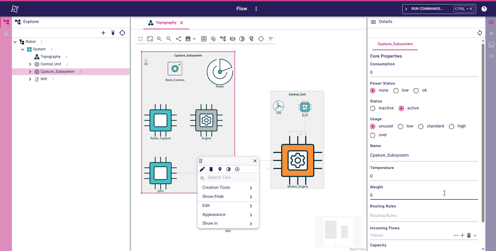

= Sirius Web

https://www.eclipse.org/sirius/sirius-web.html[Eclipse Sirius Web] is a framework to easily create and deploy studios to the web.
We keep the principles which made the success of https://www.eclipse.org/sirius[Eclipse Sirius Desktop] and make them available on a modern cloud-based stack.

This repository contains the building blocks from which Sirius Web applications are built.
The folder `packages` contains both the Spring Boot projects from which the corresponding backend is built and the reusable React components used to build the application's UI.
It also contains the Sirius Web sample application.

To test _Sirius Web_ you have two possible options:

. If you just want to run an already built version of the example application, follow link:#quick-start[the Quick Start].
. If you want to _build_ the example application yourself, follow link:#build[the complete build instructions].

[#quick-start]
== Quick Start

If you want a quick overview of how Sirius Web looks and feels like without building the sample application yourself, you will simply need:

* Java 17
* Docker, or an existing PostgreSQL 12 (or later) installation with a DB user that has admin rights on the database (those are needed by the application to create its schema on first startup).

Then, download the latest pre-built JAR:

. Go to the packages of the project and look for `sirius-web-sample-application`.
. Download the latest jar available

This is a single "fat JAR" named `sirius-web-sample-application.jar` which contains the complete sample application with all its dependencies.

To actually run the application:

1. Sirius Web uses PostgreSQL for its database. For development or local testing, the easiest way is to start a PostgreSQL instance using Docker.
+
[source,sh]
----
docker run -p 5433:5432 --rm --name sirius-web-postgres \
                             -e POSTGRES_USER=dbuser \
                             -e POSTGRES_PASSWORD=dbpwd \
                             -e POSTGRES_DB=sirius-web-db \
                             -d postgres:12
----
+
WARNING: This may take a while the first time you run this as Docker will first pull the PostgreSQL image.
+
If you do not have Docker or want to use an existing PostgreSQL installation, adjust the command-line parameters below and make sure the DB user has admin rights on the database; they are needed to automatically create the DB schema.
2. Start the application:
+
[source,sh]
----
java -jar sirius-web-sample-application.jar \
          --spring.datasource.url=jdbc:postgresql://localhost:5433/sirius-web-db \
          --spring.datasource.username=dbuser \
          --spring.datasource.password=dbpwd \
          --spring.liquibase.change-log=classpath:db/changelog/sirius-web.db.changelog.xml
----
3. Point your browser at http://localhost:8080 and enjoy!
+
WARNING: The initial version of Sirius Web has some known issues with Firefox.
It is recommended to use a Chrome-based browser until these are fixed.

NOTE: Do not forget to stop the PostgreSQL container once you are done: `docker kill sirius-web-postgres`. 
Note that this will remove all the data you have created while testing the application.

[#build]
== Building

=== Requirements

To build the components in this repository on your own, you will need the following tools installed:

* Git, and a GitHub account
* To build the backend components:
** Java 17
** https://maven.apache.org[Apache Maven 3.6.3]
* To build the frontend components:
** Recent versions of https://nodejs.org/[Node and NPM]: in particular, Node >= 18.7.0 is required along with npm >= 8.15.0.
** https://turbo.build[TurboRepo] (`npm install -g turbo`)

WARNING: Note that there are issues with NPM under Windows Subsystem for Linux (WSL).
If you use WSL and encounter error messages like _"Maximum call stack size exceeded"_ when running NPM, switch to plain Windows where this should work.

=== GitHub Access Token

The backend components of this repository depends on https://github.com/eclipse-sirius/sirius-emf-json[`sirius-emf-json`], which is published as Maven artifacts in _GitHub Packages_.
To build `sirius-components` locally, you need a _GitHub Access Token_ so that Maven can download the `sirius-emf-json` and `Flow-Designer` artifacts.

. Create a personal token with a scope of `read:package` by following https://docs.github.com/en/free-pro-team@latest/github/authenticating-to-github/creating-a-personal-access-token[the GitHub documentation] if you do not have one already.
+
WARNING: Once generated, a token cannot be displayed anymore, so make sure to copy it in a secure location.
. Create or edit `$HOME/.m2/settings.xml` to tell Maven to use this token when accessing the Sirius EMF JSON repository:
+
[source,xml]
----
<?xml version="1.0" encoding="UTF-8"?>
<settings xmlns="http://maven.apache.org/SETTINGS/1.0.0"
          xmlns:xsi="http://www.w3.org/2001/XMLSchema-instance"
          xsi:schemaLocation="http://maven.apache.org/SETTINGS/1.0.0 https://maven.apache.org/xsd/settings-1.0.0.xsd">
  <servers>
    <server>
      <id>github-sirius-emfjson</id>
      <username>$GITHUB_USERNAME</username>
      <password>$GITHUB_ACCESS_TOKEN</password>
    </server>
    <server>
      <id>github-flow</id>
      <username>$GITHUB_USERNAME</username>
      <password>$GITHUB_ACCESS_TOKEN</password>
    </server>
  </servers>
</settings>
----
+
Be sure to replace `$GITHUB_USERNAME` with your GitHub user id, and `$GITHUB_ACCESS_TOKEN` with the value of your acess token.
+
IMPORTANT: The `id` used in your `settings.xml` *must* be `github-sirius-emfjson` and `github-flow` to match what is used in the POMs.

=== Build the frontend & backend components and Sirius Web

1. Clone this repository
2. Build the frontend packages:
+
[source,sh]
----
npm ci
npx turbo run build
----
+

NOTE: In order to run tests, use `npx turbo run coverage`
+

[WARNING]
====
To build the package `@eclipse-sirius/sirius-components-diagrams` the `mkdir` command is required.

For Windows users, according to the link:https://docs.npmjs.com/cli/v8/using-npm/config#script-shell[npm documentation] the default value for script-shell configuration on Windows is `cmd.exe` which does not support the `mkdir` command. We recommend to use link:https://git-scm.com/downloads[git bash] instead of the default command tool.

Then you can set the `script-shell` configuration with the following command:
[source,sh]
----
npm config set script-shell "path\to\bash.exe"
----
====

3. Install the frontend artifacts as static resource to be served by the backend.
From the root directory of the repository:
+
[source,sh]
----
mkdir -p packages/sirius-web/backend/sirius-web-frontend/src/main/resources/static
cp -R packages/sirius-web/frontend/sirius-web/dist/* packages/sirius-web/backend/sirius-web-frontend/src/main/resources/static
----

4. Build the backend components.
+
[source,sh]
----
mvn clean install -f packages/pom.xml
----
+
TIP: If you are behind a proxy, you may get Maven errors about checkstyle.org not being available.
In this case you need to explicitly disable CheckStyle from the build: `mvn clean install -f releng/org.eclipse.sirius.emfjson.releng/pom.xml -P\!checkstyle`

5. You can find in the output artifacts in the various `target` folders of the backend components and the `dist` folders of the frontend components.
You could publish those to your maven or npm repository to consume them in other applications.
We are already publishing those components in the NPM and maven repositories of our Github organization.
+
Using these instructions, we can find a Spring Boot "fat JAR" in `backend/sirius-web-sample-application/target/sirius-web-sample-application-{YEAR.MONTH.COUNT-SNAPSHOT}.jar`.
Refer to the instructions in the "Quick Start" section above to launch it.

== License

Everything in this repository is Open Source. Except when explicitly mentioned otherwise (e.g. for some resources likes icons which are under Apache-2.0), the license is Eclipse Public License - v 2.0.
