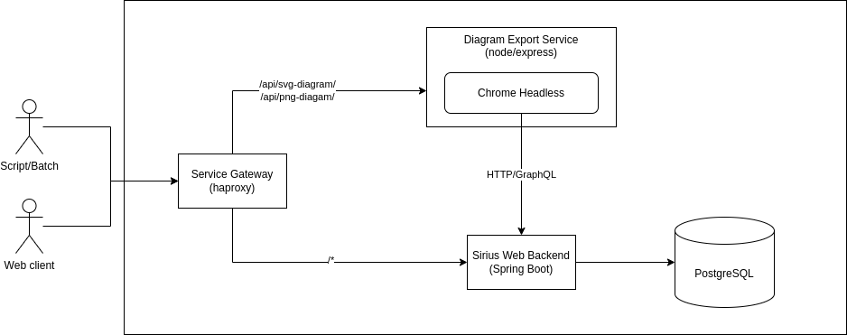

= Sirius Web - Diagram Image Server

This folder contains an optional server that can be deployed alongside an existing Sirius Web instance to allow for programmatic export of existing diagrams as either PNG or SVG images.
It is similar to the _Export diagram as image_ feature that can be used from the browser when viewing a diagram, but made accessible through a plain HTTP API.

The server is a simple https://expressjs.com/[express] HTTP server, which internally drives a headless browser (Chrome) using https://pptr.dev/[puppeteer].

See file://../doc/iterations/2025.8/backend_api_export_diagram.adoc[the corresponding shape] for more context and

== Running

Assuming you already have a running Sirius Web instance, the simplest way to launch the sverver for local testing is to:

1. Install the required dependencies: `npm install`
2. Launch the script: `node index.mjs -s http://your-sirius-web-server`

By default the image server itself will list to port 3000.
You can change that using `-p another_port` (e.g. `-p 3001`) when lauching it.

The options available are:

* `-s | --server`: the address of the Sirius Web server itself (e.g. https://sirius-web.example.com/)
* `-p | --port`: the port to listen to (by default, 3000)
* `-c | --cookie`: the name(s) of any cookie that, if received by the image server itself, will be forwarded to the Sirius Web server; by default, cookies named `SESSION` or `JSESSIONID` (if they exist) are forwarded. This option can be used multiple times if needed (e.g. `-c MAIN_COOKIE -c ANOTHER_ONE`)

== API

Once running, the image server only responds to two HTTP endpoints:

* `api/svg-diagram/${EDITING_CONTEXT}/${DIAGRAM}`: returns an SVG (`image/svg+xml`) image corresponding to the specified diagram.
* `api/png-diagram/${EDITING_CONTEXT}/${DIAGRAM}`: returns an PNG (`image/png`) image corresponding to the specified diagram.

To test using e.g. `curl` for example:

[source,console]
----
curl -v "http://localhost:3000/api/png-diagram/a0b3dbb6-42b1-4d0b-9252-9f8b851d010a/b5fe4fab-01e9-4e95-9545-28a58da30f24" > diagram.png
----

== Deployment with Docker or docker-compose

The server can also be launched inside a Docker container.
The `Dockerfile` in this folder provides an example container definition.

To build the Docker image yourself:

[source,console]
----
docker build -t diagram-image-server .
----

You can then launch it with for example:

[source,console]
----
docker run -p 3000:3000 --net=host diagram-image-server -- -s http://localhost:8081
----

Note the Docker parameters:

* `-p 3000:3000`: needed to make sure the internal port on which the image server listens to is exposed;
* `--net=host`: needed to allow the Chrome browser running inside the container to access the Sirius Web server which runs outside;
* `-- -s http://localhost:8081`: any parameters you want to pass to the image server itself must be separated from the `docker` command parameters with `--`.

For more complex/serious deployments, see the `compose` folder.
It contains a `docker-compose.yml` configuration which implements the following architecture:

This includes:

* a PostgreSQL database;
* a Sirius Web instance, using https://hub.docker.com/repository/docker/eclipsesirius/sirius-web/general[the official Docker image from Docker Hub];
* an instance of the image server pointing to that Sirius Web instance;
* finally, an instance of `haproxy` which serves as a service gateway and redirects all HTTP requests to the internal Sirius Web instance *except* the ones corresponding to the image server endpoints (`/api/svg-diagram` and `/api/ng-diagram`) which go to the image server.

To run this version:

[source,console]
----
cd compose
docker compose up
----

Once all the services are running, you can open your browser to http://localhost:8080, use Sirius Web normally, and if you want to obtain the PNG/SVG image of a specific diagram:

[source,console]
----
curl -s http://localhost:8080/api/png-diagram/a0b3dbb6-42b1-4d0b-9252-9f8b851d010a/b5fe4fab-01e9-4e95-9545-28a58da30f24" > diagram.png
----

Note that in this case we also point `curl` to http://localhost:8080, the same host on which Sirius Web is running.
The actual request is handled by the image server, but that is invisible from outside.
