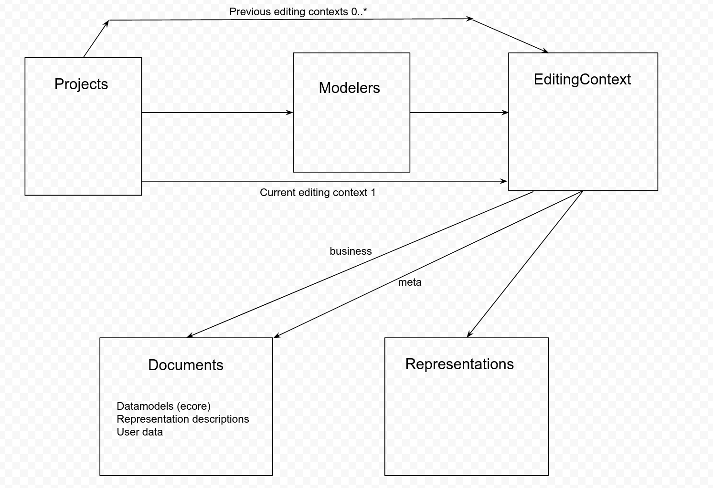

= ADR-010 - Introduce Editing Context to Support Modeler Definitions

== Context

Currently, the modelers available to end-users of Sirius Web must be defined and deployed statically at build-time (programmatically using our APIs or using the Sirius Desktop compatibility layer and an exisiting VSM).
We want to support the complete definition of modelers directly in Sirius Web.
This includes both the definition of custom _data schemas_ (metamodels) and _representation descriptions_ (diagrams, forms, etc.).

Following the general approach of Sirius Desktop, both the custom data schemas and representation descriptions will be defined using the same tools as the actual end-user's domain models/diagrams.

In the current state, when inside a given project, the metamodels and diagram descriptions available are taken from a global, static state.
We need to introduce a new indirection for a project to point to a (set of) modelers (metamodels & representation description) that it wants to use *and which are defined as Sirius Web documents*.

== Decision

== Status

Draft.

== Consequences

