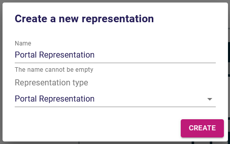
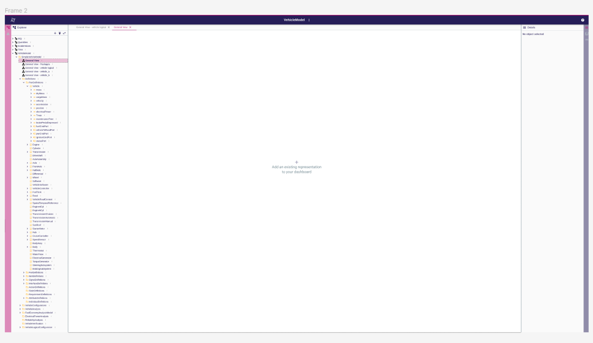
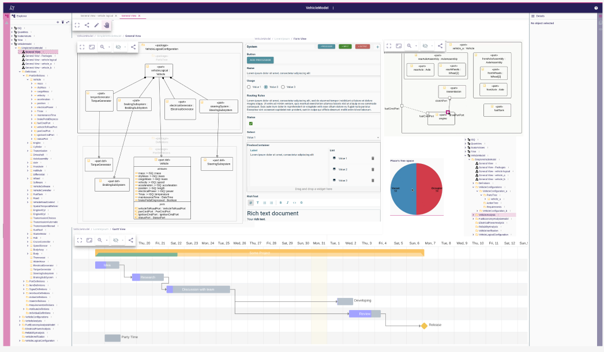
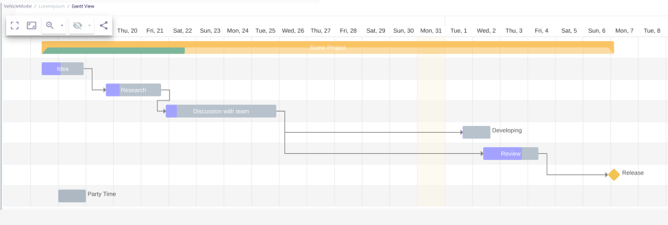
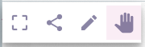
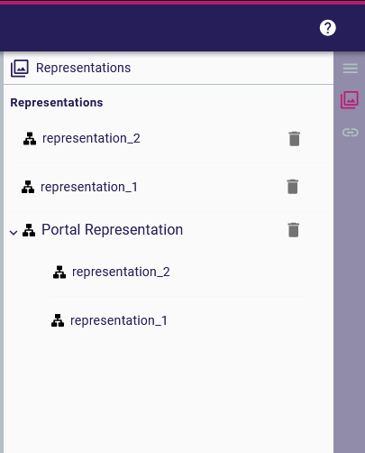
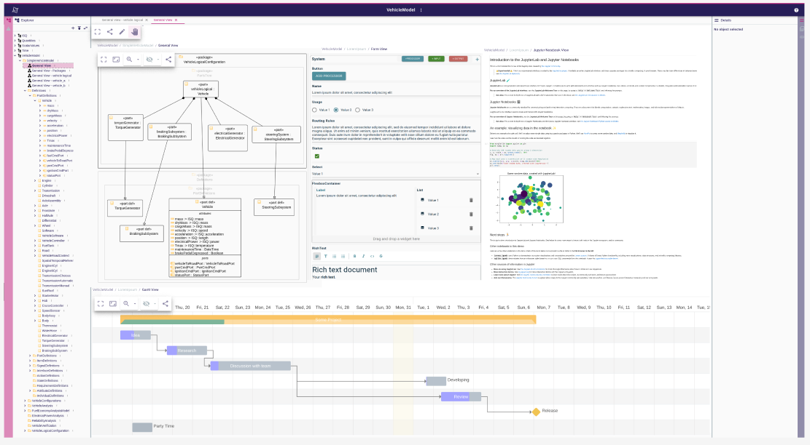

= ADR-122 - Add support for portal representation

== Context

Today, sirius-web can open and display only one representation at a time.
A user can't, then, have access to a whole range of information from a variety of sources on a single page.

== Decision

It was decided to add a new type of representation called _portal_, enabling other representations to be aggregated into a single view.
This new type of representation can be seen as a kind of dashboard.
It will be possible to add existing representations only.
The user must be able to arrange the layout of these representations as he wishes.
This representation can be created anywhere in the model tree.

To date, the sub-representations available to populate a _portal_ are:

* diagram
* form
* gantt
* deck
* other portal

== Solution

On any semantic element of the explorer, a user can create a new _portal_ representation via the existing _New Representation_ toolbar menu.

=== Portal representation creation

In this case, the main part of the page is empty.

User can drag and drop existing representations from the explorer.
When the first representation has been added to the _portal_, UI switch to the edit mode.

=== Edit mode

* In this mode, it's possible to change the position and the size of all the representations.
New representations can also be added by dragging them from the explorer.
* The representations can be reorganized by drag and drop action.
All the representations can be resized via a handle placed in the bottom right corner of the representation.
If the resize of a representation overlaps another one, this second representation is moved away.
* A portal-type representation, has no horizontal or vertical boundaries.
In case of overflow, there will be scrollbars for navigating.
If a user doesn't want the page to be scrolled, it is possible by adjusting the layout.
* Only in this mode, a representation can be deleted by using the _del_ key.
This deletion does not affect the layout of the other representations.
* When editing the _portal_, the representations are read-only.
* Since a portal representation is itself a representation, it can be added to another _portal_.
There is limitation to avoid a _portal_ including another _portal_ being added to this second _portal_.
It prevents a _portal_ loop.

=== Direct mode

* In this mode, the representations can't be moved or resized.
* Representations on a _portal_ have exactly the same behavior as if they were opened individually.
A user can thus modify them.
* If the representation provides one, the user has access to its palette.

* If the defined size of a representation does not allow it to be displayed in its entirety, a scroll bar will be added in it.
For diagram-type representations, it is possible to zoom inside.
* Selecting an element from the explorer or from one of the _portal_ representations changes the selection in all representations.
* If a representation is deleted but always referenced in a _portal_, its location is replaced by a blank slot with a message indication that the representation doesn't exist
anymore.

=== Representation header

* Each representation on the _portal_ has a header on top of it, with the breadcrumb representing their path relative to the semantic element to which the portal representation is
attached.

=== Portal palette

* The portal palette is always visible in direct and edit mode in the top left of the main zone.
* The portal palette is composed of four buttons:

. toggle to full screen
. share button (opens a popup with the URL to access to the _portal_ representation)
. toggle to edit mode
. toggle to direct mode

=== Representations panel

* The right panel of the sirius page includes a representation view.
* For _portal_, this view presents, in the form of a tree, the representations it contains.
* No changes to a _portal_ content can be made from this view.

=== Out of scope

* Add the possibility to display an external web page as a representation.
It could be a new representation type or a new widget in a form.

* The same portal (references the same representations and shares the layout) can be duplicated to be linked to another semantic element.

== Status

Work in progress
