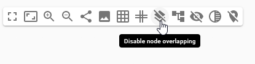

= [ADR-147] Add support for overlapping nodes

== Context

When manually moving a node, the drag-and-drop feature takes over and prevents the possibility of ending up with two overlapping nodes.
If the target node is valid for a drag-and-drop action, the action is performed; otherwise, the node's position is reset.
However, other actions can lead to an overlapping situation, such as creating new nodes or using layout tools (e.g., arrange-all with a pinned node or distribute elements).
We will add the ability to overcome this situation by moving the elements so that they no longer overlap.
The user should be able to enable or disable this option according to their preferences.

== Decision

To allow the user to control this option, we will add an icon in the main diagram palette to enable or disable this behavior (enabled by default).

image:images/147/enable_node_overlapping.png[Enable node overlapping, 50%]

We will create a new hook that takes a list of nodes as input and returns this list with the position of the nodes modified to avoid any overlap, while only modifying the position of the nodes.
The position of a pinned node should not be modified.

[source]
----
resolveNodeOverlap: (nodes: Node[], direction: 'horizontal' | 'vertical') => Node[];
----

NOTE: `direction`is used to determine the overlap node new position, necessary when using elements distribute tool.

We will also add a method that takes NodeChanges as input to apply the move with priority for handling overlap.

[source]
----
handleNodeOverlap: (changes: NodeChange[], nodes: Node[]) => Node[];
----

Finally, we will add a last method to handle the case of creating a new element by taking as a parameter a node for which we want to give priority placement.

[source]
----
handleNodeOverlap: (priorityNodeId: string, nodes: Node[]) => Node[];
----

NOTE: if the priority node conflicts with a pinned node, we allow its modification in such a way as to never affect the position of a pinned node.

== Status

Work in progress

== Consequences
