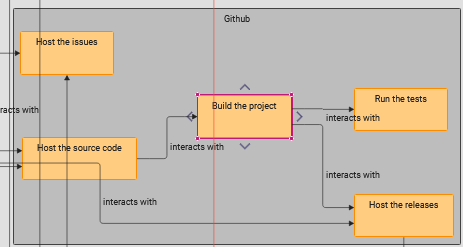
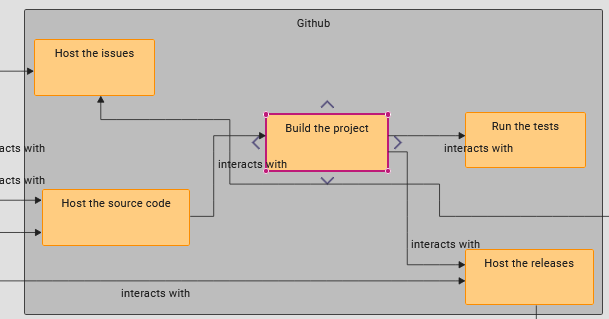

= [ADR-148] Improve edge layout

== Context

We are currently delegating the management of the edge path to ReactFlow in our diagram.
We only manage the position of the handles (start and end).
The problem is that for large diagrams you can lose readability, especially with edges that pass through nodes.

We intend to improve this by controlling the path of the edges.

== Decision

To solve this problem, we have decided to integrate the `react-flow-smart-edge` library.
This library can be used to calculate more complex paths, avoiding overlapping nodes.

For this, `react-flow-smart-edge` provide a new function `getSmartEdge`, it takes the same parameters that a ReactFlow custom edge and an array containing all nodes.

[source, typescript]
----
const nodes = useNodes()

const getSmartEdgeResponse = getSmartEdge({
    sourcePosition,
    targetPosition,
    sourceX,
    sourceY,
    targetX,
    targetY,
    nodes
})

const { svgPathString } = getSmartEdgeResponse

return (
    <>
        <path
            style={style}
            className='react-flow__edge-path'
            d={svgPathString}
        />
----

Adding node position to edge path calculation results in a significant performance degradation for large diagrams.
To avoid this, we need to set up mechanisms to limit recalculation of the path as much as possible.
The goal is to trigger path calculation only if a node with an impact is modified.
[source, typescript]
----
 const getSmartEdgeResponse = useMemo(() => {
    return getSmartEdge({
      ...
      },
    });
  }, [nodesToConsider])
----

To determine this list, we only keep the nodes that are a sibling to the edge source/target ancestors.
We also filter the direct ancestor nodes, to reach its target an edge may need to cross its parent.

== Status

Work in progress

== Consequences

Adding react-flow-smart-edge to our project introduces a new dependency.
