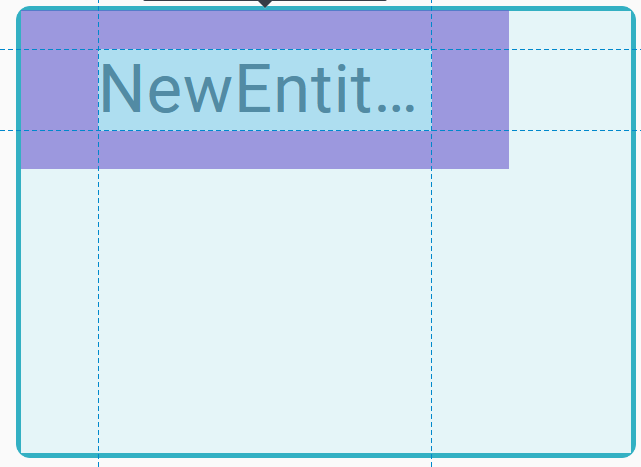

= ADR-155 Add max-width expression for diagram labels

== Context

Although it's possible to define an overflow strategy for a label (none, wrap or ellipse), its size is always determined by its node parent.
The goal is to add the possibility of giving a maximum size to a label.

== Decision

Add a `maxWidthExpression` to the LabelStyleDescription in the View DSL.
This both handles the case of conditional styles and makes the value dynamic.
The result of this expression will be passed directly as a `max-width` CSS style to the div containing the label.
This expression will be available for node labels (_insideLabel_ and _outsideLabel_) and for edge labels.

- Example of a label with a maxWidthExpression returning 80% and an overflow strategy ellipse:

NOTE: applies only to labels with a WRAP or ELLIPSIS overflow strategy

== Status

Work in progress

