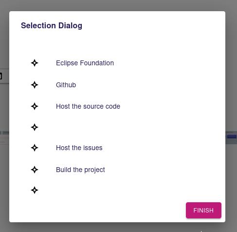
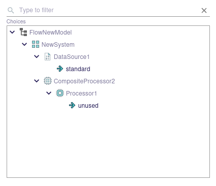

= [ADR-155] Make it possible to display the semantic elements as a tree in the Selection Dialog

== Context

We have restored the previous deactivated Selection Dialog in the context of the ADR: _[ADR-153] Restore the Selection Dialog support in diagrams
_.

We want now to improve this Selection Dialog.

The Selection dialog displayed the candidates elements (returned by the `candidatesExpression` in the `SelectionDialogDescription`) as a flat list without any information about the hierarchical structure.

Since the selection dialog is intended to be used to select semantic elements, it will be necessary to have the ability to display them as they are in their structure (as a tree).



=== Current behavior

The Selection dialog opens a subscription to the selection representation. The `SelectionRefreshedEventPayload` returns the Selection that only owns a list of objects to display.

Here is the current GraphQL API:


```
type SelectionRefreshedEventPayload {
  id: ID!
  selection: Selection!
}

type Selection implements Representation {
  id: ID!
  metadata: RepresentationMetadata!
  targetObjectId: String!
  message: String
  objects: [SelectionObject!]!
}

type SelectionObject {
  id: ID!
  label: String!
  iconURL: [String!]!
}
```

== Decision

=== Preferred option

==== View model 

The specifier will choose whether the objects returned by the candidates expression will be displayed as a tree or as a flat list. 

The `SelectionDialogDescription` from the Diagram View model will have an additional boolean attributes:

 * `displayedAsTree`: to indicate whether the dialog layout should be a tree.


==== Backend and GraphQL API

If the displayedAsTree is true, we will rely on the TreeRepresentation instead of the current SelectionRepresentation.

We will need to contribute a new `IEditingContextRepresentationDescriptionProvider` as the `ModelBrowsersDescriptionProvider` for the Reference widget.

This `DescriptionProvider` will rely on the `SelectionDialogDescription` to compute the `TreeDescription`. 

The GraphQL API will evolve to handle the layout information:

```
type Selection implements Representation {
  id: ID!
  metadata: RepresentationMetadata!
  targetObjectId: String!
  message: String
  displayedAsTree: Boolean!
  objects: [SelectionObject!]!
}
```


==== Tree computation Algorithm

Starting from objects returned by the candidates expression, we will compute all the ancestors hierarchy until we reach the root document.

For example, supposing we have the following semantic model:

```
Root
|_ A
  |_ D
    |_ H
  |_ E
|_ B
  |_ F
|_ C
  |_ G
```

If the candidates expression return three elements: D,H and F, then We will display these elements as follow:

```
Root
|_ A
  |_ (D)
    |_ (H)
|_ B
  |_ (F)
```

==== Frontend

Elements that are not selectable (out of the computed candidates set) will by faded in the same way than the reference widget semantic browser do:



The frontend `SelectionDialog` component will be modified to handle both flat and tree layouts.

If the value of `displayedAsTree` is false, then we keep the current behavior.

If the value of `displayedAsTree` is true, then we will use the `TreeView` component to display the content. We will have something similar to the following code:

```
  <SelectionContext.Provider
    value={{
      selection: [],
      setSelection: setDialogSelection,
    }}>
      <TreeView
        editingContextId={editingContextId}
        readOnly={true}
        treeId={`selectionDialog://?targetObjectId=${encodeURIComponent(targetObjectId}&descriptionId=${encodeURIComponent(descriptionId)}`}
        enableMultiSelection={enableMultiSelection}
        synchronizedWithSelection={true}
        activeFilterIds={[]}
      />
  </SelectionContext.Provider>
```

We need to provide a `SelectionContext` to capture the selection from the `TreeView`.

We need the layout information (tree or flat) and the message in both case. In the case of the tree layout, we will have two subscriptions:
* The one two retrieve the SelectionDialog (to have the message)
* The one for the Tree representation.

Note that for now, the message is not interpreted but the `SelectionDescription#messageProvider` is already returning a function taking the variableManager as parameter. 
That why we can't provide the message directly from the graphQL query (by modifying the `SingleClickOnDiagramElementTool` GraphQL API for instance)

=== Second option

The second option would consist in changing the current Selection Dialog representation to handle both flat and tree layout. 

That would mean computing the tree structure in the backend and providing it to the frontend with the containment information.

The frontend would handle both the flat and tree layout.

The option has finally not been retained to reuse the existing `TreeView`.


== Status

Work in progress

== Consequences

