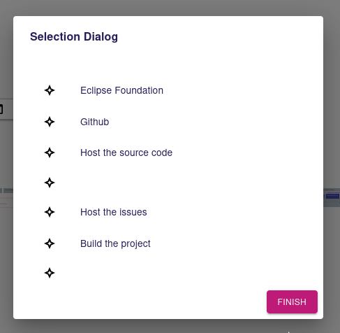

= [ADR-156] Make it possible to display the semantic elements as a tree in the Selection Dialog

== Context

We have restored the previous deactivated Selection Dialog in the context of the ADR: _[ADR-152] Reactivate the Selection Dialog Tool_.

We want now to improve this Selection Dialog.

The Selection dialog displayed the candidates elements (returned by the `candidatesExpression` in the `SelectionDialogDescription`) as a flat list without any information about the hierarchical structure.

Since the selection dialog is intended to be used to select semantic elements, it will be necessary to have the ability to display them as they are in their structure (as a tree).



=== Current behavior

The Selection dialog opens a subscription to the selection representation. The `SelectionRefreshedEventPayload` returns the Selection that only owns a list of objects to display.

Here is the current GraphQL API:


```
type SelectionRefreshedEventPayload {
  id: ID!
  selection: Selection!
}

type Selection implements Representation {
  id: ID!
  metadata: RepresentationMetadata!
  targetObjectId: String!
  message: String
  objects: [SelectionObject!]!
}

type SelectionObject {
  id: ID!
  label: String!
  iconURL: [String!]!
}
```

== Decision

=== Preferred option

==== View model 

The specifier will choose whether the objects returned by the candidates expression will be displayed as a tree or as a flat list. 

The `SelectionDialogDescription` from the Diagram View model will have two additional boolean attributes:

 * `displayedAsTree`: to indicate whether the dialog layout should be a tree.
 * `expandedAtOpening`: to indicate if the tree should be expanded by default (that means all tree items are expanded at opening)

==== Backend and GraphQL API

In addition, the Selection computed by the `SelectionRender` by the server will now return the containment information.

Since the tree depth is not known by the frontend beforehand, the backend needs to return the whole tree items in a flat way.

The GraphQL subscription query will thus have a fixed depth. The containment information will be owned by a field called `parentId`.

To do so, we will keep the same GraphQL structure but with the following changes:

 * A `SelectionObject` will have a `parentId` field (optional), that will be a reference to another `SelectionObject#id` field.
 * A `SelectionObject` will contain the information whether it can be selected or not in order to differentiate elements from the candidatesExpression to the hierarchical nodes.
 * The `Selection` will also contains the information whether the dialog should be displayed as a tree or not and if we should expand all nodes at opening.

Thus, the GraphQL API will evolved as following:

```
type Selection implements Representation {
  id: ID!
  metadata: RepresentationMetadata!
  targetObjectId: String!
  message: String
  objects: [SelectionObject!]!
  displayedAsTree: Boolean!
  expandedAtOpening: Boolean!
}

type SelectionObject {
  id: ID!
  label: String!
  iconURL: [String!]!
  parentId: String
  isSelectable: Boolean!
}
```

==== Tree computation Algorithm

Starting from objects returned by the candidates expression, we will compute all the ancestors hierarchy until we reach the root document.

For example, supposing we have the following semantic model:

```
Root
|_ A
  |_ D
    |_ H
  |_ E
|_ B
  |_ F
|_ C
  |_ G
```

If the candidates expression return three elements: D,H and F, then We will display these elements as follow:

```
Root
|_ A
  |_ (D)
    |_ (H)
|_ B
  |_ (F)
```

==== Frontend

Elements that are not selectable (out of the computed candidates set) will by faded in the same way than the reference widget semantic browser do:

image:images/153/referenceWidgetSemanticBrowser.png[Reference Widget Semantic Browser, 50%]

The frontend `SelectionDialog` component will be modified to handle both flat and tree layouts.

If the value of `displayedAsTree` is false, then we keep the current behavior.

If the value of `displayedAsTree` is true, then we will represent the structure returned by the backend in a similar way than the `TreePropertySection` component.

We will rely on the MaterialUI `TreeItem` and `TreeView` in the same way than the internal `TreeItem` component from the `TreePropertySection`:

```
 const childNodes = nodes.filter((childNode) => childNode.parentId === node.id);
  return (
    <MuiTreeItem nodeId={node.id} label={label}>
      {childNodes.map((childNode) => (
        <TreeItem
          node={childNode}
          nodes={nodes}
          key={childNode.id}
          readOnly={readOnly}
          aria-role="treeitem"
          editingContextId={editingContextId}
          formId={formId}
          widgetId={widgetId}
        />
      ))}
    </MuiTreeItem>
  );
```

If the Selection is refreshed by the backend, following a semantic change from another client for instance, a new Selection from the subscription will be received by the SelectionDialog and trigger the component rerendering.

If the end-user has changed the expanded state, we want to keep them expanded in that situation. 

To do so, We will modify the SelectionDialog state machine as follow:

 * A new `expandedSelectionObjectIds : string[]` will be added in the `SelectionDialogContext`.
 * A new event `HandleExpandUpdatedEvent` = { type: 'HANDLE_EXPAND_UPDATED'; expandedObjectId: string }; This event will add or remove the expandedObjectId from the expandedSelectionObjectIds array.

A TreeItem will be expanded if:

 * The expandedAtOpening is activated: in that case, the `expandedSelectionObjectIds` will be initialized with all selectedObject ids.
 * The user expanded the item manually.

=== Second option

The second option but not the preferred one, consists in relying on the TreeRepresentation.

With this option, we would need to contribute a new `IEditingContextRepresentationDescriptionProvider` as the `ModelBrowsersDescriptionProvider` for the Reference widget.

This DescriptionProvider would rely on the SelectionDialogDescription to compute the TreeDescription. 

This option appears to be more complicated to implement. In addition, the first option seems to be a good answer to the Selection dialog need.


== Status

Work in progress

== Consequences

