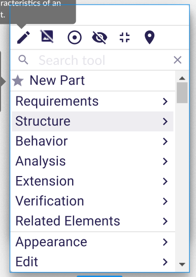

= [ADR-163] Adapt the Diagram Palette API to the new palette design

== Context

The diagram palette will have a new design:



The key points are the followings:

* The palette will be draggable et dockable
* The palette will display the tools and the tool sections as a list.
* Tools and tools sections might be separated by divider
* We keep the current palette design for the "quick access" tools
* The last used tool will be available as a shortcut
* A search bar will allow the user to search within the whole palette for a specific tool.


== Decision

We need to modify the current Palette graphQL API:

```
type Palette {
  id: ID!
  tools: [Tool]!
  toolSections: [ToolSection]!
}

type ToolSection {
  id: ID!
  label: String!
  iconURL: [String!]!
  tools: [Tool]!
}

interface Tool {
  id: ID!
  label: String!
  iconURL: [String!]!
}
```

With this API: 

```
type Palette {
  id: ID!
  quickAccessTools: [Tool]!
  paletteEntries: [PaletteEntry]!
}

union PaletteEntry = ToolSection | Tool | Divider

type Divider {
  id: ID!
}

type ToolSection {
  id: ID!
  label: String!
  iconURL: [String!]!
  tools: [Tool]!
}

interface Tool {
  id: ID!
  label: String!
  iconURL: [String!]!
}
```

This new API allows to:

* Define which tool will be represent in the quick access tool section
* The tool sections, tools and dividers sequence.


== Status

Work in progress


== Consequences

We will have to make some evolutions in the diagram view model to make it possible to express which tool is available in the quick access tool section but also to define dividers.
