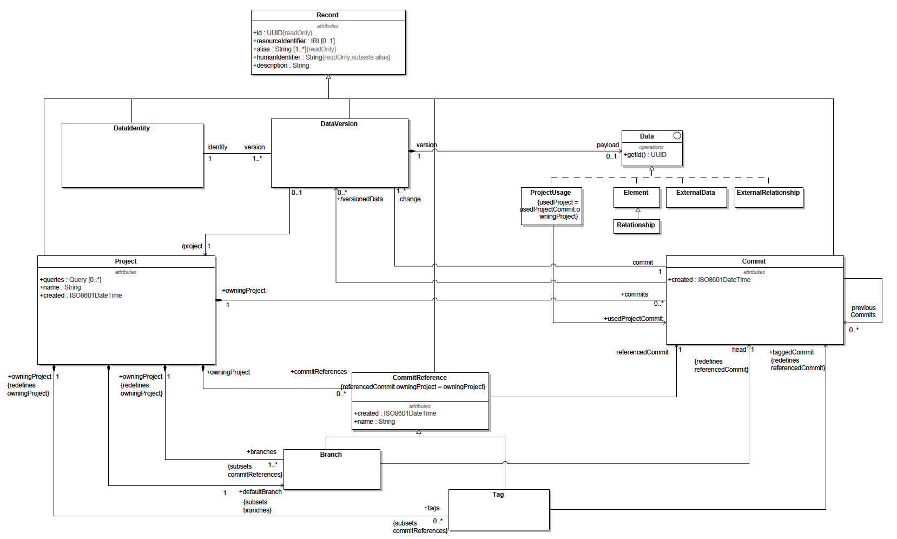
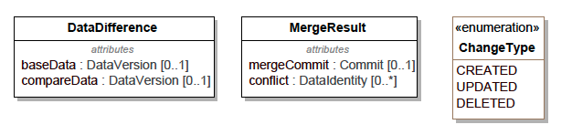

= [ADR-172] Support Project Data Versioning REST APIs

== Context

This ADR follows [ADR-167].

=== Current behavior

Some REST APIs coming from https://www.omg.org/spec/SystemsModelingAPI/ have been implemented in Sirius Web (Project related and Element related APIs).

== Decision

The decision is to support Project Data Versioning REST APIs described in the Systems Modeling Application Programming Interface (API) and Services section "8.1 REST/HTTP PSM" coming from https://www.omg.org/spec/SystemsModelingAPI/.

The Project Data Versioning REST APIs are:

* getCommits( project : Project ) : Commit [0..]
* createTag( project : Project, tagName : String, taggedCommit : Commit ) : Tag [1]
* getTaggedCommit( project : Project, tag : Tag ) : Commit
* getTagById( project : Project, tagId : UUID ) : Tag
* getTags( project : Project ) : Tag [1..]
* deleteBranch( project : Project, branchId : UUID ) : Branch [0..1]
* createBranch( project : Project, branchName : String, head : Commit ) : Branch [1]
* setDefaultBranch( project : Project, branchId : UUID ) : Project [1]
* getDefaultBranch( project : Project ) : Branch [1]
* getBranchById( project : Project, branchId : UUID ) : Branch [0..1]
* getBranches( project : Project ) : Branch [1..]
* getCommitChangeById( project : Project, commit : Commit, changeId : UUID ) : DataVersion
* getCommitChange( project : Project, commit : Commit, changeTypes : ChangeType [0..] ) : DataVersion [1..]
* createCommit( change : DataVersion [1..], branch : Branch [0..1], previousCommits : Commit [0..], project : Project ) : Commit
* getCommitById( project : Project, commitId : UUID ) : Commit [0..1]
* getHeadCommit( project : Project, branch : Branch [0..1] ) : Commit
* deleteTag( project : Project, tagId : UUID ) : Tag [0..1]
* diffCommits( baseCommit : Commit, compareCommit : Commit, changeTypes : ChangeType [0..] ) : DataDifference [0..]
* mergeIntoBranch( baseBranch : Branch, commitsToMerge : Commit [1..], resolution : Data [0..*], description : String [0..1] ) : MergeResult

Here is the model of the concepts manipulated by those APIs:

The following records/data structures will be updated in Sirius Web:

* `RestProject` will be updated to handle branches, tags, commits, commit references...
* `IRestCommitReference` will be updated to handle commits.

The following records/data structures will be introduced in Sirius Web:

* `Commit`: a new concept extending `IRestRecord`.
* `Tag`: a new concept extending `IRestCommitReference`.
* `DataIdentity`: a new concept extending `IRestRecord`.
* `DataVersion`: a new concept extending `IRestRecord`.
* `DataDifference`: a new concept.
* `ChangeType`: a new enumeration.
* `MergeResult`: a new concept.
* `Data`: a new concept.
* `ProjectUsage`: a new concept extending `Data`.

Sirius Web will not handle several commits, branches, tags and thus not handle data versions, data differences or merges.
In Sirius Web, a `Project` will have:

* only one commit, created with the `Project`.
The commit Id will be the same as the project Id.
* only one branch, created with the `Project`.
The branch Id will be the same as the project Id.
The branch name will be the same as the project name.
* only one tag, created with the `Project`.
The tag Id will be the same as the project Id.
The tag name will be the same as the project name.

Sirius Web will let specifiers/developers the possibility to implement their own versions of Project Data Versioning REST APIs.
Some default implementation of the Java services associated to the project-data-versioning-related REST APIs will be provided through a new interface `IDefaultProjectDataVersioningRestService`.
Specifiers will also be able to provide their own implementations by implementing `IProjectDataVersioningRestServiceDelegate` as a spring `Service`.

== Status

Work in progress
