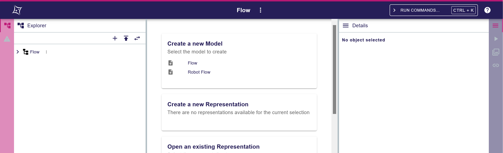
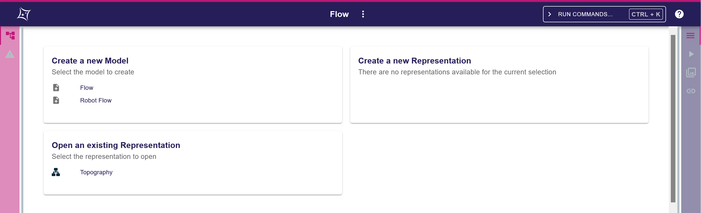
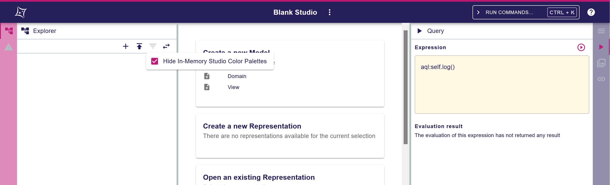

= ADR-198 - Add the ability to share a URL containing the views of the workbench

== Context

We want to share the views of the workbench with other users.

== Decision

We will add the ability to compute and resolve a URL encoding the state of the workbench.

The base URL for an open project will be `/projects/:projectId/edit`.
The state of the workbench will be encoded as a JSON object with the following structure:

[source, typescript]
----
interface WorkbenchState {
  parts: WorkbenchPart[],
  configuration?: object,
  focus?: string;
}

interface WorkbenchPart {
  id: string,
  parts: WorkbenchParts[],
  configuration?: object;
}
----

where:

** `WorkbenchState.focus: string`: the ID of the `WorkbenchPart` that has the user focus.
** `WorkbenchPart.id: string`: the ID of the `WorkbenchPart` (e.g. `left`, `right`, `center`, `explorer`, `details`, etc.).
** `WorkbenchPart.configuration: object`: the part-specific configuration encoded as an arbitrary JSON object.
* The workbench state is encoded in and decoded from the URL through query parameter `workbench`, e.g. `/projects/projectId/edit?workbench=<encoded JSON object>`.
* The URL will still encode the selection through query parameter `selection`, just like it already does, e.g. `/projects/projectId/edit?workbench=<encoded JSON object>&?selection=id1%2Cid2`.

=== Examples

==== Example 1

In this example:
* In the left panel, the Sirius Web application provides 2 views `Explorer` and `Validation`. By default, the application activates `Explorer` and sets it as opened.
* In the center panel, there is no representation or editor opened. By default, the application displays a default page.
* In the right panel, the Sirius Web application provides 4 views `Details`, `Query`, `Representations` and `Related Elements`. By default, the application activates `Details` and sets it as opened.

Since the workbench state is in the default state, the corresponding JSON object could technically be `null`.

At runtime, the Sirius Web application collects the default configurations from its constituting parts.
In turn, each part recursively collects the default configurations from its constituting parts.

Ultimately the default workbench state is the following JSON object:

[source, json]
----
{
  "parts": [
    {
      "id": "left",
      "parts": [
        {
          "id": "explorer",
          "configuration": { ... }
        },
        {
          "id": "validation",
          "configuration": { ... }
        }
      ],
      "configuration": {
        "partId": "explorer",
        "closed": false
      }
    },
    {
      "id": "center",
      "parts": []
    },
    {
      "id": "right",
      "parts": [
        {
          "id": "details",
          "configuration": { ... }
        },
        {
          "id": "query",
          "configuration": { ... }
        },
        {
          "id": "representations",
          "configuration": { ... }
        },
        {
          "id": "related_elements",
          "configuration": { ... }
        }
      ],
      "configuration": {
        "partId": "details",
        "closed": false
      }
    }
  ],
  "focus": "center"
}
----

Notes:
* Since each `WorkbenchPart` has its own configuration, the default configurations for the various views are omitted for now. In the implementation, we will have to make explicit, for each view that wants to be able to contribute to the URL (`Explorer`, `Validation`, `Details`, `Query`, `Representations`, `Related Elements` and all representation editors) the default configuration to use.
* In the Sirius Web application, the "left" and "right" panels are essentially similar, so their configurations follow the same structure:

[source, typescript]
----
interface SiriusWebApplicationSidePanelConfiguration {
	partId: string,
	closed: boolean
}
----

where:
** `SiriusWebApplicationSidePanelConfiguration.partId: string` encodes the ID of the `WorkbenchPart` in this panel that is active ("left" default: "explorer" ; "right" default: "details").
** `SiriusWebApplicationSidePanelConfiguration.closed: boolean` encodes whether the `WorkbenchPart` is opened or closed (default for both: "false").

==== Example 2

Compared to example 1, this time the view opened on the left and right panels are closed.
Since in case of missing data, the application would rely on the default state, the corresponding workbench state can be represented as the following JSON object:

[source, json]
----
{
  "parts": [
    {
      "id": "left",
      "configuration": {
        "partId": "explorer",
        "closed": true
      }
    },
    {
      "id": "right",
      "configuration": {
        "partId": "details",
        "closed": true
      }
    }
  ]
}
----

==== Example 3

image::images/198/add_workbench_views_to_url_example3.png[Example 3]

In this example, there are 2 open diagrams (with 1 active, on semantic element of ID `topographyId`) and in the right panel, the `Related Elements` view is active and opened with all categories enabled.

[source, json]
----
{
  "parts": [
    {
      "id": "left",
      "parts": [
        {
          "id": "explorer",
          "configuration": { ... }
        },
        {
          "id": "validation",
          "configuration": { ... }
        }
      ],
      "configuration": {
        "partId": "explorer",
        "closed": false
      }
    },
    {
      "id": "center",
      "parts": [
			{
				"id": "diagram_Editor::topographyId",
				"configuration": { 
					...
					"zoom_level": 50,
					"x": 123,
					"y": 456,
					...
				}
			},
			{
				"id:" "topography2",
				"configuration": { ... }
			}
      ],
      "configuration": {
      		"active": "diagram_Editor::topographyId"
      }
    },
    {
      "id": "right",
      "parts": [
        {
          "id": "details",
          "configuration": { ... }
        },
        {
          "id": "query",
          "configuration": { ... }
        },
        {
          "id": "representations",
          "configuration": { ... }
        },
        {
          "id": "related_elements",
          "configuration": {
          	...
          	"incoming": true,
          	"current": true,
          	"outgoing": true,
          	...
          }
        }
      ],
      "configuration": {
        "partId": "related_elements",
        "closed": false
      }
    }
  ],
  "configuration": {
		"leftPanelSizeProportion": 25,
		"rightPanelSizeProportion": 30
  },
  "focus": "diagram_Editor::topographyId"
}
----

Notes: 
* In the "center" panel, the ID of the part `diagram_Editor::topographyId` encodes both the Sirius Web Diagram Representation editor and the ID of the target semantic element. This is to ensure that each `WorkbenchPart` has a unique ID (Note: this holds because in the Sirius Web application we cannot open two editors on the same representation).
* In part `diagram_Editor::topographyId`, we have some first diagram-specific configuration elements: `"zoom_level": 50` for the zoom level, `"x": 123` and `"y": 456` for the position in the diagram canvas.
* In part `related_elements`, we have some first related-elements-specific configuration elements: `"incoming": true`, `"current": true` and `"outgoing": true` to indicate which categories are enabled.
* In the root `WorkbenchState` object, the configuration is used to indicate the proportional sizes of the left, center and right panels through `"leftPanelSizeProportion": 25` and `"rightPanelSizeProportion": 30`.

==== Example 4

In this example, in the `Explorer` view the filter "Hide In-Memory Studio Color Palettes" is active, while in the `Query` view there is a sample AQL query.

[source, json]
----
{
  "parts": [
    {
      "id": "left",
      "parts": [
        {
          "id": "explorer",
          "configuration": {
          	activeFilterIds: ["hideInMemoryStudioColorPalettes"]
          }
        },
        {
          "id": "validation",
          "configuration": { ... }
        }
      ],
      "configuration": {
        "partId": "explorer",
        "closed": false
      }
    },
    {
      "id": "center",
      "parts": []
    },
    {
      "id": "right",
      "parts": [
        {
          "id": "details",
          "configuration": { ... }
        },
        {
          "id": "query",
          "configuration": {
          	"expression": "aql:self.log()",
          	"execute": true
          }
        },
        {
          "id": "representations",
          "configuration": { ... }
        },
        {
          "id": "related_elements",
          "configuration": { ... }
        }
      ],
      "configuration": {
        "partId": "query",
        "closed": false
      }
    }
  ],
  "focus": "center"
}
----

Notes:
* In part "explorer", the configuration is used to specify the active filters through `activeFilterIds`.
* In part "query", the configuration is used to specify an expression through `expression` and whether to execute it through `execute`.

== Status

Work in progress
