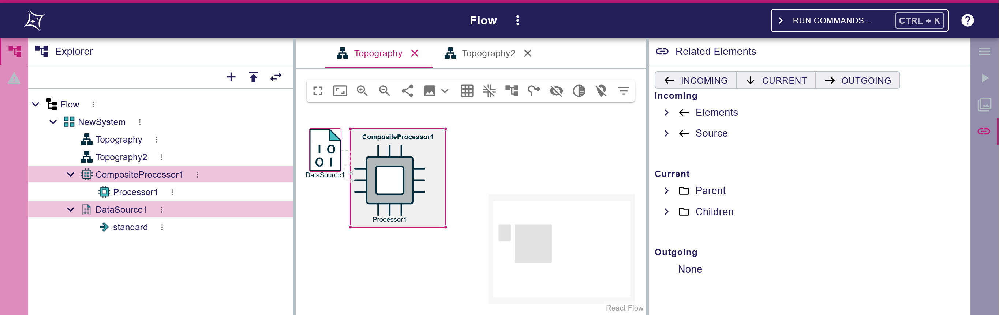

= ADR-198 - Add the ability to share a URL containing the views of the workbench

== Context

We want to be able to share the active views of the workbench with other users.

== Decision

* We will add an action to compute a shareable link for a project.
* We will add the possibility to encode in the URL the active views of the workbench.

=== Action to create a shareable link

When a project is opened in the workbench, the header offers a contextual menu next to the project name.

We will add an action in this contextual menu to produce a shareable link, similar to the 'share' action in the diagram editor toolbar (i.e. it opens a dialog that displays the link, and copies the link into the clipboard).

The shareable link will include both:
* the shareable workbench state, through query parameter `workbench`, e.g. `/projects/:projectId/edit?...&workbench=<encoded JSON object>&...` (as specified in this ADR).
* the current workbench selection, through query parameter `selection`, e.g. `/projects/:projectId/edit?...&selection=id1%2Cid2&...` (where `%2C` encodes `,`) (as already implemented).

=== Encoding the workbench shareable state in the URL

The base URL for an open project will remain: `/projects/:projectId/edit`.

The state of the workbench will be encoded as a JSON object with the following structure:

[source, json]
----
interface WorkbenchPartShareableState {
  parts?: { [partId: string]: WorkbenchPartShareableState }
}
----

where:

* `WorkbenchPartShareableState` is a recursive data structure used to capture the shareable state of the workbench. This structure mimics the structure of the main React components used to implement the workbench frontend.
* `WorkbenchPartShareableState.parts` is a map capturing the shareable state of the children workbench parts.
* `WorkbenchPartShareableState.parts` is optional so that a part without children can be represented by not having a value for parts, thus saving URL real estate.
** The key `partId` is a string that can be used to uniquely identify, at runtime, a part in the parent part.
It is _not_ the runtime id of the React Component corresponding to the part.
It is a predictable and unambiguous id given by the parent part (or by the application for the root part) at creation time.
** The value is a `WorkbenchPartShareableState` representing the shareable state of the child part.

Note: A follow-up ADR will focus on the possibility to share the internal state of a part (e.g. which filters of the 'Explorer' view are enabled), but this is out of the scope of this ADR.

The main impacts on the Sirius Web frontend components are:
* `partId` must be added to the props of the components.
* A ref is passed to the components so that they are able to provide their shareable state when the shareable link is to be created.

Additionally, the base URL for a project with an open representation will change from `/projects/:projectId/edit/:representationId` to `/projects/:projectId/edit?...&workbench=<encoded JSON object>&...` where the active opened representation will be encoded as part of the `workbench` query parameter.

=== Resolving a shared URL

* Upon loading a shared URL, the `workbench` query parameter value is parsed into a `WorkbenchPartShareableState` object and removed from the URL.
* The `WorkbenchPartShareableState` object is passed to the root workbench part.
* In turn, each component is responsible for providing to its children components the corresponding `WorkbenchPartShareableState` identified via the `partId`.
* In case of a missing `WorkbenchPartShareableState`, the default behavior is to be determined by the component or its parent.

=== Examples

==== Example 1

In this example, the workbench is in the default state:
* In the `left` panel, the Sirius Web application provides 2 views `Explorer` and `Validation`.
By default, the application activates `Explorer` and sets it as opened.
* In the `main` panel, there is no representation or editor opened.
By default, the application displays a default page.
* In the `right` panel, the Sirius Web application provides 4 views `Details`, `Query`, `Representations` and `Related Elements`.
By default, the application activates `Details` and sets it as opened.

Upon creating a shareable link, the corresponding `WorkbenchPartShareableState` is created and serialized into the created URL:

[source, json]
----
{
  "parts": {
    "workbench": {
      "parts": {
        "panels": {
          "parts": {
            "left": {
              "parts": {
                "explorer": {}
              }
            },
            "right": {
              "parts": {
                "details": {}
              }
            },
            "main": {}
          }
        }
      }
    }
  }
}
----

This example assumes that:
* Only the active views are called to contribute to the shareable link.
* The presence of a `WorkbenchPartShareableState` in the URL with a `partId` corresponding to a view means that the view is active.

==== Example 2

In this example, the workbench is in the following state:
* In the `left` panel, the `Explorer` is active and part of the tree is expanded.
Sharing which parts of the tree are expanded or collapsed is out of the scope for this ADR.
We will only support encoding that the `Explorer` is active.
* In the `main` panel, there are 2 diagram representations opened (of id `topographyId` and `topography2Id`), with the former being active.
Sharing which of the tabs is currently active is out of the scope for this ADR.
We will support encoding that both representations are opened, and encode the active representation as the first opened representation.
* In the `right` panel, the `Related Elements` part is active and all categories enabled.
Sharing which categories are enabled or disabled is out of the scope for this ADR.
We will only support encoding that the `Related Elements` part is active.

Upon creating a shareable link, the corresponding `WorkbenchPartShareableState` is created:

[source, json]
----
{
  "parts": {
    "workbench": {
      "parts": {
        "panels": {
          "parts": {
            "left": {
              "parts": {
                "explorer": {}
              }
            },
            "right": {
              "parts": {
                "details": {}
              }
            },
            "main": {
              "parts": {
                "topographyId": {}
                "topography2Id": {}
              }
            }
          }
        }
      }
    }
  }
}
----

Notes: 
* In the "main" panel, the ID of the representation is enough to unambiguously encode how to open the diagram because in the Sirius Web application we cannot open the same representation twice.
* In the "main" panel, the order of the tabs may be different from original workbench because we encode the active representation as the first part.

== Status

Work in progress
