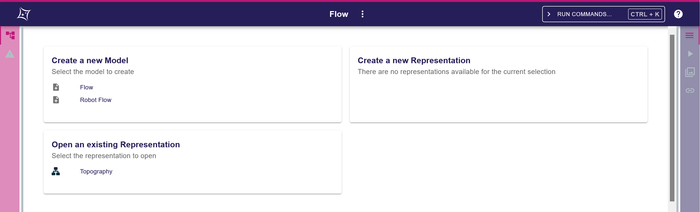
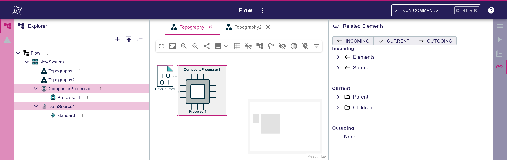

= ADR-200 - Add workbench parts configurations to shared URLs

== Context

In ADR #198 we have added the possibility for users to create a shared URL that encodes the active views of the workbench and the workbench selection.

We want to support sharing more details about each view, such that the full workbench state can be shared between users.

== Decision

We will build on `WorkbenchPartShareableState` to also encode additional arbitrary part-specific settings:

[source, json]
----
interface WorkbenchPartShareableState {
  configuration?: object
  parts?: { [partId: string]: WorkbenchPartShareableState }
}
----

where:

* `WorkbenchPartShareableState.configuration` is an arbitrary JSON object that encodes the internal configuration of the corresponding workbench part.
* `WorkbenchPartShareableState.configuration` is optional so that a part with the default configuration can be represented by not having a value for configuration, thus saving URL real estate.

The main impacts on the Sirius Web frontend components are:
* The configuration must be read at initialization time to initialize the component state.
* The shareable state the components provide upon request must be updated to include a configuration.

Depending on the depth and width of the state a part wants to make shareable, these configurations may be arbitrarily complex (although we have to keep in mind we may be limited due to the maximum size of a URL).

In the scope of this ADR, we will aim to implement the following:
* `left` and `right` side panels: the active view and the size of the panel.
* `main`: the active editor.
* `explorer`: whether the view is opened or closed, the tree representation used, the enabled filters, the expanded tree paths.
* `details`: whether the view is opened or closed, the active tab.
* `query`: whether the view is opened or closed, the active query.
* `related_elements`: whether the view is opened or closed, the enabled categories.
* Diagram Editor: the position, the zoom level, the enabled filters, the enabled diagram options.

The corresponding configuration types are:

[source, json]
----
enum SideViewState {
  Open = "open",
  Closed = "closed",
}

interface SidePanelWorkbenchPartConfiguration {
  activePartId?: string
  size?: number
}

interface MainAreaWorkbenchPartConfiguration {
  activePartId?: string
}

interface ExplorerWorkbenchPartConfiguration {
  state?: SideViewState,
  selectedTreeRepresentationId?: string,
  enabledFilterIds?: string[],
  expandedTreePaths?: string[][]
}

interface DetailsWorkbenchPartConfiguration {
  state?: SideViewState,
  activeTabId?: string
}

interface QueryWorkbenchPartConfiguration {
  state?: SideViewState,
  query?: string
}

interface RelatedElementsWorkbenchPartConfiguration {
  state?: SideViewState,
  enabledCategoryIds?: string[]
}

interface DiagramEditorWorkbenchPartConfiguration {
  x?: number,
  y?: number,
  zoomLevel?: number,
  enabledFilterIds?: string[],
  enabledDiagramOptionIds?: string[]
}
----

Note that all properties are optional.
In case of a missing property, the application provides the default value.

=== Examples

==== Example 1

image::images/200/example1.png[Example 1]

The corresponding `WorkbenchPartShareableState`:

[source, json]
----
{
  "parts": {
    "workbench": {
      "parts": {
        "panels": {
          "parts": {
            "left": {
              "parts": {
                "explorer": {},
                "validation": {}
              }
            },
            "center": {},
            "right": {
              "parts": {
                "details": {},
                "query": {},
                "representations": {},
                "related_elements": {}
              }
            }
          }
        }
      }
    }
  }
}
----

This works under the following assumptions:

* The `left` panel is of size 25 and the `explorer` view is active by default.
* The `explorer` view is open by default, the default selected tree representation is "explorer_tree_description", and there are no enabled filters or expanded tree paths by default.
* The `right` panel is of size 25 and the `details` view is active by default.
* The `details` view is open by default.

This is equivalent to the following `WorkbenchPartShareableState`:

[source, json]
----
{ 
  "parts": {
    "workbench": {
      "parts": {
        "panels": {
          "parts": {
            "left": {
              "configuration": {
                "activePartId": "explorer",
                "size": 25
              },
              "parts": {
                "explorer": {
                  "configuration": {
                    "state": "open",
                    "selectedTreeRepresentationId": "explorer_tree_description",
                    "enabledFilterIds": [],
                    "expandedTreePaths": []
                  }
                },
                "validation": {}
              }
            },
            "right": {
              "configuration": {
                "activePartId": "details",
                "size": 25
              },
              "parts": {
                "details": {
                  "configuration": {
                    "state": "open"
                  }
                },
                "query": {},
                "representations": {},
                "related_elements": {}
              }
            },
            "main": {}
          }
        }
      }
    }
  }
}
----

==== Example 2

Compared to example 1, the views in the `left` and `right` panels have been closed.

[source, json]
----
{ 
  "parts": {
    "workbench": {
      "parts": {
        "panels": {
          "parts": {
            "left": {
              "parts": {
                "explorer": {
                  "configuration": {
                    "state": "closed",
                  }
                },
                "validation": {}
              }
            },
            "right": {
              "parts": {
                "details": {
                  "configuration": {
                    "state": "closed"
                  }
                },
                "query": {},
                "representations": {},
                "related_elements": {}
              }
            },
            "main": {}
          }
        }
      }
    }
  }
}
----

==== Example 3

The corresponding `WorkbenchPartShareableState` (that makes explicit the "enabledCategories" property for the sake of the example, even though it has the default value):

[source, json]
----
{
  "parts": {
    "workbench": {
      "parts": {
        "panels": {
          "parts": {
            "left": {
              "parts": {
                "explorer": {
                  "configuration": {
                    "expandedTreePaths": [
                      ["Flow", "NewSystem", "CompositeProcessor"],
                      ["Flow", "NewSystem", "DataSource1"],
                    ]
                  }
                },
                "validation": {}
              }
            },
            "right": {
              "configuration": {
                "activePartId": "related_elements"
              },
              "parts": {
                "details": {},
                "query": {},
                "representations": {},
                "related_elements": {
                  "configuration": {
                    "enabledCategories": [
                      "incoming",
                      "current",
                      "outgoing"
                    ]
                  }
                }
              }
            },
            "main": {
              "configuration": {
                "activePartId": "diagram_editor::topographyId",
              },
              "parts": {
                "diagram_editor::topographyId": {
                  "configuration": {
                    "x": 123,
                    "y": 456,
                    "zoomLevel": 85,
                    "enabledFilterIds": ["filter1", "filter2"],
                    "enabledDiagramOptionIds": ["option1", "option2"]
                  }
                },
                "diagram_editor::topography2Id": {},
              }
            }
          }
        }
      }
    }
  }
}
----

== Status

Work in progress

To be adapted depending on the finalized state of ADR #198 and its implementation.
