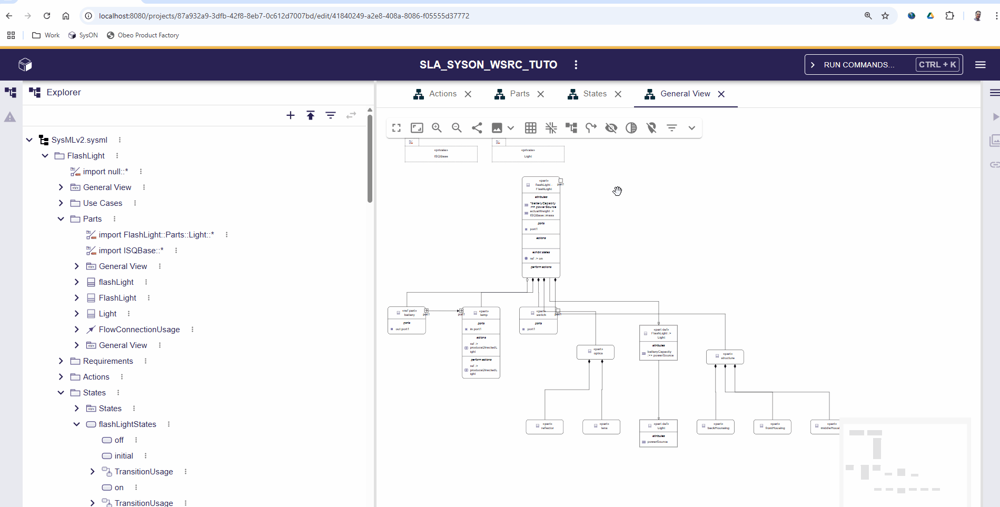

= ADR-220 - Improve Reveal Hidden Elements

== Context

Sirius Web allows users to hide elements using the contextual palettes.
To unhide them, tools are available in the diagram palette that affect all hidden or faded elements in the diagram: "Reveal hidden elements".
However, depending on the language, we may not want to impact every element since some may be hidden for reasons other than explicit user decisions.
For instance, SysON automatically hides all empty compartments of a PartUsage for readability purposes since they are numerous.
Using the "Reveal hidden elements" feature will also reveal all these empty compartments, which may overload the interface and lead to a poor user experience.

== Decision

The current implementation works internally as follows:

* When clicking on the "Reveal hidden elements" tool, `DiagramPanel` lists all diagram elements and uses the `useHideDiagramElements` hook to reveal them.
* The hook, also used by the hide/fade tools of the contextual palettes, sends a query to the backend with `HideDiagramElementInput` as the payload.
* On the backend, the payload is sent to the `HideDiagramElementEventHandler`, which registers a new `HideDiagramElementEvent` with the list of all affected elements.
* This event is then interpreted by `NodeComponent` and `EdgeComponent` to apply or remove the hidden attribute for each element based on the event.

In this implementation, hiding elements and revealing hidden elements use the same backend query.
In other words, we currently cannot distinguish between explicitly revealing specific elements and revealing all of them.
However, in the SysON example, we should not prevent a user from revealing a specific compartment even if we don't want it revealed by the "Reveal hidden elements" action.

To address this, we first need to separate both kinds of actions.
We propose adding a new boolean field to `HideDiagramElementInput` named `bulk` that indicates whether the elements to reveal have been explicitly chosen by the user or result from a mass operation like "Reveal hidden elements".

With this new information, we can now implement distinguishable behaviors on the backend.
On the backend, we propose adding a new type of service: `IHideDiagramElementPolicy`, with the following interface:

[source,java]
----
public interface IHideDiagramElementPolicy {

    boolean canHandle(Diagram diagram);

    /**
     * Checks if the node should be affected by the new visibility state (true = will be hidden, false = will be shown).
     */
    boolean shouldAffectNodeVisibility(Node node, boolean newVisibilityState);

    /**
     * Checks if the edge should be affected by the new visibility state (true = will be hidden, false = will be shown).
     */
    boolean shouldAffectEdgeVisibility(Edge edge, boolean newVisibilityState);
}
----

Services implementing this interface are injected into `HideDiagramElementEventHandler` and are used for bulk actions.
The goal is to control whether a node or edge should have its visibility changed to the new state requested by the frontend.
The `canHandle` method enables filtering implementations based on the diagram type.
`HideDiagramElementEventHandler` will therefore only consider the first policy that can handle the diagram:

[source,java]
----
IHideDiagramElementPolicy policy = hideDiagramElementPolicies.stream()
    .filter(pol -> pol.canHandle(diagramContext.diagram()))
    .findFirst()
    .orElse(defaultPolicy);
----

Sirius Web will provide a default implementation that accepts everything.

We will also implement similar mechanism for fading.

=== Usage

To use the new mechanism, a downstream application only needs to create a new service implementing `IHideDiagramElementPolicy`.

=== Breadboarding

No UI change.

== Status

Proposed.

== Consequences

This proposal will introduce a breaking change for downstream applications using the `hideDiagramElement` GraphQL mutation directly.
