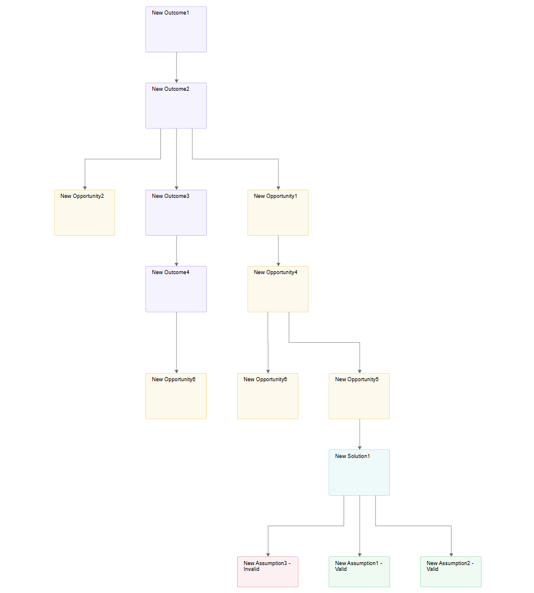

= ADR-XXX - Add support for backend-driven diagram layout customization

== Context

In Sirius Web, diagram layouting (sizing and positioning of nodes and edges) is handled through a combination of backend and frontend processes.
The backend’s `DiagramEventProcessor` manages diagram rendering and persistence, distinguishing two primary event causes:

- `Refresh`: Triggered by actions such as creating new representations, creating/deleting semantic elements, edge creation, or synchronized representation creation.
These update the diagram’s structure and persist changes without directly altering layout data.
- `Layout`: Triggered by actions like clicking "Arrange All" or moving children within a container.
These involve explicit layout computations, updating `DiagramLayoutData` (e.g., `NodeLayoutData` and `EdgeLayoutData`).

- The frontend handles layout application through:
* `useLayout`: Applies layout strategies for most scenarios (e.g., node creation, semantic changes, edge creation), recalculating node coordinates, resolving overlaps, and managing container constraints using NodeLayoutData from the backend.

* `useArrangeAll`: Invoked for the "Arrange All" tool, using the ELK algorithm to compute suggested node positions and sizes.
These suggestions are not applied to pinned nodes and rely on `useLayout` for overlap resolution.

Currently, layout logic is tightly coupled to the frontend’s hardcoded ELK or incremental implementations and the backend’s rendering pipeline.
There is no extension point to inject custom layout algorithms, particularly those computed on the backend, which could leverage diagram descriptions and semantic data for domain-specific layouts designed to specific diagram types.

== Needs

We need to:

- Register a layout strategy for a given diagram type.
- Be able to reuse or bypass existing layout mechanisms (ELK, incremental, etc.).
- Execute custom layout algorithm logic while still benefiting from the default diagram behavior (positions, sizes, layout data sync).
- Be able to define a layout relying on semantic element features (see example) to determine placement and/or a domain-specific layout depending on semantic relationships.
- Define a layout relying on node or edge descriptions.
- Support partial layout customization (e.g., positioning containers) while delegating unhandled aspects (e.g., child nodes) to default mechanisms.

These layouts cannot be supported by the current implementation, which has layouting logic tightly coupled to the existing backend and frontend pipeline.

== Example: Custom layout logic for an OST diagram

In an Opportunity Solution Tree (OST) diagram, the layout must reflect the logical hierarchy of the Product Discovery process.
The root Outcome is positioned at the top of the diagram, and its sub-elements are laid out according to their type and semantic role.

More precisely, the layout rules are:

- The root Outcome (e.g., New Outcome1) must be placed at the top center of the diagram.
- Its immediate child Outcomes (e.g., New Outcome2, New Outcome3, New Outcome4) should be laid one level below, maintaining a vertical orientation.
- Any Opportunities linked to those Outcomes (e.g., New Opportunity1, New Opportunity2, etc.) must be placed at the same vertical level as the Outcomes they are derived from.
- Each Opportunity has an integer priority property. The lower (1) the value, the more to the left it should appear in the diagram. This helps visually identify top-priority items from left to right.

_Such a layout expresses both semantic relations and business rules.
Making it explicit and declarative, or at least configurable, is essential for similar diagram types in other domains._

== Alternatives

As detailed in the *Needs* section, algorithm customization requires access to diagram definitions and semantic data.

=== [front-end] Extension point to customize ELK or incremental front-end algorithms
- The diagram description would need to be loaded with the diagram.
- Specific queries would be needed to load semantic information

This solution is both complex to implement and would negatively impact the performance.
Moreover, there is no guarantee of successfully customizing the ELK algorithm if we pursue this path.

=== [back-end] Extension point to customize back-end rendering

Both diagram description and semantic data are easily and quickly accessible.

== Decision

We will introduce a backend extension point in the `DiagramEventProcessor` to inject custom layout algorithms computed server-side, specific to diagram types or applied globally.

This answers the need because the extension will easily and rapidly access the node or edge description and above all semantic data or services to get business logic.

As explained further, this approach requires no frontend modifications, as the existing `useLayout` mechanism will apply on the backend-provided `DiagramLayoutData`.

The custom layouts are invoked *automatically* for the following scenarios:

* *Refresh Cause*: Creation of new representation, create/delete semantic elements, edge creation, synchronized representation creation.
* *Layout Cause*: Click on "Arrange All", move or resize nodes.

=== Extension Point for Layout Providers

A new backend extension point is introduced using Spring beans to support domain-specific or diagram-type-specific layout strategies.
Furthermore, the specifier can define which specific actions (IDiagramInput interface) should trigger the custom layout logic, such as EditLabelInput, DeleteFromDiagramInput, etc.
This brings more flexibility to specifiers and developers to adapt layout behavior to the needs of their diagrams or domain logic.

==== CustomDiagramLayoutProvider interface

[source,java]
----
public interface CustomDiagramLayoutProvider {

    /**
     * Indicates whether this provider can handle layout for the given diagram.
     *
     * @param diagram The diagram to process
     * @param diagramDescription Optional diagram description
     * @param diagramContext The current diagram context
     * @return true if the provider can handle the diagram layout, false otherwise
     */
    boolean canHandle(Diagram diagram, Optional<DiagramDescription> diagramDescription, IDiagramContext diagramContext);

    /**
     * Applies a custom layout to the given diagram.
     *
     * @param diagram The target diagram
     * @param diagramDescription Optional diagram description
     * @param diagramContext The current diagram context
     * @return The updated diagram with layout applied
     */
    Diagram apply(Diagram diagram, Optional<DiagramDescription> diagramDescription, IDiagramContext diagramContext);
}
----

==== CustomDiagramLayoutRegistry

[source,java]
----
public class CustomDiagramLayoutRegistry {

    /**
     * Returns the first provider capable of handling layout for the diagram
     * identified by the given representation description ID.
     *
     * @param representationDescriptionId The representation description ID
     * @return An optional provider capable of handling the layout
     */
    public Optional<CustomDiagramLayoutProvider> get(String representationDescriptionId);
}
----

==== Integration into DiagramCreationService

[source,java]
----
private final CustomDiagramLayoutRegistry customDiagramLayoutRegistry;

    /**
     * Attempts to apply a custom layout using a registered provider if available.
     *
     * @param diagram The diagram to layout
     * @param diagramDescription Optional diagram description
     * @param diagramContext The diagram context
     * @return The updated diagram (potentially with custom layout)
     */
    private Diagram applyCustomLayoutIfAvailable(Diagram diagram, Optional<DiagramDescription> diagramDescription, IDiagramContext diagramContext);
----

=== No Frontend Modifications:

==== Overview

- The frontend `useLayout` already subscribes to `DiagramRefreshedEventPayload` via `DiagramEventFlux`, applying `NodeLayoutData` and `EdgeLayoutData` from the backend.

- For refresh scenarios, `useLayout` recalculates coordinates and resolves overlaps based on backend data, unchanged.

- For layout scenarios (e.g., "Arrange All"), `useArrangeAll` runs ELK, but the backend’s custom layout strategy overrides the layout, and `useLayout` applies the final `DiagramLayoutData` without modification.

- Sizing (e.g., font-based) remains handled by `useLayout`’s existing handlers (e.g., `FreeFormNodeLayoutHandler`), ensuring compatibility with backend positioning.

==== Application scenarios

Let's consider the following scenarios and then check that it will work with the existing front-end code.

* Diagram creation:
** When a new diagram is created, the backend handles both its construction and persistence.
** The custom layout is applied on the backend
** The frontend handles positioning and sizing of node edges using default layout strategies. Important, nodes and edges with layoutData are not moved *ensuring backend layout is not overridden*.
** The layout mutation is sent, sending back the computed positions (nodes, edges) to the backend for persistence.

* Semantic changes:
** Semantic changes (e.g., editing labels, using creation tools...) automatically trigger a diagram refresh on the backend.
** A new diagram is generated based on the new semantic state, then persisted to all connected clients.
** The custom layout is applied on the backend
** The frontend then re-applies the default layout strategies.
** The layout mutation is sent

* Arrange All tool:
** The frontend computes a new layout using ELK JS and sends them to the backend
** The custom layout is applied on the backend
** The frontend then re-applies the default layout strategies.
** The layout mutation is sent

* Move/Resize:
** Move and resize actions follow the same flow as "Arrange All". The layout is changed manually by the user

=== Handling "Arrange All" Blinking:

- When "Arrange All" is clicked, useArrangeAll applies ELK’s layout client-side, followed by the backend’s custom layout (if present), causing a brief blink as nodes reposition.

- This is deemed acceptable, as the blinking is transient and non-disruptive, avoiding the need for frontend changes to suppress ELK’s initial layout.

=== Limitations

- *Frontend-Driven Sizing*:
The existing layout algorithm’s mainly relies on the frontend, as computing font and rendering sizes is way too challenging server-side and better handled by the frontend engine.

=== Warning points for extension implementors

- *Flexible Extension Point and Coherence with Frontend*:
The backend extension point allows customization of diagram data, but implementors must ensure consistency.
Custom layouts must align with frontend behaviors (e.g., container resizing based on child positions) to prevent conflicts or inconsistencies.

== Status

Draft.

== Consequences

=== Positive

- Enables backend-driven custom layouts, leveraging semantic data and diagram descriptions for domain-specific needs (e.g., OST diagrams).
- Supports diagram-type-specific or global layouts, automatically triggered for all relevant scenarios.
- Requires no frontend editing, preserving useLayout and useArrangeAll functionality.
- Allows partial layout customization with delegation to default mechanisms (e.g., ELK or incremental layout).
- Enhances flexibility for domain-driven diagram designs.

=== Negative

- Blinking effect during "Arrange All" due to ELK’s initial layout, accepted as tolerable.
- Risks inconsistent UX if custom layouts deviate significantly from defaults.

