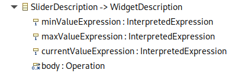

= How to contribute custom widget to the Form representation

This document shows the steps needed for an application to contribute and use its own custom widgets to Form representations (for example to use in custom _Details_ views).

We will use the example of a simple "Slider" widget to illustrate.
The slider widget is an alternative UI to show and edit a numeric value inside a given range.

== Core Widget Implementation: Backend

The first step is to create the core implementation of the new widget in the backend, and plug it inside the _Form_ representation's rendering process.

You will need the equivalent of all the following classes (these can found in `org.eclipse.sirius.web.sample.slider`):

* `Slider.java`: a concrete subclass of `AbstractWidget`, which represents a concrete instance of your custom widget.
In the case of the slider, it contains the fields representing the state of a specific instance (min, max and current value) and the Java `Function` to be invoked to apply the slider's only edition operation (setting a new value).
* `SliderDescription.java`: a concrete subclass of `AbstractWidgetDescription`, which represents the configuration of your widget to appear inside a `FormDescription`.
* `SliderComponent.java` and the accompaying `IProps`: the component responsible to _render_ a `SliderDescription` into a concrete `Slider` given a specific runtime context (represented by the `VariableManager`).
* `SliderWidgetDescriptor.java`: an implementation of `IWidgetDescriptor` which tells the generic Form rendering process how to use your new component.
Note that this `IWidgetDescriptor` implementation *must* be a Spring `@Component` so that it is correctly detected at runtime.

If your custom widget supports one or more mutations (edition operations), you will also need the equivalent of:

* `MutationEditSliderDataFetcher.java`: the GraphQL Data Fetcher implementation which corresponds to the edition operation.
Must implement `IDataFetcherWithFieldCoordinates` and be a `@MutationDataFetcher` with the proper `type` and `field`.
* Any custom `IFormInput` and/or `IPayload` types needed.
In the case of the Slider widget, we only have `EditSliderInput.java` which corresponds to the input data for the `editSlider` mutation.
* `EditSliderValueEventHandler.java`: the actual implementation of the mutation, as an `IFormEventHandler`.
Must be a Spring `@Service` to be properly detected.

Finally, you will also need to declare you new widget and its mutation(s) in the global GraphQL Schema.
This is done by simply providing a `.graphqls` schema file.
Note that the file *must* be in a `schema` folder in the classpath to be detected.
For the Slider widget we have `/sirius-web-sample-application/src/main/resources/schema/slider.graphqls` with the following content:

[source,graphqls]
----
type Slider implements Widget {
  id: ID!
  diagnostics: [Diagnostic!]!
  label: String!
  iconURL: String
  minValue: Int!
  maxValue: Int!
  currentValue: Int!
}

extend type Mutation {
  editSlider(input: EditSliderInput!): EditSliderPayload!
}

input EditSliderInput {
  id: ID!
  editingContextId: ID!
  representationId: ID!
  sliderId: ID!
  newValue: Int!
}

union EditSliderPayload = SuccessPayload | ErrorPayload
----

== Core Widget Implementation: Frontend

Declare the `GQLWidget` concrete sub-type for you new widget:

[source,typescript]
----
// File: packages/sirius-web/frontend/sirius-web/src/widgets/SliderFragment.types.ts
import { GQLWidget } from '@eclipse-sirius/sirius-components-forms';
 
export interface GQLSlider extends GQLWidget {
  label: string;
  minValue: number;
  maxValue: number;
  currentValue: number;
}
----

Implement the actual frontend React component for your new widget.
The React component must match the signature expected for _Property Sections_.

[source,typescript]
----
// File: packages/sirius-web/frontend/sirius-web/src/widgets/SliderPropertySection.tsx
export const SliderPropertySection = ({
  editingContextId,
  formId,
  widget,
  subscribers,
  readOnly,
}: PropertySectionComponentProps<GQLSlider>) => {
  // ...
}
----

Finally, at the top-level of your application you must provide a `PropertySectionContext` with a `PropertySectionComponentRegistry` value which declare all you custom widgets:

[source,typscript]
----
// File: packages/sirius-web/frontend/sirius-web/src/index.tsx
const propertySectionsRegistry = {
  getComponent: (widget: GQLWidget) => {
    if (widget.__typename === 'Slider') {
      return SliderPropertySection;
    } else {
      return (props: PropertySectionComponentProps<GQLWidget>) => null;
    }
  },
  getWidgetContributions: () => {
    const sliderWidgetContribution: WidgetContribution = {
      name: 'Slider',
      fields: `label iconURL minValue maxValue currentValue`,
      icon: <LinearScaleOutlinedIcon />,
    };
    return [sliderWidgetContribution];
  },
};

const propertySectionRegistryValue = {
  propertySectionsRegistry,
};

ReactDOM.render(
  // ...
      <PropertySectionContext.Provider value={propertySectionRegistryValue}>
          <App />
      </PropertySectionContext.Provider>
  // ...,
  document.getElementById('root')
);
----

Note the `sliderWidgetContribution` which gives the name and GraphQL type name and fields/section for the frontend to be able to retrieve the data for your custom widgets.
They must match the names you declared in the `graphqls` file.

== View DSL Integration

While technically optional, this step is highly recommended as it will allow  widget(s) to be configurable using the View DSL like the rest of the core widgets.

First, create your own Ecore model.
It must define a sub-type of the `WidgetDescription` _EClass_ from `view.ecore` (`org.eclipse.sirius.components.view.WidgetDescription`) with the appropriate configuration attributes.

For example for the Slider widget:

When generating the Java implementation for your metamodel, make sure to enable the "Child Creation Extenders" flag in the GenModel.
This is needed for the core View DSL to be able to use your new sub-type(s) of `WidgetDescription`.

Then you need to register your metamodel's `EPackage,` `AdapterFactory` and a `ChildExtenderProvider` so that the runtime knows about it.
For example in a Spring `@Configuration` class:

[source,java]
----
@Bean
public EPackage sliderWidgetEPackage() {
    return SliderWidgetPackage.eINSTANCE;
}

@Bean
public AdapterFactory sliderWidgetAdapterFactory() {
    return new SliderWidgetItemProviderAdapterFactory();
}

@Bean
public ChildExtenderProvider sliderWidgetChildExtenderProvider() {
    return new ChildExtenderProvider(ViewPackage.eNS_URI, SliderWidgetItemProviderAdapterFactory.ViewChildCreationExtender::new);
}
----

With these information, it becomes possible to create instances of your widget's View-based description class (e.g. `SliderDescription`) inside a View-based FormDescription.

The final step is to tell the system how to convert these modeled widget description into their corresponding core implementation.
This is done by declaring a `IWidgetConverterProvider`:

[source,java]
----
@Service
public class SliderDescriptionConverterProvider implements IWidgetConverterProvider {
    @Override
    public Switch<AbstractWidgetDescription> getWidgetConverter(AQLInterpreter interpreter, IEditService editService, IObjectService objectService) {
        return new SliderDescriptionConverterSwitch(interpreter, editService);
    }
}
----

The actual conversion is delegated to a `Switch<AbstractWidgetDescription>` implementation that you must provide.
It will be called during the View conversion process when the system finds an instance of your custom widget inside a View definition.

See the code for `org.eclipse.sirius.web.sample.slider.SliderDescriptionConverterSwitch` for more details.

== Form Description Editor Integration

If you want your custom widget to be usable inside the visual Form Description Editor, some additional steps are needed.

On the backend you must provide a `org.eclipse.sirius.components.formdescriptioneditors.IWidgetPreviewConverterProvider`.
Its role is similar to the `IWidgetConverterProvider`, but it will be executed in the context of a Form Description Editor instead of on a concrete target model.
The `AbstractWidgetDescription` it returns will be used to provide a "static preview" of your widget.
Depending on your case you may only provide a completely fixed widget description which will always render the same, or try to interpret statically some of the widget's properties (e.g. colors) if possible.

See `org.eclipse.sirius.web.sample.slider.SliderDescriptionPreviewConverterProvider` for an example.

On the frontend you must provide a component to render the widget preview in the context of the _Form Description Editor_.
It is very similar to the _Property Section_ component but simpler as it does not support the actual behavior of the widget.
See `sirius-web/frontend/sirius-web/src/widgets/SliderPreview.tsx` for an example.

Finally, you must register this preview component in the top-level regsitry's `getPreviewComponent` function:

[source,javascript]
----
const propertySectionsRegistry = {
  getComponent: (widget: GQLWidget) => {
    // ...
  },
  getPreviewComponent: (widget: GQLWidget) => {
    if (widget.__typename === 'Slider') {
      return SliderPreview;
    }
  },
  getWidgetContributions: () => {
    // ...
  },
};
----
