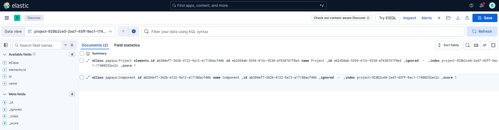
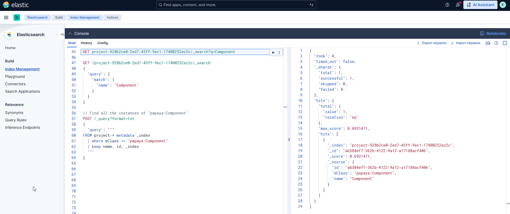

= How to debug Elasticsearch related issues

Let's consider that you are trying to debug an issue related to the indexing of models in Elasticsearch.
Elasticsearch comes with Kibana, a browser-based analytics and search dashboard that lets you visualize and  manage your indices (among other features we won't cover here).

== Prerequisite

This guide assumes you have Elasticsearch up and running and Sirius Web configured to use it.
If it is not the case, run the following command to start a development instance of Elasticsearch.

[source, bash]
----
curl -fsSL https://elastic.co/start-local | sh
----

If you don't want to install Elasticsearch directly on your computer, you can use the following instructions.

Start by creating a folder for the data:

[source, bash]
----
mkdir -p VOLUME_PATH_ON_YOUR_COMPUTER
chmod 776 VOLUME_PATH_ON_YOUR_COMPUTER -R
----

Then start Elasticsearch:

[source, bash]
----
docker pull elasticsearch:VERSION
docker network create elastic
docker run -d --name elasticsearch --net elastic -p 9200:9200 -p 9300:9300 -e "discovery.type=single-node" -v VOLUME_PATH_ON_YOUR_COMPUTER elasticsearch:VERSION
----

Reset the password for the account `elastic`:

[source, bash]
----
docker exec -it elasticsearch /usr/share/elasticsearch/bin/elasticsearch-reset-password -u elastic
----

The password will be written in the console.
Now retrieve the enrollment token for Kibana:

[source, bash]
----
docker exec -it elasticsearch /usr/share/elasticsearch/bin/elasticsearch-create-enrollment-token -s kibana
----

Copy the Elasticsearch certificate from the Docker container:

[source, bash]
----
docker cp elasticsearch:/usr/share/elasticsearch/config/certs/http_ca.crt .
----

Put this certificate somewhere in your computer and use it to test the connexion to Elasticsearch

[source, bash]
----
curl --cacert PATH_TO_THE_CERTIFICATE/http_ca.crt -u "elastic:PASSWORD" https://localhost:9200
----

Now let's start Kibana:

[source, bash]
----
docker pull kibana:VERSION
docker run -d --name kibana --net elastic -p 5601:5601 kibana:VERSION
----

Retrieve the Kibana verification code:

[source, bash]
----
docker exec -it kibana /usr/share/kibana/bin/kibana-verification-code
----

And go to `http://localhost:5601/` in a web browser to use both the enrollment token and the verification code to connect Kibana and Elasticsearch.
After all that, you may need to add the Elasticsearch certificate to the keystore of your JVM to allow Sirius Web to communicate with Elasticsearch:

[source, bash]
----
sudo keytool -J-Duser.language=en -import -trustcacerts -alias elasticsearch-siriusweb -keystore PATH_OF_THE_JVM/lib/security/cacerts -file PATH_TO_THE_CERTIFICATE/http_ca.crt
----

You can then configure your `application.properties` as follows

[source, properties]
----
spring.elasticsearch.uris=http://localhost:9200
spring.elasticsearch.username=elastic
spring.elasticsearch.password=<Your password>
----

Or add the following program arguments to your launch configuration:

[source, bash]
----
--spring.elasticsearch.uris=http://localhost:9200 
--spring.elasticsearch.username=elastic 
--spring.elasticsearch.password=<Your password>
----

== How to see what is in an index

Navigate to http://localhost:5601/ to open Kibana, open the left-side menu and select `Elasticsearch > Index Management`.

The page displays the list of indexes currently managed by Elasticsearch.
Each Sirius Web project has its own index, named `project-<Project ID>`.

Click on an index to get high-level information (like the size of the index, the number of documents, etc).
Click on the _Discover index_ button to open the index and see the documents currently stored in it.

[NOTE]
====
The discover view can only display 500 documents, use the fields on the left panel to filter the results, or check the next section to run queries on an index.
====

== How to run queries on an index

On most of the pages you'll have access to the _Console_ at the bottom of the workbench.
Clicking on it opens a shell you can use to query your indices.

The shell supports various types of queries, such as full-text search, a Json-based query DSL, or ES|QL.
The right panel displays the documents matching the last executed query.

For example, you can perform a full-text search on a given index with the following query:

----
// Get all the documents matching the term "Component".
GET project-<Project ID>/_search?q=Component
----

You can use the query DSL to define more complex queries with a Json-based DSL, for example, you can get all the instanceof of a given type that also have a name matching a given pattern:

----
// Get all the components with "Compo" at the beginning of their name
GET /project-<Project ID>/_search
{
  "query": {
    "bool": {
      "must": [
        {
          "wildcard": {
            "name.keyword": "Compo*"
          }
        },
        {
          "match": {
            "eClass": "papaya:Component"
          }
        }
      ]
    }
  }
}
----

You can find more information on the https://www.elastic.co/docs/explore-analyze/query-filter/languages/querydsl[Query DSL documentation].

Alternatively, you can define such complex queries with ES|QL, for example, you can get all the instances of a given type with the following query:

----
// Find all the instances of "papaya:Component", and show their name, id, and the index storing them.
POST /_query?format=txt
{
  "query": """
    FROM project-* metadata _index
    | where eClass == "papaya:Component"
    | keep name, id, _index
  """
}
----

Note that query above uses a _wildcard_ in the name of the index it queries, meaning that all the indexes starting with "project-" are queried.

ES|QL allows to define complex queries, including https://www.elastic.co/blog/esql-lookup-join-elasticsearch[joins]:

----
// Find the name of all the elements that are targeted by a ReferencingLink in a given project
POST /_query?format=txt
{
  "query": """
FROM project-<PROJECT ID>
  | where eClass == "papaya:ReferencingLink"
  // Rename because left and right columns in a join must have the same name. So we rename the column we want to lookup for.
  | rename target.keyword as id.keyword
  | lookup join project-47975e1b-138d-4be5-85a8-26dda8c8eb9d on id.keyword
  | keep name
  """
}
----

Note that join queries do not support wildcards in their `FROM` clause.

You can find more information on the https://www.elastic.co/docs/reference/query-languages/esql[ES|QL documentation].

== Data structure of indexed documents

Sirius Web's default implementation stores the information of each individual `EObject` into a document.

These documents are simplified versions of the Json objects produced by EMF Json. 
Specifically, they do not contain intermediate objects like `data` or `content`, and references are denormalized to only contain the IDs of the referenced objects.
For example, the document below shows how a Papaya `Interface` is stored in Elasticsearch.

[source,json]
----
{
  "eClass": [
    "papaya:Interface"
  ],
  "eClass.keyword": [
    "papaya:Interface"
  ],
  "extends": [
    "e14f532d-256c-4da9-8173-1912e0bdb296"
  ],
  "id": [
    "7432d199-8bca-4b90-b3d2-2ab8b30b0a98"
  ],
  "name": [
    "Interface2"
  ]
}
----