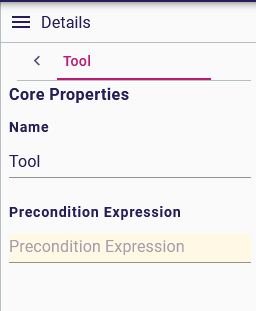

= (S) Add precondition on tool

== Problem

Today a specifier can add tools to the palette of a diagram description, but it's not possible to determine when the tool should be available or not.

== Key Result

Offers a specifier the ability to declare precondition on tools.
Tools are only accessible if their preconditions are interpreted as true.

== Solution

Add in the view DSL, a precondition expression to the tool EClass.
Before retrieve the list of tools in `GetToolSectionsEventHandler`, interpret this expression to determine if the tool must be added to the palette.
If there is no precondition set, the tool is always added to the palette.
The only variables given for the precondition interpretation are:

* _self_: the target object
* _selectedNode_: the diagram element if it's a node
* _selectedEdge_: the diagram element if it's an edge

=== Scenario

* The specifier adds a new tool to a palette and sets a precondition expression.
* When users open the diagram representation, they only have access to the tool if its precondition is evaluated to true.

=== Breadboarding

Example of the `Precondition Expression` for a Tool

=== Cutting backs

== Rabbit holes

* This feature only impacts backend, thus it will be available for both diagram representations (legacy and react_flow).

== No-gos

