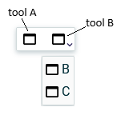

= (S) Add tool sections in the View DSL

== Problem

Today a specifier can add tools to a diagram description, but there is no possibility to organize these tools in section.
If there are a lot of these tools, it can be complicated for a user to retrieve the wanted tool.

== Key Result

Offers specifiers the ability to organize these tools in sections.

== Solution

For each palette (DiagramPalette, NodePalette and EdgePalette), add to the View DSL `diagram.ecore`, a new containment reference call _section_, which could contain some tools.
A palette could have zero or more sections, and a tool could be at the root of the palette or in a section.
For the UI, all the tools of a section will be available in a submenu directly accessible from the palette, the last used tool of the section will be the first element.

=== Scenario

* On a `DiagramDescription`, a specifier creates a tool _A_ directly in the palette and a tool section.
* In the tool section, he adds two new tools _B_ and _C_ in this order.
* When an end user access to the diagram, the palette has two entries, the tool _A_ alone and the section with the two other tools _B_ and _C_.
* From the palette, the tool _B_ can be directly triggered and the tool _C_ is available in the submenu.
* If the end user triggers the tool _C_, it's now this one that becomes accessible directly from the palette and tool _B_ from the submenu.

=== Breadboarding

Example of a palette with tool _A_ no section, tools _B_ and _C_ in the same section.

=== Cutting backs

* The reorder in the section submenu to always give direct access to the last used tool.

== Rabbit holes

* If there is only one tool in the section, there is no submenu.

== No-gos

* The possibility to add sections in a section.
