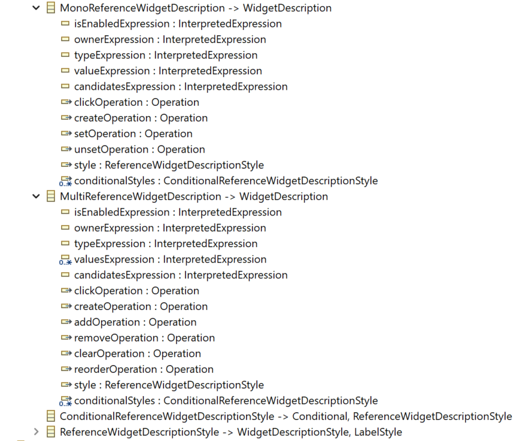

= (M) Add customizability to the reference widget

== Problem

As an Application integrator, I would like to control the way the reference widget handles the reference. 
For instance, I would like to control how the candidate list is built or how the widget's actions are performed.

== Key Result

Offer developers the ability to specify in the View DSL all the reference widget customization key points.

== Solution

The approach is to introduce two new advanced reference widgets (one for multi-valued and one for mono-valued) with all customization key points. Once this widget is available it will be easy to convert the simple EMF existing reference widget to use these base widgets.

Here is the model of both mono-valued and multi-valued reference widgets:

=== Shared property details

The following properties are shared in both widgets.

*_Owner Expression_* (optional): If specified, the reference edited will be searched on the value of the expression, instead of the current element (self)

*_Type Expression_*: The type of the referenced object(s) is obtained by the value of the expression.

*_Candidates Expression_*: This expression is used to express the list of existing compatible objects already present in the editing context (project). These objects can be displayed to allow the user to select one or several of them.

*_Click Operation_* (Optional): If specified, this is the operation that is called when the user clicks a reference value element.

*_Create Operation_*: This is the operation that is called to instantiate a new object (of type *_Type Expression_*).

=== Mono-valued reference widget details

*_Value Expression_*: The actual value of this mono-valued reference.

*_Set Operation_*: This is the operation that is called to assign the value to the reference. 

*_Unset Operation_*: This is the operation that is called to reset the value to the reference.

=== Multi-valued reference widget details

*_Values Expression_*: The actual list of values of this multi-valued reference.

*_Add Operation_*: This is the operation that is called to add a new value to the reference. 

*_Remove Operation_*: This is the operation that is called to remove a given value from the reference.

*_Clear Operation_*: This is the operation that is called to empty the values of this reference.

*_Reorder Operation_*: This is the operation that is called to change the position of a given value in the list of the values of the reference.

=== Revisiting existing Reference widget

In that approach, the existing EMF reference widget could be implemented using previously described ones. Indeed, knowing the reference name we can easily infer the arity (mon-valued or multi-valued) and the type of the reference. Since this widget is EMF-centric we will use generic operations to handle each operation of base widgets.

=== Implementation impacts

In our approach, the goal is to leverage as much as possible the existing reference widget (API part).
Nevertheless, it sounds like a better approach to create specific mutations for each operation rather than to have one only editing mutation for giving the new state of the reference values. That way, we propose to introduce a create mutation, an add mutation, and so on.

=== Breadboarding

User experience should remain unchanged. The UI of the existing reference widget should be the one used for new widgets.

=== Cutting backs

TBD

== Rabbit holes

TBD

== No-gos

TDB
