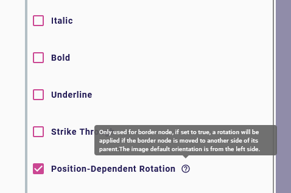
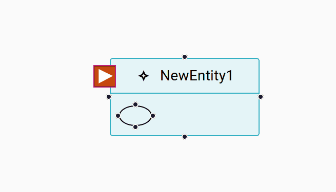
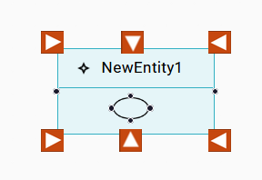

= (S) Rotatable border node

== Problem

When using border nodes with image, if the border node is moved around its parent node, the image will keep its orientation in every position.
Depending on the choice of image, specifiers may want the image to rotate when changing the edge anchor of its parent node.

== Key Result

Specifiers must be able to declare a `imageNodeDescription` as rotatable.
When an end user moves a rotatable border node image around its parent, the image must always be oriented to the center of this parent.

== Solution

=== Backend

We will add a variable in the _variableManager_ used to compute `conditionalStyle` conditions, named `isBorderNode`.
Using conditional styles, this will allow a specifier to define a specific style only when the element is used as a border node.

We will add a new true/false property to the `ImageNodeStyleDescription` named `position-dependent rotation` to declare an image rotatable.
This property will only be computed if the image node is used as a border node.

=== Frontend

If the nodeStyle is declared as rotatable and according to its position in relation to its parent, we apply a rotation to the element.

=== Breadboarding

== Rabbit holes

* The default border position (where we don't apply any rotation transformation), is the left one.
It's up to the specifier to provide an appropriate image.
* The top and bottom corner are considered to be on the vertical axis

* A help expression will be added to the new `position-dependent rotation` property to explain its use.

== No-gos

* This feature will only be able on the new diagram representation by react-flow.
