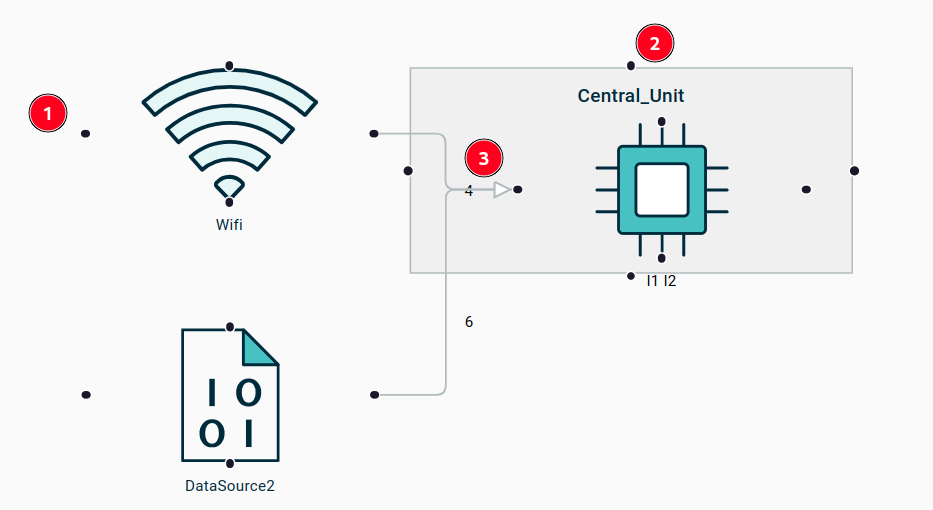

= (M) Improve handles management in React Flow based diagrams

== Problem

The React Flow based diagram renderer currently uses the default React Flow look & feel for edge handles.
It has several issues:

- the handles, represented by small black circles, are **always** visible on all nodes, which causes a lot of visual noise and make the diagrams hard to read;
- there is a single handle on each side (N/S/E/W) of the nodes shared by all edges on the same side of a node.
This makes them impossible to distinguish visually, and because the handle is also used to trigger reconnection it is hard/impossible to reconnect a specific edge in this case.
- handles serve as target points for the creation and reconnection of edges, but they are small and relatively hard to point to.

The image below illustrates these issues:

1. The "black dots" visible on the four sides of all nodes.
2. Including nodes which can not actually be the source or target of edges.
3. When two nodes (Wifi and DataSource2) point to the same side of another node (the processor), their extremity are "merged" into the same point and they are indistinguishable.

== Key Result

1. Unless the end-user is explicitly interacting with a node or edge, the handles used to create new edges or reconnect existing ones should not be visible.
2. When a node has multiple edge extremities (including from the same "self loop" edge) pointing to one of its sides, they are all clearly separated and spaced evenly across the node side.
3. When creating a new edge or reconnecting an existing one, the user can point anywhere inside the bounding box of the target node.
4. When creating a new edge or reconnecting an existing one, nodes which are incompatible/compatible/selected as the target are made clearly distinct visually.

== Solution

We will distinguish three different kinds of handles:

1. *edge creation handles*: placed at the same location as the current ones (on the middle of each side of a node) but only used to initiate the creation of new edges.
These will only be present when a node is selected *and* can be the source of an edge creation tool.
2. *edge reconnection handles*: placed at the extremity of edges, these can be used to initiate the reconnection of an existing edge.
3. *edge target handles*: these are invisible and cover the whole area of a node, but are required by React Flow to serve as the target zone for both edge creation and reconnection.

Handles should only be visible when relevant:

- *edge creation handles* are only visible on nodes which have edge creation tools associated *and* are selected (just hovering on a node does _not_ make the handles visible);
- *edge reconnection handles* are only visible when the corresponding edge is selected;
- *edge target handles* are never visible, they exist only to determine the active zone for selecting the target of an edge creation or reconnect.

If multiple edges point to the same side of a given node,  they should point to locations which are evenly spaced on the side, distinct from each other.
This includes the case of "self loops" when both endpoints of an edge are the same face of the same node: they should be distinct.

Style and feedback:

* when a handle is visible (either an edge creation handle when a _node_ is selected of an edge reconnection handle when an _edge_ is selected), it is highlighted in a distinct color when hovered.
This is true for both edge creation handles and edge reconnection handles.
* during the edge creation process (the user is dragging a https://reactflow.dev/examples/edges/custom-connectionline[connection line] from its source to the wanted target):
** nodes which are known to be incompatible with any kind of edge creation tool starting from the source are temporarily faded;
** when the mouse cursor hovers on a compatible target node, that node is highlighted (using the same style as uses for node DnD);
** nodes (compatible but not hovered) which where not faded by the user keep their style
** nodes (compatible but not hovered) which _where_ faded by the user are temporarily unfaded to indicate they are compatible.

=== Cutting backs

- Dynamic visual feedback about which nodes are compatible or not during the creation or reconnection of edges.

== Rabbit holes

The most risky/complex part is the fact that the number and location of the *edge reconnection handles* is now much more dynamic and complex to implement in a way that fits into React Flow's lifecycle.

When a node with edges connected on all its four sides is selected, the location of the edges selection zone and the creation handles overlap.
When the user clicks inside this zone, only one of them can take precedence over the other.
In practice, the edges are selected (as they are "higher" in the visual layers hierarchy), which can make it difficult or even impossible to click on the creation handle (and thus to create new handles).
This known limitation will be handled in a later iteration.

== No-gos

