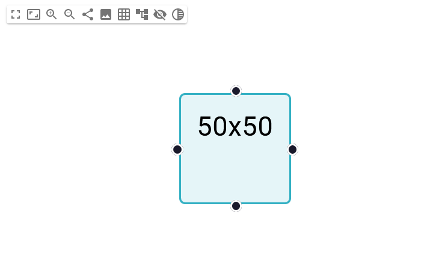
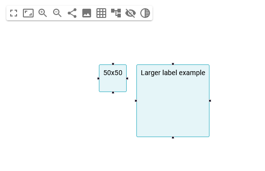
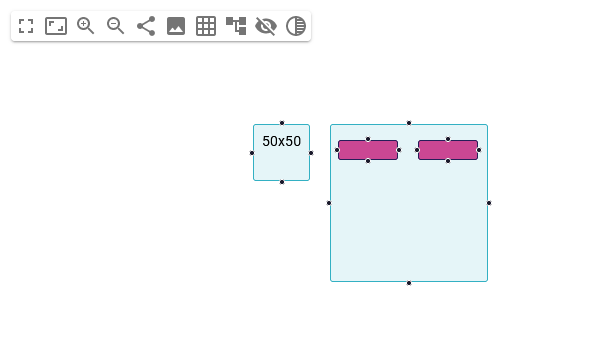
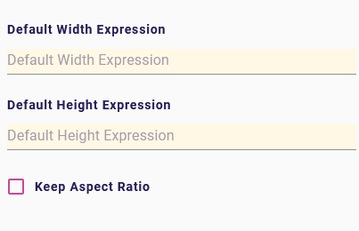

= (M) Keep node aspect ratio

== Problem

There is no possibility to configure a node to maintain its ratio in every case.

== Key Result

A specifier should be able to fix the default size on a node and specify if this ratio should be fixed.
The diagram representation should apply these default values and keep the ratio in every layout situation.

== Solution

Add to the diagram DSL for `NodeDescription`:

* `defaultWitdhExpression`, the expression to retrieve the default width to apply to the node.
* `defaultHeightExpression`, the expression to retrieve the default height to apply to the node.
* `keepAspectRatio`, if true the ratio width/height should always be preserved.

=== Scenario

- In the `nodeDescription`, the default width and height are set to 50 and the keepAspectRatio is activated.
On the diagram representation, the node is layout with the correct size and the manual resizer keeps the ratio (1:1).

- During the layout, if the node needs more space, for example, to display a larger label, the node is rendered with the correct ratio (1:1).

- Same behavior if there is some sub-node to display

=== Breadboarding

* The new properties on a `NodeDescription`:

== Rabbit holes

* This feature will only be able on the new diagram representation by react-flow.
* If no default width or default values are set, the default size is 150x70.
* This new feature applies to nodes, sub-nodes and border nodes.
* If the node is specified as resizable, then the resizing action should keep the ratio depending on the node configuration.
The default size values are ignored, users can resize their node smaller or larger than the default size.
