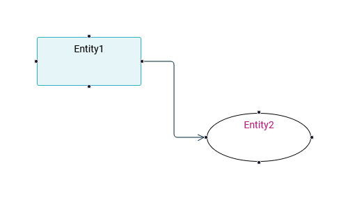

= (M) Support custom nodes in Diagram representations

== Problem

The _Diagram_ representation currently supports only four types of node: _RectangularNode_, _ImageNode_, _ListNode_ and _IconLabelNode_.
Even if we enrich this set, it will never account for all the specific needs of concrete applications.
The Sirius Components framework should be open for custom applications to provide their own nodes.

== Key Result

An application based on Sirius Component should be able to extend the _Diagram_ representation with additional, custom shape.
This should be possible without forking/modifying Sirius Components, i.e. strictly on the application side.

When running such an application, studio makers should be able to use the additional nodes as style for every _NodeDescription_.

Sirius Web should provide at least one complete and documented example of such a custom node to serve as a reference for implementers.

== Solution

We will need to make the Diagram representation implementation extensible at several levels to support node types which the core implementation does not know about:

. The View DSL
. The backend
. The GraphQL Schema
. The frontend

We will provide a simple "Ellipse" shape as an example and to validate the feature.
The backend part will be provided in new, separate Java projects/Maven modules that only `sirius-web-sample-application` will depend on.
The frontend part of the Ellipse node will be entirely contained in `sirius-components/packages/sirius-web/frontend/sirius-web`.

=== View DSL Support

We will create a `customnodes.ecore` metamodel which defines the `EllipseNodeStyleDescription` type as a custom `NodeStyleDescription` subtype.

=== Backend

The `StyleFactory` is already extensible by providing new `INodeStyleProvider`.
This provider must create a new `INodeStye` from a `NodeStyleDescription`.

=== GraphQL Schema

The new custom node definition must be declared on a specific `.graphqls` file and must extend the existing union `INodeStyle`.

For example:

```graphql
type EllipseNodeStyle {
  borderColor: String!
  borderSize: Int!
  borderStyle: LineStyle!
  color: String!
}

extend union INodeStyle = EllipseNodeStyle
```

=== Frontend

On the frontend, a new custom node needs to define the following behavior:

. Implementation of `INodeConverterHandler`: used to convert `GQLNode` to `NodeData`.
. Implementation of `INodeLayoutHandler`: used to define node position and size.
. `NodeStyleContribution`: specify the style parameter used by the shape.
. `NodeType`: specify the node representation, used by react-flow to render the shape.

=== Breadboarding

An example with _Entity1_ as _RectangularNode_ and _Entity2_ as _EllipseNode_



=== Cutting backs

* Make the frontend part into a separate, reusable NPM library (instead of directly inside sirius-web-sample-application).

== Rabbit holes

* A basic layout algorithm for sub-nodes and border node will be added for the ellipse node example.

== No-gos

* This feature will only be able on the new diagram representation by react-flow.
