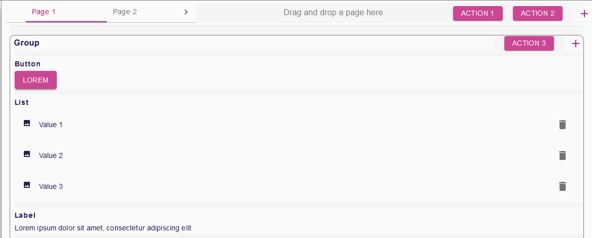

= (M) Add page concept in form view DSL

== Problem

It's not possible in the form to organise groups of widgets by pages.

== Key Result

The solution must offer the user the possibility to add or remove pages to a form description and add or remove groups of widgets to pages.

== Solution

Add to the view DSL the page _EClass_ _PageDescription_ with 4 attributes :

. Name
. Label Expression
. Semantic Candidates Expression
. Precondition Expression

and 2 _containment_ references, both with cardinality _0..*_:

. `GroupDescription`
. `ToolBarAction`

In the new view model a `FormDescription` has now a reference to `PageDescription` and no `GroupDescription` anymore.
Create the graphical representation in order to manage the pages of a form in the WYSIWYG editor.

Each page can have several toolbar actions.

=== Scenario 1—Manage from the explorer view

* User creates a new form description in a view with the explorer.
* A form description is initialized with a default page, this page is initialized with a default group.
* Users can create other pages to the form, each new page is always initialized with an empty group.
* Users can create groups in the pages.
* Users can create toolbar actions in the pages.

=== Breadboarding

=== Scenario 2—Manage from the WYSIWYG editor

* There is a graphical representation for pages in the editor.
* There is an icon for page in the palette.
* Users can drop a new page in the editor.
* Users can switch from pages, the editor only displays groups and widgets from the current page.

=== Breadboarding

=== Scenario 3—Manage toolbar actions for pages

* There is a graphical representation for all the toolbar actions of the current page.
* The toolbar actions are managed the same way as for the groups.
* Users can switch from pages, the editor only displays toolbar actions from the current page.

=== Breadboarding

=== Cutting backs

The page's toolbar management can be delayed if the feature doesn't fit the appetite.

== Rabbit holes

* In contrast to Sirius Desktop, a group is directly contained by a page, which implies that a group can't be referenced by multiple pages.
* A group or a widget can only be moved between elements from the same page.
* The zone to drop new page is in the same area that where the pages are listed with tab and where the toolbar actions of the current page are displayed,
if there are a lot of pages or toolbar actions, always keep in the editor a zone to drop.
* Widget can't be added directly in page and must be contained in a group description.
* A new page can be dropped to any valid place (before first page, after last page and between existing pages) and should keep the order.
* A page can be moved to change the representation order.
* A toolbar action from a group can be moved to the toolbar of the current page.

== No-gos

The ability to reuse a group on multi pages.
