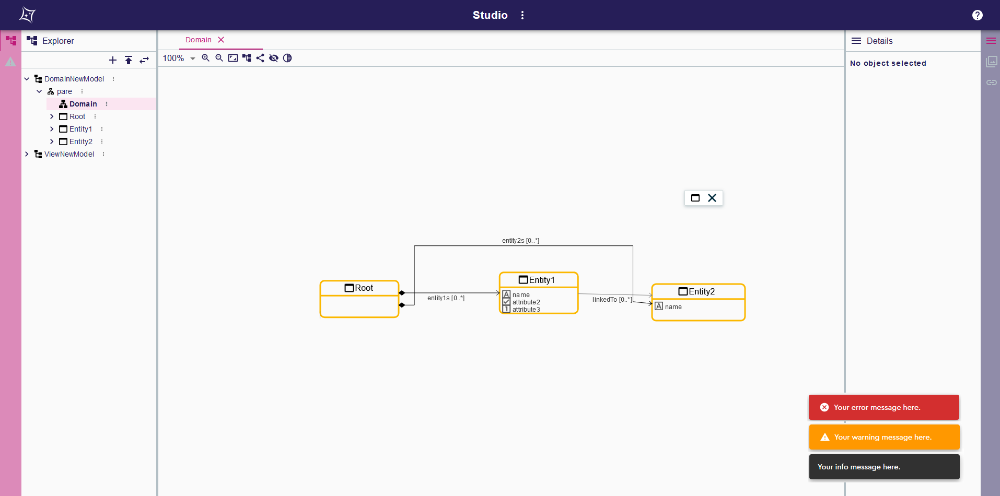

= (L) Display feedback message on the frontend

== Problem

It's not possible for a specifier to alert end users after an action.

== Key Result

The specifier can call an API in his java service to display a message on the UI.
The representation of the messages can be specified to alert the end user.

== Solution

Offer an API to display messages on the UI.

[source,java]
----
interface IFeedbackMessageService {
    void addFeedbackMessage(String message, FeedbackLevel level);
}
----
with
[source,java]
----
enum FeedbackLevel {
    DEBUG,
    INFO,
    WARNING,
    ERROR,
}
----

=== Scenario

In his own service, a specifier can call an API to display a simple message to the end-user.
He must specify a feedback level to notify the end user if it's an error, warning, info or debug message.

=== Breadboarding

=== Cutting backs

Don't offer to the specifier the possibility to choose a _level_ and only display result in a single _Snackbar_ with text messages joined by comma.
There must be an indication to differentiate technical messages versus functional messages.

== Rabbit holes

* The messages must appear after tool action and widget action (even if the service is accessible in all java services).
* In the same action, the API can be called many times; in the end user representation all the messages must be displayed with their correct level.
* If the message is too long to be entirely displayed in its UI representation, then the text is ellipsed.
* A message is dismissed after a limit of time, there is no close button.
* An action can't stack more than a limited number of messages; if there is already the limit of messages on the screen, then the oldest will be replaced by the new one.
* The rendering of each message level isn't configurable.

== No-gos

Offer the specifier the possibility to display something more complex than a plain, non-formatted text.
Offer the specifier the possibility to define his own custom message rendering.
