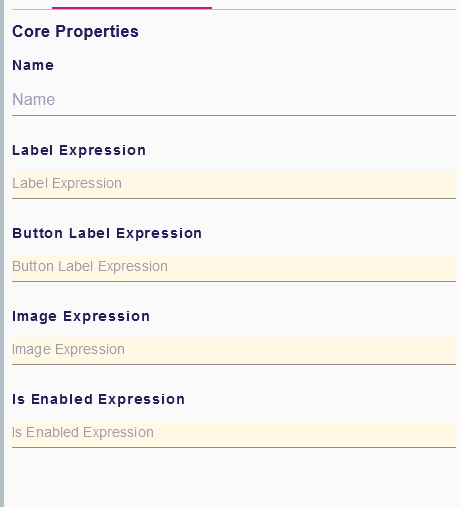
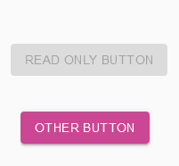

= (M) Add the disable/enable concept for widgets to manage read-only properties

== Problem

It is not possible to declare a widget read-only.

== Key Result

The specifier can control a widget's behavior by declaring it read-only or not.
This property will be managed by an expression that will be computed in the context of the widget's semantic element, in order to adapt the property behavior to the current state of the element.

== Solution

Add to all non-read-only widgets the field `isEnabledExpression`.
During the widget rendering, this expression is computed to determine whether the widget is read-only or not.
This result is used on the UI to make the widget's representation in read-only mode.

=== Scenario

* The specifiers can declare an `isEnabledExpression` on a widget in a `FormDescription`.
* During runtime, the end user cannot interact with the widget as long as the expression is evaluated to false.

=== Breadboarding

Example of the `isEnabledExpression` for a button widget

Read-only representation of a button widget

=== Cutting backs

* Add expression `isEnabledExpression` to the custom widget slider.

== Rabbit holes

* If there is no `isEnabledExpression` defined, the default behavior is to make the widget always enabled.
* There will be no `isEnabledExpression` on `PageDescription` or `GroupDescription`.
* In the View DSL, here's the list for which the expression will be added :
** Textfield / Text area
** Checkbox
** Select / Multi select
** Rick text
** Radio button
** Flexbox container
** Button
** List
* The `isEnabledExpression` will be added to the custom slider widget, as an example.

== No-gos

