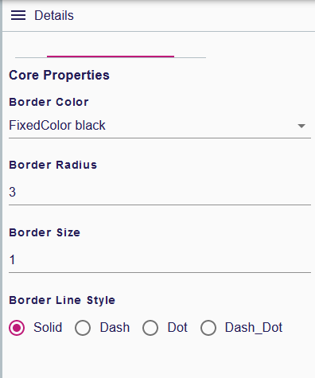
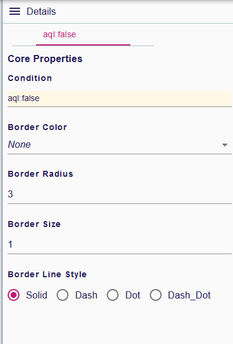
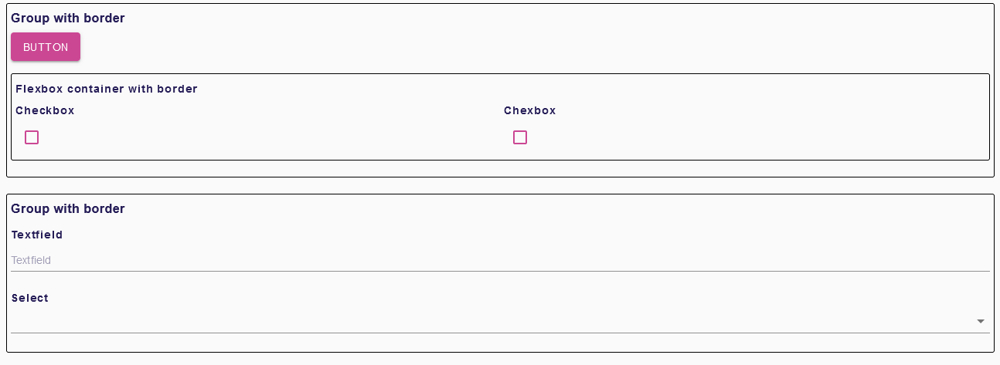

= (M) Add border style for containers

== Problem

In forms, it is difficult to identify the limits of a container (group or flexbox).

== Key Result

Give a specifier the possibility to add to each container a style with border.

== Solution

In the Form DSL, creation of a new style named `ContainerBorderStyle` with 4 attributes:

* borderColor
* borderRadius
* borderSize
* containerBorderLineStyle

Add to containers eClassifiers a reference to `ContainerBorderStyle`.
Interpret this style to render the container with the correct border representation on the UI.
Like the other existing styles, the specifier can add multiple conditional border style.
The conditional border style condition property is an expression that will be computed in the context of the container's semantic element.
For a container, the `ContainerBorderStyle` is optional and doesn't exist by default.

=== Scenario

When a specifier adds a container, he can define a style to choose the representation of his border.
On the end user UI, the container has the chosen representation for the container's border.

=== Breadboarding

Border style properties :

Conditional border style properties :

UI representation with some default border :

=== Cutting backs

Do not offer the possibility of declaring conditional styles on these containers.

== Rabbit holes

* There are only two types of container in the View DSL :
** Group
** Flexbox
* `ContainerBorderLineStyle` is an enum with 3 values (_border-style_ CSS options correspondence):
** solid
** dashed
** dotted
* For each container, there can be only one `ContainerBorderStyle`, but several conditional styles.

== No-gos

