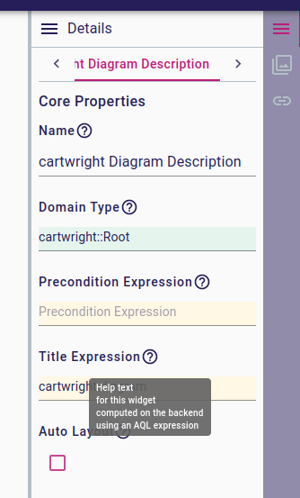

= (M) Add support for Help Expressions in Form widgets

== Problem

In the desktop version of EEF-based properties views, widgets support an optional "Help" text which is exposed as a tooltip on widgets which define one.
This is helpful to add user-oriented documentation on the property represented by the widget.
It is not currently supported in the Sirius Components' _Form_ representation.

== Key Result

All widget descriptions in the _Form_ representation (including the View-based Forms) have an optional "help expression".
If defined, the corresponding widget instances will have a visible "?" icon which, when hovered, will display the corresponding help text to the end-user.
The help content will be a plain text (no formatting).
It will be computed in the context of the semantic element of the widget so that the text can be adapted to the current state of the element.

== Solution

The overall design of the solution will follow the same approach as for completion support.

We will add a new (optional) field `Function<VariableManager, String> helpTextProvider` to the core `AbstractWidgetDescription` class and a `helpExpression : IntepretedExpression` attribute the the `WidgetDescription` _EClass_.

The value of the help expression will *not* be evaluated as part of the widget's rendering.
In the vast majority of form renders, no help text will need to be displayed for any widget.
Computing them eagerly would incur both an additional runtime cost to each render of each form _and_ a network transfer cost for text values which will never be visible.

Instead, the evaluation of a "help expression" will be done on-demand through a new GraphQL Query:

```
type FormDescription implements RepresentationDescription {
    helpText(widgetId: ID!): String
}
```

Although the actual help expression is not evaluated at render-time, we will still compute a `hasHelpText: Boolean` field for each widget.
This will be used by the frontend to know if it should display a visual hint/icon to indicate that a help text is available for the widget.

There will be no caching of the help expression's value.
Each GraphQL Query invocation will trigger the evaluation of the expression.

On the frontend, the Form representation will fetch the `hasHelpText` for all widgets, and use that to know if some help text is available on a given widget.
When help text is available, a "?" icon (`HelpOutline`) will be added to the right of the widget's label text.
If the user hovers the mouse on the icon, the frontend will issue the GraphQL Query mentioned above to retrieve the proper help text, and display it inside a tooltip.

=== Breadboarding



=== Cutting backs

None

== Rabbit holes

None

== No-gos

* Formatted text or more complex elements (with images etc.). The help text will be kept as plain, unformatted text (except for line breaks).
* A similar feature could be added to all our representations (diagram elements, tree items...), but this is out of scope for the moment.
