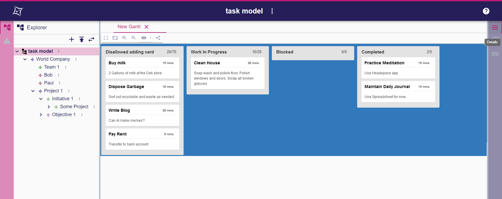

= Add the support for Deck representation

== Context

Deck is a new representation type to be added in Sirius web.
It will allow to provide three kind of representation

* Kanban
* Daily
* OKR

== Decision

For the front-end, the deck representation will rely on the https://github.com/rcdexta/react-trello/[react-trello project].

We will create dedicated concepts for describing a Deck representation.
It is called `Deck Description`. `Deck Description` concepts will be part of the `View` model.

We will provide three instances/example of `Deck Description` corresponding to Kanban, Daily et OKR. These representation descriptions will represent the `Task` meta-model.
The `Task` meta-model is a new meta-model that will also be provided.

== Specification

=== Overview of a Deck representation

A Deck representation displays vertical lanes in which there are cards.

=== General actions related to representation

Like other representations in Sirius web, the Deck representation can be created from a contextual menu on semantic objects displayed in the Explorer tree.

The representation is visible in the explorer under the semantic object it is related to.

It is possible to 

* create a representation
* open the representation in an editor
* rename the representation
* delete the representation.

=== Concepts of Deck representation

A Deck representation contains vertical `Lanes` in which there are `Cards`.
A Lane has 

* title
* label

A card has

* title
* label
* description

A Lane and Card are associated to a semantic model element(visible in the Explorer tree).

=== Toolbar actions

* *Full screen* : to make the representation editor take maximum space 
* *Fit to screen* (out of scope): the zoom level is chosen so that all Lane can be seen on the screen
* *Zoom +/-* : to zoom in and out
* *Show/Hide* Lane (with drop down menu) : it allows to choose which columns are displayed.
This information is stored in the representation.
* *Share* : it allow to copy an URL in the clipboard corresponding to the diagram

=== Actions associated to Lanes

* *Selection*: When clicking on the `Lane` the associated semantic element properties are displayed in `Details` and the semantic element is selected in the `Explorer`.
* *Drag&Drop*: If a Drag&Drop tool has been defined in the View model, it is possible to drag a Lane and drop it beside another Lane.
This action changes the order of the Lanes.
This information is stored in the representation.
* *Collapse*: If authorized, it is possible to collapse the Lane. This information is stored in the representation.
* *Edit*: If configured in the view model, it is possible to change the Title of the Lane.
* *Add a card*: If configured in the view model, it is possible to add a Card.
* *Hide Lane* (out of scope): If configured in the view model, it is possible to hide a Lane.
This information is stored in the representation.
* *Visible Cards*: If configured in the view model, it is possible to choose which cards are displayed in the Lane.
This information is stored in the representation.
* *Delete* (out of scope): If configured in the view model, it is possible to delete a Lane.
* *Add a Lane* (out of scope): If configured in the view model, it is possible to add a Card.

=== Actions associated to Cards

* *Selection*: When clicking on the `Card` the properties of the associated semantic element are displayed in `Details` and the semantic element is selected in the `Explorer`.
* *Drag&Drop*: if a Drag&Drop tool has been defined in the View model, it is possible to
** drag a Card and drop it beside another Card in the same Lane.
** drag a Card and drop it beside another Card in another Lane.
* *Edit*: If configured in the view model, a dialog is opened and allows to change the Title, Label and Description of the Card.
* *Hide*: If configured in the view model, it is possible to hide a Card. This information is stored in the representation.
* *Delete*: If configured in the view model, it is possible to delete a Card.

=== Concepts of Deck description

`DeckDescription` is a new concept in the *View model* to describe the Deck representation.
`DeckDescription` is associated to a object type in a chosen meta-model and a precondition expression to control on which object in the model the Deck can be created.

It contains `LaneDescription` which allow to define the lane.

A lane is associated to a semantic element : in this case the element is defined thanks to a semantic expression on the `LaneDescription`.
The `LaneDescription` will produce as many Lane as the number of semantic objects returned by the semantic candidates expression.
The Lane will be displayed in the order of the returned semantic element.
When a lane is selected, the associated semantic element is selected in the explorer and the semantic element properties are visible in the details view.

`CardDescription` allows to define which card will be associated to a lane.
Like `LaneDescription`, `CardDescription` owns a semantic candidates expression that returns a list of semantic elements. Each semantic element produces a Card displayed in the Lane.

`LaneDescription` and `CardDescription` own *tool descriptions* to define the possible behaviors.

* enable addition
* enable edition
* enable hide/show
* enable deletion
* drag and drop

==== Understanding the way the representation is rendered

Some tools will do modification in the representation itself such as Hide/Show Lane/Card, Expand/Collapse a Lane.

For the other tools, the change is never done directly on the representation itself.
Instead, the change is done on the semantic model through the operations associated to the tool defined in the view model and then the representation will update based on the current state of the semantic model. 
For example, when the user drag&drop a card from a lane to another, the expression should update the semantic model in a manner that at the end of the rendering the card gets displayed in the lane where it has been dropped.

=== Concepts of the Task meta-model

The deck representation is agnostic from any meta-model.
A deck representation can represent any semantic concept.
Nevertheless, in the idea of providing a ready to use functionality, we will provide a meta-model that matches the concept Deck.
This is the Task meta-model.
It is also described in the "Support Gantt representation" adr.

Let's focus here on the Task concept that will be used for Deck representation.

* `Project` contains `Objective`s and `Task`s.
* `AbstractTask` is specialized by `Objective`, `KeyResult` 
*  `Objective` contains a list of `KeyResult` which contains a list of `Task` corresponding to initiatives.
* `AbstractTask` references a list of `TaskTag` that will be used to sort tasks in different lanes for Daily and Kanban.
For example, if the Task owns the Tag "In work", the corresponding card will be displayed in the "In work" Lane in Kanban.
* `TaskTag` has `prefix` and `suffix` attributes. `TaskTag` are owned by the `Project`.

=== Deck descriptions for Kanban, Daily and OKR

We will provide three instance of `DeckDescription`.
One for each representation.
The provided `DeckDescription` instances will rely on the `Task` meta-model.

==== Kanban
 
The Kanban representation is related to a `Project`.
Each Lane will represent a `TaskTag` whose category is `kanban` and will contain as many cards that use this tag.

==== Daily
 
The Daily representation is related to a `Project`.
Each Lane will represent a `TaskTag` whose category is `daily` and will contain as many cards that use this tag.

==== OKR
 
The Daily representation is related to a `Project`.
There are three Lanes:

* One to represent the Objectives
* One to represent the KeyResults
* One to represent the Initiatives

=== Limitations

It would be interesting to have the following features:

* Define rules in the `DeckDescription` model to customize the colors of the Lane and Card (color for the progress and task parts) and style of the displayed labels for Lane and Card (font, color, bold etc)
* Define rules in the `DeckDescription` model to customize the background color.
* Have the `out of scope` tools that are described in this adr with the `out of scope` flag.
Nevertheless, for most of them, the associated behavior of this tools can be done differently:
** *Add Lane* : For Kanban and Daily, if you create a new TaskTag from the explorer with the right prefix/suffix, there will a be a new Lane.
** *Delete Lane* : For Kanban and Daily, if you delete the TaskTag of the right prefix/suffix from the explorer, the corresponding Lane will be removed.

== Status

Accepted

