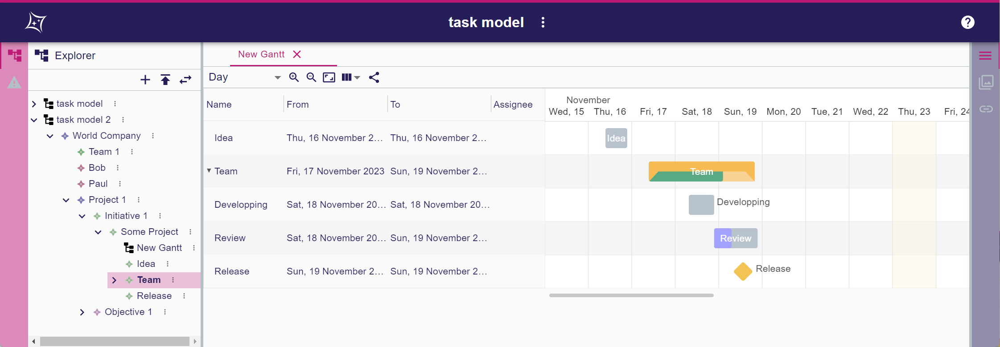
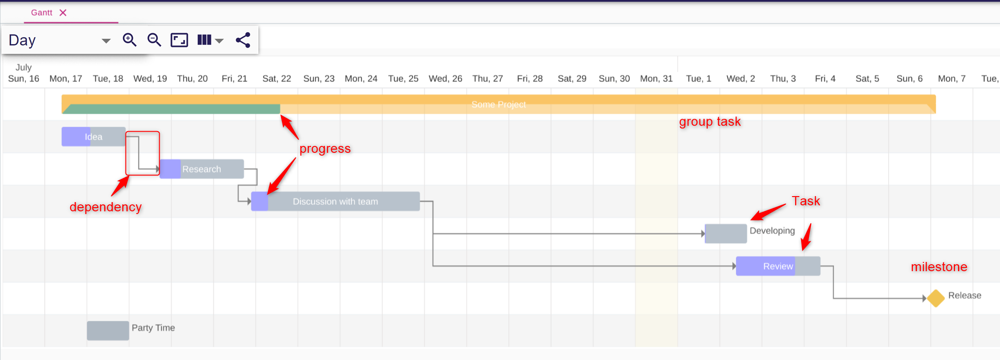
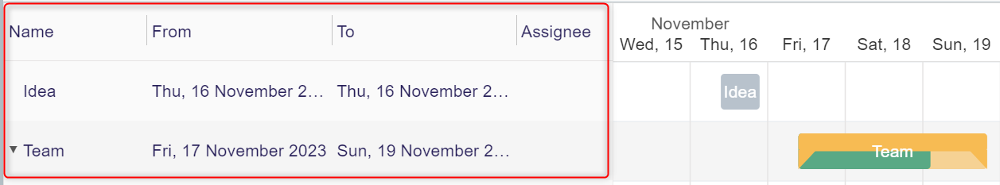
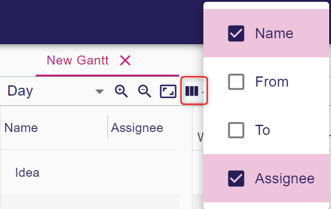
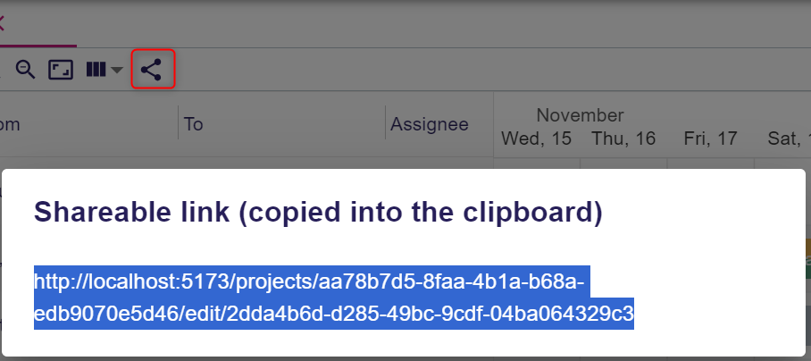
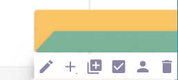
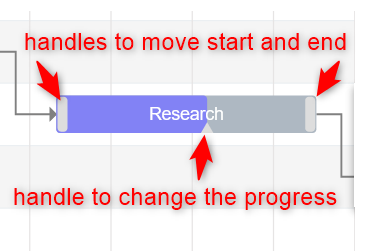
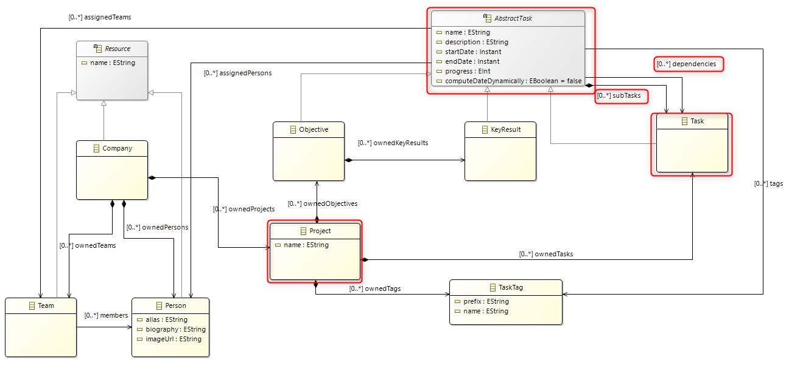

= Add the support for Gantt representation

== Context

Gantt is a new representation to be added in Sirius web

== Decision

For the front-end, the Gantt representation will rely on the https://github.com/MaTeMaTuK/gantt-task-react/[gantt-task-react project].

We will create dedicated concepts for describing a Gantt representation. It is called `Gantt Description`. `Gantt Description` concepts will be part of the `View` model.

We will create a dedicated Task meta-model.
We will provide an instance/example of `Gantt Description` that will represent the `Task` model.
The `Task` meta-model is a new meta-model that will also be provided.

== Specification

=== Overview of a Gantt representation

A Gantt representation displays tasks that are linked by dependencies.

=== General actions related to Gantt representation

Like others representations in Sirius web, the Gantt representation can be created from contextual menu on semantic object displayed in the Explorer tree.
The representation is visible in the explorer under the semantic object it is related to.

It is possible to 

* create a representation
* open the representation in an editor
* rename the representation
* delete the representation.

=== Concepts of Gantt representation

A gantt displays `Task`

* There are three kinds of `Task`
** simple task: a basic task which start and end date can be configured
** group task: a task that can contains other tasks.
The start and end dates are computed from the contained tasks or may be fixed.
** milestone: a task that have a 0 duration

A `Task` owns the following data:

* Name
* Description
* Start date
* End date
* Progress
* Assignee

A task can depend on one or more another tasks.
A dependency is always from the end of a task to the begining of the dependent task (no start-start, start-end, end-end).
A task has a progress (0 to 100%)

A task is associated to a semantic model element(visible in the Explorer tree).

=== Display 

The tasks are displayed in a grid which time unit is changeable.
See Zoom level in next chapter.

The tasks are displayed on one line as a rectangle containing the name of the Task.
The name is displayed beside the task if it is too long.
There is one color for the task itself and one color corresponding to the progress.
The dependency relation is represented by an oriented arrow.

The current date is displayed with a special color (light yellow in the example)

Colums are displayed on the left to display information about tasks
* Name
* Start date
* End date
* Assignee

A *tooltip* pops up when hovering a task.
It displays

* Name
* Start and end dates
* Duration
* Progress
* Description
* Assignee

=== Toolbar actions

* Full screen : it changes the editor size to take the maximum size
* Zoom level : it is possible to select the zoom level
* Zoom +/- : to zoom in and out
* Fit to screen : the zoom level is chosen so that all tasks can be seen on the screen
* Columns : clicking on it will hide all the columns.
Clicking on drop dow menu will allow to choose the displayed columns

* Share : it allow to copy an URL in the clipboard corresponding to the diagram

=== Actions related to task

* *Selection*: When clicking on a task in the Explorer or in the Gantt, the Task is considered as selected. The `Details` view is notified and the properties of the semantic element associated to the task are displayed.
* *Collapse/expand*: It is possible to expand/collapse a group task by clicking on the rectangle icon beside the group task or by double clicking on the group task.
When expanded, the task contained in the group task are displayed. By default, all the group task are expanded.
This collapse/expand status is stored in the representation.
* *Drag&Drop* (out of scope): if a Drag&Drop tool has been defined in the View model, it is possible to
** drag a Task and drop it beside another Task.
** drag a Task and drop it inside another Card.

The following actions are available in a palette that is displayed when the user click on the task.

Any of the following actions must be configured in the view model. Otherwise, the action is not available.

* *Edit* (out of scope): A dialog is opened and displays the attributes of the Task 
* *Create* : It is possible to create a new Task.
* *Duplicate* (out of scope): see other tools
* *Complete* (out of scope): Set progress to 100%. see other tools
* *Assign* (out of scope): If configured in the view model,
* *Delete*: It allows to delete the task.
* *Custom tool* (out of scope): It is possible to define other tools contextual to the selected Task.

It is also possible to change the start date, end date and progress with the mouse using the handles on the selected task.

=== Actions related to dependency

* *Selection*: When clicking on a dependency arrow, the Task that is dependent is selected.
The `Details` view is notified and the properties of the semantic element associated to the task are displayed.
* *Delete*: Displayed in contextual palette. 

=== Concepts of Gantt description

`GanttDescription` is a new concept in the *View model* to describe the Gantt representation.
`GanttDescription` is associated to a object type in a chosen meta-model and a precondition expression to control on which object in the model the Gantt can be created.

It contains `TaskDescription` which allow to define the tasks displayed in the Gantt.
`TaskDescription` contains sub `TaskDescription` which allow to define the tasks displayed in each Task.
`TaskDescription` may also reused a `TaskDescription` to allow recursivity(and avoid creating as many `TaskDescription` in `TaskDescription` as Task tree maximum depth).

`TaskDescription` owns many expression to describe the Task.

* Name expression
* Description expression
* etc (see the `Task` concept)
* Dependencies expression

`TaskDescription` owns *tool description* to define the possible behaviors on task. All the tools own a list of operations that describe what is done during tool execution.
The id of the semantic element of the selected task is provided as variables for operation.

* *Creation*
* *Assign* (out of scope)
* *Delete*
* *Drag&Drop* (out of scope)
* *Custom Tool* (out of scope): This tool has also a label and an icon (to display as tooltip and icon in the contextual palette)

`TaskDescription` also owns *tool description* for dependency.

* Deletion 

==== Understanding the way the representation is rendered

Some tools will do modification in the representation itself such as Expand/Collapse on group task.

For the other tools, the change is never done directly on the representation iteself.
Instead, the change is done on the semantic model through the operations associated to the tool defined in the view model and then the representation will update based on the current state of the semantic model and the definition of the tools.

For example, when the user delete a task, the tools operations should update the semantic model in a manner that at the end of the rendering the task remove from the Gantt representation.
Typically , the operation will delete the associated semantic element. But we could perfectly imagine that the delete tool deletes a bunch of other semantic elements according to business rules.

=== Concepts of the Task meta-model

The gantt represention is agnostic from any meta-model. A gantt representation can represent any business concept.
Nevertheless, in the idea of providing a ready to use fonctionality, we will provide a meta-model that matches the concept Gantt.
This is the Task meta-model.

* `Project` contains `Task`s
* `Task` contains subTasks and dependencies(of type Task)
* `AbstractTask` owned the attributes that are used for Gantt such as name, description, startDate, endDate, progress etc..

=== The provided example of Gantt description 

We will provide an instance of `GanttDescription`.
The provided `GanttDescription` example will rely on the `Task` meta-model.

The Task meta-model maps perfectly the Gantt concepts.
So the `GanttDescription` definition is pretty straight forward.

The Gantt representation is related to a `Project`.
Each gantt task represent a `Task`.
The gantt task attributes are the same as the `Task`.

=== Limitations

It would be interesting to have the following features:

* Have *start and end handles* when selecting a dependency.
Then moving an handle from a task to another would allow to create or change the dependency.
* Define rules in the `GanttDescription` model to customize the colors of the task (color for the progress and task parts) and style of the displayed label (font, color, bold etc)
* Have the `out of scope` tools that are described in this adr with the `out of scope` flag.
Nevertheless, for most of them, the associated behavior of this tools can be done differently:
** *Drag&Drop* : In the Explorer, select the parent of the task to reorder and change its owned tasks order in the Details view.
** *Edit* : Select the task and change the information of the associated semantic element in the Details view
** *Duplicate* : The behavior is similar to create.
** *Complete* : Set progress to 100% with the handle ot change the progress value in the Details view.
** *Assign* : Select the task either in Gantt or Explorer and change the assigned people in the Details view.
* Have *customizable columns*. The columns displayed in left part of Gantt are not customizable.
We could image to define, in the `GanttDescription` model, the columns giving a name and an expression to display the table content.
We could also have dedicated style for columns.
* Allow to *customize which zoom levels* (hour, ..., month) are proposed to the end user.
* Define the time units that will not be displayed.
For example, we could image to define that, when the zoom level is day, only working days are displayed.

== Status

Accepted

