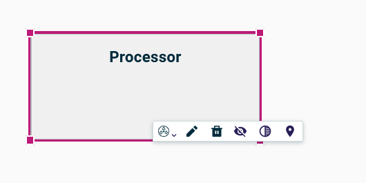
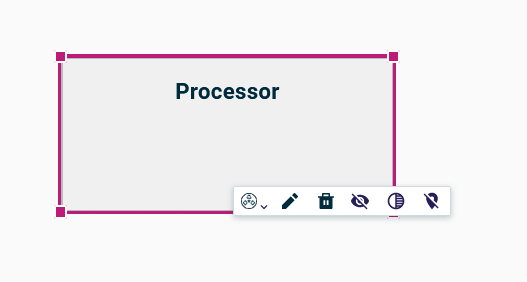

= (M) Pin unpin nodes

== Problem

There is no possibility to declare that node has a fixed position, to conserve its relative position in every case.

== Key Result

A user should be able to pin / unpin each node in a diagram to authorize or not that this node can be moved.

== Solution

Add a new tool on the diagram element palette to pin / unpin an node.

When a node is pinned, all its move actions are disabled.

There is a new button on the diagram palette to unpin all elements.

== Rabbit holes

* Only nodes can be pinned.
* A pinned node can be resized.
* A node pinned cannot be moved directly, but if its parent is not pinned, its absolute position can be changed if its parent moves.
But its relative position to its parent stays fixed.
* There is no decorator on a pinned node.
