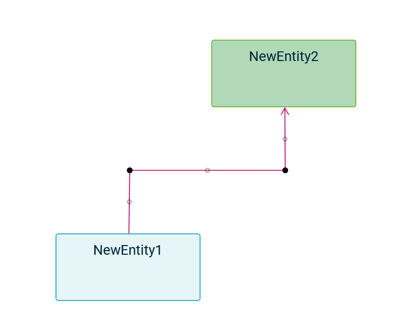
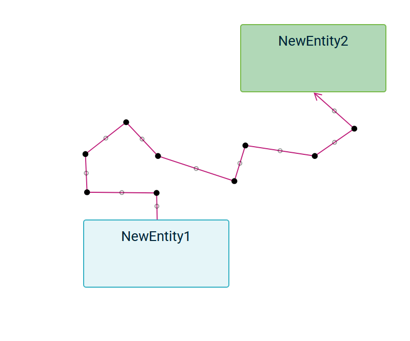

= (M) Add custom bending points to edges

== Problem

Currently, there are two types of edge-path, if the resulting path doesn't satisfy the user, he has no way of drawing his own path.

== Key Result

Users should be able to draw their own path.

== Solution

Add some bending points to edges that user can move freely.
He must also be able to add or remove them as he wants.
Draw the edge path using these bending points.

By default, the path of edges continues to be calculated using existing methods.
And bend points are automatically added to the curve of the existing path.

Once a user starts using some bending points, then we use these points to draw the path.

To delete a bending point, the user has to double-click on it.

To create a new bend point, we will add temporary points (at the middle of concret bend points).
If it's moved, then it becomes a real bend point and the path is redrawn to use it.

=== Breadboarding

* Default edge-path with bend points ready to be used:

* Complex edge-path with few bend points:

=== Cutting backs

Draw the path simultaneously as the user moves a bending point.

== Rabbit holes

== No-gos

Add some intelligence regarding the position of points, such as merging them if they are aligned.
