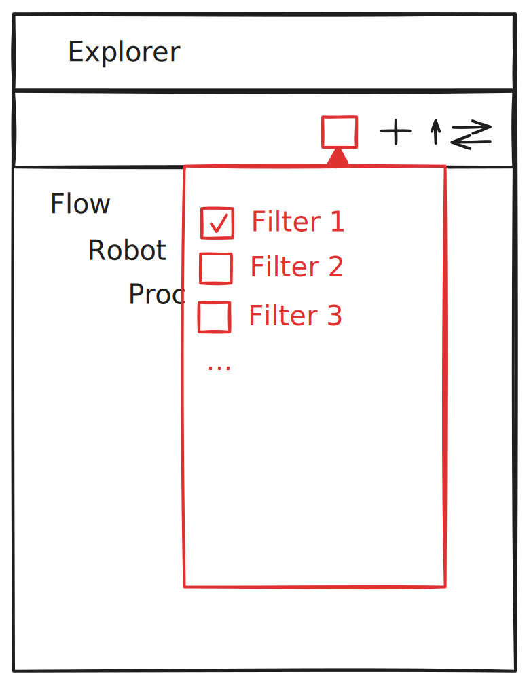

= Add filters on Explorer view

== Problem

In Sirius Web, the Explorer view displays tree containing data.
These data comes from the backend where specifier have total control.
But, once displayed in the Explorer view, end-users cannot (graphically) modify the tree.

== Key Result

End-users have the possibility to hide objects contained in trees (i.e. a tree here means a root object in the Explorer View and all its children) in the Explorer view.

== Solution

Filters action should be available in the Explorer view toolbar, allowing to hide objects contained the trees in the Explorer view.
The filters action is a menu, containing a list of filters.
A filter menu item is a checkbox associated to a label.
When the checkbox is enabled, the filter is enabled on all objects in the Explorer view.
When the checkbox is disabled, the filter is disabled on all objects in the Explorer view.

== Scenario

Specifiers want to let end users filter elements using some predefined filters.
The filter could lead to hide an element and all its children, recursively, or not.
Depending on the filter, an element could be hidden, but not its children.

Specifiers will be able to contribute filters programmatically and alter the tree created when a filter is active.

=== Breadboarding

The filters action in the Explorer view could look like this:

== Cutting backs

Nothing will be done to adapt the selection synchronization with the filters.
If an element is hidden in the Explorer view because a filter hide it, then if the same element is selected in a diagram, then it will not be revealed/displayed in the Explorer view.
Note that this is the current behavior, It is just a reminder.
You can already observe it by using the filter bar in the Explorer view.

== Rabbit holes

Nothing identified for now

== No-gos

Nothing identified for now
