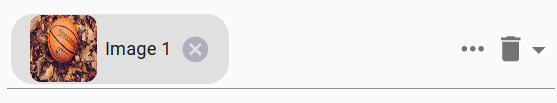
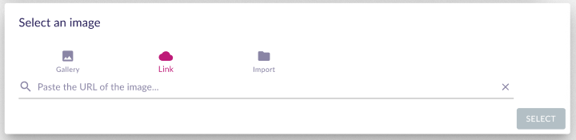
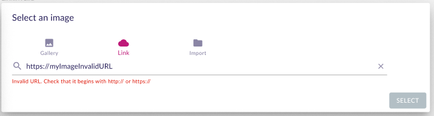
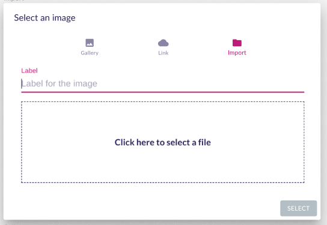

= Add support for a browse / upload images widget

== Problem

Up until today, there is no specific widget to manage images.
We use a selection widget that only displays image label and does not show any preview.
It's not possible to add new images either.
The only available images are the one programmatically loaded on the backend.

== Key Result

Have a single widget for both selecting an image (with an integrated preview) and contributing new images, either from a web link or from the local disk.

== Solution

Create a new core widget in Sirius Components.

This new widget will provide the same level of configuration as its EEF equivalent:

* _Label Expression_
* _Help Expression_
* _Is Enabled Expression_

* _AddImageOperation_ with a _body_ to specify the action to apply once an image is selected.
* _RemoveImageOperation_ with a _body_ to specify the action to apply once an image is deleted.
* _style_ (with its corresponding _conditionalStyles_) to configure the label

This new widget will be based on the UI of the reference widget, using the MUI autocomplete component.

* The selected images will be displayed in _chips_ with preview and label.
It must be possible to delete a selected image directly from its _chips_.
* The options will be populated by images marked as favourite (or recent or all depending on the cutting back).
* A trash can icon will delete the current selection.
* The image selection dialog will open using `...` button.

=== Image selection dialog

This dialog will have three menus: _Gallery_, _Link_ and _Import_.
The default open menu is _Gallery_.

A _Select_ button is always displayed at the bottom right of the dialog.

Upon selecting, the image will be uploaded on the server (case _import_ and _link_), and the widget body must be called with the selected image.
A new image uploaded must be linked to the current project (see existing mutation _uploadImage_)

==== Gallery

The gallery shows a thumbnail of the images already on the server linked to the current project (see existing query _projectCustomImages_).
For each image, displays the preview, the label and a "like" button to add or remove the image to the favorite ones.

* There is a filter bar to search image everywhere in the gallery from the image label.
* There are three submenus to organize the gallery :
** `Recents` only show the last added images
** `Favorites` only show the "liked" images
** `All` show all the images

_Select_ button must be enabled only if an image is selected.

==== Link

The link menu shows a textfield to type the image url.

* If the url is valid, add a textfield to type the image label and the image preview.

image:images/widget_images/widget_images_link_2.png[Image link, valid URL]

* If the url is not a valid image, show an error message.

_Select_ button must be enabled only if the url is a valid image and the label is not empty.

==== Import

The import menu shows a textfield to type the image label and a _select file_ area.
_Select_ button must be enabled only if a document is uploaded, and the label is not empty.

For this component, reuse the one available in the _project images_ page (/projects/+{projectId}+/settings).

== Rabbit holes

* There is no UI to remove an image from the server.
* An example of this widget could be added in sirius-web to `NodeStylePropertiesConfigurer` by replacing the existing select widget for `ImageNodeStyle` properties page.
* This image widget is not a custom widget.

== Cutting backs

If deadlines are not respected, the following feature can be removed:

* All the favourite's support
* The gallery submenus (only display in the gallery the available images without any filter)
* The link menu

== No-gos

