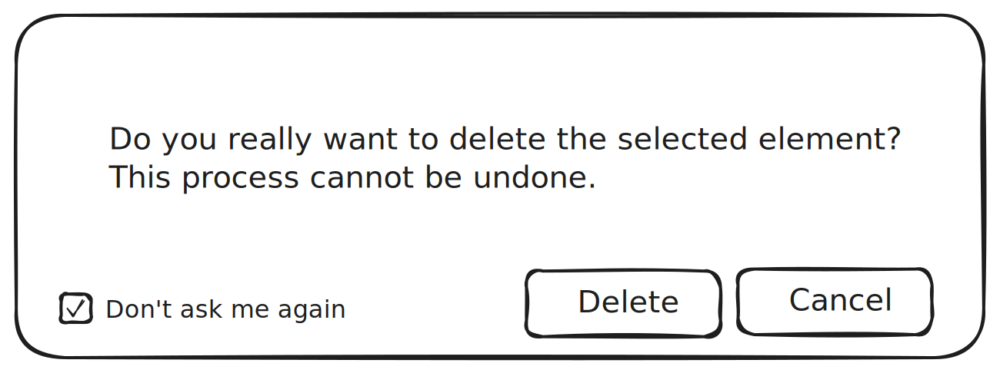

= Confirmation dialog on delete

== Problem

Sirius Web does not have an undo/redo mechanism.
When an element has been deleted, either from the Explorer view, from any representation, or any other view, there is no way to retrieve it.
All delete actions are executable in one click.
Any accidental click on a delete action can lead to the unwanted loss of data.

== Key Result

No delete action should be done in one click.

== Solution

A confirmation dialog should be displayed when a delete action (click on the delete tool on a node, click on DEL key on a node, click on the delete menu item on an object in the Explorer view) has been called.
This dialog should avoid or drastically minimized unwanted loss of data.
This dialog should have the possibility to be disabled.

A possible enhancement could be to get a more detailed message such as: `You should be able also to see the consequences of the deletion (x elements will be deleted). Are your sure?`.

=== Diagram tools

To go further on the subject, the confirmation dialog mechanism could be extended to any tool in diagrams, not only the delete tool.
Thus, a specifier could enable/disable a confirmation dialog on the execution of its tools.
On a tool description, the specifier could enable the confirmation dialog and set a message expression and a button label expression (i.e. AQL expressions), allowing to call the confirmation dialog when the tool is executed by end-users.

== Scenario

=== Breadboarding

The confirmation dialog could look like this:

A click outside the confirmation dialog will cancel the deletion.
The Checkbox "Don't ask me again" will allow to disable the confirmation dialog.

For the specific case of diagrams tools, the confirmation dialog will be the same, adapted with the message and button label set by the specifier.

=== Cutting backs

The specific case of diagram tools could be done in a second step.
The enhanced message could be done in a second step.

== Rabbit holes

Nothing identified for now

== No-gos

Nothing identified for now
