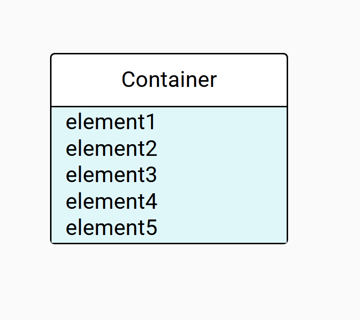
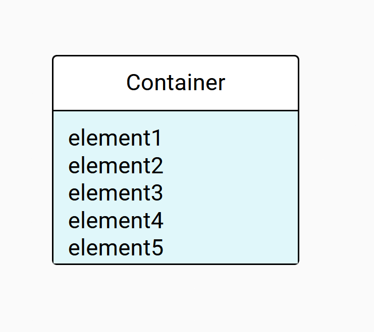
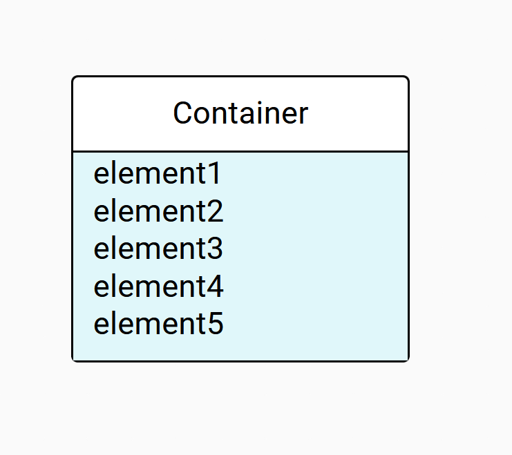

= Facilitate the insertion of elements into a list node

== Problem

Until now, the layout for lists arranges elements one after the other.
If there are more elements than the default size allows it, the container height increases to match all the sub-elements layout.
But in this case, there's no empty space to either be the target of a DnD or to easily open the container's pallet.

== Key Result

A specifier must be able to add an empty space to a container at top or bottom.

== Solution

Add to the view DSL, two new attributes to `ListLayoutStrategyDescription`:

* topGapExpression
* bottomGapExpression

These expressions once correctly interpreted correspond to the free space in pixel at the top or bottom of the container.
If left empty, no space is applied.

== Scenario

* A specifier adds a _NodeDescription_ with a _ListLayoutStrategyDescription_.
* _Top Gap Expression_ and _Bottom Gap Expression_ are available and blank by default.
* The specifier can define an aql expression or a number to add an equivalent free space in pixels.
* When an end user uses a node represented in this manner in a diagram, whatever the number of elements added to the node, there is always free space, as defined by the specifier.
This is to easily access the node's palette or perform DnD to the node.

=== Breadboarding

* Node with _ListLayoutStrategy_ full without gaps defined.

* Node with _ListLayoutStrategy_ with a top gap defined.

* Node with _ListLayoutStrategy_ with a bottom gap defined.

== Rabbit holes

* If defined, free spaces are always added to the node, so it can change its default size.
* For a single node, a top and a bottom gap can be defined.

== No-gos

