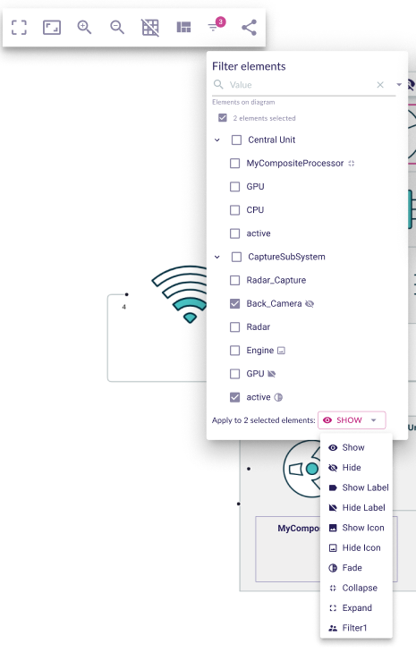
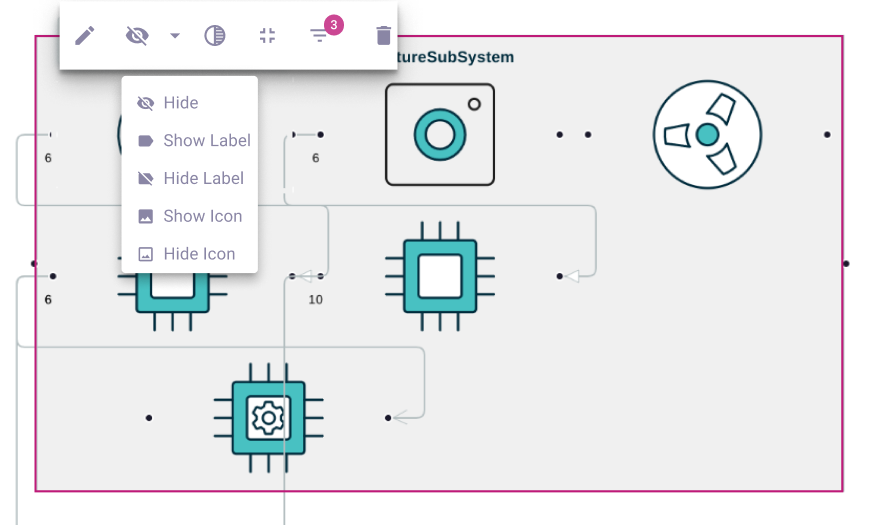

= Filter elements on a diagram

== Problem

* An user can trigger tools from the node and edge palette to hide, fade or collapse these elements.
* The user might want to hide only the labels or the icons labels when on a diagram.
* The user might want to change the details of the appearance or see the current appearance of several elements at once without clicking on each element.

== Key Result

* An user can change the appearance of several elements at once.
* An user can hide only the label or the icon label of an element.

== Solution

* Add a new filter modal, accessible from the diagram panel or the palette of an element that will display the structure of the diagram as a tree or the structure of the selected element.
* This modal will be a representation and be synchronized with changes that happen on the diagram.
* From this UI, it will be possible to see the appearance (collapse, faded, hidden, icon label hidden, label hidden) from all elements and change it.
* From this UI, it will be possible to filter elements by appearance or name.
* From the diagram panel, the number of elements that have not a default appearance is shown on the button used to open the modal.
* From the element palette, the number of sub elements that have not a default appearance is shown on the button used to open the modal.
* Add the tools to the diagram elements palette to set the newly added appearance (icon label hidden, label hidden) and regroup these tools with the existing one in a tool section.

== Scenario : hide all label from a diagram

* An end user open the filter modal from the diagram panel
* He select all elements
* He set the button to Hide label and click on it.

== Scenario : hide all icon label of elements inside a node

* An end user open the filter modal from the parent node palette
* He select all elements
* He set the button to Hide icon label and click on it.

=== Breadboarding

* Modal accessible from the panel

* Palette with new tool in the tool section Hide/Fade and a button to open the modal

== Rabbit holes

* The same semantic element if present multiple times on a diagram can have differents appearance

== No-gos

