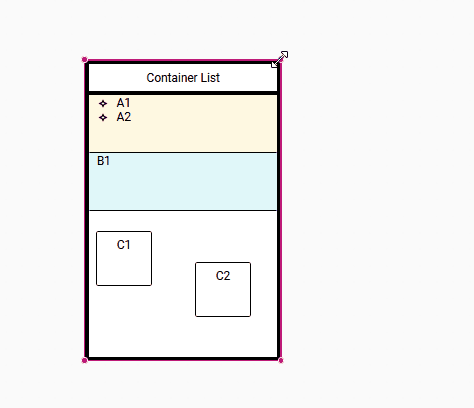
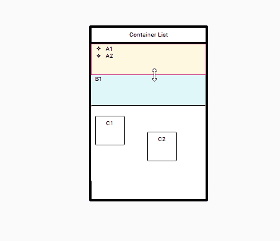
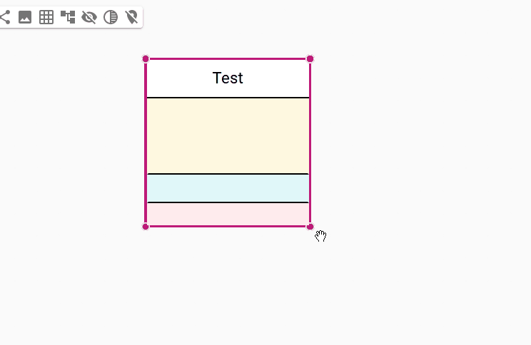
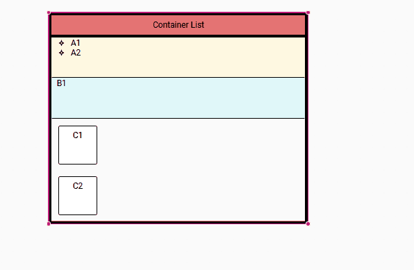

= Improves resizing support for list nodes

== Problem

Until now, when a user resizes a list node, it is not functional.
Only the container rendering is displayed during the resize action, the sub-container being stretched during the next layout.
And it's not possible to reduce the size of the container (blocked by the size of the sub-elements).
Sub-container can be resized in any direction, though it is up to the container to guarantee the width.
Moreover, the children scaling policy if the parent is vertically resized is not explicit.

== Key Result

* When a container is resized, its sub-container must retain the horizontal rendering during the entire action.
* Sub-container must be resizable vertically only.
* Specifier can control each children vertical behavior (static or stretch)

* The goal for the layout is to behave in the same way as with the following CSS styles :

[source,javascript]
----
const FlexboxListNode = ({
  displayLabel,
  width,
  height,
  backgroundColor,
  border,
  flexGrow,
  children,
}) => {
  return (
    

      {displayLabel && (
        

          Container List
        

      )}
      

        {children}
      

    

  );
};
----

== Solution

* When a resize event for a list node is triggered, create corresponding event to resize sub-elements.
* Change sub-container node resizer to only allow vertical resize.
* Add in the view DSL a new reference in the `ListLayoutStrategy` named _growableNodes_, it lists the sub-node that can be resized to fill the list container.

== Scenario

* Container resizing:

* Sub-container resizing:

* Example of a list container with three sub-containers, only the first one is declared as growable:

== Rabbit holes

* If a sub-container is manually resized, the layout does not change is size anymore.
* If a container is resized smaller than what its sub-elements dictate, it returns to the smallest calculated size.

== No-gos

