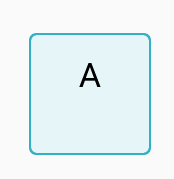
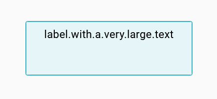
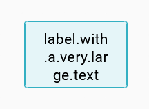
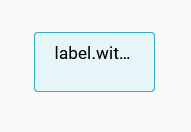

= Overflow label strategy

== Problem

In the existing node layouts, the inside label of a node will always be used to determine the minimum size.
This means that in the case of a long label, the node will necessarily take a size that allows the label to be displayed without any modification.
In some cases, specifier doesn't want that the label affects the node representation.

== Key Result

Allow the specifier to define a label that applies an auto wrap rather than enlarging the node.
A label should be broken at any point if there are no otherwise-acceptable break points (like a long word or URL).

== Solution

Add to the view DSL, for inside label:

* _overflowStrategy_: none, wrap or ellipsis

There are two options for dealing with overflow situations, wrap text or display an ellipsis.
With the _overflowStrategy_ _none_ option, the node expands to contain the entire label on one line.

* For the _wrap_ option, the following CSS will be applied:
[source,javascript]
----
 style={{
        overflowWrap: "break-word",
      }}
----
* For the _ellipsis_ option, the following CSS will be applied:
[source,javascript]
----
style={{
      whiteSpace: "nowrap",
      overflow: "hidden",
      textOverflow: "ellipsis",
    }}
----

== Scenario

A node with a width, this size can either be defined by its _defaultWidthExpression_, a manual resize or its children footprint.

* If the label is smaller than the node width, then the label is displayed without transformation:
+

+
* If the label is larger than the node width, then for the node _overflowStrategy_
+
** _none_ option: the node expands to contain the entire label.
+

+
** _wrap_ option: the node is horizontally expended to its default size, the label may be wrap on multiple lines.
+

+
** _ellipsis_ option: the node is expended to its default size, and an ellipsis is added on the label.
+

== Rabbit holes

* With the wrapping strategy, there is no way to specify the label height.
If the node is too small, the label may exceed vertically.

== No-gos

