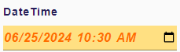
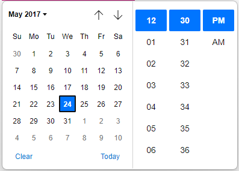

= Add support for date time widget

== Problem

Sirius need a widget to display a date and a time

== Key Result

Specifier must be able to define a widget of type dateTime in the view model and also in the Form Description Editor.

== Solution

A new `DateTime` form widget will be created.
It will be compliant to any generic behavior of a form widget.

=== Breadboarding

=== Scenario

==== Scenario : define a DateTimeWidget

As a specifier

* Create a View model
* Create a `FormDescription` with a Page and a Group
* Add a `DateTime` widget in the group
* Add a  `Style`
* Add a `ConditionalStyle`

==== Scenario : define a DateTimeWidget using the form editor

As a specifier

* Create a View model
* Create a `FormDescription` with a Page and a Group
* Create a new `FormDescriptionEditor` representation on the `FormRepresentationDescription`
* Form the left part of the editor, drag the DateTime widget and drop it in a group widget area.

==== Scenario : use the DateTime widget

As a user

* Assuming a DateTime widget is configured in a `FormDescription` 
* Click on the calendar icon
* Select a Date and a Time

=== Detailed specification

It is possible to display the widget in two modes
* with the Date and the Time
* with the Date only
* with the Time only

This is configured by the specifier on the `DateTimeDescription`.

==== Styles

It is possible to customize the style of the widget.
* italic
* bold
* background color
* foreground color

This is configured by the specifier on the `DateTimeDescriptionStyle`.

It is also possible to add one or more conditional styles.

==== Input and ouput

The widget can take, *as input*, any string that is suitable for the constructor of java script `Date`.
For example `2024-04-15T10:30:00Z` or `2024-04-15`.
The time is displayed with the local detected by the navigator.

When the widget is modified, the mutation will send a date/time with the UTC format:
`[YYYY]-[MM]-[DD]T[hh]:[mm]:[ss]Z`

For example, if the widget is used to display a time(hour and minute) then the expected input string will contain a dummy date. Only hour and minute of the string will be used. 

=== Cutting backs

None

== Rabbit holes

None

== No-gos

N.A.