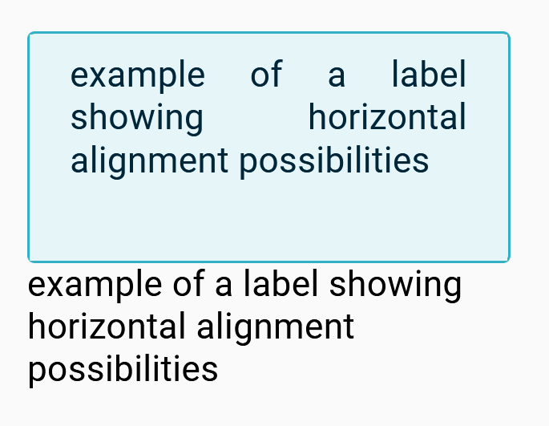

= Add support for text alignment on labels

== Problem

Horizontal alignment of the inside or outside label is hard-coded to center.

== Key Result

Specifier must be able to define the horizontal alignment for all its node labels.

== Solution

View DSL now includes a new property for _insideLabel_ and _outsideLabel_ named _Text Align_.
It will have four possible values: _LEFT_, _RIGHT_, _CENTER_ or _JUSTIFY_.
Horizontal text alignment will be based on the CSS property text-align.

=== Breadboarding

Example with an insideLabel with the value _JUSTIFY_ and an outsideLabel with the value _LEFT_:

== Cutting backs

== Rabbit holes

== No-gos
