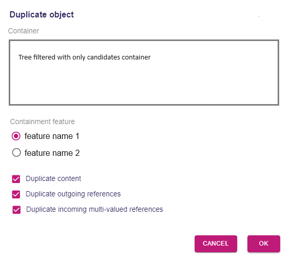

= Add support for object duplication from Explorer

== Problem

Currently, it is not possible to duplicate an object from the Explorer.

== Key Result

The user can duplicate a semantic object with contextual menu on tree items in the explorer.
The user can choose 
* the target container where the duplicated object will be added
* the target containment feature 
* options to define how is duplicated the content of the duplicated object 

== Solution

In the `Explorer` tree, a contextual menu entry named `Duplicate` is added on tree item representing a semantic object.
It will be available on tree items with the kind `siriusComponents://semantic?xxx`

The aim of `Duplicate` is to duplicate the selected semantic object into a selected container given some options.

When clicking on `Duplicate`, it opens a dialog which allows the user to choose how the duplication will be done.

* `Container` part allows to define the container of the duplicated object.
It presents a tree that is filtered so that only valid target containers are displayed.
A valid target container is an object that owns *at least one containment feature* that can contain the object about to be duplicated.
This feature must be either *multi-valued* or *mono-valued but not set* with a non-null value.
By default the container of the object to duplicate is selected.
* `Containement feature` displayed the name of the candidate containment features as radio buttons. The list of radio buttons is contextual to the container selection.
* `Duplicate content` allows to duplicate also the direct and indirect content of the object to duplicate.
* `Duplicate outgoing references` allows to set the non containment references of the duplicated object as the object to duplicate.
* `Duplicate incoming multi-valued references`: the object to duplicate may be referenced by other objects. If this option is checked, the other objects will be updated by added the duplciated object into the other object multi-valued references.

Note that the object to duplicate is duplicated in its current state *at the time the duplicate mutation is executed* and not at the time the `Duplicated` dialog is opened.
Considering the time between the moment the user clicks ok and the moment the mutation is performed, the state of the object to duplicate may have changed or the object to duplicate or the container may have been removed.
In the latter case, the duplication will fail with a user message.

=== Scenario

1. User duplicated a simple object in a model
- Assuming there is a model containing a root with some contained objects
- Select the root object and click `Duplicate`
- *Expected*: the model is selected as `Container`
- Uncheck all and click OK
- *Expected*: The Root is duplicated without its content.
The attributes are the same.

2. User duplicates a complex object
- Create a Studio(that should contain a domain example)
- Create another root object `Root2`
- Make Entity1 inherit from Entity2
- Select the `Entity1` object and click `Duplicate`
- *Expected*: `Root` is selected as `Container`
- Select `Root2` as container
- Check all and click OK
- *Expected*: `Entity1` is duplicated into `Root2` with all its content.
Duplicated `Entity1` has `Entity2` as super type.
The attributes are the same.

=== Cutting backs

`Duplicate` action is visible only for a single selection.

Representations and model duplication is out of scope.

== Rabbit holes

Nothing identified

== No-gos

Nothing identified