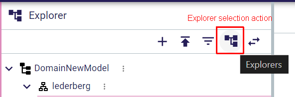
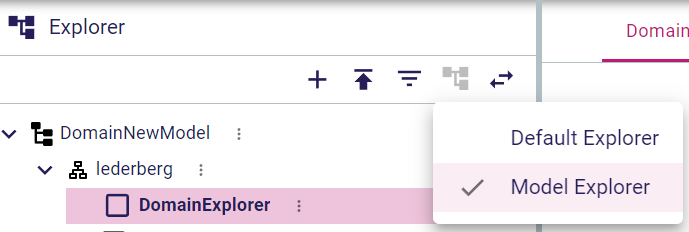

= Extend the explorer to support multiple presentations

== Problem

At the moment, it is impossible to modify the Explorer's presentation (hard-coded) or specify alternative ones to show the model content differently.

== Key Result

The way the model is presented in the Explorer view is no longer limited to the default one (hard-coded) and the user can choose among several alternatives.

== Solution

A new action icon is added to the Explorer toolbar to be able to change the way the tree is presenting model elements.

=== Scenario

Whenever the user clicks on the Explorer selection icon, the Explorer selection menu is open.
This menu presents all explorers' definitions available sent back from the backend.

One and only one menu entry must be marked with a check to notify that this explorer is currently in use.
Selecting a menu entry should replace the current content of the view with the content associated with the chosen Explorer.
The new Explorer should be marked as the current one in the selection menu.

=== Breadboarding

A new action icon is added to the Explorer toolbar:

Here is an example of the selection menu with the default (existing) explorer and another one.
At this moment, the content of the Explorer view is using the `Model Explorer` description.

== Rabbit holes

Currently, there are several assumptions based on the fact that there is only one TreeDescription defined as an explorer. Having multiple descriptions for several explorers will certainly break some existing code. 
The way to manage the selected TreeDescription used by the Explorer view in the backend is not clear at the moment.

