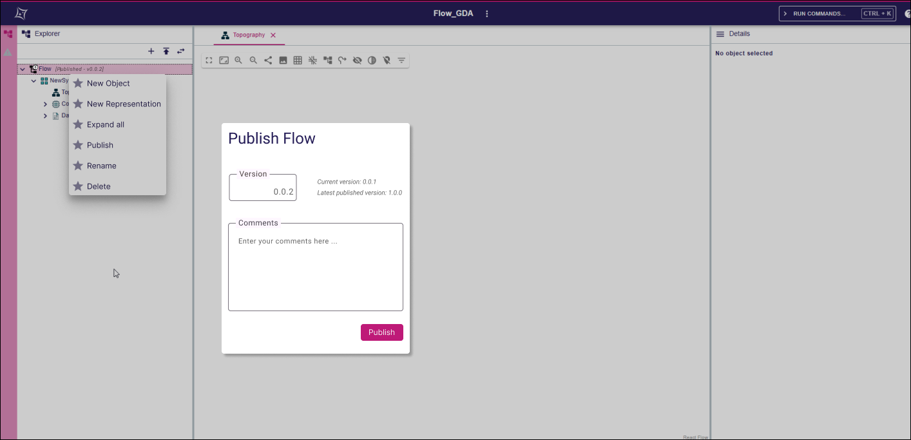
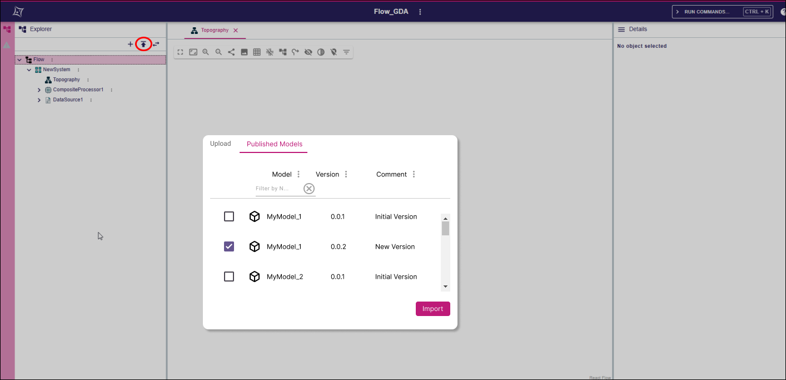
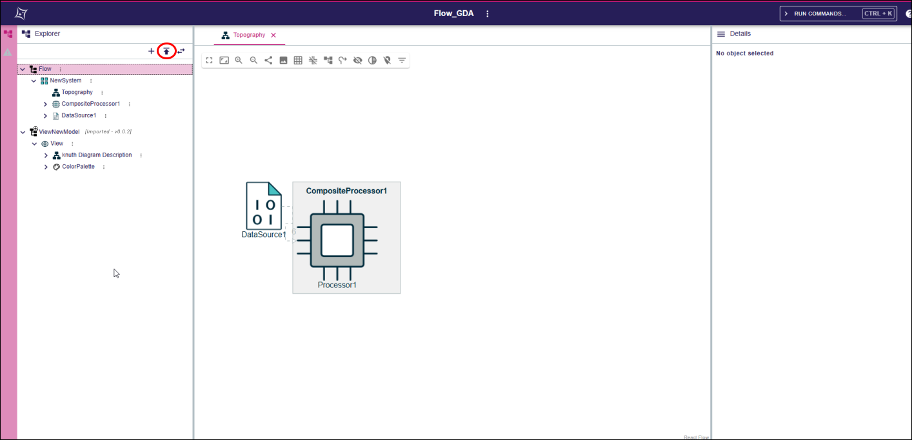

= Add support for model publication

== Problem

Sirius Web doesn't provide an **in-application** way to import models from other projects.
The current import/export mechanisms rely on generating an interchange format file (Json, XMI, SysML), and uploading such file in a project to import it.

When exported models are used as shared reusable components, it is the responsibility of the stakeholders to:

- Store the shared models in an external location
- Ensure that every user is working on the same version of the shared model
- Coordinate to export a new version when needed, and import it in all the dependent projects

These processes are error-prone, and could be more controlled if they all happened inside the application.

== Key Result

Sirius Web users should be able to:

- Publish a model with a given version number
- Import a published with a given version number

== Solution

The contextual menu of _Model_ elements in the explorer contains a new _Publish_ tool.
This tool opens a pop-up that asks the user for a version number and comments.

**Note**: Sirius Web will not allow to publish a model with the a version number that matches an already published version of the model. 
User will have to update the version of the model if they want to re-publish it.

The _Upload model_ tool in the explorer is renamed to _Import model_, and the associated popup contains 2 tabs:
- The _Upload_ tab that performs the same action as it does now (upload an external file as a model)
- The _Published Models_ tab presents a list of published models (with their version number) the user can select to import in their project.

=== Scenario

1. User publishes a model
- The user creates a new project
- The user adds element to a model in the project
- The user clicks on the contextual menu of the model and select the _Publish_ tool
- The user fills requested information in the popup (version number, comment, etc) and presses _Publish_
- A message is displayed indicating that the publication was successful

2. User imports a published model
- The user creates a new project
- The user clicks on the _Import Model_ tool in the explorer toolbar
- The user selects the _Published Models_ tab in the popup
- The published models are displayed in the tab, with their version number
- The user selects a published model and presses _Import_
- The model is imported at the root of the project

=== Breadboarding

Publish model action in the _Model_ contextual menu and _Publish_ popup.

Import model popup, displayed when clicking on the _Import Model_ tool in the explorer toolbar. 
The _Upload_ tab corresponds to the current _Upload_ popup in Sirius Web.

Imported model in the explorer.
The explorer can either display an icon overlay to indicate the model has been imported, and/or a custom label indicating the version of the imported model.

=== Cutting backs

Nothing identified.

== Rabbit holes

Nothing identified.

== No-gos

This shape doesn't address the issue of upgrading/downgrading and imported model with a new version.
In the proposed solution, importing two different versions of the same model will create two models in the project (one for each version). 
This behavior matches the current behavior of Sirius Web when importing the same external file two times.