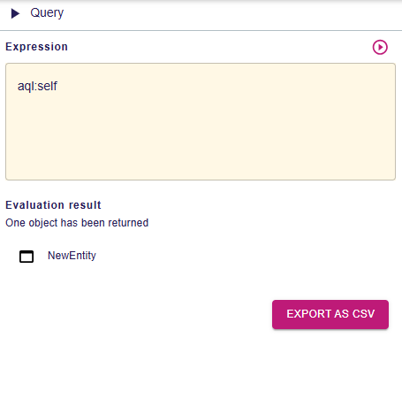

= Add support for exporting query result

== Problem

Users can't export the result of a query from the query view.

== Key Result

- A button should be available on the query view to export the result
- An implementation to export results as CSV is provided, the CSV file should contain the following information
* ID of the element
* Type of the element
* Label of the element (if any)
- When pressed, a file containing the result should be automatically downloaded by the user's browser
- The button should not be visible if the _evaluation result_ view is empty or if it does not contain objects

=== Acceptance Criteria

- A Cypress test should leverage the new functionality and validate the whole user experience.
- Backend integration tests should also be available to ensure that the core parts of the behavior are working as expected.

== Solution

=== Scenario

=== Evaluate a query that returns a result and export the result

- The user opens the `query` view, the export button is not visible.
- The user inputs a query and executes it, the evaluation result view displays elements and the export button is visible and enabled.
- The user selects an option from the export button (e.g. "Export as CSV")
- A CSV file is downloaded by the user's browser, containing the result of the evaluation.

=== Evaluate a query that does not return a result

- The user opens the `query` view, the export button is not visible.
- The user inputs a query and executes it, the _evaluation result_ view does not display any result, and the export button is not visible.

=== Evaluate a query that does not return objects

- The user opens the `query` view, the export button is not visible.
- The user inputs a query and executes it, the _evaluation result_ view displays results but the results aren't objects (e.g. strings), and the button is not visible.

=== Breadboarding

=== Cutting backs

== Rabbit holes

== No-gos

