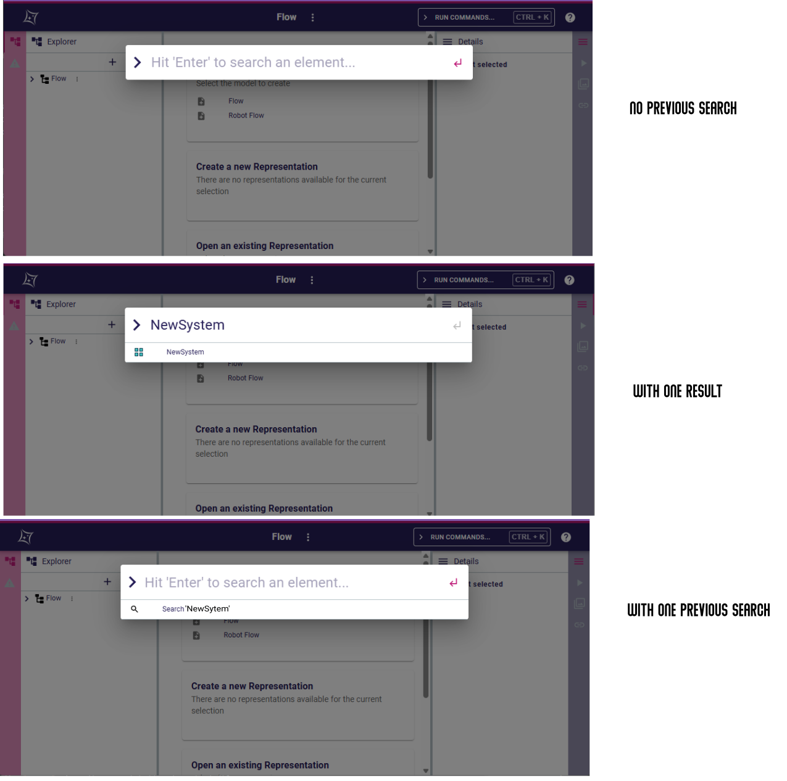

= Add support for search history

== Problem

Users would like to have quick access to their previous searches.

== Key Result

- Once a user select the "search" command in the omnibox, the previous searches should be displayed.
- It should be easy for a user to re-run a previous search by clicking on the suggested items.
- Only the last 10 searches will be kept.

=== Acceptance Criteria

- A Cypress test should leverage the new functionality and validate the whole user experience.

== Solution

=== Scenario

=== Run same searches twice

* The user open the "search" command in the omnibox.
* The user inputs a search let's say "XXX", and see the result.
* The user select the result, it is displayed in the explorer.
* The user open the "search" command in the omnibox.
* An item "Search 'XXX'" is displayed.
* The user select that item.
** The input field is filled with "XXX".
** The search is run and the result are displayed.
* The user click on the result, it is displayed in the explorer.
* The close the navigator.
* The reopen a project.
* The user open the "search" command in the omnibox.
* An item "Search 'XXX'" is displayed.

=== Breadboarding

=== Cutting backs

== Rabbit holes

== No-gos

